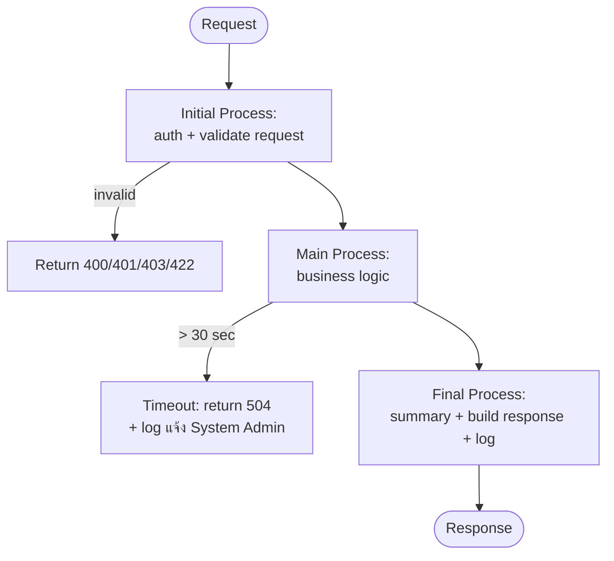

# Interface Design Template — (2) API (RESTful Standard)

> ใช้กับ interface ที่เชื่อมต่อแบบ API — ยึด RESTful standard (resource-based URL, HTTP method ตาม semantic, JSON, standard status code)
> Processing Logic ต้องแบ่งเป็น 3 ส่วนเสมอ: **Initial Process → Main Process → Final Process**
> **กฎ Timeout (บังคับทุก API):** ถ้าทำงานเกิน **30 วินาที** ให้ timeout ทันที + เขียน log แจ้ง System Admin พร้อมรายละเอียด error (ดู section 8.4)

---

```markdown
---
function_id: "IF-[NNN]"
function_name: "[API Name]"
category: "Interface — API (RESTful)"
direction: "[Inbound / Outbound]"
version: "1.0"
status: "Draft"
author: ""
last_updated: ""
---

# IF-[NNN] — [API Name]

## 1. Overview

| รายการ | รายละเอียด |
| --- | --- |
| Function ID | IF-[NNN] |
| API Name | [ชื่อ API] |
| Category | Interface — API (RESTful) |
| Direction | [Inbound / Outbound / Bidirectional] |
| Description | [อธิบาย API] |
| Source System | [ระบบที่เรียก] |
| Destination System | [ระบบที่ถูกเรียก] |
| Related Requirement IDs | [SIR-xxx, SFR-xxx, IF-xxx] |
| Source Reference | [SRS section ที่อ้างอิง] |
| Document No | [เลขเอกสาร เช่น HAS-XXX-FNC-YYYYNNN] |
| Project / System / Team | [Project Name / System Name / Team Name] |
| Phase | [Design / Development / ...] |

## 2. Business Purpose

[ทำไม API นี้ถึงมีอยู่ — อ้างอิง BRD/SRS]

## 3. API Description (RESTful)

| รายการ | รายละเอียด |
| --- | --- |
| Protocol | HTTPS |
| Method | [GET / POST / PUT / PATCH / DELETE — ตาม REST semantic] |
| URL (QA) | [https://qa.example.com/api/v1/resource] |
| URL (PROD) | [https://www.example.com/api/v1/resource] |
| URL (Internal/Local) | [ระบุถ้ามี network path แยก เช่น NMT Local — ถ้ายังไม่ทราบให้ใส่ TBD] |
| Endpoint | [/api/v1/resource/{id} — resource-based, plural noun] |
| Format / Length | [JSON / ระบุ length limit ถ้ามี] |
| Content-Type | application/json |
| Authentication | [Bearer Token / OAuth 2.0 / API Key] |
| Rate Limit | [requests per minute] |
| **Timeout** | **30 วินาที (บังคับ)** — เกินแล้ว timeout + log แจ้ง System Admin |
| Retry Policy | [จำนวนครั้ง, backoff strategy] |
| API Version | [v1 — ระบุใน URL path] |

## 4. Request Specification

### 4.1 Headers

| Header | Value | Required | Description |
| --- | --- | --- | --- |
| Content-Type | application/json | Y | Request body format |
| Authorization | Bearer {token} | Y | Authentication token |
| X-Correlation-ID | {uuid} | Y | Tracking ID สำหรับ log |

### 4.2 Webservice Parameters (Wrapper Layer)

> ใช้เฉพาะ API แบบ wrapper ที่ห่อ JSON payload ไว้ใน parameter (เช่น `jsonText` + `token`) — API ที่ส่ง JSON body ตรง ๆ ให้ตัด section นี้ออก

| No | Parameter | Data Type | Root | Length | Remarks |
| :---: | --- | --- | --- | --- | --- |
| 1 | jsonText | String | Root | Unlimited | Refer to Request Json parameter |
| 2 | token | String | Root | [100] | [Authentication token] |

### 4.3 Path / Query Parameters

| Parameter | Location | Data Type | Required | Default | Description |
| --- | --- | --- | --- | --- | --- |
| | [Path / Query] | | | | |

### 4.4 Request Body

```json
{
  "field_1": "string",
  "field_2": 0
}
```

### 4.5 Request Field Mapping

> **Root** = parent node ของ field (field ระดับบนสุดใส่ `Root`, field ที่อยู่ใน nested object/array ใส่ชื่อ parent เช่น `Layout_Flag`) — **Length** บังคับระบุทุก field
> **Validation** ต้องระบุครบ: (1) rule ที่ตรวจ (required, max length, format, ตรวจกับ table ไหน + condition) และ (2) **error code เมื่อ fail** (ต้องมีใน Error Message Catalog section 8.5) — เช่น `ตรวจ appKey กับ CMS_systems (_id = appKey) → ไม่พบ = ERR0011`

| No | Field | Data Type | Root | Length | Required | Validation (rule + error code) | DB Mapping (Table.Column) | Description |
| :---: | --- | --- | --- | --- | --- | --- | --- | --- |
| 1 | | | Root | | | | | |

## 5. Response Specification

### 5.1 Success Response

```json
{
  "status": "success",
  "code": "200",
  "message": "Operation completed successfully",
  "data": {},
  "summary": {
    "total_records": 0,
    "success_records": 0,
    "failed_records": 0
  },
  "timestamp": "2026-07-09T10:30:00+07:00"
}
```

> `summary` บังคับสำหรับ API ที่ประมวลผลหลาย record (bulk/batch API) — API แบบ single record ให้ตัด `summary` ออกได้

### 5.2 Error Response

```json
{
  "status": "error",
  "code": "ERR_CODE",
  "message": "Error description",
  "errors": [
    { "field": "field_name", "message": "Validation error detail" }
  ],
  "timestamp": "2026-07-09T10:30:00+07:00"
}
```

### 5.3 Response Field Mapping

> ระบุ Root + Length ทุก field เช่นเดียวกับ request — field ประเภท flag ให้ระบุ convention ของค่าใน Description (เช่น `1: Yes, -1: No, blank: Not use`) และ date field ให้ระบุ format (เช่น `YYYYMMDDHHMMSS`)
> **DB Mapping** ระบุ Table.Column ต้นทางของค่า — ถ้าค่ามาจากหลาย table ตามเงื่อนไข ให้เขียน condition กำกับ (เช่น `UPDATE_DATE >= config → Consent_Central_TR, else → Consent_Details_TR`) — ค่า fix ใส่ `Fix: "ค่า"`

| No | Field | Data Type | Root | Length | DB Mapping (Table.Column) | Description |
| :---: | --- | --- | --- | --- | --- | --- |
| 1 | status | String | Root | 10 | Fix | success / error |
| 2 | code | String | Root | 20 | Fix / Error Catalog | HTTP status code หรือ error code |
| 3 | message | String | Root | 100 | Error Catalog (8.5) | ข้อความอธิบาย (format: `Error Code-Error message`) |
| 4 | data | Object | Root | — | [Table.Column] | ข้อมูลผลลัพธ์ (เฉพาะ success) |
| 5 | summary | Object | Root | — | นับจาก processing | Total/Success/Failed record counts (เฉพาะ bulk API) |
| 6 | errors | Array | Root | — | — | รายละเอียด error (เฉพาะ error) |
| 7 | timestamp | DateTime | Root | — | System datetime | ISO 8601 |

> **กฎ fail response:** ทุกกรณี fail ต้องตอบ **field ครบทุกตัว** ตามตารางนี้ — field ที่ไม่มีค่าใส่ blank (`""`) ห้ามตัด field ออก และต้อง set error flag แยกประเภท: validation error กับ system/exception error

## 6. HTTP Status Codes

| Status Code | Meaning | เมื่อใดที่ใช้ |
| --- | --- | --- |
| 200 | OK | สำเร็จ (GET / PUT / PATCH / DELETE) |
| 201 | Created | สร้าง resource สำเร็จ (POST) |
| 207 | Multi-Status | Bulk API สำเร็จบางส่วน (partial success) |
| 400 | Bad Request | Request ไม่ถูกต้อง / validation fail |
| 401 | Unauthorized | Authentication ล้มเหลว |
| 403 | Forbidden | ไม่มีสิทธิ์เข้าถึง |
| 404 | Not Found | ไม่พบ resource |
| 409 | Conflict | ข้อมูลซ้ำ / state conflict |
| 422 | Unprocessable Entity | Business rule validation fail |
| 429 | Too Many Requests | เกิน rate limit |
| 500 | Internal Server Error | ระบบผิดพลาด |
| 504 | Gateway Timeout | ประมวลผลเกิน 30 วินาที (ดู 8.4) |

## 7. Processing Logic

### Process Flow Diagram



### 7.1 Initial Process

จุดประสงค์: ตรวจสอบความถูกต้องของ request ก่อนเข้า business logic — fail ที่ขั้นนี้ตอบ error ทันที ไม่เข้า Main Process

| Step | รายละเอียด | กรณี Fail |
| :---: | --- | --- |
| 1 | ตรวจสอบ Authentication (token valid, ไม่หมดอายุ) | 401 |
| 2 | ตรวจสอบ Authorization (role/permission) | 403 |
| 3 | Validate request format: required field, data type, format | 400 พร้อม errors array |
| 4 | Validate business precondition: [เช่น resource มีอยู่, state ถูกต้อง] | 404 / 409 / 422 |
| 5 | เริ่มจับเวลา processing (สำหรับ timeout 30 วินาที) + log request (Correlation ID) | — |
| 6 | (Bulk API) นับ Total Records จาก request | — |

### 7.2 Main Process

จุดประสงค์: business logic หลักของ API

**กฎ Case Branching:** ทุก step ที่ query/access database ต้องระบุผลลัพธ์ครบ 3 case และ route ไป sub-process มาตรฐาน (7.4) เสมอ:

| Case | Route ไป |
| --- | --- |
| Case exist / pass | step ถัดไป หรือ Process Success (7.4.1) |
| Case not exist / not pass | Process Validation Fail (7.4.2) |
| Case exception error | Process Exception Fail (7.4.3) |

**กฎ DB Query Spec:** ทุก step ที่ query ต้องระบุ 3 ส่วน: **Table** (table + column ที่ใช้), **Condition** (where clause อ้างอิง field จาก request หรือผล step ก่อนหน้า เช่น `F_NAME = request.F_Name (Item No.3)`), **Order by** (ถ้าเอา record ล่าสุด/แรกสุด)

| Step | รายละเอียด | Table / Condition / Order by | กรณี Fail |
| :---: | --- | --- | --- |
| 1 | [ประมวลผลตาม business rule BR-xxx] | | [4xx/5xx ตามกรณี] |
| 2 | [Insert / Update / Query] | [Table + Condition + Order by] | Case branching ตามกฎข้างบน |
| 3 | (Bulk API) วน loop ทีละ record: record ที่ fail นับเป็น Failed Record + เก็บ error detail แล้วทำต่อ | | นับ Failed → record ถัดไป |
| 4 | [เรียก external service ถ้ามี] | | ตาม Error Handling section 8 |

### 7.3 Final Process

จุดประสงค์: สรุปผลและตอบกลับ — **bulk API ต้องสรุปจำนวน record เสมอ**

| Step | รายละเอียด |
| :---: | --- |
| 1 | สรุป Processing Summary: **Total Records / Success Records / Failed Records** (Total = Success + Failed) |
| 2 | บันทึก processing log: Correlation ID, endpoint, duration, summary, ผลลัพธ์ |
| 3 | สร้าง response ตาม section 5 (partial success → 207 พร้อม errors array ของ record ที่ fail) |
| 4 | ส่ง notification/alert ถ้าเข้าเงื่อนไข Monitoring (section 11) |

### 7.4 Standard Sub-Processes (ทางออกมาตรฐาน 3 ทาง)

ทุก API ต้องนิยาม sub-process 3 ตัวนี้ — ทุก branch ใน Main Process ต้องจบที่ตัวใดตัวหนึ่ง:

| Sub-Process | ขั้นตอน |
| --- | --- |
| **7.4.1 Process Success** | (1) เขียน process log (step, Status=Success) → (2) สร้าง response ครบทุก field พร้อม DB mapping ตาม 5.3 → (3) เขียน log end process → (4) End |
| **7.4.2 Process Validation Fail** | (1) เขียน process log (Status=Failed + error code) → (2) ตอบ fail response ครบทุก field (blank) + error flag = validation → (3) เขียน log end process → (4) End |
| **7.4.3 Process Exception Fail** | (1) เขียน process log (Status=Failed + error message จาก exception) → (2) ตอบ fail response ครบทุก field (blank) + error flag = system error → (3) เขียน log end process → (4) End |

### 7.5 Process Logging (บังคับ)

เขียน log ลง table [process log table เช่น `XXX_Processlog`] ที่ 3 จุดเป็นอย่างน้อย: **เริ่ม process** ("Start process") / **ทุก step สำคัญ** (ทั้ง pass และ fail) / **จบ process** (Status ตามผลลัพธ์) — โครง log record:

| No | Field | Data Source | Value |
| :---: | --- | --- | --- |
| 1 | ID | — | Running number |
| 2 | Program ID | Fix | "[Function ID]" |
| 3 | Caller/Source | Parameter from sender | [ระบบ/user ที่เรียก] |
| 4 | Person/Key ID | Parameter from sender | [key หลักของ request เช่น F_Name + " " + L_Name] |
| 5 | Date_Time | — | System datetime |
| 6 | Title | Fix | [ชื่อ step เช่น "Check validation", "Query Consent Header"] |
| 7 | Ref_ID | [Table] | [record ID ที่เกี่ยวข้อง — ถ้าไม่มีใส่ ""] |
| 8 | Status | Fix | "Success" / "Failed" |
| 9 | Message | Error Catalog (8.5) | [error code + message กรณี Failed — blank กรณี Success] |

## 8. Error Handling

| Error Case | HTTP Status | System Behavior | Recovery |
| --- | --- | --- | --- |
| Invalid request | 400 | Return validation errors | Client แก้ไข request |
| Auth failure | 401 / 403 | Return error + log | Client ตรวจสอบ credentials |
| Not found | 404 | Return not found | Client ตรวจสอบ ID |
| Business rule fail | 422 | Return rule violation detail | Client แก้ไขข้อมูล |
| Server error | 500 | Log full error + return generic message (ไม่เปิดเผย internal detail) | Admin ตรวจสอบ log |
| **Processing เกิน 30 วินาที** | **504** | ดู 8.4 | Admin ตรวจสอบ + client retry ตาม policy |

### 8.4 Timeout Handling (บังคับ)

เมื่อ API ทำงานเกิน **30 วินาที**:

1. ยกเลิกการประมวลผล (cancel/abort) และ rollback transaction ที่ค้างอยู่
2. ตอบ client ด้วย HTTP **504 Gateway Timeout** ตาม error response format
3. เขียน log ระดับ **ERROR** เพื่อแจ้ง **System Admin** โดยต้องมีรายละเอียดครบ:

| Log Field | รายละเอียด |
| --- | --- |
| Timestamp | เวลาที่เกิด timeout (ISO 8601) |
| Correlation ID | X-Correlation-ID ของ request |
| Endpoint + Method | endpoint และ HTTP method ที่เรียก |
| Caller | ระบบ/user ที่เรียก |
| Request Summary | request parameter หลัก (mask ข้อมูล sensitive) |
| Elapsed Time | เวลาที่ใช้ไปก่อน timeout |
| Processing Step | ขั้นตอนสุดท้ายที่ทำอยู่ตอน timeout (Initial/Main/Final + step) |
| Error Detail | error message + stack trace |

4. ส่ง alert ไปยัง System Admin ตามช่องทางใน section 11

### 8.5 Error Message Catalog (บังคับ)

รวม error code ทุกตัวที่ API นี้ใช้ — ทุก error code ที่อ้างใน section 4.5 (Validation), 7.4, 7.5 ต้องมีในตารางนี้ แบ่งตามประเภท:

| ประเภท | Error Code | Message |
| --- | --- | --- |
| Validation error | ERR-[xxx] | [เช่น Invalid Application Key / Invalid parameter format (Required or Length) / No data existed.] |
| Validation error | ERR-[xxx] | |
| Exception error | [system error code] | [System error message — ตามที่ระบบ throw] |

## 9. Business Rules

| Rule ID | Business Rule | Impact | Source |
| --- | --- | --- | --- |
| BR-IF[NNN]-001 | [อธิบาย rule] | [ผลกระทบ] | [SFR-xxx / BRD BR-xxx] |

## 10. Security

| รายการ | รายละเอียด |
| --- | --- |
| Authentication | [วิธี authentication] |
| Authorization | [Role/Permission ที่ต้องมี] |
| Encryption | TLS 1.2+ |
| Input Validation | [Sanitization rules] |
| Rate Limiting | [Limit per client/IP] |
| Logging | [ข้อมูลที่ log / ข้อมูลที่ mask เช่น token, ข้อมูลส่วนบุคคล] |

## 11. Monitoring & Alerting

| Event | Alert Channel | Recipient | เนื้อหา |
| --- | --- | --- | --- |
| Timeout (> 30 วินาที) | [Email / Dashboard] | System Admin | Log detail ตาม 8.4 |
| Error rate สูงผิดปกติ | [Email] | System Admin | Endpoint + error summary |
| (Bulk API) Failed Records > 0 | [Email / Dashboard] | [Admin] | Summary (Total/Success/Failed) + error report |

## 12. Example Request / Response

> ต้องมีอย่างน้อย 2 sample: **Success** และ **Error** — response ทั้งสองกรณีต้องแสดง field ครบทุกตัวตาม 5.3 (กรณี error ให้ field ที่ไม่มีค่าเป็น `""` ไม่ใช่ตัด field ออก)

### Example 1: Success

**Request:**
```http
POST /api/v1/resource HTTP/1.1
Host: api.example.com
Content-Type: application/json
Authorization: Bearer eyJhbGci...
X-Correlation-ID: 7f9c1e2a-...

{ "field_1": "value_1" }
```

**Response:**
```http
HTTP/1.1 201 Created
Content-Type: application/json

{
  "status": "success",
  "code": "201",
  "message": "Created successfully",
  "data": { "id": "RES-001" },
  "timestamp": "2026-07-09T10:30:00+07:00"
}
```

### Example 2: Timeout (> 30 วินาที)

**Response:**
```http
HTTP/1.1 504 Gateway Timeout
Content-Type: application/json

{
  "status": "error",
  "code": "TIMEOUT",
  "message": "Processing exceeded 30 seconds. The incident has been logged and reported to the system administrator.",
  "errors": [],
  "timestamp": "2026-07-09T10:30:45+07:00"
}
```

## 13. Notes / Assumptions

| ประเภท | รายละเอียด | ผลกระทบ |
| --- | --- | --- |
| | | |

## Approvals

| Version | Name | Position | Organization (Dept.) | Approval Date |
| --- | --- | --- | --- | --- |
| | | | | |

## Change Log

> **Field-level change tracking:** field ที่เพิ่ม/แก้ไขหลัง version แรก ให้ mark ในตาราง field mapping ด้วย `🆕`/`✏️` ท้าย field name พร้อมระบุ `[DD-MMM-YYYY Mod by ชื่อ]` ใน Description และเพิ่ม row ใน Change Log ระบุ field ที่กระทบ

| Version | Date | Author | Change Type | Description | Source |
|---------|------|--------|-------------|-------------|--------|
| 1.0 | | | Created | สร้างเอกสารครั้งแรก | |
```
