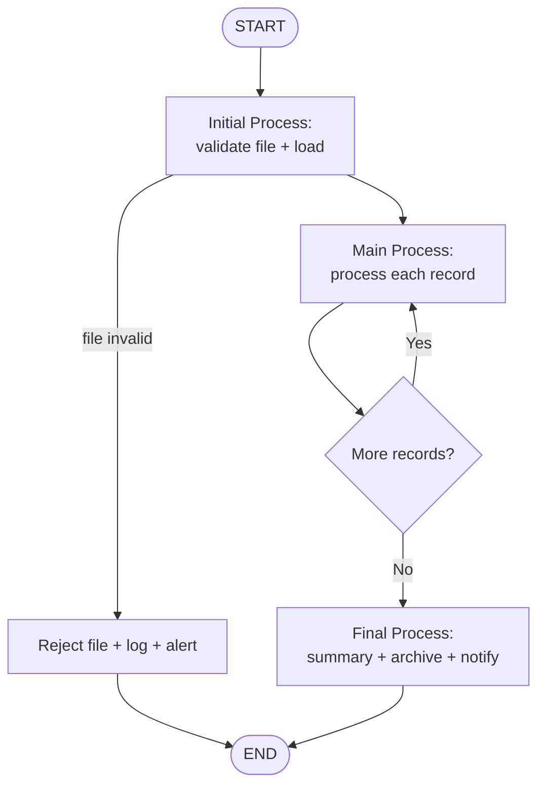

# Interface Design Template — (1) Batch File Process

> ใช้กับ interface ที่รับ/ส่งข้อมูลผ่านไฟล์ (CSV, Excel, DAT, XML) แบบ batch — ทั้ง scheduled และ manual trigger
> Processing Logic ต้องแบ่งเป็น 3 ส่วนเสมอ: **Initial Process → Main Process → Final Process**

---

```markdown
---
function_id: "IF-[NNN]"
function_name: "[Interface Name]"
category: "Interface — Batch File Process"
direction: "[Inbound / Outbound]"
version: "1.0"
status: "Draft"
author: ""
last_updated: ""
---

# IF-[NNN] — [Interface Name]

## 1. Overview

| รายการ | รายละเอียด |
| --- | --- |
| Function ID | IF-[NNN] |
| Interface Name | [ชื่อ interface] |
| Category | Interface — Batch File Process |
| Direction | [Inbound / Outbound / Bidirectional] |
| Pattern | [SFTP / Shared Folder / Browser Upload / Blob Storage] |
| Description | [อธิบาย interface] |
| Source System | [ระบบต้นทาง] |
| Destination System | [ระบบปลายทาง] |
| Related Requirement IDs | [SIR-xxx, SFR-xxx, IF-xxx] |
| Source Reference | [SRS section ที่อ้างอิง] |

## 2. Business Purpose

[ทำไม interface นี้ถึงมีอยู่ — อ้างอิง BRD/SRS]

## 3. Interface Description

| รายการ | รายละเอียด |
| --- | --- |
| Protocol | [SFTP / Shared Folder / HTTP Upload] |
| Authentication | [SSH Key / Username-Password / Session] |
| Frequency | [Daily Batch / Manual Batch / Event-driven] |
| Schedule | [เวลาที่ทำงาน เช่น ทุกวัน 02:00 ICT] |
| Timeout | [ต้องเสร็จภายในเวลา] |
| Retry Policy | [จำนวนครั้ง, interval, escalation] |

## 4. File Specification

### 4.1 File Format

| รายการ | รายละเอียด |
| --- | --- |
| File Format | [CSV / Excel / Fixed-width / XML / JSON] |
| Encoding | [UTF-8 / TIS-620] |
| Delimiter | [Comma / Tab / Pipe] |
| Header Row | [Yes / No] |
| Max File Size | [ขนาดสูงสุด] |
| Max Records | [จำนวน record สูงสุดต่อไฟล์] |

### 4.2 File Naming Convention

| รายการ | รายละเอียด |
| --- | --- |
| Pattern | [PREFIX_YYYYMMDD_HHMMSS.ext] |
| Example | [EMP_20260709_020000.csv] |

### 4.3 File Path

| รายการ | Path |
| --- | --- |
| Source Path | [/outbound/[system]/] |
| Destination Path | [/inbound/[system]/] |
| Archive Path | [/archive/[system]/YYYYMMDD/] |
| Error Path | [/error/[system]/YYYYMMDD/] |

## 5. Data Mapping

| No | Source Field | Dest Field (Table.Column) | Data Type | Length | Required | Default | Transformation / Validation |
| :---: | --- | --- | --- | --- | --- | --- | --- |
| 1 | | | | | | | |

### Sample Data

```text
[ตัวอย่างข้อมูลในไฟล์ 2-3 แถว]
```

## 6. Trigger / Timing

| Trigger | Description | Timing |
| --- | --- | --- |
| [Scheduled / Event / Manual] | [คำอธิบาย] | [เวลา/เงื่อนไข] |

## 7. Processing Logic

### Process Flow Diagram



### 7.1 Initial Process

จุดประสงค์: เตรียมความพร้อมก่อนประมวลผลข้อมูล — ถ้าขั้นนี้ fail ให้จบการทำงานทั้งไฟล์ (ไม่เข้า Main Process)

| Step | รายละเอียด | กรณี Fail |
| :---: | --- | --- |
| 1 | ตรวจสอบว่ามีไฟล์ใน source path / รับไฟล์จากผู้ใช้ | Log + alert "file not found" → END |
| 2 | ตรวจสอบ file naming convention | Reject file → Error Path + log → END |
| 3 | ตรวจสอบ file format / encoding / header | Reject file → Error Path + log → END |
| 4 | ตรวจสอบไฟล์ซ้ำ (duplicate file) | Reject file + log → END |
| 5 | นับจำนวน record ทั้งหมด (Total Records) และบันทึกลง processing log | — |
| 6 | โหลดข้อมูลเข้า staging table | Rollback + log → END |

### 7.2 Main Process

จุดประสงค์: ประมวลผลทีละ record — record ที่ fail ให้ skip + log แล้วทำ record ถัดไปต่อ (ไม่หยุดทั้งไฟล์)

| Step | รายละเอียด | กรณี Fail |
| :---: | --- | --- |
| 1 | อ่าน record จาก staging table | — |
| 2 | Validate ระดับ record: [required field, format, master data lookup] | นับเป็น Failed Record → log error พร้อม row number + เหตุผล → record ถัดไป |
| 3 | Validate ระดับ business rule: [BR-xxx] | นับเป็น Failed Record → log → record ถัดไป |
| 4 | Insert / Update / Upsert ลง [Table] | นับเป็น Failed Record → rollback record นั้น + log → record ถัดไป |
| 5 | นับเป็น Success Record | — |

**Validation Rules (ระดับ record):**

| No | Field | Rule | Error Message | Source |
| :---: | --- | --- | --- | --- |
| 1 | | | | |

### 7.3 Final Process

จุดประสงค์: สรุปผลการทำงานและปิดรอบ — **ต้องสรุปจำนวน record เสมอ**

| Step | รายละเอียด |
| :---: | --- |
| 1 | สรุปผลการประมวลผล (Processing Summary — ดูตารางด้านล่าง) และบันทึกลง processing log |
| 2 | สร้าง error report สำหรับ record ที่ fail (row number + field + เหตุผล) |
| 3 | ย้ายไฟล์ไป Archive Path (สำเร็จ/partial) หรือ Error Path (fail ทั้งไฟล์) |
| 4 | ส่ง notification สรุปผลไปยัง [ผู้รับ] ตาม Monitoring & Alerting |
| 5 | ลบ/เคลียร์ staging data ตาม retention policy |

**Processing Summary (บังคับ):**

| รายการ | คำอธิบาย |
| --- | --- |
| Total Records | จำนวน record ทั้งหมดในไฟล์ |
| Success Records | จำนวน record ที่ประมวลผลสำเร็จ |
| Failed Records | จำนวน record ที่ไม่สำเร็จ (Total = Success + Failed เสมอ) |
| Start Time / End Time / Duration | เวลาเริ่ม-จบ-รวม |
| Processing Status | Success / Partial Success / Failed |

## 8. Expected Result

| Scenario | เงื่อนไข | Expected Result |
| --- | --- | --- |
| Success | Failed Records = 0 | [ผลลัพธ์] |
| Partial Success | Success > 0 และ Failed > 0 | [ผลลัพธ์ + error report] |
| Failure | Initial Process fail หรือ Success = 0 | [ผลลัพธ์ + alert] |

## 9. Error Handling

| Error Case | Process ที่เกิด | System Behavior | Recovery |
| --- | --- | --- | --- |
| File not found | Initial | Log + alert | Source system ส่งไฟล์ใหม่ |
| File format invalid | Initial | Reject file → Error Path + alert | แก้ไขไฟล์แล้วส่งใหม่ |
| Record validation fail | Main | Skip record + log (นับ Failed) | แก้ไข record แล้ว reprocess |
| DB error ระหว่างประมวลผล | Main | Rollback record + log | Admin ตรวจสอบ |
| Summary/archive fail | Final | Log + alert admin | Admin ตรวจสอบ manual |

## 10. Business Rules

| Rule ID | Business Rule | Impact | Source |
| --- | --- | --- | --- |
| BR-IF[NNN]-001 | [อธิบาย rule] | [ผลกระทบ] | [SFR-xxx / BRD BR-xxx] |

## 11. Monitoring & Alerting

| Event | Alert Channel | Recipient | เนื้อหา |
| --- | --- | --- | --- |
| Processing complete | [Email / Dashboard] | [Admin] | Processing Summary (Total/Success/Failed) |
| Processing failed | [Email] | [Admin / On-call] | Error detail + log reference |
| File not received | [Email] | [Source system contact] | ชื่อไฟล์ + schedule ที่คาด |

## 12. Notes / Assumptions

| ประเภท | รายละเอียด | ผลกระทบ |
| --- | --- | --- |
| | | |

## Change Log

| Version | Date | Author | Change Type | Description | Source |
|---------|------|--------|-------------|-------------|--------|
| 1.0 | | | Created | สร้างเอกสารครั้งแรก | |
```
