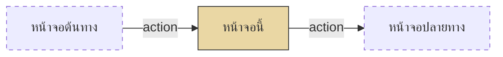

<!--
Template สำหรับ Screen Design Document (1 SF = 1 ไฟล์)
- Copy โครงสร้างนี้ทั้งหมด แล้วแทนที่ [placeholder] ด้วยข้อมูลจริง
- ห้ามลบ / สลับ / เปลี่ยนชื่อ section — section ที่ไม่เกี่ยวข้องให้ใส่ "— ไม่มี" พร้อมเหตุผลสั้น ๆ
- คอลัมน์ในตารางห้ามตัดออก ถ้าไม่มีข้อมูลให้ใส่ "—"
- อ้างอิงจาก 80-knowledge-base/functional-design/02-screen-functions/output-template.md ปรับให้ตรงกับโปรเจกต์นี้ (SF prefix, DB Mapping, Validation Order)
-->
---
function_id: "SF-[NNN]"
function_name: "[Function Name]"
category: "Screen"
screen_type: "[Create Form / Edit Form / CRUD Master Data / Search & Action Form / Approval Worklist / Search List / Detail View / Dashboard]"
version: "1.0"
status: "Draft"
author: "screen-design-agent (Claude)"
last_updated: "[YYYY-MM-DD]"
---

# SF-[NNN] — [Function Name]

## 1. Overview

| รายการ | รายละเอียด |
| --- | --- |
| Function ID | SF-[NNN] |
| Function Name | [ชื่อ function] |
| Category | Screen |
| Screen Type | [ประเภทหน้าจอ] |
| Description | [อธิบายสิ่งที่หน้าจอทำ 1-2 ประโยค] |
| Actor / User Role | [ผู้ใช้งาน] |
| Related Requirement IDs | [SFR-xxx, VR-xxx, SCR-xxx] |
| Source Reference | [Screen SRS §x.x (SF-NNN), SRS §x.x, BRD BR-xxx] |
| Version | 1.0 |
| Created By | screen-design-agent ([YYYY-MM-DD]) |
| Updated By | — |

## 2. Business Purpose

[เหตุผลทางธุรกิจที่หน้าจอนี้มีอยู่ — ปิดท้ายด้วย (Source: ...)]

## 3. Screen Overview

| รายการ | รายละเอียด |
| --- | --- |
| Screen Name | [ชื่อหน้าจอ (SCR-xxx)] |
| Menu Path | [Main Menu > ... > หน้าจอนี้] |
| Navigation Inbound | [เข้ามาจากหน้าไหน + trigger] |
| Navigation Outbound | [ออกไปหน้าไหน + เงื่อนไข] |
| Preconditions | [เงื่อนไขก่อนใช้งาน] |
| Postconditions | [ผลลัพธ์หลังใช้งานสำเร็จ รวม DB state + notification] |

### Related Screens

| Screen ID | Screen Name | Description |
| --- | --- | --- |
| [SCR-xxx] | [ชื่อ] | [ความเกี่ยวข้อง] |

### Screen Flow

```text
Main Menu
  └── [Screen ต้นทาง]
        └── [Action] → SF-[NNN] [หน้าจอนี้]
              ├── [Action 1] → [ปลายทาง]
              └── [Action 2] → [ปลายทาง]
```



## 4. Mockup / UI Layout

| รายการ | รายละเอียด |
| --- | --- |
| Mockup Reference | [path ไปยัง mockup — ถ้าไม่มีให้ระบุว่า ASCII ด้านล่างเป็น Assumption] |
| Layout Description | [อธิบาย layout จาก SRS] |

```text
[ASCII mockup]
```

## 5. Fields Definition

<!-- แบ่ง sub-section (5.1, 5.2, ...) ตาม screen area — คอลัมน์ DB Mapping บังคับ ใช้ชื่อจริงจาก Data Architecture เท่านั้น -->

### 5.1 [Section Name]

| No | Field Name | Label (TH/EN) | Type | Length | Required | Default | Validation | DB Mapping | Description |
| :---: | --- | --- | --- | --- | --- | --- | --- | --- | --- |
| 1 | [field] | [TH / EN] | [Type] | [len หรือ —] | [Y/N/Conditional] | [ค่า หรือ —] | [กฎ + VR-xxx] | [`Table.Column` (type)] | [คำอธิบาย] |

## 6. Commands / Actions

| No | Command | Type | Default State | Trigger Condition | System Response |
| :---: | --- | --- | --- | --- | --- |
| 1 | [ปุ่ม] | Button | [Enable/Disable] | [เงื่อนไข] | [รวมชื่อ service method ที่เรียก เช่น `IXxxService.XxxAsync()`] |

## 7. Screen Behavior

### 7.1 Initial Screen (onLoad)

- [default state, ข้อมูลที่โหลด, field ที่ซ่อน]

### 7.x [Event อื่น ๆ — onChange, toggle, click ตาม SRS Screen Behavior]

- [พฤติกรรม + requirement id]

### 7.x Click "[ปุ่มหลัก]"

#### 7.x.1 Validation (ตามลำดับใน service method)

| ลำดับ | Validation | Requirement | Error Message |
| :---: | --- | --- | --- |
| 1 | [กฎ] | [VR-xxx] | [ERR-xxx] |

#### 7.x.2 Insert / Update (DB Transaction ถ้ามี)

```text
BEGIN TRANSACTION
  [INSERT/UPDATE statements ระดับ pseudo — ใช้ชื่อตาราง/คอลัมน์จริง]
COMMIT

AFTER COMMIT: [notification / side effect]
```

## 8. Business Rules

| Rule ID | Business Rule | Impact | Source Reference |
| --- | --- | --- | --- |
| BR-SF[NNN]-001 | [กฎ] | [ผลต่อหน้าจอ/validation] | [BRD BR-xxx, VR-xxx] |

<!-- ใส่ decision tree เมื่อ logic ซับซ้อน (หลายเงื่อนไขซ้อน) -->

```text
[decision tree ถ้าจำเป็น]
```

## 9. Message List

### Error Messages

<!-- Message ที่ SRS กำหนดแล้ว: ใช้ ID ตาม SRS (เช่น ERR-LR-001) — Message ใหม่: ERR-SF[NNN]-nnn -->

| Message ID | Trigger | Message (TH) | Message (EN) |
| --- | --- | --- | --- |
| [ID] | [เงื่อนไข + VR-xxx] | [TH] | [EN] |

### Success / Info Messages

| Message ID | Trigger | Message (TH) | Message (EN) |
| --- | --- | --- | --- |
| [ID] | [เงื่อนไข] | [TH] | [EN] |

## 10. Popup / Sub-screen Definition

<!-- ถ้าไม่มี popup: "— ไม่มี" -->

### 10.1 [Popup Name]

| No | Field Name | Label | Data Source | Description |
| :---: | --- | --- | --- | --- |
| 1 | [field] | [label] | [source] | [คำอธิบาย] |

## 11. Database Tables Reference

| Table Name | Alias | Description |
| --- | --- | --- |
| [Table] | — | [ใช้ทำอะไรในหน้านี้: SELECT/INSERT/UPDATE + เงื่อนไข] |

## 12. Exception Handling

| Error Case | Trigger Condition | System Behavior | User Message | Recovery |
| --- | --- | --- | --- | --- |
| Validation error | [เงื่อนไข] | [พฤติกรรม] | [message id] | [วิธีแก้] |
| Integration error | [เงื่อนไข] | [พฤติกรรม] | [message id] | [วิธีแก้] |
| System error | [เงื่อนไข] | [พฤติกรรม] | [message id] | [วิธีแก้] |

## 13. Notes / Assumptions

<!-- ทุกสิ่งที่เติมเองนอกเหนือจาก SRS ต้องอยู่ที่นี่ — แยกประเภท: Open Issue (จาก SRS) / Assumption (จาก SRS) / Assumption (เอกสารนี้) / Note -->

| ประเภท | รายละเอียด | ผลกระทบ |
| --- | --- | --- |
| [ประเภท] | [รายละเอียด] | [ผลกระทบ + สิ่งที่ต้อง confirm] |

## Change Log

| Version | Date | Author | Change Type | Description | Remark |
| --- | --- | --- | --- | --- | --- |
| 1.0 | [YYYY-MM-DD] | screen-design-agent (Claude) | Created | สร้างเอกสารครั้งแรกจาก [Screen SRS vX.X (§x.x SF-NNN), input อื่นที่ใช้] | Generated ตาม template screen-design-agent |

### สรุปการเปลี่ยนแปลงสำคัญ

| ช่วง Version | การเปลี่ยนแปลง | ผลกระทบ |
| --- | --- | --- |
| 1.0 | Baseline แรก | — |
