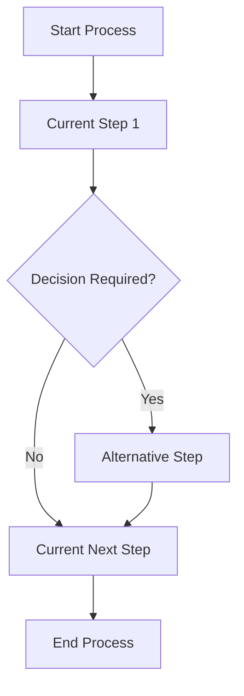

# Business Requirement Document: [ชื่อโครงการ / ชื่อกระบวนการ]

## 1. วัตถุประสงค์ของเอกสาร

- อธิบายเป้าหมายทางธุรกิจของงานนี้
- อธิบายว่าทำไมต้องเปลี่ยนแปลงกระบวนการทำงาน
- ระบุผลลัพธ์ทางธุรกิจที่คาดหวัง

## 2. ภูมิหลังและปัญหาภาพรวม

- [สรุปภาพรวมของบริบทของงานหรือสถานการณ์ปัจจุบัน]
- [อธิบายภาพรวมของ pain point หรือข้อจำกัดของการทำงานแบบเดิม]
- [อธิบายภาพรวมของเหตุผลที่ทำให้ต้องเริ่มโครงการหรือปรับปรุงกระบวนการ]

## 3. ขอบเขตเชิงธุรกิจ

### 3.1 In Business Scope

- [รายการที่อยู่ในขอบเขต]

### 3.2 Out of Business Scope

- [รายการที่อยู่นอกขอบเขต]

## 4. ผู้ใช้งานและบทบาท (Actors)

| Actor               | บทบาท                                              | สิทธิ์หลัก                   | แหล่งที่มาของข้อมูล  |
| ------------------- | ------------------------------------------------------- | -------------------------------------- | --------------------------------------- |
| [เช่น Employee] | [เช่น ผู้ยื่นคำขอ]                       | [สิทธิ์หลักที่ทำได้] | [เช่น workshop, policy, transcript] |
| [เช่น Manager]  | [เช่น ผู้อนุมัติ]                         | [สิทธิ์หลักที่ทำได้] | [เช่น workshop, policy, transcript] |
| [เช่น HR]       | [เช่น ผู้ติดตามและดูแลข้อมูล] | [สิทธิ์หลักที่ทำได้] | [เช่น workshop, policy, transcript] |

## 5. Requirement

### 5.1 As-Is Business Flow

อธิบายขั้นตอนการทำงานปัจจุบัน โดยเน้นงานที่ทำจริงทั้งในระบบและนอกระบบ

As-Is Operation Flow Diagram

| ลำดับ | ผู้เกี่ยวข้อง | ขั้นตอนการทำงานปัจจุบัน | ใช้ระบบหรือไม่    | ปัญหาที่พบ |
| ---------- | -------------------------- | ---------------------------------------------- | ------------------------------- | -------------------- |
| 1          | [บทบาท]               | [ขั้นตอน]                               | [ในระบบ / นอกระบบ] | [ปัญหา]         |
| 2          | [บทบาท]               | [ขั้นตอน]                               | [ในระบบ / นอกระบบ] | [ปัญหา]         |

### 5.2 As-Is Issue, สาเหตุ และแนวทางการแก้ไขปัญหา

| ประเด็นปัญหา As-Is | สาเหตุ                   | ผลกระทบทางธุรกิจ                             | แนวทางการแก้ไขปัญหา             |
| ------------------------------ | ------------------------------ | ------------------------------------------------------------ | -------------------------------------------------- |
| [ปัญหาที่พบ]         | [สาเหตุของปัญหา] | [ผลกระทบต่อธุรกิจหรือผู้ใช้งาน] | [แนวทางแก้ไขในระดับธุรกิจ] |
| [ปัญหาที่พบ]         | [สาเหตุของปัญหา] | [ผลกระทบต่อธุรกิจหรือผู้ใช้งาน] | [แนวทางแก้ไขในระดับธุรกิจ] |

### 5.3 ประเภทของ Requirement

#### 5.3.1 Business Requirement

##### A. Business Process Flow

###### A.1 To-Be Business Flow

To-Be Operation Flow Diagram

อธิบายขั้นตอนการทำงานเป้าหมายหลังปรับปรุง

| ลำดับ | ผู้เกี่ยวข้อง | ขั้นตอนการทำงานเป้าหมาย | ใช้ระบบหรือไม่    | ผลลัพธ์ที่คาดหวัง |
| ---------- | -------------------------- | ---------------------------------------------- | ------------------------------- | ---------------------------------- |
| 1          | [บทบาท]               | [ขั้นตอน]                               | [ในระบบ / นอกระบบ] | [ผลลัพธ์]                   |
| 2          | [บทบาท]               | [ขั้นตอน]                               | [ในระบบ / นอกระบบ] | [ผลลัพธ์]                   |

###### A.2 จุดที่แตกต่างในการปฏิบัติงาน

สรุปเฉพาะจุดที่เปลี่ยนวิธีทำงานจากเดิมอย่างมีนัยสำคัญ

| ประเด็น                    | As-Is              | To-Be              | ผลกระทบต่อการปฏิบัติงาน |
| --------------------------------- | ------------------ | ------------------ | ---------------------------------------------- |
| [เช่น วิธีส่งคำขอ] | [ปัจจุบัน] | [เป้าหมาย] | [ผลกระทบ]                               |
| [เช่น ผู้อนุมัติ]   | [ปัจจุบัน] | [เป้าหมาย] | [ผลกระทบ]                               |

##### B. Business Use Case

อธิบายกรณีที่ทำให้ flow แตกต่างจากกรณีปกติ

| Use Case           | Trigger                    | เงื่อนไข / กติกา | วิธีทำงานที่แตกต่าง       | ผลลัพธ์ปลายทาง |
| ------------------ | -------------------------- | ----------------------------- | -------------------------------------------- | ---------------------------- |
| [ชื่อกรณี] | [เหตุเริ่มต้น] | [เงื่อนไข]            | [สิ่งที่ต่างจาก flow ปกติ] | [ผลลัพธ์]             |
| [ชื่อกรณี] | [เหตุเริ่มต้น] | [เงื่อนไข]            | [สิ่งที่ต่างจาก flow ปกติ] | [ผลลัพธ์]             |

##### C. Process Flow KPI

ตัวชี้วัดของแต่ละช่วงในกระบวนการ เพื่อใช้วัดว่ากระบวนการธุรกิจมีประสิทธิภาพตามเป้าหมายหรือไม่

| ช่วงของกระบวนการ | KPI                               | วิธีวัด   | ค่าเป้าหมาย | หมายเหตุ |
| -------------------------------- | --------------------------------- | ---------------- | ---------------------- | ---------------- |
| [เช่น ยื่นคำขอ]      | [เช่น ระยะเวลา]       | [วิธีวัด] | [เป้าหมาย]     | [ถ้ามี]     |
| [เช่น อนุมัติ]        | [เช่น ความถูกต้อง] | [วิธีวัด] | [เป้าหมาย]     | [ถ้ามี]     |

##### D. Business Rules

กติกาหรือเงื่อนไขทางธุรกิจที่ใช้ควบคุมการตัดสินใจในแต่ละจุดของกระบวนการ

| Rule ID | จุดในกระบวนการ       | Business Rule | ผลต่อการตัดสินใจ                             | หมายเหตุ |
| ------- | ---------------------------------- | ------------- | ------------------------------------------------------------ | ---------------- |
| BR-001  | [จุดที่เกี่ยวข้อง] | [กติกา]  | [ทำได้ / ทำไม่ได้ / ต้องส่งต่อ]       | [ถ้ามี]     |
| BR-002  | [จุดที่เกี่ยวข้อง] | [กติกา]  | [ทำได้ / ทำไม่ได้ / ต้องแนบเอกสาร] | [ถ้ามี]     |

## 6. ตัวอย่างข้อมูล (Business Entity)

ใช้หัวข้อนี้เพื่อสรุปตัวอย่างข้อมูลหลักที่เกี่ยวข้องกับกระบวนการในมุมมอง business โดยไม่ลงถึงระดับ physical data model

| Business Entity Code | ชื่อข้อมูล | คำอธิบายเชิงธุรกิจ | ตัวอย่างข้อมูลที่สำคัญ | แหล่งที่มาของข้อมูล |
| --- | --- | --- | --- | --- |
| EMPLOYEE | ข้อมูลพนักงาน | ข้อมูลผู้ใช้งานที่เกี่ยวข้องกับการยื่นลาและการอนุมัติ | รหัสพนักงาน, ชื่อ-นามสกุล, แผนก, ตำแหน่ง, ประเภทพนักงาน, หัวหน้างาน | [เช่น HR master, workshop, policy] |
| LEAVE_BALANCE | สิทธิ์วันลาคงเหลือ | ข้อมูลสิทธิ์วันลาตามประเภทการลาที่พนักงานใช้ตรวจสอบก่อนยื่นคำขอ | ประเภทการลา, สิทธิ์ที่ได้รับ, ใช้ไปแล้ว, คงเหลือ, รอบปี | [เช่น leave policy, HR master, workshop] |
| LEAVE_REQUEST | คำขอลา | ข้อมูลคำขอลาที่พนักงานยื่นเข้าสู่กระบวนการอนุมัติ | เลขคำขอ, ผู้ยื่นคำขอ, ประเภทการลา, วันที่ลา, เหตุผล, สถานะคำขอ | [เช่น form, workflow, workshop] |
| APPROVAL_RECORD | ข้อมูลการอนุมัติ | ข้อมูลผลการพิจารณาและผู้ที่เกี่ยวข้องกับการอนุมัติ | ผู้อนุมัติ, วันที่อนุมัติ, ผลการพิจารณา, เหตุผล, หมายเหตุ | [เช่น workflow, policy, workshop] |

## 7. ข้อสังเกตและประเด็นที่ต้องยืนยัน

- [ประเด็นที่ข้อมูลยังไม่ชัด]
- [ประเด็นที่มีข้อมูลขัดกัน]
- [ประเด็นที่ต้อง confirm กับ business owner]

## 8. ความต้องการอื่นๆ เพิ่มเติมที่ไม่อยู่ใน Source Reference

| Other Req ID | Requirment Description | Requirement Type | Department | Requester | Request Date |
| --- | --- | --- | --- | --- | --- |
| [OR-001] | [รายละเอียดความต้องการเพิ่มเติม] | [เช่น Business / Policy / Reporting / Compliance] | [ชื่อหน่วยงาน] | [ชื่อผู้ร้องขอ] | [วันที่ร้องขอ] |
| [OR-002] | [รายละเอียดความต้องการเพิ่มเติม] | [เช่น Business / Policy / Reporting / Compliance] | [ชื่อหน่วยงาน] | [ชื่อผู้ร้องขอ] | [วันที่ร้องขอ] |

## 9. ภาคผนวก

### 9.1 Source Reference

- [ชื่อไฟล์ต้นทาง / เอกสาร workshop / transcript / policy]

### 9.2 Glossary

| คำศัพท์ | ความหมาย   |
| -------------- | ------------------ |
| [คำ]         | [ความหมาย] |
