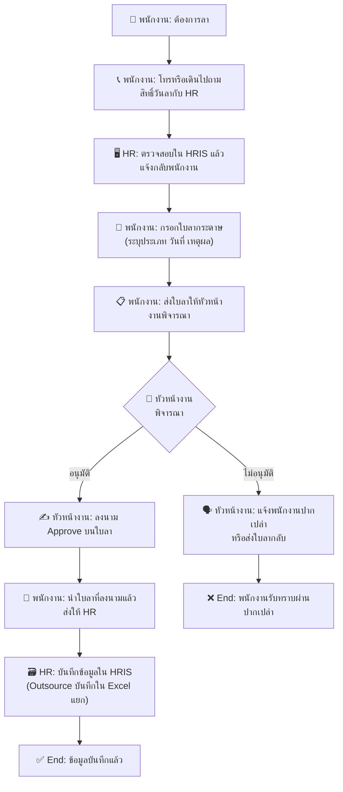
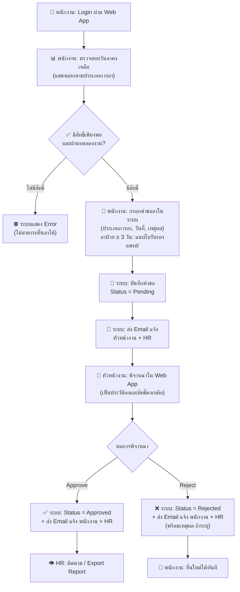
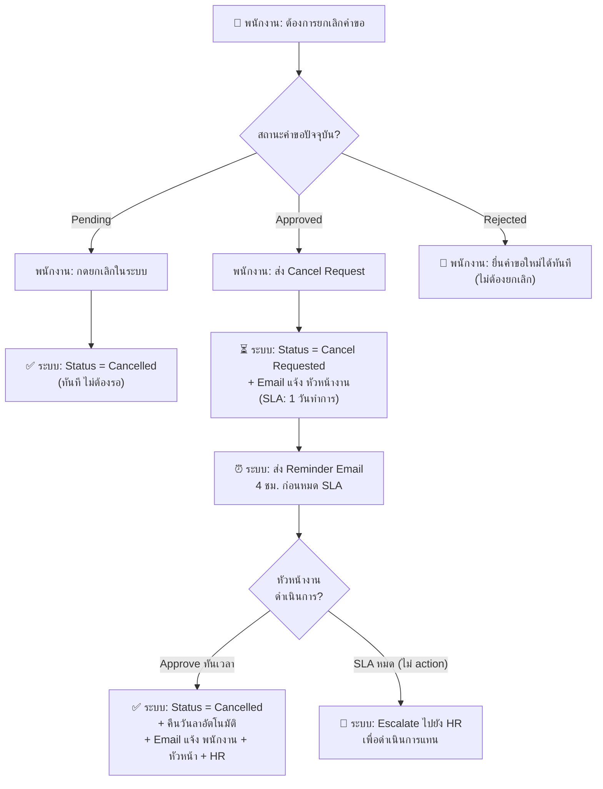

# Business Requirement Document: ระบบบริหารการลาและการอนุมัติ (Leave Request and Approval)
### ABC Company

---

## 1. วัตถุประสงค์ของเอกสาร

- **เป้าหมายทางธุรกิจ:** พัฒนา Web Application สำหรับพนักงานทุกกลุ่ม (ประจำและ Outsource) เพื่อให้สามารถตรวจสอบสิทธิ์วันลา ยื่นคำขอลา และติดตามสถานะได้ด้วยตนเอง รวมถึงให้หัวหน้างานอนุมัติผ่านระบบโดยไม่ต้องใช้เอกสารกระดาษหรือ Excel
- **เหตุผลการเปลี่ยนแปลง:** กระบวนการขอลาปัจจุบันต้องผ่าน HR เป็นตัวกลาง ทำให้เกิดความล่าช้าและข้อมูลตกหล่น โดยเฉพาะพนักงาน Outsource ที่ไม่อยู่ใน HRIS เดิม HR ต้องควบคุมด้วย Excel แยก ซึ่งเสี่ยงต่อความผิดพลาดและ audit
- **ผลลัพธ์ทางธุรกิจที่คาดหวัง:**
  - พนักงานและหัวหน้างานทำรายการลาในระบบเดียวกันได้ทันที ลดการพึ่ง HR ในงานประจำวัน
  - ลดงาน manual reconciliation ของ HR ให้เหลือศูนย์ผ่านการรวมศูนย์ข้อมูล
  - มีสถานะและประวัติคำขอลาที่ตรวจสอบได้แบบ near real-time รองรับ audit

---

## 2. ภูมิหลังและปัญหาภาพรวม

ระบบ HRIS ปัจจุบันของ ABC Company เปิดใช้งานได้เฉพาะฝ่าย HR เท่านั้น พนักงานทั่วไปและหัวหน้างานไม่สามารถเข้าระบบหรือทำรายการลาได้ด้วยตนเอง ส่งผลให้กระบวนการขอลาต้องผ่านคนกลาง (HR) และใช้เอกสารกระดาษหรือไฟล์ Excel เป็นหลัก

ปัญหาสำคัญที่พบได้แก่:
- พนักงานต้องโทรหรือเดินไปสอบถาม HR เพื่อตรวจสอบสิทธิ์วันลา ก่อให้เกิดคอขวดที่ฝ่ายบุคคล
- กระบวนการอนุมัติไม่มีระบบติดตาม พนักงานต้องคอยถามผลด้วยตนเอง
- พนักงาน Outsource ไม่อยู่ใน HRIS เดิม HR ต้องบริหารข้อมูลด้วย Excel แยก เสี่ยงข้อมูลตกหล่นและผิดพลาด
- HR ต้องรวบรวมข้อมูลจากหลายช่องทาง (กระดาษ, email, โทรศัพท์) ทำให้เสียเวลาและข้อมูลไม่ครบถ้วน

> **แหล่งอ้างอิง:** `Leave-Management-Request-and-Approval-Business-User.yaml` → `overview.business_context`, `ABC-Leave-Workflow-Thai-QA.md`

---

## 3. ขอบเขตเชิงธุรกิจ

### 3.1 In Business Scope

**Phase 1 (Priority: High)**
- การตรวจสอบสิทธิ์วันลาคงเหลือแยกตามประเภท (self-service)
- การยื่นคำขอลาผ่าน Web สำหรับพนักงานประจำและ Outsource ทุกคน
- การอนุมัติ / ปฏิเสธคำขอลาโดยหัวหน้างาน (1 ระดับ)
- การยกเลิกคำขอลา (Pending ยกเลิกเอง / Approved ต้อง re-approve)
- Email notification อัตโนมัติทุก event แก่ผู้เกี่ยวข้อง
- การติดตามสถานะคำขอลาด้วยตนเอง
- HR Monitoring ผ่านระบบเดียว (แทน Excel control)
- การ onboard ข้อมูลพนักงาน Outsource ผ่าน Excel template import
- การคืนวันลาอัตโนมัติเมื่อยกเลิกคำขอที่ Approved สำเร็จ

**Phase 2 (Priority: Medium)**
- Audit Trail: เก็บประวัติทุก action (สร้าง, แก้ไข, อนุมัติ)
- Reporting: HR export รายงานการลาตามช่วงเวลา / หน่วยงาน / ประเภทพนักงาน

### 3.2 Out of Business Scope

- การคำนวณ OT หรือ payroll integration เชิงลึก
- Mobile native application (Web responsive เพียงพอ)
- Multi-level approval เกิน 1 ระดับ
- การ replace ระบบ HRIS เดิมทั้งหมด (ระบบใหม่ integrate กับ HRIS เดิม)

> **แหล่งอ้างอิง:** `Leave-Management-Request-and-Approval-Business-User.yaml` → `business_rules.out_of_scope`, QA-H5, QA-H6

---

## 4. ผู้ใช้งานและบทบาท (Actors)

| Actor | บทบาท | สิทธิ์หลัก | แหล่งที่มาของข้อมูล |
|-------|--------|-----------|-------------------|
| **พนักงานประจำ (Employee)** | ผู้ยื่นคำขอลา | ตรวจสอบสิทธิ์, ยื่นลา, ติดตามสถานะ, ยกเลิกคำขอ, รับ Email แจ้งผล | Business User YAML, QA v1 |
| **พนักงาน Outsource** | ผู้ยื่นคำขอลา (สิทธิ์บางประเภทต่างจากประจำ) | เหมือนพนักงานประจำ แต่ลาคลอด/ทำหมัน/รับราชการ/อุปสมบท = ไม่มีสิทธิ์ | R2 (HR Manager), BR-008 |
| **หัวหน้างาน (Line Manager)** | ผู้อนุมัติ (1 ระดับ) | Approve/Reject คำขอลา, Re-approve การยกเลิก, รับ Email แจ้ง, ดูประวัติลาทีม | QA-H5, R4 (HR Manager) |
| **HR** | ผู้ติดตามและดูแลข้อมูล | Monitor คำขอทั้งหมด, รับ Email ทุก event, import Outsource, export report | BR-007, R5 (HR Manager) |
| **ระบบ (System)** | ผู้ดำเนินการอัตโนมัติ | ส่ง Email notification, อัปเดตสถานะ, คืนวันลาอัตโนมัติ, SLA reminder/escalate | NR1, NR2, R4, R5 |

---

## 5. Requirement

### 5.1 As-Is Business Flow

อธิบายขั้นตอนการทำงานปัจจุบัน โดยเน้นงานที่ทำจริงทั้งในระบบและนอกระบบ

**As-Is Operation Flow Diagram**

| ลำดับ | ผู้เกี่ยวข้อง | ขั้นตอนการทำงานปัจจุบัน | ใช้ระบบหรือไม่ | ปัญหาที่พบ |
|-------|-------------|----------------------|--------------|----------|
| 1 | พนักงาน | โทร / เดินไปสอบถามสิทธิ์วันลากับ HR | นอกระบบ | เกิดคอขวดที่ HR, เสียเวลาทั้งพนักงานและ HR |
| 2 | HR | เปิด HRIS ตรวจสอบสิทธิ์วันลาของพนักงาน แล้วแจ้งกลับ | ในระบบ (HRIS — เฉพาะ HR เข้าได้) | Outsource ไม่มีข้อมูลใน HRIS ต้องดู Excel แยก |
| 3 | พนักงาน | กรอกใบลากระดาษ ระบุประเภทการลา วันที่ และเหตุผล | นอกระบบ | ข้อมูลไม่ครบ ตัวอักษรไม่ชัด สูญหายได้ |
| 4 | พนักงาน | นำใบลาส่งให้หัวหน้างานพิจารณา | นอกระบบ | ต้องนัดหาตัว ล่าช้าถ้าหัวหน้าไม่อยู่ |
| 5 | หัวหน้างาน | พิจารณาและลงนาม Approve หรือปฏิเสธปากเปล่า | นอกระบบ | ไม่มี record การปฏิเสธ, ติดตามสถานะยาก |
| 6 | พนักงาน | นำใบลาที่ Approve แล้วส่งให้ HR | นอกระบบ | ขั้นตอนซ้ำซ้อน ใบลาหายระหว่างทาง |
| 7 | HR | บันทึกข้อมูลลงใน HRIS (ประจำ) หรือ Excel (Outsource) | HRIS + Excel | ข้อมูลกระจาย 2 แหล่ง เสี่ยงตกหล่นและ inconsistent |

### 5.2 As-Is Issue, สาเหตุ และแนวทางการแก้ไขปัญหา

| ประเด็นปัญหา As-Is | สาเหตุ | ผลกระทบทางธุรกิจ | แนวทางการแก้ไขปัญหา |
|-------------------|--------|----------------|-------------------|
| พนักงานเข้าระบบ HRIS ไม่ได้ | HRIS ออกแบบมาสำหรับ HR เท่านั้น ไม่มี self-service portal | พนักงานต้องผ่าน HR ในทุกขั้นตอน เกิดคอขวดและ dependency | พัฒนา Web Application แยกต่างหาก ให้พนักงานทุกคนเข้าใช้ได้ |
| Outsource ไม่อยู่ใน HRIS | HRIS ไม่รองรับ employee type Outsource | HR ต้องคุม Excel แยก เสี่ยงข้อมูลตกหล่น audit ยาก | ออกแบบระบบใหม่รองรับ Outsource ตั้งแต่ต้น ด้วย import Excel template |
| ไม่มีระบบ notification อัตโนมัติ | กระบวนการทั้งหมดผ่านกระดาษและปากเปล่า | พนักงานไม่รู้ผลการอนุมัติ ต้องถามเอง เกิด misunderstanding | ระบบส่ง Email อัตโนมัติทุก event ของคำขอลา |
| ไม่มี status tracking | ใบลากระดาษไม่มีสถานะ ไม่มี timestamp | ติดตามสถานะยาก ไม่รู้ว่าอยู่ที่ใคร | ระบบมี status machine ชัดเจน Pending/Approved/Rejected/Cancelled |
| ข้อมูลกระจาย 2 แหล่ง (HRIS + Excel) | ระบบเดิมไม่รองรับ Outsource | HR ต้อง reconcile ข้อมูลด้วยมือ เสี่ยงความผิดพลาด | รวมข้อมูลทุกประเภทพนักงานในระบบเดียว แยกด้วย employee_type |
| ไม่มี audit trail | กระบวนการกระดาษไม่มี log | ตรวจสอบย้อนหลังไม่ได้ ปัญหาด้าน compliance | ระบบเก็บ history log ทุก action อัตโนมัติ (Phase 2) |

> **แหล่งอ้างอิง:** `Leave-Management-Request-and-Approval-Business-User.yaml` → `as_is_to_be`, `ABC-Leave-Workflow-Thai-QA.md`, QA-H4, QA-H6

---

### 5.3 ประเภทของ Requirement

#### 5.3.1 Business Requirement

##### A. Business Process Flow

###### A.1 To-Be Business Flow

**To-Be Operation Flow Diagram — Main Flow (ยื่นและอนุมัติคำขอลา)**

**To-Be Operation Flow Diagram — Cancel Flow (ยกเลิกคำขอลา)**

| ลำดับ | ผู้เกี่ยวข้อง | ขั้นตอนการทำงานเป้าหมาย | ใช้ระบบหรือไม่ | ผลลัพธ์ที่คาดหวัง |
|-------|-------------|----------------------|--------------|----------------|
| 1 | พนักงาน | Login เข้าระบบ Web Application | ในระบบ | เข้าถึงระบบได้ตามสิทธิ์ทุกกลุ่ม |
| 2 | พนักงาน | ตรวจสอบวันลาคงเหลือแยกตามประเภท | ในระบบ | เห็นสิทธิ์คงเหลือ real-time โดยไม่ต้องถาม HR |
| 3 | พนักงาน | กรอกคำขอลาในระบบ (ประเภท วันที่ เหตุผล แนบเอกสาร) | ในระบบ | คำขอถูกบันทึก Status = Pending ทันที |
| 4 | ระบบ | บันทึกคำขอและส่ง Email แจ้งหัวหน้างาน + HR | ในระบบ | หัวหน้างานรับทราบและดำเนินการได้ทันที |
| 5 | หัวหน้างาน | พิจารณาและ Approve หรือ Reject ผ่านระบบ | ในระบบ | Status อัปเดตพร้อม record ที่ตรวจสอบได้ |
| 6 | ระบบ | ส่ง Email แจ้งผลพนักงาน + HR พร้อมเหตุผล (ถ้า Reject) | ในระบบ | พนักงานรับทราบผลทันทีโดยไม่ต้องถามเอง |
| 7 | HR | ติดตามคำขอทั้งหมดผ่าน monitoring screen | ในระบบ | ลด manual reconciliation เหลือศูนย์ |
| 8 | HR | Export รายงานตามช่วงเวลา / หน่วยงาน (Phase 2) | ในระบบ | รายงานพร้อมใช้งาน ไม่ต้องรวมข้อมูลด้วยมือ |

###### A.2 จุดที่แตกต่างในการปฏิบัติงาน

| ประเด็น | As-Is | To-Be | ผลกระทบต่อการปฏิบัติงาน |
|--------|-------|-------|----------------------|
| การตรวจสอบสิทธิ์วันลา | โทรถาม HR (ทำงานเฉพาะเวลาทำการ) | เช็กเองในระบบ 24/7 | ลดภาระ HR — พนักงานวางแผนลาได้อิสระ |
| การยื่นคำขอลา | กรอกใบกระดาษ ส่งให้หัวหน้าด้วยตัวเอง | กรอก Online ส่งผ่านระบบ | ลดขั้นตอน ข้อมูลครบถ้วนกว่า มี validation |
| การอนุมัติ | ลงนามบนกระดาษ ไม่มี timestamp | คลิกใน Web มี timestamp และ record | ตรวจสอบ audit trail ได้ทุกขั้นตอน |
| การแจ้งผล | ปากเปล่า หรือรอใบลากลับ | Email อัตโนมัติทันทีที่ status เปลี่ยน | พนักงานรู้ผลเร็วขึ้น ลด misunderstanding |
| ข้อมูล Outsource | Excel แยก — ไม่อยู่ใน HRIS | ระบบเดียวกับพนักงานประจำ ใช้ employee_type แยก | รวมศูนย์ข้อมูล ลดความเสี่ยง inconsistency |
| การยกเลิกคำขอ | ไม่มีกระบวนการชัดเจน (ปากเปล่า) | มี Cancel flow ชัดเจน พร้อม re-approve และคืนวันลาอัตโนมัติ | ควบคุมและตรวจสอบได้ ลดข้อพิพาท |
| HR Monitoring | รวมข้อมูลจากหลายช่องทาง (กระดาษ + email + Excel) | ดูในระบบเดียว กรอง export ได้ | ประหยัดเวลา ลด error จาก manual aggregation |

> **แหล่งอ้างอิง:** `Leave-Management-Request-and-Approval-Business-User.yaml` → `as_is_to_be`, QA-M1, R4, R5 (HR Manager)

---

##### B. Business Use Case

| Use Case | Trigger | เงื่อนไข / กติกา | วิธีทำงานที่แตกต่าง | ผลลัพธ์ปลายทาง |
|----------|---------|----------------|------------------|--------------|
| **UC-01: ลาป่วยฉุกเฉิน** | พนักงานป่วยกะทันหัน ไม่สามารถแจ้งล่วงหน้า | แจ้งหัวหน้างานได้ทันที ไม่ต้องผ่านขั้นตอนล่วงหน้า | ยื่นคำขอย้อนหลังได้ หรือแจ้งหัวหน้าช่องทางอื่นก่อน แล้ว submit ในระบบเมื่อกลับมา | คำขอบันทึกในระบบ Status = Pending รอ Approve |
| **UC-02: ลาป่วย ≥ 3 วันทำการต่อเนื่อง** | พนักงานลาป่วยตั้งแต่ 3 วันทำการขึ้นไปติดต่อกัน | ต้องแนบใบรับรองแพทย์ในระบบ | ระบบแสดง field แนบเอกสารบังคับ ไม่สามารถ submit ได้หากไม่มีเอกสาร | คำขอบันทึกพร้อมเอกสารแนบ ส่ง Approval task ให้หัวหน้า |
| **UC-03: ยกเลิกคำขอที่ยังเป็น Pending** | พนักงานต้องการยกเลิกคำขอที่ยังรอ Approve | คำขอต้องอยู่ในสถานะ Pending เท่านั้น | พนักงานกดยกเลิกเองในระบบโดยไม่ต้องแจ้งหัวหน้า | Status เปลี่ยนเป็น Cancelled ทันที — ไม่กระทบวันลาคงเหลือ |
| **UC-04: ยกเลิกคำขอที่ Approved แล้ว** | พนักงานต้องการยกเลิกลาที่ได้รับอนุมัติแล้ว | คำขอต้องอยู่ในสถานะ Approved | พนักงานส่ง Cancel Request → หัวหน้า re-approve ภายใน 1 วันทำการ | ถ้า Approve: Status = Cancelled + คืนวันลาอัตโนมัติ + Email แจ้งทุกฝ่าย |
| **UC-05: SLA Re-approve หมดเวลา** | หัวหน้างานไม่ดำเนินการ re-approve Cancel Request ภายใน 1 วันทำการ | ระบบส่ง Reminder 4 ชม. ก่อนหมดเวลาก่อนแล้ว | เมื่อหมดเวลา ระบบ Escalate ไปยัง HR เพื่อดำเนินการแทน | HR รับทราบและดำเนินการ — คำขออยู่ในสถานะ Cancel Requested จนกว่า HR จะ action |
| **UC-06: พนักงานในช่วงทดลองงาน (< 3 เดือน)** | พนักงานใหม่ยื่นขอลาพักผ่อน อายุงานยังไม่ถึง 3 เดือน | อายุงาน < 3 เดือน = ไม่มีสิทธิ์ลาพักผ่อน | ระบบตรวจสอบและแสดง Error — ไม่อนุญาตให้ยื่น | คำขอถูกปฏิเสธโดยระบบ ก่อนถึงหัวหน้างาน |
| **UC-07: Outsource ยื่นลาประเภทที่ไม่มีสิทธิ์** | พนักงาน Outsource ยื่นขอลาคลอดบุตร / ทำหมัน / รับราชการ / อุปสมบท | employee_type = Outsource ไม่มีสิทธิ์ 4 ประเภทนี้ | ระบบตรวจสอบ employee_type และปฏิเสธทันที | คำขอถูกปฏิเสธโดยระบบ พร้อมแจ้งว่าต้องใช้สิทธิ์จากบริษัทต้นสังกัด |
| **UC-08: Reject คำขอลาพร้อมเหตุผล** | หัวหน้างาน Reject คำขอลา | หัวหน้างานอาจระบุเหตุผล (optional) | หัวหน้าเลือก Reject และกรอกเหตุผล (หรือข้ามก็ได้) | Status = Rejected + Email แจ้งพนักงานพร้อมเหตุผล + แจ้ง HR |

> **แหล่งอ้างอิง:** `ABC-Leave-Workflow-Thai-QA.md`, QA-M1, QA-M2, R4 (HR Manager), M2, M3 (QA v3)

---

##### C. Process Flow KPI

| ช่วงของกระบวนการ | KPI | วิธีวัด | ค่าเป้าหมาย | หมายเหตุ |
|----------------|-----|--------|-----------|---------|
| ยื่นคำขอลา | ระยะเวลาสร้างคำขอ (ตั้งแต่เปิดหน้าจอถึง submit) | Log timestamp: เปิดหน้า → submit สำเร็จ | ≤ 5 นาที | ระบบต้องใช้ง่าย ลดขั้นตอนที่ไม่จำเป็น |
| อนุมัติ / ปฏิเสธ | ระยะเวลาหัวหน้างานดำเนินการหลังได้รับ Email | วัดจาก: timestamp Email ถูกส่ง → timestamp status เปลี่ยน | ≤ 1 วันทำการ (SLA) | SLA สำหรับ re-approve cancel ด้วย |
| Notification | อัตรา Email ส่งสำเร็จ | จำนวน Email ที่ส่งสำเร็จ / จำนวน Email ทั้งหมด × 100 | ≥ 99% | ครอบคลุมทุก event |
| ยกเลิกคำขอ Approved | ระยะเวลา re-approve | วัดจาก: Cancel Request timestamp → หัวหน้า action | ≤ 1 วันทำการ (SLA) | มี Reminder 4 ชม. ก่อนครบ |
| HR Monitoring | % คำขอที่ HR ดูผ่านระบบ (vs การ reconcile manual) | จำนวน action บน monitoring screen / จำนวนคำขอทั้งหมด × 100 | 100% | แทนที่ Excel control ทั้งหมด |
| Outsource Onboarding | ระยะเวลา import ข้อมูล Outsource เข้าระบบ | วัดจาก: รับ Excel → import สำเร็จ | ≤ 1 วันทำการต่อ batch | Update ทุกต้นไตรมาส |
| ระบบโดยรวม | % พนักงานที่ยื่นลาผ่านระบบ (Adoption Rate) | จำนวนคำขอในระบบ / คำขอลาทั้งหมดขององค์กร × 100 | ≥ 95% ภายใน 3 เดือนหลัง go-live | วัดหลัง go-live Phase 1 |

> **แหล่งอ้างอิง:** `Leave-Management-Request-and-Approval-Business-User.yaml` → `overview.success_criteria`, R4 (HR Manager), M3 (QA v3)

---

##### D. Business Rules

| Rule ID | จุดในกระบวนการ | Business Rule | ผลต่อการตัดสินใจ | แหล่งอ้างอิง |
|---------|--------------|--------------|----------------|------------|
| BR-001 | Login / Access | พนักงานทุกคนรวมถึง Outsource ต้องมี account สำหรับเข้าใช้งาน | ทำได้: ทุกกลุ่มเข้าระบบได้ / ทำไม่ได้: ไม่มี account ในระบบ | BR-001 (YAML), QA-H6 |
| BR-002 | ตรวจสอบสิทธิ์ก่อนยื่นลา | สิทธิ์วันลาคงเหลือต้องอ้างอิง master data ที่ HR ยืนยันแล้ว | ระบบแสดงยอดคงเหลือ real-time — ห้ามยื่นเกินสิทธิ์ที่มี | BR-002 (YAML), RULE-002 |
| BR-003 | ยื่นคำขอลาพักผ่อน | ต้องแจ้งล่วงหน้าอย่างน้อย 1 วัน (นับจากวันที่ยื่น ไม่ใช่วันทำการ) | ทำไม่ได้: ระบบ block การยื่นลาพักผ่อนหากวันที่เริ่มลาน้อยกว่า 1 วันนับจากวันยื่น | QA-H2 (Business User) |
| BR-004 | ยื่นคำขอลากิจ | ต้องแจ้งล่วงหน้าอย่างน้อย 3 วันทำการ | ทำไม่ได้: ระบบ block การยื่นลากิจที่ไม่ได้แจ้งล่วงหน้า 3 วันทำการ | `ABC-Leave-Workflow-Thai-QA.md` |
| BR-005 | ยื่นคำขอลาป่วย | ลาป่วยฉุกเฉินแจ้งได้ทันที ไม่ต้องล่วงหน้า | ทำได้: ยื่นได้ทันทีโดยไม่มีข้อจำกัดวันล่วงหน้า | `ABC-Leave-Workflow-Thai-QA.md` |
| BR-006 | แนบใบรับรองแพทย์ | ลาป่วยตั้งแต่ 3 วันทำการต่อเนื่องขึ้นไปต้องแนบใบรับรองแพทย์ | ต้องแนบเอกสาร: ระบบ block การ submit หากไม่มีไฟล์แนบ | QA-H3, `ABC-Leave-Workflow-Thai-QA.md` |
| BR-007 | สิทธิ์ลาพักผ่อน — ทดลองงาน | พนักงานอายุงาน < 3 เดือน ไม่มีสิทธิ์ลาพักผ่อน | ทำไม่ได้: ระบบปฏิเสธคำขอลาพักผ่อนก่อนครบ 3 เดือน | M2 (QA v3 — HR Manager) |
| BR-008 | สิทธิ์ลาพักผ่อนตามอายุงาน | อายุงาน < 1 ปี = ไม่มีสิทธิ์ / 1–3 ปี = 10 วัน / 3–5 ปี = 12 วัน / 5–10 ปี = 15 วัน / 10+ ปี = 18 วัน | ระบบคำนวณสิทธิ์จากอายุงาน ณ วันยื่นคำขอ | R6 (HR Manager) |
| BR-009 | สะสมวันลาพักผ่อนข้ามปี | วันลาพักผ่อนที่ไม่ได้ใช้สะสมข้ามปีได้ สูงสุดไม่เกิน 30 วัน | ระบบแสดง balance รวมปีปัจจุบัน + สะสม แต่ cap ที่ 30 วัน | R6 (HR Manager) |
| BR-010 | สิทธิ์ลากิจ | พนักงานประจำและ Outsource มีสิทธิ์ลากิจ 3 วัน/ปีเท่ากัน | ทำไม่ได้: ระบบ block เมื่อใช้ครบ 3 วัน/ปีแล้ว | R1 (HR Manager) |
| BR-011 | สิทธิ์ลา Outsource — ประเภทพิเศษ | Outsource ไม่มีสิทธิ์ลาคลอดบุตร / ทำหมัน / รับราชการทหาร / อุปสมบท | ทำไม่ได้: ระบบ block และแจ้งให้ใช้สิทธิ์จากบริษัทต้นสังกัด | R2 (HR Manager) |
| BR-012 | Approval — ผู้อนุมัติ | ผู้อนุมัติคือหัวหน้างานโดยตรง (Line Manager) 1 ระดับเท่านั้น | ทำได้: หัวหน้างาน Approve/Reject / ทำไม่ได้: ไม่มี multi-level approval | QA-H5 (Business User) |
| BR-013 | Rejection Reason | หัวหน้างานสามารถระบุเหตุผลการ Reject หรือข้ามก็ได้ (optional) | ถ้าระบุ: เหตุผลปรากฏใน Email แจ้งพนักงาน | QA-M2 (Business User) |
| BR-014 | Cancel — Pending | คำขอที่อยู่ในสถานะ Pending พนักงานยกเลิกได้เองทันที ไม่ต้องแจ้งหัวหน้า | ทำได้ทันที: Status → Cancelled | R4 (HR Manager) |
| BR-015 | Cancel — Approved | คำขอที่ Approved แล้ว พนักงานต้องส่ง Cancel Request และรอหัวหน้า re-approve ภายใน 1 วันทำการ | ห้ามยกเลิกเองทันที — ต้องผ่าน re-approve | R4 (HR Manager) |
| BR-016 | คืนวันลา | เมื่อคำขอที่ Approved ถูกยกเลิกสำเร็จ ระบบต้องคืนวันลาคงเหลือให้พนักงานอัตโนมัติ | ทำอัตโนมัติ: ไม่ต้องให้ HR แก้ไข manual | NR1 (จาก R4, HR Manager) |
| BR-017 | ห้ามแก้ไขคำขอที่ Approved | คำขอที่ Approved แล้วไม่สามารถแก้ไขได้ ต้องยกเลิกและยื่นใหม่เท่านั้น | ทำไม่ได้: ระบบไม่มีปุ่ม Edit สำหรับคำขอที่ Approved | R4 (HR Manager) |
| BR-018 | SLA Re-approve | ระบบส่ง Reminder Email ก่อนหมด SLA 4 ชั่วโมง — ถ้าหมดเวลาแล้วยังไม่ action ระบบ Escalate ไปยัง HR | ทำอัตโนมัติ: ระบบ scheduler ควบคุม SLA | M3 (QA v3 — HR Manager) |
| BR-019 | Notification — Email | ระบบส่ง Email แจ้ง HR ทุก event (ยื่น, Approve, Reject, ยกเลิก) พร้อม SLA reminder และ escalate | HR รับทุก event — ใช้แทน Excel monitoring | R5 (HR Manager), QA-L1 |
| BR-020 | Outsource Onboarding | HR import ข้อมูล Outsource ผ่าน Excel template — update ทุกต้นไตรมาสหรือเมื่อมีการเปลี่ยนแปลง | HR เป็นผู้ควบคุม data Outsource ในระบบ | R3 (HR Manager) |

---

## 6. ตัวอย่างข้อมูล (Business Entity)

| Business Entity Code | ชื่อข้อมูล | คำอธิบายเชิงธุรกิจ | ตัวอย่างข้อมูลที่สำคัญ | แหล่งที่มาของข้อมูล |
|---------------------|-----------|------------------|---------------------|-------------------|
| **EMPLOYEE** | ข้อมูลพนักงาน | ข้อมูลผู้ใช้งานทุกกลุ่มที่เกี่ยวข้องกับการยื่นลาและการอนุมัติ รองรับทั้งพนักงานประจำและ Outsource | รหัสพนักงาน, ชื่อ-นามสกุล (TH/EN), แผนก, ตำแหน่ง, **employee_type** (ประจำ / Outsource), หัวหน้างาน (Line Manager), Email, วันเริ่มงาน, บริษัทต้นสังกัด (Outsource) | HRIS (ประจำ), Excel import (Outsource), R3 |
| **LEAVE_BALANCE** | สิทธิ์วันลาคงเหลือ | ข้อมูลสิทธิ์วันลาตามประเภทของพนักงานแต่ละคน คำนวณตามอายุงานและ employee_type | รหัสพนักงาน, ประเภทการลา (7 ประเภท), สิทธิ์ที่ได้รับ/ปี, ใช้ไปแล้ว, **คงเหลือ**, วันที่สะสมจากปีก่อน, รอบปี | R2, R6 (HR Manager), QA-H3 |
| **LEAVE_REQUEST** | คำขอลา | ข้อมูลคำขอลาแต่ละรายการตั้งแต่ยื่นจนถึงปิด — เป็น core entity ของระบบ | เลขคำขอ (auto), รหัสพนักงาน, ประเภทการลา, วันเริ่มลา, วันสิ้นสุดลา, จำนวนวัน, เหตุผล, ไฟล์แนบ (ถ้ามี), **status** (Pending / Approved / Rejected / Cancelled / Cancel Requested), timestamp สร้าง | Business User YAML, R4, M1 |
| **APPROVAL_RECORD** | ข้อมูลการอนุมัติ | บันทึกผลการพิจารณาและผู้ที่เกี่ยวข้อง รองรับทั้ง Approve / Reject / Re-approve cancel | เลขคำขอ, รหัสผู้อนุมัติ (Line Manager), action type (Approve / Reject / Re-approve), timestamp, เหตุผล (ถ้ามี), SLA deadline | QA-M2, R4 (HR Manager) |
| **LEAVE_TYPE** | ประเภทการลา | Master data ของประเภทการลาทั้ง 7 ประเภท พร้อม config สิทธิ์ตาม employee_type | รหัสประเภทลา, ชื่อภาษาไทย, **สิทธิ์พนักงานประจำ**, **สิทธิ์ Outsource**, กฎการแจ้งล่วงหน้า, กฎเอกสารแนบ | QA-H1, R2 (HR Manager) |
| **NOTIFICATION_LOG** | ประวัติการแจ้งเตือน | บันทึก Email notification ทุกรายการที่ส่งออกจากระบบ | event type, ผู้รับ (พนักงาน / หัวหน้า / HR), timestamp ส่ง, status (ส่งสำเร็จ / ล้มเหลว), เลขคำขออ้างอิง | R5 (HR Manager), QA-L1 |
| **OUTSOURCE_IMPORT** | ข้อมูล import Outsource | ข้อมูล batch import จาก Excel template ที่ HR ใช้ onboard พนักงาน Outsource | batch date, จำนวน record, รายการที่ import สำเร็จ / ล้มเหลว, ผู้ import (HR), ชื่อไฟล์ | R3 (HR Manager) |

---

## 7. ข้อสังเกตและประเด็นที่ต้องยืนยัน

ประเด็นต่อไปนี้ยังไม่ได้รับการยืนยันจาก Business Owner หรือ HR Manager — **ห้ามนำไปใช้เป็น baseline** จนกว่าจะได้รับข้อมูลเพิ่มเติม:

1. **จำนวนวันลาประเภทพิเศษ** (ลาคลอดบุตร / ทำหมัน / รับราชการทหาร / อุปสมบท) — ไม่มีข้อมูลจำนวนวันที่ยืนยันในเอกสารต้นทาง ต้องขอจาก HR พร้อม reference กฎหมายแรงงาน
2. **Carry-forward calculation formula** — รู้ว่าสะสมได้ cap 30 วัน แต่ยังไม่ชัดว่าคำนวณยอดสะสมอย่างไร (เต็มจำนวน? pro-rata?)
3. **HR Notification: Individual vs Distribution List** — R5 แนะนำให้ HR มี email group แต่ยังไม่ confirm เป็น requirement
4. **Intermediate cancel status name** — M1 ยืนยัน Final state = "Cancelled" แต่ไม่ได้ระบุชื่อ Intermediate state อย่างชัดเจน (ใช้ "Cancel Requested" ตาม recommendation)
5. **SLA Escalate assignee ใน HR** — M3 ระบุ "Escalate ไปยัง HR" แต่ไม่ระบุว่าส่งถึงใคร (ตำแหน่ง / email)
6. **Report template สำหรับ Phase 2** — BR-010 ระบุเพียงประเภทการ filter ไม่มี report template ที่ยืนยัน

---

## 8. ความต้องการอื่นๆ เพิ่มเติมที่ไม่อยู่ใน Source Reference

ประเด็นต่อไปนี้เป็น **New Requirements (NR)** ที่ได้จากกระบวนการ QA validation — ไม่ปรากฏในเอกสารต้นทางเดิม แต่ได้รับการยืนยันจาก HR Manager แล้ว ต้องนำรวมใน Business Requirement ก่อน sign-off:

| Other Req ID | Requirement Description | Requirement Type | Department | Requester | Request Date |
|-------------|------------------------|----------------|-----------|-----------|-------------|
| NR-001 | ระบบต้องคืนวันลาคงเหลือให้พนักงานอัตโนมัติเมื่อคำขอที่ Approved ถูกยกเลิกสำเร็จ (Leave Balance Auto-Restore) | Business | HR | HR Manager | 2026-06-15 |
| NR-002 | เพิ่ม Notification Event: "Cancellation Approved" — ส่ง Email แจ้งพนักงาน + หัวหน้างาน + HR เมื่อการยกเลิก Approved ได้รับการ re-approve (เพิ่มเติมจาก BR-005 เดิม) | Business | HR | HR Manager | 2026-06-15 |
| NR-003 | พนักงาน Outsource ต้องมี employee_type ในระบบเพื่อควบคุมสิทธิ์ลาบางประเภท (ลาคลอด/ทำหมัน/รับราชการ/อุปสมบท = ไม่มีสิทธิ์) — อัปเดต BR-008 เดิม | Business | HR | HR Manager | 2026-06-15 |

---

## 9. ภาคผนวก

### 9.1 Source Reference

| ไฟล์ | ประเภท | บทบาท |
|------|--------|-------|
| `raw-extracted/Leave-Management-Request-and-Approval-Business-User.yaml` | YAML | Business requirements หลัก (BR, Workflow, User Stories, As-Is/To-Be) |
| `raw-extracted/ABC-Company-Leave-Form.md` | MD | Leave Form fields — ประเภทการลา ข้อมูลพนักงาน |
| `raw-extracted/ABC-Compay-HR-Regularion.md` | MD | ระเบียบ HR 17 หมวด — ขอบเขตพนักงาน กฎการลา |
| `raw-extracted/ABC-Leave-Workflow-Thai-QA.md` | MD | บทสนทนา HR Q&A — ขั้นตอน As-Is, ระยะแจ้งล่วงหน้า |
| `raw-extracted/ระบบบริหารการลาและการอนุมัติ.md` | MD | Presentation — Workflow ภาพรวม 4 ขั้นตอน |
| `requirement-validation/requirement-data-quality-analysis-qa-list.yaml` | YAML | QA v1 (12/12 Closed) — Business User |
| `requirement-validation/requirement-data-quality-analysis-qa-list-v2.yaml` | YAML | QA v2 (6/6 Closed) — HR Manager |
| `requirement-validation/requirement-data-quality-analysis-qa-list-v3.yaml` | YAML | QA v3 (3/3 Closed) — HR Manager |
| `requirement-validation/requirement-data-quality-analysis-report-v3.md` | MD | Data Quality Report v3 (Final) — สรุป conflict resolution |
| `req-summary/leave-request-and-approval-requirement-summary.md` | MD | Requirement Summary Document — confirmed baseline |

### 9.2 Glossary

| คำศัพท์ | ความหมาย |
|--------|---------|
| HRIS | Human Resource Information System — ระบบบริหารทรัพยากรบุคคลเดิมของ ABC Company (เข้าได้เฉพาะ HR) |
| Web Application | ระบบใหม่ที่พัฒนาขึ้น — แยกจาก HRIS เดิม รองรับพนักงานทุกกลุ่ม |
| Employee Type | ประเภทพนักงาน: พนักงานประจำ (Permanent) หรือ Outsource |
| Line Manager | หัวหน้างานโดยตรงของพนักงาน — ทำหน้าที่เป็น Approver หลัก |
| Leave Balance | สิทธิ์วันลาคงเหลือของพนักงาน แยกตามประเภทการลา |
| Cancel Request | คำขอยกเลิกลาที่พนักงานยื่นหลังจากคำขอถูก Approved แล้ว — ต้องผ่าน re-approve |
| SLA | Service Level Agreement — กำหนดระยะเวลา เช่น หัวหน้าต้อง re-approve ภายใน 1 วันทำการ |
| Re-approve | การอนุมัติซ้ำโดยหัวหน้างาน — ใช้สำหรับ Cancel Request ของคำขอที่ Approved แล้ว |
| Escalate | การส่งต่อปัญหาให้ HR ดำเนินการแทนเมื่อหัวหน้างานไม่ action ทันกำหนด SLA |
| Probation Period | ช่วงทดลองงาน — พนักงานอายุงาน < 3 เดือน ไม่มีสิทธิ์ลาพักผ่อน |
| In-system Notification | การแจ้งเตือนบนหน้าจอระบบเมื่อ Login (ร่วมกับ Email) |
| Excel Template Import | กระบวนการ onboard ข้อมูลพนักงาน Outsource โดย HR import จากไฟล์ Excel ที่กำหนด format |

---

*เอกสารนี้จัดทำโดยอ้างอิงจาก Requirement Summary Document และ QA List v1–v3 ที่ Closed ครบ 21/21 รายการ  
ข้อมูลทุกส่วนใน Section 3–6 เป็น Confirmed Baseline พร้อมใช้สำหรับขั้นตอน System Requirement*
