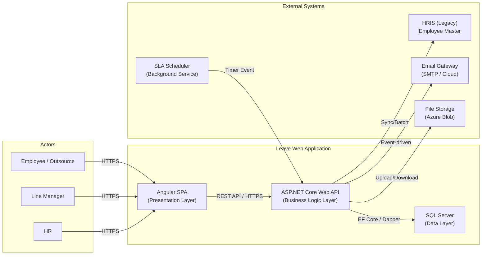
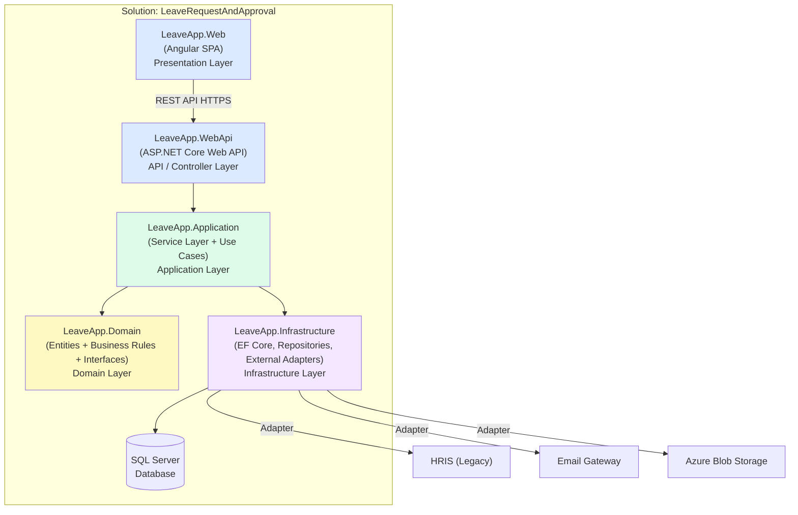
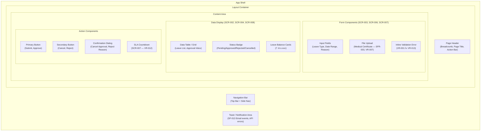
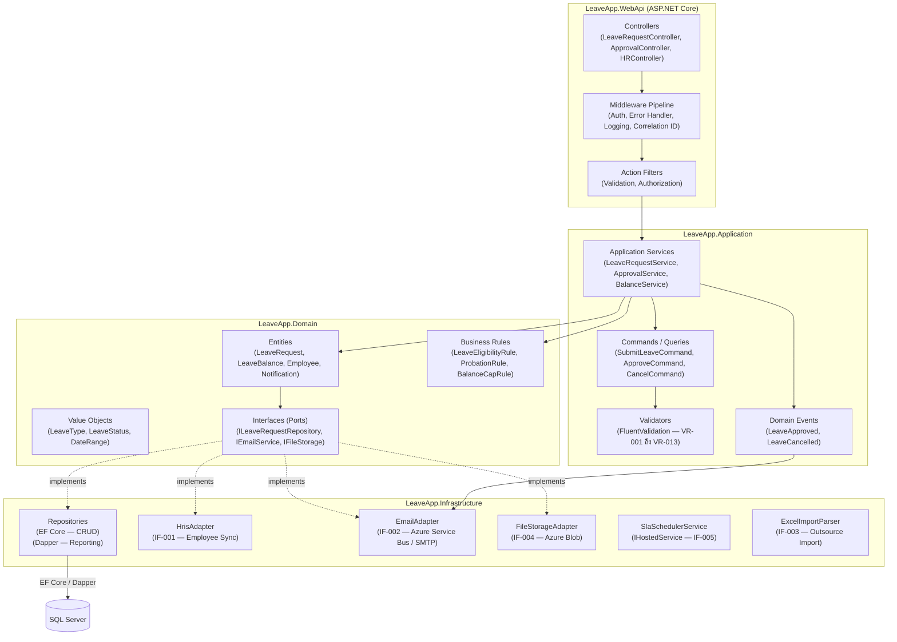
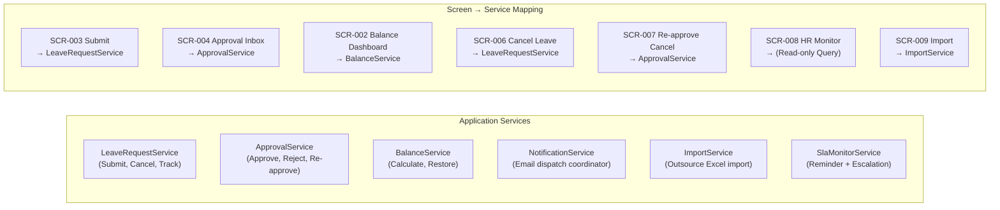
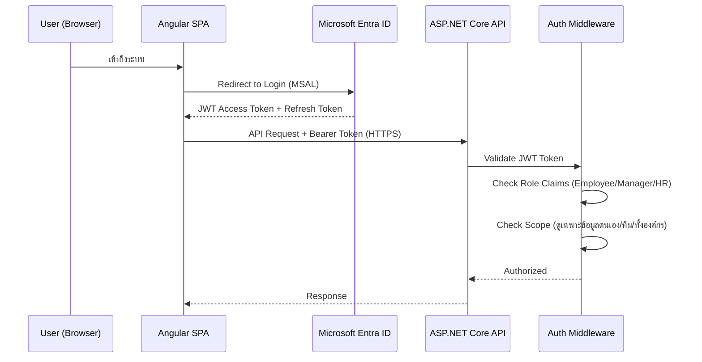
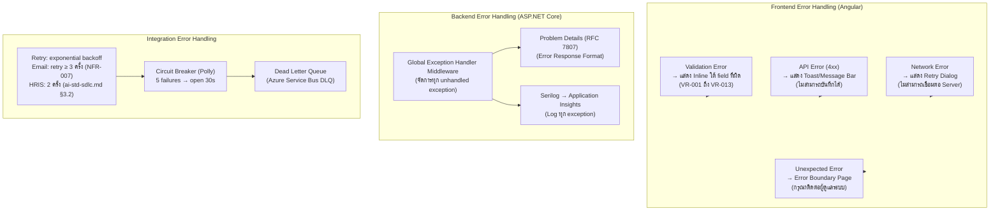
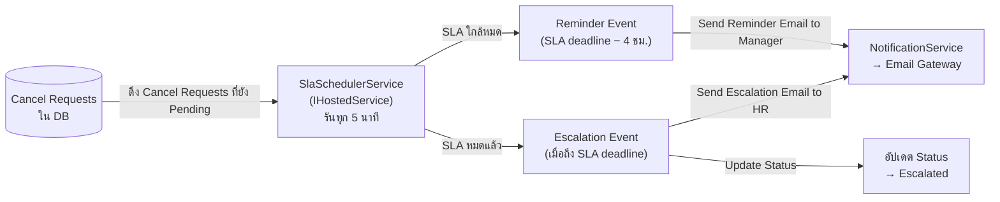
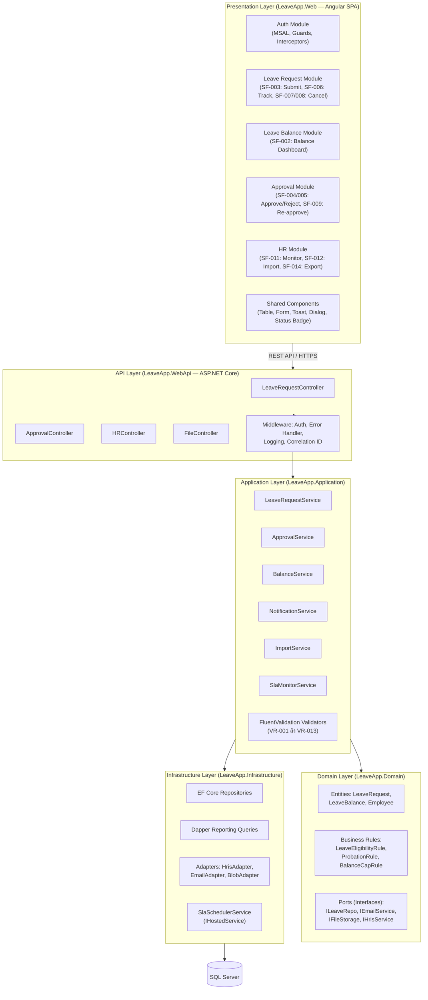
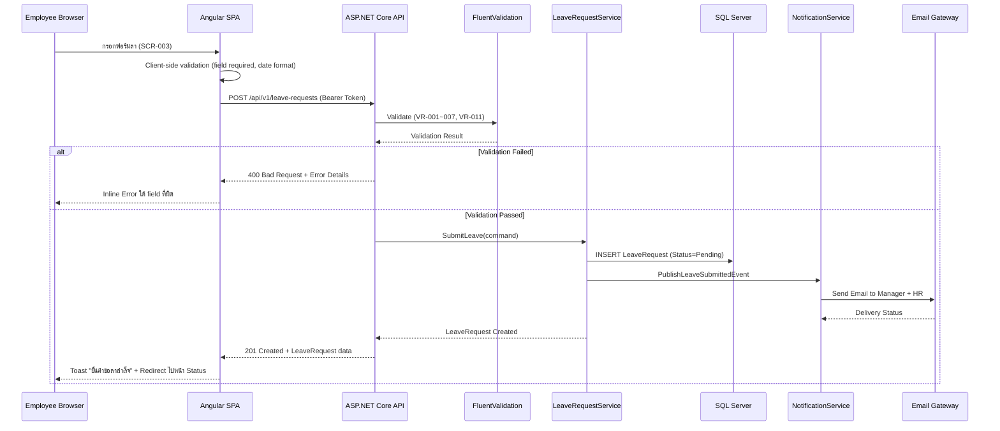

# Application Architecture Design: ระบบบริหารการลาและการอนุมัติ (Leave Request and Approval)

## Change Log

| Version | Date | Section | Change Type | Description | Source |
|---------|------|---------|-------------|-------------|--------|
| 1.0 | 2026-06-16 | All | Created | สร้างเอกสารครั้งแรก — ครอบคลุม Architecture Pattern, Frontend, API, State Management, Error Handling | SRS Summary v1.0, Non-Functional/Technical SRS v1.0 |

---

## 1. วัตถุประสงค์และขอบเขต

### 1.1 วัตถุประสงค์

เอกสารนี้กำหนด Application Architecture ของระบบบริหารการลาและการอนุมัติ (Leave Request and Approval) สำหรับ ABC Company โดยระบุ Architecture Pattern, โครงสร้าง Frontend/Backend, API Design Standard, State Management Approach และ Error Handling Pattern ที่ยึดตามมาตรฐานองค์กรจาก `80-knowledge-base/architecture-design/` เท่านั้น

### 1.2 ขอบเขต (In-Scope)

- Application Architecture ของ Web Application สำหรับระบบลา (Phase 1 + Phase 2)
- Frontend Architecture: Component Structure, UI Framework, Design System, Responsive, Accessibility
- Backend Architecture: Layer Structure, API Design, Business Logic Placement
- Cross-Cutting Concerns: Authentication/Authorization, Logging, Error Handling, State Management
- Integration Touchpoints กับ HRIS, Email Gateway, File Storage, SLA Scheduler

### 1.3 ขอบเขตที่ไม่ครอบคลุม (Out-of-Scope)

- Physical Database Design / Data Architecture (อยู่ใน Data Architecture Design document แยกต่างหาก)
- Infrastructure/Cloud Architecture (อยู่ใน Infrastructure Architecture Design document แยกต่างหาก)
- Integration Architecture Detail (อยู่ใน Integration Architecture Design document แยกต่างหาก)
- API Specification รายละเอียด (อยู่ใน API Design document แยกต่างหาก)
- Mobile Native App (out-of-scope ตาม BRD §3.2)

---

## 2. Source Reference

| รายการ | เอกสารอ้างอิง |
|--------|-------------|
| องค์ความรู้มาตรฐานองค์กร | `80-knowledge-base/SDLC/ai-std-sdlc.md` |
| Application Architecture Knowledge | `80-knowledge-base/architecture-design/01-application-architecture/knowledge.md` |
| SRS Summary | `10-requirement-definition/b0-system-requriement/leave-request-and-approval-system-requirement-specification-summary.md` |
| Non-Functional / Technical SRS | `10-requirement-definition/b0-system-requriement/leave-request-and-approval-non-functional-tech-srs.md` |
| Screen SRS | `10-requirement-definition/b0-system-requriement/leave-request-and-approval-screen-srs.md` |
| Microsoft Learn | ASP.NET Core Architecture Guidance |
| Azure Architecture Center | Application Architecture Patterns |
| OWASP | OWASP Top 10, OWASP ASVS |

---

## 3. Architecture Drivers

### 3.1 Business Drivers

| Driver | รายละเอียด | SRS Reference |
|--------|-----------|--------------|
| แทน Excel / กระดาษ | ระบบต้องให้พนักงานทุกกลุ่มยื่นลาและตรวจสอบสิทธิ์ผ่าน Web เองได้ | BRD §1 Business Objective |
| หลาย Role, หลาย Actor | 4 บทบาทหลัก: Employee, Outsource, Line Manager, HR — มี workflow อนุมัติ 1 ระดับ | BRD §4 Actors, SFR-004/005 |
| Adoption ≥ 95% ภายใน 3 เดือน | ต้องใช้งานง่าย ไม่ต้องฝึกอบรมเข้มข้น | NFR-009, BRD §5.3.1.C KPI |
| SLA enforcement | Cancel Request ต้องมี timer/escalation อัตโนมัติ delay ≤ 15 นาที | NFR-011, SIR-004, TR-004 |

### 3.2 Quality Attributes

| Attribute | เป้าหมาย | SRS Reference |
|-----------|---------|--------------|
| Performance | Page load ≤ 3s (P95), Balance calculation ≤ 2s | NFR-001, NFR-002 |
| Availability | ≥ 99% ในช่วงเวลาทำการ, SLA Scheduler 24/7 | NFR-003, NFR-011 |
| Security | RBAC, HTTPS/TLS 1.2+, data privacy Outsource | NFR-004/005/006, TR-007 |
| Reliability | Email success rate ≥ 99%, retry ≥ 3 ครั้ง | NFR-007 |
| Usability | Responsive Web: Chrome/Edge/Safari, Desktop+Mobile | NFR-008, TR-001 |
| Data Integrity | Balance อัปเดตถูกต้องทุก Approve/Cancel — ป้องกัน race condition | NFR-010 |

### 3.3 Technical Constraints

| Constraint | รายละเอียด | SRS Reference |
|-----------|-----------|--------------|
| Web Application | HTML5/CSS3 standard — ไม่ใช่ Mobile Native App | TR-001, BRD §3.2 |
| Microsoft Stack | ยึดตามมาตรฐาน org: .NET Core, SQL Server, Azure, Windows Server, IIS | ai-std-sdlc.md §1, §4 |
| HRIS Integration | Integrate กับ HRIS เดิม — ไม่ replace HRIS (pattern ยังไม่ยืนยัน) | TR-002, SIR-001 |
| TLS 1.2+ | ทุก HTTP request ต้อง HTTPS | TR-007 |
| Background Scheduler | SLA timer ต้องทำงาน 24/7 | TR-004, SIR-004 |

---

## 4. Visual Context



**คำอธิบาย:**
- ผู้ใช้ทุก role เข้าถึงผ่าน Angular SPA ที่รันบน Web Browser — ไม่ต้อง install app
- Angular SPA ไม่มี business logic — ทุกการทำงานเรียกผ่าน REST API
- Backend (ASP.NET Core Web API) รวมศูนย์ business logic และ enforcement
- SQL Server เก็บข้อมูล transactional ทั้งหมด — เข้าถึงผ่าน Backend เท่านั้น
- External systems (HRIS, Email, File Storage) integrate ผ่าน adapter ใน Backend Layer

---

## 5. Selected Application Architecture Pattern

### 5.1 Pattern ที่เลือก: Layered Architecture

**เหตุผลในการเลือก:**

| เกณฑ์ | ค่าของระบบนี้ | การตัดสินใจ |
|-------|------------|-----------|
| ประเภทระบบ | ระบบ CRUD / Workflow ภายในองค์กร (Leave Request) | ✅ ตรงกับ Layered Architecture |
| ขนาดทีม | ขนาดเล็ก-กลาง (1-2 ทีม) — ระบบ internal สำหรับ ABC Company | ✅ ตรงกับ Layered Architecture |
| ความซับซ้อน | Business workflow ชัดเจน: ยื่นลา → อนุมัติ → notify — ไม่ซับซ้อนถึงขั้น Microservices | ✅ Layered เพียงพอ |
| Time-to-market | ต้องการ Adoption ≥ 95% ภายใน 3 เดือน — Layered สร้างได้เร็วกว่า Microservices | ✅ เหมาะสม |
| Scalability | ระบบ single domain (Leave) — ไม่ต้อง scale component แยก | ✅ Layered เพียงพอ |

**อ้างอิง:** ai-std-sdlc.md §1.1 — "Layered Architecture: ระบบ CRUD ทั่วไป, ERP ภายในองค์กร, ทีมเล็ก (1–2 ทีม) — เริ่มที่นี่ก่อนเสมอ"

### 5.2 ทางเลือกที่ไม่เลือกและเหตุผล

| Pattern | เหตุผลที่ไม่เลือก |
|---------|-----------------|
| **Microservices** | ระบบ single domain ขนาดเล็ก — Microservices เพิ่ม overhead ด้าน DevOps และ distributed transaction โดยไม่ได้ประโยชน์ที่คุ้มค่า |
| **Hexagonal (Clean Architecture)** | ระบบไม่มีแผนเปลี่ยน database หรือ UI framework — ความซับซ้อนเพิ่มขึ้นโดยไม่จำเป็น |
| **Event-Driven** | ใช้เป็น **supplementary pattern** สำหรับ Email Notification (SIR-002) และ SLA Scheduler (SIR-004) เท่านั้น — ไม่ใช่ architecture หลัก |
| **Plugin-Based** | ไม่มี requirement สำหรับ extensible module — ไม่เหมาะสม |

### 5.3 Application Layer Structure



**กฎสำคัญของแต่ละ Layer:**

| Layer | Project | ความรับผิดชอบ | กฎ |
|-------|---------|------------|---|
| **Presentation** | `LeaveApp.Web` (Angular) | UI, UX, Form, Routing | ห้ามมี Business Logic |
| **API** | `LeaveApp.WebApi` | HTTP Request/Response, Authentication middleware, Routing | ห้ามมี Business Logic ใน Controller |
| **Application** | `LeaveApp.Application` | Use Cases, Service orchestration, Validation coordination | Business flow อยู่ที่นี่ |
| **Domain** | `LeaveApp.Domain` | Entities, Value Objects, Business Rules, Domain Interfaces | ไม่ reference Framework ใด ๆ |
| **Infrastructure** | `LeaveApp.Infrastructure` | EF Core, Repositories, External Adapters, Background Services | Implements Domain Interfaces |

---

## 6. Frontend Architecture

### 6.1 Framework ที่เลือก: Angular

**เหตุผล:** Angular เป็น framework แนะนำขององค์กรสำหรับระบบ enterprise ที่ต้องการ structure ชัดเจน, TypeScript built-in, รองรับ MSAL Angular สำหรับ Microsoft Entra ID โดยตรง

**อ้างอิง:** ai-std-sdlc.md §1.2, knowledge.md §3.2.1

### 6.2 Angular Project Structure

```text
LeaveApp.Web/
├── src/
│   ├── app/
│   │   ├── core/                    # Singleton services, Guards, Interceptors
│   │   │   ├── auth/                # MSAL Auth service, Auth guard
│   │   │   ├── interceptors/        # HTTP Auth interceptor, Error interceptor
│   │   │   └── services/            # Notification service, Logging service
│   │   │
│   │   ├── shared/                  # Reusable components, pipes, directives
│   │   │   ├── components/          # Shared UI components
│   │   │   └── models/              # TypeScript interfaces/types
│   │   │
│   │   ├── features/                # Feature Modules (Lazy Loaded)
│   │   │   ├── leave-request/       # SF-003: Submit Leave Request
│   │   │   │   ├── components/
│   │   │   │   ├── services/
│   │   │   │   └── leave-request.module.ts
│   │   │   ├── leave-balance/       # SF-002: Leave Balance Dashboard
│   │   │   ├── approval-inbox/      # SF-004/005: Manager Approval
│   │   │   ├── cancel-leave/        # SF-007/008/009: Cancel Flow
│   │   │   ├── hr-monitoring/       # SF-011: HR Dashboard
│   │   │   └── outsource-import/    # SF-012: Outsource Import
│   │   │
│   │   ├── store/                   # NgRx State Management
│   │   │   ├── auth/
│   │   │   ├── leave-request/
│   │   │   └── approval/
│   │   │
│   │   └── app-routing.module.ts
│   │
│   ├── environments/
│   └── assets/
```

### 6.3 UI Component Library และ Design System

**Design System:** Microsoft Fluent Design System ตามมาตรฐานองค์กร

**อ้างอิง:** ai-std-sdlc.md §1.3, knowledge.md §3.3

| รายการ | มาตรฐาน | SRS Trace |
|--------|---------|----------|
| Component Library | **PrimeNG** (Angular) — สนับสนุน Fluent design principles | NFR-008, NFR-009 |
| Design Token | ใช้ Fluent UI Design Token สำหรับ color, spacing, typography — ห้าม hardcode | NFR-008 |
| Theme | Fluent-compatible theme ผ่าน PrimeNG theming system | NFR-008 |
| Icon | Fluent UI Icon set | NFR-008 |

### 6.4 Responsive Design

**อ้างอิง:** ai-std-sdlc.md §1.3

| Breakpoint | ขนาดหน้าจอ | Layout สำหรับระบบลา | SRS Trace |
|------------|-----------|-------------------|----------|
| Small | < 640px | Single column — สำหรับ Mobile Browser | NFR-008, TR-001 |
| Medium | 640–1023px | Two column — Tablet | NFR-008 |
| Large | 1024–1365px | Full navigation + content | NFR-008 |
| X-Large | ≥ 1366px | Full layout + expanded table/form | NFR-008 |

**Browsers ที่รองรับ:** Chrome, Edge, Safari รุ่นล่าสุด (NFR-008, TR-001)

### 6.5 Accessibility

**มาตรฐาน:** WCAG 2.1 Level AA ขั้นต่ำ ตามมาตรฐานองค์กร (knowledge.md §3.3.3)

| เกณฑ์ | มาตรฐาน | SRS Trace |
|-------|---------|----------|
| Color Contrast | ≥ 4.5:1 สำหรับ normal text | NFR-009 (usability) |
| Keyboard Navigation | Tab order ครบทุก interactive element | NFR-008 |
| Screen Reader | รองรับ Narrator ผ่าน ARIA labels | NFR-008 |
| Focus Indicator | ใช้ PrimeNG/Fluent UI built-in focus style | NFR-008 |

### 6.6 Component Architecture

ยึดหลัก **Atomic Design** ตามมาตรฐานองค์กร (knowledge.md §3.4)



### 6.7 Authentication Integration (Frontend)

| รายการ | มาตรฐาน | SRS Trace |
|--------|---------|----------|
| Library | `@azure/msal-angular` (MSAL Angular) | TR-008, NFR-004 |
| Identity Provider | Microsoft Entra ID (Corporate Identity) | ai-std-sdlc.md §5.2 |
| Token | JWT Access Token + Refresh Token | ai-std-sdlc.md §5.2 |
| HTTP Interceptor | Angular HTTP Interceptor แนบ Bearer Token ทุก API request | SFR-001, NFR-004 |
| Route Guard | `AuthGuard` ป้องกันทุก route ที่ต้อง authentication | SFR-001, NFR-004 |

> **Assumption A1:** ระบุ Microsoft Entra ID เป็น Identity Provider ตามมาตรฐานองค์กร (ai-std-sdlc.md §5.2) แม้ว่า SRS TR-008 ระบุว่า Authentication Method ยังเป็น Open Issue — หากองค์กรยืนยันว่าใช้ standalone auth method อื่น ต้องปรับ MSAL integration

---

## 7. Backend Architecture

### 7.1 Technology Stack

| รายการ | มาตรฐาน | SRS Trace |
|--------|---------|----------|
| Runtime | **.NET Core / ASP.NET (Latest LTS)** | ai-std-sdlc.md §4.2 |
| Web Framework | **ASP.NET Core Web API** | ai-std-sdlc.md §1.1 |
| ORM | **Entity Framework Core** (CRUD), **Dapper** (reporting/complex query) | ai-std-sdlc.md §2.5 |
| Database | **SQL Server (Latest Version)** | ai-std-sdlc.md §2.1 |
| File Storage | **Azure Blob Storage** | ai-std-sdlc.md §2.1, SIR-005 |
| Cache | **Azure Cache for Redis** (ถ้าจำเป็น สำหรับ Leave Balance) | ai-std-sdlc.md §2.1 |
| Logging | **Serilog → Azure Application Insights** | ai-std-sdlc.md §6.2 |
| Secret Management | **Azure Key Vault** — ห้าม hardcode secret | ai-std-sdlc.md §5.2 |

### 7.2 Backend Layer Detail



### 7.3 Business Logic Placement

**กฎสำคัญ:** Business Logic ต้องอยู่ใน Application Layer และ Domain Layer เท่านั้น — ห้ามอยู่ใน Controller หรือ Infrastructure

| Business Rule | Layer | ตำแหน่ง | SRS Trace |
|-------------|-------|--------|----------|
| Leave eligibility per employee type | Domain | `LeaveEligibilityRule` | VR-001, BRD BR-011 |
| Balance check ก่อน submit | Domain | `LeaveBalanceRule` | VR-002, BRD BR-002 |
| Probation period check | Domain | `ProbationRule` | VR-003, BRD BR-007 |
| Advance notice validation (พักผ่อน/กิจ) | Domain | `AdvanceNoticeRule` | VR-005/006, BRD BR-003/004 |
| Medical certificate requirement | Application | `SubmitLeaveCommandValidator` | VR-007, BRD BR-006 |
| Balance cap 30 วัน | Domain | `BalanceCapRule` | VR-008, BRD BR-009 |
| Cancel eligibility check | Application | `CancelLeaveCommandValidator` | VR-009/010, BRD BR-014/015 |
| Approval flow orchestration (1-level) | Application | `ApprovalService` | SFR-004/005, BRD BR-012 |
| Balance restoration on cancel | Application | `CancelApproveService` | SFR-009, BRD BR-016, NR-001 |
| SLA countdown (4h reminder, 1-day escalate) | Infrastructure | `SlaSchedulerService` | SFR-010, BRD BR-018, NFR-011 |

### 7.4 Key Service Decomposition



---

## 8. API Design Standard

### 8.1 RESTful API Standard

**อ้างอิง:** ai-std-sdlc.md §1.4, knowledge.md §4.1

| เกณฑ์ | มาตรฐาน |
|-------|---------|
| Specification | OpenAPI 3.0 (Swagger) |
| Versioning | URL path: `/api/v1/` |
| Naming | kebab-case: `/api/v1/leave-requests`, `/api/v1/approvals` |
| HTTP Methods | GET (อ่าน), POST (สร้าง), PUT (แก้ไขทั้งหมด), PATCH (แก้ไขบางส่วน), DELETE (ลบ) |
| Response Format | JSON camelCase |
| Error Format | Problem Details (RFC 7807) |
| Pagination | `?page=1&pageSize=20` + `X-Total-Count` header |

### 8.2 API Endpoint สำหรับระบบลา

| Method | Endpoint | Description | SRS Trace |
|--------|----------|------------|----------|
| POST | `/api/v1/leave-requests` | ยื่นคำขอลา | SFR-003, SCR-003 |
| GET | `/api/v1/leave-requests?employeeId=&page=&pageSize=` | รายการคำขอของพนักงาน | SFR-006, SCR-005 |
| GET | `/api/v1/leave-requests/{id}` | รายละเอียดคำขอ | SFR-006, SCR-005 |
| PATCH | `/api/v1/leave-requests/{id}/cancel` | ยกเลิกคำขอ (Pending) | SFR-007, SCR-006 |
| POST | `/api/v1/leave-requests/{id}/cancel-requests` | ส่ง Cancel Request (Approved) | SFR-008, SCR-006 |
| GET | `/api/v1/leave-balances?employeeId=` | ดู Leave Balance | SFR-002, SCR-002 |
| GET | `/api/v1/approvals/pending?managerId=` | รายการรออนุมัติ (Manager) | SFR-004, SCR-004 |
| PATCH | `/api/v1/approvals/{id}/approve` | อนุมัติคำขอ | SFR-005, SCR-004 |
| PATCH | `/api/v1/approvals/{id}/reject` | ปฏิเสธคำขอ | SFR-005, SCR-004 |
| PATCH | `/api/v1/cancel-requests/{id}/approve` | อนุมัติยกเลิก (Manager) | SFR-009, SCR-007 |
| GET | `/api/v1/hr/leave-requests?status=&department=&page=` | HR Monitor — รายการทั้งหมด | SFR-011, SCR-008 |
| POST | `/api/v1/hr/outsource-imports` | Import Outsource Excel | SFR-012, SCR-009 |
| POST | `/api/v1/files/medical-certificates` | Upload ใบรับรองแพทย์ | SIR-005, IF-004 |

### 8.3 Response Format มาตรฐาน

```json
{
  "success": true,
  "data": { },
  "error": null,
  "metadata": {
    "page": 1,
    "pageSize": 20,
    "totalCount": 150,
    "totalPages": 8
  }
}
```

**Error Response (Problem Details / RFC 7807):**

```json
{
  "success": false,
  "data": null,
  "error": {
    "code": "VALIDATION_ERROR",
    "message": "ข้อมูลไม่ถูกต้อง",
    "details": [
      { "field": "startDate", "message": "ลาพักผ่อนต้องแจ้งล่วงหน้าอย่างน้อย 1 วัน" }
    ]
  }
}
```

---

## 9. Cross-Cutting Concerns

### 9.1 Authentication & Authorization



**RBAC Role Matrix:**

| Role | สิทธิ์การเข้าถึง | SRS Trace |
|------|--------------|----------|
| Employee (ประจำ) | ดู/ยื่น/ยกเลิก Leave ของตัวเอง, ดู Balance ของตัวเอง | NFR-005, SFR-002/003/006/007/008 |
| Outsource | เหมือน Employee แต่มีสิทธิ์ลาจำกัด (VR-001) | NFR-005/006, VR-001, SFR-002 |
| Line Manager | ดู Approval Inbox ของทีมตัวเอง, Approve/Reject/Re-approve | NFR-005, SFR-004/005/009 |
| HR | ดูและ query รายการทุกคนในองค์กร, Import Outsource, Export Report | NFR-005, SFR-011/012/015 |

> **Assumption A2:** Authorization enforce ที่ Backend เท่านั้น — Frontend ซ่อน/แสดง UI element ตาม role เพื่อ UX แต่ไม่ใช่ security control หลัก (knowledge.md §8.7)

### 9.2 Logging & Monitoring

**อ้างอิง:** ai-std-sdlc.md §5.6, §6.2, §6.3

| รายการ | มาตรฐาน | SRS Trace |
|--------|---------|----------|
| Logging Framework | **Serilog** → **Azure Application Insights** | ai-std-sdlc.md §6.2 |
| Log Entry ทุกอัน | timestamp (UTC), severity, correlationId, serviceName | ai-std-sdlc.md §6.2 |
| ห้าม log | ข้อมูลส่วนบุคคล, sensitive data | ai-std-sdlc.md §6.2 |
| Monitoring | **Azure Monitor** + Application Insights | ai-std-sdlc.md §6.3 |
| Alerts | error rate > 1%, response time > 3s, availability < 99.9%, SLA delay > 15 นาที | ai-std-sdlc.md §6.3, NFR-011 |
| Health Check | Endpoint `/health` ทุก service | ai-std-sdlc.md §6.3 |

**Events ที่ต้อง log:**

| Event | Log Level | SRS Trace |
|-------|---------|----------|
| Leave Request submitted | Info | SFR-003 |
| Leave Status changed (Approve/Reject/Cancel) | Info | SFR-005/007/008/009 |
| Email notification sent/failed | Info/Warning | SFR-013, NFR-007 |
| SLA Reminder triggered | Info | SFR-010, NFR-011 |
| SLA Escalated | Warning | SFR-010, NFR-011 |
| Excel Import result | Info | SFR-012 |
| File Upload result | Info | SIR-005 |
| Authentication success/failure | Info/Warning | SFR-001, ai-std-sdlc.md §5.6 |

### 9.3 Error Handling Pattern

**อ้างอิง:** ai-std-sdlc.md §6.1, knowledge.md §6



**Frontend Error Handling per Screen:**

| Error Type | การแสดงผล | SRS Trace |
|-----------|---------|----------|
| Validation (VR-001 ถึง VR-013) | Inline ใต้ field ที่ผิด — ภาษาไทยชัดเจน | knowledge.md §3.4, VR-001~013 |
| Leave balance ไม่พอ | Inline error: "สิทธิ์วันลาไม่เพียงพอ คงเหลือ X วัน" | VR-002 |
| API 4xx (Business Error) | Toast/Message Bar — ไม่ retry | ai-std-sdlc.md §3.4 |
| API 5xx (System Error) | Error page พร้อมปุ่ม Retry | ai-std-sdlc.md §3.4 |
| Network timeout | Retry dialog | knowledge.md §6.1 |

### 9.4 SLA Background Service



**อ้างอิง:** SFR-010, SIR-004, IF-005, NFR-011, TR-004 — Scheduler delay tolerance ≤ 15 นาที, ทำงาน 24/7

---

## 10. State Management

**อ้างอิง:** knowledge.md §5

| State Type | Approach | Tool | Use Case ในระบบลา | SRS Trace |
|-----------|---------|------|-----------------|----------|
| Global Auth State | Global State | **NgRx** | User profile, Role, Token | SFR-001, NFR-004/005 |
| Approval Inbox State | Global State | **NgRx** | Pending request list (Manager) | SFR-004, SCR-004 |
| Leave Request Form | Local State | Angular Reactive Forms | Form fields, validation state | SFR-003 |
| Leave Balance | Server State | Angular Service + HttpClient | Balance data จาก API | SFR-002 |
| HR Dashboard Filters | Local State | Component property | Filter criteria, sort state | SFR-011 |
| SLA Countdown Display | Local State | RxJS interval observable | Real-time countdown timer | VR-012 |
| Toast Notifications | Global State | **RxJS BehaviorSubject** | Cross-component notification | NFR-007 |
| User Preferences | Persistent State | Browser sessionStorage | Language/theme preference | NFR-009 |

**NgRx ใช้เฉพาะ:** State ที่ใช้ข้าม Feature Module โดยไม่มี parent-child relationship — เช่น Auth, Global Notification, Approval counter badge

---

## 11. Key Diagrams

### 11.1 System Context Diagram

```mermaid
flowchart TB
    subgraph ABC["ABC Company — Leave Request and Approval System"]
        direction LR
        WEB_APP["Leave Web Application\n(Angular + ASP.NET Core + SQL Server)"]
    end

    EMP["พนักงานประจำ / Outsource"]
    MGR["Line Manager"]
    HR_USER["HR Staff"]

    HRIS["HRIS (Legacy)\nEmployee Master Data"]
    EMAIL_GW["Email Gateway\n(SMTP / Cloud)"]
    BLOB_ST["Azure Blob Storage\nใบรับรองแพทย์"]
    ENTRA["Microsoft Entra ID\nIdentity Provider"]

    EMP -->|ยื่นลา, ตรวจสอบสิทธิ์ (HTTPS)| WEB_APP
    MGR -->|Approve/Reject, Re-approve (HTTPS)| WEB_APP
    HR_USER -->|Monitor, Import, Export (HTTPS)| WEB_APP

    WEB_APP -->|IF-001: Employee Master Sync| HRIS
    WEB_APP -->|IF-002: Email Notification| EMAIL_GW
    WEB_APP -->|IF-004: File Upload/Download| BLOB_ST
    ENTRA -->|JWT Token| WEB_APP
```

### 11.2 Application Component Diagram



### 11.3 Leave Request Submit Flow



---

## 12. Traceability to SRS

| Design Topic | Related SRS | Source Type | Notes |
|-------------|-------------|------------|-------|
| Layered Architecture pattern | TR-001, NFR-003, NFR-009 | Technical, Non-Functional | เหมาะกับ internal CRUD web app ขนาดกลาง |
| Angular SPA + TypeScript | TR-001, NFR-008, TR-008 | Technical, Non-Functional | Browser-based, Responsive Web standard |
| Microsoft Entra ID + MSAL | TR-008, NFR-004, SFR-001 | Technical, Non-Functional | Assumption A1 — ยืนยันกับทีม IT |
| RBAC (Employee/Manager/HR) | NFR-005, BRD §4 Actors | Non-Functional | Authorization enforce ที่ Backend |
| PrimeNG / Fluent Design System | NFR-008, NFR-009 | Non-Functional | WCAG 2.1 Level AA, Color Contrast ≥ 4.5:1 |
| Responsive Breakpoints | NFR-008, TR-001 | Non-Functional | Desktop + Mobile browser |
| RESTful API /api/v1/ | TR-001, TR-007 | Technical | OpenAPI 3.0 spec |
| Problem Details (RFC 7807) | NFR-001, NFR-004 | Non-Functional | Error response standard |
| FluentValidation (VR-001~013) | VR-001, VR-002, VR-003, VR-004, VR-005, VR-006, VR-007, VR-008, VR-009, VR-010, VR-011, VR-012, VR-013 | Screen SRS | Server-side validation ทุก field |
| Leave Request Submit (SFR-003) | SFR-003, SCR-003 | Screen, Functional | ครอบคลุม VR-001~007 |
| Manager Approval (SFR-004/005) | SFR-004, SFR-005, SCR-004 | Screen, Functional | 1-level approval (BR-012) |
| Cancel Flow (SFR-007/008/009) | SFR-007, SFR-008, SFR-009, SCR-006/007 | Screen, Functional | Pending ทันที vs Approved → re-approve |
| SLA Scheduler + Escalation | SFR-010, SIR-004, IF-005, NFR-011, TR-004 | Functional, Technical | IHostedService, delay ≤ 15 นาที |
| Email Notification + Retry | SFR-013, SIR-002, IF-002, NFR-007 | Functional, Non-Functional | Email success rate ≥ 99%, retry ≥ 3 ครั้ง |
| HRIS Integration Adapter | SIR-001, IF-001, TR-002 | Integration, Technical | Pattern ยังไม่ยืนยัน — Assumption A3 |
| File Upload (Medical Cert) | SIR-005, IF-004, TR-005, VR-007 | Integration, Technical | Azure Blob Storage |
| Outsource Excel Import | SFR-012, SIR-003, IF-003, TR-006, VR-013 | Functional, Technical | .xlsx, validate 7 fields |
| NgRx Global State | NFR-004, SFR-004 | Non-Functional, Functional | Auth + Approval Inbox state |
| Serilog + App Insights | ai-std-sdlc.md §5.6, §6.2 | Cross-Cutting | ทุก auth attempt, data access, permission change |
| Azure Blob Storage | TR-005, SIR-005 | Technical | ใบรับรองแพทย์ |
| Leave Balance integrity | NFR-010, BRD BR-016, NR-001 | Non-Functional | Transactional update prevent race condition |
| HR Monitoring Dashboard | SFR-011, SCR-008 | Screen, Functional | Read-only Dapper query |
| Leave Balance Dashboard | SFR-002, SCR-002, VR-002~004, VR-008 | Screen, Functional | Near real-time, แสดงเฉพาะประเภทที่มีสิทธิ์ |

---

## 13. Assumptions / Open Issues

### 13.1 Assumptions ที่ระบุในเอกสารนี้

| Assumption ID | รายละเอียด | ผลกระทบ | ต้องยืนยัน |
|-------------|-----------|--------|----------|
| **A1** | ใช้ **Microsoft Entra ID** เป็น Identity Provider ตามมาตรฐานองค์กร (ai-std-sdlc.md §5.2) แม้ว่า SRS TR-008 ยังเป็น Open Issue | กระทบ Frontend: ต้องติดตั้ง `@azure/msal-angular`, Backend: ต้องตั้งค่า JWT validation กับ Entra ID | ทีม IT ยืนยัน Identity Provider ของ ABC Company |
| **A2** | Authorization enforce ที่ Backend เท่านั้น — Frontend แสดง/ซ่อน UI ตาม role เพื่อ UX แต่ Backend เป็น security control หลัก | Frontend ต้องรับ user role จาก JWT claims | เป็น best practice มาตรฐาน — ไม่ต้องยืนยัน |
| **A3** | HRIS Integration ออกแบบเป็น **Adapter Pattern** รองรับทั้ง REST API และ Scheduled Batch (File-based) — เลือก implementation ตาม HRIS capability | กระทบ `HrisAdapter` implementation — interface เดียวกัน แต่ implementation ต่างกัน | ทีม IT + HRIS vendor ยืนยัน capability ของ HRIS |
| **A4** | Email Gateway ใช้ **Azure Service Bus** เป็น message broker → Email Adapter ส่งผ่าน SMTP/Cloud Email Gateway — ทำให้ระบบหลัก decouple จาก Email infrastructure | กระทบ `EmailAdapter` implementation | ทีม IT ยืนยัน Email provider |
| **A5** | File Storage สำหรับใบรับรองแพทย์ใช้ **Azure Blob Storage** ตามมาตรฐานองค์กร (ai-std-sdlc.md §2.1) | กระทบ `FileStorageAdapter` — ถ้าใช้ local server ต้องเปลี่ยน adapter | ทีม IT ยืนยัน storage type |
| **A6** | MFA บังคับสำหรับทุก user ตามมาตรฐานองค์กร (ai-std-sdlc.md §5.2) — จัดการที่ Microsoft Entra ID ไม่ใช่ application level | Frontend ไม่ต้อง implement MFA logic เอง | ทีม IT ยืนยัน MFA policy |

### 13.2 Open Issues จาก SRS ที่ยังกระทบ Architecture

| Open Issue | SRS Reference | ผลกระทบต่อ Architecture | สิ่งที่ต้องทำ |
|-----------|-------------|----------------------|------------|
| Authentication Method (SSO / AD / Password) | TR-008, NFR-004 | กำหนด `HrisAdapter` sync strategy (real-time vs batch) | ทีม IT ยืนยันก่อน Backend Auth setup |
| HRIS Integration Pattern (API / DB / File) | TR-002, SIR-001, IF-001 | กำหนด implementation ของ `HrisAdapter` | ทีม IT + HRIS vendor ยืนยัน |
| Email Server / Provider | TR-003, SIR-002 | กำหนด configuration ของ `EmailAdapter` | ทีม IT ยืนยัน |
| File Storage Type | TR-005, SIR-005, IF-004 | กำหนด implementation ของ `FileStorageAdapter` | ทีม IT ยืนยัน |
| Max File Size (ใบรับรองแพทย์) | TR-005, VR-007 | กำหนด validation rule ใน `SubmitLeaveCommandValidator` | HR + IT ยืนยัน |
| Concurrent Users / System Load | NFR-001, NFR-003 | กระทบ connection pool size, caching strategy | HR / IT ยืนยันจำนวนพนักงาน |
| Carry-forward Calculation Formula | NFR-010, VR-008 | กำหนด `BalanceCapRule` implementation | HR ยืนยัน formula |
| Working Hours Definition for SLA | NFR-011, TR-004 | กำหนด `SlaSchedulerService` — นับวันหยุดอย่างไร | HR ยืนยัน working hours calendar |

---

## 14. Architecture Review Checklist

- [x] เลือก Layered Architecture — เหมาะกับ CRUD/workflow ขนาดกลาง, ทีมเล็ก
- [x] แยก layer/project ใน solution: Web, WebApi, Application, Domain, Infrastructure
- [x] Business Logic อยู่ใน Application/Domain Layer เท่านั้น
- [x] ใช้ Dependency Injection ทุก layer
- [x] Frontend: Angular + TypeScript strict mode + PrimeNG
- [x] Design System: Microsoft Fluent Design System
- [x] Responsive: รองรับ 4 breakpoints มาตรฐานองค์กร
- [x] Accessibility: WCAG 2.1 Level AA
- [x] API: RESTful + OpenAPI 3.0 + URL versioning `/api/v1/`
- [x] Error handling ครบทั้ง Frontend (inline/toast/boundary) และ Backend (Global Exception Handler)
- [x] Authentication: Microsoft Entra ID + MSAL Angular
- [x] Authorization: RBAC enforce ที่ Backend
- [x] Logging: Serilog → Azure Application Insights
- [x] Monitoring: Azure Monitor + alert rules
- [x] State Management: NgRx (global), RxJS BehaviorSubject (simple), Local state (component)
- [x] Integration: Adapter Pattern สำหรับ HRIS, Email, File Storage
- [x] Background Service: SlaSchedulerService (IHostedService) สำหรับ SLA timer
- [x] TLS 1.2+ สำหรับทุก HTTP communication
- [ ] ยืนยัน Authentication Method กับทีม IT (A1)
- [ ] ยืนยัน HRIS Integration Pattern กับ HRIS vendor (A3)
- [ ] ยืนยัน Email Provider และ File Storage Type กับทีม IT (A4, A5)

---

*เอกสารนี้ออกแบบโดยยึดมาตรฐานองค์กรจาก `80-knowledge-base/architecture-design/` — ทุก decision สามารถ trace กลับสู่มาตรฐานองค์กรและ SRS ผ่าน Section 12 Traceability Matrix*
