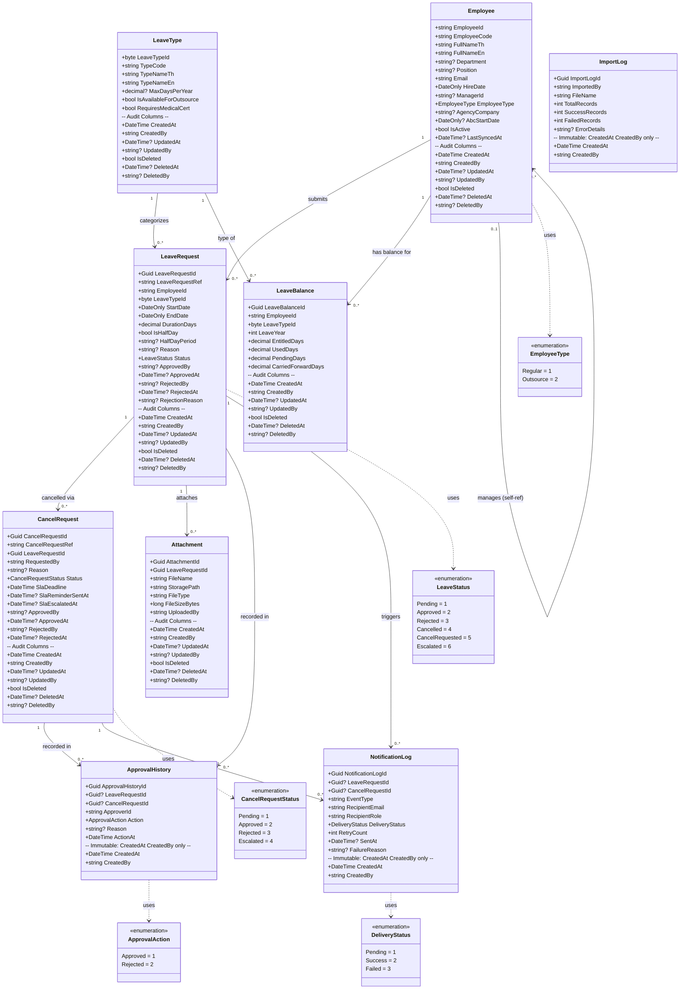

# Class Diagram: ระบบบริหารการลาและการอนุมัติ

## Change Log

| Version | Date | Section | Change Type | Description | Source |
|---------|------|---------|-------------|-------------|--------|
| 1.0 | 2026-06-17 | All | Created | สร้าง Class Diagram ครั้งแรก — 9 Entity classes, 5 Enums, Relationship และ SQLite/EF Core notes | Data Architecture Design v1.0, SRS Summary v1.0 |

---

## หมายเหตุ: SQLite vs SQL Server Type Mapping

โปรเจคนี้ใช้ **SQLite ผ่าน EF Core** — C# types ในไดอะแกรมนี้ใช้ตามมาตรฐาน .NET ส่วน SQLite จะ map ตามตารางนี้:

| C# Type | SQLite Storage | หมายเหตุ |
|---------|---------------|---------|
| `Guid` | `TEXT` (36 chars) | ต้องใช้ `HasConversion<string>()` หรือ default EF Core Guid converter |
| `string` | `TEXT` | แทน `NVARCHAR` ทั้งหมด |
| `DateTime` | `TEXT` (ISO 8601) | แทน `DATETIME2(0)` — ใช้ `.AddDateTimeKind()` ใน SQLite |
| `DateOnly` | `TEXT` (YYYY-MM-DD) | แทน `DATE` — ต้องใช้ EF Core 6.0.10+ |
| `decimal` | `TEXT` หรือ `REAL` | แนะนำ `.HasColumnType("TEXT")` เพื่อรักษา precision ของ `DECIMAL(10,2)` |
| `byte` / `int` | `INTEGER` | แทน `TINYINT`, `SMALLINT`, `INT` |
| `long` | `INTEGER` | แทน `BIGINT` |
| `bool` | `INTEGER` (0/1) | แทน `BIT` |

> **ข้อจำกัด SQLite:** ไม่มี `UNIQUEIDENTIFIER`, `NVARCHAR`, `DECIMAL`, `DATETIME2` — EF Core จัดการ mapping อัตโนมัติ แต่ต้อง configure บางส่วน (ดู Open Issues)

---

## 1. Class Diagram — Entity Classes



---

## 2. Enum Definitions

| Enum | Values | ใช้ใน Class | SRS Trace |
|------|--------|-----------|----------|
| `LeaveStatus` | Pending=1, Approved=2, Rejected=3, Cancelled=4, CancelRequested=5, Escalated=6 | `LeaveRequest.Status` | SFR-003/005/007/008/010, VR-012 |
| `CancelRequestStatus` | Pending=1, Approved=2, Rejected=3, Escalated=4 | `CancelRequest.Status` | SFR-008/009/010, VR-012 |
| `EmployeeType` | Regular=1, Outsource=2 | `Employee.EmployeeType` | BRD BR-011, VR-001, SIR-001/003 |
| `ApprovalAction` | Approved=1, Rejected=2 | `ApprovalHistory.Action` | SFR-005/009 |
| `DeliveryStatus` | Pending=1, Success=2, Failed=3 | `NotificationLog.DeliveryStatus` | NFR-007, SFR-013, RFR-003 |

---

## 3. Class Summary

| # | Class (EF Core Entity) | DB Table | กลุ่ม | Responsibility | EF Core Behavior |
|---|----------------------|---------|-------|---------------|-----------------|
| 1 | `LeaveType` | `LeaveTypes` | Master | เก็บ 7 ประเภทลา + flag IsAvailableForOutsource, RequiresMedicalCert | Mutable, Soft Delete, Global Query Filter |
| 2 | `Employee` | `Employees` | Master | พนักงานทุกคน (Regular จาก HRIS, Outsource จาก Excel) รวมในตารางเดียว — ManagerId เป็น self-reference | Mutable, Soft Delete, Global Query Filter |
| 3 | `LeaveRequest` | `LeaveRequests` | Transaction | Entity หลัก — คำขอลาของพนักงาน ติดตาม Status ตลอด lifecycle (Pending→Approved/Rejected/Cancelled/Escalated) | Mutable, Soft Delete, Transaction-safe Balance Update |
| 4 | `LeaveBalance` | `LeaveBalances` | Transaction | สิทธิ์วันลาคงเหลือต่อพนักงาน/ประเภท/ปี — Unique constraint (EmployeeId, LeaveTypeId, LeaveYear) | Mutable, Soft Delete, Atomic update ใน DB Transaction |
| 5 | `CancelRequest` | `CancelRequests` | Transaction | คำขอยกเลิกสำหรับ Leave ที่ Approved แล้ว — มี SlaDeadline, SlaReminderSentAt, SlaEscalatedAt สำหรับ SLA tracking | Mutable, Soft Delete, SLA Scheduler queries |
| 6 | `Attachment` | `Attachments` | Transaction | Metadata ของใบรับรองแพทย์ — file จริงเก็บใน Azure Blob Storage (StoragePath = Blob URL/path) | Mutable, Soft Delete |
| 7 | `ApprovalHistory` | `ApprovalHistories` | History/Log | Immutable log ของ Approve/Reject action ทั้ง LeaveRequest และ CancelRequest — ไม่มี UpdatedAt/IsDeleted | **Immutable** — CreatedAt/CreatedBy เท่านั้น |
| 8 | `NotificationLog` | `NotificationLogs` | History/Log | Immutable log การส่ง Email notification ทุก event — ติดตาม DeliveryStatus, RetryCount, FailureReason | **Immutable** — CreatedAt/CreatedBy เท่านั้น |
| 9 | `ImportLog` | `ImportLogs` | History/Log | Immutable log ผล Excel import ทุกครั้ง (Outsource onboarding) — มี ErrorDetails JSON | **Immutable** — CreatedAt/CreatedBy เท่านั้น |

---

## 4. Audit Column Summary

| Audit Column | C# Type | SQLite | Mutable Entity | Immutable Entity | หมายเหตุ |
|-------------|---------|--------|---------------|-----------------|---------|
| `CreatedAt` | `DateTime` | TEXT | ✅ | ✅ | UTC — set ครั้งแรกเท่านั้น |
| `CreatedBy` | `string` | TEXT | ✅ | ✅ | EmployeeId หรือ `"SYSTEM"` |
| `UpdatedAt` | `DateTime?` | TEXT | ✅ | ❌ | NULL ถ้ายังไม่มีการแก้ไข |
| `UpdatedBy` | `string?` | TEXT | ✅ | ❌ | — |
| `IsDeleted` | `bool` | INTEGER | ✅ | ❌ | Soft delete — ค่า default = false |
| `DeletedAt` | `DateTime?` | TEXT | ✅ | ❌ | — |
| `DeletedBy` | `string?` | TEXT | ✅ | ❌ | — |

**Immutable entities** (ไม่มี UpdatedAt/UpdatedBy/IsDeleted/DeletedAt/DeletedBy):
- `ApprovalHistory`, `NotificationLog`, `ImportLog`

**EF Core Global Query Filter** บังคับ `IsDeleted == false` ใน Mutable entities:
```csharp
// LeaveAppDbContext.cs — OnModelCreating
modelBuilder.Entity<LeaveType>().HasQueryFilter(e => !e.IsDeleted);
modelBuilder.Entity<Employee>().HasQueryFilter(e => !e.IsDeleted);
modelBuilder.Entity<LeaveRequest>().HasQueryFilter(e => !e.IsDeleted);
modelBuilder.Entity<LeaveBalance>().HasQueryFilter(e => !e.IsDeleted);
modelBuilder.Entity<CancelRequest>().HasQueryFilter(e => !e.IsDeleted);
modelBuilder.Entity<Attachment>().HasQueryFilter(e => !e.IsDeleted);
// ApprovalHistory, NotificationLog, ImportLog: ไม่มี Global Query Filter
```

---

## 5. Relationship Summary

| Relationship | Cardinality | FK Column | หมายเหตุ | SRS Trace |
|-------------|------------|----------|---------|----------|
| `Employee` → `LeaveRequest` | One-to-Many (1 : 0..\*) | `LeaveRequest.EmployeeId` → `Employee.EmployeeId` | พนักงาน 1 คนมีได้หลาย Leave Request | SFR-003 |
| `Employee` → `LeaveBalance` | One-to-Many (1 : 0..\*) | `LeaveBalance.EmployeeId` → `Employee.EmployeeId` | พนักงาน 1 คนมี balance หลายประเภท/ปี | SFR-002, NFR-010 |
| `Employee` → `Employee` (self-ref) | Zero-or-One-to-Many (0..1 : 0..\*) | `Employee.ManagerId` → `Employee.EmployeeId` | Manager มีได้หลาย subordinate; พนักงานระดับสูงสุด ManagerId = NULL | NFR-005, SFR-004 |
| `LeaveType` → `LeaveRequest` | One-to-Many (1 : 0..\*) | `LeaveRequest.LeaveTypeId` → `LeaveType.LeaveTypeId` | ประเภทลา 1 ประเภทมีได้หลาย Leave Request | SFR-003, VR-001 |
| `LeaveType` → `LeaveBalance` | One-to-Many (1 : 0..\*) | `LeaveBalance.LeaveTypeId` → `LeaveType.LeaveTypeId` | ประเภทลา 1 ประเภทมี balance record หลาย employee | SFR-002 |
| `LeaveRequest` → `CancelRequest` | One-to-Many (1 : 0..\*) | `CancelRequest.LeaveRequestId` → `LeaveRequest.LeaveRequestId` | Leave Request 1 รายการอาจมี Cancel Request ได้ (ปกติ 1 active) | SFR-008, BRD BR-015 |
| `LeaveRequest` → `Attachment` | One-to-Many (1 : 0..\*) | `Attachment.LeaveRequestId` → `LeaveRequest.LeaveRequestId` | Leave Request อาจมีหลายไฟล์แนบ (เช่น ใบรับรองแพทย์หลายฉบับ) | SIR-005, VR-007 |
| `LeaveRequest` → `ApprovalHistory` | One-to-Many (1 : 0..\*) | `ApprovalHistory.LeaveRequestId` → `LeaveRequest.LeaveRequestId` | เก็บประวัติ Approve/Reject ของ Leave; **nullable** เพราะ FK อาจเป็น CancelRequest แทน | SFR-005, BRD BR-012 |
| `LeaveRequest` → `NotificationLog` | One-to-Many (1 : 0..\*) | `NotificationLog.LeaveRequestId` → `LeaveRequest.LeaveRequestId` | เก็บ log notification ทุก event ของ Leave; **nullable** เพราะ FK อาจเป็น CancelRequest แทน | SFR-013, NFR-007 |
| `CancelRequest` → `ApprovalHistory` | One-to-Many (1 : 0..\*) | `ApprovalHistory.CancelRequestId` → `CancelRequest.CancelRequestId` | เก็บประวัติ Approve/Reject ของ Cancel; **nullable** | SFR-009, BRD BR-015 |
| `CancelRequest` → `NotificationLog` | One-to-Many (1 : 0..\*) | `NotificationLog.CancelRequestId` → `CancelRequest.CancelRequestId` | เก็บ log notification ของ Cancel flow; **nullable** | SFR-010, SFR-013 |
| `ImportLog` | Standalone | ไม่มี FK | ImportLog เก็บ log per import batch — ไม่ FK กับ Employee โดยตรง (import result stored as JSON) | SFR-012, IF-003 |

**หมายเหตุ Nullable FK ใน ApprovalHistory และ NotificationLog:**
> `ApprovalHistory.LeaveRequestId` และ `ApprovalHistory.CancelRequestId` เป็น nullable ทั้งคู่ — record หนึ่งจะมีค่าแค่ FK เดียว (ไม่ใช่ทั้งสอง) ทำเช่นเดียวกันกับ `NotificationLog` → Application Layer ต้อง enforce constraint นี้ (SQLite ไม่มี CHECK constraint แบบ `(LeaveRequestId IS NOT NULL) XOR (CancelRequestId IS NOT NULL)` โดยตรง)

---

## 6. EF Core Configuration สำคัญ (SQLite)

```csharp
// LeaveAppDbContext.cs — OnModelCreating (ส่วนที่ต้อง configure สำหรับ SQLite)

// Employee: Self-reference (Manager)
modelBuilder.Entity<Employee>()
    .HasOne(e => e.Manager)
    .WithMany(e => e.Subordinates)
    .HasForeignKey(e => e.ManagerId)
    .IsRequired(false)
    .OnDelete(DeleteBehavior.Restrict);

// LeaveBalance: Unique constraint
modelBuilder.Entity<LeaveBalance>()
    .HasIndex(lb => new { lb.EmployeeId, lb.LeaveTypeId, lb.LeaveYear })
    .IsUnique()
    .HasDatabaseName("UQ_LeaveBalances_Employee_Type_Year");

// Employee: Unique email
modelBuilder.Entity<Employee>()
    .HasIndex(e => e.Email)
    .IsUnique()
    .HasDatabaseName("UQ_Employees_Email");

// Decimal precision สำหรับ SQLite — ใช้ TEXT เพื่อรักษา precision
modelBuilder.Entity<LeaveRequest>()
    .Property(lr => lr.DurationDays)
    .HasColumnType("TEXT");

modelBuilder.Entity<LeaveBalance>()
    .Property(lb => lb.EntitledDays).HasColumnType("TEXT");
modelBuilder.Entity<LeaveBalance>()
    .Property(lb => lb.UsedDays).HasColumnType("TEXT");
modelBuilder.Entity<LeaveBalance>()
    .Property(lb => lb.PendingDays).HasColumnType("TEXT");
modelBuilder.Entity<LeaveBalance>()
    .Property(lb => lb.CarriedForwardDays).HasColumnType("TEXT");

// Guid → TEXT ใน SQLite (ถ้า default EF Core ไม่ handle อัตโนมัติ)
modelBuilder.Entity<LeaveRequest>()
    .Property(lr => lr.LeaveRequestId)
    .HasConversion<string>();
// (ทำซ้ำสำหรับทุก Guid PK)

// Enum → int (stored as INTEGER in SQLite)
modelBuilder.Entity<LeaveRequest>()
    .Property(lr => lr.Status)
    .HasConversion<int>();

modelBuilder.Entity<Employee>()
    .Property(e => e.EmployeeType)
    .HasConversion<int>();
```

---

## 7. Open Issues

| OI ID | ประเด็น | ผลกระทบต่อ Class Diagram | สิ่งที่ต้องทำ |
|-------|---------|------------------------|------------|
| **OI-001** | **Guid Storage ใน SQLite** — EF Core 7+ จัดการ Guid เป็น BLOB โดยอัตโนมัติ แต่บางเวอร์ชันอาจต้องการ `HasConversion<string>()` ชัดเจน | กระทบ PK ของ LeaveRequest, LeaveBalance, CancelRequest, Attachment, ApprovalHistory, NotificationLog, ImportLog | ยืนยัน EF Core version และ SQLite provider ที่ใช้ ทดสอบ migration |
| **OI-002** | **decimal precision ใน SQLite** — SQLite ไม่มี native DECIMAL type; ค่า `DurationDays`, `EntitledDays`, `UsedDays`, `PendingDays`, `CarriedForwardDays` อาจเสีย precision ถ้าเก็บเป็น REAL | กระทบ LeaveBalance ทุก decimal field, LeaveRequest.DurationDays | ใช้ `.HasColumnType("TEXT")` สำหรับ decimal fields ที่ต้องการ precision (0.5 day) |
| **OI-003** | **DateOnly ใน SQLite** — EF Core support `DateOnly` สำหรับ SQLite ตั้งแต่ version 7.0+ ผ่าน `Microsoft.EntityFrameworkCore.Sqlite` เท่านั้น | กระทบ `Employee.HireDate`, `Employee.AbcStartDate`, `LeaveRequest.StartDate`, `LeaveRequest.EndDate` | ยืนยัน EF Core version ≥ 7.0 หรือ เปลี่ยนเป็น `DateTime` และ trim เวลา |
| **OI-004** | **ApprovalHistory: Exclusive FK** — record หนึ่งควรมีแค่ `LeaveRequestId` หรือ `CancelRequestId` ไม่ใช่ทั้งสอง แต่ SQLite ไม่ support CHECK constraint `XOR` | อาจเกิด data inconsistency ถ้า Application Layer ไม่ enforce | เพิ่ม Application-level validation ใน `ApprovalHistoryService` หรือพิจารณาแยกเป็น 2 tables (LeaveApprovalHistory, CancelApprovalHistory) |
| **OI-005** | **NotificationLog: Exclusive FK** — เช่นเดียวกับ OI-004 | กระทบ `NotificationLog.LeaveRequestId` และ `NotificationLog.CancelRequestId` | เช่นเดียวกับ OI-004 |
| **OI-006** | **EmployeeId เป็น string PK** — EF Core รองรับ string PK แต่ SQLite index บน TEXT อาจช้ากว่า INTEGER | กระทบ performance ของ query ที่ JOIN กับ `Employees` table | หากพบ performance issue พิจารณา add surrogate Guid PK แยก + ใช้ EmployeeId เป็น unique index |
| **OI-007** | **LeaveType.MaxDaysPerYear สำหรับ LeaveType 4-7** (ลาคลอด/ทำหมัน/รับราชการ/อุปสมบท) ยังไม่มีค่า | ไม่สามารถ validate quota ได้ — VR-001 ทำงานไม่สมบูรณ์ | HR ยืนยันค่า MaxDaysPerYear ก่อน seed data |
| **OI-008** | **LeaveYear เป็น ค.ศ. หรือ พ.ศ.** — ยังไม่ยืนยัน (`int LeaveYear` ใน `LeaveBalance`) | กระทบ entitlement calculation และ balance reset logic | HR ยืนยัน leave year definition |
| **OI-009** | **Carry-forward Formula** — ไม่ชัดว่าคำนวณ `CarriedForwardDays` อย่างไร (pro-rata หรือเต็มจำนวน, cap 30 วัน) | กระทบ logic ใน `LeaveBalanceService.CalculateCarryForward()` | HR ยืนยัน formula |
| **OI-010** | **SLA Working Hours** — `CancelRequest.SlaDeadline` คำนวณจาก "1 วันทำการ" แต่ยังไม่ชัดว่ากี่ชั่วโมง และนับวันหยุดอย่างไร | กระทบ `SlaSchedulerService` และ `SlaDeadline` calculation | HR ยืนยัน working hours definition |

---

## 8. Source Reference

- `20-system-design/a0-architecture-design/02-data-architecture/leave-request-and-approval-data-architecture-design.md` — Schema design, DDL, Table definitions
- `10-requirement-definition/b0-system-requriement/leave-request-and-approval-system-requirement-specification-summary.md` — SRS (SFR, NFR, TR, VR, SIR)
- `80-knowledge-base/SDLC/ai-std-sdlc.md` §2 — Data Architecture Standard
- Microsoft EF Core SQLite Documentation
- SQLite Data Types: https://www.sqlite.org/datatype3.html

---

*Class Diagram นี้แสดง C# class สำหรับ EF Core entities — ทุก relationship trace กลับสู่ SRS ผ่าน Section 5 (Relationship Summary) และสอดคล้องกับ Data Architecture Design v1.0*
