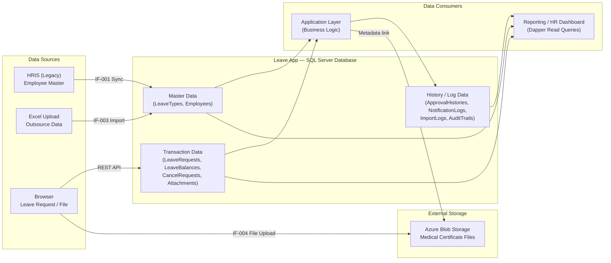
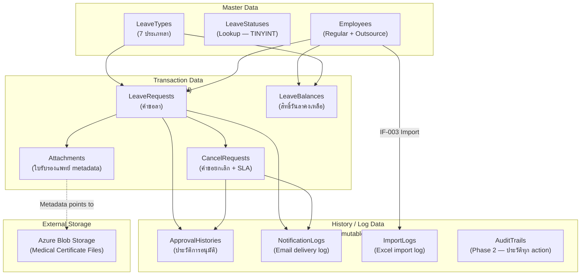
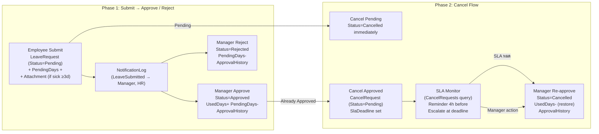

# Data Architecture Design: ระบบบริหารการลาและการอนุมัติ (Leave Request and Approval)

## Change Log

| Version | Date | Section | Change Type | Description | Source |
|---------|------|---------|-------------|-------------|--------|
| 1.0 | 2026-06-16 | All | Created | สร้างเอกสารครั้งแรก — ครอบคลุม Database Stack, Schema Design, Naming Convention, Data Types, Audit Columns, Access Pattern, Index Strategy, Retention & Backup | SRS Summary v1.0, Non-Functional/Technical SRS v1.0, Interface SRS v1.0 |

---

## 1. วัตถุประสงค์และขอบเขต

### 1.1 วัตถุประสงค์

เอกสารนี้กำหนด Data Architecture ของระบบบริหารการลาและการอนุมัติ (Leave Request and Approval) สำหรับ ABC Company โดยระบุ Database Technology Stack, Logical Data Model, Naming Convention, Data Type Standard, Audit Columns, Data Access Pattern, Index Strategy, Data Classification, Retention Policy และ Backup Strategy ที่ยึดตามมาตรฐานองค์กรจาก `80-knowledge-base/architecture-design/02-data-architecture/knowledge.md` เท่านั้น

### 1.2 ขอบเขต (In-Scope)

- Logical Data Model สำหรับระบบ Leave Request and Approval (Phase 1 + Phase 2)
- Database Technology Stack และ Platform Standard
- Naming Convention, Data Type Standard, Audit Columns
- Data Grouping: Master Data, Transaction Data, History/Log Data
- Data Access Pattern (EF Core / Dapper)
- Index Strategy สำหรับ query pattern หลัก
- Data Classification (ISO 27001)
- Backup, Recovery, และ Retention Policy
- Schema Migration Strategy

### 1.3 ขอบเขตที่ไม่ครอบคลุม (Out-of-Scope)

- Physical Database Design (DDL รายละเอียด, Partitioning, Filegroup) — อยู่ใน Detailed DB Design
- API Specification / Stored Procedure body — อยู่ใน Detailed Design
- HRIS Database Schema (external system — ไม่อยู่ในขอบเขต)
- Application Architecture (อยู่ใน Application Architecture Design document แยก)
- Reporting / BI Analytics Platform (Azure Synapse) — ระบบนี้ใช้ OLTP เท่านั้น

---

## 2. Source Reference

| รายการ | เอกสารอ้างอิง |
|--------|-------------|
| Data Architecture Knowledge | `80-knowledge-base/architecture-design/02-data-architecture/knowledge.md` |
| SDLC Standard | `80-knowledge-base/SDLC/ai-std-sdlc.md` |
| SRS Summary | `10-requirement-definition/b0-system-requriement/leave-request-and-approval-system-requirement-specification-summary.md` |
| Non-Functional / Technical SRS | `10-requirement-definition/b0-system-requriement/leave-request-and-approval-non-functional-tech-srs.md` |
| Interface SRS | `10-requirement-definition/b0-system-requriement/leave-request-and-approval-interface-srs.md` |
| Microsoft Learn | SQL Server 2022 / Azure SQL Database Best Practice |
| ISO 27001 | Annex A 5.12 — Information Classification |

---

## 3. Data Architecture Drivers

### 3.1 Transaction Drivers

| Driver | รายละเอียด | SRS Reference |
|--------|-----------|--------------|
| Leave Request CRUD | ระบบสร้าง อ่าน อัปเดต (status) Leave Request หลายรายการต่อวัน | SFR-003/004/005/006/007/008 |
| Leave Balance Integrity | Balance ต้องอัปเดตถูกต้องทุกครั้งที่ Approve/Cancel — ป้องกัน race condition | NFR-010, BRD BR-016 |
| SLA Deadline Tracking | Cancel Request ต้อง track SLA_deadline และ query ได้อย่างรวดเร็ว | NFR-011, SIR-004, IF-005 |
| Email Notification Log | บันทึก delivery status ทุก email event พร้อม retry tracking | NFR-007, SFR-013 |
| Dual Employee Source | พนักงานประจำมาจาก HRIS (IF-001), Outsource มาจาก Excel Import (IF-003) — เก็บรวมในตารางเดียว | SIR-001/003, BRD BR-011 |

### 3.2 Reporting Drivers

| Driver | รายละเอียด | SRS Reference |
|--------|-----------|--------------|
| HR Monitoring Dashboard | query รายการคำขอทั้งองค์กร กรองได้ตาม status, แผนก, employee_type, วันที่ | SFR-011, SCR-008 |
| Leave Balance Report | ดู balance รายบุคคล ณ วันที่ระบุ — แยกตาม entitlement, used, pending, carried forward | RFR-002, SFR-002 |
| Leave Summary Report (Phase 2) | รายงานสรุปการลาทั้งองค์กร — aggregate by type, department, employee_type | RFR-001, SFR-015 |
| Notification Log Report (Phase 2) | ตรวจสอบ email log — filter by event, recipient, date, status | RFR-003, SFR-013 |

### 3.3 Governance / Retention Drivers

| Driver | รายละเอียด | SRS Reference |
|--------|-----------|--------------|
| RBAC Data Isolation | Employee เห็นเฉพาะข้อมูลตนเอง, Manager เห็นทีม, HR เห็นทั้งหมด — enforce ที่ Backend | NFR-005, BRD §4 |
| PDPA / Data Privacy | ข้อมูลพนักงาน Outsource ปกป้องเทียบเท่าพนักงานประจำ | NFR-006, BRD §7.7 |
| Medical Certificate Restricted | ใบรับรองแพทย์เป็นข้อมูล Restricted — encrypt + audit log ทุก access | TR-009 (Phase 2) |
| Audit Trail (Phase 2) | เก็บประวัติทุก action ใน immutable log | TR-009, BRD BR-009 |
| Data Retention | transaction data 2 ปี active / 5 ปี archive, audit log 1 ปี active / 3 ปี archive | knowledge.md §7 |

---

## 4. Visual Data Landscape



**คำอธิบาย:**
- SQL Server คือ single source of truth สำหรับข้อมูล transactional ทั้งหมด
- Azure Blob Storage เก็บไฟล์ใบรับรองแพทย์จริง — DB เก็บแค่ metadata (path, filename, size)
- HRIS เป็น master สำหรับพนักงานประจำ — Leave App ไม่ write กลับ HRIS
- ทุกการเข้าถึงข้อมูลต้องผ่าน Application Layer — Frontend ไม่เข้า DB โดยตรง

---

## 5. Database Platform & Standards

### 5.1 Database Technology Stack

**อ้างอิง:** knowledge.md §2.1, ai-std-sdlc.md §2.1

| ประเภทข้อมูล | เทคโนโลยีที่เลือก | เหตุผล | SRS Trace |
|-------------|-----------------|-------|----------|
| **Transactional (OLTP)** | **SQL Server (Latest Version) / Azure SQL Database** | มาตรฐานองค์กร — ระบบ Leave Request เป็น OLTP workflow ชัดเจน | TR-001, ai-std-sdlc.md §2.1 |
| **File / Blob** | **Azure Blob Storage** | มาตรฐานองค์กร — เก็บใบรับรองแพทย์ (PDF/JPG/PNG) | SIR-005, IF-004, ai-std-sdlc.md §2.1 |
| **Cache** | **Azure Cache for Redis** (ถ้าจำเป็น) | Leave Balance query ที่ใช้บ่อย — พิจารณาตามจำนวน concurrent users | NFR-002, ai-std-sdlc.md §2.1 |

> **ไม่เลือก:**
> - Azure Synapse Analytics — ระบบนี้เป็น OLTP ขนาดกลาง ไม่ต้องการ OLAP
> - Azure Cosmos DB — ข้อมูล Leave Request เป็น relational structured — SQL Server เหมาะกว่า

### 5.2 Naming Convention

**อ้างอิง:** knowledge.md §2.2.1

| ประเภท | รูปแบบ | ตัวอย่างในระบบนี้ |
|--------|--------|-----------------|
| **Table** | PascalCase, พหูพจน์ | `LeaveRequests`, `Employees`, `LeaveBalances`, `CancelRequests` |
| **Column** | PascalCase | `EmployeeId`, `StartDate`, `DurationDays`, `SlaDeadline` |
| **Primary Key** | `{TableName}Id` | `LeaveRequestId`, `EmployeeId`, `CancelRequestId` |
| **Foreign Key** | `FK_{ChildTable}_{ParentTable}` | `FK_LeaveRequests_Employees`, `FK_LeaveBalances_LeaveTypes` |
| **Index** | `IX_{TableName}_{Columns}` | `IX_LeaveRequests_EmployeeId_Status`, `IX_CancelRequests_Status_SlaDeadline` |
| **Unique Constraint** | `UQ_{TableName}_{Columns}` | `UQ_Employees_Email`, `UQ_LeaveBalances_Employee_Type_Year` |
| **Check Constraint** | `CK_{TableName}_{Column}` | `CK_LeaveRequests_Status`, `CK_CancelRequests_Status` |
| **View** | `vw_{Description}` | `vw_LeaveRequestSummary`, `vw_EmployeeLeaveBalance` |
| **Stored Procedure** | `usp_{Action}{Entity}` | `usp_GetLeaveBalance`, `usp_GetPendingCancelRequests` |

### 5.3 Data Type Standard

**อ้างอิง:** knowledge.md §2.2.2, ai-std-sdlc.md §2.3

| ประเภทข้อมูล | SQL Server Type | เหตุผล | ตัวอย่างในระบบนี้ |
|-------------|---------------|-------|-----------------|
| **รหัส Record (ID)** | `UNIQUEIDENTIFIER` | รองรับ distributed system, ไม่เปิดเผย sequence | `LeaveRequestId`, `CancelRequestId` |
| **รหัสพนักงาน (Business Key)** | `NVARCHAR(20)` | Business key จาก HRIS — ไม่ใช่ auto-increment | `EmployeeId` (เช่น EMP001, OUT001) |
| **รหัสสั้น (Code)** | `NVARCHAR(20)` | Leave Type Code, Status Code | `TypeCode`, `EmployeeCode` |
| **ชื่อภาษาไทย** | `NVARCHAR(200)` | บังคับ NVARCHAR สำหรับ Unicode Thai | `FullNameTh`, `TypeNameTh`, `Department` |
| **ชื่อภาษาอังกฤษ** | `NVARCHAR(200)` | ใช้ NVARCHAR เพื่อความสม่ำเสมอ | `FullNameEn`, `TypeNameEn` |
| **Email** | `NVARCHAR(200)` | รองรับ Unicode domain | `Email`, `RecipientEmail` |
| **วันที่** | `DATE` | เฉพาะวันที่ — ไม่มีเวลา | `StartDate`, `EndDate`, `HireDate` |
| **วันที่เวลา (UTC)** | `DATETIME2(0)` | UTC เสมอ — แปลง local ที่ Presentation Layer | `SlaDeadline`, `ActionAt`, `CreatedAt` |
| **จำนวนวันลา** | `DECIMAL(10,2)` | รองรับครึ่งวัน (0.5) — ห้ามใช้ FLOAT | `DurationDays`, `EntitledDays`, `UsedDays` |
| **สถานะ (Enum)** | `TINYINT` | ประหยัด storage + มี lookup table | `Status`, `EmployeeType`, `DeliveryStatus` |
| **Flag** | `BIT` | 0/1 — ชัดเจน | `IsAvailableForOutsource`, `IsActive`, `IsDeleted` |
| **ข้อความยาว** | `NVARCHAR(MAX)` | Reason, Comment, ErrorDetails | `Reason`, `FailureReason`, `ErrorDetails` |
| **File Path** | `NVARCHAR(2000)` | Azure Blob URL อาจยาวมาก | `StoragePath` |
| **File Size** | `BIGINT` | Bytes — รองรับไฟล์ขนาดใหญ่ | `FileSizeBytes` |
| **Counter** | `INT` | นับ records | `TotalRecords`, `SuccessRecords` |
| **Retry Count** | `TINYINT` | max retry = 3 ใน range TINYINT (0-255) | `RetryCount` |

### 5.4 Audit Columns มาตรฐาน

**อ้างอิง:** knowledge.md §2.2.3, ai-std-sdlc.md §2.4

ทุกตารางต้องมี audit columns ต่อไปนี้:

```sql
-- Audit Columns มาตรฐาน (ทุกตารางต้องมี)
CreatedAt       DATETIME2(0)    NOT NULL DEFAULT GETUTCDATE(),  -- UTC เสมอ
CreatedBy       NVARCHAR(100)   NOT NULL,                        -- EmployeeId หรือ 'SYSTEM'
UpdatedAt       DATETIME2(0)    NULL,
UpdatedBy       NVARCHAR(100)   NULL,
IsDeleted       BIT             NOT NULL DEFAULT 0,              -- Soft Delete เสมอ
DeletedAt       DATETIME2(0)    NULL,
DeletedBy       NVARCHAR(100)   NULL
```

**กฎสำคัญ:**
- **Soft Delete เสมอ** — `IsDeleted = 1` แทนการ DELETE จริง
- **UTC เสมอ** — แปลงเป็น local time ที่ Presentation Layer (Angular)
- **ทุก query ต้องมี** `WHERE IsDeleted = 0` — บังคับผ่าน EF Core Global Query Filter
- `ApprovalHistories` และ `NotificationLogs` เป็น **immutable log** — มีเฉพาะ `CreatedAt`, `CreatedBy` ไม่มี Update/Delete columns

---

## 6. Logical Data Model / Entity Grouping

### 6.1 Entity Grouping Overview



### 6.2 Entity Descriptions

| กลุ่ม | Entity | คำอธิบาย | SRS Trace |
|-------|--------|---------|----------|
| **Master** | `LeaveTypes` | 7 ประเภทลา + กำหนดว่า Outsource มีสิทธิ์หรือไม่ | SFR-002, VR-001, BRD BR-011 |
| **Master** | `Employees` | พนักงานทั้งหมด (Regular จาก IF-001, Outsource จาก IF-003) | SIR-001/003, BRD BR-001 |
| **Transaction** | `LeaveRequests` | คำขอลา — entity หลักของระบบ | SFR-003/004/005/006/007/008 |
| **Transaction** | `LeaveBalances` | สิทธิ์วันลาคงเหลือ รายพนักงาน/ประเภท/ปี | SFR-002, NFR-010, BRD BR-002/008/009 |
| **Transaction** | `CancelRequests` | คำขอยกเลิก Approved leave + SLA tracking | SFR-008/009/010, BRD BR-015/018 |
| **Transaction** | `Attachments` | Metadata ใบรับรองแพทย์ — actual file ใน Azure Blob | SIR-005, IF-004, VR-007 |
| **History** | `ApprovalHistories` | ประวัติ Approve/Reject ทุกครั้ง — immutable | SFR-005/009, BRD BR-012/013 |
| **History** | `NotificationLogs` | Email delivery log ทุก event — monitor KPI | SFR-013, NFR-007, RFR-003 |
| **History** | `ImportLogs` | บันทึกผล Excel import ทุกครั้ง | SFR-012, IF-003 |
| **History** | `AuditTrails` | Phase 2 — ประวัติทุก data change | TR-009, BRD BR-009 |

### 6.3 Logical Schema Design

#### 6.3.1 LeaveTypes (Master — Lookup)

```sql
CREATE TABLE LeaveTypes (
    LeaveTypeId              TINYINT         NOT NULL CONSTRAINT PK_LeaveTypes PRIMARY KEY,
    TypeCode                 NVARCHAR(20)    NOT NULL,
    TypeNameTh               NVARCHAR(100)   NOT NULL,
    TypeNameEn               NVARCHAR(100)   NOT NULL,
    MaxDaysPerYear           DECIMAL(10,2)   NULL,      -- NULL = ไม่จำกัด (ลาป่วย)
    IsAvailableForOutsource  BIT             NOT NULL DEFAULT 0,
    RequiresMedicalCert      BIT             NOT NULL DEFAULT 0, -- ลาป่วย ≥ 3 วัน
    -- Audit Columns
    CreatedAt   DATETIME2(0) NOT NULL DEFAULT GETUTCDATE(),
    CreatedBy   NVARCHAR(100) NOT NULL,
    UpdatedAt   DATETIME2(0) NULL,
    UpdatedBy   NVARCHAR(100) NULL,
    IsDeleted   BIT NOT NULL DEFAULT 0,
    DeletedAt   DATETIME2(0) NULL,
    DeletedBy   NVARCHAR(100) NULL
);
```

**Seed Data (7 ประเภทลาตาม BRD):**

| LeaveTypeId | TypeCode | TypeNameTh | IsAvailableForOutsource | MaxDaysPerYear |
|-------------|----------|-----------|------------------------|---------------|
| 1 | ANNUAL | ลาพักผ่อนประจำปี | 0 (ประจำเท่านั้น) | ขึ้นกับอายุงาน (BR-008) |
| 2 | SICK | ลาป่วย | 1 | NULL (ไม่จำกัด) |
| 3 | PERSONAL | ลากิจ | 1 | 3 วัน/ปี (BR-010) |
| 4 | MATERNITY | ลาคลอด | 0 (ประจำเท่านั้น) | ตามกฎหมายแรงงาน |
| 5 | STERILIZATION | ลาทำหมัน | 0 (ประจำเท่านั้น) | ตามกฎหมายแรงงาน |
| 6 | MILITARY | ลารับราชการ | 0 (ประจำเท่านั้น) | ตามกฎหมายแรงงาน |
| 7 | ORDINATION | ลาอุปสมบท | 0 (ประจำเท่านั้น) | ตามกฎหมายแรงงาน |

> **Assumption A1:** จำนวนวันสำหรับ LeaveType 4-7 (ลาคลอด/ทำหมัน/รับราชการ/อุปสมบท) ยังเป็น Open Issue ตาม SRS §7 — seed data เบื้องต้น ต้องยืนยันกับ HR พร้อม reference กฎหมายแรงงาน

#### 6.3.2 Employees (Master — พนักงาน Regular + Outsource)

```sql
CREATE TABLE Employees (
    EmployeeId      NVARCHAR(20)    NOT NULL CONSTRAINT PK_Employees PRIMARY KEY,
    EmployeeCode    NVARCHAR(20)    NOT NULL,
    FullNameTh      NVARCHAR(200)   NOT NULL,
    FullNameEn      NVARCHAR(200)   NOT NULL,
    Department      NVARCHAR(200)   NULL,
    Position        NVARCHAR(200)   NULL,
    Email           NVARCHAR(200)   NOT NULL,
    HireDate        DATE            NOT NULL,  -- วันเริ่มงาน — ใช้คำนวณ entitlement
    ManagerId       NVARCHAR(20)    NULL,      -- FK → Employees(EmployeeId) self-reference
    EmployeeType    TINYINT         NOT NULL,  -- 1=Regular, 2=Outsource
    AgencyCompany   NVARCHAR(200)   NULL,      -- เฉพาะ Outsource (IF-003 field)
    AbcStartDate    DATE            NULL,      -- วันเริ่มงานที่ ABC (สำหรับ Outsource)
    IsActive        BIT             NOT NULL DEFAULT 1,
    LastSyncedAt    DATETIME2(0)    NULL,      -- เวลา sync จาก HRIS ล่าสุด (IF-001)
    -- Audit Columns
    CreatedAt   DATETIME2(0) NOT NULL DEFAULT GETUTCDATE(),
    CreatedBy   NVARCHAR(100) NOT NULL,        -- 'SYSTEM' สำหรับ HRIS sync, EmployeeId HR สำหรับ import
    UpdatedAt   DATETIME2(0) NULL,
    UpdatedBy   NVARCHAR(100) NULL,
    IsDeleted   BIT NOT NULL DEFAULT 0,
    DeletedAt   DATETIME2(0) NULL,
    DeletedBy   NVARCHAR(100) NULL,

    CONSTRAINT FK_Employees_Manager FOREIGN KEY (ManagerId) REFERENCES Employees(EmployeeId),
    CONSTRAINT UQ_Employees_Email UNIQUE (Email),
    CONSTRAINT UQ_Employees_EmployeeCode UNIQUE (EmployeeCode),
    CONSTRAINT CK_Employees_EmployeeType CHECK (EmployeeType IN (1, 2))
);
```

**หมายเหตุ:** `EmployeeId` ใช้ business key จาก HRIS (เช่น EMP001) ไม่ใช่ GUID เพื่อให้ HRIS sync ง่ายและ trace ได้

#### 6.3.3 LeaveRequests (Transaction — entity หลัก)

```sql
CREATE TABLE LeaveRequests (
    LeaveRequestId  UNIQUEIDENTIFIER NOT NULL DEFAULT NEWID()
                    CONSTRAINT PK_LeaveRequests PRIMARY KEY,
    LeaveRequestRef NVARCHAR(30)     NOT NULL,  -- Business reference: LR-2026-00001
    EmployeeId      NVARCHAR(20)     NOT NULL,
    LeaveTypeId     TINYINT          NOT NULL,
    StartDate       DATE             NOT NULL,
    EndDate         DATE             NOT NULL,
    DurationDays    DECIMAL(10,2)    NOT NULL,  -- รองรับครึ่งวัน
    IsHalfDay       BIT              NOT NULL DEFAULT 0,
    HalfDayPeriod   NVARCHAR(10)     NULL,      -- 'AM' หรือ 'PM' (หากเป็นครึ่งวัน)
    Reason          NVARCHAR(MAX)    NULL,
    Status          TINYINT          NOT NULL DEFAULT 1,
    -- Status: 1=Pending, 2=Approved, 3=Rejected, 4=Cancelled, 5=CancelRequested, 6=Escalated
    ApprovedBy      NVARCHAR(20)     NULL,       -- EmployeeId ของ Manager ที่ Approve
    ApprovedAt      DATETIME2(0)     NULL,
    RejectedBy      NVARCHAR(20)     NULL,
    RejectedAt      DATETIME2(0)     NULL,
    RejectionReason NVARCHAR(MAX)    NULL,
    -- Audit Columns
    CreatedAt   DATETIME2(0) NOT NULL DEFAULT GETUTCDATE(),
    CreatedBy   NVARCHAR(100) NOT NULL,
    UpdatedAt   DATETIME2(0) NULL,
    UpdatedBy   NVARCHAR(100) NULL,
    IsDeleted   BIT NOT NULL DEFAULT 0,
    DeletedAt   DATETIME2(0) NULL,
    DeletedBy   NVARCHAR(100) NULL,

    CONSTRAINT FK_LeaveRequests_Employees FOREIGN KEY (EmployeeId) REFERENCES Employees(EmployeeId),
    CONSTRAINT FK_LeaveRequests_LeaveTypes FOREIGN KEY (LeaveTypeId) REFERENCES LeaveTypes(LeaveTypeId),
    CONSTRAINT CK_LeaveRequests_Status CHECK (Status IN (1,2,3,4,5,6)),
    CONSTRAINT CK_LeaveRequests_DateRange CHECK (EndDate >= StartDate)
);
```

**LeaveStatus Lookup (TINYINT):**

| Value | Status | คำอธิบาย | SRS Trace |
|-------|--------|---------|----------|
| 1 | Pending | รออนุมัติ | SFR-003 |
| 2 | Approved | อนุมัติแล้ว | SFR-005 |
| 3 | Rejected | ปฏิเสธ | SFR-005 |
| 4 | Cancelled | ยกเลิกสำเร็จ | SFR-007/009 |
| 5 | CancelRequested | ส่งคำขอยกเลิก (รอ Manager re-approve) | SFR-008 |
| 6 | Escalated | SLA หมดเวลา — Escalated ไป HR | SFR-010, VR-012 |

#### 6.3.4 LeaveBalances (Transaction — สิทธิ์วันลา)

```sql
CREATE TABLE LeaveBalances (
    LeaveBalanceId     UNIQUEIDENTIFIER NOT NULL DEFAULT NEWID()
                       CONSTRAINT PK_LeaveBalances PRIMARY KEY,
    EmployeeId         NVARCHAR(20)    NOT NULL,
    LeaveTypeId        TINYINT         NOT NULL,
    LeaveYear          SMALLINT        NOT NULL,  -- ปี พ.ศ. หรือ ค.ศ. — Assumption A2
    EntitledDays       DECIMAL(10,2)   NOT NULL DEFAULT 0,
    UsedDays           DECIMAL(10,2)   NOT NULL DEFAULT 0,
    PendingDays        DECIMAL(10,2)   NOT NULL DEFAULT 0,  -- วันที่ Pending approval
    CarriedForwardDays DECIMAL(10,2)   NOT NULL DEFAULT 0,  -- ยอดยกมา (cap 30 วัน — BR-009)
    -- Audit Columns
    CreatedAt   DATETIME2(0) NOT NULL DEFAULT GETUTCDATE(),
    CreatedBy   NVARCHAR(100) NOT NULL,
    UpdatedAt   DATETIME2(0) NULL,
    UpdatedBy   NVARCHAR(100) NULL,
    IsDeleted   BIT NOT NULL DEFAULT 0,
    DeletedAt   DATETIME2(0) NULL,
    DeletedBy   NVARCHAR(100) NULL,

    CONSTRAINT FK_LeaveBalances_Employees FOREIGN KEY (EmployeeId) REFERENCES Employees(EmployeeId),
    CONSTRAINT FK_LeaveBalances_LeaveTypes FOREIGN KEY (LeaveTypeId) REFERENCES LeaveTypes(LeaveTypeId),
    CONSTRAINT UQ_LeaveBalances_Employee_Type_Year UNIQUE (EmployeeId, LeaveTypeId, LeaveYear),
    CONSTRAINT CK_LeaveBalances_UsedDays CHECK (UsedDays >= 0),
    CONSTRAINT CK_LeaveBalances_PendingDays CHECK (PendingDays >= 0)
);
```

> **Assumption A2:** `LeaveYear` ใช้ ค.ศ. (Gregorian year) — ต้องยืนยันกับ HR ว่าองค์กรใช้ปีงบประมาณ ค.ศ. หรือ พ.ศ.

#### 6.3.5 CancelRequests (Transaction — SLA Tracking)

```sql
CREATE TABLE CancelRequests (
    CancelRequestId    UNIQUEIDENTIFIER NOT NULL DEFAULT NEWID()
                       CONSTRAINT PK_CancelRequests PRIMARY KEY,
    CancelRequestRef   NVARCHAR(30)    NOT NULL,  -- CR-2026-00001
    LeaveRequestId     UNIQUEIDENTIFIER NOT NULL,
    RequestedBy        NVARCHAR(20)    NOT NULL,  -- EmployeeId
    Reason             NVARCHAR(MAX)   NULL,
    Status             TINYINT         NOT NULL DEFAULT 1,
    -- Status: 1=Pending, 2=Approved, 3=Rejected, 4=Escalated
    SlaDeadline        DATETIME2(0)    NOT NULL,  -- UTC: วันทำการถัดไป (BRD BR-018)
    SlaReminderSentAt  DATETIME2(0)    NULL,      -- เวลาที่ส่ง Reminder (4h ก่อน deadline)
    SlaEscalatedAt     DATETIME2(0)    NULL,      -- เวลาที่ Escalate
    ApprovedBy         NVARCHAR(20)    NULL,
    ApprovedAt         DATETIME2(0)    NULL,
    RejectedBy         NVARCHAR(20)    NULL,
    RejectedAt         DATETIME2(0)    NULL,
    -- Audit Columns
    CreatedAt   DATETIME2(0) NOT NULL DEFAULT GETUTCDATE(),
    CreatedBy   NVARCHAR(100) NOT NULL,
    UpdatedAt   DATETIME2(0) NULL,
    UpdatedBy   NVARCHAR(100) NULL,
    IsDeleted   BIT NOT NULL DEFAULT 0,
    DeletedAt   DATETIME2(0) NULL,
    DeletedBy   NVARCHAR(100) NULL,

    CONSTRAINT FK_CancelRequests_LeaveRequests FOREIGN KEY (LeaveRequestId) REFERENCES LeaveRequests(LeaveRequestId),
    CONSTRAINT CK_CancelRequests_Status CHECK (Status IN (1,2,3,4))
);
```

#### 6.3.6 Attachments (Transaction — File Metadata)

```sql
CREATE TABLE Attachments (
    AttachmentId    UNIQUEIDENTIFIER NOT NULL DEFAULT NEWID()
                    CONSTRAINT PK_Attachments PRIMARY KEY,
    LeaveRequestId  UNIQUEIDENTIFIER NOT NULL,
    FileName        NVARCHAR(500)   NOT NULL,
    StoragePath     NVARCHAR(2000)  NOT NULL,  -- Azure Blob URL / path
    FileType        NVARCHAR(20)    NOT NULL,  -- 'PDF', 'JPG', 'PNG'
    FileSizeBytes   BIGINT          NOT NULL,
    UploadedBy      NVARCHAR(20)    NOT NULL,  -- EmployeeId
    -- Audit Columns
    CreatedAt   DATETIME2(0) NOT NULL DEFAULT GETUTCDATE(),
    CreatedBy   NVARCHAR(100) NOT NULL,
    UpdatedAt   DATETIME2(0) NULL,
    UpdatedBy   NVARCHAR(100) NULL,
    IsDeleted   BIT NOT NULL DEFAULT 0,
    DeletedAt   DATETIME2(0) NULL,
    DeletedBy   NVARCHAR(100) NULL,

    CONSTRAINT FK_Attachments_LeaveRequests FOREIGN KEY (LeaveRequestId) REFERENCES LeaveRequests(LeaveRequestId),
    CONSTRAINT CK_Attachments_FileType CHECK (FileType IN ('PDF', 'JPG', 'PNG'))
);
```

#### 6.3.7 ApprovalHistories (History — Immutable Log)

```sql
CREATE TABLE ApprovalHistories (
    ApprovalHistoryId  UNIQUEIDENTIFIER NOT NULL DEFAULT NEWID()
                       CONSTRAINT PK_ApprovalHistories PRIMARY KEY,
    LeaveRequestId     UNIQUEIDENTIFIER NULL,   -- NULL ถ้าเป็น CancelRequest action
    CancelRequestId    UNIQUEIDENTIFIER NULL,   -- NULL ถ้าเป็น LeaveRequest action
    ApproverId         NVARCHAR(20)    NOT NULL,
    Action             TINYINT         NOT NULL,  -- 1=Approved, 2=Rejected
    Reason             NVARCHAR(MAX)   NULL,
    ActionAt           DATETIME2(0)    NOT NULL,  -- UTC
    -- Immutable — ไม่มี Update/Delete/IsDeleted columns
    CreatedAt          DATETIME2(0)    NOT NULL DEFAULT GETUTCDATE(),
    CreatedBy          NVARCHAR(100)   NOT NULL,

    CONSTRAINT FK_ApprovalHistories_LeaveRequests FOREIGN KEY (LeaveRequestId) REFERENCES LeaveRequests(LeaveRequestId),
    CONSTRAINT FK_ApprovalHistories_CancelRequests FOREIGN KEY (CancelRequestId) REFERENCES CancelRequests(CancelRequestId),
    CONSTRAINT CK_ApprovalHistories_Action CHECK (Action IN (1, 2))
);
```

#### 6.3.8 NotificationLogs (History — Email Delivery Log)

```sql
CREATE TABLE NotificationLogs (
    NotificationLogId  UNIQUEIDENTIFIER NOT NULL DEFAULT NEWID()
                       CONSTRAINT PK_NotificationLogs PRIMARY KEY,
    LeaveRequestId     UNIQUEIDENTIFIER NULL,
    CancelRequestId    UNIQUEIDENTIFIER NULL,
    EventType          NVARCHAR(50)    NOT NULL,  -- 'LeaveSubmitted', 'LeaveApproved', 'SLAReminder', ...
    RecipientEmail     NVARCHAR(200)   NOT NULL,
    RecipientRole      NVARCHAR(20)    NOT NULL,  -- 'Employee', 'Manager', 'HR'
    DeliveryStatus     TINYINT         NOT NULL DEFAULT 1,  -- 1=Pending, 2=Success, 3=Failed
    RetryCount         TINYINT         NOT NULL DEFAULT 0,
    SentAt             DATETIME2(0)    NULL,
    FailureReason      NVARCHAR(MAX)   NULL,
    -- Immutable — ไม่มี Update/Delete columns
    CreatedAt          DATETIME2(0)    NOT NULL DEFAULT GETUTCDATE(),
    CreatedBy          NVARCHAR(100)   NOT NULL DEFAULT 'SYSTEM',

    CONSTRAINT FK_NotificationLogs_LeaveRequests FOREIGN KEY (LeaveRequestId) REFERENCES LeaveRequests(LeaveRequestId),
    CONSTRAINT FK_NotificationLogs_CancelRequests FOREIGN KEY (CancelRequestId) REFERENCES CancelRequests(CancelRequestId),
    CONSTRAINT CK_NotificationLogs_DeliveryStatus CHECK (DeliveryStatus IN (1,2,3))
);
```

#### 6.3.9 ImportLogs (History — Excel Import Log)

```sql
CREATE TABLE ImportLogs (
    ImportLogId      UNIQUEIDENTIFIER NOT NULL DEFAULT NEWID()
                     CONSTRAINT PK_ImportLogs PRIMARY KEY,
    ImportedBy       NVARCHAR(20)    NOT NULL,  -- HR EmployeeId
    FileName         NVARCHAR(500)   NOT NULL,
    TotalRecords     INT             NOT NULL DEFAULT 0,
    SuccessRecords   INT             NOT NULL DEFAULT 0,
    FailedRecords    INT             NOT NULL DEFAULT 0,
    ErrorDetails     NVARCHAR(MAX)   NULL,      -- JSON: [{"row": 2, "field": "email", "error": "..."}]
    -- Immutable
    CreatedAt        DATETIME2(0)    NOT NULL DEFAULT GETUTCDATE(),
    CreatedBy        NVARCHAR(100)   NOT NULL
);
```

### 6.4 Entity Relationship Diagram

```mermaid
erDiagram
    LeaveTypes {
        TINYINT LeaveTypeId PK
        NVARCHAR20 TypeCode
        NVARCHAR100 TypeNameTh
        NVARCHAR100 TypeNameEn
        DECIMAL MaxDaysPerYear
        BIT IsAvailableForOutsource
        BIT RequiresMedicalCert
    }

    Employees {
        NVARCHAR20 EmployeeId PK
        NVARCHAR20 EmployeeCode
        NVARCHAR200 FullNameTh
        NVARCHAR200 FullNameEn
        NVARCHAR200 Email
        DATE HireDate
        NVARCHAR20 ManagerId FK
        TINYINT EmployeeType
        NVARCHAR200 AgencyCompany
        BIT IsActive
    }

    LeaveRequests {
        UNIQUEIDENTIFIER LeaveRequestId PK
        NVARCHAR30 LeaveRequestRef
        NVARCHAR20 EmployeeId FK
        TINYINT LeaveTypeId FK
        DATE StartDate
        DATE EndDate
        DECIMAL DurationDays
        BIT IsHalfDay
        TINYINT Status
        NVARCHAR20 ApprovedBy
        DATETIME2 ApprovedAt
    }

    LeaveBalances {
        UNIQUEIDENTIFIER LeaveBalanceId PK
        NVARCHAR20 EmployeeId FK
        TINYINT LeaveTypeId FK
        SMALLINT LeaveYear
        DECIMAL EntitledDays
        DECIMAL UsedDays
        DECIMAL PendingDays
        DECIMAL CarriedForwardDays
    }

    CancelRequests {
        UNIQUEIDENTIFIER CancelRequestId PK
        NVARCHAR30 CancelRequestRef
        UNIQUEIDENTIFIER LeaveRequestId FK
        NVARCHAR20 RequestedBy FK
        TINYINT Status
        DATETIME2 SlaDeadline
        DATETIME2 SlaReminderSentAt
        DATETIME2 SlaEscalatedAt
    }

    Attachments {
        UNIQUEIDENTIFIER AttachmentId PK
        UNIQUEIDENTIFIER LeaveRequestId FK
        NVARCHAR500 FileName
        NVARCHAR2000 StoragePath
        NVARCHAR20 FileType
        BIGINT FileSizeBytes
        NVARCHAR20 UploadedBy
    }

    ApprovalHistories {
        UNIQUEIDENTIFIER ApprovalHistoryId PK
        UNIQUEIDENTIFIER LeaveRequestId FK
        UNIQUEIDENTIFIER CancelRequestId FK
        NVARCHAR20 ApproverId
        TINYINT Action
        NVARCHAR MAX Reason
        DATETIME2 ActionAt
    }

    NotificationLogs {
        UNIQUEIDENTIFIER NotificationLogId PK
        UNIQUEIDENTIFIER LeaveRequestId FK
        UNIQUEIDENTIFIER CancelRequestId FK
        NVARCHAR50 EventType
        NVARCHAR200 RecipientEmail
        TINYINT DeliveryStatus
        TINYINT RetryCount
        DATETIME2 SentAt
    }

    Employees ||--o{ LeaveRequests : "ยื่น"
    Employees ||--o{ LeaveBalances : "มีสิทธิ์"
    Employees ||--o{ Employees : "Manager of"
    LeaveTypes ||--o{ LeaveRequests : "ประเภทของ"
    LeaveTypes ||--o{ LeaveBalances : "ประเภทของ"
    LeaveRequests ||--o{ CancelRequests : "ยกเลิก"
    LeaveRequests ||--o{ Attachments : "มีเอกสาร"
    LeaveRequests ||--o{ ApprovalHistories : "ประวัติ"
    LeaveRequests ||--o{ NotificationLogs : "แจ้ง"
    CancelRequests ||--o{ ApprovalHistories : "ประวัติ"
    CancelRequests ||--o{ NotificationLogs : "แจ้ง"
```

---

## 7. Data Access Pattern

**อ้างอิง:** knowledge.md §3, ai-std-sdlc.md §2.5

### 7.1 เกณฑ์การเลือก ORM

| กรณี | เครื่องมือ | ตัวอย่าง Query ในระบบนี้ |
|------|-----------|----------------------|
| CRUD มาตรฐาน | **Entity Framework Core** | Insert LeaveRequest, Update Status, Insert NotificationLog |
| Query ซับซ้อน / Reporting | **Dapper** | HR Monitor Dashboard, Leave Balance Report, Notification Log Report |
| Bulk Operations | **Dapper** | Bulk update LeaveBalance หลัง mass import |

### 7.2 EF Core — CRUD Operations

**อ้างอิง:** knowledge.md §3.1

```text
Application Service → Repository Interface → EF Core DbContext → SQL Server
```

**Best Practice ที่นำไปใช้:**

| Best Practice | การนำไปใช้ | SRS Trace |
|-------------|---------|----------|
| Code-First + Migrations | ทุก schema change ผ่าน EF Core Migration — ไม่ ALTER TABLE โดยตรง | ai-std-sdlc.md |
| `AsNoTracking()` | ทุก read-only query (Get, List) ใช้ AsNoTracking() | NFR-001 (performance) |
| Global Query Filter | `modelBuilder.Entity<X>().HasQueryFilter(x => !x.IsDeleted)` — บังคับ soft delete | knowledge.md §3.1 |
| Eager Loading | ใช้ `.Include()` แทน Lazy Loading — ห้าม Lazy Loading | NFR-001 |
| Transaction สำหรับ Balance Update | ใช้ `DbContext.BeginTransaction()` เมื่อ Approve — update LeaveBalance + LeaveRequest พร้อมกัน | NFR-010 |

**ตัวอย่าง Transaction-safe Balance Update:**

```csharp
// ป้องกัน race condition เมื่อ Approve (NFR-010)
await using var transaction = await _context.Database.BeginTransactionAsync();
try
{
    // 1. Update LeaveRequest.Status = Approved
    request.Status = LeaveStatus.Approved;
    
    // 2. Update LeaveBalance.UsedDays += duration, PendingDays -= duration
    balance.UsedDays += request.DurationDays;
    balance.PendingDays -= request.DurationDays;
    
    await _context.SaveChangesAsync();
    await transaction.CommitAsync();
}
catch
{
    await transaction.RollbackAsync();
    throw;
}
```

### 7.3 Dapper — Reporting Queries

**อ้างอิง:** knowledge.md §3.2

**Dapper ใช้สำหรับ query เหล่านี้:**

| Use Case | เหตุผล | SRS Trace |
|---------|-------|----------|
| HR Monitoring Dashboard | JOIN หลาย table, filter หลายมิติ, pagination | SFR-011, SCR-008 |
| Leave Balance Summary per Employee | Aggregate query | SFR-002, RFR-002 |
| Leave Summary Report (Phase 2) | Complex aggregate by department/type | RFR-001, SFR-015 |
| Notification Log Report (Phase 2) | Filter by event/recipient/date/status | RFR-003 |
| SLA Scheduler Query | Query CancelRequests ที่ Status=Pending ตาม SlaDeadline | NFR-011, SIR-004 |

**ตัวอย่าง SLA Scheduler Query (parameterized — ป้องกัน SQL Injection):**

```sql
-- Query สำหรับ SlaSchedulerService (IHostedService)
SELECT cr.CancelRequestId, cr.SlaDeadline, cr.SlaReminderSentAt,
       lr.LeaveRequestId, e.Email AS EmployeeEmail,
       m.Email AS ManagerEmail, cr.RequestedBy
FROM   CancelRequests cr
JOIN   LeaveRequests lr ON lr.LeaveRequestId = cr.LeaveRequestId AND lr.IsDeleted = 0
JOIN   Employees e      ON e.EmployeeId = cr.RequestedBy AND e.IsDeleted = 0
JOIN   Employees m      ON m.EmployeeId = lr.ManagerId AND m.IsDeleted = 0  -- Assumption A3
WHERE  cr.Status = 1              -- Pending only
  AND  cr.IsDeleted = 0
  AND  cr.SlaDeadline <= @CutoffTime  -- parameterized
ORDER BY cr.SlaDeadline ASC;
```

> **Assumption A3:** `LeaveRequests` มี field `ManagerId` (หรือดึงจาก `Employees.ManagerId` ของ employee) — ต้องยืนยันว่า approval routing ใช้ `Employees.ManagerId` หรือมี column แยกใน `LeaveRequests`

### 7.4 View สำหรับ Reporting

| View | วัตถุประสงค์ | SRS Trace |
|------|------------|----------|
| `vw_LeaveRequestSummary` | HR Monitoring — join LeaveRequests + Employees + LeaveTypes | SFR-011 |
| `vw_EmployeeLeaveBalance` | Leave Balance Dashboard — aggregate balance ต่อพนักงาน | SFR-002, RFR-002 |
| `vw_NotificationLogSummary` | Notification Log Report (Phase 2) | RFR-003 |

---

## 8. Index Strategy

**อ้างอิง:** knowledge.md §2.3.2

| Index Name | Table | Columns | Type | เหตุผล | SRS Trace |
|-----------|-------|---------|------|-------|----------|
| `PK_LeaveRequests` | LeaveRequests | `LeaveRequestId` | Clustered | Primary Key (auto) | — |
| `IX_LeaveRequests_EmployeeId_Status` | LeaveRequests | `EmployeeId`, `Status` | Non-clustered | Employee ดูรายการลาตนเอง + filter status | SFR-006, SCR-005 |
| `IX_LeaveRequests_Status_CreatedAt` | LeaveRequests | `Status`, `CreatedAt` DESC | Non-clustered | HR Monitoring — กรองตาม status เรียงตามวันที่ | SFR-011, SCR-008 |
| `IX_LeaveRequests_Pending` | LeaveRequests | `Status` WHERE `Status=1 AND IsDeleted=0` | Filtered | Manager Approval Inbox — Pending only | SFR-004, SCR-004 |
| `UQ_LeaveBalances_Employee_Type_Year` | LeaveBalances | `EmployeeId`, `LeaveTypeId`, `LeaveYear` | Unique Non-clustered | Ensure 1 balance record ต่อ combination | NFR-010 |
| `IX_LeaveBalances_EmployeeId` | LeaveBalances | `EmployeeId` | Non-clustered | ดู balance ทุกประเภทของพนักงาน | SFR-002 |
| `IX_CancelRequests_Status_SlaDeadline` | CancelRequests | `Status`, `SlaDeadline` | Non-clustered | SLA Scheduler query ทุก ≤15 นาที | NFR-011, SIR-004 |
| `IX_CancelRequests_LeaveRequestId` | CancelRequests | `LeaveRequestId` | Non-clustered | JOIN กลับ LeaveRequests | SFR-008/009 |
| `UQ_Employees_Email` | Employees | `Email` | Unique Non-clustered | Email ไม่ซ้ำ — ใช้เป็น login key | SFR-001 |
| `IX_Employees_ManagerId` | Employees | `ManagerId` | Non-clustered | ดู direct reports ของ Manager | SFR-004 |
| `IX_NotificationLogs_LeaveRequestId` | NotificationLogs | `LeaveRequestId` | Non-clustered | ดู notification history ของ request | SFR-013, RFR-003 |
| `IX_NotificationLogs_DeliveryStatus_CreatedAt` | NotificationLogs | `DeliveryStatus`, `CreatedAt` | Non-clustered | Monitor failed email KPI | NFR-007, RFR-003 |
| `IX_Attachments_LeaveRequestId` | Attachments | `LeaveRequestId` | Non-clustered | ดูไฟล์แนบของคำขอลา | SIR-005, IF-004 |

**กฎ:** ไม่เกิน 5-7 index ต่อตาราง (knowledge.md §2.3.2) — ตรวจสอบด้วย `sys.dm_db_missing_index_details` หลัง UAT

---

## 9. Data Classification

**อ้างอิง:** knowledge.md §5.2, ai-std-sdlc.md §5.5 (ISO 27001 Annex A 5.12)

| ระดับ | Table / Data | การจัดการ | SRS Trace |
|-------|------------|----------|----------|
| **Restricted** | `Attachments.StoragePath` (ใบรับรองแพทย์ + file ใน Azure Blob) | Encrypt at rest (Azure SQL TDE + Blob Server-Side Encryption), Audit Log ทุก access (Phase 2) | NFR-006, TR-009 |
| **Confidential** | `Employees` (ข้อมูลส่วนบุคคล), `LeaveRequests`, `LeaveBalances`, `CancelRequests` | Encrypt at rest (TDE), เข้าถึงตาม RBAC, ไม่ expose ผ่าน public API | NFR-005/006, BRD §4 |
| **Internal** | `NotificationLogs`, `ImportLogs`, `ApprovalHistories` | เข้าถึงได้เฉพาะ HR และ Admin | NFR-005 |
| **Internal** | `LeaveTypes` (lookup) | เข้าถึงได้ทุก authenticated user | — |

**Data at Rest:** Azure SQL Transparent Data Encryption (TDE) — มาตรฐานองค์กร (ai-std-sdlc.md §5.5)

**Data in Transit:** TLS 1.2+ สำหรับทุก connection ระหว่าง Application Server กับ SQL Server (ai-std-sdlc.md §5.5, TR-007)

---

## 10. Data Lifecycle & Data Flow



---

## 11. Schema Migration Strategy

**อ้างอิง:** knowledge.md §4

| รายการ | การตัดสินใจ | เหตุผล |
|--------|-----------|-------|
| เครื่องมือ | **EF Core Migrations** | ใช้ EF Core เป็น ORM หลัก — migration แบบ Code-First เป็นมาตรฐาน |
| ทุก migration | มี Up และ Down script | Rollback ได้กรณีปัญหา |
| Production migration | ห้าม modify ที่ apply แล้ว | ป้องกัน data inconsistency |
| Idempotent | สามารถ run ซ้ำได้ | deploy ปลอดภัย |
| Source Control | Migration script อยู่ใน Azure DevOps Git | ai-std-sdlc.md §4.4 |

**Seed Data ที่ต้องมีใน Initial Migration:**

| Table | Data | SRS Trace |
|-------|------|----------|
| `LeaveTypes` | 7 ประเภทลา (TypeCode, TypeNameTh, IsAvailableForOutsource) | SFR-002, VR-001, BRD BR-011 |
| `Employees` | Admin / System account เริ่มต้น (ถ้ามี) | SFR-001 |

---

## 12. Backup, Recovery & Retention

**อ้างอิง:** knowledge.md §6, §7, ai-std-sdlc.md §4.2

### 12.1 Backup Strategy

| ประเภท | ความถี่ | Retention | เครื่องมือ |
|--------|---------|-----------|-----------|
| **Full Backup** | ทุกวัน 01:00 ICT | 30 วัน | SQL Server Agent / Azure Automated Backup |
| **Differential Backup** | ทุก 6 ชั่วโมง | 7 วัน | SQL Server Agent |
| **Transaction Log Backup** | ทุก 15 นาที | 3 วัน | SQL Server Agent |
| **Point-in-Time Restore** | — | 35 วัน | Azure SQL built-in |
| **Azure Blob (ไฟล์แนบ)** | Azure Blob Geo-redundant Storage (GRS) | ตาม retention policy | Azure Blob Storage |

**หมายเหตุ:** Transaction Log Backup ทุก 15 นาที สอดคล้องกับ RPO 15 นาที และ SLA Scheduler delay tolerance ≤ 15 นาที (NFR-011)

### 12.2 Recovery Objectives

| เกณฑ์ | ค่าเป้าหมาย | หมายเหตุ | SRS Trace |
|-------|------------|---------|----------|
| **RPO** (Recovery Point Objective) | **15 นาที** | ข้อมูลสูญหายได้ไม่เกิน 15 นาที — Transaction Log ทุก 15 นาที | knowledge.md §6.2 |
| **RTO** (Recovery Time Objective) | **4 ชั่วโมง** | กู้คืนระบบภายใน 4 ชั่วโมง | knowledge.md §6.2 |

### 12.3 Data Retention Policy

**อ้างอิง:** knowledge.md §7

| ประเภทข้อมูล | Active (Production DB) | Archive | วิธีจัดการ | SRS Trace |
|-------------|----------------------|---------|----------|----------|
| **LeaveRequests** (Transaction) | 2 ปี | 5 ปี | ย้ายไป Azure Table Storage หลัง 2 ปี | knowledge.md §7 |
| **LeaveBalances** (Transaction) | 2 ปี | 5 ปี | ย้ายไป Azure Table Storage หลัง 2 ปี | — |
| **CancelRequests** (Transaction) | 2 ปี | 5 ปี | ย้ายพร้อม LeaveRequests | — |
| **ApprovalHistories** (Audit) | 1 ปี | 3 ปี | ย้ายไป Azure Blob Storage หลัง 1 ปี | knowledge.md §7 |
| **NotificationLogs** (Log) | 1 ปี | 3 ปี | ย้ายไป Azure Blob Storage หลัง 1 ปี | RFR-003 |
| **Attachments metadata** | 1 ปี | 3 ปี | ย้าย metadata พร้อม LeaveRequests | SIR-005 |
| **Attachments file (Blob)** | 1 ปี (Hot tier) | 3 ปี (Cool tier) | Azure Blob Lifecycle Policy อัตโนมัติ | IF-004, knowledge.md §7 |
| **Master Data** (Employees, LeaveTypes) | ตลอดอายุการใช้งาน | — | Soft delete เมื่อไม่ใช้ | — |
| **Backup files** | 30 วัน | — | ลบอัตโนมัติ | knowledge.md §7 |
| **AuditTrails** (Phase 2) | 1 ปี | 3 ปี | Immutable — ห้ามลบ ย้าย archive ได้ | TR-009, BRD BR-009 |

> **Assumption A4:** Retention policy ตามนี้ใช้ค่า default จากมาตรฐานองค์กร (knowledge.md §7) — ต้องยืนยันกับ HR/Legal ของ ABC Company ว่าต้องเก็บนานกว่านี้หรือไม่ (SRS TR-009 ระบุ Open Issue: "Audit Log Retention Period ยังไม่ยืนยัน")

### 12.4 Disaster Recovery

| รายการ | มาตรฐาน | หมายเหตุ |
|--------|---------|---------|
| High Availability | SQL Server Always On Availability Groups | knowledge.md §6.3 |
| Geo-Replication | Azure SQL Geo-Replication | สำหรับ disaster recovery ข้าม region |
| DR Drill | ทดสอบ restore จาก backup ทุกไตรมาส | knowledge.md §6.3 |

---

## 13. Traceability to SRS

| Design Topic | Related SRS | Source Type | Notes |
|-------------|-------------|------------|-------|
| SQL Server (Latest) / Azure SQL Database | TR-001, ai-std-sdlc.md §2.1 | Technical, Standard | OLTP — มาตรฐานองค์กร |
| Azure Blob Storage (ใบรับรองแพทย์) | TR-005, SIR-005, IF-004 | Technical, Integration | File metadata ใน DB, file จริงใน Blob |
| Employees table (Regular + Outsource) | SIR-001/003, BRD BR-001/011 | Functional, Integration | รวม 2 data source ใน table เดียว ด้วย EmployeeType |
| LeaveRequests entity | SFR-003/004/005/006/007/008 | Functional | Entity หลักของระบบ — มี 6 status |
| LeaveBalances — Transactional Update | NFR-010, BRD BR-016, NR-001 | Non-Functional | Atomic update ด้วย DB Transaction |
| LeaveBalances — Balance Cap 30 วัน | VR-008, BRD BR-009 | Functional | `CarriedForwardDays` ≤ 30 วัน — enforce ที่ Application |
| CancelRequests + SlaDeadline | SFR-008/009/010, BRD BR-018, NFR-011 | Functional, Non-Functional | SLA tracking ด้วย `SlaDeadline` column |
| CancelRequest Status = Escalated | VR-012, SFR-010 | Functional | Update Status เมื่อ SLA หมด |
| Attachments (Medical Certificate) | VR-007, SIR-005, IF-004, BRD BR-006 | Functional, Integration | Metadata ใน DB, file ใน Azure Blob |
| ApprovalHistories (Immutable) | SFR-005/009, BRD BR-012/013 | Functional | ไม่มี Update/Delete — audit trail |
| NotificationLogs (Retry tracking) | SFR-013, NFR-007, RFR-003 | Functional, Non-Functional | `RetryCount`, `DeliveryStatus`, `FailureReason` |
| ImportLogs | SFR-012, IF-003, VR-013 | Functional, Integration | บันทึกผล Excel import ทุกครั้ง |
| NVARCHAR สำหรับภาษาไทย | SFR-002 (ชื่อประเภทลา ภาษาไทย) | Technical | Unicode Thai support |
| DECIMAL(10,2) สำหรับวันลา | NFR-010, VR-002 | Non-Functional | รองรับครึ่งวัน (0.5) ห้ามใช้ FLOAT |
| DATETIME2(0) UTC | ai-std-sdlc.md §2.3 | Technical | แปลง local time ที่ Presentation Layer |
| Soft Delete (IsDeleted) | knowledge.md §2.2.3 | Technical | ห้ามลบจริง — audit trail ต้องครบ |
| Global Query Filter (EF Core) | knowledge.md §3.1 | Technical | IsDeleted = 0 ทุก query |
| EF Core สำหรับ CRUD | SFR-003/005/007/008/009/012 | Technical | Standard ORM |
| Dapper สำหรับ Reporting | SFR-011, RFR-001/002/003 | Technical | Complex JOIN + aggregate |
| Index: `IX_CancelRequests_Status_SlaDeadline` | NFR-011, SIR-004 | Non-Functional | SLA Scheduler รัน ≤15 นาที |
| Index: `IX_LeaveRequests_Pending` (Filtered) | SFR-004 | Functional | Manager Approval Inbox performance |
| Data Classification Restricted (Medical Cert) | NFR-006, TR-009 | Non-Functional | Encrypt + audit log ทุก access |
| Data Classification Confidential (Employee, Leave) | NFR-005/006 | Non-Functional | RBAC + TDE |
| RPO 15 นาที | NFR-011 (SLA delay ≤15 min) | Non-Functional | Transaction Log Backup ทุก 15 นาที |
| RTO 4 ชั่วโมง | NFR-003 (Availability ≥99%) | Non-Functional | Restore procedure ภายใน 4 ชั่วโมง |
| Data Retention 2 ปี (Transaction) | TR-009 (Phase 2 Open Issue) | Technical | ค่า default จากมาตรฐานองค์กร |
| EF Core Migration + Azure DevOps | ai-std-sdlc.md §4.4 | Technical | Source control สำหรับ schema change |
| AuditTrails (Phase 2) | TR-009, BRD BR-009 | Technical | Immutable — Phase 2 |

---

## 14. Assumptions / Open Issues

### 14.1 Assumptions ที่ระบุในเอกสารนี้

| Assumption ID | รายละเอียด | ผลกระทบ | ต้องยืนยัน |
|-------------|-----------|--------|----------|
| **A1** | จำนวนวัน MaxDaysPerYear สำหรับ LeaveType 4-7 (ลาคลอด/ทำหมัน/รับราชการ/อุปสมบท) ใช้ค่าตาม พรบ.คุ้มครองแรงงาน เบื้องต้น | กระทบ `LeaveTypes.MaxDaysPerYear` seed data และ VR-001 validation | HR ยืนยันค่าพร้อม legal reference |
| **A2** | `LeaveYear` ใช้ ค.ศ. (Gregorian year) — ไม่ใช่ปีงบประมาณ | กระทบ LeaveBalances record per year และ entitlement calculation | HR ยืนยันว่า leave year = calendar year หรือ fiscal year |
| **A3** | Approval routing ใช้ `Employees.ManagerId` — Leave App จะ query `ManagerId` ของ Employee ที่ยื่นลาเพื่อส่ง notification และ route approval | กระทบ Query ใน SLA Scheduler และ Approval flow — ต้องแน่ใจว่า ManagerId ใน Employees ถูกต้องและ up-to-date | ยืนยันจาก HRIS sync pattern (IF-001) |
| **A4** | Retention policy ใช้ค่า default จากมาตรฐานองค์กร (knowledge.md §7): Transaction 2 ปี active / 5 ปี archive, Audit 1 ปี active / 3 ปี archive | กระทบ archive job schedule และ storage cost | HR/Legal ของ ABC Company ยืนยัน retention period |
| **A5** | `EmployeeId` ใช้ Business Key จาก HRIS (NVARCHAR เช่น EMP001, OUT001) ไม่ใช่ GUID — เพื่อให้ HRIS sync และ Excel import ง่าย | หาก HRIS ใช้ GUID เป็น key ต้องปรับ schema | ยืนยันรูปแบบ EmployeeId จาก HRIS vendor |

### 14.2 Open Issues จาก SRS ที่ยังกระทบ Data Architecture

| Open Issue | SRS Reference | ผลกระทบต่อ Data Architecture | สิ่งที่ต้องทำ |
|-----------|-------------|---------------------------|------------|
| **Carry-forward Calculation Formula** | NFR-010, VR-008 | กำหนด logic update `CarriedForwardDays` ใน `LeaveBalances` — pro-rata หรือเต็มจำนวน | HR ยืนยัน formula การคำนวณ carry-forward |
| **Audit Log Retention Period** | TR-009 (Phase 2) | กำหนด retention ของ `AuditTrails`, `ApprovalHistories`, `NotificationLogs` | HR/Legal ยืนยัน retention period |
| **Max File Size (Medical Cert)** | TR-005, VR-007 | กำหนด validation ก่อน insert `Attachments.FileSizeBytes` | HR + IT ยืนยัน max size |
| **Working Hours for SLA** | NFR-011, TR-004 | กำหนด `SlaDeadline` calculation — "1 วันทำการ" = กี่ชั่วโมง / รวมวันหยุดอย่างไร | HR ยืนยัน working hours definition |
| **HRIS Integration Pattern** | TR-002, SIR-001 | กำหนด upsert strategy ใน `Employees` table (API vs File-based) | ทีม IT + HRIS vendor ยืนยัน |
| **Concurrent Users / Load** | NFR-001, NFR-003 | กำหนด connection pool size, indexing strategy, caching — ต้องรู้จำนวน user | HR/IT ยืนยันจำนวนพนักงาน |
| **HR Email (Individual vs Distribution List)** | SFR-013, IF-002 | กำหนด `RecipientEmail` format ใน `NotificationLogs` | HR ยืนยัน recipient configuration |
| **SLA Escalate Assignee** | SFR-010, IF-005 | กำหนด HR recipient email สำหรับ Escalation — อาจต้องมี table `EscalationConfig` | HR ยืนยันตำแหน่ง/email ผู้รับ Escalation |

---

## 15. Data Architecture Review Checklist

- [x] Database Platform: SQL Server (Latest) / Azure SQL Database — OLTP มาตรฐานองค์กร
- [x] File Storage: Azure Blob Storage สำหรับใบรับรองแพทย์
- [x] Naming Convention: PascalCase Table/Column, FK/IX/UQ/CK prefix ครบถ้วน
- [x] Data Type: NVARCHAR Thai, DECIMAL days, DATETIME2(0) UTC, TINYINT Status
- [x] Audit Columns: ทุกตารางมี CreatedAt/By, UpdatedAt/By, IsDeleted/At/By
- [x] Soft Delete: IsDeleted = 1 เสมอ — ห้ามลบจริง
- [x] Global Query Filter: EF Core บังคับ IsDeleted = 0 ทุก query
- [x] Immutable Log: ApprovalHistories, NotificationLogs ไม่มี Update/Delete columns
- [x] Transaction Safety: Balance Update ผ่าน DB Transaction (NFR-010)
- [x] EF Core + Dapper: แยก CRUD vs Reporting query pattern
- [x] Index Strategy: ครอบคลุม query pattern หลักทั้ง Employee, HR, Manager, SLA Scheduler
- [x] Data Classification: Restricted (Medical Cert), Confidential (Employee/Leave), Internal (Log)
- [x] Encrypt at rest: Azure SQL TDE + Blob Server-Side Encryption
- [x] Encrypt in transit: TLS 1.2+ (TR-007)
- [x] Backup: Full/Differential/Transaction Log — RPO 15 นาที, RTO 4 ชั่วโมง
- [x] Retention: Transaction 2y/5y, Audit 1y/3y, Files Hot/Cool tier
- [x] EF Core Migration: Code-First + Azure DevOps source control
- [x] Seed Data: LeaveTypes 7 ประเภท
- [ ] ยืนยัน LeaveType MaxDaysPerYear กับ HR (A1)
- [ ] ยืนยัน LeaveYear format (ค.ศ. / ปีงบประมาณ) กับ HR (A2)
- [ ] ยืนยัน Retention Period กับ HR/Legal (A4)
- [ ] ยืนยัน HRIS EmployeeId format กับ HRIS vendor (A5)

---

*เอกสารนี้ออกแบบโดยยึดมาตรฐานองค์กรจาก `80-knowledge-base/architecture-design/02-data-architecture/knowledge.md` — ทุก decision สามารถ trace กลับสู่มาตรฐานองค์กรและ SRS ผ่าน Section 13 Traceability Matrix*
