# Integration Architecture Design: ระบบบริหารการลาและการอนุมัติ (Leave Request and Approval)

## Change Log

| Version | Date | Section | Change Type | Description | Source |
|---------|------|---------|-------------|-------------|--------|
| 1.0 | 2026-06-17 | All | Created | สร้างเอกสารครั้งแรก — ครอบคลุม Pattern Selection (IF-001–IF-005), APIM Setup, Resilience Pattern, CloudEvents, Monitoring | Interface SRS v1.0, SRS Summary v1.0, Non-Functional/Technical SRS v1.0 |

---

## 1. วัตถุประสงค์และขอบเขต

| รายการ | รายละเอียด |
|--------|-----------|
| **วัตถุประสงค์** | ออกแบบ Integration Architecture สำหรับระบบ Leave Request and Approval ของ ABC Company โดยระบุ Pattern, Protocol, Resilience, Error Handling, Message Format Standard และ Monitoring สำหรับ interface ทั้ง 5 รายการ ยึดมาตรฐานองค์กรจาก `80-knowledge-base/architecture-design/03-integration-architecture/knowledge.md` เท่านั้น |
| **ขอบเขต In-Scope** | IF-001 (HRIS Employee Sync), IF-002 (Email Notification), IF-003 (Excel Import — Outsource), IF-004 (File Upload — Medical Certificate), IF-005 (SLA Timer — Internal) |
| **ขอบเขต Out-of-Scope** | Internal network infrastructure, End-user device management, HRIS internal design, Email Gateway internal architecture, Application Architecture (ดู Application Architecture Design doc) |

---

## 2. Source Reference

| # | เอกสารอ้างอิง | บทบาท |
|---|-------------|-------|
| 1 | `10-requirement-definition/b0-system-requriement/leave-request-and-approval-interface-srs.md` | baseline ของ integration requirement (IF-001–IF-005) |
| 2 | `10-requirement-definition/b0-system-requriement/leave-request-and-approval-system-requirement-specification-summary.md` | SRS Summary — SIR-001–SIR-005, NFR-007/011, TR-002–TR-007 |
| 3 | `10-requirement-definition/b0-system-requriement/leave-request-and-approval-non-functional-tech-srs.md` | NFR/TR detail |
| 4 | `80-knowledge-base/architecture-design/03-integration-architecture/knowledge.md` | มาตรฐานองค์กร Integration Architecture |
| 5 | `80-knowledge-base/SDLC/ai-std-sdlc.md` | SDLC Standard — Section 3 Integration |
| 6 | CloudEvents Specification v1.0 | Event format standard |
| 7 | Microsoft Azure Service Bus Documentation | Async messaging platform |

---

## 3. Integration Drivers

| Driver | คำอธิบาย | ผลต่อการออกแบบ | SRS Trace |
|--------|---------|--------------|----------|
| **Dual Employee Data Source** | พนักงานประจำมาจาก HRIS เดิม, Outsource มาจาก Excel import — ต้องรับข้อมูลจาก 2 แหล่ง | ออกแบบ IF-001 (HRIS Sync) และ IF-003 (Excel Import) แยกกัน ด้วย Adapter Pattern | SIR-001/003, BRD BR-001/011 |
| **Event-driven Notification** | ระบบต้องส่ง Email notification ทุก event อัตโนมัติ — ไม่ต้องการ response ทันที แต่ต้องการ guaranteed delivery ≥99% | เลือก Async (Azure Service Bus) สำหรับ IF-002 — รองรับ retry + DLQ | SIR-002, NFR-007 |
| **SLA Enforcement** | Cancel Request ต้องมี timer trigger อัตโนมัติ delay ≤15 นาที — 24/7 | IF-005 เป็น Internal Scheduled Service (IHostedService) ทำงาน 24/7 | NFR-011, TR-004, SIR-004 |
| **HRIS Read-Only** | Leave App integrate กับ HRIS แต่ไม่ replace — อ่านข้อมูลอย่างเดียว | IF-001 เป็น Inbound เท่านั้น — Leave App ห้าม write กลับ HRIS | SIR-001, BRD §3.4, QA-H6 |
| **File Upload Security** | ใบรับรองแพทย์เป็นข้อมูล Restricted — ต้องควบคุม access และ encrypted at rest | IF-004 ใช้ Azure Blob Storage พร้อม Server-Side Encryption + RBAC | SIR-005, NFR-006, TR-005 |
| **TLS 1.2+ บังคับ** | ทุก external communication ต้องผ่าน HTTPS — ห้าม plain HTTP | กำหนด TLS 1.2+ สำหรับทุก interface ที่เป็น external | TR-007, ai-std-sdlc.md §5.3 |

---

## 4. System Context Diagram

```mermaid
flowchart LR
    subgraph Users["Users / Actors"]
        EMP["Employee / Outsource\n(Browser)"]
        MGR["Line Manager\n(Browser)"]
        HR["HR Staff\n(Browser)"]
    end

    subgraph LeaveApp["Leave Request and Approval System"]
        direction TB
        SPA["Angular SPA\n(Frontend)"]
        API["ASP.NET Core Web API\n(Backend)"]
        SCHED["SLA Scheduler\n(IHostedService)"]
    end

    subgraph Gateway["Azure API Management\n(API Gateway)"]
        APIM["APIM\n(Auth, Rate Limit, Logging)"]
    end

    subgraph ExternalSystems["External Systems"]
        HRIS["HRIS (Legacy)\nEmployee Master"]
        EMAIL_GW["Email Gateway\n(SMTP / Cloud Email)"]
        BLOB["Azure Blob Storage\nMedical Certificates"]
        SB["Azure Service Bus\nleave-events Topic"]
    end

    EMP -->|HTTPS| SPA
    MGR -->|HTTPS| SPA
    HR -->|HTTPS| SPA

    SPA -->|REST HTTPS| APIM
    APIM -->|Internal Product| API

    API -->|IF-001: Employee Sync\nBatch/REST TBD| HRIS
    API -->|IF-003: Excel Upload\nMultipart/form-data| API
    API -->|IF-004: File Upload\nAzure Blob SDK| BLOB
    API -->|Publish Event| SB
    SB -->|IF-002: Email Event\n(leave-events Topic)| EMAIL_GW

    SCHED -->|IF-005: SLA Check\nInternal query| API
    SCHED -->|Trigger Notification| SB
```

**คำอธิบาย:**

| Component | บทบาท |
|-----------|-------|
| **Azure API Management** | API Gateway สำหรับทุก external/internal HTTP call — ไม่เปิด Backend โดยตรง |
| **Azure Service Bus** | Message Broker สำหรับ Email Notification (IF-002) — Topic "leave-events" + Subscription "email-notify" |
| **HRIS (Legacy)** | Master source ของ Employee data — Leave App read-only (IF-001) |
| **Email Gateway** | ปลายทางของ Email Notification — Cloud Email หรือ SMTP (TBD) |
| **Azure Blob Storage** | เก็บไฟล์ใบรับรองแพทย์จริง — metadata ใน SQL Server (IF-004) |
| **SLA Scheduler** | Internal IHostedService — ไม่ใช่ external integration — trigger event ภายใน (IF-005) |

---

## 5. Interface Landscape

| Interface ID | Interface Name | Source | Destination | Direction | Pattern | Frequency | Protocol | SRS Trace |
|-------------|---------------|--------|-------------|-----------|---------|-----------|----------|----------|
| **IF-001** | Employee Master Sync | HRIS (Legacy) | Leave Web App | Inbound | **Batch** (Primary) / **Sync API** (Alternative — TBD) | Daily Batch หรือ Realtime | SFTP (Batch) หรือ REST HTTPS (API) | SIR-001, TR-002 |
| **IF-002** | Email Notification | Leave Web App | Email Gateway | Outbound | **Async (Event-Driven)** | Event-driven ทุก status change | Azure Service Bus → SMTP/Cloud | SIR-002, NFR-007 |
| **IF-003** | Excel Import — Outsource | HR Browser | Leave Web App | Inbound | **Sync (File Upload via HTTPS)** | Manual Batch (HR trigger) | HTTPS Multipart/form-data | SIR-003, TR-006 |
| **IF-004** | File Upload — Medical Certificate | Employee Browser | Azure Blob Storage | Inbound | **Sync (File Upload via HTTPS)** | Event-driven (ลาป่วย ≥3 วัน) | HTTPS + Azure Blob SDK | SIR-005, TR-005 |
| **IF-005** | SLA Timer Event | Leave App Scheduler | Leave App Notification Engine | Internal | **Internal Scheduled** | ทุก ≤15 นาที (24/7) | In-process (IHostedService) | SIR-004, NFR-011 |

---

## 6. Pattern Selection

### 6.1 Decision Framework

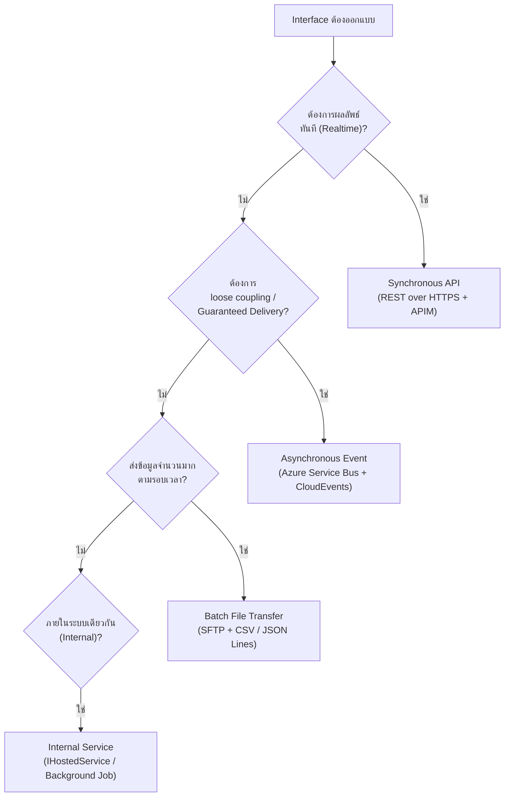

### 6.2 Pattern Decision per Interface

| Interface ID | Pattern ที่เลือก | เหตุผลการตัดสินใจ | ทางเลือกที่ไม่เลือก |
|-------------|----------------|-----------------|-------------------|
| **IF-001** | **Batch (Primary)** + Sync API (Fallback) | HRIS เป็น legacy — มักรองรับ File Export ได้แน่นอน; ข้อมูล Employee ไม่จำเป็นต้อง realtime (daily sync เพียงพอ) อ้างอิง ai-std-sdlc.md §3.1 Batch pattern | Sync API: รองรับเป็น Fallback หาก HRIS เปิด REST API (ยืนยันจาก HRIS vendor) |
| **IF-002** | **Async Event-Driven** (Azure Service Bus) | Email notification ไม่ต้องการ response ทันที, ต้องการ Guaranteed Delivery (NFR-007 ≥99%), retry/DLQ เพื่อ email success rate KPI — อ้างอิง ai-std-sdlc.md §3.1 Async pattern | Sync (SMTP direct): ถ้า SMTP fail ทำให้ Leave Request ล้มเหลว — unacceptable coupling |
| **IF-003** | **Sync (File Upload via HTTPS)** | HR รับ immediate feedback (error report ระบุ row/field) ทันทีหลัง upload — ต้องการ synchronous validation response, knowledge.md §2.2 Synchronous | Async: HR ต้องรอ polling result — UX ไม่ดี |
| **IF-004** | **Sync (File Upload via HTTPS)** | พนักงานต้องรู้ทันทีว่า upload สำเร็จก่อน Submit Leave Request (VR-007: block submit ถ้าไม่มีไฟล์) — ต้องการ synchronous confirmation | Async: ไม่สามารถ block submit ได้หาก upload ยังไม่เสร็จ |
| **IF-005** | **Internal Scheduled (IHostedService)** | ไม่ใช่ integration กับระบบภายนอก — เป็น internal timer engine, delay ≤15 นาที, 24/7 — ออกแบบเป็น .NET IHostedService ใน Backend | External Scheduler: เพิ่ม complexity โดยไม่จำเป็น |

---

## 7. Integration Flow Diagrams

### 7.1 IF-001: Employee Master Sync (HRIS → Leave App)

#### 7.1.1 Pattern A: Batch File Transfer (Primary — หาก HRIS รองรับ File Export)

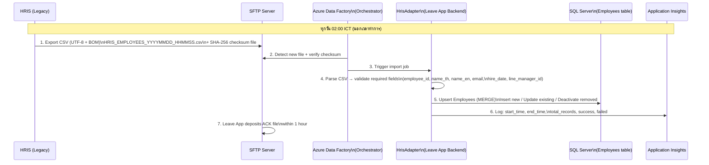

#### 7.1.2 Pattern B: Realtime REST API (Fallback — หาก HRIS เปิด API)

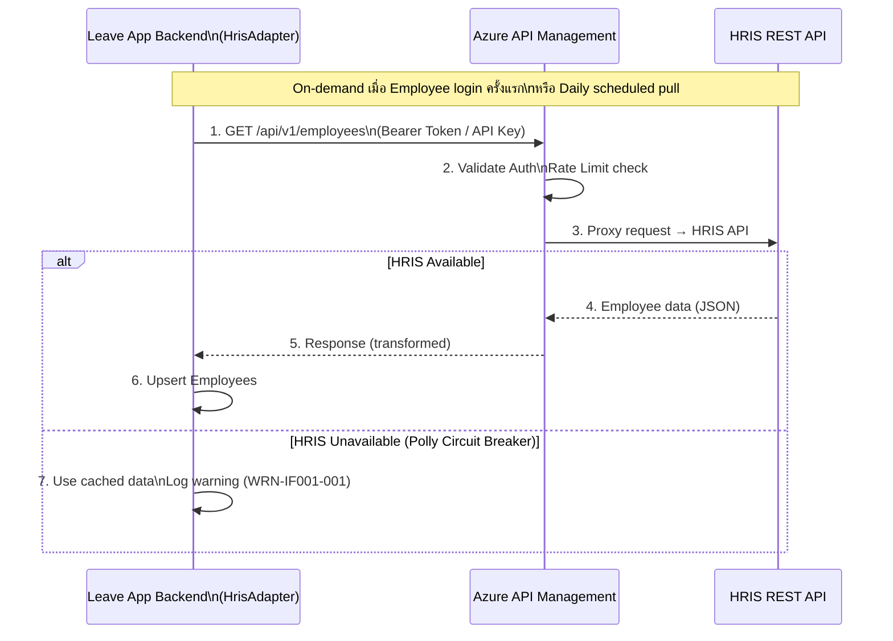

**Batch File Naming Convention (IF-001):**

```text
HRIS_EMPLOYEES_20260617_020000.csv
HRIS_EMPLOYEES_20260617_020000.sha256
HRIS_EMPLOYEES_20260617_020000.ack    ← Leave App สร้าง ACK ภายใน 1 ชั่วโมง
```

---

### 7.2 IF-002: Email Notification (Leave App → Email Gateway — Async)

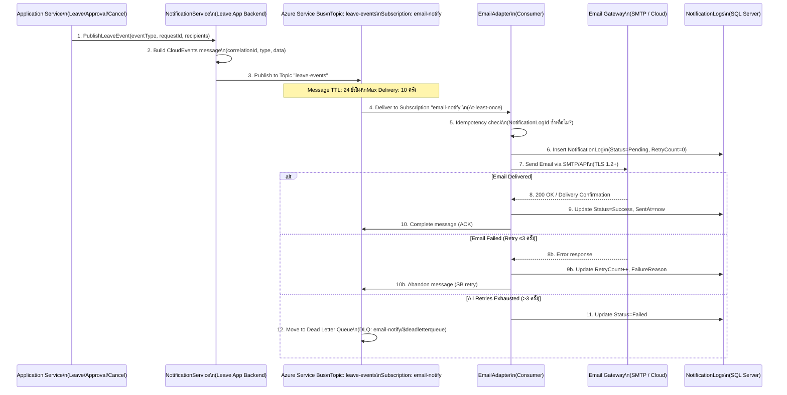

**CloudEvents Message Format — Leave Notification:**

```json
{
  "specversion": "1.0",
  "type": "com.abccompany.leave.request.submitted",
  "source": "/leave-service/api/v1/leave-requests",
  "id": "a1b2c3d4-e5f6-7890-abcd-ef1234567890",
  "time": "2026-06-17T02:15:00Z",
  "datacontenttype": "application/json",
  "correlationid": "b2c3d4e5-f6a7-8901-bcde-f12345678901",
  "data": {
    "notificationLogId": "NL-2026-00456",
    "eventType": "LeaveSubmitted",
    "leaveRequestId": "LR-2026-00123",
    "employeeId": "EMP001",
    "employeeName": "สมชาย ใจดี",
    "leaveType": "ANNUAL",
    "startDate": "2026-07-01",
    "endDate": "2026-07-03",
    "durationDays": 3,
    "recipients": [
      { "email": "manager@abc.com", "role": "Manager" },
      { "email": "hr@abc.com", "role": "HR" }
    ]
  }
}
```

**Event Type Registry (CloudEvents `type` field):**

| EventType | CloudEvents type | Recipients | SRS Trace |
|-----------|-----------------|-----------|----------|
| Leave Submitted | `com.abccompany.leave.request.submitted` | Manager, HR | SFR-003, IF-002 §2.2.5 |
| Leave Approved | `com.abccompany.leave.request.approved` | Employee, HR | SFR-005, IF-002 §2.2.5 |
| Leave Rejected | `com.abccompany.leave.request.rejected` | Employee, HR | SFR-005, IF-002 §2.2.5 |
| Cancel Request Submitted | `com.abccompany.leave.cancel.requested` | Manager, HR | SFR-008, IF-002 §2.2.5 |
| Cancellation Approved | `com.abccompany.leave.cancel.approved` | Employee, Manager, HR | SFR-009, BRD NR-002 |
| Cancellation Rejected | `com.abccompany.leave.cancel.rejected` | Employee, HR | SFR-009, IF-002 §2.2.5 |
| SLA Reminder (4h) | `com.abccompany.leave.sla.reminder` | Manager | SFR-010, BRD BR-018 |
| SLA Escalated | `com.abccompany.leave.sla.escalated` | HR | SFR-010, BRD BR-018, M3 (QA v3) |

---

### 7.3 IF-003: Excel Import — Outsource (HR → Leave App — Sync)

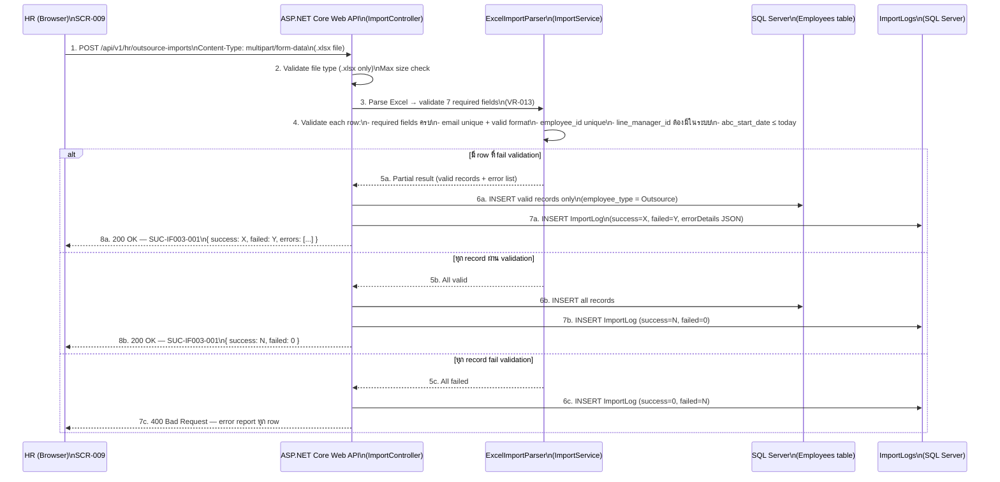

---

### 7.4 IF-004: File Upload — Medical Certificate (Browser → Azure Blob)

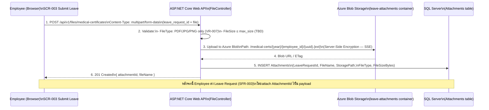

---

### 7.5 IF-005: SLA Timer Event (Internal — SLA Scheduler)

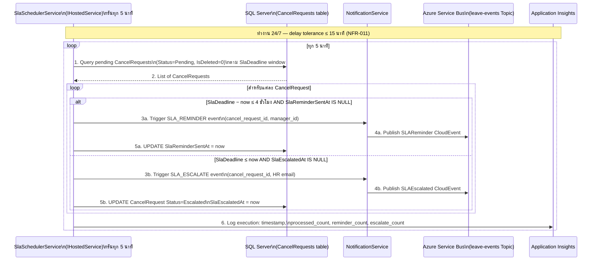

---

## 8. Azure API Management Setup

**อ้างอิง:** knowledge.md §3.1, ai-std-sdlc.md §3.2

### 8.1 APIM Product Structure

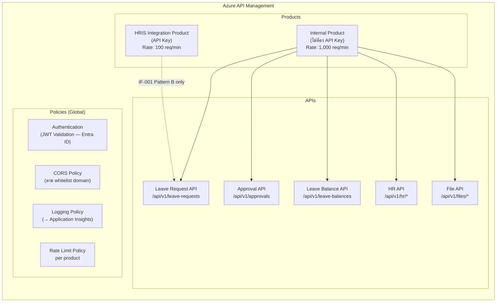

### 8.2 APIM Policy Configuration

| Policy | Scope | Configuration | SRS Trace |
|--------|-------|-------------|----------|
| **JWT Validation** | Global | Validate Microsoft Entra ID JWT Access Token — openid-config URL | NFR-004, TR-008 |
| **CORS** | Global | Whitelist: Leave App frontend domain — ห้าม wildcard | TR-007, ai-std-sdlc.md §5.4 |
| **Rate Limiting** | Per Product | Internal: 1,000 req/min, HRIS: 100 req/min | knowledge.md §3.1 |
| **Request Logging** | Global | Log → Azure Application Insights: method, path, status, duration, correlationId | ai-std-sdlc.md §6.2 |
| **Response Caching** | Per Operation | GET /api/v1/leave-balances: Cache 60 วินาที — balance เปลี่ยนน้อยบ่อย | NFR-002 |
| **Named Values** | Global | Backend URL, HRIS API key, Application Insights key — ไม่ hardcode | ai-std-sdlc.md §5.2 |
| **TLS 1.2+** | Global | บังคับ TLS 1.2 ขึ้นไป — reject plain HTTP | TR-007, ai-std-sdlc.md §5.3 |

### 8.3 API Versioning

**อ้างอิง:** knowledge.md §3.2

- **Strategy:** URL Path Versioning — `/api/v1/` เป็น default
- Version เก่า support อย่างน้อย **12 เดือน** หลัง deprecate ก่อน remove
- Breaking change เท่านั้นที่ขึ้น major version

---

## 9. Resilience & Error Handling

**อ้างอิง:** knowledge.md §5.1, §5.2, ai-std-sdlc.md §3.2/3.3/3.4

### 9.1 Resilience Pattern per Interface

| Pattern | Configuration (Polly .NET) | ใช้กับ Interface | SRS Trace |
|---------|--------------------------|----------------|----------|
| **Retry** | 3 ครั้ง, exponential backoff: 2s / 4s / 8s | IF-001 (Pattern B), IF-002 consumer | knowledge.md §5.1 |
| **Circuit Breaker** | Open หลัง fail **5 ครั้ง**, half-open หลัง **30 วินาที** | IF-001 (Pattern B), HRIS REST API | knowledge.md §5.1 |
| **Timeout** | Connection: **5 วินาที**, Read: **10 วินาที** | IF-001 (Pattern B), IF-003, IF-004 | knowledge.md §5.1, ai-std-sdlc.md §3.2 |
| **Bulkhead** | Max **25 concurrent calls** ต่อ external service | IF-001 (Pattern B) | knowledge.md §5.1 |
| **Fallback** | IF-001: ใช้ cached Employee data (LastSyncedAt แสดง warning) | IF-001 | knowledge.md §5.1 |
| **Dead Letter Queue** | Max **10 delivery attempts** → DLQ | IF-002 (Azure Service Bus) | knowledge.md §2.3 |
| **Email Retry** | ≥ **3 ครั้ง** ก่อน mark Failed — บันทึกใน NotificationLogs | IF-002 | NFR-007, SIR-002 |
| **Batch Retry** | **3 ครั้ง** ห่าง **15 นาที** → alert admin | IF-001 (Pattern A Batch) | knowledge.md §5.1 |
| **Idempotent Consumer** | EmailAdapter ตรวจ NotificationLogId ก่อน process | IF-002 | knowledge.md §2.3 |

### 9.2 Error Classification & Handling

**อ้างอิง:** knowledge.md §5.2, ai-std-sdlc.md §3.4

| HTTP Status | ประเภท | Retry? | การจัดการ | Interface |
|-------------|--------|--------|----------|----------|
| 400 | Business / Validation Error | ❌ | แจ้ง caller ให้แก้ไข request — log Warning | IF-003 (Excel validation) |
| 401/403 | Auth Error | ❌ (Refresh token ครั้งเดียว) | Refresh token → retry 1 ครั้ง | IF-001 (Pattern B) |
| 404 | Not Found | ❌ | แจ้ง caller — ไม่ retry | IF-001 (Pattern B) |
| 408/429 | Timeout / Rate Limit | ✅ | Retry ด้วย exponential backoff | IF-001, IF-004 |
| 500 | Server Error | ✅ | Retry ด้วย backoff | IF-001 (Pattern B) |
| 502/503/504 | Infrastructure Error | ✅ | Retry + Circuit Breaker | IF-001 (Pattern B) |

### 9.3 Error Handling Flow Diagram

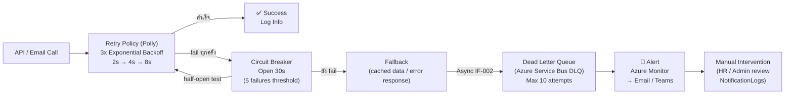

### 9.4 IF-001 Batch Error Handling (Pattern A)

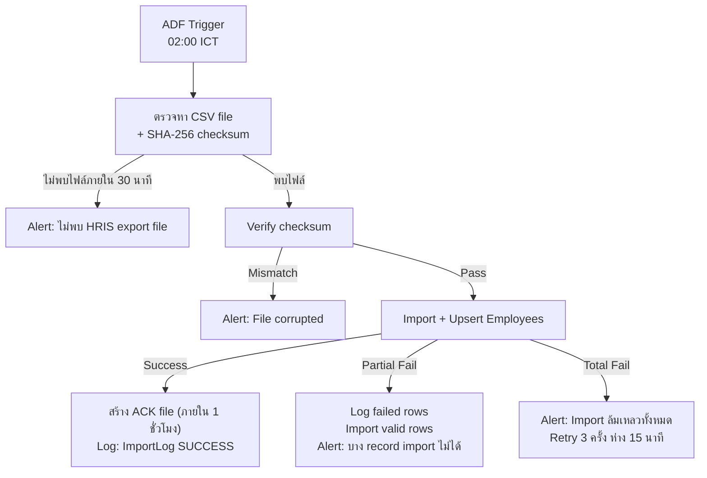

---

## 10. Message Format Standard

### 10.1 CloudEvents Specification

**อ้างอิง:** knowledge.md §4.1, ai-std-sdlc.md §3.3

ทุก event ที่ publish ผ่าน Azure Service Bus ต้องใช้ **CloudEvents 1.0** format:

| Field | ประเภท | กฎ | ตัวอย่าง |
|-------|--------|---|---------|
| `specversion` | String | ค่าคงที่ `"1.0"` | `"1.0"` |
| `type` | String | Reverse domain: `com.abccompany.leave.{entity}.{action}` | `"com.abccompany.leave.request.submitted"` |
| `source` | String | API path ที่เป็นต้นทาง | `"/leave-service/api/v1/leave-requests"` |
| `id` | UUID v4 | ไม่ซ้ำกัน — ใช้ `Guid.NewGuid()` | `"a1b2c3d4-..."` |
| `time` | ISO 8601 UTC | UTC เสมอ — `DateTime.UtcNow` | `"2026-06-17T02:15:00Z"` |
| `datacontenttype` | String | ค่าคงที่ `"application/json"` | `"application/json"` |
| `correlationid` | UUID v4 | ใช้ร่วมกันตลอด request chain (distributed tracing) | `"b2c3d4e5-..."` |
| `data` | JSON object | เฉพาะ field ที่จำเป็น — ไม่ส่ง entire entity | `{ "leaveRequestId": "...", ... }` |

### 10.2 Azure Service Bus Topic/Subscription Structure

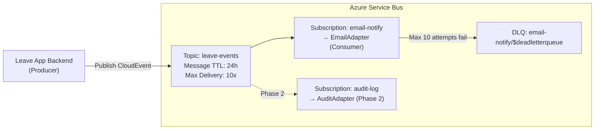

**หมายเหตุ:** ใช้ **Topic + Subscription** (ไม่ใช่ Queue) เพราะ 1 event อาจส่งถึงหลาย consumer — email-notify (Phase 1) + audit-log (Phase 2) — อ้างอิง knowledge.md §2.3

### 10.3 Batch File Format (IF-001 Pattern A)

**อ้างอิง:** knowledge.md §2.4

```text
File format: CSV (UTF-8 with BOM)
Delimiter: comma (,)
String enclosure: double-quote (")
Date format: YYYY-MM-DD
DateTime format: YYYY-MM-DD HH:MM:SS (UTC)
Header row: required (first row)

Sample:
employee_id,employee_code,name_th,name_en,department,position,email,hire_date,line_manager_id,employment_status
"EMP001","EMP001","สมชาย ใจดี","Somchai Jaidee","Information Technology","Software Engineer","somchai@abc.com","2022-01-15","EMP050","Active"
```

**File integrity:**
```text
HRIS_EMPLOYEES_20260617_020000.sha256
< SHA-256 hash ของ CSV file >  HRIS_EMPLOYEES_20260617_020000.csv
```

---

## 11. Security per Interface

**อ้างอิง:** ai-std-sdlc.md §5.1–§5.5, knowledge.md §2.2

| Interface | Authentication | Encryption in Transit | Encryption at Rest | Additional |
|-----------|--------------|---------------------|------------------|-----------|
| **IF-001 (Pattern A)** | SSH Key Pair RSA 4096-bit (SFTP) | SFTP over SSH (TLS equivalent) | PGP / AES-256 ก่อนส่ง (sensitive employee data) | Checksum verify (SHA-256) |
| **IF-001 (Pattern B)** | API Key / OAuth 2.0 (Client Credentials) | TLS 1.2+ (HTTPS) | — | Circuit Breaker via Polly |
| **IF-002** | AMQP over TLS (Azure Service Bus) | TLS 1.2+ | Azure Service Bus encryption at rest | DLQ monitoring |
| **IF-003** | Bearer JWT Token (Microsoft Entra ID) | TLS 1.2+ (HTTPS) | SQL Server TDE (Employees table) | Role: HR เท่านั้น |
| **IF-004** | Bearer JWT Token (Microsoft Entra ID) | TLS 1.2+ (HTTPS) | Azure Blob SSE (AES-256) | RBAC: Manager/HR เท่านั้นดูได้ |
| **IF-005** | Internal (ไม่มี external auth) | In-process (ไม่มี network) | — | Monitor scheduler lag |

---

## 12. Monitoring & Observability

**อ้างอิง:** knowledge.md §6, ai-std-sdlc.md §6.3

### 12.1 Monitoring Stack

| เครื่องมือ | หน้าที่ | ใช้กับ |
|-----------|--------|-------|
| **Azure Application Insights** | Distributed tracing, request logging, dependency tracking, correlation ID | ทุก interface |
| **Azure Monitor** | Metrics, alerts, dashboards | ทุก interface |
| **Azure Service Bus Metrics** | Queue depth, DLQ count, message throughput | IF-002 |
| **Azure Data Factory Monitor** | Batch pipeline status, run history | IF-001 (Pattern A) |
| **Custom NotificationLogs Dashboard** | Email success rate KPI monitoring | IF-002 (NFR-007) |
| **Serilog → Application Insights** | Structured logging ทุก operation | ทุก interface (ai-std-sdlc.md §6.2) |

### 12.2 Key Metrics & Alerts

| Metric | Threshold | Alert Level | Interface | SRS Trace |
|--------|-----------|-------------|----------|----------|
| API response time (P95) | > **5 วินาที** | ⚠️ Warning | IF-001 (B), IF-003, IF-004 | NFR-001 |
| API error rate | > **5%** | 🔴 Critical | IF-001 (B), IF-003, IF-004 | NFR-001 |
| Email success rate | < **99%** | 🔴 Critical | IF-002 | NFR-007 |
| Service Bus DLQ count | > **0** | ⚠️ Warning | IF-002 | knowledge.md §6.2 |
| Service Bus queue depth (leave-events) | > **1,000** messages | ⚠️ Warning | IF-002 | knowledge.md §6.2 |
| Batch import failure (HRIS) | > **0 jobs** | 🔴 Critical | IF-001 (A) | SIR-001 |
| Batch import partial failure | > **0 records** | ⚠️ Warning | IF-001 (A) | SIR-001 |
| SLA Scheduler execution delay | > **15 นาที** | 🔴 Critical | IF-005 | NFR-011, TR-004 |
| Circuit Breaker open | > **0** | 🔴 Critical | IF-001 (B) | knowledge.md §6.2 |
| File upload failure rate | > **5%** | ⚠️ Warning | IF-004 | SIR-005 |

### 12.3 Distributed Tracing

ทุก operation ต้องส่ง `correlationId` ตลอด request chain:

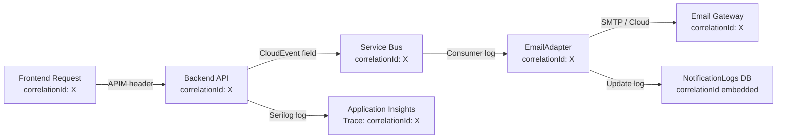

**ค้นหา trace ทั้งหมดด้วย KQL:**
```kusto
requests
| where customDimensions["correlationId"] == "X"
| order by timestamp asc
```

---

## 13. Traceability to SRS

| Design Topic | Related SRS ID | Source Type | Notes |
|-------------|---------------|------------|-------|
| IF-001 Pattern: Batch (Primary) / REST (Fallback) | SIR-001, TR-002, IF-001 | Integration, Technical | Pattern ขึ้นกับ HRIS capability — Assumption A1 |
| IF-001 Employee data fields | IF-001 §2.1.4 | Interface SRS | employee_id, name_th/en, dept, email, hire_date, manager_id |
| IF-001 Batch: SFTP + SHA-256 | ai-std-sdlc.md §3.1 (Batch) | Standard | มาตรฐานองค์กร Batch pattern |
| IF-001 REST: Circuit Breaker (Polly) | ai-std-sdlc.md §3.2 | Standard | 5 failures → open 30s |
| IF-001 Fallback: cached employee data | knowledge.md §5.1 | Standard | WRN-IF001-001 แสดง warning |
| IF-002 Async (Azure Service Bus) | SIR-002, NFR-007, IF-002 | Integration, Non-Functional | Email success rate ≥99%, retry ≥3 ครั้ง |
| IF-002 CloudEvents format | knowledge.md §4.1 | Standard | type, correlationid, data structure |
| IF-002 Topic: leave-events / Subscription: email-notify | knowledge.md §2.3 | Standard | Topic+Subscription สำหรับ 1-to-many |
| IF-002 DLQ monitoring | knowledge.md §2.3, §6.2 | Standard | Max 10 delivery → DLQ → Alert |
| IF-002 Idempotent consumer | knowledge.md §2.3 | Standard | Check NotificationLogId ก่อน process |
| IF-002 Notification Events Matrix | IF-002 §2.2.5, BRD §7.6 | Interface SRS | 8 event types + recipients |
| IF-003 Sync file upload | SIR-003, TR-006, VR-013 | Integration, Technical | Immediate validation feedback to HR |
| IF-003 7 required fields validation | VR-013, BRD BR-020, IF-003 §2.3.4 | Interface SRS | validate ก่อน insert ทุกครั้ง |
| IF-003 Partial import (valid records only) | IF-003 §2.3.6 | Interface SRS | ไม่ partial import row ที่ error |
| IF-004 Sync file upload | SIR-005, TR-005, VR-007 | Integration, Technical | block Leave Submit ถ้า upload ไม่สำเร็จ |
| IF-004 Azure Blob Storage | ai-std-sdlc.md §2.1 | Standard | มาตรฐานองค์กร File/Blob storage |
| IF-004 SSE (Server-Side Encryption) | NFR-006, ai-std-sdlc.md §5.5 | Non-Functional | ข้อมูล Restricted — encrypt at rest |
| IF-004 RBAC on Blob | NFR-005/006 | Non-Functional | Manager/HR เท่านั้นเข้าถึงได้ |
| IF-005 IHostedService 24/7 | TR-004, SIR-004, NFR-011 | Technical, Non-Functional | delay ≤15 นาที |
| IF-005 SLA Reminder at -4h | BRD BR-018, IF-005 §2.5.5, M3 (QA v3) | Functional | trigger IF-002 SLAReminder event |
| IF-005 SLA Escalation | BRD BR-018, VR-012, SFR-010 | Functional | Update Status=Escalated + trigger IF-002 SLAEscalated |
| APIM JWT Validation (Entra ID) | TR-008, NFR-004 | Technical | Assumption A2 — Microsoft Entra ID |
| APIM Rate Limiting | knowledge.md §3.1 | Standard | Internal 1,000 req/min |
| TLS 1.2+ ทุก external connection | TR-007, ai-std-sdlc.md §5.3 | Technical | HTTPS บังคับ |
| Retry: 3 ครั้ง exponential backoff | knowledge.md §5.1, ai-std-sdlc.md §3.2 | Standard | 2s/4s/8s |
| Email success rate monitoring | NFR-007, RFR-003 | Non-Functional | Custom NotificationLogs dashboard |
| SLA Scheduler lag alert >15 min | NFR-011, TR-004 | Non-Functional | Azure Monitor alert |
| Serilog → Application Insights | ai-std-sdlc.md §6.2 | Standard | Centralized logging |

---

## 14. Assumptions / Open Issues

### 14.1 Assumptions

| ID | รายละเอียด | ผลกระทบ | ต้องยืนยัน |
|----|-----------|--------|----------|
| **A1** | IF-001 ใช้ **Batch (SFTP)** เป็น Primary pattern — เพราะ HRIS เป็น legacy system ที่มักรองรับ file export ได้แน่นอน; REST API เป็น Alternative ถ้า HRIS เปิด API | กำหนด SFTP server setup, ADF pipeline, ACK mechanism สำหรับ Pattern A; หรือ APIM + Polly สำหรับ Pattern B | ทีม IT + HRIS vendor ยืนยัน HRIS capability ก่อน Detailed Design |
| **A2** | ใช้ **Microsoft Entra ID** เป็น Identity Provider ตามมาตรฐานองค์กร (ai-std-sdlc.md §5.2) — APIM ใช้ JWT validation จาก Entra ID | APIM policy ต้องตั้ง openid-config URL ของ Entra ID tenant | ทีม IT ยืนยัน Entra ID tenant ของ ABC Company |
| **A3** | Email Notification ใช้ **Azure Service Bus** เป็น message broker ระหว่าง Leave App Backend กับ Email Adapter — decoupled จาก Email Gateway | ต้อง provision Azure Service Bus (Standard/Premium tier) | ทีม IT ยืนยัน Azure subscription พร้อม provision Service Bus |
| **A4** | **SLA "1 วันทำการ"** = 8 ชั่วโมงทำการ นับจากเวลาที่ Cancel Request บันทึก — ไม่นับวันหยุดนักขัตฤกษ์ | กำหนด `SlaDeadline` calculation ใน `CancelRequest` — ต้องมี WorkingCalendar หรือ holiday table | HR ยืนยัน working hours definition และ holiday policy |
| **A5** | IF-004 ใช้ **Azure Blob Storage** สำหรับเก็บใบรับรองแพทย์ — สอดคล้องกับมาตรฐานองค์กร (ai-std-sdlc.md §2.1) | ต้อง provision Azure Blob Storage + configure access control | ทีม IT ยืนยัน Azure Blob Storage พร้อม provision |
| **A6** | SLA Scheduler (IF-005) รันทุก **5 นาที** — เพียงพอสำหรับ delay tolerance ≤15 นาที (NFR-011) | ถ้า Backend workload สูง scheduler อาจ delay — ต้อง monitor | Monitor ผ่าน Application Insights alert |

### 14.2 Open Issues

| Open Issue | รายละเอียด | ผลกระทบต่อ Integration Architecture | สิ่งที่ต้องทำ |
|-----------|-----------|----------------------------------|------------|
| **HRIS Integration Pattern** | API / DB link / File-based export ยังไม่ยืนยัน | กำหนด implementation ของ IF-001 (Pattern A vs B) — design แตกต่างกันมาก | ทีม IT + HRIS vendor ยืนยัน capability ก่อน Detailed Design |
| **Email Gateway / Provider** | SMTP / AWS SES / SendGrid / Exchange Online ยังไม่ระบุ | กำหนด configuration ของ EmailAdapter (SMTP settings, API key) | ทีม IT ยืนยัน Email provider |
| **HR Notification Recipient** | Individual email หรือ Distribution List ยังไม่ยืนยัน (R5 — QA v2 แนะนำ group) | กำหนด `recipients` ใน CloudEvents `data.recipients` | HR ยืนยัน recipient configuration |
| **SLA Escalate Assignee** | ตำแหน่ง/email ของ HR ที่รับ Escalation ยังไม่ระบุ | กำหนด `SLA_ESCALATED` event recipient | HR ยืนยันตำแหน่ง/email |
| **Max File Size (Medical Cert)** | Upload limit ยังไม่ยืนยัน | กำหนด validation ใน FileController + ERR-IF004-002 message | HR + IT ยืนยัน |
| **Working Hours Definition (SLA)** | "1 วันทำการ" นับกี่ชั่วโมง — รวม/ไม่รวมวันหยุดนักขัตฤกษ์ | กำหนด `SlaDeadline` calculation logic ใน SlaSchedulerService | HR ยืนยัน working hours + holiday calendar |
| **HRIS Employee ID Format** | รูปแบบ EmployeeId จาก HRIS (EMP001 / GUID / เลขที่พนักงาน) ยังไม่ยืนยัน | กำหนด mapping และ Primary Key ใน Employees table | ทีม IT + HRIS vendor ยืนยัน |
| **Outsource Update Mechanism** | กรณี Outsource เปลี่ยน Manager หรือแผนก — re-import หรือ edit ในระบบ | กำหนด upsert logic ใน ImportService (IF-003) | HR ยืนยัน process การอัปเดต Outsource |

---

## 15. Integration Architecture Review Checklist

- [x] เลือก integration pattern ที่เหมาะสม: Batch/API (IF-001), Async (IF-002), Sync Upload (IF-003/004), Internal (IF-005)
- [x] ทุก external HTTP API ผ่าน Azure API Management
- [x] APIM: JWT validation, Rate Limit, Logging policy, TLS 1.2+
- [x] API versioning: URL path `/api/v1/`
- [x] Retry: 3 ครั้ง, exponential backoff 2s/4s/8s (Polly)
- [x] Circuit Breaker: open หลัง 5 failures, half-open 30s (Polly) — IF-001 Pattern B
- [x] Timeout: Connection 5s, Read 10s
- [x] CloudEvents format: specversion, type, source, id, time, correlationid, data
- [x] Azure Service Bus Topic: leave-events + Subscription: email-notify
- [x] Dead Letter Queue: เปิด DLQ สำหรับ email-notify Subscription, max 10 delivery
- [x] Idempotent consumer: EmailAdapter ตรวจ NotificationLogId ก่อน process
- [x] Email retry ≥3 ครั้ง + log ใน NotificationLogs (NFR-007)
- [x] Batch: SFTP + SHA-256 checksum + ACK file (IF-001 Pattern A)
- [x] Azure Blob Storage: SSE AES-256 + RBAC สำหรับ Medical Certificate
- [x] SLA Scheduler: IHostedService 24/7, delay ≤15 นาที, monitor lag
- [x] Monitoring: Application Insights, Azure Monitor, Service Bus Metrics, Custom Email KPI
- [x] Alert: Email success rate <99%, DLQ >0, Scheduler delay >15 min, Batch failure
- [x] TLS 1.2+ ทุก external communication
- [x] Distributed tracing: correlationId ตลอด request chain
- [ ] ยืนยัน HRIS Integration Pattern (Batch vs REST API) — A1
- [ ] ยืนยัน Microsoft Entra ID tenant configuration — A2
- [ ] ยืนยัน Azure Service Bus provision — A3
- [ ] ยืนยัน SLA Working Hours definition — A4/Open Issue
- [ ] ยืนยัน Email Gateway provider — Open Issue

---

*เอกสารนี้ออกแบบโดยยึดมาตรฐานองค์กรจาก `80-knowledge-base/architecture-design/03-integration-architecture/knowledge.md` และ `80-knowledge-base/SDLC/ai-std-sdlc.md` — ทุก decision trace กลับสู่ SRS ผ่าน Section 13 Traceability Matrix*
