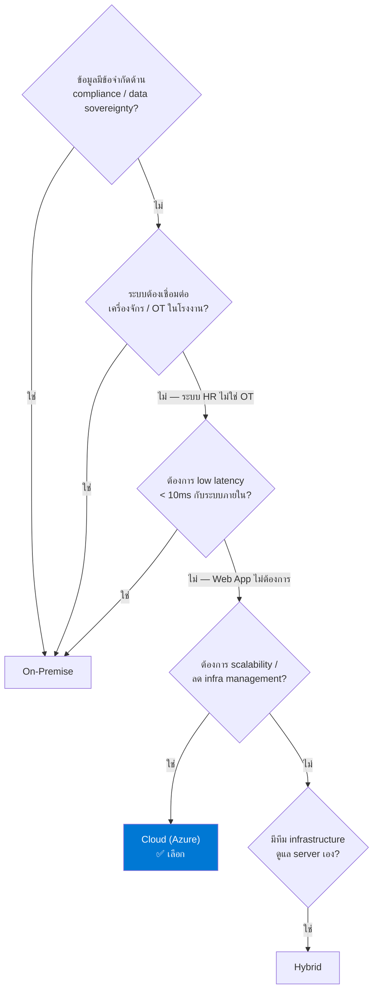
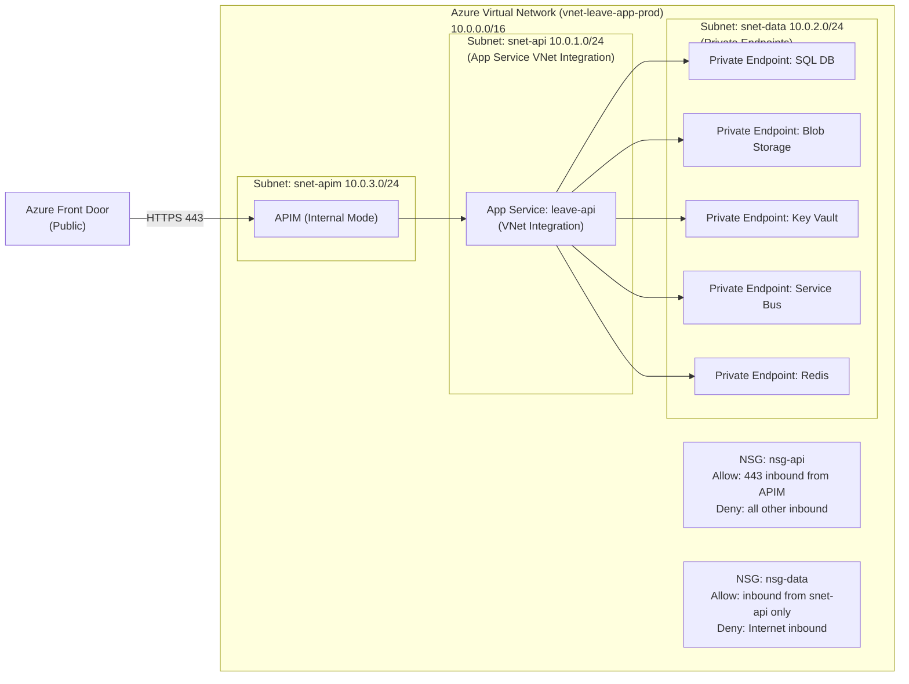
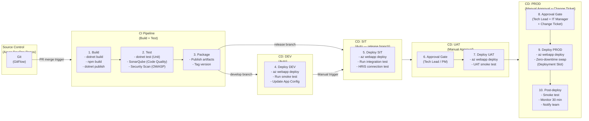
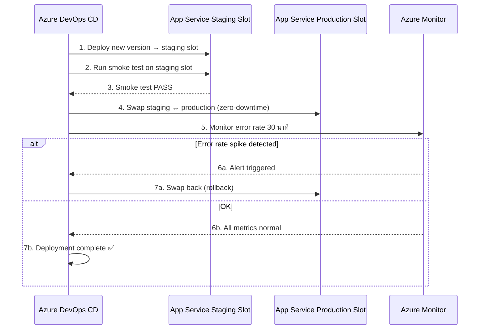
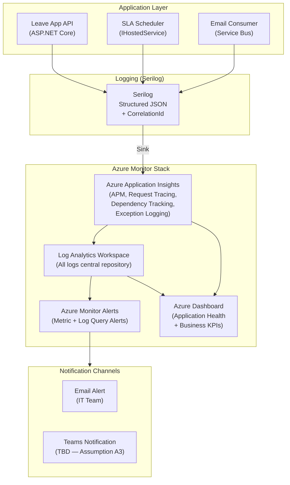

# Infrastructure Architecture Design: ระบบบริหารการลาและการอนุมัติ (Leave Request and Approval)

## Change Log

| Version | Date | Section | Change Type | Description | Source |
|---------|------|---------|-------------|-------------|--------|
| 1.0 | 2026-06-17 | All | Created | สร้างเอกสารครั้งแรก — ครอบคลุม Deployment Model (Azure Cloud), Environment Strategy, Compute/Server Design, CI/CD Pipeline, Monitoring | NFR/TR SRS v1.0, SRS Summary v1.0, Infrastructure Knowledge Base |

---

## 1. วัตถุประสงค์และขอบเขต

| รายการ | รายละเอียด |
|--------|-----------|
| **วัตถุประสงค์** | ออกแบบ Infrastructure Architecture สำหรับระบบ Leave Request and Approval ของ ABC Company โดยระบุ Deployment Model, Environment Strategy, Compute/Hosting Platform, CI/CD Pipeline, Monitoring Standard และ Backup Strategy ยึดมาตรฐานองค์กรจาก `80-knowledge-base/architecture-design/04-infrastructure-architecture/knowledge.md` เท่านั้น |
| **ขอบเขต In-Scope** | Azure Cloud Infrastructure (Subscription ของ HQ), Environment DEV/SIT/UAT/PROD, Azure App Service, Azure SQL Database, Azure Blob Storage, Azure Service Bus, Azure API Management, Azure DevOps CI/CD Pipeline, Monitoring (App Insights + Azure Monitor) |
| **ขอบเขต Out-of-Scope** | Network infrastructure ภายใน HQ datacenter, End-user device management, HRIS server infrastructure, Email Gateway infrastructure, Security Operation Center (SOC) |
| **Deployment Model** | **Cloud (Azure)** — ดูรายละเอียดใน Section 4 |

---

## 2. Source Reference

| # | เอกสารอ้างอิง | บทบาท |
|---|-------------|-------|
| 1 | `80-knowledge-base/architecture-design/04-infrastructure-architecture/knowledge.md` | มาตรฐานองค์กร Infrastructure Architecture — หลักการ Deployment Model, Server Design, CI/CD, Monitoring |
| 2 | `80-knowledge-base/SDLC/ai-std-sdlc.md` | SDLC Standard — Section 6 Monitoring, Section 2 Tech Stack |
| 3 | `10-requirement-definition/b0-system-requriement/leave-request-and-approval-non-functional-tech-srs.md` | NFR-001–NFR-011, TR-001–TR-009 |
| 4 | `10-requirement-definition/b0-system-requriement/leave-request-and-approval-system-requirement-specification-summary.md` | SRS Summary — Functional scope, Interface list, Traceability |
| 5 | `20-system-design/a0-architecture-design/01-application-architecture/leave-request-and-approval-application-architecture-design.md` | Application Architecture — Solution structure, Tech stack confirmed |
| 6 | `20-system-design/a0-architecture-design/02-data-architecture/leave-request-and-approval-data-architecture-design.md` | Data Architecture — Database design, RPO/RTO, Backup strategy |
| 7 | `20-system-design/a0-architecture-design/03-integration-architecture/leave-request-and-approval-integration-architecture-design.md` | Integration Architecture — Azure Service Bus, APIM, SFTP |

---

## 3. Infrastructure Drivers

| Driver | รายละเอียด | ผลต่อการออกแบบ | SRS Trace |
|--------|-----------|--------------|----------|
| **Availability ≥ 99%** | ระบบต้องพร้อมใช้งานตลอดเวลาทำการ ≥ 99% | เลือก Azure App Service (Built-in HA, multi-zone) + Azure SQL DB (Zone Redundant) | NFR-003 |
| **SLA Scheduler 24/7** | SLA Timer ต้องทำงาน 24/7 delay ≤ 15 นาที | IHostedService ทำงานใน App Service — always-on configuration | NFR-011, TR-004 |
| **Response Time ≤ 3s (P95)** | หน้าจอหลักโหลดใน ≤ 3 วินาที | เลือก Azure App Service tier ที่มี compute เพียงพอ + Redis Cache (optional) | NFR-001 |
| **Email Success ≥ 99%** | Email notification ต้อง guaranteed delivery | Azure Service Bus (durable messaging, retry, DLQ) | NFR-007 |
| **Security — TLS 1.2+** | ทุก HTTP request ต้องผ่าน HTTPS TLS 1.2+ | APIM + App Service enforce TLS 1.2+ | TR-007 |
| **Security — Authentication** | ทุก request ต้องผ่าน Microsoft Entra ID | Azure App Service + APIM integrate กับ Entra ID | NFR-004, TR-008 |
| **HQ Azure Subscription** | HQ จัดเตรียม Azure Subscription, Azure Backup, Antivirus ให้ | ใช้ Azure Cloud ทั้งหมด — ไม่ต้องซื้อ hardware | knowledge.md §1 |
| **RPO 15 min / RTO 4 ชั่วโมง** | กำหนดจาก Data Architecture Design | Backup: Azure SQL built-in (TLog 5–10 min → RPO ≤ 15 min) | Data Arch doc |
| **Internal Corporate System** | ระบบ HR ภายในองค์กร — ไม่ใช่ OT/manufacturing, ไม่มี data sovereignty constraint | ไม่ต้อง On-Premise — Cloud เหมาะสมที่สุด | BRD §3.4 |
| **Phase 2 Readiness** | Report, Audit Trail, Notification Log — ออกแบบให้ขยายได้โดยไม่ต้อง re-architect | IaC (Bicep) + Resource Group แยก environment — เพิ่ม resource ได้ง่าย | TR-009, SRS §3 |

---

## 4. Deployment Model Decision

### 4.1 Decision Process



### 4.2 Decision Rationale

| เกณฑ์ | สถานะ | เหตุผล |
|-------|-------|-------|
| **Data Sovereignty / Compliance** | ❌ ไม่มีข้อจำกัด | ระบบ HR ภายในองค์กร — ไม่มีกฎหมายบังคับว่าต้องเก็บ On-Premise (ยืนยันจาก NFR/TR SRS §16 — ไม่ระบุ sovereignty) |
| **OT / Factory System** | ❌ ไม่ใช่ OT | ระบบ Leave Request เป็น HR Web Application ไม่ได้เชื่อมต่อเครื่องจักร |
| **Low Latency < 10ms** | ❌ ไม่ต้องการ | Web Application ผ่าน Browser — response time target ≤ 3s (P95) ซึ่ง Azure รองรับได้ |
| **HQ Azure Subscription** | ✅ มี | HQ จัดเตรียม Azure Subscription, Azure Backup, Antivirus ให้ตามมาตรฐาน (knowledge.md §1) |
| **Infrastructure Management** | ✅ Managed Service | ใช้ Azure App Service (PaaS) — OS patch, HA, scaling จัดการโดย Microsoft |
| **Availability ≥ 99%** | ✅ รองรับ | Azure App Service SLA 99.95%, Azure SQL DB SLA 99.99% — เกินกว่า NFR-003 ที่ต้องการ 99% |

**ผลการตัดสินใจ: Cloud (Azure) — ใช้ Azure ทั้งหมด (HQ Subscription)**

---

## 5. Deployment Topology Diagram

### 5.1 Production Architecture (Azure Cloud)

```mermaid
flowchart TB
    subgraph Internet["Internet / User Access"]
        USERS["Users\n(Employee, Manager, HR)\nChrome / Edge / Safari"]
    end

    subgraph AzureSubscription["Azure Subscription (HQ Owned)"]
        direction TB

        subgraph RG_PROD["Resource Group: rg-leave-app-prod"]
            direction TB

            subgraph FrontDoor["Azure Front Door (CDN + WAF)"]
                AFD["Azure Front Door\n(Global CDN, WAF, TLS 1.2+)"]
            end

            subgraph APIM_Layer["API Management Layer"]
                APIM["Azure API Management\n(API Gateway, JWT Auth,\nRate Limit, Logging)"]
            end

            subgraph Compute["Compute Layer (Azure App Service)"]
                direction LR
                SPA_AS["App Service: leave-web\n(Angular SPA — Static)\nSKU: Standard S2"]
                API_AS["App Service: leave-api\n(.NET Core WebAPI\n+ IHostedService SLA)\nSKU: Standard S2"]
            end

            subgraph Data["Data Layer"]
                direction LR
                SQLDB["Azure SQL Database\n(leave-db-prod)\nGeneral Purpose GP_Gen5_4\nZone Redundant"]
                BLOB["Azure Blob Storage\n(leave-files-prod)\nLeave Attachments\nZRS"]
                REDIS["Azure Cache for Redis\n(leave-cache-prod)\nC1 Standard\n(Optional — Leave Balance)"]
            end

            subgraph Messaging["Messaging Layer"]
                SB["Azure Service Bus\n(leave-sb-prod)\nStandard Tier\nTopic: leave-events"]
            end

            subgraph Security["Security & Config"]
                direction LR
                KV["Azure Key Vault\n(leave-kv-prod)\nSecrets, Conn Strings"]
                ENTRA["Microsoft Entra ID\n(Identity Provider)\nJWT Token Issuer"]
            end

            subgraph Monitoring["Monitoring Layer"]
                direction LR
                AI["Azure Application Insights\n(leave-ai-prod)\nAPM + Distributed Tracing"]
                MON["Azure Monitor\n+ Log Analytics Workspace\n(Alerts, Dashboards)"]
            end
        end

        subgraph HRIS_VPN["HRIS Integration (VPN / Private Link)"]
            SFTP["SFTP Server\n(IF-001 Pattern A — Batch)"]
        end
    end

    subgraph External["External Systems"]
        HRIS_SYS["HRIS (Legacy)\nEmployee Master"]
        EMAIL_GW["Email Gateway\n(SMTP / Cloud Email)"]
    end

    USERS -->|HTTPS TLS 1.2+| AFD
    AFD -->|WAF Policy| SPA_AS
    AFD -->|WAF + JWT| APIM
    APIM -->|Internal Product| API_AS
    SPA_AS -.->|REST HTTPS| APIM

    API_AS -->|EF Core / Dapper| SQLDB
    API_AS -->|Azure Blob SDK| BLOB
    API_AS -->|StackExchange.Redis| REDIS
    API_AS -->|Publish Events| SB
    API_AS -->|Get Secrets| KV

    SB -->|Email Notification| EMAIL_GW

    API_AS -->|Serilog| AI
    API_AS -.->|Metrics| MON
    SQLDB -.->|Diagnostic Logs| MON

    SFTP <-->|SFTP over SSH| HRIS_SYS
    API_AS -->|IF-001 Pattern B (Fallback)| HRIS_SYS

    ENTRA -.->|Token Validation| APIM
```

### 5.2 Network Topology (Azure Virtual Network)



**Network Security Rules:**

| Zone | Allow Inbound | Deny | หมายเหตุ |
|------|--------------|------|---------|
| **snet-apim** | Internet 443 (ผ่าน Front Door) | Direct HTTP | WAF filter ก่อนเข้า APIM |
| **snet-api** | APIM 443 เท่านั้น | Internet direct | App Service VNet Integration |
| **snet-data** | snet-api (Private Endpoint) | Internet, snet-apim | ข้อมูลไม่เปิดออก Internet |

---

## 6. Environment Strategy

### 6.1 Environment Landscape

```mermaid
flowchart LR
    subgraph DEV["DEV Environment\nrg-leave-app-dev"]
        D_WEB["App Service: leave-web-dev\nFree / Basic B1"]
        D_API["App Service: leave-api-dev\nFree / Basic B1"]
        D_DB["Azure SQL DB: leave-db-dev\nBasic (5 DTU)"]
    end

    subgraph SIT["SIT Environment\nrg-leave-app-sit"]
        S_WEB["App Service: leave-web-sit\nStandard S1"]
        S_API["App Service: leave-api-sit\nStandard S1"]
        S_DB["Azure SQL DB: leave-db-sit\nStandard S1 (20 DTU)"]
    end

    subgraph UAT["UAT Environment\nrg-leave-app-uat"]
        U_WEB["App Service: leave-web-uat\nStandard S2"]
        U_API["App Service: leave-api-uat\nStandard S2"]
        U_DB["Azure SQL DB: leave-db-uat\nStandard S2 (50 DTU)"]
    end

    subgraph PROD["PROD Environment\nrg-leave-app-prod"]
        P_WEB["App Service: leave-web-prod\nStandard S2"]
        P_API["App Service: leave-api-prod\nStandard S2 (Always On)"]
        P_DB["Azure SQL DB: leave-db-prod\nGeneral Purpose GP_Gen5_4\nZone Redundant"]
    end

    DEV -->|Auto Deploy\n(develop branch)| SIT
    SIT -->|Manual Approval\n(release branch)| UAT
    UAT -->|Manual Approval\n+ Change Ticket| PROD
```

### 6.2 Environment Specification

| Item | DEV | SIT | UAT | PROD |
|------|-----|-----|-----|------|
| **วัตถุประสงค์** | พัฒนา feature ใหม่ | ทดสอบ integration จริง | Business user testing | ระบบจริง |
| **ผู้ใช้** | Developer | Developer, QA | Business User, QA | พนักงาน/Manager/HR |
| **App Service SKU** | Basic B1 | Standard S1 | Standard S2 | Standard S2 |
| **Azure SQL DB** | Basic 5 DTU | Standard S1 (20 DTU) | Standard S2 (50 DTU) | GP_Gen5_4 (vCore) |
| **Service Bus** | Standard | Standard | Standard | Standard |
| **APIM** | Consumption | Consumption | Consumption | Developer / Standard |
| **App Insights** | ✅ (DEV level) | ✅ | ✅ | ✅ (PROD level) |
| **Key Vault** | ✅ (dev secrets) | ✅ (sit secrets) | ✅ (uat secrets) | ✅ (prod secrets) |
| **VNet Integration** | ❌ | ❌ | ❌ | ✅ (Private Endpoints) |
| **Always On** | ❌ | ❌ | ✅ | ✅ |
| **HRIS Connection** | Mock / Stub | HRIS Test/UAT | HRIS UAT | HRIS Production |
| **Auto-scale** | ❌ | ❌ | ❌ | ✅ (rule-based) |
| **Backup** | ❌ | ❌ | SQL PITR 7 วัน | SQL PITR 35 วัน |
| **Zone Redundant** | ❌ | ❌ | ❌ | ✅ |

### 6.3 Environment Configuration Management

**อ้างอิง:** knowledge.md §6.2

| รายการ | เครื่องมือ | หมายเหตุ |
|--------|---------|---------|
| **Application Config** | Azure App Configuration | Connection strings, Feature flags ตาม environment |
| **Secrets** | Azure Key Vault (แยกตาม environment) | ห้าม hardcode ใน code หรือ config file |
| **Service Identity** | Managed Identity | App Service → Key Vault, SQL DB, Blob — ไม่ใช้ connection string มี password |
| **Infrastructure as Code** | Bicep (`.bicep`) เก็บใน Azure DevOps Repos | Folder structure: `/infra/dev/`, `/infra/sit/`, `/infra/uat/`, `/infra/prod/` |
| **Resource Naming Convention** | `{resource-type}-leave-app-{env}` | ตัวอย่าง: `app-leave-api-prod`, `sql-leave-db-prod`, `kv-leave-prod` |

---

## 7. Compute & Hosting Platform

### 7.1 Compute Selection

**อ้างอิง:** knowledge.md §7.1, §7.2

| Candidate | คำอธิบาย | เหตุผลที่เลือก/ไม่เลือก |
|-----------|---------|----------------------|
| **Azure App Service** ✅ | PaaS — Managed Web Hosting | **เลือก** — Simple Web App (Angular + .NET Core WebAPI) ตรงกับ "Simple Web App → Azure App Service" ใน knowledge.md §7.2, managed OS/runtime, auto-scale |
| Azure Container Apps | Container-based, serverless | ไม่เลือก — ระบบนี้ไม่ได้ใช้ Dapr, ยังใหม่มีข้อจำกัด |
| AKS (Kubernetes) | Microservices ขนาดใหญ่ | ไม่เลือก — Layered Architecture ไม่ใช่ Microservices, ทีมเล็กไม่คุ้ม |
| Azure Functions | Event-driven, short tasks | ไม่เลือก — ไม่เหมาะกับ Web API ที่ต้องการ persistent connection (SLA Scheduler IHostedService) |

### 7.2 Azure App Service Plan Sizing

**อ้างอิง:** knowledge.md §4.7 (Azure VM Sizing), §4.3.1 (Web Server Sizing)

ระบบนี้เป็น **Internal HR System** — concurrent users ยังไม่ยืนยัน (Assumption A1) ประเมินเป็น **ขนาดเล็ก** (< 100 concurrent users สำหรับ internal corporate)

| Resource | SKU | vCPU | RAM | เหตุผล |
|---------|-----|------|-----|-------|
| **App Service Plan: leave-plan-prod** | Standard S2 | 2 vCPU | 3.5 GB | รองรับ Angular SPA + .NET Core API + IHostedService (SLA Scheduler) ในระดับ internal system |
| **App Service: leave-web-prod** (Angular SPA) | ใช้ Plan เดียวกัน | — | — | Static files — serve ผ่าน App Service Static Web capability |
| **App Service: leave-api-prod** (.NET Core WebAPI) | Standard S2 (หรือแยก Plan หาก load สูง) | 2 vCPU | 3.5 GB | ถ้า concurrent users สูงกว่า 100 → ขยายเป็น P2v3 |
| **Auto-scale Rules** | CPU > 70% → +1 instance (max 3), CPU < 30% → -1 instance | — | — | รองรับ peak usage โดยอัตโนมัติ |

**Always On:** เปิด Always On บน leave-api-prod เพื่อให้ IHostedService (SLA Scheduler) ทำงาน 24/7 โดยไม่ถูก idle timeout — อ้างอิง NFR-011, TR-004

### 7.3 Azure SQL Database Sizing

**อ้างอิง:** knowledge.md §4.3.3, §4.7

| Resource | Tier | vCores | RAM | Storage | เหตุผล |
|---------|------|--------|-----|---------|-------|
| **leave-db-prod** | General Purpose GP_Gen5_4 | 4 vCores | 20.4 GB | 32 GB (auto-grow) | Map กับ "DB Server เล็ก" → Standard_E8s_v5 ใน knowledge.md §4.7 — Internal HR system ข้อมูลน้อย (9 tables, < 50 GB) |
| **Zone Redundant** | ✅ เปิด | — | — | รองรับ Availability ≥ 99% (NFR-003) — built-in HA |
| **Backup (PITR)** | 35 วัน (PROD) | — | — | Point-in-time restore รองรับ RPO 15 min (ดู Section 9 Backup) |

> **Disk Layout:** Azure SQL Database จัดการ disk layout อัตโนมัติ (Data/Log/TempDB แยก internal) — ไม่ต้องกำหนดเอง ต่างจาก On-Premise SQL Server

### 7.4 Supporting Azure Services

| Service | Resource Name | SKU/Tier | วัตถุประสงค์ | SRS Trace |
|---------|-------------|---------|-----------|----------|
| **Azure Blob Storage** | `stleavefileprod` | Standard LRS → ZRS (PROD) | เก็บใบรับรองแพทย์ (Medical Certificate) | IF-004, SIR-005 |
| **Azure Service Bus** | `sb-leave-app-prod` | Standard Tier | Email notification messaging (Topic: leave-events) | IF-002, SIR-002 |
| **Azure API Management** | `apim-leave-app-prod` | Developer / Standard | API Gateway — Auth, Rate Limit, Logging | knowledge.md §3 |
| **Azure Cache for Redis** | `redis-leave-app-prod` | C1 Standard | Cache Leave Balance (optional — ดู Assumption A2) | NFR-002 |
| **Azure Key Vault** | `kv-leave-app-prod` | Standard | เก็บ Secrets: Connection String, API Keys | ai-std-sdlc.md §5.2 |
| **Azure Front Door** | `afd-leave-app-prod` | Standard | CDN, WAF, Global Load Balancer, TLS termination | TR-007, NFR-003 |
| **Azure Application Insights** | `ai-leave-app-prod` | Standard | APM, Distributed Tracing, Request Logging | ai-std-sdlc.md §6.2 |
| **Log Analytics Workspace** | `law-leave-app-prod` | Pay-per-use | Central Log Repository สำหรับ Azure Monitor Alerts | knowledge.md §9.1 |

---

## 8. CI/CD Pipeline

**อ้างอิง:** knowledge.md §8.1, §8.2, §8.3

### 8.1 Branch Strategy — GitFlow

**เลือก GitFlow** เพราะทีมขนาดกลาง, release cycle ชัดเจน (DEV → SIT → UAT → PROD), มี approval gate ก่อน production

```mermaid
gitGraph
    commit id: "Initial commit"
    branch develop
    checkout develop
    commit id: "Feature: Leave Submit"
    branch feature/leave-submit
    checkout feature/leave-submit
    commit id: "SFR-003 implementation"
    commit id: "SFR-003 unit tests"
    checkout develop
    merge feature/leave-submit id: "PR merge → Auto Deploy DEV"
    branch feature/approval-flow
    checkout feature/approval-flow
    commit id: "SFR-005 implementation"
    checkout develop
    merge feature/approval-flow id: "PR merge → Auto Deploy DEV"
    branch release/1.0.0
    checkout release/1.0.0
    commit id: "Release prep → Deploy SIT"
    commit id: "SIT fixes"
    checkout main
    merge release/1.0.0 id: "v1.0.0 → Deploy UAT → PROD" tag: "v1.0.0"
    checkout develop
    merge main
```

| Branch | วัตถุประสงค์ | Deploy Target | Policy |
|--------|------------|-------------|--------|
| `main` | Production code เท่านั้น | PROD (Manual Approval + Change Ticket) | ห้าม direct push — PR จาก `release/*` หรือ `hotfix/*` เท่านั้น |
| `develop` | Integration branch | DEV (Auto-deploy) | PR required, CI must pass |
| `feature/{name}` | Feature development | — | Short-lived (<2 สัปดาห์) — merge กลับ develop เมื่อเสร็จ |
| `release/{version}` | Release preparation | SIT (Auto) → UAT (Manual Approval) | สร้างจาก develop เมื่อพร้อม release |
| `hotfix/{name}` | Production bug fix | PROD (Fast-track Approval) | merge กลับทั้ง main และ develop |

### 8.2 Azure DevOps Pipeline Architecture



### 8.3 Pipeline Stage Detail

| Stage | ขั้นตอนย่อย | เครื่องมือ | Trigger |
|-------|-----------|---------|--------|
| **Build** | `dotnet build` (LeaveApp.WebApi, Application, Domain, Infrastructure), `npm ci && ng build --prod` (LeaveApp.Web) | Azure DevOps Agent (ubuntu-latest), .NET SDK, Node.js | PR merge, scheduled |
| **Unit Test** | `dotnet test` — xUnit, coverage ≥ 80% | xUnit, Coverlet, Azure DevOps Test Results | After Build |
| **Code Quality** | SonarQube scan — code smell, security hotspot, coverage gate | SonarQube (Azure DevOps extension) | After Test |
| **Security Scan** | OWASP Dependency Check (NuGet + npm packages) | OWASP Dependency Check | After Build |
| **Package** | `dotnet publish`, artifact zip, IaC Bicep validation | Azure CLI, Bicep | After all checks pass |
| **Deploy DEV** | `az webapp deploy` → leave-api-dev, leave-web-dev | Azure CLI, Managed Identity | Auto (develop branch merge) |
| **Deploy SIT** | `az webapp deploy` + run API smoke test + HRIS stub test | Azure CLI, Postman/Newman | Auto (release branch) |
| **Deploy UAT** | Approval Gate (Tech Lead) → `az webapp deploy` | Azure DevOps Approval Gate | Manual |
| **Deploy PROD** | Approval Gate (Tech Lead + IT Manager + Change Ticket) → Deploy Slot → Swap → Verify | Azure DevOps Approval Gate, Deployment Slot | Manual |

**Zero-Downtime Deployment (PROD):**



---

## 9. Backup & Disaster Recovery

**อ้างอิง:** knowledge.md §3.5, Data Architecture Design doc

### 9.1 Backup Strategy

| Component | Backup Type | ความถี่ | Retention | เครื่องมือ | RPO |
|-----------|-----------|---------|-----------|---------|-----|
| **Azure SQL Database** (leave-db-prod) | Full | Weekly (อัตโนมัติ) | 35 วัน (PROD) | Azure SQL Built-in PITR | — |
| **Azure SQL Database** | Differential | 12 ชั่วโมง (อัตโนมัติ) | 35 วัน | Azure SQL Built-in PITR | — |
| **Azure SQL Database** | Transaction Log | 5–10 นาที (อัตโนมัติ) | 35 วัน | Azure SQL Built-in PITR | **≤ 15 นาที** ✅ (ตาม Data Arch) |
| **Azure Blob Storage** (medical certificates) | Soft Delete | ทันที (ตาม delete action) | 30 วัน | Azure Blob Soft Delete | 0 (ไม่สูญหาย) |
| **Azure Blob Storage** | Versioning | ทุกครั้งที่ file เปลี่ยน | 90 วัน | Azure Blob Versioning | 0 |
| **Azure Key Vault** | Soft Delete + Purge Protection | อัตโนมัติ | 90 วัน | Azure Key Vault | 0 |
| **App Service Config** | IaC (Bicep) in Git | ทุก commit | ตลอดกาล (Git) | Azure DevOps Repos | 0 |

> **หมายเหตุ:** Azure SQL Database PITR (Point-in-Time Restore) รองรับ RPO ≤ 15 นาที โดยอัตโนมัติ — ไม่ต้องกำหนด SQL Agent Job เหมือน On-Premise

### 9.2 Disaster Recovery

| รายการ | Target | วิธีการ | SRS Trace |
|--------|--------|--------|----------|
| **RTO (Recovery Time Objective)** | ≤ 4 ชั่วโมง | Azure SQL PITR, Redeploy App Service จาก artifact | Data Arch doc |
| **RPO (Recovery Point Objective)** | ≤ 15 นาที | Azure SQL Transaction Log backup (5–10 min interval) | Data Arch doc |
| **Zone Redundancy** | PROD เท่านั้น | Azure SQL Zone Redundant + Azure Front Door multi-zone | NFR-003 |
| **DR Testing** | ทุกไตรมาส | ทดสอบ PITR restore + redeploy ใน UAT environment | knowledge.md §10 |
| **Rollback** | ทันที (<5 นาที) | Deployment Slot Swap reverse | — |

---

## 10. Monitoring & Logging

**อ้างอิง:** knowledge.md §9.1, §9.2, ai-std-sdlc.md §6.2

### 10.1 Monitoring Architecture



### 10.2 Logging Standard

**อ้างอิง:** knowledge.md §9.2

| Level | เมื่อใดควรใช้ | PROD Min Level | ตัวอย่าง |
|-------|-------------|--------------|---------|
| **Trace** | Detailed diagnostic | ❌ (DEV/SIT เท่านั้น) | Method entry/exit, loop iteration |
| **Debug** | Debug information | ❌ (DEV/SIT เท่านั้น) | SQL query, cache hit/miss |
| **Information** | Normal operation | ✅ | "Leave Request LR-2026-00123 submitted by EMP001" |
| **Warning** | Potential issue | ✅ | "HRIS sync retry attempt 2/3 for batch job 2026-06-17" |
| **Error** | Error ที่ระบบยังทำงานต่อได้ | ✅ | "Failed to send email for LR-2026-00123 — retry 1/3" |
| **Critical** | System-wide failure | ✅ | "Database connection pool exhausted — all requests failing" |

**Serilog Configuration (appsettings.json):**

```json
{
  "Serilog": {
    "MinimumLevel": {
      "Default": "Information",
      "Override": {
        "Microsoft": "Warning",
        "Microsoft.EntityFrameworkCore": "Warning",
        "System": "Warning"
      }
    },
    "WriteTo": [
      {
        "Name": "ApplicationInsights",
        "Args": {
          "connectionString": "#{APP_INSIGHTS_CONNECTION_STRING}#",
          "telemetryConverter": "Serilog.Sinks.ApplicationInsights.TelemetryConverters.TraceTelemetryConverter, Serilog.Sinks.ApplicationInsights"
        }
      }
    ],
    "Enrich": [ "FromLogContext", "WithCorrelationId", "WithMachineName" ]
  }
}
```

**Mandatory Log Fields:**

| Field | ประเภท | ตัวอย่าง |
|-------|--------|---------|
| `CorrelationId` | UUID | `"a1b2c3d4-..."` — ส่งผ่านทุก layer |
| `UserId` | String | `"EMP001"` |
| `Action` | String | `"LeaveSubmit"`, `"SLAReminder"` |
| `ResourceId` | String | `"LR-2026-00123"` |
| `Timestamp` | UTC ISO 8601 | `"2026-06-17T02:15:00Z"` |
| `Level` | Enum | `Information`, `Warning`, `Error` |

> **ห้าม log:** PII data, Medical certificate content, Passwords, JWT token, Connection strings

### 10.3 Alerts & Monitoring Rules

| Metric | Threshold | Alert Level | Action Group | Interface/SRS Trace |
|--------|-----------|-------------|-------------|---------------------|
| **API Response Time (P95)** | > **3 วินาที** | ⚠️ Warning | Email IT | NFR-001 |
| **API Response Time (P95)** | > **5 วินาที** | 🔴 Critical | Email IT + Teams | NFR-001 |
| **HTTP Error Rate (5xx)** | > **1%** | ⚠️ Warning | Email IT | NFR-003 |
| **HTTP Error Rate (5xx)** | > **5%** | 🔴 Critical | Email IT + Teams | NFR-003 |
| **App Service Availability** | < **99%** | 🔴 Critical | Email IT + Teams | NFR-003 |
| **Email Success Rate** | < **99%** | 🔴 Critical | Email IT | NFR-007 |
| **Service Bus DLQ Count** | > **0** | ⚠️ Warning | Email IT | Integration Arch |
| **SLA Scheduler Execution Lag** | > **15 นาที** | 🔴 Critical | Email IT + Teams | NFR-011, TR-004 |
| **SQL DTU / CPU** | > **80%** | ⚠️ Warning | Email IT | NFR-001 |
| **SQL Storage** | > **80% of limit** | ⚠️ Warning | Email IT | — |
| **Key Vault Throttling** | > **0** | ⚠️ Warning | Email IT | — |
| **App Service Auto-scale Event** | Any scale-out | ℹ️ Info | Log only | NFR-001 |

### 10.4 Business KPI Dashboard

| KPI | Data Source | ความถี่รีเฟรช | SRS Trace |
|-----|------------|------------|----------|
| Leave Request ส่งวันนี้ (total) | App Insights custom metric | 5 นาที | SFR-003 |
| Pending Approval (Manager inbox) | App Insights custom metric | 5 นาที | SFR-005 |
| Email notification success rate (rolling 24h) | NotificationLogs (SQL) | 15 นาที | NFR-007 |
| SLA at-risk count (< 4h remaining) | CancelRequests (SQL) | 5 นาที | NFR-011 |
| SLA breached today | CancelRequests (SQL) | 5 นาที | NFR-011 |
| HRIS import last success / record count | ImportLogs (SQL) | Daily | IF-001, SIR-001 |

---

## 11. Security & Compliance

**อ้างอิง:** knowledge.md §4.6 (Hardening), §4.7, ai-std-sdlc.md §5.1–§5.5

### 11.1 Azure Security Configuration

| รายการ | การตั้งค่า | SRS Trace |
|--------|----------|----------|
| **TLS** | Azure Front Door + APIM enforce TLS 1.2+ — ปิด TLS 1.0/1.1 | TR-007 |
| **WAF (Web Application Firewall)** | Azure Front Door WAF Policy — OWASP Core Rule Set 3.2 | ai-std-sdlc.md §5.3 |
| **Authentication** | Microsoft Entra ID (JWT) — APIM validate Bearer token | NFR-004, TR-008 |
| **Authorization** | RBAC บน Backend (LeaveApp.Application layer) — ไม่ทำ Frontend-only | NFR-005 |
| **Secrets Management** | Azure Key Vault — App Service ใช้ Managed Identity เรียก Key Vault | ai-std-sdlc.md §5.2 |
| **Network Isolation (PROD)** | Private Endpoints สำหรับ SQL, Blob, Key Vault, Service Bus, Redis | knowledge.md §3.3 |
| **Blob Encryption** | Server-Side Encryption (SSE) AES-256 — enabled by default | NFR-006, IF-004 |
| **SQL Transparent Data Encryption (TDE)** | Enabled by default — Azure SQL | NFR-006 |
| **Audit Logging** | Azure Activity Log + Diagnostic Settings → Log Analytics | TR-009, ai-std-sdlc.md §6.2 |
| **Antivirus** | HQ provided Antivirus — สำหรับ App Service plan (Windows) | knowledge.md §1 |
| **Patch Management** | Azure App Service — OS patch จัดการโดย Microsoft (PaaS) | knowledge.md §4.6 |

### 11.2 Server Hardening (App Service — Azure PaaS)

| # | รายการ | สถานะ | หมายเหตุ |
|---|--------|-------|---------|
| 1 | OS Patching | ✅ Microsoft จัดการ | PaaS — ไม่ต้อง manual patch |
| 2 | TLS 1.2+ Only | ✅ | ตั้ง minimum TLS version ใน App Service config |
| 3 | HTTPS Only | ✅ | App Service: HTTPS only = On |
| 4 | Authentication | ✅ | APIM JWT validation + App Service Auth (EasyAuth optional) |
| 5 | Network Restriction | ✅ (PROD) | Private Endpoints + VNet Integration |
| 6 | Managed Identity | ✅ | System-assigned Managed Identity สำหรับ Key Vault / SQL / Blob |
| 7 | Audit Logging | ✅ | Diagnostic Settings → Log Analytics |
| 8 | WAF | ✅ | Azure Front Door WAF |
| 9 | Antivirus | ✅ | HQ provided |
| 10 | Secret Rotation | ✅ | Key Vault Secret rotation policy |

---

## 12. Infrastructure Overview Diagram (Combined)

```mermaid
flowchart TB
    subgraph Users["Users"]
        direction LR
        EMP2["Employee\n(Browser)"]
        MGR2["Manager\n(Browser)"]
        HR2["HR\n(Browser)"]
    end

    subgraph Azure["Azure Cloud (HQ Subscription)"]
        direction TB

        AFD3["Azure Front Door\n(WAF + CDN + TLS)"]

        subgraph NonProd["Non-PROD Environments\n(rg-leave-app-dev/sit/uat)"]
            ENV_DEV["DEV — Basic B1"]
            ENV_SIT["SIT — Standard S1"]
            ENV_UAT["UAT — Standard S2"]
        end

        subgraph Prod["PROD Environment\n(rg-leave-app-prod)"]
            APIM3["APIM\n(API Gateway)"]
            SPA3["App Service\nleave-web-prod\n(Angular SPA)"]
            API3["App Service\nleave-api-prod\n(.NET Core WebAPI\n+ SLA IHostedService)\nStandard S2 + Always On"]
            SQLDB3["Azure SQL DB\nGP_Gen5_4\nZone Redundant"]
            BLOB3["Azure Blob\nZRS\n(Medical Certs)"]
            SB3["Service Bus\n(leave-events Topic)"]
            REDIS3["Redis Cache\n(Optional)"]
            KV3["Key Vault\n(Secrets)"]
            AI3["App Insights\n(APM)"]
            MON3["Azure Monitor\n(Alerts + Dashboard)"]
        end

        CICD["Azure DevOps\nCI/CD Pipeline\n(Build → Test → Deploy)"]
        IaC["Bicep IaC\n(Azure DevOps Repos)"]
    end

    subgraph External["External Systems"]
        HRIS3["HRIS (Legacy)"]
        EMAIL3["Email Gateway"]
        ENTRA3["Microsoft Entra ID"]
    end

    Users -->|HTTPS| AFD3
    AFD3 --> SPA3
    AFD3 --> APIM3
    APIM3 --> API3
    SPA3 -.->|REST| APIM3

    API3 --> SQLDB3
    API3 --> BLOB3
    API3 --> SB3
    API3 -.-> REDIS3
    API3 --> KV3

    SB3 --> EMAIL3
    API3 <-->|IF-001| HRIS3

    API3 --> AI3
    AI3 --> MON3

    CICD -->|Deploy| NonProd
    CICD -->|Deploy (Approval)| Prod
    IaC -.->|Provision| Prod
    ENTRA3 -.->|JWT Validate| APIM3
```

---

## 13. Traceability to SRS

| Design Topic | Related SRS ID | Source Type | Notes |
|-------------|---------------|------------|-------|
| Cloud (Azure) Deployment Model | knowledge.md §2.2 (Decision framework) | Standard | ไม่มี compliance/sovereignty/OT constraint → Cloud |
| HQ Azure Subscription | knowledge.md §1 | Standard | HQ จัดเตรียม subscription, backup, antivirus |
| Availability ≥ 99% → Azure SQL Zone Redundant + Front Door | NFR-003 | Non-Functional | Azure SQL SLA 99.99%, App Service SLA 99.95% > NFR target |
| SLA Scheduler 24/7 → Always On | NFR-011, TR-004 | Non-Functional, Technical | IHostedService ต้องไม่ถูก idle timeout |
| Response Time ≤ 3s → Standard S2 App Service | NFR-001 | Non-Functional | รองรับ concurrent load ระดับ internal system |
| Leave Balance ≤ 2s → Redis Cache (optional) | NFR-002 | Non-Functional | Cache balance ลด SQL round-trip |
| TLS 1.2+ → Front Door + APIM Policy | TR-007 | Technical | enforce ตั้งแต่ edge |
| Authentication → Microsoft Entra ID | NFR-004, TR-008 | Non-Functional, Technical | ยึดจาก App Architecture Decision |
| RBAC → App Service + APIM JWT Claims | NFR-005 | Non-Functional | Backend RBAC — ไม่ใช่ Frontend-only |
| Data Privacy → Blob SSE + SQL TDE + Private Endpoint | NFR-006 | Non-Functional | medical cert ข้อมูล Restricted |
| Email Success ≥ 99% → Service Bus DLQ monitoring | NFR-007 | Non-Functional | Alert เมื่อ DLQ > 0 |
| Responsive Web → App Service (serve static files) | NFR-008 | Non-Functional | Angular build → static deploy |
| HRIS Integration SIT test environment | TR-002, SIR-001 | Technical | SIT environment connect HRIS test |
| Email Gateway (TLS, retry) | TR-003, SIR-002 | Technical | Service Bus → Email Gateway (TLS) |
| SLA Scheduler 24/7, delay ≤ 15 min | TR-004, SIR-004 | Technical | Always On + monitoring alert >15 min |
| File Upload (PDF/JPG/PNG) → Azure Blob | TR-005, SIR-005 | Technical | Blob Storage ZRS + SSE |
| Excel Import → App Service (sync API) | TR-006, SIR-003 | Technical | import processed ใน API layer |
| Secrets → Azure Key Vault + Managed Identity | ai-std-sdlc.md §5.2 | Standard | ห้าม hardcode secrets |
| RPO ≤ 15 min → Azure SQL PITR (TLog 5–10 min) | Data Arch (RPO 15 min) | Architecture Decision | Built-in Azure SQL backup |
| RTO ≤ 4 ชั่วโมง → PITR + Redeploy from artifact | Data Arch (RTO 4h) | Architecture Decision | Azure DevOps artifact + PITR |
| GitFlow branch strategy | knowledge.md §8.3 | Standard | ทีมขนาดกลาง, release cycle ชัดเจน |
| CI: dotnet build + dotnet test + SonarQube | knowledge.md §8.2 | Standard | code quality gate ก่อน deploy |
| CD: Approval gate UAT + PROD | knowledge.md §8.2 | Standard | manual approval ก่อน promote |
| Zero-downtime: Deployment Slot Swap | knowledge.md §8.2 | Standard | ป้องกัน downtime ระหว่าง deploy |
| Monitoring: App Insights + Log Analytics | knowledge.md §9.1, ai-std-sdlc.md §6.2 | Standard | APM + centralized logging |
| Logging: Serilog structured JSON + CorrelationId | knowledge.md §9.2, ai-std-sdlc.md §6.2 | Standard | distributed tracing |
| Audit Trail (Phase 2) | TR-009 | Technical | Log Analytics เก็บ activity log ได้แล้ว ตั้งแต่ Phase 1 |
| IaC: Bicep เก็บใน Azure DevOps Repos | knowledge.md §6.2 | Standard | infrastructure reproducible |

---

## 14. Assumptions / Open Issues

### 14.1 Assumptions

| ID | รายละเอียด | ผลกระทบ | ต้องยืนยัน |
|----|-----------|--------|----------|
| **A1** | Concurrent users ประเมินว่า **< 100** (internal HR system) — ใช้ Standard S2 App Service Plan | ถ้า concurrent users > 100 ต้องขยับ SKU เป็น P2v3 หรือเพิ่ม instances | HR/IT ยืนยันจำนวนพนักงานรวมและ peak usage pattern |
| **A2** | Azure Cache for Redis เป็น **Optional** ใน Phase 1 — ถ้า response time ≤ 2s ทำได้โดยไม่มี cache | ถ้า NFR-002 (≤ 2s) ไม่ผ่าน load test → เปิด Redis | ทดสอบ performance ใน SIT ก่อนตัดสินใจ |
| **A3** | Alert channel ใช้ **Email** เป็นหลัก — Teams notification เป็น Phase 2 | ถ้า IT ต้องการ Teams ทันที → เพิ่ม Teams webhook ใน Action Group | IT ยืนยัน alert channel preference |
| **A4** | ใช้ **Azure DevOps** สำหรับ CI/CD ตามมาตรฐานองค์กร — ไม่ใช่ GitHub Actions หรือ Jenkins | Pipeline code เขียนสำหรับ Azure DevOps YAML pipeline | IT ยืนยัน Azure DevOps organization/project |
| **A5** | **APIM tier** ใช้ Developer tier สำหรับ SIT/UAT, Standard tier สำหรับ PROD — ถ้า APIM ไม่จำเป็น (internal only) อาจใช้ App Service built-in auth แทน | ค่าใช้จ่าย APIM Standard สูง — ต้องประเมิน budget | IT/Finance ยืนยัน APIM tier |
| **A6** | SonarQube ใช้ **SonarCloud** (Cloud version) หรือ SonarQube Server ที่ HQ จัดเตรียม | Pipeline step configure SonarQube server URL | IT ยืนยัน SonarQube instance |
| **A7** | **App Service Plan แยก** สำหรับ leave-web (Angular) และ leave-api (.NET Core) — หรือจะรวม Plan เดียวก็ได้ถ้า load น้อย | แยก Plan = scale ได้อิสระ, รวม Plan = ประหยัดค่าใช้จ่าย | ทีม Architecture ตัดสินใจตาม budget |

### 14.2 Open Issues

| Open Issue | รายละเอียด | ผลกระทบต่อ Infrastructure | สิ่งที่ต้องทำ |
|-----------|-----------|--------------------------|------------|
| **Concurrent Users / System Load** | จำนวนพนักงานรวมและ expected peak load ยังไม่มีข้อมูล | กำหนด App Service SKU ถูกต้องไม่ได้ — ใช้ Standard S2 เป็น baseline | HR/IT ยืนยันจำนวนพนักงาน + peak usage scenario ก่อน UAT |
| **APIM Requirement** | Internal system อาจไม่จำเป็นต้องใช้ APIM Standard (ค่าใช้จ่ายสูง ~$700/month) — อาจใช้ APIM Consumption แทน | กระทบ Rate Limit, Monitoring, API Product management capability | IT/Finance ยืนยัน budget สำหรับ APIM |
| **Azure DevOps Organization** | ต้องยืนยัน Azure DevOps organization URL, project name, agent pool | Pipeline YAML configuration | IT ยืนยัน DevOps organization |
| **Non-PROD Subscription** | แยก Subscription สำหรับ Non-Prod (best practice) หรือใช้ Subscription เดียวแต่แยก Resource Group | ถ้าแยก Subscription ต้องตั้ง Role Assignment ใหม่ | IT/Finance ยืนยัน Subscription structure |
| **SonarQube / Code Quality Gate** | SonarCloud (SaaS) หรือ SonarQube On-Premise (HQ) | Pipeline step configuration | IT ยืนยัน SonarQube instance |
| **DR Region** | ถ้า Availability ต้องการ ≥ 99.99% → ต้องใช้ Geo-redundant (Secondary region) ซึ่งเพิ่มค่าใช้จ่าย | NFR-003 ระบุ 99% — Azure SQL Zone Redundant เพียงพอ แต่ถ้ายกระดับต้องแยก region | IT/Business ยืนยัน DR region requirement |
| **Maintenance Window** | "Availability ≥ 99% excluding planned maintenance" — maintenance window กำหนดวันใด เวลาใด | กำหนด schedule OS / SQL update ให้ตรงกับ maintenance window | IT + HR ยืนยัน maintenance window |
| **HRIS SIT Environment** | HRIS มี test environment สำหรับ SIT testing หรือต้องใช้ stub/mock | กำหนด SIT environment connection | IT + HRIS vendor ยืนยัน |

---

## 15. Infrastructure Review Checklist

- [x] เลือก Deployment Model พร้อมเหตุผล — Cloud (Azure) เพราะไม่มี sovereignty/OT constraint, HQ มี subscription
- [x] Azure App Service (PaaS) สำหรับ Web + API — ตรงกับ "Simple Web App → Azure App Service"
- [x] App Service tier เหมาะสมกับ workload (Standard S2 สำหรับ internal system)
- [x] Always On เปิดสำหรับ leave-api-prod (IHostedService SLA Scheduler 24/7)
- [x] Auto-scale rules กำหนด (CPU > 70% → scale out, CPU < 30% → scale in)
- [x] Azure SQL Database General Purpose GP_Gen5_4 + Zone Redundant
- [x] Azure SQL PITR (TLog 5–10 min) → RPO ≤ 15 min ✅
- [x] Azure Blob Storage ZRS + Soft Delete + Versioning
- [x] Azure Service Bus Standard Tier (Topic + Subscription)
- [x] Azure API Management (API Gateway, Auth, Rate Limit)
- [x] Azure Front Door (WAF, CDN, TLS 1.2+)
- [x] Azure Key Vault + Managed Identity (ไม่ hardcode secrets)
- [x] แยก Environment DEV/SIT/UAT/PROD พร้อม Resource Group แยก
- [x] Environment config ใน Azure App Configuration, Secrets ใน Key Vault
- [x] Private Endpoints สำหรับ PROD (SQL, Blob, Key Vault, Service Bus, Redis)
- [x] IaC: Bicep เก็บใน Azure DevOps Repos (`/infra/{env}/`)
- [x] Resource Naming Convention สอดคล้อง (`{type}-leave-app-{env}`)
- [x] CI/CD: GitFlow + Azure DevOps Pipeline (Build → Test → Deploy)
- [x] SonarQube code quality gate
- [x] OWASP Dependency Check
- [x] Approval Gate ก่อน UAT และ PROD
- [x] Zero-downtime: Deployment Slot Swap สำหรับ PROD
- [x] Monitoring: Azure Application Insights + Log Analytics + Azure Monitor Alerts
- [x] Logging: Serilog structured JSON + CorrelationId + min level Information (PROD)
- [x] Alerts ครบ: Response time, Error rate, Availability, Email success, SLA scheduler lag
- [x] Business KPI Dashboard
- [x] Antivirus: HQ provided (ใช้ใน App Service environment)
- [x] TLS 1.2+ enforced ที่ Front Door + APIM
- [x] WAF: Azure Front Door OWASP Core Rule Set
- [x] DR: PITR + Redeploy artifact (RTO ≤ 4h)
- [x] DR Testing plan: ทุกไตรมาส ทดสอบ PITR restore ใน UAT
- [ ] ยืนยัน Concurrent Users / System Load (Assumption A1)
- [ ] ยืนยัน APIM tier / budget (Open Issue)
- [ ] ยืนยัน Azure DevOps Organization (Assumption A4)
- [ ] ยืนยัน SonarQube instance (Assumption A6)
- [ ] ยืนยัน Non-PROD Subscription structure (Open Issue)

---

*เอกสารนี้ออกแบบโดยยึดมาตรฐานองค์กรจาก `80-knowledge-base/architecture-design/04-infrastructure-architecture/knowledge.md` และ `80-knowledge-base/SDLC/ai-std-sdlc.md` — ทุก decision trace กลับสู่ SRS ผ่าน Section 13 Traceability Matrix*
