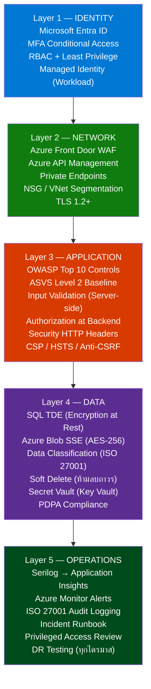
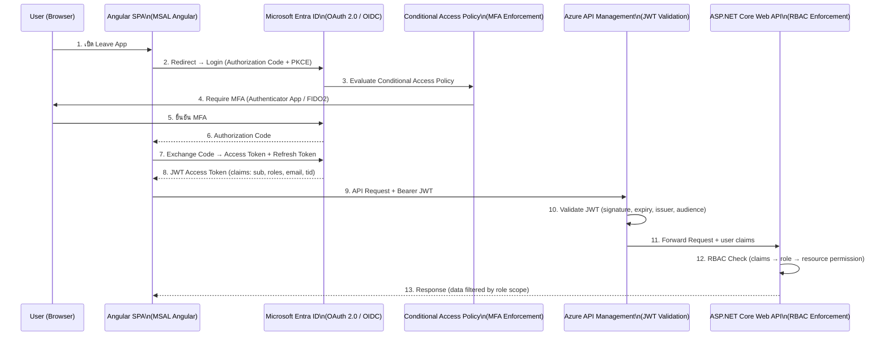
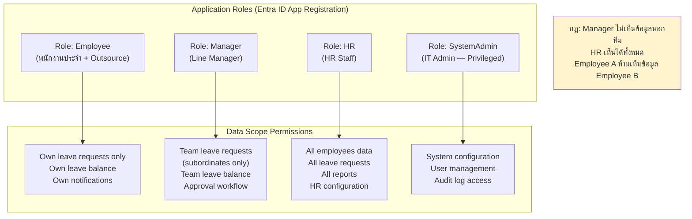
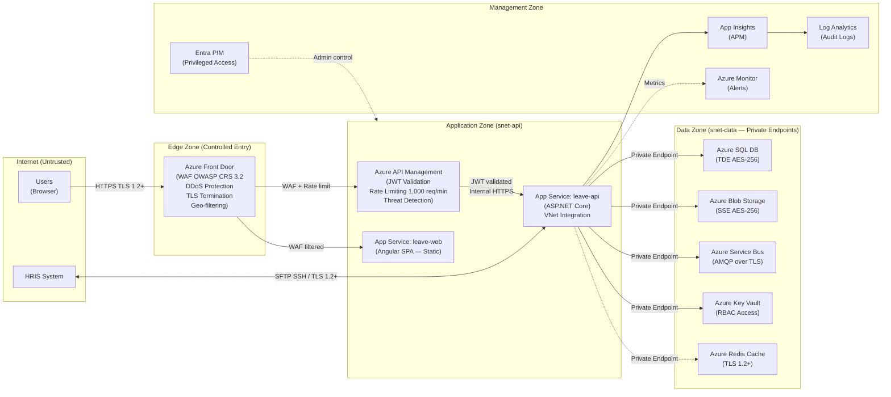
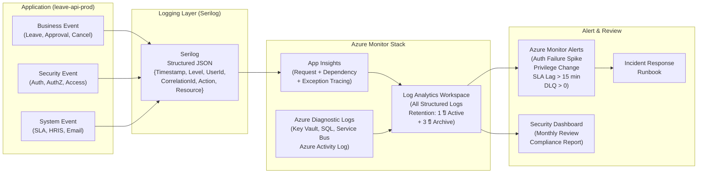
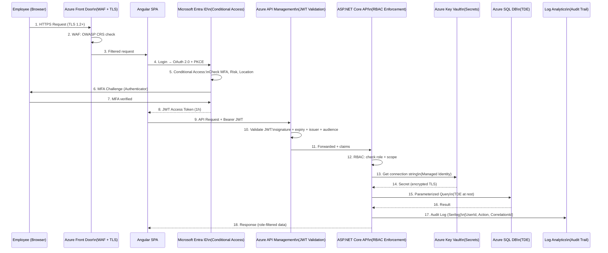

# Security Architecture Design: ระบบบริหารการลาและการอนุมัติ (Leave Request and Approval)

## Change Log

| Version | Date | Section | Change Type | Description | Source |
|---------|------|---------|-------------|-------------|--------|
| 1.0 | 2026-06-17 | All | Created | สร้างเอกสารครั้งแรก — ครอบคลุม Defense in Depth 5 ชั้น, IAM/MFA/RBAC, Network Security, OWASP Top 10, Encryption, Key Vault, Audit Log (ISO 27001), PDPA Compliance | NFR/TR SRS v1.0, SRS Summary v1.0, Security Knowledge Base, SDLC Standard |

---

## 1. วัตถุประสงค์และขอบเขต

| รายการ | รายละเอียด |
|--------|-----------|
| **วัตถุประสงค์** | ออกแบบ Security Architecture สำหรับระบบ Leave Request and Approval ของ ABC Company โดยยึดหลัก Defense in Depth ครบ 5 ชั้น ครอบคลุม Identity, Network, Application, Data, Operations — trace ทุก control กลับสู่ SRS และมาตรฐานองค์กร |
| **ขอบเขต In-Scope** | Identity & Access Management (Microsoft Entra ID, MFA, RBAC), Network Segmentation (Azure Front Door WAF, Private Endpoints, NSG), Application Security (OWASP Top 10), Data Encryption (at rest / in transit), Secret Management (Azure Key Vault), Audit Logging (ISO 27001 baseline), PDPA Compliance |
| **ขอบเขต Out-of-Scope** | SOC Operations (Security Operation Center), Penetration Testing execution, End-user device security (MDM), HRIS internal security design, Email Gateway security |
| **Security Baseline** | OWASP ASVS Level 2 (Business Application มีข้อมูลอ่อนไหว), ISO/IEC 27001:2022, ISO/IEC 27002:2022, PDPA (Thailand) |

---

## 2. Source Reference

| # | เอกสารอ้างอิง | บทบาท |
|---|-------------|-------|
| 1 | `80-knowledge-base/architecture-design/05-security-architecture/knowledge.md` | มาตรฐานองค์กร Security Architecture — Defense in Depth, IAM, Network, App, Data, Audit |
| 2 | `80-knowledge-base/SDLC/ai-std-sdlc.md` §5 | SDLC Security Standard — Entra ID, MFA, RBAC, Key Vault, TLS, OWASP Top 10, PDPA |
| 3 | `10-requirement-definition/b0-system-requriement/leave-request-and-approval-non-functional-tech-srs.md` | NFR-004–007, TR-007–009 |
| 4 | `10-requirement-definition/b0-system-requriement/leave-request-and-approval-system-requirement-specification-summary.md` | SRS Summary — Actors, RBAC scope, Data sensitivity |
| 5 | `20-system-design/a0-architecture-design/01-application-architecture/leave-request-and-approval-application-architecture-design.md` | Entra ID + MSAL Angular confirmed, RBAC at Backend |
| 6 | `20-system-design/a0-architecture-design/02-data-architecture/leave-request-and-approval-data-architecture-design.md` | Data Classification (Restricted/Confidential/Internal), Audit Columns |
| 7 | `20-system-design/a0-architecture-design/03-integration-architecture/leave-request-and-approval-integration-architecture-design.md` | APIM JWT Validation, TLS 1.2+, CloudEvents CorrelationId |
| 8 | `20-system-design/a0-architecture-design/04-infrastructure-architecture/leave-request-and-approval-infrastructure-architecture-design.md` | WAF (OWASP CRS 3.2), Private Endpoints, Key Vault, App Insights |
| 9 | ISO/IEC 27001:2022 | ISMS Framework และ Control Objective baseline |
| 10 | ISO/IEC 27002:2022 | Access management, Logging, Cryptography, Secure operations |
| 11 | OWASP ASVS v4 (Level 2) | Application security verification standard |
| 12 | OWASP Top 10 (2021) | Web application security risk baseline |
| 13 | Microsoft Conditional Access Best Practice | MFA Enforcement, Policy Design |
| 14 | PDPA (พ.ร.บ. คุ้มครองข้อมูลส่วนบุคคล พ.ศ. 2562) | Personal data protection compliance |

---

## 3. Security Drivers

| Driver | คำอธิบาย | ผลต่อ Security Architecture | SRS Trace |
|--------|---------|--------------------------|----------|
| **ข้อมูลพนักงานและสุขภาพ** | ระบบเก็บข้อมูล PII (ชื่อ, email, แผนก), ใบรับรองแพทย์ (Restricted) — ต้องปกป้องสูงสุด | Data Classification, Encryption at rest (TDE + Blob SSE), RBAC Row-level | NFR-006, TR-009 |
| **Multi-role Access Control** | 4 Actor ที่มีสิทธิ์ต่างกัน — Employee เห็นตนเอง, Manager เห็นทีม, HR เห็นทั้งองค์กร | RBAC ที่ Backend (Claim-based), ห้ามทำ Frontend-only | NFR-005, BRD §4 |
| **Authentication ต้องผ่านทุก request** | ทุก request ต้อง authenticated — ไม่มี anonymous access | Microsoft Entra ID + APIM JWT Validation, Session timeout | NFR-004, TR-008 |
| **MFA Mandatory (ไม่ใช้ SMS OTP)** | ต้อง enforce MFA สำหรับทุก user — ตามมาตรฐาน ai-std-sdlc.md §5.2 | Conditional Access Policy บน Entra ID | ai-std-sdlc.md §5.2 |
| **TLS 1.2+ ทุก connection** | ทุก HTTP request ต้อง HTTPS TLS 1.2+ | Azure Front Door + APIM enforce TLS, ปิด legacy TLS | TR-007 |
| **Audit Trail ตาม ISO 27001** | ต้องเก็บ log ทุก action ที่ sensitive ≥ 1 ปี | Serilog → App Insights → Log Analytics, Retention Policy | TR-009, ai-std-sdlc.md §5.6 |
| **PDPA Compliance** | ใบรับรองแพทย์เป็น Sensitive Personal Data ตาม PDPA — ต้องมี consent, purpose limitation | Data minimization, consent record, data subject rights | ai-std-sdlc.md §5.5 |
| **HRIS Integration Security** | IF-001 HRIS Sync อ่านข้อมูลพนักงาน — ต้อง secure ทั้ง credential และ data in transit | SFTP SSH RSA 4096 / API Key via APIM, TLS 1.2+ | TR-002, SIR-001 |
| **Secret ห้าม hardcode** | Connection string, API key ห้ามอยู่ใน code หรือ config file | Azure Key Vault + Managed Identity | ai-std-sdlc.md §5.2 |
| **Email Notification Security** | Email notification ผ่าน Azure Service Bus → Email Gateway ต้องมี TLS | AMQP over TLS (Service Bus), SMTP TLS | TR-003, NFR-007 |

---

## 4. Defense in Depth Model

**อ้างอิง:** knowledge.md §4, ai-std-sdlc.md §5.1

### 4.1 Security Layer Model



### 4.2 Control per Layer Summary

| Layer | หลักการ | Key Control | ป้องกันภัยคุกคาม |
|-------|---------|-----------|----------------|
| **Identity** | Least Privilege, Separation of Duties | Entra ID, Conditional Access MFA, RBAC, Managed Identity | Credential theft, Privilege escalation, Unauthorized access |
| **Network** | Defense in Depth, Deny by Default | Front Door WAF, APIM, Private Endpoint, NSG, TLS 1.2+ | DDoS, MITM, Injection via network, Unauthorized endpoint access |
| **Application** | Secure by Default, Assume Breach | OWASP Top 10, Input Validation, Backend AuthZ, Secure Headers | Injection, XSS, CSRF, Broken Access Control, Auth bypass |
| **Data** | Least Privilege, Data Minimization | TDE, Blob SSE, Key Vault, Soft Delete, PDPA | Data breach, Unauthorized disclosure, Data loss |
| **Operations** | Traceability, Assume Breach | ISO 27001 Audit Log, App Insights, Monitor Alerts, IR Runbook | Undetected breach, Insider threat, Compliance failure |

---

## 5. Identity & Access Management

**อ้างอิง:** knowledge.md §5, ai-std-sdlc.md §5.2

### 5.1 Identity Provider

**เลือก Microsoft Entra ID** — ตาม ai-std-sdlc.md §5.2 (มาตรฐานองค์กร)

| รายการ | การตั้งค่า | เหตุผล |
|--------|----------|-------|
| **Identity Provider** | Microsoft Entra ID (AAD) | มาตรฐานองค์กร — centralized identity |
| **Protocol** | OAuth 2.0 + OpenID Connect (OIDC) | Standard web/API authentication — knowledge.md §5.1 |
| **Token** | JWT Access Token (short-lived 1h) + Refresh Token (24h) | Token-based stateless — ASVS V2/V3 |
| **SSO** | ✅ เปิด — Single Sign-On ผ่าน Entra ID | พนักงาน login ครั้งเดียวใช้ได้หลายระบบองค์กร |
| **MSAL Angular** | ใช้ MSAL Angular สำหรับ Frontend authentication flow | มาตรฐาน Frontend (Application Architecture doc) |

### 5.2 Authentication Flow



### 5.3 MFA & Conditional Access Policy

**อ้างอิง:** knowledge.md §5.2, ai-std-sdlc.md §5.2

| Policy Name | Users | Conditions | Grant Control |
|------------|-------|-----------|--------------|
| **CA-001: Require MFA — All Users** | All users (ยกเว้น break-glass) | All resources, Any location | Require MFA (Authenticator App or FIDO2) |
| **CA-002: Block Legacy Authentication** | All users | Legacy auth clients | Block |
| **CA-003: Risk-based Sign-in** | All users | Sign-in risk: Medium/High | Require MFA + Password change |
| **CA-004: Privileged Role Protection** | IT Admin, HR Admin role | Any location | Require phishing-resistant MFA (FIDO2) |
| **CA-005: Break-glass Exclusion** | Break-glass accounts (2 accounts) | ยกเว้นจาก CA-001 | Excluded from MFA (emergency use only) |

> **ข้อกำหนด Break-glass Account:**
> - สร้าง 2 accounts — แยก secure password vault คนละที่
> - monitor login ทันที (Alert เมื่อ break-glass ถูกใช้)
> - review ทุก 3 เดือน
> - ไม่ใช้ MFA (สำหรับกรณี Entra ID unreachable เท่านั้น)

**MFA Method ที่อนุญาต:**
| Method | อนุญาต | หมายเหตุ |
|--------|--------|---------|
| Microsoft Authenticator (Push) | ✅ | แนะนำ |
| FIDO2 Security Key | ✅ | Phishing-resistant — สำหรับ privileged |
| Authenticator App (TOTP) | ✅ | Fallback |
| SMS OTP | ❌ | **ห้ามใช้** — ai-std-sdlc.md §5.2 |
| Voice Call | ❌ | **ห้ามใช้** |

### 5.4 RBAC Model

**อ้างอิง:** knowledge.md §5.5, ai-std-sdlc.md §5.2, SRS §4 Actors

**หลักการ:** Authorization enforce ที่ Backend (ASP.NET Core) เท่านั้น — ห้ามทำ Frontend-only



**RBAC Enforcement Detail:**

| Resource | Employee | Manager | HR | Basis |
|----------|----------|---------|-----|-------|
| GET /leave-requests (ตนเอง) | ✅ Own | ✅ Team | ✅ All | NFR-005 |
| GET /leave-requests (ทั้งองค์กร) | ❌ | ❌ Team only | ✅ | NFR-005 |
| POST /leave-requests | ✅ | ✅ | ✅ | SFR-003 |
| PUT /approvals (approve/reject) | ❌ | ✅ Own team | ✅ | SFR-005 |
| GET /leave-balances/{employeeId} | Own only | Team only | ✅ All | NFR-005 |
| GET /medical-certificates/{id} | Own only | Team only | ✅ All | NFR-006 |
| POST /hr/outsource-imports | ❌ | ❌ | ✅ | SFR-012 |
| GET /reports/* | ❌ | ❌ | ✅ | RFR-001–003 |
| GET /admin/* | ❌ | ❌ | ❌ | ✅ SystemAdmin |

**Implementation:**

```csharp
// ASP.NET Core Policy-based RBAC (LeaveApp.WebApi)
[Authorize(Policy = "ManagerOrHR")]
[HttpPut("approvals/{id}")]
public async Task<IActionResult> ApproveLeave(Guid id, ...)
{
    // Backend verify: Manager ต้องเป็น line_manager ของ employee นั้น
    var canApprove = await _authorizationService
        .CheckScopeAsync(User, id, "ApproveLeave");
    if (!canApprove) return Forbid(); // 403 — ห้ามเปิดเผยว่า resource มีอยู่หรือไม่
}
```

### 5.5 Workload Identity (Service-to-Service)

**อ้างอิง:** knowledge.md §5.3, §5.5, ai-std-sdlc.md §5.2

| Service | Identity Type | Access Target | หมายเหตุ |
|---------|-------------|-------------|---------|
| App Service → Key Vault | System-assigned Managed Identity | Key Vault Secret Reader | ไม่ใช้ connection string |
| App Service → Azure SQL DB | System-assigned Managed Identity | SQL DB Contributor | ไม่ใช้ password |
| App Service → Azure Blob | System-assigned Managed Identity | Storage Blob Data Contributor | ไม่ใช้ SAS key |
| App Service → Service Bus | System-assigned Managed Identity | Service Bus Data Owner | ไม่ใช้ shared access key |
| Azure DevOps → Azure | Service Principal (Federated Identity) | Deployment permissions | ไม่ใช้ static secret |
| HRIS API (Pattern B) | API Key (เก็บใน Key Vault) | HRIS REST Endpoint | ผ่าน APIM Named Values |

### 5.6 Privileged Access Management

**อ้างอิง:** knowledge.md §5.4

| รายการ | การตั้งค่า |
|--------|----------|
| **PIM (Privileged Identity Management)** | ใช้ Entra PIM สำหรับ role: SystemAdmin, Global Admin — JIT activation ≤ 8 ชั่วโมง |
| **Separate Admin Account** | IT Admin ใช้ account แยกจาก daily work account |
| **Log Privileged Actions** | ทุก PIM activation, privileged action → Log Analytics |
| **Access Review** | Review privileged role assignment ทุก 3 เดือน |
| **4-eyes Principle** | Config change ใน PROD ต้องมี approver ≥ 2 คน (Azure DevOps Approval Gate) |

---

## 6. Network Security

**อ้างอิง:** knowledge.md §6, ai-std-sdlc.md §5.3

### 6.1 Security Zone Diagram



### 6.2 Network Security Controls

| Control | การตั้งค่า | Zone | SRS Trace |
|---------|----------|------|----------|
| **WAF (Web Application Firewall)** | Azure Front Door WAF — OWASP Core Rule Set 3.2, Prevention Mode | Edge | ai-std-sdlc.md §5.3 |
| **DDoS Protection** | Azure DDoS Protection Standard บน Front Door | Edge | knowledge.md §6.2 |
| **TLS 1.2+ Enforcement** | Front Door + APIM: MinimumTlsVersion = 1.2, ปิด TLS 1.0/1.1 | Edge + APIM | TR-007 |
| **HTTPS Only** | App Service: HTTPS Only = On, HTTP → 301 Redirect | App Zone | TR-007 |
| **APIM Rate Limiting** | Internal Product: 1,000 req/min | App Zone | knowledge.md §6.2 |
| **Private Endpoints** | SQL, Blob, Key Vault, Service Bus, Redis — ทุกตัวใน PROD | Data Zone | knowledge.md §6.2 |
| **NSG Rules** | snet-api: Allow 443 from APIM only; snet-data: Allow from snet-api only; Deny All Internet | All | ai-std-sdlc.md §5.3 |
| **Database No Internet** | Azure SQL Private Endpoint — ไม่มี Public endpoint (Infra Architecture) | Data Zone | ai-std-sdlc.md §5.3 |
| **Key Vault No Internet** | Key Vault Private Endpoint — Disable Public Access | Data Zone | ai-std-sdlc.md §5.2 |
| **SFTP SSH RSA 4096** | IF-001 Batch Pattern: SSH Key RSA 4096-bit (ไม่ใช้ password auth) | Edge | knowledge.md §2.4, IF-001 |
| **Service Bus AMQP TLS** | Azure Service Bus AMQP over TLS 1.2+ | Data Zone | knowledge.md §2.3 |
| **Geo-filtering (optional)** | Block traffic จากประเทศที่ไม่ได้ใช้ระบบ (เมื่อยืนยัน policy) | Edge | knowledge.md §6.2 |

---

## 7. Application Security

**อ้างอิง:** knowledge.md §7, ai-std-sdlc.md §5.4

### 7.1 OWASP Top 10 (2021) — Control Mapping

| # | Risk | Control ที่วางไว้ | Layer | SRS/Standard Trace |
|---|------|-----------------|-------|------------------|
| **A01** | Broken Access Control | RBAC ที่ Backend (Claim-based), Row-level scope check ทุก API, 403 ห้ามเปิดเผย existence | App | NFR-005, knowledge.md §5.5 |
| **A02** | Cryptographic Failures | TLS 1.2+ (transit), SQL TDE (at rest), Blob SSE AES-256, ไม่ใช้ weak cipher | Net+Data | TR-007, ai-std-sdlc.md §5.5 |
| **A03** | Injection (SQL/XSS/Command) | EF Core Parameterized Query, Input validation (allowlist), Output encoding, Dapper safe query | App | ai-std-sdlc.md §5.4 |
| **A04** | Insecure Design | Threat Modeling ก่อน implementation, ASVS Level 2 baseline, trust boundary แยก UI/API/Infra | App | knowledge.md §7.2 |
| **A05** | Security Misconfiguration | WAF OWASP CRS, Secure HTTP Headers, Private Endpoints, No debug info in response, IaC baseline config | Net+App | ai-std-sdlc.md §5.3/5.4 |
| **A06** | Vulnerable & Outdated Components | OWASP Dependency Check ใน CI/CD Pipeline (NuGet + npm), Security Advisory monitoring | App (CI/CD) | knowledge.md §7.4 |
| **A07** | Authentication Failures | Entra ID MFA, Conditional Access, Session timeout, PKCE for auth code, Token expiry 1h | Identity | NFR-004, TR-008 |
| **A08** | Software & Data Integrity | Pipeline Approval Gate (UAT/PROD), Artifact signing, Branch Protection, Code Review PR | Ops | knowledge.md §7.4 |
| **A09** | Security Logging & Monitoring | App Insights + Log Analytics, Alert สำหรับ auth failure spike, CorrelationId ทุก request | Ops | TR-009, ai-std-sdlc.md §5.6 |
| **A10** | SSRF | Allowlist สำหรับ outbound call (HRIS, Email Gateway) — ผ่าน APIM เท่านั้น, block unexpected egress | App+Net | knowledge.md §6.2 |

### 7.2 Secure HTTP Headers

**อ้างอิง:** knowledge.md §7.3

| Header | ค่าที่ตั้ง | วัตถุประสงค์ |
|--------|---------|-----------|
| `Strict-Transport-Security` | `max-age=31536000; includeSubDomains; preload` | บังคับ HTTPS ถาวร |
| `Content-Security-Policy` | `default-src 'self'; script-src 'self'; style-src 'self' 'unsafe-inline'; img-src 'self' data:` | ป้องกัน XSS |
| `X-Content-Type-Options` | `nosniff` | ป้องกัน MIME type sniffing |
| `X-Frame-Options` | `DENY` | ป้องกัน Clickjacking |
| `Referrer-Policy` | `strict-origin-when-cross-origin` | จำกัด Referrer header |
| `Permissions-Policy` | `camera=(), microphone=(), geolocation=()` | ปิด browser features ที่ไม่ใช้ |

### 7.3 Input Validation Standard

**อ้างอิง:** knowledge.md §7.2 (allowlist validation), ai-std-sdlc.md §5.4

```csharp
// LeaveApp.Application — Input Validation (FluentValidation)
public class SubmitLeaveRequestValidator : AbstractValidator<SubmitLeaveRequestCommand>
{
    public SubmitLeaveRequestValidator()
    {
        // Allowlist: ประเภทลาต้องอยู่ใน enum ที่กำหนดเท่านั้น
        RuleFor(x => x.LeaveTypeId)
            .NotEmpty()
            .Must(id => ValidLeaveTypeIds.Contains(id))
            .WithMessage("ERR-VR001");

        // Date range validation — Server-side เท่านั้น
        RuleFor(x => x.StartDate)
            .LessThanOrEqualTo(x => x.EndDate)
            .WithMessage("ERR-VR002");

        // String length บังคับ — ป้องกัน buffer overflow / SQL injection
        RuleFor(x => x.Reason)
            .MaximumLength(500)
            .Matches(@"^[\w\s฀-๿.,!?()-]*$") // Allowlist: ตัวอักษรไทย/อังกฤษ/เครื่องหมายพื้นฐาน
            .WithMessage("ERR-VR003");
    }
}
```

### 7.4 File Upload Security (IF-004 Medical Certificate)

**อ้างอิง:** knowledge.md §7.3

| Control | การตั้งค่า | เหตุผล |
|---------|----------|-------|
| **File Type Validation** | ตรวจ MIME type (Content-Type) + ตรวจ file signature (Magic bytes) ไม่เชื่อแค่ extension | ป้องกัน extension spoofing |
| **Allowed Types** | PDF (application/pdf), JPG (image/jpeg), PNG (image/png) เท่านั้น | VR-007 |
| **File Size Limit** | Max 10 MB (Assumption A1 — ต้องยืนยัน) | ป้องกัน DoS / storage abuse |
| **Filename Sanitization** | UUID rename ก่อน store (`{uuid}.{ext}`) — ไม่ใช้ original filename | ป้องกัน path traversal |
| **Malware Scan** | Azure Defender for Storage (ถ้า enabled) — scan ทุก upload | knowledge.md §7.3 |
| **Access Control** | Blob RBAC — employee เห็นเฉพาะ own, manager เห็น team, HR เห็นทั้งหมด | NFR-005, NFR-006 |
| **No Direct URL** | ไม่เปิด public URL — ใช้ Signed URL (SAS Token, expiry 1h) เมื่อจำเป็น | NFR-006, knowledge.md §8.1 |

### 7.5 Session Management

**อ้างอิง:** knowledge.md §7.2, OWASP ASVS V3

| รายการ | การตั้งค่า | ASVS Ref |
|--------|----------|---------|
| **Access Token Lifetime** | 1 ชั่วโมง (JWT exp) | ASVS V3.2 |
| **Refresh Token Lifetime** | 24 ชั่วโมง | ASVS V3.2 |
| **Silent Renewal** | MSAL Angular รีนิว token อัตโนมัติก่อนหมดอายุ | ASVS V3.3 |
| **Token Storage** | Memory เท่านั้น (ไม่เก็บใน localStorage / sessionStorage) | ASVS V3.3 |
| **Session Revocation** | Logout = revoke refresh token ที่ Entra ID | ASVS V3.2 |
| **PKCE** | ใช้ Proof Key for Code Exchange ใน auth code flow | ASVS V2.1 |
| **Anti-CSRF** | Angular HttpClient มี XSRF protection built-in | ASVS V4.2 |

### 7.6 OWASP ASVS Level 2 — Key Verification Baseline

**อ้างอิง:** knowledge.md §7.1

| ASVS Chapter | Baseline | Control ที่วางไว้ |
|-------------|---------|-----------------|
| **V1 — Architecture** | Threat Modeling, trust boundary | Architecture ออกแบบแยก UI/API/Data/Infra ชัดเจน |
| **V2 — Authentication** | MFA, token-based, no insecure methods | Entra ID + Conditional Access MFA, PKCE, JWT |
| **V3 — Session Mgmt** | Secure token lifetime, no client storage | Memory-only token, 1h access / 24h refresh |
| **V4 — Access Control** | Backend authorization, least privilege | ASP.NET Core Policy RBAC, scope check per request |
| **V5 — Validation** | Allowlist input, output encoding | FluentValidation server-side, EF Core parameterized |
| **V6 — Cryptography** | TLS 1.2+, TDE, no weak algo | Azure SQL TDE, Blob SSE, TLS enforced |
| **V7 — Error Handling** | No stack trace, structured logging | Problem Details RFC 7807, Serilog (no sensitive data) |
| **V8 — Data Protection** | Data classification, minimize sensitive | ISO 27001 3-tier classification, PDPA consent |
| **V9 — Communication** | TLS 1.2+, certificate validation | HTTPS enforced, private endpoints |
| **V13 — API Security** | Auth on all endpoints, rate limit | APIM JWT validation, 1,000 req/min rate limit |
| **V14 — Configuration** | Secure defaults, no debug info in prod | IaC baseline, App Insights min level Information (PROD) |

---

## 8. Data Security

**อ้างอิง:** knowledge.md §8, ai-std-sdlc.md §5.5

### 8.1 Data Classification (ISO 27001 Baseline)

**อ้างอิง:** ai-std-sdlc.md §5.5 "classify ตาม ISO 27001: Public, Internal, Confidential, Restricted"

| Classification | ข้อมูลในระบบ | การป้องกัน | ใครเข้าถึงได้ | PDPA Scope |
|--------------|------------|----------|------------|----------|
| **Restricted** | ใบรับรองแพทย์ (Medical Certificate), ข้อมูลสุขภาพ | Azure Blob SSE AES-256, RBAC Blob, Signed URL only, Malware scan | Manager (ทีมตนเอง), HR เท่านั้น | ✅ Sensitive Personal Data (ต้องมี Explicit Consent) |
| **Confidential** | ข้อมูลส่วนตัวพนักงาน (ชื่อ, email, แผนก, ตำแหน่ง), Outsource data | SQL TDE, RBAC Row-level, TLS transit | Employee (ตนเอง), Manager (ทีม), HR (ทั้งหมด) | ✅ Personal Data (ต้องมี Consent) |
| **Internal** | Leave Request, Leave Balance, Approval History, Notification Log | SQL TDE, RBAC Row-level | ตาม Role scope | ⚠️ อาจมี Personal Data — ดู PDPA |
| **Internal** | System logs (App Insights), Import Logs | Log Analytics, Retention policy | IT Admin, HR (บางส่วน) | ⚠️ อาจมี user ID |

### 8.2 Encryption

| Scope | Algorithm | Implementation | SRS Trace |
|-------|---------|---------------|----------|
| **Data in Transit** | TLS 1.2 minimum (TLS 1.3 where supported) | Azure Front Door + APIM enforce TLS, APIM Client Certificate optional | TR-007, ai-std-sdlc.md §5.5 |
| **SQL Database at Rest** | AES-256 (TDE built-in) | Azure SQL Database TDE — enabled by default | ai-std-sdlc.md §5.5 |
| **Azure Blob Storage at Rest** | AES-256 (SSE) | Server-Side Encryption — enabled by default | NFR-006 |
| **Azure Service Bus** | AES-256 (at rest), TLS (transit) | Built-in Azure Service Bus encryption | knowledge.md §8.2 |
| **Redis Cache** | TLS 1.2+ (transit) | Azure Cache for Redis TLS required | knowledge.md §8.2 |
| **Azure Key Vault Keys** | RSA-2048 / HSM-backed (optional) | Keys ใน Key Vault ไม่สามารถ export ได้ | ai-std-sdlc.md §5.2 |
| **SFTP Transfer (IF-001)** | SSH RSA 4096-bit + SHA-256 checksum | SFTP over SSH — ไม่ใช้ FTP/FTPS | knowledge.md §2.4 |

### 8.3 Secret Management

**อ้างอิง:** knowledge.md §8.3, ai-std-sdlc.md §5.2

```mermaid
flowchart LR
    subgraph AppService["App Service (leave-api-prod)"]
        CODE["Application Code\n(no secrets)"]
        MI["System-assigned\nManaged Identity"]
    end

    subgraph KeyVault["Azure Key Vault (kv-leave-app-prod)"]
        direction TB
        SQL_CS["Secret: sql-connection-string"]
        BLOB_URL["Secret: blob-storage-url"]
        SB_CS["Secret: servicebus-connection-string"]
        HRIS_KEY["Secret: hris-api-key"]
        EMAIL_KEY["Secret: email-gateway-key"]
        APIM_KEY["Secret: apim-subscription-key"]
    end

    subgraph EntraID["Microsoft Entra ID"]
        ROLE["Key Vault Secrets User\n(RBAC role)"]
    end

    CODE -->|Reference via env var| MI
    MI -->|MSI Authentication| EntraID
    EntraID -->|JWT Token| ROLE
    ROLE -->|GET Secret| KeyVault

    style KeyVault fill:#5c2d91,color:#ffffff
    style AppService fill:#0078d4,color:#ffffff
```



**Secret Lifecycle:**

| รายการ | Policy |
|--------|--------|
| **Rotation** | Secret rotation ทุก 90 วัน (HRIS API Key, Email Key) |
| **Expiry** | กำหนด Secret expiry date ใน Key Vault — alert 30 วันก่อนหมด |
| **Access Log** | ทุก Key Vault access → Log Analytics (Diagnostic Settings) |
| **No Hardcode** | ห้าม hardcode ใน code, appsettings.json, IaC (Bicep) — ใช้ Key Vault Reference |
| **Separation** | แยก Key Vault ตาม environment (kv-leave-app-dev/sit/uat/prod) |
| **Least Privilege** | App Service ได้ role `Key Vault Secrets User` เท่านั้น — ไม่ใช่ Key Vault Administrator |

---

## 9. Audit Logging (ISO 27001 Baseline)

**อ้างอิง:** knowledge.md §9.1, ai-std-sdlc.md §5.6 "เก็บ audit log ตามกำหนด ISO 27001 (ขั้นต่ำ 1 ปี)"

### 9.1 Audit Event Registry

| Event Category | Event | Log Level | Fields Required | ISO 27001 Ref |
|---------------|-------|-----------|----------------|--------------|
| **Authentication** | Login Success | Info | UserId, IP, Timestamp, Method (MFA), CorrelationId | A.9.4.2 |
| **Authentication** | Login Failure | Warning | UserId (attempt), IP, Reason, Timestamp | A.9.4.2 |
| **Authentication** | Logout | Info | UserId, SessionDuration, Timestamp | A.9.4.2 |
| **Authentication** | MFA Failed | Warning | UserId, Method, AttemptCount, Timestamp | A.9.4.2 |
| **Authorization** | Access Denied (403) | Warning | UserId, Resource, Action, Timestamp, CorrelationId | A.9.4.1 |
| **Leave Transaction** | Leave Request Submitted | Info | UserId, LeaveRequestId, LeaveType, Period, CorrelationId | A.12.4.1 |
| **Leave Transaction** | Leave Approved/Rejected | Info | ApproverId, LeaveRequestId, Decision, Reason, CorrelationId | A.12.4.1 |
| **Leave Transaction** | Cancel Request Submitted | Info | UserId, CancelRequestId, LeaveRequestId, Reason | A.12.4.1 |
| **Leave Transaction** | Leave Balance Changed | Info | UserId, LeaveType, Before, After, Trigger, CorrelationId | A.12.4.1 |
| **File Operation** | Medical Certificate Uploaded | Info | UserId, AttachmentId, FileName, FileSize, CorrelationId | A.12.4.1 |
| **File Operation** | Medical Certificate Downloaded | Info | UserId, AttachmentId, AccessTime, CorrelationId | A.9.4.1 |
| **Data Import** | Outsource Excel Imported | Info | HRUserId, ImportLogId, TotalRecords, Success, Failed | A.12.4.1 |
| **Privilege Change** | Role Assigned / Removed | Warning | AdminId, TargetUserId, RoleChange, Reason, Timestamp | A.9.2.2 |
| **Privilege Change** | PIM Activation | Warning | AdminId, Role, Duration, Justification, Timestamp | A.9.4.4 |
| **System Event** | SLA Reminder Triggered | Info | SchedulerId, CancelRequestId, TriggerTime, Deadline | A.12.4.1 |
| **System Event** | SLA Escalation Triggered | Warning | SchedulerId, CancelRequestId, EscalateTime, RecipientId | A.12.4.1 |
| **Integration** | HRIS Sync Completed | Info | JobId, TotalRecords, Success, Failed, Duration | A.12.4.1 |
| **Integration** | HRIS Sync Failed | Error | JobId, ErrorCode, Reason, RetryCount | A.12.4.1 |
| **Integration** | Email Sent | Info | NotificationLogId, EventType, RecipientEmail, Status | A.12.4.1 |
| **Integration** | Email Failed (DLQ) | Error | NotificationLogId, EventType, RetryCount, FailureReason | A.12.4.1 |
| **Config Change** | Application Config Changed | Warning | AdminId, ConfigKey, Before, After, Environment | A.12.4.1 |
| **Security Event** | Key Vault Secret Accessed | Info | ApplicationId, SecretName, Timestamp | A.9.4.2 |
| **Security Event** | Key Vault Secret Rotated | Info | AdminId, SecretName, Timestamp | A.10.1.2 |

### 9.2 Audit Logging Architecture



### 9.3 Log Retention Policy

**อ้างอิง:** ai-std-sdlc.md §5.6 "ขั้นต่ำ 1 ปี", Data Architecture Design

| Log Type | Active Retention | Archive Retention | Storage |
|----------|----------------|-----------------|---------|
| **Application Logs (App Insights)** | 90 วัน | — | App Insights (included) |
| **Security Audit Logs (Log Analytics)** | **1 ปี** (ISO 27001 minimum) | 3 ปี (Azure Log Analytics Archive) | Log Analytics Workspace |
| **Business Transaction Logs (SQL)** | 2 ปี (ApprovalHistories, NotificationLogs) | 5 ปี (Archive) | SQL Server ตาม Data Arch |
| **Azure Activity Logs** | 90 วัน (default) → export → LAW 1 ปี | 3 ปี | Log Analytics via Diagnostic Settings |
| **Key Vault Access Logs** | 1 ปี | 3 ปี | Log Analytics via Diagnostic Settings |

> **หมายเหตุ:** Retention period สุดท้ายต้องยืนยันกับ Legal/Compliance ของ ABC Company — ดู Open Issue OI-001

### 9.4 Prohibited Log Data (Data Protection)

**อ้างอิง:** knowledge.md §8.4, ai-std-sdlc.md §6.2

ห้าม log ข้อมูลต่อไปนี้โดยเด็ดขาด:

| ข้อมูลที่ห้าม log | เหตุผล | แนวทาง |
|-----------------|-------|-------|
| Password / PIN | Security | hash/mask หรือไม่บันทึก |
| JWT Access Token (full) | Security | บันทึกแค่ `jti` (token ID) |
| ใบรับรองแพทย์ content | PDPA + Restricted | บันทึกแค่ AttachmentId, FileName |
| HRIS API Key | Security | บันทึกแค่ "HRIS API called" ไม่บันทึก key |
| Connection String | Security | ไม่ log configuration |
| Citizen ID / National ID | PDPA | mask หรือไม่บันทึก |

---

## 10. PDPA Compliance

**อ้างอิง:** ai-std-sdlc.md §5.5 "PDPA — ข้อมูลส่วนบุคคลต้องได้รับความยินยอมก่อนเก็บ"

### 10.1 Personal Data Inventory

| Data Element | ประเภท (PDPA) | จุดเก็บ | วัตถุประสงค์ | ฐานทางกฎหมาย |
|------------|-------------|-------|------------|------------|
| ชื่อ-นามสกุล (ไทย/อังกฤษ) | Personal Data | Employees table | Employee identity | Legitimate Interest (employment contract) |
| Email address | Personal Data | Employees table | Notification, Login | Legitimate Interest (employment contract) |
| แผนก, ตำแหน่ง | Personal Data | Employees table | RBAC routing, Approval | Legitimate Interest (employment contract) |
| ประวัติการลา (Leave History) | Personal Data | LeaveRequests, LeaveBalances | Leave management | Legitimate Interest (employment contract) |
| เหตุผลในการลา | Personal Data | LeaveRequests | Approval decision | Legitimate Interest |
| **ใบรับรองแพทย์** | **Sensitive Personal Data (Health Data)** | Azure Blob Storage | ประกอบเหตุผลลาป่วย | **Explicit Consent** required |
| **ข้อมูล Outsource** | Personal Data | Employees table | Employment management | **Explicit Consent** required (third-party data) |
| Line Manager ID | Personal Data | Employees table | Approval routing | Legitimate Interest |
| วันเข้างาน (HireDate) | Personal Data | Employees table | Leave entitlement calculation | Legitimate Interest |
| IP Address (log) | Personal Data (pseudonymized) | Log Analytics | Security monitoring | Legitimate Interest |

### 10.2 PDPA Control Implementation

| PDPA Principle | Implementation | SRS/Infra Link |
|--------------|---------------|---------------|
| **Consent (การยินยอม)** | แสดง Privacy Notice และขอ consent ใน Login flow ครั้งแรก — โดยเฉพาะ Medical Certificate (Sensitive Personal Data) | SFR-001 (Login), เพิ่ม consent screen |
| **Purpose Limitation** | ข้อมูลใช้เฉพาะ Leave Management เท่านั้น — ห้ามใช้เพื่อวัตถุประสงค์อื่น | NFR-005, RBAC policy |
| **Data Minimization** | เก็บเฉพาะ field ที่จำเป็น — ไม่เก็บ National ID ในระบบ | Data Arch — 9 tables |
| **Accuracy** | Employee data sync จาก HRIS (authoritative source), Outsource data อัปเดตได้โดย HR | IF-001, IF-003 |
| **Storage Limitation** | Retention policy ตาม Data Architecture — Transaction 2 ปี active, 5 ปี archive | Data Arch doc |
| **Integrity & Confidentiality** | TDE, Blob SSE, RBAC, TLS 1.2+ | Section 8 ทั้งหมด |
| **Data Subject Rights** | Employee สามารถ export / ดูข้อมูลตนเองได้ผ่านระบบ (RFR-001) — ขอลบต้องผ่าน HR | SFR-002, RFR-001 |
| **Cross-border Transfer** | Azure Southeast Asia region (Thailand data) — ตรวจสอบว่า HQ subscription ใช้ region ใด | Assumption A2 |
| **Data Breach Notification** | มี IR Runbook สำหรับ data breach — แจ้ง PDPA Authority ภายใน 72 ชั่วโมง | Section 9 Incident Readiness |
| **DPIA (Data Protection Impact Assessment)** | ต้องทำ DPIA สำหรับ Medical Certificate (Sensitive Personal Data) ก่อน go-live | Assumption A3 |

### 10.3 Privacy Notice Requirements

ต้องแสดงให้ผู้ใช้ทราบก่อนการเก็บข้อมูล (โดยเฉพาะ Medical Certificate):

```
[ข้อความ Privacy Notice — แนวทาง]

ระบบบริหารการลาและการอนุมัติ (ABC Company) เก็บข้อมูลส่วนบุคคลของท่านเพื่อวัตถุประสงค์:
1. การบริหารสิทธิ์การลาตามสัญญาจ้างงาน
2. การส่ง Email notification ที่เกี่ยวข้องกับคำขอลา

ข้อมูลสุขภาพ (ใบรับรองแพทย์): ท่านให้ความยินยอมสำหรับการเก็บและใช้ข้อมูลสุขภาพ
เพื่อประกอบการยื่นคำขอลาป่วยเท่านั้น

ท่านมีสิทธิ์เข้าถึง แก้ไข ลบ หรือถอนความยินยอมได้ผ่าน HR
ข้อมูลจะถูกเก็บตาม Retention Policy และลบเมื่อครบกำหนด

[ยอมรับ] [ปฏิเสธ]
```

---

## 11. Monitoring & Incident Readiness

**อ้างอิง:** knowledge.md §9, ai-std-sdlc.md §6.3

### 11.1 Security Monitoring Alerts

| Alert | Condition | Severity | Action Group | ISO 27001 |
|-------|-----------|----------|-------------|---------|
| **Auth Failure Spike** | >10 failures/min จาก IP เดียว | 🔴 Critical | Email IT + Teams | A.9.4.2 |
| **Break-glass Login** | Break-glass account ใช้งาน | 🔴 Critical | Email CISO + IT Manager | A.9.4.2 |
| **403 Access Denied Spike** | >50 denied/5min จาก user เดียว | ⚠️ Warning | Email IT | A.9.4.1 |
| **PIM Role Activation** | Any privileged role activated | ⚠️ Warning | Email IT Manager | A.9.4.4 |
| **Key Vault Secret Access** | Unexpected application access | ⚠️ Warning | Email IT | A.9.4.2 |
| **DLQ Message** | Service Bus DLQ > 0 | ⚠️ Warning | Email IT | A.12.4.1 |
| **SLA Scheduler Lag** | Execution lag > 15 min | 🔴 Critical | Email IT + Teams | A.12.4.1 |
| **SSL Cert Expiry** | TLS cert expiry < 30 days | ⚠️ Warning | Email IT | A.10.1.2 |
| **Key Vault Secret Expiry** | Secret expiry < 30 days | ⚠️ Warning | Email IT | A.10.1.2 |
| **Unusual Data Export** | HR report download > threshold | ⚠️ Warning | Email IT + HR Manager | A.12.4.1 |

### 11.2 Incident Response Runbook (สรุป)

**อ้างอิง:** knowledge.md §9.3

| Scenario | ขั้นตอน | Escalation |
|----------|---------|-----------|
| **Account Compromise** | 1. Disable account ใน Entra ID ทันที → 2. Revoke token → 3. Review audit log 24h → 4. Force password + MFA reset → 5. Notify user | IT Security → CISO |
| **Secret Exposure** | 1. Rotate secret ใน Key Vault ทันที → 2. Redeploy App Service (ใช้ secret ใหม่) → 3. Review ว่า secret ถูกใช้ที่ใดบ้าง → 4. Notify affected parties | IT Security → Management |
| **Medical Certificate Data Breach** | 1. Revoke Blob access → 2. Identify affected records → 3. แจ้ง PDPA Authority ภายใน 72h → 4. แจ้งเจ้าของข้อมูล → 5. Post-incident review | CISO → Legal → Management |
| **Unauthorized HRIS Access** | 1. Block HRIS API Key → 2. Review ImportLogs → 3. Identify data accessed → 4. Notify HRIS team | IT Security → HRIS Team |
| **SLA Scheduler Down** | 1. Check App Service health → 2. Restart App Service → 3. Check App Insights for error → 4. Manual SLA check ถ้า scheduler down > 1h | IT → HR (แจ้ง pending escalations) |

### 11.3 Security Review Cadence

| กิจกรรม | ความถี่ | ผู้รับผิดชอบ |
|---------|---------|------------|
| Privileged Role Access Review | ทุก 3 เดือน | IT Manager + HR Admin |
| Conditional Access Policy Review | ทุก 6 เดือน | IT Security |
| Key Vault Secret Rotation | ทุก 90 วัน | IT (automated alert) |
| Security Dashboard Review | ทุกเดือน | IT Security |
| Audit Log Anomaly Review | ทุกสัปดาห์ | IT Security |
| DR Test (PITR + Redeploy) | ทุกไตรมาส | IT Infrastructure |
| Penetration Test | ก่อน go-live + ทุกปี | External Security Firm |
| PDPA Compliance Review | ทุกปี | Legal + IT + HR |

---

## 12. Compliance Mapping

**อ้างอิง:** knowledge.md §10

| Control Theme | ISO 27001:2022 | ISO 27002:2022 | OWASP ASVS | OWASP Top 10 | Design Control |
|-------------|---------------|---------------|-----------|-------------|---------------|
| **Access Control** | A.9 (Access Control) | 5.15–5.18 | V2, V3, V4 | A01, A07 | Entra ID MFA, RBAC at Backend, APIM JWT Validation |
| **Cryptography** | A.10 (Cryptography) | 8.24 | V6, V9 | A02 | TLS 1.2+, SQL TDE, Blob SSE AES-256, Key Vault |
| **Logging & Monitoring** | A.12.4 (Logging) | 8.15–8.16 | V7 | A09 | Serilog + App Insights + Log Analytics, 1 ปี retention |
| **Secure Development** | A.14 (Secure DevOps) | 8.25–8.31 | V1, V5, V13, V14 | A04, A05, A06, A08 | OWASP ASVS L2, CI/CD SAST/SCA, WAF CRS |
| **Data Protection** | A.8 (Asset Mgmt) | 5.9–5.13 | V8, V9 | A02, A05 | Data Classification, PDPA Compliance, Encryption |
| **Privileged Operations** | A.9.4 (System Access) | 8.2, 8.18 | V2, V4 | A01, A07 | Entra PIM/JIT, Separate Admin Account, 4-eyes |
| **Incident Management** | A.16 (Incident Mgmt) | 5.24–5.28 | V7 | A09 | IR Runbook, Monitor Alerts, DR Testing |
| **Third-party/Supplier** | A.15 (Supplier) | 5.19–5.22 | V9 | A02 | HRIS SFTP SSH, APIM for external APIs, TLS |
| **Physical (Cloud)** | A.11 (Physical) | 7.1–7.14 | — | — | Azure Physical Security (Microsoft responsibility) |
| **PDPA** | A.18 (Compliance) | 5.31–5.36 | V8 | — | Privacy Notice, Consent, Data Subject Rights, DPIA |

---

## 13. Key Security Diagrams

### 13.1 End-to-End Security Flow



### 13.2 Security Incident Detection Flow

```mermaid
flowchart LR
    subgraph Events["Security Events"]
        AUTH_FAIL["Auth Failure Spike\n>10/min"]
        PRIV_CHANGE["Privilege Change\n(PIM Activation)"]
        DATA_BREACH["Unusual Data Export\n(Medical Cert)"]
        SLA_LAG["SLA Scheduler Lag\n>15 min"]
    end

    subgraph Detection["Detection Layer"]
        AI4["App Insights\n(Real-time)"]
        LAW4["Log Analytics\n(KQL Queries)"]
        MON4["Azure Monitor\n(Alert Rules)"]
    end

    subgraph Response["Response"]
        ALERT4["Action Group\n(Email IT / Teams)"]
        RUNBOOK["IR Runbook\n(Specific Scenario)"]
        ESCALATE["Escalation Path\n(CISO / Legal / Management)"]
    end

    Events --> AI4
    AI4 --> LAW4
    LAW4 --> MON4
    MON4 --> ALERT4
    ALERT4 --> RUNBOOK
    RUNBOOK --> ESCALATE
```



---

## 14. Traceability to SRS

| Design Topic | Related SRS ID | Source Type | Notes |
|-------------|---------------|------------|-------|
| Microsoft Entra ID — Identity Provider | NFR-004, TR-008, ai-std-sdlc.md §5.2 | Non-Functional, Standard | มาตรฐานองค์กร — ห้ามใช้ provider อื่น |
| MFA Mandatory (ไม่ใช้ SMS OTP) | ai-std-sdlc.md §5.2 | Standard | Conditional Access policy CA-001 |
| RBAC — Employee/Manager/HR scope | NFR-005, BRD §4 Actors | Non-Functional, Business | Backend enforcement — Claim-based |
| Outsource data same protection as Employee | NFR-006 | Non-Functional | RBAC Row-level + Blob RBAC |
| TLS 1.2+ ทุก connection | TR-007 | Technical | Front Door + APIM + Private Endpoint |
| Audit Log (ISO 27001 min 1 ปี) | TR-009, ai-std-sdlc.md §5.6 | Technical, Standard | Log Analytics Retention Policy |
| Audit Trail Immutable | TR-009 | Technical | Log Analytics = append-only |
| Azure Key Vault + Managed Identity | ai-std-sdlc.md §5.2 | Standard | ห้าม hardcode secrets |
| OWASP Top 10 baseline | ai-std-sdlc.md §5.4 | Standard | ASVS Level 2 |
| SQL TDE (Encryption at Rest) | ai-std-sdlc.md §5.5, NFR-006 | Standard, Non-Functional | Azure SQL built-in |
| Azure Blob SSE AES-256 | NFR-006, SIR-005 | Non-Functional, Integration | Medical Certificate Restricted data |
| Medical Certificate — Signed URL only | NFR-006, TR-005 | Non-Functional, Technical | ห้าม public URL |
| SFTP SSH RSA 4096 (HRIS Batch) | SIR-001, TR-002 | Integration, Technical | knowledge.md §2.4 |
| WAF OWASP CRS 3.2 | ai-std-sdlc.md §5.3, §5.4 | Standard | Azure Front Door WAF |
| Private Endpoints (PROD) | ai-std-sdlc.md §5.3 | Standard | DB/Blob/KV/SB ไม่เปิด Internet |
| Input Validation (Server-side, Allowlist) | ai-std-sdlc.md §5.4 | Standard | FluentValidation, EF Core |
| Parameterized Query (No SQL Injection) | ai-std-sdlc.md §5.4 | Standard | EF Core + Dapper safe |
| No Stack Trace to Client | ai-std-sdlc.md §5.4 | Standard | Problem Details RFC 7807 |
| Email notification TLS | TR-003, NFR-007 | Technical, Non-Functional | AMQP TLS (Service Bus) + SMTP TLS |
| PDPA — Medical Certificate Explicit Consent | ai-std-sdlc.md §5.5 | Standard | Privacy Notice + Consent flow |
| PDPA — Data Subject Rights | ai-std-sdlc.md §5.5 | Standard | Employee export own data (RFR-001) |
| Defense in Depth 5 ชั้น | ai-std-sdlc.md §5.1 | Standard | Identity/Network/App/Data/Ops |
| Secure HTTP Headers | knowledge.md §7.3 | Standard | HSTS, CSP, X-Frame, nosniff |
| Session: Memory-only token storage | ASVS V3.3 | Standard | ไม่เก็บใน localStorage |
| OWASP Dependency Check ใน CI/CD | knowledge.md §7.4 | Standard | NuGet + npm vulnerability scan |
| PDPA Data Breach — แจ้งภายใน 72h | PDPA 37/38 | Compliance | IR Runbook |
| Privileged Access: Entra PIM / JIT | knowledge.md §5.4 | Standard | ≤ 8h activation |
| Data Classification: Restricted/Confidential/Internal | ai-std-sdlc.md §5.5, ISO 27001 | Standard, Compliance | 3-tier model |
| No sensitive data in logs | ai-std-sdlc.md §6.2 | Standard | ห้าม log medical cert content, JWT, password |

---

## 15. Assumptions / Open Issues

### 15.1 Assumptions

| ID | รายละเอียด | ผลกระทบ | ต้องยืนยัน |
|----|-----------|--------|----------|
| **A1** | Max file size สำหรับ Medical Certificate = **10 MB** — ใช้สำหรับ File Upload validation | กำหนด validation rule ERR-IF004-002 + APIM request size limit | HR + IT ยืนยัน max size ที่เหมาะสม |
| **A2** | Azure Region ของ HQ Subscription = **Southeast Asia (Singapore)** — ข้อมูลไม่ออกนอกภูมิภาค ASEAN | PDPA Cross-border transfer compliance — ถ้า region อื่นอาจต้องทำ DPA กับ Azure | IT ยืนยัน Azure region ที่ใช้ |
| **A3** | ต้องทำ **DPIA (Data Protection Impact Assessment)** ก่อน go-live — Medical Certificate เป็น Sensitive Personal Data ตาม PDPA | DPIA document ต้องพร้อมก่อน UAT | Legal + HR ดำเนินการ DPIA |
| **A4** | ใช้ **Entra PIM** สำหรับ privileged access — ถ้า HQ Subscription ไม่มี Entra ID P2 license อาจไม่รองรับ PIM | ถ้าไม่มี PIM ต้องใช้ manual process แทน (Approval Gate + Audit Log) | IT ยืนยัน Entra ID license tier |
| **A5** | **MFA method**: Authenticator App เป็น default สำหรับทุก user — ถ้าพนักงานบางกลุ่มไม่มี smartphone ต้องมี fallback | กำหนด exception process สำหรับ user ที่ไม่สามารถใช้ Authenticator App | HR ยืนยันว่าพนักงานทุกคนมี smartphone |
| **A6** | Penetration Test จะทำ **ก่อน go-live** โดย External Security Firm — ผลลัพธ์อาจต้องแก้ไข architecture | สำรองเวลา 2-4 สัปดาห์หลัง pentest สำหรับแก้ไข finding | IT + Management อนุมัติ pentest budget |

### 15.2 Open Issues

| ID | Open Issue | รายละเอียด | ผลกระทบต่อ Security Architecture | สิ่งที่ต้องทำ |
|----|-----------|-----------|----------------------------------|------------|
| **OI-001** | **Audit Log Retention Period** | ISO 27001 = 1 ปี minimum แต่ PDPA / Thai Labor Law อาจต้องการนานกว่า | กำหนด Log Analytics Retention + Archive period | Legal / Compliance ยืนยัน retention period ที่ต้องการ |
| **OI-002** | **PDPA DPO (Data Protection Officer)** | ABC Company มี DPO หรือไม่? — ถ้าใช่ต้องแจ้ง DPO ก่อน go-live | DPIA ต้องผ่าน DPO approval | Legal ยืนยัน DPO status ของ ABC Company |
| **OI-003** | **Entra ID Tenant** | HQ Entra ID tenant ของ ABC Company ยืนยัน tenant ID + domain | กำหนด APIM JWT validation issuer URL, MSAL Angular config | IT ยืนยัน Entra ID tenant configuration |
| **OI-004** | **Conditional Access — Outsource** | Outsource ใช้ Entra ID Guest Account หรือ B2B? หรือ B2C? — กระทบ CA policy | CA policy อาจต้องแยก policy สำหรับ external user (B2B) | IT ยืนยัน identity flow สำหรับ Outsource |
| **OI-005** | **Medical Certificate Malware Scan** | Azure Defender for Storage (ค่าใช้จ่ายเพิ่ม) จำเป็นหรือไม่? | ถ้าไม่มี Defender → ต้อง implement server-side malware scan แทน | IT/Finance ยืนยัน security budget |
| **OI-006** | **Geo-filtering Policy** | Block traffic จากประเทศที่ไม่ได้ใช้ระบบ — ถ้า ABC Company มีพนักงานต่างประเทศต้องเปิด | Front Door WAF Geo-filter config | HR ยืนยัน user geography |
| **OI-007** | **PDPA Privacy Notice text** | ต้องมีทนายความ / Legal review Privacy Notice text ก่อนใช้งาน | Privacy Notice ที่แสดงในระบบต้องผ่าน legal sign-off | Legal ยืนยัน / draft Privacy Notice text |
| **OI-008** | **Break-glass Account Procedure** | ต้องกำหนด procedure สำหรับ break-glass usage — ใครอนุมัติ, วิธีเก็บ password, audit trail | Break-glass misuse = critical security incident | CISO / IT Manager กำหนด procedure |

---

## 16. Security Architecture Review Checklist

**อ้างอิง:** knowledge.md §11

- [x] มี Defense in Depth ครบ 5 ชั้น: Identity, Network, Application, Data, Operations
- [x] MFA ใช้ policy-based (Conditional Access) — ไม่ใช้ legacy per-user SMS OTP
- [x] มี Emergency Access / Break-glass strategy — 2 accounts, excluded from CA, monitored
- [x] RBAC: Least Privilege + Separation of Duties — Backend enforcement เท่านั้น
- [x] Row-level scope check: Manager เห็นเฉพาะทีม, Employee เห็นตนเอง
- [x] Workload Identity: System-assigned Managed Identity — ไม่มี hard-coded credentials
- [x] Privileged Access: Entra PIM/JIT, Separate Admin Account, Access Review ทุก 3 เดือน
- [x] WAF: Azure Front Door OWASP CRS 3.2 — Prevention Mode
- [x] TLS 1.2+ enforced: Front Door + APIM + ปิด TLS 1.0/1.1
- [x] Private Endpoints (PROD): SQL, Blob, Key Vault, Service Bus, Redis
- [x] Database ไม่เปิด Public endpoint
- [x] OWASP Top 10 controls ครบ — ASVS Level 2 baseline
- [x] Input Validation: Server-side Allowlist (FluentValidation)
- [x] SQL: Parameterized Query เท่านั้น (EF Core + Dapper)
- [x] Secure HTTP Headers: HSTS, CSP, X-Frame-Options, nosniff
- [x] Session: Memory-only token, PKCE, 1h access / 24h refresh
- [x] File Upload: MIME + Magic bytes validation, UUID rename, Signed URL only
- [x] Encryption at rest: SQL TDE + Blob SSE AES-256
- [x] Encryption in transit: TLS 1.2+ ทุก connection
- [x] Azure Key Vault: Secret rotation 90 วัน, Expiry alert 30 วัน, Least privilege
- [x] ISO 27001 Audit Log: ครบ 23 event types, Retention ≥ 1 ปี
- [x] ห้าม log: Password, JWT token, Medical cert content, Connection string
- [x] Security Monitoring Alerts: Auth failure spike, PIM activation, Break-glass, DLQ, SSL expiry
- [x] Incident Response Runbook: ครบ 5 scenarios (Account Compromise, Secret Exposure, Data Breach, HRIS, SLA)
- [x] PDPA: Personal Data Inventory, Data Classification, Privacy Notice, Consent, Data Subject Rights
- [x] PDPA: Medical Certificate = Sensitive Personal Data → Explicit Consent required
- [x] PDPA: Data Breach notification plan (72h to Authority)
- [x] CI/CD: OWASP Dependency Check (NuGet + npm), SAST, Pipeline approval gates
- [x] Compliance Mapping: ISO 27001, ISO 27002, OWASP ASVS, PDPA
- [x] Traceability: ทุก security control trace กลับ SRS หรือ Standard ≥ 1 รายการ
- [ ] ยืนยัน Medical Certificate max file size (Assumption A1)
- [ ] ยืนยัน Azure Region (Assumption A2)
- [ ] ดำเนิน DPIA ก่อน go-live (Assumption A3)
- [ ] ยืนยัน Entra ID P2 license (Assumption A4)
- [ ] ยืนยัน Outsource identity flow: B2B Guest vs B2C (OI-004)
- [ ] Legal review Privacy Notice text (OI-007)
- [ ] กำหนด Break-glass procedure (OI-008)
- [ ] Penetration Test ก่อน go-live (Assumption A6)

---

*เอกสารนี้ออกแบบโดยยึดมาตรฐานองค์กรจาก `80-knowledge-base/architecture-design/05-security-architecture/knowledge.md` และ `80-knowledge-base/SDLC/ai-std-sdlc.md` §5 — ทุก security control trace กลับสู่ SRS ผ่าน Section 14 Traceability Matrix และ compliance framework ผ่าน Section 12 Compliance Mapping*
