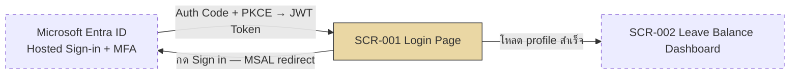

# SF-001 — Login / Authentication

## 1. Overview

| รายการ | รายละเอียด |
| --- | --- |
| Function ID | SF-001 |
| Function Name | Login / Authentication |
| Category | Screen |
| Screen Type | Search & Action Form (Login Landing Page — SSO redirect) |
| Description | ระบบตรวจสอบตัวตนผู้ใช้ก่อนอนุญาตให้เข้าใช้งาน รองรับพนักงานทุกกลุ่ม (ประจำ, Outsource, Manager, HR) — baseline ใช้ SSO ผ่าน Microsoft Entra ID (OAuth 2.0 / OIDC + MFA) ตาม Application/Security Architecture; หน้าจอนี้เป็น landing page ที่ redirect ไป Entra ID hosted login |
| Actor / User Role | พนักงานประจำ, Outsource, Line Manager, HR |
| Related Requirement IDs | SFR-001, NFR-004, NFR-005, TR-001, TR-007, TR-008 |
| Source Reference | Screen SRS §2.1 (SF-001), SRS §4.1 SFR-001, BRD BR-001, QA-H6, Security Architecture §5–§7.5, Application Architecture §9 (Assumption A1) |
| Version | 1.0 |
| Created By | screen-design-agent (2026-07-09) |
| Updated By | — |

## 2. Business Purpose

ป้องกัน unauthorized access — ให้แต่ละ role เห็นเฉพาะข้อมูลที่ได้รับอนุญาต (RBAC) โดยพนักงานทุกคนที่มี account (ประจำ: sync จาก HRIS ผ่าน IF-001 / Outsource: import ผ่าน IF-003) ต้องยืนยันตัวตนก่อนเข้าระบบ และหลัง login ระบบระบุ role เพื่อกำหนด menu และข้อมูลที่เข้าถึงได้ (Source: Screen SRS §2.1.1, BRD BR-001, SRS NFR-004/NFR-005)

## 3. Screen Overview

| รายการ | รายละเอียด |
| --- | --- |
| Screen Name | Login Page (SCR-001) |
| Menu Path | — (หน้าแรกของระบบ ก่อนเข้า Main Menu) |
| Navigation Inbound | URL โดยตรง / Redirect จากทุกหน้าเมื่อ session หมดอายุ (พร้อม INF-LGN-001) |
| Navigation Outbound | Leave Balance Dashboard (SCR-002) เมื่อ Login สำเร็จ — ทุก role ไปหน้าเดียวกัน แล้ว menu แสดงตาม role |
| Preconditions | ผู้ใช้มี account ในระบบ (พนักงานประจำ: sync จาก HRIS แล้ว / Outsource: import แล้ว) และมี account ใน Microsoft Entra ID |
| Postconditions | JWT Access Token (อายุ 1 ชม.) + Refresh Token (24 ชม.) ถูกเก็บใน memory ของ SPA, role ถูก identify จาก JWT claims, profile ถูกโหลดจากตาราง `Employees`, redirect ไป SCR-002, Audit log บันทึก Login Success |

### Related Screens

| Screen ID | Screen Name | Description |
| --- | --- | --- |
| SCR-002 | Leave Balance Dashboard | ปลายทางหลัง Login สำเร็จ (ทุก role) |
| — (Entra ID Hosted Page) | Microsoft Entra ID Sign-in | หน้ากรอก credential + MFA — โฮสต์โดย Microsoft ไม่ใช่หน้าจอของระบบนี้ |

### Screen Flow

```text
URL ระบบ / Session expired
  └── SF-001 Login Page (SCR-001)
        └── กด "Sign in" → Redirect ไป Microsoft Entra ID (OIDC + PKCE)
              ├── Credential + MFA ผ่าน → Callback กลับ SPA → โหลด profile
              │     ├── พบพนักงาน + IsActive = 1 → SCR-002 Leave Balance Dashboard
              │     └── ไม่พบ / Inactive → แสดง ERR-SF001-001 (คงอยู่ที่ SCR-001)
              └── Credential/MFA ไม่ผ่าน → Entra ID แสดง error เอง (อยู่ที่หน้า Entra ID)
```



## 4. Mockup / UI Layout

| รายการ | รายละเอียด |
| --- | --- |
| Mockup Reference | ไม่มี mockup อ้างอิงใน SRS (Screen SRS §2.1.3) — ASCII ด้านล่างเป็น Assumption ตาม Layout Description ของ SRS ปรับเป็น SSO landing page |
| Layout Description | SRS ระบุ: Logo, ช่อง Username, ช่อง Password, ปุ่ม Login — เนื่องจาก baseline เป็น SSO (Entra ID) ช่อง Username/Password ถูกกรอกบนหน้า Entra ID hosted page แทน หน้าจอของระบบเหลือ Logo + ปุ่ม Sign in + ข้อความแจ้ง (ดู Notes / Assumptions) |

```text
┌──────────────────────────────────────────────┐
│                                              │
│                 [ ABC LOGO ]                 │
│                                              │
│      ระบบบริหารการลาและการอนุมัติ                │
│      Leave Request and Approval System       │
│                                              │
│   ┌──────────────────────────────────────┐   │
│   │  🔑  Sign in with Microsoft          │   │  ← ปุ่มเดียว — redirect ไป Entra ID
│   └──────────────────────────────────────┘   │
│                                              │
│   (พื้นที่แสดง message: INF-LGN-001 /          │
│    ERR-SF001-001 / ERR-LGN-002)              │
│                                              │
│   พบปัญหาการเข้าสู่ระบบ กรุณาติดต่อ HR / IT        │
└──────────────────────────────────────────────┘
```

## 5. Fields Definition

### 5.1 Login Landing Page (SCR-001 — หน้าจอของระบบ)

| No | Field Name | Label (TH/EN) | Type | Length | Required | Default | Validation | DB Mapping | Description |
| :---: | --- | --- | --- | --- | --- | --- | --- | --- | --- |
| 1 | app_logo | — | Image | — | N | Logo องค์กร | — | — | Logo ABC Company (Screen SRS §2.1.3 Layout) |
| 2 | btn_signin | เข้าสู่ระบบด้วย Microsoft / Sign in with Microsoft | Button | — | — | Enable | — | — | Trigger MSAL redirect ไป Entra ID (TR-008, Security Architecture §5.2) |
| 3 | message_area | — | Text (read-only) | — | N | ซ่อน | — | — | แสดง INF-LGN-001 / ERR-SF001-001 / ERR-LGN-002 ตามสถานการณ์ |

### 5.2 Credential Fields (กรอกบน Microsoft Entra ID Hosted Page — อ้างอิงตาม SRS)

| No | Field Name | Label (TH/EN) | Type | Length | Required | Default | Validation | DB Mapping | Description |
| :---: | --- | --- | --- | --- | --- | --- | --- | --- | --- |
| 1 | username | ชื่อผู้ใช้ / Username | Text (email) | 200 | Y | — | Validate โดย Entra ID | `Employees.Email` NVARCHAR(200) — ใช้ map SSO claim → EmployeeId หลัง callback | SRS ระบุ "รหัสพนักงาน หรือ email ขึ้นกับ auth method" — baseline SSO ใช้ **email** (corporate account) ตาม `IEmployeeRepository.GetByEmailAsync` |
| 2 | password | รหัสผ่าน / Password | Password (masked) | — | Y | — | Validate โดย Entra ID + MFA (Authenticator App / FIDO2) | — (Entra ID จัดการ — ระบบไม่เก็บ password) | SRS ระบุ "SSO อาจไม่มี field นี้" — บน Entra ID hosted page ยังมี password + MFA challenge (CA-001) |

## 6. Commands / Actions

| No | Command | Type | Default State | Trigger Condition | System Response |
| :---: | --- | --- | --- | --- | --- |
| 1 | Sign in with Microsoft | Button | Enable | คลิก | MSAL Angular redirect ไป Entra ID (Authorization Code + PKCE) → callback พร้อม JWT → เรียก `IEmployeeService.GetProfileAsync(employeeId)` (ผ่าน REST API + Bearer Token) → สำเร็จ: redirect SCR-002 / ล้มเหลว: แสดง ERR-SF001-001 |
| 2 | Forgot Password | Link | Enable | คลิก | Redirect ไป Entra ID Self-Service Password Reset (SSPR) — SRS ระบุ "ข้อมูลไม่เพียงพอ ขึ้นกับ auth method"; baseline SSO ใช้ SSPR ของ Entra ID (Assumption — ดู §13) |

## 7. Screen Behavior

### 7.1 Initial Screen (onLoad)

- ล้าง session เก่า: เคลียร์ token ใน memory ของ MSAL (Screen SRS §2.1.7 onLoad)
- ถ้าเข้ามาจาก session expired redirect: แสดง INF-LGN-001 ใน message_area
- ถ้า MSAL พบ token ที่ยัง valid อยู่ (SSO session ของ Entra ID ยัง active): silent token acquisition → ข้ามไป 7.2 ขั้น callback ทันที (ไม่ต้องกรอก credential ซ้ำ — พฤติกรรม SSO ตาม Security Architecture §5.1)

### 7.2 Click "Sign in with Microsoft"

#### 7.2.1 Validation (ตามลำดับใน authentication flow)

| ลำดับ | Validation | Requirement | Error Message |
| :---: | --- | --- | --- |
| 1 | Credential ถูกต้อง (username/password) — validate โดย Entra ID | SFR-001, TR-008 | Entra ID แสดง error บน hosted page (เทียบเท่า ERR-LGN-001 ของ SRS) |
| 2 | MFA ผ่าน (Authenticator App / FIDO2 — CA-001) | Security Architecture §5.3 | Entra ID แสดง error บน hosted page |
| 3 | Account ไม่ถูก lock ที่ Entra ID (Smart Lockout) | Screen SRS §2.1.8 | ERR-LGN-002 (Entra ID block — SPA แสดงเมื่อ callback ส่ง error กลับ) |
| 4 | JWT valid (signature, expiry, issuer, audience) — validate ที่ APIM | Security Architecture §5.2 | HTTP 401 → SPA redirect กลับ SCR-001 |
| 5 | Map email claim → พนักงานในระบบ: `GetByEmailAsync(email)` ต้องพบ record และ `IsActive = 1` | SFR-001, NFR-004 | ERR-SF001-001 |

#### 7.2.2 Insert / Update (DB Transaction ถ้ามี)

```text
— ไม่มี DB Transaction (หน้าจอนี้อ่านอย่างเดียว)

SELECT: Employees WHERE Email = {jwt.email claim} AND IsDeleted = 0
  → ตรวจ IsActive = 1 → คืน EmployeeProfileDto (EmployeeId, FullNameTh/En, EmployeeType, ...)

AFTER SUCCESS:
  - เก็บ JWT Access Token (1h) + Refresh Token (24h) ใน memory เท่านั้น
    (ห้าม localStorage/sessionStorage — Security Architecture §7.5)
  - ระบุ role จาก JWT claims (roles) — RBAC enforce ที่ Backend (NFR-005)
  - Audit log: Login Success (UserId, IP, Timestamp, Method=MFA, CorrelationId)
    → Application Insights (Security Architecture §9.2 — ไม่เขียนตาราง DB)
  - Redirect → SCR-002

ON FAILURE:
  - Audit log: Login Failure (UserId attempt, IP, Reason, Timestamp)
  - แสดง error message — ไม่สร้าง session
```

### 7.3 Session หมดอายุ (ระหว่างใช้งานหน้าอื่น)

- Access Token หมดอายุ (1 ชม.): MSAL ใช้ Refresh Token ต่ออายุอัตโนมัติ (silent) — ผู้ใช้ไม่รู้สึก
- Refresh Token หมดอายุ (24 ชม.) หรือ revoke แล้ว: redirect กลับ SCR-001 พร้อม INF-LGN-001 (Screen SRS §2.1.7)

### 7.4 Logout (อ้างอิง — trigger จากหน้าอื่น)

- Logout = revoke refresh token ที่ Entra ID + เคลียร์ token ใน memory → redirect SCR-001 (Security Architecture §7.5 Session Revocation); Audit log: Logout (UserId, SessionDuration)

## 8. Business Rules

| Rule ID | Business Rule | Impact | Source Reference |
| --- | --- | --- | --- |
| BR-SF001-001 | พนักงานทุกคนต้องมี account จึงเข้าระบบได้ — ห้ามเข้าโดยไม่มี account | Validation ลำดับ 5: ไม่พบ email ใน `Employees` → block พร้อม ERR-SF001-001 | BRD BR-001, SRS NFR-004, Screen SRS §2.1.9 BR-001 |
| BR-SF001-002 | RBAC ตาม role — หลัง Login ระบบกำหนด role แล้วแสดง menu/ข้อมูลตาม role | Role มาจาก JWT claims (Entra App Registration); Authorization enforce ที่ Backend เท่านั้น ห้าม Frontend-only | SRS NFR-005, Screen SRS §2.1.9 BR-001-R, Security Architecture §6 |
| BR-SF001-003 | ทุก request ต้อง authenticated — ไม่มี anonymous access; MFA บังคับทุก user | ทุก API call แนบ Bearer JWT ผ่าน HTTP Interceptor; MFA ผ่าน Conditional Access CA-001 | SRS NFR-004, TR-008, Security Architecture §4/§5.3 |
| BR-SF001-004 | พนักงาน Inactive (ลาออก/สิ้นสุดสัญญา) ต้อง login ไม่ได้ | Validation ลำดับ 5: `IsActive = 0` → block (สอดคล้อง IF-001 deactivate) | SRS SFR-001, Interface SRS §2.1.6 (IF-001) |

## 9. Message List

### Error Messages

| Message ID | Trigger | Message (TH) | Message (EN) |
| --- | --- | --- | --- |
| ERR-LGN-001 | Username หรือ Password ไม่ถูกต้อง (SRS §2.1.8 — baseline SSO: Entra ID hosted page แสดง error ของตัวเอง; ID นี้คงไว้เพื่อ traceability และใช้กรณี fallback standalone) | ชื่อผู้ใช้หรือรหัสผ่านไม่ถูกต้อง กรุณาลองใหม่อีกครั้ง | Incorrect username or password. Please try again. |
| ERR-LGN-002 | Account ถูก lock (Entra ID Smart Lockout / ถูกระงับโดยองค์กร) | บัญชีถูกระงับชั่วคราว กรุณาติดต่อ HR | Your account has been temporarily locked. Please contact HR. |
| ERR-SF001-001 | Authenticate ผ่าน Entra ID แล้ว แต่ไม่พบพนักงานในระบบ หรือ `IsActive = 0` (`EmployeeNotFoundException`) — message ใหม่ที่เพิ่มในเอกสารนี้ | ไม่พบข้อมูลพนักงานของคุณในระบบ หรือบัญชีถูกปิดใช้งาน กรุณาติดต่อ HR | Your employee record was not found or is inactive. Please contact HR. |

### Success / Info Messages

| Message ID | Trigger | Message (TH) | Message (EN) |
| --- | --- | --- | --- |
| INF-LGN-001 | Session หมดอายุ — redirect กลับ SCR-001 | Session หมดอายุ กรุณา Login ใหม่ | Session expired. Please log in again. |

## 10. Popup / Sub-screen Definition

— ไม่มี (หน้าจอ Login ไม่มี popup — credential/MFA challenge เป็น hosted page ของ Microsoft Entra ID ไม่ใช่ sub-screen ของระบบนี้)

## 11. Database Tables Reference

| Table Name | Alias | Description |
| --- | --- | --- |
| Employees | — | SELECT หลัง SSO callback: `WHERE Email = {jwt email claim} AND IsDeleted = 0` เพื่อ map → EmployeeId + ตรวจ `IsActive` + คืน profile (`EmployeeProfileDto`) — ไม่มี INSERT/UPDATE จากหน้าจอนี้ |

## 12. Exception Handling

| Error Case | Trigger Condition | System Behavior | User Message | Recovery |
| --- | --- | --- | --- | --- |
| Validation error | Credential/MFA ผิด (ที่ Entra ID) | Entra ID ไม่ออก token — ผู้ใช้อยู่ที่ hosted page; ไม่สร้าง session; Audit log Login Failure | Error บน Entra ID hosted page (เทียบเท่า ERR-LGN-001) | กรอกใหม่ / reset password ผ่าน SSPR |
| Validation error | Account lock ที่ Entra ID | Callback ส่ง error กลับ SPA — ไม่สร้าง session | ERR-LGN-002 | ติดต่อ HR / IT ปลด lock |
| Validation error | ไม่พบพนักงาน / Inactive (`EmployeeNotFoundException`) | ไม่เข้า SCR-002, เคลียร์ token, แสดง message บน SCR-001, Audit log Login Failure | ERR-SF001-001 | ติดต่อ HR ตรวจสอบข้อมูลพนักงาน (HRIS sync / import) |
| Integration error | Entra ID unreachable / MSAL redirect ล้มเหลว | แสดง error บน SCR-001 — ไม่ retry อัตโนมัติ | "ระบบขัดข้องชั่วคราว กรุณาลองใหม่" (Screen SRS §2.1.10) | รอและ refresh; IT ตรวจสอบ Entra ID status |
| System error | Backend API ล่มระหว่างโหลด profile (HTTP 5xx) | เคลียร์ token, แสดง error page ตาม global error handling | "ระบบขัดข้องชั่วคราว กรุณาลองใหม่" | รอและ refresh |

## 13. Notes / Assumptions

| ประเภท | รายละเอียด | ผลกระทบ |
| --- | --- | --- |
| Open Issue (จาก SRS) | Authentication method ยังไม่ยืนยัน (SSO vs standalone — SRS §7, TR-008) — เอกสารนี้ใช้ **Microsoft Entra ID SSO เป็น baseline** ตาม Application Architecture Assumption A1 และ Security Architecture §5 (confirmed เป็นมาตรฐานองค์กร ai-std-sdlc.md §5.2) | หากยืนยันเป็น standalone auth ต้อง revise เอกสารนี้: เพิ่ม field username/password บน SCR-001 จริง, ERR-LGN-001 กลับมาแสดงบนหน้าจอระบบ, เพิ่มตาราง credential |
| Assumption (จาก SRS) | พนักงาน Outsource ทุกคนมี email ที่ใช้ login ได้ และมี account ใน Entra ID (guest/member) | กระทบ VR-013 (import) และ SFR-001 — ต้อง confirm กระบวนการสร้าง Entra account ให้ Outsource |
| Assumption (เอกสารนี้) | Username = **corporate email** (ไม่ใช่รหัสพนักงาน) — เพราะ SSO map claim ด้วย `GetByEmailAsync` ตาม Method Signature §3.2 | หากองค์กรใช้ UPN รูปแบบอื่นต้องปรับ mapping |
| Assumption (เอกสารนี้) | Forgot Password ใช้ Entra ID Self-Service Password Reset (SSPR) — SRS ระบุ "ข้อมูลไม่เพียงพอ" | ต้อง confirm ว่าองค์กรเปิด SSPR; ถ้าไม่เปิด ให้เปลี่ยน link เป็นข้อความ "ติดต่อ IT" |
| Assumption (เอกสารนี้) | ERR-SF001-001 เป็น message ใหม่ (ไม่มีใน SRS) สำหรับกรณี authenticate ผ่านแต่ไม่พบพนักงาน/Inactive — SRS ครอบคลุมเฉพาะ credential ผิดกับ account lock | ต้องให้ BA/HR review ข้อความ |
| Assumption (เอกสารนี้) | ASCII mockup ใน §4 เป็น layout ที่ตั้งขึ้นเอง (SRS ไม่มี mockup) — คง element ตาม SRS Layout Description แต่ปรับเป็น SSO landing page | รอ UX/UI ยืนยัน layout จริง |
| Note | Audit logging ของ Login Success/Failure/Logout ส่งไป Application Insights ตาม Security Architecture §9.2 — ไม่มีตาราง audit ใน DB (Class Diagram ไม่มี LoginLog entity) | หากต้องการเก็บใน DB ต้องเพิ่ม entity ใน Data Architecture |
| Note | Screen Type ของ template ไม่มีประเภท "Login" — เลือก "Search & Action Form" เป็นค่าใกล้เคียงที่สุด | — |

## Change Log

| Version | Date | Author | Change Type | Description | Remark |
| --- | --- | --- | --- | --- | --- |
| 1.0 | 2026-07-09 | screen-design-agent (Claude) | Created | สร้างเอกสารครั้งแรกจาก Screen SRS v1.0 (§2.1 SF-001), Security Architecture Design v1.0 (§5–§7.5, §9), Application Architecture Design (§6.4, §9, Assumption A1), Data Architecture (Employees DDL), Method Signature (`IEmployeeService.GetProfileAsync`, `IEmployeeRepository.GetByEmailAsync`) | Generated ตาม template screen-design-agent |

### สรุปการเปลี่ยนแปลงสำคัญ

| ช่วง Version | การเปลี่ยนแปลง | ผลกระทบ |
| --- | --- | --- |
| 1.0 | Baseline แรก | — |
