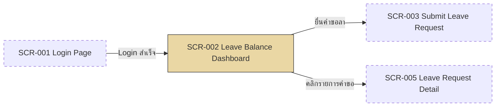

# SF-002 — Leave Balance Dashboard

## 1. Overview

| รายการ | รายละเอียด |
| --- | --- |
| Function ID | SF-002 |
| Function Name | Leave Balance Dashboard |
| Category | Screen |
| Screen Type | Dashboard |
| Description | หน้าหลักหลัง login — แสดงสิทธิ์วันลาคงเหลือของพนักงานแยกตามประเภทการลาเป็น card คำนวณตามอายุงานและ employee_type พร้อมปุ่มยื่นคำขอลาและรายการคำขอล่าสุด |
| Actor / User Role | พนักงานประจำ (Employee), Outsource |
| Related Requirement IDs | SFR-002, VR-002, VR-003, VR-004, VR-008, SCR-002 |
| Source Reference | Screen SRS §2.2 (SF-002), SRS §4.1 SFR-002, BRD BR-002, BR-007–BR-011, R6 (QA v2) |
| Version | 1.0 |
| Created By | screen-design-agent (2026-07-12) |
| Updated By | — |

## 2. Business Purpose

ให้พนักงานตรวจสอบสิทธิ์วันลาคงเหลือได้ด้วยตนเองโดยไม่ต้องสอบถาม HR — ระบบคำนวณสิทธิ์ตามอายุงาน (5 tiers), employee_type และยอดสะสมจากปีก่อน (cap 30 วัน) โดยอัตโนมัติ ลดภาระงาน HR และลดข้อผิดพลาดจากการคำนวณด้วยมือ พร้อมเป็นจุดเริ่มต้น (landing page) สำหรับยื่นคำขอลาและติดตามคำขอเดิม (Source: Screen SRS §2.2.1, BRD BR-002, BR-007–BR-011)

## 3. Screen Overview

| รายการ | รายละเอียด |
| --- | --- |
| Screen Name | Leave Balance Dashboard (SCR-002) |
| Menu Path | Main Menu > Leave Balance Dashboard (หน้าหลักหลัง login) |
| Navigation Inbound | SCR-001 Login Page (Login สำเร็จ — ทุก role), Header Navigation จากทุกหน้า |
| Navigation Outbound | SCR-003 Submit Leave Request (ปุ่ม "ยื่นคำขอลา"), SCR-005 Leave Request Detail (คลิกรายการคำขอ) |
| Preconditions | Login สำเร็จ (SF-001), มีข้อมูล employee ใน system (`Employees.IsActive = 1`) |
| Postconditions | พนักงานเห็น balance ปัจจุบันของทุกประเภทที่มีสิทธิ์ พร้อมดำเนินการต่อ (ยื่นคำขอ / ดูรายละเอียดคำขอ) — ไม่มีการเปลี่ยนแปลง DB state (read-only) |

### Related Screens

| Screen ID | Screen Name | Description |
| --- | --- | --- |
| SCR-001 | Login Page | หน้าจอต้นทาง — Login สำเร็จแล้ว redirect มาหน้านี้ (ทุก role) |
| SCR-003 | Submit Leave Request | ปลายทางเมื่อกดปุ่ม "ยื่นคำขอลา" |
| SCR-005 | Leave Request Detail | ปลายทางเมื่อคลิกรายการคำขอในส่วน "คำขอล่าสุด" (SF-006 Status Tracking) |

### Screen Flow

```text
SCR-001 Login Page
  └── [Login สำเร็จ] → SF-002 Leave Balance Dashboard (SCR-002)
        ├── [ยื่นคำขอลา] → SCR-003 Submit Leave Request
        └── [คลิกรายการคำขอ / ดูประวัติคำขอ] → SCR-005 Leave Request Detail
```



## 4. Mockup / UI Layout

| รายการ | รายละเอียด |
| --- | --- |
| Mockup Reference | — (SRS §2.2.3 ระบุว่าไม่มี mockup อ้างอิง — ASCII ด้านล่างเป็น Assumption ตาม Layout Description ใน SRS §2.2.3) |
| Layout Description | Card-based layout แสดงสิทธิ์แต่ละประเภทเป็น card (1 card ต่อ 1 leave type ที่มีสิทธิ์), ปุ่ม "ยื่นคำขอลา", รายการคำขอล่าสุดด้านล่าง |

```text
+----------------------------------------------------------------------+
| [LOGO]  Leave Management System        User: [EMP_ID]  [EMP_NAME]   |
+----------------------------------------------------------------------+
| Menu >> Leave Balance Dashboard                    รอบปี: [ 2026 ]   |
+----------------------------------------------------------------------+
| สิทธิ์วันลาคงเหลือ (Leave Balance)              [ + ยื่นคำขอลา ]      |
|                                                                      |
| +------------------+  +------------------+  +------------------+     |
| | ลาพักผ่อนประจำปี   |  | ลาป่วย            |  | ลากิจ             |     |
| | คงเหลือ  8 วัน     |  | คงเหลือ  27 วัน   |  | คงเหลือ  2 วัน    |     |
| | สิทธิ์รวม 10       |  | สิทธิ์รวม 30      |  | สิทธิ์รวม 3       |     |
| | ใช้ไป    3        |  | ใช้ไป    3       |  | ใช้ไป    1       |     |
| | สะสม     5        |  |                  |  |                  |     |
| | ⚠ WRN-BAL-001     |  |                  |  |                  |     |
| +------------------+  +------------------+  +------------------+     |
| +------------------+  +------------------+  ...                      |
| | ลาคลอด            |  | ลาทำหมัน          |  (ซ่อนเมื่อ Outsource)    |
| +------------------+  +------------------+                           |
|                                                                      |
| คำขอล่าสุด (Recent Requests)                    [ ดูประวัติคำขอ > ]   |
| +------------------------------------------------------------------+ |
| | เลขคำขอ       | ประเภท   | วันที่          | จำนวน | สถานะ        | |
| | LR-2026-00012 | ลาป่วย   | 01–02 Jul 2026 | 2     | [Approved]  | |
| | LR-2026-00010 | ลาพักผ่อน | 15 Jul 2026    | 1     | [Pending]   | |
| +------------------------------------------------------------------+ |
+----------------------------------------------------------------------+
```

## 5. Fields Definition

### 5.1 Balance Card Section (Display Only — 1 card ต่อ 1 leave type ที่มีสิทธิ์)

| No | Field Name | Label (TH/EN) | Type | Length | Required | Default | Validation | DB Mapping | Description |
| :---: | --- | --- | --- | --- | --- | --- | --- | --- | --- |
| 1 | leave_type | ประเภทการลา / Leave Type | Text (read-only) | — | Y | — | แสดงเฉพาะประเภทที่ employee_type มีสิทธิ์ (BR-011: `LeaveTypes.IsAvailableForOutsource`) | `LeaveTypes.TypeNameTh` / `TypeNameEn` (NVARCHAR(100)) | ชื่อประเภทการลา (หัว card) |
| 2 | entitled_days | สิทธิ์รวม / Total Entitlement | Number (วัน, read-only) | — | Y | — | คำนวณจากอายุงาน 5 tiers (BR-008 — จาก `Employees.HireDate`) | `LeaveBalances.EntitledDays` (DECIMAL(10,2)) | จำนวนวันสิทธิ์ทั้งหมด/ปี |
| 3 | used_days | ใช้ไปแล้ว / Used | Number (วัน, read-only) | — | Y | 0 | — | `LeaveBalances.UsedDays` (DECIMAL(10,2)) | วันที่ใช้ไปในปีนี้ (Approved แล้ว) |
| 4 | remaining_days | คงเหลือ / Remaining | Number (วัน, read-only) | — | Y | — | = entitled + carry_forward − used − pending (`LeaveBalanceItemDto.RemainingDays` — ดู Assumption §13) | คำนวณจาก `LeaveBalances.EntitledDays + CarriedForwardDays − UsedDays − PendingDays` | วันคงเหลือสุทธิ — ตัวเลขหลักของ card |
| 5 | carry_forward | สะสมจากปีก่อน / Carried Forward | Number (วัน, read-only) | — | N | 0 | แสดงเฉพาะลาพักผ่อน, cap 30 วัน (VR-008, BR-009) | `LeaveBalances.CarriedForwardDays` (DECIMAL(10,2)) | วันสะสมจากปีที่แล้ว |
| 6 | reference_year | รอบปี / Year | Number (ปี ค.ศ., read-only) | — | Y | ปีปัจจุบัน | — | `LeaveBalances.LeaveYear` (SMALLINT) | รอบปีที่แสดง (ค.ศ. — Data Architecture Assumption A2) |

### 5.2 Recent Requests Section (Display Only — ดู Assumption §13)

| No | Field Name | Label (TH/EN) | Type | Length | Required | Default | Validation | DB Mapping | Description |
| :---: | --- | --- | --- | --- | --- | --- | --- | --- | --- |
| 1 | request_no | เลขคำขอ / Request No. | Text (read-only, link) | 30 | Y | — | — | `LeaveRequests.LeaveRequestRef` (NVARCHAR(30)) | คลิกเพื่อเปิด SCR-005 (SF-006) |
| 2 | leave_type | ประเภท / Leave Type | Text (read-only) | — | Y | — | — | `LeaveTypes.TypeNameTh` (JOIN ผ่าน `LeaveRequests.LeaveTypeId`) | ประเภทการลาของคำขอ |
| 3 | leave_dates | วันที่ / Dates | Date range (read-only) | — | Y | — | — | `LeaveRequests.StartDate`, `LeaveRequests.EndDate` (DATE) | ช่วงวันที่ลา |
| 4 | duration_days | จำนวน / Days | Number (read-only) | — | Y | — | — | `LeaveRequests.DurationDays` (DECIMAL(10,2)) | จำนวนวันลา |
| 5 | status | สถานะ / Status | Badge (color-coded, read-only) | — | Y | — | — | `LeaveRequests.Status` (TINYINT: 1=Pending, 2=Approved, 3=Rejected, 4=Cancelled, 5=CancelRequested, 6=Escalated) | สถานะคำขอ |

## 6. Commands / Actions

| No | Command | Type | Default State | Trigger Condition | System Response |
| :---: | --- | --- | --- | --- | --- |
| 1 | ยื่นคำขอลา | Button | Enable | คลิกปุ่ม | Navigate ไป SCR-003 Submit Leave Request (Screen SRS §2.2.6) |
| 2 | ดูประวัติคำขอ | Link / Tab | Enable | คลิกลิงก์ | แสดงรายการ Leave Request ของตนเอง — เรียก `ILeaveRequestService.GetMyLeaveRequestsAsync()` (SFR-006) แล้วคลิกรายการเพื่อเปิด SCR-005 |
| 3 | คลิกรายการคำขอ (row ใน Recent Requests) | Link (row click) | Enable | คลิก row | Navigate ไป SCR-005 Leave Request Detail ของคำขอนั้น (SF-006) |

## 7. Screen Behavior

### 7.1 Initial Screen (onLoad)

- ดึง balance ตาม employee_id จาก session (JWT claims) — เรียก `ILeaveBalanceService.GetDashboardAsync(employeeId, year=ปีปัจจุบัน)` คำนวณตาม employee_type + อายุงาน (Screen SRS §2.2.7, SFR-002)
- แสดง card ตามประเภทที่มีสิทธิ์เท่านั้น — filter ด้วย `LeaveTypes.IsAvailableForOutsource` (BR-011)
- โหลดรายการคำขอล่าสุดผ่าน `ILeaveRequestService.GetMyLeaveRequestsAsync()` เรียงตาม `CreatedAt` DESC (ดู Assumption §13 เรื่องจำนวนรายการ)
- Performance target: โหลด balance ≤ 2 วินาที (NFR-002 — indexed query `UQ_LeaveBalances_Employee_Type_Year`)

### 7.2 Outsource เข้าหน้า (onLoad — employee_type = Outsource)

- ซ่อน card ลาคลอด / ลาทำหมัน / ลารับราชการ / ลาอุปสมบท (LeaveTypeId 4–7) — BR-011, `Employees.EmployeeType = 2`

### 7.3 Probation เข้าหน้า (onLoad — อายุงาน < 3 เดือน)

- แสดง card ลาพักผ่อนพร้อม label "ยังไม่มีสิทธิ์ (ช่วงทดลองงาน)" และ balance = 0 (BR-007) พร้อมแสดง INF-BAL-001
- คำนวณอายุงานจาก `Employees.HireDate` (Regular) — Outsource ใช้ `AbcStartDate` (ดู Assumption §13)

### 7.4 แสดง Warning ตาม balance (หลังโหลดสำเร็จ)

- ลาพักผ่อนคงเหลือ ≤ 2 วัน: แสดง WRN-BAL-001 บน card ลาพักผ่อน (Screen SRS §2.2.8)
- วันสะสมใกล้ถึง cap 30 วัน: แสดง WRN-BAL-002 บน card ลาพักผ่อน (VR-008, BR-009)

### 7.5 Click "ยื่นคำขอลา"

#### 7.5.1 Validation (ตามลำดับใน service method)

| ลำดับ | Validation | Requirement | Error Message |
| :---: | --- | --- | --- |
| 1 | Session ยัง valid (JWT ไม่หมดอายุ) | SF-001 §7.3 | INF-LGN-001 (redirect SCR-001) |

- ไม่มี business validation ที่หน้านี้ — validation การยื่นลาทั้งหมดทำที่ SCR-003 (SF-003 §7.6.1)

#### 7.5.2 Insert / Update (DB Transaction ถ้ามี)

```text
— ไม่มี DB Transaction (หน้าจอนี้อ่านอย่างเดียว — read-only dashboard)

SELECT (onLoad):
  LeaveBalances JOIN LeaveTypes
    WHERE EmployeeId = @EmployeeId AND LeaveYear = @Year AND IsDeleted = 0
    (via ILeaveBalanceService.GetDashboardAsync — หรือ view vw_EmployeeLeaveBalance)
  LeaveRequests WHERE EmployeeId = @EmployeeId AND IsDeleted = 0
    ORDER BY CreatedAt DESC (รายการคำขอล่าสุด — via GetMyLeaveRequestsAsync)
```

## 8. Business Rules

| Rule ID | Business Rule | Impact | Source Reference |
| --- | --- | --- | --- |
| BR-SF002-001 | อายุงาน < 3 เดือน (probation) ไม่มีสิทธิ์ลาพักผ่อน | แสดง card ลาพักผ่อน balance = 0 พร้อม label probation + INF-BAL-001 | BRD BR-007, M2 (QA v3), VR-003 |
| BR-SF002-002 | สิทธิ์ลาพักผ่อนตามอายุงาน 5 tiers | `EntitledDays` คำนวณจาก `Employees.HireDate` ตอน `InitializeYearlyBalanceAsync` | BRD BR-008, R6 (QA v2) |
| BR-SF002-003 | Cap วันสะสม 30 วัน | carry_forward + entitled ≤ 30 สำหรับลาพักผ่อน — แสดง WRN-BAL-002 เมื่อใกล้ cap | BRD BR-009, VR-008 |
| BR-SF002-004 | ลากิจ 3 วัน/ปี ทุก employee_type | card ลากิจแสดง entitled_days = 3 เสมอ (`LeaveTypes.MaxDaysPerYear = 3`) | BRD BR-010, R1 |
| BR-SF002-005 | Outsource ไม่มีสิทธิ์ลา 4 ประเภท | ซ่อน card LeaveTypeId 4–7 ตาม `IsAvailableForOutsource = 0` — enforce ที่ Backend ด้วย (RBAC) | BRD BR-011, R2 (QA v2), VR-001 |

```text
onLoad → ตรวจ employee_type + อายุงาน
│
├── EmployeeType = Outsource (2)
│   └── แสดงเฉพาะ card ลาป่วย + ลากิจ (IsAvailableForOutsource = 1)
│
└── EmployeeType = Regular (1)
    ├── อายุงาน < 3 เดือน → card ลาพักผ่อน = 0 + label probation + INF-BAL-001
    ├── อายุงาน ≥ 3 เดือน แต่ < 1 ปี → ลาพักผ่อนยังไม่มีสิทธิ์ (VR-004 — ดู Assumption §13)
    └── อายุงาน ≥ 1 ปี → entitled ตาม tier (BR-008)
        ├── remaining ≤ 2 วัน → WRN-BAL-001
        └── carry_forward ใกล้ cap 30 → WRN-BAL-002
```

## 9. Message List

### Error Messages

| Message ID | Trigger | Message (TH) | Message (EN) |
| --- | --- | --- | --- |
| ERR-SF002-001 | โหลด balance ไม่สำเร็จ (Integration error — Screen SRS §2.2.10) | ไม่สามารถโหลดข้อมูลวันลาได้ กรุณา refresh | Unable to load leave balance. Please refresh the page. |
| ERR-SF002-002 | ไม่พบข้อมูลพนักงาน (`EmployeeNotFoundException` — Screen SRS §2.2.10) | ไม่พบข้อมูลบัญชีของคุณ กรุณาติดต่อ HR | Your account was not found. Please contact HR. |

### Success / Info Messages

| Message ID | Trigger | Message (TH) | Message (EN) |
| --- | --- | --- | --- |
| WRN-BAL-001 | วันลาพักผ่อนคงเหลือ ≤ 2 วัน | สิทธิ์ลาพักผ่อนเหลือน้อย ({X} วัน) | Annual leave balance is low ({X} days remaining). |
| WRN-BAL-002 | วันสะสมใกล้ถึง cap 30 วัน | วันลาสะสมใกล้ถึงขีดสูงสุด (cap 30 วัน) | Carried-forward leave is near the 30-day cap. |
| INF-BAL-001 | อายุงาน < 3 เดือน | คุณอยู่ในช่วงทดลองงาน ยังไม่มีสิทธิ์ลาพักผ่อน | You are in probation period and not yet eligible for annual leave. |

## 10. Popup / Sub-screen Definition

— ไม่มี (หน้าจอ dashboard แสดงผลอย่างเดียว — ไม่มี popup; การยื่นคำขอ/ดูรายละเอียดเป็นการ navigate ไปหน้าอื่น)

## 11. Database Tables Reference

| Table Name | Alias | Description |
| --- | --- | --- |
| LeaveBalances | — | SELECT balance ทุกประเภทของพนักงาน: `WHERE EmployeeId = @EmployeeId AND LeaveYear = @Year` (index `IX_LeaveBalances_EmployeeId`, view `vw_EmployeeLeaveBalance`) — ไม่มี INSERT/UPDATE จากหน้าจอนี้ |
| LeaveTypes | — | JOIN master ประเภทลา — ชื่อประเภท (TypeNameTh/En) + filter `IsAvailableForOutsource` (BR-011) |
| Employees | — | SELECT ตรวจ `EmployeeType`, `HireDate` / `AbcStartDate` (คำนวณอายุงาน / probation), `IsActive` |
| LeaveRequests | — | SELECT รายการคำขอล่าสุดของพนักงาน: `WHERE EmployeeId = @EmployeeId ORDER BY CreatedAt DESC` (index `IX_LeaveRequests_EmployeeId_Status`) |

## 12. Exception Handling

| Error Case | Trigger Condition | System Behavior | User Message | Recovery |
| --- | --- | --- | --- | --- |
| Validation error | Session หมดอายุ (JWT expired + refresh ไม่ได้) | Redirect กลับ SCR-001 | INF-LGN-001 (ตาม SF-001) | Login ใหม่ |
| Integration error | ดึง balance ไม่ได้ (API error / HRIS-sync data ไม่พร้อม) | แสดง error banner แทน card — ไม่ crash ทั้งหน้า (Screen SRS §2.2.10 ระบุ local cache เป็นทางเลือก — ดู Assumption §13) | ERR-SF002-001 | Refresh หน้า |
| Data error | ไม่พบข้อมูลพนักงาน (`EmployeeNotFoundException`) | แสดง error page | ERR-SF002-002 | ติดต่อ HR |
| System error | Backend API ล่ม (HTTP 5xx) | แสดง error banner ตาม global error handling | "เกิดข้อผิดพลาด กรุณาลองใหม่" | รอและ refresh |

## 13. Notes / Assumptions

| ประเภท | รายละเอียด | ผลกระทบ |
| --- | --- | --- |
| Open Issue (จาก SRS) | Carry-forward formula ยังไม่ยืนยัน (Screen SRS §2.2.11) | กระทบการคำนวณ remaining_days และ WRN-BAL-002 — ต้อง confirm กับ HR ก่อน implement |
| Assumption (จาก SRS) | ระบบคำนวณ balance real-time จากข้อมูลที่บันทึกในระบบ (ตาราง `LeaveBalances`) ไม่ใช่ดึงจาก HRIS ทุกครั้ง | กระทบ data sync design — Exception "Integration" ใน §12 จึงหมายถึง API ของระบบเอง ไม่ใช่ HRIS โดยตรง |
| Assumption (เอกสารนี้) | สูตร remaining_days ใน SRS (§2.2.5) = entitled + carry_forward − used แต่ Method Signature §4.3 (`LeaveBalanceItemDto`) หัก `PendingDays` ด้วย — เอกสารนี้ใช้สูตรตาม Method Signature: entitled + carry_forward − used − **pending** เพื่อสอดคล้องกับการหัก PendingDays ตอน submit (SF-003) | ต้องให้ BA confirm ว่าจะแสดง PendingDays แยกบน card หรือรวมในตัวเลขคงเหลือ |
| Assumption (เอกสารนี้) | ASCII mockup ใน §4 สร้างจาก Layout Description ใน SRS — ยังไม่มี mockup ทางการ | ต้องให้ UX/Business review ก่อนถือเป็น final layout |
| Assumption (เอกสารนี้) | ส่วน "คำขอล่าสุด" (§5.2): SRS ระบุใน Layout Description และ command "ดูประวัติคำขอ" แต่ไม่กำหนด field/จำนวนรายการ — เอกสารนี้กำหนด column ตาม `LeaveRequestSummaryDto` และแสดง 5 รายการล่าสุด | จำนวนรายการ (5) ต้อง confirm กับ Business |
| Assumption (เอกสารนี้) | อายุงานของ Outsource คำนวณจาก `Employees.AbcStartDate` (วันเริ่มงานที่ ABC) แทน `HireDate` — Data Architecture ระบุ field นี้สำหรับ Outsource | ต้อง confirm นิยามอายุงานของ Outsource กับ HR |
| Assumption (เอกสารนี้) | กรณีอายุงาน ≥ 3 เดือนแต่ < 1 ปี: card ลาพักผ่อนแสดง balance = 0 พร้อม label "ยังไม่มีสิทธิ์ (อายุงานไม่ครบ 1 ปี)" — SRS SF-002 ระบุเฉพาะกรณี probation แต่ VR-004 บังคับที่ SF-003 | ต้อง confirm label/behavior กับ BA |
| Assumption (เอกสารนี้) | ERR-SF002-001 / ERR-SF002-002 เป็น Message ID ที่ตั้งใหม่ — SRS §2.2.10 ให้เฉพาะข้อความ ไม่ได้กำหนด ID | ต้องให้ BA review |
| Note | SRS §2.2.10 ระบุ recovery "แสดงข้อมูลจาก local cache" เป็นทางเลือก — เอกสารนี้ baseline เป็นแสดง error + refresh ก่อน (ยังไม่ design cache layer) | หากต้องการ cache ต้องเพิ่มใน Application Architecture |
| Note | Service method หลัก: `ILeaveBalanceService.GetDashboardAsync()` (Method Signature §4.3) และ `ILeaveRequestService.GetMyLeaveRequestsAsync()` (§4.4) — ใช้เป็น contract ระหว่าง UI กับ backend | — |

## Change Log

| Version | Date | Author | Change Type | Description | Remark |
| --- | --- | --- | --- | --- | --- |
| 1.0 | 2026-07-12 | screen-design-agent (Claude) | Created | สร้างเอกสารครั้งแรกจาก Screen SRS v1.0 (§2.2 SF-002), Data Architecture Design (LeaveBalances/LeaveTypes/Employees/LeaveRequests DDL, view `vw_EmployeeLeaveBalance`), Method Signature §4.3 (`ILeaveBalanceService.GetDashboardAsync`), §4.4 (`GetMyLeaveRequestsAsync`) | Generated ตาม template screen-design-agent |

### สรุปการเปลี่ยนแปลงสำคัญ

| ช่วง Version | การเปลี่ยนแปลง | ผลกระทบ |
| --- | --- | --- |
| 1.0 | Baseline แรก | — |
