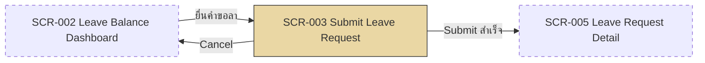

# SF-003 — Submit Leave Request

## 1. Overview

| รายการ | รายละเอียด |
| --- | --- |
| Function ID | SF-003 |
| Function Name | Submit Leave Request |
| Category | Screen |
| Screen Type | Create Form |
| Description | ฟอร์มยื่นคำขอลา — พนักงานเลือกประเภทลา, ช่วงวันที่, เหตุผล, แนบเอกสาร (conditional) ระบบ validate หลายขั้นตอนก่อนบันทึกและ trigger notification |
| Actor / User Role | พนักงานประจำ (Employee), Outsource |
| Related Requirement IDs | SFR-003, VR-001–VR-007, VR-011, SCR-003 |
| Source Reference | Screen SRS §2.3 (SF-003), SRS §4.1 SFR-003, BRD BR-003–BR-007, BR-011, QA-H2 |
| Version | 1.0 |
| Created By | screen-design-agent (2026-07-09) |
| Updated By | — |

## 2. Business Purpose

แทนที่ใบลากระดาษ — ลดขั้นตอนการยื่นลา ทำให้ข้อมูลคำขอครบถ้วนตั้งแต่ต้นทาง และบังคับกฎการลา (แจ้งล่วงหน้า, สิทธิ์คงเหลือ, ใบรับรองแพทย์, ข้อจำกัด Outsource/Probation) ด้วย validation อัตโนมัติ แทนการตรวจด้วยคนซึ่งผิดพลาดและล่าช้า เมื่อ submit สำเร็จระบบแจ้ง Manager และ HR ทันทีเพื่อเริ่ม approval flow (Source: Screen SRS §2.3.1, BRD BR-003–BR-007)

## 3. Screen Overview

| รายการ | รายละเอียด |
| --- | --- |
| Screen Name | Submit Leave Request (SCR-003) |
| Menu Path | Main Menu > Leave Balance Dashboard (SCR-002) > ปุ่ม "ยื่นคำขอลา" |
| Navigation Inbound | SCR-002 Leave Balance Dashboard (ปุ่ม "ยื่นคำขอลา") |
| Navigation Outbound | SCR-005 Leave Request Detail (หลัง submit สำเร็จ), SCR-002 (กด Cancel) |
| Preconditions | Login สำเร็จ (SF-001), employee มีสิทธิ์ลาอย่างน้อย 1 ประเภท |
| Postconditions | Leave Request ถูกสร้างด้วย Status = Pending (1), PendingDays ใน LeaveBalances ถูกหักไว้, Email แจ้ง Manager + HR ถูก publish |

### Related Screens

| Screen ID | Screen Name | Description |
| --- | --- | --- |
| SCR-002 | Leave Balance Dashboard | หน้าจอต้นทาง — แสดง balance และปุ่มยื่นคำขอลา |
| SCR-005 | Leave Request Detail | ปลายทางหลัง submit สำเร็จ — แสดงสถานะคำขอที่สร้าง |

### Screen Flow

```text
Main Menu
  └── SCR-002 Leave Balance Dashboard
        └── [ยื่นคำขอลา] → SCR-003 Submit Leave Request
              ├── [Submit สำเร็จ] → SCR-005 Leave Request Detail
              └── [Cancel + confirm] → SCR-002 Leave Balance Dashboard
```



## 4. Mockup / UI Layout

| รายการ | รายละเอียด |
| --- | --- |
| Mockup Reference | — (SRS ระบุว่าไม่มี mockup อ้างอิง — ASCII ด้านล่างเป็น Assumption ตาม Layout Description ใน SRS §2.3.3) |
| Layout Description | Form layout แนวตั้ง: Dropdown ประเภทลา, Date picker (from–to), จำนวนวันคำนวณอัตโนมัติ, toggle ลาครึ่งวัน (conditional), Textarea เหตุผล, File upload (conditional), ปุ่ม Submit / Cancel |

```text
+----------------------------------------------------------------------+
| [LOGO]  Leave Management System        User: [EMP_ID]  [EMP_NAME]   |
+----------------------------------------------------------------------+
| Menu >> Leave Balance >> Submit Leave Request                        |
+----------------------------------------------------------------------+
| ยื่นคำขอลา (Submit Leave Request)                                    |
|                                                                      |
| ประเภทการลา *      [ ลาพักผ่อนประจำปี            v ]                 |
|                    (คงเหลือ: 8 วัน)  <- hint จาก balance             |
|                                                                      |
| วันที่เริ่มลา *     [ 2026-07-01  📅 ]                               |
| วันที่สิ้นสุดลา *   [ 2026-07-03  📅 ]                               |
| จำนวนวัน           [ 3 ]  (read-only, นับวันทำการ)                   |
|                                                                      |
| [ ] ลาครึ่งวัน      ช่วงเวลา [ ครึ่งวันเช้า (AM) v ]                 |
|     (แสดงเมื่อ start_date = end_date)                                |
|                                                                      |
| เหตุผลการลา *      [                                        ]        |
|                    [                                        ]        |
|                                                                      |
| ใบรับรองแพทย์      [ Choose File ]  (แสดงเมื่อลาป่วย >= 3 วัน)       |
|                                                                      |
|                              [ Submit ]   [ Cancel ]                 |
+----------------------------------------------------------------------+
```

## 5. Fields Definition

### 5.1 Input Section

| No | Field Name | Label (TH/EN) | Type | Length | Required | Default | Validation | DB Mapping (LeaveRequests) | Description |
| :---: | --- | --- | --- | --- | --- | --- | --- | --- | --- |
| 1 | leave_type_id | ประเภทการลา / Leave Type | Dropdown | — | Y | — | แสดงเฉพาะประเภทที่ employee_type มีสิทธิ์ (VR-001) | `LeaveTypeId` (TINYINT) | โหลดจาก LeaveTypes ตามสิทธิ์ของ employee พร้อม hint balance คงเหลือ |
| 2 | start_date | วันที่เริ่มลา / Start Date | Date Picker | — | Y | — | ลาพักผ่อน: ≥ วันพรุ่งนี้ (VR-005), ลากิจ: ≥ วันทำการถัดไป 3 วัน (VR-006), ลาป่วย: ≥ วันนี้ (BR-005) | `StartDate` (DATE) | วันเริ่มต้นการลา |
| 3 | end_date | วันที่สิ้นสุดลา / End Date | Date Picker | — | Y | = start_date | ≥ start_date (CK_LeaveRequests_DateRange) | `EndDate` (DATE) | วันสุดท้ายของการลา |
| 4 | total_days | จำนวนวัน / Total Days | Number (read-only) | — | Y (auto) | — | คำนวณอัตโนมัติ นับเฉพาะวันทำการ — 0.5 เมื่อลาครึ่งวัน | `DurationDays` (DECIMAL(10,2)) | ระบบคำนวณ ผู้ใช้แก้ไม่ได้ |
| 5 | is_half_day | ลาครึ่งวัน / Half Day | Checkbox / Toggle | — | N | unchecked | เลือกได้เฉพาะเมื่อ start_date = end_date | `IsHalfDay` (BIT) | เปิดใช้ field half_day_period |
| 6 | half_day_period | ช่วงเวลาลาครึ่งวัน / Half-Day Period | Dropdown (ครึ่งวันเช้า AM / ครึ่งวันบ่าย PM) | 10 | Conditional | — | บังคับเมื่อ is_half_day = checked — ซ่อนเมื่อลามากกว่า 1 วัน | `HalfDayPeriod` (NVARCHAR(10): 'AM'/'PM') | ระบุช่วงเวลาสำหรับการลาครึ่งวัน (SRS v1.1) |
| 7 | reason | เหตุผลการลา / Reason | Textarea | 400 | Y | — | — | `Reason` (NVARCHAR(MAX)) | เหตุผลการขอลา |
| 8 | medical_certificate | ใบรับรองแพทย์ / Medical Certificate | File Upload (PDF/JPG/PNG) | — | Conditional | — | บังคับเมื่อ leave_type = ลาป่วย AND total_days ≥ 3 วันทำการ (VR-007), FileType IN (PDF, JPG, PNG) | ตาราง `Attachments` (FileName, StoragePath, FileType, FileSizeBytes) | อัปโหลดก่อน submit ได้ (pre-upload — LeaveRequestId ผูกภายหลัง) |

## 6. Commands / Actions

| No | Command | Type | Default State | Trigger Condition | System Response |
| :---: | --- | --- | --- | --- | --- |
| 1 | Submit | Button | Enable | ทุก required field กรอกครบ + validation ผ่านทั้งหมด | เรียก `ILeaveRequestService.SubmitLeaveRequestAsync()` → บันทึก LeaveRequest (Status=Pending) + หัก PendingDays → publish Email แจ้ง Manager+HR → redirect SCR-005 |
| 2 | Cancel | Button | Enable | คลิกปุ่ม Cancel | แสดง confirm dialog → ถ้า confirm: กลับ SCR-002 โดยไม่บันทึก |

## 7. Screen Behavior

### 7.1 Initial Screen (onLoad)

- โหลด dropdown ประเภทลาเฉพาะประเภทที่ employee_type มีสิทธิ์ (VR-001, BR-011 — Outsource ไม่เห็น 4 ประเภทที่ไม่มีสิทธิ์) — อ้างอิง method signature: filter ตาม employee type (SFR-003)
- แสดง balance คงเหลือของแต่ละประเภทเป็น hint ใต้ dropdown
- end_date default = start_date, total_days ว่าง, half_day_period และ medical_certificate ซ่อนอยู่

### 7.2 เปลี่ยน leave_type (onChange)

- ตรวจ eligibility: probation (VR-003), อายุงาน < 1 ปีสำหรับลาพักผ่อน (VR-004), Outsource restriction (VR-001)
- อัปเดตกฎ validation ของ start_date ตามประเภทลา (advance notice)
- ซ่อน/แสดง field medical_certificate ตามเงื่อนไข VR-007

### 7.3 เปลี่ยน start_date / end_date (onChange)

- คำนวณ total_days อัตโนมัติ — นับเฉพาะวันทำการ (ไม่รวมวันหยุด — ดู Assumption)
- ตรวจ advance notice rule ตามประเภทลา (VR-005/VR-006)
- ถ้า start_date = end_date: แสดง option "ลาครึ่งวัน"
- ถ้า start_date ≠ end_date: ซ่อน half_day_period อัตโนมัติและล้างค่าที่เลือกไว้, is_half_day = unchecked

### 7.4 เลือก / ยกเลิก "ลาครึ่งวัน" (toggle)

- เลือก (เมื่อ start_date = end_date): แสดง `half_day_period` เป็น required, total_days = 0.5
- ยกเลิก: ซ่อน `half_day_period`, total_days = คำนวณปกติ (1 วัน)

### 7.5 total_days ≥ 3 และ leave_type = ลาป่วย

- แสดง field medical_certificate พร้อม label "บังคับแนบ" (VR-007)

### 7.6 Click "Submit"

#### 7.6.1 Validation (ตามลำดับใน `SubmitLeaveRequestAsync` — method signature §4.4)

| ลำดับ | Validation | Requirement | Error Message |
| :---: | --- | --- | --- |
| 1 | employeeId มีอยู่ + IsActive = true | — | System error |
| 2 | leaveTypeId ถูกต้อง + ไม่ถูกลบ | — | System error |
| 3 | Outsource มีสิทธิ์ประเภทลานี้ | VR-001 | ERR-LR-001 |
| 4 | ไม่อยู่ใน probation < 3 เดือน (ลาพักผ่อน) | VR-003 | ERR-LR-003 |
| 5 | อายุงาน ≥ 1 ปี (ลาพักผ่อน) | VR-004 | ERR-LR-004 |
| 6 | ลาพักผ่อนแจ้งล่วงหน้า ≥ 1 วัน | VR-005 | ERR-LR-005 |
| 7 | ลากิจแจ้งล่วงหน้า ≥ 3 วันทำการ | VR-006 | ERR-LR-006 |
| 8 | ลาป่วย ≥ 3 วันทำการ ต้องมีใบรับรองแพทย์ | VR-007 | ERR-LR-007 |
| 9 | Balance เพียงพอ: Remaining ≥ DurationDays (ยกเว้นลาป่วย) | VR-002, VR-011 | ERR-LR-002 / ERR-LR-008 |
| 10 | ไม่ overlap กับคำขอ Pending/Approved อื่นของตนเอง | Date conflict (ดู Assumption) | ERR-SF003-001 |

- Validation ไม่ผ่าน: ไม่บันทึก, highlight field ที่ผิด, แสดง error message ตามตาราง

#### 7.6.2 Insert / Update (DB Transaction — NFR-010)

```text
BEGIN TRANSACTION
  INSERT LeaveRequests
    (LeaveRequestRef = "LR-YYYY-NNNNN", EmployeeId, LeaveTypeId, StartDate, EndDate,
     DurationDays, IsHalfDay, HalfDayPeriod, Reason, Status = 1 (Pending),
     CreatedAt = Current UTC Datetime, CreatedBy = Session Login User ID)
  UPDATE LeaveBalances SET PendingDays += DurationDays
    WHERE EmployeeId = @EmployeeId AND LeaveTypeId = @LeaveTypeId AND LeaveYear = @Year
  UPDATE Attachments SET LeaveRequestId = @NewLeaveRequestId  -- ผูกไฟล์ pre-upload (ถ้ามี)
COMMIT

AFTER COMMIT: INotificationService.PublishLeaveSubmittedAsync()
  → CloudEvent "com.abccompany.leave.request.submitted" → Email Manager + HR
```

- สำเร็จ: แสดง SUC-LR-001 แล้ว redirect ไป SCR-005 Leave Request Detail

### 7.7 Click "Cancel"

- แสดง confirm dialog "ยกเลิกการกรอกคำขอลา?" → confirm: กลับ SCR-002 โดยไม่บันทึก / dismiss: อยู่หน้าเดิม

## 8. Business Rules

| Rule ID | Business Rule | Impact | Source Reference |
| --- | --- | --- | --- |
| BR-SF003-001 | ลาพักผ่อนต้องแจ้งล่วงหน้า ≥ 1 วัน | VR-005: block submit หาก start_date ≤ วันนี้ | BRD BR-003, QA-H2 |
| BR-SF003-002 | ลากิจต้องแจ้งล่วงหน้า ≥ 3 วันทำการ | VR-006: block submit หาก start_date < วันทำการที่ 4 นับจากวันนี้ | BRD BR-004 |
| BR-SF003-003 | ลาป่วยฉุกเฉินไม่ต้องแจ้งล่วงหน้า | ลาป่วย: ไม่มี advance notice validation | BRD BR-005 |
| BR-SF003-004 | ลาป่วย ≥ 3 วันทำการต่อเนื่อง ต้องแนบใบรับรองแพทย์ | VR-007: medical_certificate เป็น required | BRD BR-006 |
| BR-SF003-005 | Probation < 3 เดือน ไม่มีสิทธิ์ลาพักผ่อน | VR-003: block submit | BRD BR-007, M2 (QA v3) |
| BR-SF003-006 | Outsource ไม่มีสิทธิ์ลา 4 ประเภท | VR-001: ซ่อน dropdown option + block ฝั่ง server | BRD BR-011, R2 (QA v2) |
| BR-SF003-007 | Balance check ยกเว้นลาป่วย | VR-002: ลาป่วยไม่ตรวจ balance ตอน submit | Method signature §4.4 (validation ข้อ 9) |
| BR-SF003-008 | Submit + หัก PendingDays ต้อง atomic | NFR-010: อยู่ใน DB transaction เดียวกัน | Method signature §4.4, Data Architecture |

```text
เลือกประเภทลา
│
├── ลาพักผ่อน
│   ├── probation < 3 เดือน → ERR-LR-003 (block)
│   ├── อายุงาน < 1 ปี → ERR-LR-004 (block)
│   └── start_date ≤ วันนี้ → ERR-LR-005 (block)
│
├── ลากิจ
│   └── start_date < วันทำการที่ 4 → ERR-LR-006 (block)
│
└── ลาป่วย (ไม่ตรวจ advance notice, ไม่ตรวจ balance)
    └── total_days ≥ 3 วันทำการ AND ไม่มีไฟล์แนบ → ERR-LR-007 (block)
```

## 9. Message List

### Error Messages

| Message ID | Trigger | Message (TH) | Message (EN) |
| --- | --- | --- | --- |
| ERR-LR-001 | ประเภทลาที่ Outsource ไม่มีสิทธิ์ (VR-001) | ไม่มีสิทธิ์ลาประเภทนี้ กรุณาติดต่อบริษัทต้นสังกัด | You are not eligible for this leave type. Please contact your staffing agency. |
| ERR-LR-002 | สิทธิ์วันลาไม่เพียงพอ (VR-002) | สิทธิ์วันลาไม่เพียงพอ คงเหลือ {X} วัน | Insufficient leave balance. You have {X} days remaining. |
| ERR-LR-003 | อยู่ในช่วงทดลองงาน (VR-003) | ยังอยู่ในช่วงทดลองงาน ไม่มีสิทธิ์ลาพักผ่อน | You are in the probation period and not eligible for annual leave. |
| ERR-LR-004 | อายุงานไม่ถึง 1 ปี (VR-004) | อายุงานยังไม่ครบ 1 ปี ไม่มีสิทธิ์ลาพักผ่อนประจำปี | Your service period has not reached 1 year. Annual leave is not available yet. |
| ERR-LR-005 | ลาพักผ่อนไม่ได้แจ้งล่วงหน้า 1 วัน (VR-005) | ลาพักผ่อนต้องแจ้งล่วงหน้าอย่างน้อย 1 วัน | Annual leave requires at least 1 day advance notice. |
| ERR-LR-006 | ลากิจไม่ได้แจ้งล่วงหน้า 3 วันทำการ (VR-006) | ลากิจต้องแจ้งล่วงหน้าอย่างน้อย 3 วันทำการ | Personal leave requires at least 3 working days advance notice. |
| ERR-LR-007 | ลาป่วย ≥ 3 วัน ไม่มีใบรับรองแพทย์ (VR-007) | กรุณาแนบใบรับรองแพทย์สำหรับการลาป่วย 3 วันขึ้นไป | A medical certificate is required for sick leave of 3 or more consecutive working days. |
| ERR-LR-008 | ใช้สิทธิ์ครบ quota แล้ว (VR-011) | ใช้สิทธิ์ {ประเภทลา} ครบแล้ว ({X} วัน/ปี) สิทธิ์คงเหลือ 0 วัน | {Leave type} quota is exhausted ({X} days/year). No remaining balance. |
| ERR-SF003-001 | วันที่ลา overlap กับคำขอ Pending/Approved เดิม (DateConflictException) | ช่วงวันที่ลาซ้ำซ้อนกับคำขอลาที่มีอยู่ | The selected dates overlap with an existing leave request. |

### Success / Info Messages

| Message ID | Trigger | Message (TH) | Message (EN) |
| --- | --- | --- | --- |
| SUC-LR-001 | Submit สำเร็จ | ยื่นคำขอลาสำเร็จ อยู่ระหว่างรอการอนุมัติ | Leave request submitted successfully. Awaiting approval. |
| INF-SF003-001 | บันทึกสำเร็จแต่ Email แจ้ง Manager ส่งไม่สำเร็จ (queue retry) | บันทึกคำขอสำเร็จ — อาจมีความล่าช้าในการแจ้งหัวหน้างาน | Request saved — manager notification may be delayed. |

## 10. Popup / Sub-screen Definition

### 10.1 Cancel Confirmation Dialog

| No | Field Name | Label | Data Source | Description |
| :---: | --- | --- | --- | --- |
| 1 | confirm_message | "ยกเลิกการกรอกคำขอลา? ข้อมูลที่กรอกจะไม่ถูกบันทึก" | Static | ข้อความยืนยัน |
| 2 | confirm_button | ยืนยัน | — | กลับ SCR-002 โดยไม่บันทึก |
| 3 | dismiss_button | กลับไปกรอกต่อ | — | ปิด dialog อยู่หน้าเดิม |

## 11. Database Tables Reference

| Table Name | Alias | Description |
| --- | --- | --- |
| LeaveRequests | — | INSERT คำขอลาใหม่ Status=1 (Pending) — entity หลัก |
| LeaveBalances | — | UPDATE PendingDays += DurationDays (transaction เดียวกับ INSERT) |
| LeaveTypes | — | Master ประเภทลา — โหลด dropdown + flag IsAvailableForOutsource, RequiresMedicalCert |
| Employees | — | ตรวจ IsActive, EmployeeType, probation, อายุงาน |
| Attachments | — | เก็บไฟล์ใบรับรองแพทย์ (pre-upload แล้วผูก LeaveRequestId หลัง submit) |
| NotificationLogs | — | Immutable log ของ Email แจ้ง Manager/HR (เขียนโดย Notification service หลัง commit) |

## 12. Exception Handling

| Error Case | Trigger Condition | System Behavior | User Message | Recovery |
| --- | --- | --- | --- | --- |
| Validation error | Validation ข้อใดข้อหนึ่งไม่ผ่าน (§7.6.1) | ไม่บันทึก, highlight field ที่ผิด | ERR-LR-001 ถึง ERR-LR-008, ERR-SF003-001 ตามกรณี | แก้ไข field แล้ว submit ใหม่ |
| Integration error | Email แจ้ง Manager ส่งไม่สำเร็จ | บันทึก Request สำเร็จแล้ว, queue retry Email อัตโนมัติ | INF-SF003-001 | ระบบ retry อัตโนมัติ — ผู้ใช้ไม่ต้องทำอะไร |
| System error | ระบบล่มขณะ submit / transaction rollback | ไม่บันทึก (rollback ทั้ง INSERT และ PendingDays) | "เกิดข้อผิดพลาด กรุณาลองใหม่" | Submit ใหม่ |

## 13. Notes / Assumptions

| ประเภท | รายละเอียด | ผลกระทบ |
| --- | --- | --- |
| Open Issue (จาก SRS) | Max file size ของใบรับรองแพทย์ยังไม่ยืนยัน | กระทบ VR-007, IF-004 — ต้อง confirm ก่อน implement upload |
| Assumption (จาก SRS) | total_days นับวันทำการ ไม่รวมวันหยุดราชการ/บริษัท | ต้องมี holiday calendar ในระบบ |
| Assumption (เอกสารนี้) | ASCII mockup ใน §4 สร้างจาก Layout Description ใน SRS — ยังไม่มี mockup ทางการ | ต้องให้ UX/Business review ก่อนถือเป็น final layout |
| Assumption (เอกสารนี้) | Date conflict check (validation ข้อ 10) มาจาก method signature §4.4 — ไม่มี VR ใน SRS รองรับ | ERR-SF003-001 เป็น message ที่ตั้งใหม่ ต้อง confirm ข้อความกับ Business |
| Assumption (เอกสารนี้) | LeaveRequestRef format "LR-YYYY-NNNNN" ตามตัวอย่างใน Data Architecture (LR-2026-00001) — วิธี run เลขยังไม่ระบุ | ต้องกำหนด sequence generation ตอน implement |
| Note | ILeaveRequestService.SubmitLeaveRequestAsync() คือ service method หลักของหน้านี้ (Method Signature §4.4) | ใช้เป็น contract ระหว่าง UI กับ backend |

## Change Log

| Version | Date | Author | Change Type | Description | Remark |
| --- | --- | --- | --- | --- | --- |
| 1.0 | 2026-07-09 | screen-design-agent (Claude) | Created | สร้างเอกสารครั้งแรกจาก Screen SRS v1.1 (§2.3 SF-003), Data Architecture Design, Method Signature §4.4 | Generated ตาม template 80-knowledge-base/functional-design/02-screen-functions |

### สรุปการเปลี่ยนแปลงสำคัญ

| ช่วง Version | การเปลี่ยนแปลง | ผลกระทบ |
| --- | --- | --- |
| 1.0 | Baseline แรก | — |
