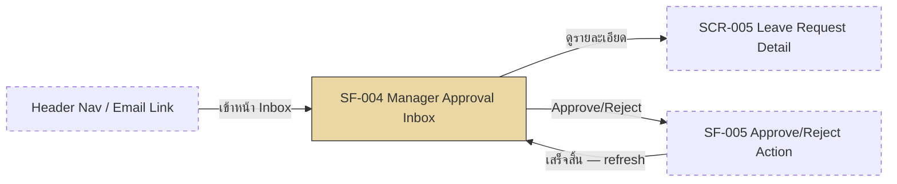

# SF-004 — Manager Approval Inbox

## 1. Overview

| รายการ | รายละเอียด |
| --- | --- |
| Function ID | SF-004 |
| Function Name | Manager Approval Inbox |
| Category | Screen |
| Screen Type | Approval Worklist |
| Description | Inbox แสดงรายการคำขอลาที่รอการอนุมัติของหัวหน้างาน (Line Manager) พร้อมข้อมูลประกอบการตัดสินใจ (ประวัติลา, สิทธิ์คงเหลือ) แบ่งเป็น 2 tab: รอดำเนินการ / ดำเนินการแล้ว ปุ่ม Approve/Reject บนหน้านี้เป็นจุดเริ่ม flow ของ SF-005 |
| Actor / User Role | หัวหน้างาน (Line Manager) |
| Related Requirement IDs | SFR-004, SFR-005 (navigation only — logic ดู SF-005), NFR-005, SCR-004 |
| Source Reference | Screen SRS §2.4 (SF-004), SRS §4.1 SFR-004/SFR-005, BRD BR-012, BR-013 |
| Version | 1.0 |
| Created By | screen-design-agent (2026-07-12) |
| Updated By | — |

## 2. Business Purpose

ให้หัวหน้างานเห็นคำขอลาที่รอการอนุมัติของทีมตนเองในที่เดียว พร้อม context ที่จำเป็น (ชื่อพนักงาน, ประเภทลา, ช่วงวันที่, สิทธิ์คงเหลือ ณ ขณะนั้น, วันที่ยื่น) เพื่อให้ตัดสินใจอนุมัติ/ปฏิเสธได้เร็วโดยไม่ต้องสลับไปเปิดหน้าอื่น ลดเวลาที่คำขอค้างอยู่ในสถานะ Pending และรองรับ Approval 1 ระดับ (Line Manager เท่านั้น) ตามนโยบายองค์กร (Source: Screen SRS §2.4.1, BRD BR-012)

## 3. Screen Overview

| รายการ | รายละเอียด |
| --- | --- |
| Screen Name | Manager Approval Inbox (SCR-004) |
| Menu Path | Main Menu > Approval Inbox (แสดงเฉพาะ role = Manager) |
| Navigation Inbound | Header Navigation (ทุกหน้าเมื่อ role = Manager), Email notification link (จาก Email แจ้งคำขอลาใหม่) |
| Navigation Outbound | คลิกรายการ/"ดูรายละเอียด" → SCR-005 Leave Request Detail; คลิก Approve/Reject → ดำเนินการตาม SF-005 (dialog/confirm อยู่บนหน้าเดียวกัน SCR-004) แล้ว refresh list |
| Preconditions | Login สำเร็จด้วย role Manager (SF-001), มี subordinate อย่างน้อย 1 คน (`Employees.ManagerId` ชี้มาที่ตนเอง) |
| Postconditions | แสดงรายการ Pending ของทีมครบถ้วน — เมื่อ Approve/Reject สำเร็จ (SF-005) list จะถูก refresh อัตโนมัติ ไม่มีการเปลี่ยนแปลง DB state จากหน้านี้โดยตรง (read-only list — action จริงอยู่ใน SF-005) |

### Related Screens

| Screen ID | Screen Name | Description |
| --- | --- | --- |
| SCR-005 | Leave Request Detail | ปลายทางเมื่อคลิกรายการ/"ดูรายละเอียด" — Approve/Reject ทำได้จากหน้านี้ด้วย (Screen SRS §2.4.6) |
| SCR-001 | Login Page | หน้าจอต้นทางกรณี session หมดอายุ |

### Screen Flow

```text
Header Navigation / Email Link
  └── SF-004 Manager Approval Inbox (SCR-004)
        ├── [ดูรายละเอียด] → SCR-005 Leave Request Detail
        ├── [Approve] → SF-005 Approve Action → refresh SCR-004
        └── [Reject] → SF-005 Reject Action (dialog) → refresh SCR-004
```



## 4. Mockup / UI Layout

| รายการ | รายละเอียด |
| --- | --- |
| Mockup Reference | — (Screen SRS §2.4.3 ระบุ "ไม่มีข้อมูลที่มากเพียงพอ หรือ mockup อ้างอิงในการสร้าง screen ตัวอย่าง" — ASCII ด้านล่างเป็น Assumption ตาม Tabs §2.4.4 + Fields §2.4.5) |
| Layout Description | Tab bar ด้านบน (รอดำเนินการ / ดำเนินการแล้ว) ตามด้วยตาราง list คำขอลา 1 row ต่อ 1 คำขอ พร้อมปุ่ม Approve/Reject ในแต่ละ row |

```text
+----------------------------------------------------------------------+
| [LOGO]  Leave Management System        User: [MGR_ID]  [MGR_NAME]   |
+----------------------------------------------------------------------+
| Menu >> Approval Inbox                                               |
+----------------------------------------------------------------------+
| [ รอดำเนินการ (3) ]   [ ดำเนินการแล้ว ]                              |
+----------------------------------------------------------------------+
| เลขคำขอ       | พนักงาน     | ประเภทลา  | วันที่ลา        | คงเหลือ | ยื่นเมื่อ         | สถานะ   | Action            |
| LR-2026-00123 | สมชาย ใจดี | ลาพักผ่อน | 1–3 ก.ค.(3วัน) | 7 วัน  | 2026-06-20 09:30 | Pending | [Approve][Reject] |
| LR-2026-00124 | สมหญิง ดี  | ลากิจ     | 5 ก.ค.(1วัน)    | 2 วัน  | 2026-06-21 14:10 | Pending | [Approve][Reject] |
+----------------------------------------------------------------------+
|                                                    < 1 2 3 ... >       |
+----------------------------------------------------------------------+
```

## 5. Fields Definition

### 5.1 Tab Control

| No | Field Name | Label (TH/EN) | Type | Length | Required | Default | Validation | DB Mapping | Description |
| :---: | --- | --- | --- | --- | --- | --- | --- | --- | --- |
| 1 | tab_selector | รอดำเนินการ / Pending — ดำเนินการแล้ว / Processed | Tab | — | Y | TAB-01 รอดำเนินการ | Manager เท่านั้นที่เข้าถึงหน้านี้ | ไม่มี column เดี่ยว — filter ผ่าน `LeaveRequests.Status` (Screen SRS §2.4.4) | สลับมุมมองระหว่างคำขอที่รอกับที่ดำเนินการแล้ว |

### 5.2 List View Columns (Pending / Processed — โครงสร้างคอลัมน์เดียวกัน)

| No | Field Name | Label (TH/EN) | Type | Length | Required | Default | Validation | DB Mapping | Description |
| :---: | --- | --- | --- | --- | --- | --- | --- | --- | --- |
| 1 | request_no | เลขคำขอ / Request No. | Text (read-only, link) | 30 | Y | — | — | `LeaveRequests.LeaveRequestRef` (NVARCHAR(30)) | คลิกเพื่อเปิด SCR-005 |
| 2 | employee_name | ชื่อพนักงาน / Employee | Text (read-only) | — | Y | — | แสดงเฉพาะ subordinate ของ Manager ที่ login (BR-012, NFR-005) | `Employees.FullNameTh` / `FullNameEn` (JOIN ผ่าน `LeaveRequests.EmployeeId`) | ชื่อผู้ยื่นคำขอ |
| 3 | leave_type | ประเภทการลา / Leave Type | Text (read-only) | — | Y | — | — | `LeaveTypes.TypeNameTh` / `TypeNameEn` (JOIN ผ่าน `LeaveRequests.LeaveTypeId`) | ประเภทการลาที่ขอ |
| 4 | leave_dates | วันที่ลา / Leave Dates | Date range (read-only) | — | Y | — | — | `LeaveRequests.StartDate`, `LeaveRequests.EndDate`, `DurationDays` (DATE, DATE, DECIMAL(10,2)) | ช่วงวันที่ลา + จำนวนวันในวงเล็บ |
| 5 | remaining_balance | สิทธิ์คงเหลือ / Balance | Number (วัน, read-only) | — | Y | — | คำนวณ ณ เวลาที่โหลด list — ดู Assumption §13 (ไม่อยู่ใน `LeaveRequestSummaryDto`) | `LeaveBalances.RemainingDays` (คำนวณจาก EntitledDays + CarriedForwardDays − UsedDays − PendingDays; WHERE EmployeeId, LeaveTypeId, LeaveYear ตรงกับคำขอ) | สิทธิ์คงเหลือของพนักงานประเภทลานั้น ณ ขณะนั้น |
| 6 | submitted_date | วันที่ยื่น / Submitted | Datetime (read-only) | — | Y | — | — | `LeaveRequests.CreatedAt` (DATETIME2(0)) | วัน-เวลาที่ยื่นคำขอ |
| 7 | status | สถานะ / Status | Badge (color-coded, read-only) | — | Y | — | — | `LeaveRequests.Status` (TINYINT: 1=Pending, 2=Approved, 3=Rejected, 4=Cancelled, 5=CancelRequested, 6=Escalated) | Pending tab แสดงเฉพาะ Status=1, Processed tab แสดง Status IN (2,3) (ดู Assumption §13) |

## 6. Commands / Actions

| No | Command | Type | Default State | Trigger Condition | System Response |
| :---: | --- | --- | --- | --- | --- |
| 1 | Approve | Button (บน row) | Enable | Status = Pending | เริ่ม flow SF-005 §7.1 (Approve Confirmation) — ไม่มี business logic ในหน้านี้ |
| 2 | Reject | Button (บน row) | Enable | Status = Pending | เริ่ม flow SF-005 §7.2 (Reject Dialog) — ไม่มี business logic ในหน้านี้ |
| 3 | ดูรายละเอียด | Link (row click / ไอคอน) | Enable | ทุก row | Navigate ไป SCR-005 Leave Request Detail — เรียก `ILeaveRequestService.GetLeaveRequestDetailAsync()` |
| 4 | สลับ Tab (รอดำเนินการ / ดำเนินการแล้ว) | Tab | Enable | คลิก tab | โหลด list ใหม่ตาม tab ที่เลือก (§7.2) |
| 5 | เปลี่ยนหน้า (Pagination) | Pager | Enable | มีมากกว่า 1 หน้า | เรียก service เดิมพร้อม `PaginationDto.PageNumber` ใหม่ (default PageSize=20) |

## 7. Screen Behavior

### 7.1 Initial Screen (onLoad)

- Default tab = "รอดำเนินการ" (TAB-01) — เรียก `ILeaveRequestService.GetPendingApprovalsForManagerAsync(managerId, pagination)` กรอง `Status = Pending` ของ subordinates ทั้งหมด (`Employees.ManagerId = managerId`) (Screen SRS §2.4.7, SFR-004, Method Signature §4.4)
- RBAC enforce ที่ Backend: query filter ด้วย `ManagerId` เสมอ — Manager เห็นเฉพาะทีมตนเอง ไม่สามารถเห็นคำขอของทีมอื่น (NFR-005, BR-012)
- แสดงจำนวนรายการ Pending เป็น badge บน tab (ตาม ASCII §4)
- Performance: query ผ่าน index ที่รองรับ `Employee.ManagerId` join + `Status` filter (ดู Method Signature §3.3 `GetPendingByManagerAsync`)

### 7.2 สลับ Tab "ดำเนินการแล้ว" (onClick)

- โหลดรายการคำขอที่ Status IN (Approved, Rejected) ของทีมตนเอง — ดู Assumption §13 เรื่อง service method ที่ยังไม่ระบุชัดเจนสำหรับ tab นี้
- คอลัมน์เหมือน Pending tab (§5.2) — ไม่มีปุ่ม Approve/Reject (แสดงเฉพาะ "ดูรายละเอียด")

### 7.3 Click "ดูรายละเอียด" / คลิก row

- Navigate ไป SCR-005 Leave Request Detail ของคำขอนั้น พร้อม Attachments และ ApprovalHistory (Method Signature §4.4 `GetLeaveRequestDetailAsync`)

### 7.4 Click "Approve" (บน row)

- Trigger SF-005 §7.1 Approve Confirmation — validation และ transaction ทั้งหมดอยู่ใน SF-005 (ไม่ทำซ้ำในเอกสารนี้)
- เมื่อ SF-005 สำเร็จ: refresh list (row หายจาก Pending tab)

### 7.5 Click "Reject" (บน row)

- Trigger SF-005 §7.2 Reject Dialog — validation และ transaction ทั้งหมดอยู่ใน SF-005 (ไม่ทำซ้ำในเอกสารนี้)
- เมื่อ SF-005 สำเร็จ: refresh list (row หายจาก Pending tab)

## 8. Business Rules

| Rule ID | Business Rule | Impact | Source Reference |
| --- | --- | --- | --- |
| BR-SF004-001 | Approval 1 ระดับ — เฉพาะ Line Manager ของพนักงานเท่านั้นที่เห็น/อนุมัติคำขอได้ | Query filter `Employees.ManagerId = managerId` บังคับที่ Backend (RBAC) | BRD BR-012, QA-H5 |
| BR-SF004-002 | Manager เห็นเฉพาะคำขอของทีมตนเอง ไม่เห็นข้อมูลพนักงานนอกทีม | NFR-005 RBAC enforce ที่ Backend เท่านั้น (ไม่ใช่ Frontend filter อย่างเดียว) | NFR-005, BRD §4 Actor (Manager) |
| BR-SF004-003 | Pending tab แสดงเฉพาะ Status=Pending, Processed tab แสดง Approved/Rejected | ควบคุมด้วย tab selector — ไม่แสดง Cancelled/CancelRequested/Escalated ใน inbox นี้ (อยู่ใน scope SF-007–SF-010) | Screen SRS §2.4.4, Data Architecture LeaveStatus Lookup |

## 9. Message List

### Error Messages

| Message ID | Trigger | Message (TH) | Message (EN) |
| --- | --- | --- | --- |
| ERR-SF004-001 | โหลดรายการ Pending/Processed ไม่สำเร็จ (Integration/System error) | ไม่สามารถโหลดรายการคำขอลาได้ กรุณา refresh | Unable to load the approval list. Please refresh the page. |

### Success / Info Messages

— ไม่มี (หน้านี้เป็น read-only list — ข้อความสำเร็จของการ Approve/Reject อยู่ใน SF-005 §9 ตาม SUC-APR-001/SUC-APR-002)

## 10. Popup / Sub-screen Definition

— ไม่มี (Reject Reason Dialog และ Approve Confirmation Dialog เป็นส่วนหนึ่งของ SF-005 — ดู SF-005 §10)

## 11. Database Tables Reference

| Table Name | Alias | Description |
| --- | --- | --- |
| LeaveRequests | — | SELECT รายการคำขอของ subordinates: `WHERE Employee.ManagerId = @ManagerId AND Status = 1 (Pending tab)` หรือ `Status IN (2,3) (Processed tab)` (index `IX_LeaveRequests_EmployeeId_Status`) — ไม่มี INSERT/UPDATE จากหน้านี้ |
| Employees | — | JOIN แสดงชื่อพนักงาน (`FullNameTh`/`FullNameEn`) + ใช้ `ManagerId` เป็นเงื่อนไข RBAC หลัก |
| LeaveTypes | — | JOIN แสดงชื่อประเภทการลา (`TypeNameTh`/`TypeNameEn`) |
| LeaveBalances | — | SELECT `RemainingDays` (คำนวณ) ของพนักงาน+ประเภทลา+ปีที่เกี่ยวข้อง เพื่อแสดงคอลัมน์ "สิทธิ์คงเหลือ" |

## 12. Exception Handling

| Error Case | Trigger Condition | System Behavior | User Message | Recovery |
| --- | --- | --- | --- | --- |
| Validation error | Session หมดอายุ (JWT expired + refresh ไม่ได้) | Redirect กลับ SCR-001 | INF-LGN-001 (ตาม SF-001) | Login ใหม่ |
| Integration error | โหลดรายการล้มเหลว (API/DB error) | แสดง error banner แทนตาราง — ไม่ crash ทั้งหน้า | ERR-SF004-001 | Refresh หน้า |
| System error | Backend API ล่ม (HTTP 5xx) | แสดง error banner ตาม global error handling | "เกิดข้อผิดพลาด กรุณาลองใหม่" | รอและ refresh |
| Concurrent modification | Manager คนอื่น Approve/Reject คำขอเดียวกันไปแล้วก่อนที่ list จะ refresh | เกิดขึ้นตอนคลิก Approve/Reject จริง — รายละเอียดเต็มอยู่ใน SF-005 §12 | ดู SF-005 (ERR-SF005-001) | Refresh list (row จะหายไปเอง) |

## 13. Notes / Assumptions

| ประเภท | รายละเอียด | ผลกระทบ |
| --- | --- | --- |
| Assumption (จาก SRS) | Screen SRS §2.4.3 ไม่มี mockup อ้างอิง — ASCII ใน §4 สร้างจาก Tabs (§2.4.4) + Fields (§2.4.5) เอง | ต้องให้ UX/Business review ก่อนถือเป็น final layout |
| Assumption (เอกสารนี้) | `LeaveRequestSummaryDto` (Method Signature §2.2) ไม่มี field `EmployeeName` และ `RemainingBalance` แต่ SRS Fields Definition (§2.4.5) ต้องแสดงทั้งสองค่านี้ — เอกสารนี้สมมติว่าต้องมี DTO ที่ extend เพิ่ม (เช่น `ManagerApprovalItemDto`) หรือ view/JOIN เพิ่มเติมที่ backend | ต้อง confirm กับทีม Backend/Architect ว่าจะขยาย DTO เดิมหรือสร้างใหม่ — กระทบ `GetPendingApprovalsForManagerAsync()` return type |
| Assumption (เอกสารนี้) | Tab "ดำเนินการแล้ว" (Processed) ไม่มี service method รองรับใน Method Signature §4.4 (มีเฉพาะ `GetPendingApprovalsForManagerAsync` ซึ่ง filter เฉพาะ Pending) — เอกสารนี้สมมติว่าต้องเพิ่ม parameter `status filter` หรือ method ใหม่ `GetProcessedApprovalsForManagerAsync()` | ต้อง confirm กับทีม Backend ก่อน implement — เป็น gap ระหว่าง Screen SRS กับ Method Signature |
| Assumption (เอกสารนี้) | ASCII mockup แสดง column "Action" (Approve/Reject) เฉพาะ Pending tab — Processed tab ไม่มีปุ่ม action (มีแต่ "ดูรายละเอียด") | ต้อง confirm กับ UX ว่า Processed tab ต้องการปุ่มอื่นเพิ่มหรือไม่ (เช่น ปุ่มดู reason) |
| Note | Field/Business logic ของปุ่ม Approve และ Reject (validation, transaction, message, popup) อยู่ในเอกสาร SF-005 ทั้งหมด — เอกสารนี้ครอบคลุมเฉพาะ list/filter/navigation ของ Inbox | ใช้คู่กับ SF-005 เสมอ — ทั้งสองเอกสารอ้างอิง SCR-004 เดียวกัน |

## Change Log

| Version | Date | Author | Change Type | Description | Remark |
| --- | --- | --- | --- | --- | --- |
| 1.0 | 2026-07-12 | screen-design-agent (Claude) | Created | สร้างเอกสารครั้งแรกจาก Screen SRS v1.0 (§2.4 SF-004), Data Architecture Design (LeaveRequests/Employees/LeaveTypes/LeaveBalances DDL), Method Signature §4.4 (`GetPendingApprovalsForManagerAsync`, `GetLeaveRequestDetailAsync`, `LeaveRequestSummaryDto`) | Generated ตาม template screen-design-agent — คู่กับ SF-005 (SCR-004 เดียวกัน) |

### สรุปการเปลี่ยนแปลงสำคัญ

| ช่วง Version | การเปลี่ยนแปลง | ผลกระทบ |
| --- | --- | --- |
| 1.0 | Baseline แรก | — |
