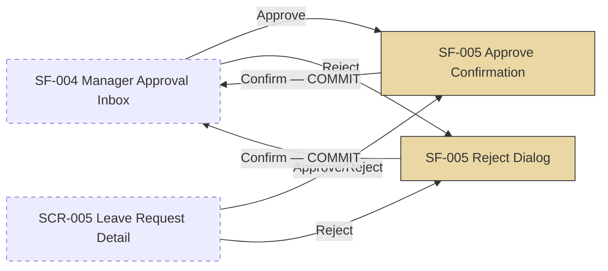

# SF-005 — Approve / Reject Action

## 1. Overview

| รายการ | รายละเอียด |
| --- | --- |
| Function ID | SF-005 |
| Function Name | Approve / Reject Action |
| Category | Screen |
| Screen Type | Approval Worklist |
| Description | Action ที่ Manager ใช้ตัดสินใจคำขอลา — Approve ทันที (พร้อม confirm) หรือ Reject ผ่าน dialog ที่กรอกเหตุผลได้ (optional) ทำงานอยู่บนหน้าเดียวกับ SF-004 Manager Approval Inbox (SCR-004) หรือจาก SCR-005 Leave Request Detail |
| Actor / User Role | หัวหน้างาน (Line Manager) |
| Related Requirement IDs | SFR-005, VR-010, BRD BR-012, BR-013 |
| Source Reference | Screen SRS §2.5 (SF-005 — รวมเนื้อหาไว้ที่ §2.4 SF-004), SRS §4.1 SFR-005, BRD BR-012, BR-013, BRD §5.3.1.B UC-08 |
| Version | 1.0 |
| Created By | screen-design-agent (2026-07-12) |
| Updated By | — |

## 2. Business Purpose

ให้หัวหน้างานอนุมัติหรือปฏิเสธคำขอลาได้ทันทีจาก Inbox โดยไม่ต้องเปิดหน้าจอแยก — Approve จะโอนวันลาจาก "รอดำเนินการ" ไปเป็น "ใช้ไปแล้ว" และ Reject จะคืนวันลาที่กันไว้กลับคืนทันที พร้อมให้ระบุเหตุผล (optional) เพื่อสื่อสารกับพนักงาน รองรับ Approval 1 ระดับตามนโยบายองค์กร และป้องกันการอนุมัติซ้ำซ้อนเมื่อมีการดำเนินการพร้อมกัน (Source: Screen SRS §2.4.9 BR-012/BR-013, BRD §5.3.1.B UC-08)

## 3. Screen Overview

| รายการ | รายละเอียด |
| --- | --- |
| Screen Name | Approve / Reject Action (ฝังอยู่ใน SCR-004 Manager Approval Inbox) |
| Menu Path | เข้าถึงผ่านปุ่ม Approve/Reject บน SF-004 (แถวในตาราง) หรือปุ่มเดียวกันในหน้า SCR-005 Leave Request Detail (Screen SRS §2.4.6) |
| Navigation Inbound | SF-004 Manager Approval Inbox (ปุ่ม Approve/Reject บน row), SCR-005 Leave Request Detail (ปุ่ม Approve/Reject) |
| Navigation Outbound | สำเร็จ: อยู่หน้าเดิม (SCR-004 หรือ SCR-005) พร้อม list/detail ที่ refresh แล้ว; ยกเลิก (Reject dialog dismiss): อยู่หน้าเดิมไม่มีการเปลี่ยนแปลง |
| Preconditions | Login เป็น Manager ของพนักงานเจ้าของคำขอ, คำขอลามีสถานะ Pending |
| Postconditions | Approve: `LeaveRequests.Status = Approved`, `LeaveBalances.UsedDays += DurationDays`, `PendingDays -= DurationDays`, บันทึก `ApprovalHistories` (Action=Approved), ส่ง Email แจ้งพนักงาน+HR / Reject: `Status = Rejected`, `PendingDays -= DurationDays` (คืนกลับ ไม่กระทบ UsedDays), บันทึก `ApprovalHistories` (Action=Rejected), ส่ง Email แจ้งพนักงาน+HR |

### Related Screens

| Screen ID | Screen Name | Description |
| --- | --- | --- |
| SCR-004 | Manager Approval Inbox (SF-004) | หน้าหลักที่ action นี้ทำงานอยู่ — list/filter ดูเอกสาร SF-004 |
| SCR-005 | Leave Request Detail | ทางเข้าอีกทางของ action นี้ (ปุ่ม Approve/Reject ในหน้า Detail — SFR-005) |

### Screen Flow

```text
SF-004 Manager Approval Inbox (SCR-004) หรือ SCR-005 Leave Request Detail
  ├── [Approve] → SF-005 Approve Confirmation → COMMIT → กลับหน้าเดิม (refresh)
  └── [Reject] → SF-005 Reject Dialog (เหตุผล optional) → COMMIT → กลับหน้าเดิม (refresh)
```



## 4. Mockup / UI Layout

| รายการ | รายละเอียด |
| --- | --- |
| Mockup Reference | — (Screen SRS §2.4.3 ระบุว่าไม่มี mockup อ้างอิง — ASCII ด้านล่างเป็น Assumption ตาม Commands/Actions §2.4.6 และ Message List §2.4.8) |
| Layout Description | Approve = confirm dialog สั้น (ไม่มี field กรอก); Reject = dialog ที่มี textarea เหตุผล (optional) พร้อมปุ่ม Confirm/Cancel |

```text
Approve Confirmation:
+--------------------------------------------------+
| ยืนยันอนุมัติคำขอลา                                |
|                                                    |
| อนุมัติคำขอลาของ "สมชาย ใจดี" (LR-2026-00123)       |
| ประเภท: ลาพักผ่อนประจำปี  วันที่: 1–3 ก.ค. 2026 (3 วัน) |
|                                                    |
|                        [ ยืนยันอนุมัติ ]  [ ยกเลิก ] |
+--------------------------------------------------+

Reject Dialog:
+--------------------------------------------------+
| ปฏิเสธคำขอลา                                       |
|                                                    |
| ปฏิเสธคำขอลาของ "สมชาย ใจดี" (LR-2026-00123)         |
| เหตุผล (ไม่บังคับ)                                   |
| [                                              ]  |
| [                                              ]  |
|                                                    |
|                        [ ยืนยันปฏิเสธ ]   [ ยกเลิก ] |
+--------------------------------------------------+
```

## 5. Fields Definition

### 5.1 Approve Confirmation Dialog (Display Only)

| No | Field Name | Label (TH/EN) | Type | Length | Required | Default | Validation | DB Mapping | Description |
| :---: | --- | --- | --- | --- | --- | --- | --- | --- | --- |
| 1 | employee_name | ชื่อพนักงาน / Employee | Text (read-only) | — | Y | — | — | `Employees.FullNameTh`/`FullNameEn` | แสดงยืนยันว่ากำลังอนุมัติของใคร |
| 2 | request_no | เลขคำขอ / Request No. | Text (read-only) | — | Y | — | — | `LeaveRequests.LeaveRequestRef` | อ้างอิงคำขอที่กำลังดำเนินการ |
| 3 | approve_reason | เหตุผล (Manager) / Approval Note | Textarea (read-only ใน UI — ไม่เปิดใช้) | — | N | — | ไม่แสดงใน UI ปัจจุบัน (ดู Assumption §13) | `ApprovalHistories.Reason` (NVARCHAR(MAX)) | Method Signature §4.5 เปิด parameter `reason` (optional) ใน `ApproveLeaveRequestAsync()` แต่ SRS ไม่ระบุ field ให้กรอกตอน Approve |

### 5.2 Reject Dialog (Input)

| No | Field Name | Label (TH/EN) | Type | Length | Required | Default | Validation | DB Mapping | Description |
| :---: | --- | --- | --- | --- | --- | --- | --- | --- | --- |
| 1 | employee_name | ชื่อพนักงาน / Employee | Text (read-only) | — | Y | — | — | `Employees.FullNameTh`/`FullNameEn` | แสดงยืนยันว่ากำลังปฏิเสธของใคร |
| 2 | request_no | เลขคำขอ / Request No. | Text (read-only) | — | Y | — | — | `LeaveRequests.LeaveRequestRef` | อ้างอิงคำขอที่กำลังดำเนินการ |
| 3 | reject_reason | เหตุผล / Reason | Textarea | — (DB: MAX) | N (Optional ตาม BR-013 — ดู conflict ใน Assumption §13) | — | ไม่บังคับกรอกตาม BR-013 — ดู §13 เรื่อง conflict กับ Method Signature §4.5 | `LeaveRequests.RejectionReason` (NVARCHAR(MAX)) | เหตุผลที่ปฏิเสธ แสดงใน Email แจ้งพนักงาน (BR-013) |

## 6. Commands / Actions

| No | Command | Type | Default State | Trigger Condition | System Response |
| :---: | --- | --- | --- | --- | --- |
| 1 | ยืนยันอนุมัติ | Button (ใน Approve Confirmation) | Enable | Status = Pending | เรียก `IApprovalService.ApproveLeaveRequestAsync()` → Status=Approved → refresh หน้าเดิม |
| 2 | ยืนยันปฏิเสธ | Button (ใน Reject Dialog) | Enable | Status = Pending | เรียก `IApprovalService.RejectLeaveRequestAsync()` → Status=Rejected → refresh หน้าเดิม |
| 3 | ยกเลิก | Button (ทั้งสอง dialog) | Enable | คลิกปุ่ม | ปิด dialog โดยไม่บันทึกการเปลี่ยนแปลงใด ๆ |

## 7. Screen Behavior

### 7.1 Click "Approve" (จาก SF-004 row หรือ SCR-005)

- เปิด Approve Confirmation dialog แสดงชื่อพนักงาน + รายละเอียดคำขอ (Screen SRS §2.4.7)
- คลิก "ยืนยันอนุมัติ" → ดำเนินการ §7.1.1–§7.1.2

#### 7.1.1 Validation (ตามลำดับใน `ApproveLeaveRequestAsync` — Method Signature §4.5)

| ลำดับ | Validation | Requirement | Error Message |
| :---: | --- | --- | --- |
| 1 | `leaveRequestId` มีอยู่จริง + `IsDeleted = 0` | Method Signature §4.5 | System error |
| 2 | Status ปัจจุบัน = Pending (ไม่ใช่สถานะอื่นแล้ว — ป้องกัน concurrent action) | Method Signature §4.5, Screen SRS §2.4.10 (Concurrent) | ERR-SF005-001 |
| 3 | `managerId` เป็น Manager ของ Employee เจ้าของคำขอ (`Employees.ManagerId`) | BR-012, NFR-005 | ERR-SF005-002 |

- Validation ไม่ผ่าน: ไม่บันทึก, ปิด dialog, แสดง error message ตามตาราง, refresh list ให้เห็นสถานะล่าสุด

#### 7.1.2 Insert / Update (DB Transaction — NFR-010, Method Signature §4.5)

```text
BEGIN TRANSACTION
  UPDATE LeaveRequests SET
    Status = 2 (Approved), ApprovedBy = @ManagerId, ApprovedAt = Current UTC Datetime,
    UpdatedAt = Current UTC Datetime, UpdatedBy = @ManagerId
    WHERE LeaveRequestId = @LeaveRequestId
  UPDATE LeaveBalances SET
    PendingDays -= @DurationDays, UsedDays += @DurationDays
    WHERE EmployeeId = @EmployeeId AND LeaveTypeId = @LeaveTypeId AND LeaveYear = @Year
  INSERT ApprovalHistories
    (LeaveRequestId, ApproverId = @ManagerId, Action = 1 (Approved), ActionAt = Current UTC Datetime,
     CreatedAt = Current UTC Datetime, CreatedBy = @ManagerId)
COMMIT

AFTER COMMIT: INotificationService.PublishLeaveApprovedAsync(leaveRequestId)
  → CloudEvent "com.abccompany.leave.request.approved" (รูปแบบเดียวกับ Notification Flow ของ Submit — ดู Assumption §13) → Email พนักงาน + HR
```

- สำเร็จ: แสดง SUC-APR-001 แล้ว refresh list (SF-004) หรือสถานะ (SCR-005)

### 7.2 Click "Reject" (จาก SF-004 row หรือ SCR-005)

- เปิด Reject Dialog แสดงชื่อพนักงาน + textarea เหตุผล (ไม่บังคับ) (Screen SRS §2.4.6, BR-013)
- คลิก "ยืนยันปฏิเสธ" → ดำเนินการ §7.2.1–§7.2.2

#### 7.2.1 Validation (ตามลำดับใน `RejectLeaveRequestAsync` — Method Signature §4.5)

| ลำดับ | Validation | Requirement | Error Message |
| :---: | --- | --- | --- |
| 1 | `leaveRequestId` มีอยู่จริง + `IsDeleted = 0` | Method Signature §4.5 | System error |
| 2 | Status ปัจจุบัน = Pending (ป้องกัน concurrent action) | Method Signature §4.5, Screen SRS §2.4.10 | ERR-SF005-001 |
| 3 | `managerId` เป็น Manager ของ Employee เจ้าของคำขอ | BR-012, NFR-005 | ERR-SF005-002 |
| 4 | reason ไม่ว่าง (ตาม Method Signature §4.5 — **ขัดแย้งกับ BR-013 ที่ระบุว่า optional** ดู Assumption §13) | BR-013 (conflict) | ไม่แสดง error ต่อผู้ใช้ — เอกสารนี้ยึด BR-013 (optional) เป็น baseline, ส่ง empty string แทน validation error |

- Validation ไม่ผ่าน (ข้อ 1–3): ไม่บันทึก, ปิด dialog, แสดง error message ตามตาราง, refresh list

#### 7.2.2 Insert / Update (DB Transaction — NFR-010, Method Signature §4.5)

```text
BEGIN TRANSACTION
  UPDATE LeaveRequests SET
    Status = 3 (Rejected), RejectedBy = @ManagerId, RejectedAt = Current UTC Datetime,
    RejectionReason = @Reason (nullable — BR-013),
    UpdatedAt = Current UTC Datetime, UpdatedBy = @ManagerId
    WHERE LeaveRequestId = @LeaveRequestId
  UPDATE LeaveBalances SET
    PendingDays -= @DurationDays   -- คืนกลับทั้งหมด ไม่กระทบ UsedDays
    WHERE EmployeeId = @EmployeeId AND LeaveTypeId = @LeaveTypeId AND LeaveYear = @Year
  INSERT ApprovalHistories
    (LeaveRequestId, ApproverId = @ManagerId, Action = 2 (Rejected), Reason = @Reason,
     ActionAt = Current UTC Datetime, CreatedAt = Current UTC Datetime, CreatedBy = @ManagerId)
COMMIT

AFTER COMMIT: INotificationService.PublishLeaveRejectedAsync(leaveRequestId, reason)
  → CloudEvent "com.abccompany.leave.request.rejected" (รูปแบบเดียวกับ Notification Flow ของ Submit — ดู Assumption §13) → Email พนักงาน + HR (แสดงเหตุผลถ้ามี — BR-013)
```

- สำเร็จ: แสดง SUC-APR-002 แล้ว refresh list (SF-004) หรือสถานะ (SCR-005)

## 8. Business Rules

| Rule ID | Business Rule | Impact | Source Reference |
| --- | --- | --- | --- |
| BR-SF005-001 | Approval 1 ระดับ — เฉพาะ Line Manager ของพนักงานเท่านั้นที่ Approve/Reject ได้ | Validation ข้อ 3 (§7.1.1/§7.2.1) block ถ้าไม่ใช่ Manager ตรง | BRD BR-012, QA-H5 |
| BR-SF005-002 | เหตุผล Reject เป็น optional | Textarea `reject_reason` ไม่บังคับกรอก — ถ้าไม่กรอกส่ง reason เป็นค่าว่าง | BRD BR-013, QA-M2 |
| BR-SF005-003 | Approve โอนวันจาก PendingDays ไป UsedDays | `LeaveBalances.PendingDays -= DurationDays`, `UsedDays += DurationDays` ใน transaction เดียวกับ UPDATE Status | Method Signature §4.5, Data Architecture |
| BR-SF005-004 | Reject คืน PendingDays ทั้งหมด ไม่กระทบ UsedDays | `LeaveBalances.PendingDays -= DurationDays` เท่านั้น | Method Signature §4.5 |
| BR-SF005-005 | ป้องกันการ Approve/Reject ซ้ำซ้อน (concurrent) | ตรวจ Status = Pending ก่อน UPDATE เสมอ — ถ้าไม่ใช่ Pending แล้ว: block พร้อม ERR-SF005-001 | Screen SRS §2.4.10 (Concurrent case) |
| BR-SF005-006 | Approve/Reject + อัปเดต Balance + บันทึก ApprovalHistory ต้อง atomic | อยู่ใน DB transaction เดียวกัน (NFR-010) | Method Signature §4.5, Data Architecture |

```text
คลิก Approve/Reject
│
├── Status ปัจจุบัน ≠ Pending (ถูก action ไปแล้ว) → ERR-SF005-001 (block, refresh list)
│
├── managerId ไม่ใช่ Manager ของ Employee → ERR-SF005-002 (block)
│
├── Approve → UPDATE Status=Approved + PendingDays↓/UsedDays↑ + ApprovalHistory(Approved) → Email
│
└── Reject → UPDATE Status=Rejected + PendingDays↓ (คืน) + ApprovalHistory(Rejected, reason) → Email
```

## 9. Message List

### Error Messages

| Message ID | Trigger | Message (TH) | Message (EN) |
| --- | --- | --- | --- |
| ERR-SF005-001 | คำขออยู่ในสถานะอื่นแล้วก่อนที่จะ Approve/Reject สำเร็จ (concurrent modification — Screen SRS §2.4.10) | คำขอนี้ถูกดำเนินการไปแล้ว | This request has already been processed. |
| ERR-SF005-002 | managerId ไม่ใช่ Manager ของ Employee เจ้าของคำขอ (`UnauthorizedLeaveActionException`) | คุณไม่มีสิทธิ์ดำเนินการกับคำขอนี้ | You are not authorized to act on this request. |

### Success / Info Messages

| Message ID | Trigger | Message (TH) | Message (EN) |
| --- | --- | --- | --- |
| SUC-APR-001 | Approve สำเร็จ (Screen SRS §2.4.8) | อนุมัติคำขอลาของ {ชื่อพนักงาน} แล้ว | Leave request for {employee name} has been approved. |
| SUC-APR-002 | Reject สำเร็จ (Screen SRS §2.4.8) | ปฏิเสธคำขอลาของ {ชื่อพนักงาน} แล้ว | Leave request for {employee name} has been rejected. |
| INF-SF005-001 | Approve/Reject บันทึกสำเร็จแต่ Email แจ้งพนักงานส่งไม่สำเร็จ (queue retry — Screen SRS §2.4.10) | ดำเนินการสำเร็จ — อาจมีความล่าช้าในการแจ้งพนักงาน | Action saved — employee notification may be delayed. |

## 10. Popup / Sub-screen Definition

### 10.1 Approve Confirmation Dialog

| No | Field Name | Label | Data Source | Description |
| :---: | --- | --- | --- | --- |
| 1 | confirm_message | "อนุมัติคำขอลาของ {employee_name} ({request_no})?" | `LeaveRequests` + `Employees` (ของ row ที่เลือก) | ข้อความยืนยัน |
| 2 | confirm_button | ยืนยันอนุมัติ | — | เรียก `ApproveLeaveRequestAsync()` |
| 3 | dismiss_button | ยกเลิก | — | ปิด dialog ไม่บันทึก |

### 10.2 Reject Dialog

| No | Field Name | Label | Data Source | Description |
| :---: | --- | --- | --- | --- |
| 1 | confirm_message | "ปฏิเสธคำขอลาของ {employee_name} ({request_no})?" | `LeaveRequests` + `Employees` (ของ row ที่เลือก) | ข้อความยืนยัน |
| 2 | reject_reason | เหตุผล (ไม่บังคับ) — Textarea | Input จากผู้ใช้ | ผูกกับ field §5.2 |
| 3 | confirm_button | ยืนยันปฏิเสธ | — | เรียก `RejectLeaveRequestAsync(reason)` |
| 4 | dismiss_button | ยกเลิก | — | ปิด dialog ไม่บันทึก |

## 11. Database Tables Reference

| Table Name | Alias | Description |
| --- | --- | --- |
| LeaveRequests | — | UPDATE `Status`, `ApprovedBy`/`ApprovedAt` (Approve) หรือ `RejectedBy`/`RejectedAt`/`RejectionReason` (Reject) — ตรวจ `Status = Pending` ก่อน UPDATE เสมอ |
| LeaveBalances | — | UPDATE `PendingDays`/`UsedDays` ในทรานแซกชันเดียวกับ LeaveRequests UPDATE |
| ApprovalHistories | — | INSERT บันทึก Action (Approved/Rejected) แบบ Immutable log — ไม่มี UPDATE/DELETE |
| Employees | — | SELECT ตรวจ RBAC (`ManagerId` ตรงกับผู้ login) ก่อนอนุญาตให้ Approve/Reject |
| NotificationLogs | — | เขียนโดย Notification service หลัง commit (Email แจ้งพนักงาน+HR) |

## 12. Exception Handling

| Error Case | Trigger Condition | System Behavior | User Message | Recovery |
| --- | --- | --- | --- | --- |
| Concurrent modification | Manager อื่น (หรือ tab อื่น) Approve/Reject คำขอเดียวกันไปแล้วก่อน commit (Status ไม่ใช่ Pending แล้ว) | ไม่บันทึก, ปิด dialog, refresh list | ERR-SF005-001 | Refresh list — row จะหายไปเองถ้าถูกดำเนินการแล้ว |
| Authorization error | managerId ไม่ใช่ Manager ของ Employee (`UnauthorizedLeaveActionException`) | Block, ไม่บันทึก | ERR-SF005-002 | ติดต่อ Admin/HR หากคิดว่าเป็นข้อผิดพลาด |
| Integration error | Email แจ้งพนักงานส่งไม่สำเร็จหลัง commit | บันทึก Approve/Reject สำเร็จแล้ว, queue retry Email อัตโนมัติ | INF-SF005-001 | ระบบ retry อัตโนมัติ — ผู้ใช้ไม่ต้องทำอะไร |
| System error | ระบบล่มขณะ commit / transaction rollback | ไม่บันทึก (rollback ทั้ง UPDATE Status, Balance, และ INSERT ApprovalHistory) | "เกิดข้อผิดพลาด กรุณาลองใหม่" | คลิก Approve/Reject ใหม่ |

## 13. Notes / Assumptions

| ประเภท | รายละเอียด | ผลกระทบ |
| --- | --- | --- |
| Open Issue (จาก SRS) | **Conflict ระหว่างเอกสาร:** BRD BR-013/Screen SRS §2.4.9 ระบุว่า Reject reason เป็น **optional** แต่ Method Signature §4.5 `RejectLeaveRequestAsync(reason: string)` เป็น non-nullable parameter พร้อม validation "reason ต้องไม่ว่าง (อ้างอิง BR-013)" และมี `ArgumentException` เมื่อ reason ว่าง — เอกสารนี้ยึด BR-013/SRS (optional) เป็น baseline ตามที่ยืนยันแล้วในโปรเจกต์ และสมมติว่า Frontend จะส่ง empty string `""` แทน null เพื่อให้ตรงกับ signature ปัจจุบัน | ต้องให้ Backend/BA ยืนยันและแก้ไข Method Signature §4.5 ให้สอดคล้องกับ BR-013 (เปลี่ยนเป็น `string? reason = null` และลบ validation ข้อ "ต้องไม่ว่าง") ก่อน implementation |
| Assumption (จาก SRS) | Screen SRS §2.4.3 ไม่มี mockup อ้างอิง — ASCII dialog ใน §4 สร้างจาก Commands/Actions (§2.4.6) + Message List (§2.4.8) เอง | ต้องให้ UX/Business review ก่อนถือเป็น final layout |
| Assumption (เอกสารนี้) | ไม่มี sequence diagram เฉพาะสำหรับ Approve/Reject ใน `leave-request-and-approval-sequence-diagram.md` (มีเฉพาะ Scenario Submit Leave) — เอกสารนี้ใช้ pattern เดียวกับ "Notification Flow (Post-Commit)" ของ Submit (§7 ของ sequence diagram) เป็น template สำหรับ `PublishLeaveApprovedAsync`/`PublishLeaveRejectedAsync` (fire-and-forget, CloudEvent, NotificationLogs, at-least-once delivery) | ต้อง confirm กับทีม Architecture ว่า flow จริงตรงกับ Submit หรือมีความแตกต่าง (เช่น recipient, retry policy) |
| Assumption (เอกสารนี้) | Approve ไม่มี field เหตุผลให้กรอกใน UI (แม้ `ApproveLeaveRequestAsync(reason: string? = null)` เปิดให้ส่งได้) — เอกสารนี้ถือว่า UI ปัจจุบันไม่เปิดใช้ field นี้ ส่ง `null` เสมอ | ต้อง confirm กับ BA ว่าต้องการเปิด field เหตุผลตอน Approve หรือไม่ในอนาคต |
| Assumption (เอกสารนี้) | ERR-SF005-001, ERR-SF005-002, INF-SF005-001 เป็น Message ID ที่ตั้งใหม่ — SRS §2.4.10 ให้เฉพาะข้อความ ไม่ได้กำหนด ID | ต้องให้ BA review ก่อน finalize |
| Note | Service methods หลักของ action นี้: `IApprovalService.ApproveLeaveRequestAsync()` และ `RejectLeaveRequestAsync()` (Method Signature §4.5) — ใช้เป็น contract ระหว่าง UI กับ backend | — |

## Change Log

| Version | Date | Author | Change Type | Description | Remark |
| --- | --- | --- | --- | --- | --- |
| 1.0 | 2026-07-12 | screen-design-agent (Claude) | Created | สร้างเอกสารครั้งแรกจาก Screen SRS v1.0 (§2.4 SF-004 Commands/Behavior/Messages, §2.5 SF-005 pointer), Data Architecture Design (LeaveRequests/LeaveBalances/ApprovalHistories DDL), Method Signature §4.5 (`IApprovalService.ApproveLeaveRequestAsync`/`RejectLeaveRequestAsync`), Sequence Diagram §7 (Notification Flow pattern อ้างอิง) | Generated ตาม template screen-design-agent — คู่กับ SF-004 (SCR-004 เดียวกัน) |

### สรุปการเปลี่ยนแปลงสำคัญ

| ช่วง Version | การเปลี่ยนแปลง | ผลกระทบ |
| --- | --- | --- |
| 1.0 | Baseline แรก | — |
