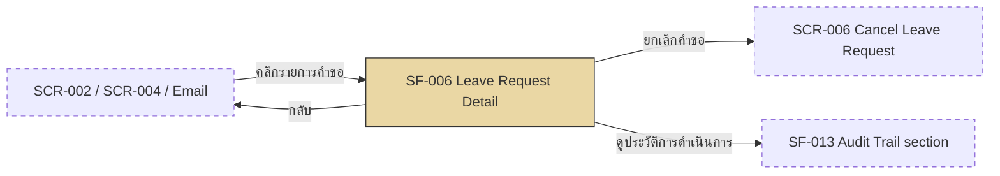

# SF-006 — Leave Request Status Tracking

## 1. Overview

| รายการ | รายละเอียด |
| --- | --- |
| Function ID | SF-006 |
| Function Name | Leave Request Status Tracking |
| Category | Screen |
| Screen Type | Detail View |
| Description | หน้ารายละเอียดคำขอลา 1 รายการ — แสดงสถานะปัจจุบัน, ข้อมูลคำขอ, เหตุผล Reject (ถ้ามี), ผู้อนุมัติ/วันที่ดำเนินการ, เอกสารแนบ และปุ่มยกเลิกคำขอ (conditional ตามสถานะ) |
| Actor / User Role | พนักงานประจำ (Employee), Outsource (เจ้าของคำขอ), Line Manager (ดู subordinate — read-only), HR (ดูแทน — read-only) |
| Related Requirement IDs | SFR-006, VR-009, VR-010, SCR-005 |
| Source Reference | Screen SRS §2.6 (SF-006), SRS §4.1 SFR-006, BRD BR-006, Method Signature §4.4 (`GetLeaveRequestDetailAsync`) |
| Version | 1.0 |
| Created By | screen-design-agent (2026-07-12) |
| Updated By | — |

## 2. Business Purpose

ลดการสอบถาม HR — พนักงานตรวจสอบสถานะและรายละเอียดคำขอลาของตนเองได้ด้วยตนเองแบบ real-time (Pending/Approved/Rejected/Cancelled/CancelRequested/Escalated) โดยไม่ต้องรอแจ้งจาก Manager หรือ HR รวมถึงเป็นจุดเริ่มต้นสำหรับการยกเลิกคำขอ (นำไปสู่ SF-007/SF-008) หน้าจอนี้แสดงเฉพาะ "สถานะปัจจุบัน" ของคำขอ — ประวัติ action แบบเต็ม (audit trail) เป็นขอบเขตของ SF-013 (Phase 2) แยกต่างหาก (Source: Screen SRS §2.6.1, SRS §4.1 SFR-006, BRD BR-006)

## 3. Screen Overview

| รายการ | รายละเอียด |
| --- | --- |
| Screen Name | Leave Request Detail (SCR-005) |
| Menu Path | Main Menu > Leave Balance Dashboard (SCR-002) > คลิกรายการคำขอ / "ดูประวัติคำขอ" — หรือ Manager Approval Inbox (SCR-004) > คลิก detail — หรือ Email notification link |
| Navigation Inbound | SCR-002 Leave Balance Dashboard (คลิกรายการใน "คำขอล่าสุด" หรือ "ดูประวัติคำขอ" — SF-002 §6), SCR-004 Manager Approval Inbox (Manager คลิก detail — ดู Assumption §13), Email notification link (deep link ตาม LeaveRequestId) |
| Navigation Outbound | SCR-006 Cancel Leave Request (ปุ่ม "ยกเลิกคำขอ" — เจ้าของคำขอเท่านั้น, Status=Pending→SF-007 / Status=Approved→SF-008), SCR-002 (ปุ่ม "กลับ" — Employee), SCR-004 (ปุ่ม "กลับ" — Manager, ดู Assumption §13) |
| Preconditions | Login สำเร็จ (SF-001), leaveRequestId ที่ระบุต้องมีอยู่จริงและผู้ใช้มีสิทธิ์เข้าถึง (RBAC — ดู §7.2.1) |
| Postconditions | ผู้ใช้รับทราบสถานะปัจจุบันของคำขอ — ไม่มีการเปลี่ยนแปลง DB state (read-only); หากคลิกยกเลิกคำขอ ระบบ navigate ไป SCR-006 โดยยังไม่เปลี่ยนสถานะจนกว่าจะยืนยันที่หน้านั้น |

### Related Screens

| Screen ID | Screen Name | Description |
| --- | --- | --- |
| SCR-002 | Leave Balance Dashboard | หน้าจอต้นทางหลัก — คลิกรายการคำขอเพื่อเปิดหน้านี้ (SF-002 §6) |
| SCR-004 | Manager Approval Inbox | หน้าจอต้นทางสำหรับ Manager — คลิก detail คำขอของ subordinate |
| SCR-006 | Cancel Leave Request | ปลายทางเมื่อคลิก "ยกเลิกคำขอ" (SF-007 กรณี Pending / SF-008 กรณี Approved) |
| SCR-005 (SF-013) | Leave History & Audit Trail (Phase 2) | ส่วนเสริมบนหน้าเดียวกัน (SCR-005) — แสดงประวัติทุก action แบบเต็ม (สร้าง/อนุมัติ/ปฏิเสธ/ยกเลิก) ต่างจาก SF-006 ที่แสดงเฉพาะสถานะปัจจุบัน — ดู SF-013 สำหรับรายละเอียด |

### Screen Flow

```text
SCR-002 Leave Balance Dashboard / SCR-004 Manager Approval Inbox / Email Notification
  └── [คลิกรายการคำขอ / deep link] → SF-006 Leave Request Detail (SCR-005)
        ├── [ยกเลิกคำขอ — เจ้าของคำขอ, Status=Pending/Approved] → SCR-006 Cancel Leave Request
        ├── [ดูประวัติการดำเนินการ — Phase 2] → SF-013 Audit Trail section (หน้าเดียวกัน)
        └── [กลับ] → SCR-002 (Employee) / SCR-004 (Manager)
```



## 4. Mockup / UI Layout

| รายการ | รายละเอียด |
| --- | --- |
| Mockup Reference | — (Screen SRS §2.6.3 ระบุ "ไม่มีข้อมูลที่มากเพียงพอ หรือ mockup อ้างอิง" — ASCII ด้านล่างเป็น Assumption ตาม Fields Definition §2.6.4) |
| Layout Description | Detail layout แนวตั้ง: header เลขคำขอ + status badge, ข้อมูลคำขอ (ประเภท/วันที่/เหตุผล), ส่วน conditional (เหตุผล Reject / ผู้อนุมัติ), ส่วนเอกสารแนบ, ปุ่มยกเลิกคำขอ (conditional) และปุ่มกลับ |

```text
+----------------------------------------------------------------------+
| [LOGO]  Leave Management System        User: [EMP_ID]  [EMP_NAME]   |
+----------------------------------------------------------------------+
| Menu >> Leave Balance >> รายละเอียดคำขอลา                            |
+----------------------------------------------------------------------+
| คำขอเลขที่ LR-2026-00012                          [ Pending ]         |
| (ชื่อพนักงาน: สมชาย ใจดี — แสดงเฉพาะเมื่อผู้ดูเป็น Manager/HR)          |
|                                                                      |
| ประเภทการลา        ลาป่วย                                            |
| ช่วงวันที่          01–02 Jul 2026 (2 วัน)                            |
| เหตุผลการลา        ไม่สบาย มีไข้                                     |
|                                                                      |
| เหตุผลการปฏิเสธ     -- (แสดงเฉพาะ Status = Rejected)                  |
| อนุมัติ/ปฏิเสธโดย    -- (แสดงเฉพาะ Status = Approved/Rejected)         |
| วันที่ดำเนินการ      -- (แสดงเฉพาะ Status = Approved/Rejected)         |
|                                                                      |
| เอกสารแนบ           ใบรับรองแพทย์.pdf (245 KB)  [ ดาวน์โหลด ]         |
|                                                                      |
| [ ดูประวัติการดำเนินการ (Phase 2) > ]                                  |
|                                                                      |
|              [ ยกเลิกคำขอ ]  (แสดงเฉพาะเจ้าของ + Pending/Approved)     |
|                              [ กลับ ]                                 |
+----------------------------------------------------------------------+
```

## 5. Fields Definition

### 5.1 Leave Request Detail Section (Display Only)

| No | Field Name | Label (TH/EN) | Type | Length | Required | Default | Validation | DB Mapping | Description |
| :---: | --- | --- | --- | --- | --- | --- | --- | --- | --- |
| 1 | request_no | เลขคำขอ / Request No. | Text (read-only) | 30 | Y | — | — | `LeaveRequests.LeaveRequestRef` (NVARCHAR(30)) | หมายเลขอ้างอิงคำขอลา (Screen SRS §2.6.4) |
| 2 | employee_name | ชื่อพนักงาน / Employee Name | Text (read-only) | — | Conditional | — | แสดงเฉพาะเมื่อผู้ดู ≠ เจ้าของคำขอ (Manager/HR) | `LeaveRequestDetailDto.EmployeeFullName` (JOIN `Employees.FullNameTh`/`FullNameEn` ผ่าน `LeaveRequests.EmployeeId`) | ระบุเจ้าของคำขอเมื่อผู้ดูเป็น Manager/HR (ดู Assumption §13) |
| 3 | leave_type | ประเภทการลา / Leave Type | Text (read-only) | — | Y | — | — | `LeaveTypes.TypeNameTh`/`TypeNameEn` (JOIN ผ่าน `LeaveRequests.LeaveTypeId`) | ประเภทที่ขอ (Screen SRS §2.6.4) |
| 4 | leave_dates | ช่วงวันที่ / Dates | Date range (read-only) | — | Y | — | — | `LeaveRequests.StartDate`, `LeaveRequests.EndDate` (DATE) | วันเริ่ม–วันสิ้นสุด (Screen SRS §2.6.4) |
| 5 | duration_days | จำนวนวัน / Total Days | Number (read-only) | — | Y | — | — | `LeaveRequests.DurationDays` (DECIMAL(10,2)), `LeaveRequests.IsHalfDay`/`HalfDayPeriod` แสดงหมายเหตุ "ครึ่งวัน (AM/PM)" เมื่อ `IsHalfDay = 1` | จำนวนวันลา รวมกรณีลาครึ่งวัน (Screen SRS §2.6.4 "จำนวนวัน") |
| 6 | status | สถานะ / Status | Badge (color-coded, read-only) | — | Y | — | — | `LeaveRequests.Status` (TINYINT: 1=Pending, 2=Approved, 3=Rejected, 4=Cancelled, 5=CancelRequested, 6=Escalated) | สถานะปัจจุบันของคำขอ (Screen SRS §2.6.4) |
| 7 | reason | เหตุผล (ที่ยื่น) / Reason | Text (read-only) | — | Y | — | — | `LeaveRequests.Reason` (NVARCHAR(MAX)) | เหตุผลที่พนักงานระบุตอนยื่นคำขอ (Screen SRS §2.6.4) |
| 8 | reject_reason | เหตุผลการปฏิเสธ / Reject Reason | Text (read-only) | — | Conditional | — | แสดงเฉพาะ Status=Rejected (Screen SRS §2.6.4) | `LeaveRequests.RejectionReason` (NVARCHAR(MAX)) | เหตุผล Reject จาก Manager |
| 9 | approved_by | อนุมัติ/ปฏิเสธโดย / Approved-Rejected By | Text (read-only) | — | Conditional | — | แสดงเฉพาะ Status=Approved/Rejected (Screen SRS §2.6.4) | Approved: `LeaveRequests.ApprovedBy` (NVARCHAR(20), FK `Employees`) / Rejected: `LeaveRequests.RejectedBy` (NVARCHAR(20), FK `Employees`) — JOIN `Employees` เพื่อแสดงชื่อ | ชื่อ Manager ที่ดำเนินการ (คนละคอลัมน์ตามสถานะ — ดู Assumption §13) |
| 10 | action_date | วันที่ดำเนินการ / Action Date | Datetime (read-only) | — | Conditional | — | แสดงเฉพาะ Status=Approved/Rejected (Screen SRS §2.6.4) | Approved: `LeaveRequests.ApprovedAt` (DATETIME2(0)) / Rejected: `LeaveRequests.RejectedAt` (DATETIME2(0)) | วัน-เวลาที่ Manager action |

### 5.2 Attachments Section (Display Only)

| No | Field Name | Label (TH/EN) | Type | Length | Required | Default | Validation | DB Mapping | Description |
| :---: | --- | --- | --- | --- | --- | --- | --- | --- | --- |
| 1 | file_name | ชื่อไฟล์ / File Name | Text (read-only, link) | 500 | N | — | แสดงเฉพาะเมื่อมีไฟล์แนบ | `Attachments.FileName` (NVARCHAR(500)) | ชื่อไฟล์ที่แนบ (เช่น ใบรับรองแพทย์) |
| 2 | file_type | ประเภทไฟล์ / File Type | Text (read-only) | 20 | N | — | — | `Attachments.FileType` (NVARCHAR(20): PDF/JPG/PNG) | ประเภทไฟล์ |
| 3 | file_size | ขนาดไฟล์ / File Size | Number (read-only) | — | N | — | — | `Attachments.FileSizeBytes` (BIGINT) | ขนาดไฟล์แสดงเป็น KB/MB |
| 4 | download_link | ดาวน์โหลด / Download | Link | — | N | — | คลิกเพื่อดาวน์โหลดจาก storage | `Attachments.StoragePath` (NVARCHAR(2000)) | ลิงก์ดาวน์โหลดไฟล์แนบ (Azure Blob) |

## 6. Commands / Actions

| No | Command | Type | Default State | Trigger Condition | System Response |
| :---: | --- | --- | --- | --- | --- |
| 1 | ยกเลิกคำขอ | Button | Enable เฉพาะเงื่อนไขตรง / ซ่อนกรณีอื่น | ผู้ดูเป็นเจ้าของคำขอ AND Status IN (Pending, Approved) (Screen SRS §2.6.5, VR-009) | Navigate ไป SCR-006: Status=Pending → SF-007 (`ILeaveRequestService.CancelPendingLeaveRequestAsync`) / Status=Approved → SF-008 (`ICancelRequestService.SubmitCancelRequestAsync`) |
| 2 | ดูประวัติการดำเนินการ (Phase 2) | Link / Tab | Enable (เมื่อ Phase 2 พร้อมใช้งาน) | คลิกลิงก์ | แสดง section/tab ตาม SF-013 Leave History & Audit Trail — เรียก `IApprovalHistoryRepository.GetByLeaveRequestAsync()` (รายละเอียดดู SF-013) |
| 3 | กลับ | Button | Enable | คลิกปุ่ม | Navigate กลับ: Employee → SCR-002 / Manager → SCR-004 (ดู Assumption §13) |

## 7. Screen Behavior

### 7.1 Initial Screen (onLoad)

- เรียก `ILeaveRequestService.GetLeaveRequestDetailAsync(leaveRequestId, requestingEmployeeId)` (Method Signature §4.4) — คืน `LeaveRequestDetailDto` พร้อม Attachments (SFR-006, SFR-005)
- แสดง field §5.1 ทั้งหมด, ซ่อน reject_reason/approved_by/action_date จนกว่าจะทราบ Status
- แสดงส่วนเอกสารแนบ (§5.2) เฉพาะเมื่อ `Attachments` ไม่ว่าง

### 7.2 ตรวจ RBAC และ conditional display ตาม Status

#### 7.2.1 Validation (ตามลำดับใน `GetLeaveRequestDetailAsync`)

| ลำดับ | Validation | Requirement | Error Message |
| :---: | --- | --- | --- |
| 1 | leaveRequestId ต้องมีอยู่จริง + ไม่ถูก IsDeleted | Method Signature §4.4 | ERR-SF006-001 |
| 2 | RBAC: Employee เห็นเฉพาะ request ของตัวเอง / Manager เห็นเฉพาะของ subordinates / HR เห็นทั้งหมด | NFR-005, Method Signature §4.4 | ERR-SF006-001 |

- Validation ไม่ผ่าน: ไม่แสดงข้อมูล, redirect กลับหน้าก่อนหน้าพร้อม ERR-SF006-001

#### 7.2.2 Insert / Update (DB Transaction ถ้ามี)

```text
— ไม่มี DB Transaction (หน้าจอนี้อ่านอย่างเดียว — read-only detail view)

SELECT (onLoad):
  LeaveRequests JOIN LeaveTypes JOIN Employees
    WHERE LeaveRequestId = @LeaveRequestId AND IsDeleted = 0
    (via GetLeaveRequestDetailAsync — ตรวจ RBAC ก่อนคืนค่า)
  Attachments WHERE LeaveRequestId = @LeaveRequestId AND IsDeleted = 0
```

### 7.3 แสดงผลตาม Status (conditional)

- Status = Rejected: แสดง reject_reason, approved_by (map จาก `RejectedBy`), action_date (map จาก `RejectedAt`)
- Status = Approved: แสดง approved_by (map จาก `ApprovedBy`), action_date (map จาก `ApprovedAt`) — ซ่อน reject_reason
- Status = Pending / CancelRequested / Cancelled / Escalated: ซ่อน reject_reason, approved_by, action_date

### 7.4 Click "ยกเลิกคำขอ"

- แสดงเฉพาะเมื่อผู้ดูเป็นเจ้าของคำขอ AND Status IN (Pending, Approved) (VR-009 — Rejected/Cancelled/CancelRequested/Escalated ไม่แสดงปุ่มนี้ ดู Assumption §13)
- คลิกแล้ว navigate ไป SCR-006 ทันที — ไม่มี validation เพิ่มเติมที่หน้านี้ (validation เต็มอยู่ที่ SF-007/SF-008)

### 7.5 Click "กลับ"

- Navigate กลับตามจุดเข้า: SCR-002 (Employee) / SCR-004 (Manager) — ไม่มี confirm dialog เนื่องจากหน้านี้เป็น read-only ไม่มีข้อมูลค้างกรอก

## 8. Business Rules

| Rule ID | Business Rule | Impact | Source Reference |
| --- | --- | --- | --- |
| BR-SF006-001 | ปุ่มยกเลิกคำขอแสดงเฉพาะ Status=Pending หรือ Approved | ซ่อนปุ่มเมื่อ Status อื่น | Screen SRS §2.6.5 |
| BR-SF006-002 | ห้ามยกเลิกคำขอที่ Status=Rejected | ซ่อนปุ่มยกเลิกเมื่อ Rejected | VR-009, BRD BR-014/BR-015 |
| BR-SF006-003 | RBAC: Employee เห็นเฉพาะคำขอของตัวเอง, Manager เห็นเฉพาะของ subordinates, HR เห็นทั้งหมด | Enforce ที่ Backend ใน `GetLeaveRequestDetailAsync` | NFR-005, Method Signature §4.4 |
| BR-SF006-004 | ไม่มีปุ่ม Edit บนหน้านี้ — ต้องยกเลิกแล้วยื่นใหม่หากต้องการแก้ไข | ไม่มี Edit action ในหน้านี้ | VR-010, BRD BR-017 |
| BR-SF006-005 | reject_reason/approved_by/action_date แสดงแบบ conditional ตาม Status | ควบคุมการแสดงผลใน §7.3 | Screen SRS §2.6.4 |
| BR-SF006-006 | เฉพาะเจ้าของคำขอเห็นปุ่มยกเลิก — Manager/HR เป็น read-only | ซ่อนปุ่มยกเลิกสำหรับ Manager/HR | Assumption (เอกสารนี้) — SF-007/SF-008 Actor เป็นพนักงานเท่านั้น |

```text
onLoad → GetLeaveRequestDetailAsync (RBAC check)
│
├── ไม่พบ / ไม่มีสิทธิ์ → ERR-SF006-001 (block)
│
└── พบและมีสิทธิ์
    ├── Status = Pending/Approved AND ผู้ดู = เจ้าของ → แสดงปุ่ม "ยกเลิกคำขอ"
    ├── Status = Rejected → แสดง reject_reason + approved_by(RejectedBy) + action_date(RejectedAt), ซ่อนปุ่มยกเลิก
    ├── Status = Approved → แสดง approved_by(ApprovedBy) + action_date(ApprovedAt)
    └── Status = Cancelled/CancelRequested/Escalated → ซ่อนปุ่มยกเลิก (ดำเนินการแล้ว/อยู่ระหว่างดำเนินการ)
```

## 9. Message List

### Error Messages

| Message ID | Trigger | Message (TH) | Message (EN) |
| --- | --- | --- | --- |
| ERR-SF006-001 | ไม่พบคำขอลา หรือไม่มีสิทธิ์เข้าถึง (`LeaveRequestNotFoundException` / `UnauthorizedLeaveActionException`) — message ใหม่ที่เพิ่มในเอกสารนี้ | ไม่พบคำขอลานี้ หรือคุณไม่มีสิทธิ์เข้าถึง | This leave request was not found, or you do not have permission to view it. |

### Success / Info Messages

| Message ID | Trigger | Message (TH) | Message (EN) |
| --- | --- | --- | --- |
| — | หน้าจอนี้เป็น read-only detail view ไม่มี action ที่สร้างผลสำเร็จโดยตรง — success message ของการยกเลิกอยู่ที่ SF-007 (SUC-CAN-001) / SF-008 (SUC-CAN-002) | — | — |

## 10. Popup / Sub-screen Definition

— ไม่มี (หน้าจอนี้เป็น detail view แสดงผลอย่างเดียว — การยกเลิก/ดูประวัติเป็นการ navigate ไปหน้าอื่นหรือ section อื่นในหน้าเดียวกัน ไม่ใช่ popup)

## 11. Database Tables Reference

| Table Name | Alias | Description |
| --- | --- | --- |
| LeaveRequests | — | SELECT รายละเอียดคำขอ 1 รายการ: `WHERE LeaveRequestId = @LeaveRequestId AND IsDeleted = 0` — ไม่มี INSERT/UPDATE จากหน้าจอนี้ |
| LeaveTypes | — | JOIN แสดงชื่อประเภทลา (TypeNameTh/En) |
| Employees | — | JOIN แสดงชื่อเจ้าของคำขอ (เมื่อผู้ดู ≠ เจ้าของ) และชื่อผู้อนุมัติ/ปฏิเสธ (ApprovedBy/RejectedBy → Employees) |
| Attachments | — | SELECT เอกสารแนบของคำขอ: `WHERE LeaveRequestId = @LeaveRequestId AND IsDeleted = 0` |

## 12. Exception Handling

| Error Case | Trigger Condition | System Behavior | User Message | Recovery |
| --- | --- | --- | --- | --- |
| Validation error | ไม่พบ leaveRequestId หรือไม่มีสิทธิ์เข้าถึง (RBAC fail) | ไม่แสดงข้อมูล, redirect กลับหน้าก่อนหน้า | ERR-SF006-001 | กลับไปหน้ารายการคำขอที่มีสิทธิ์ดู |
| Integration error | โหลดรายละเอียดคำขอไม่สำเร็จ (API error) | แสดง error banner แทนเนื้อหาหน้า | "ไม่สามารถโหลดรายละเอียดคำขอได้ กรุณา refresh" | Refresh หน้า |
| System error | Backend API ล่ม (HTTP 5xx) | แสดง error banner ตาม global error handling | "เกิดข้อผิดพลาด กรุณาลองใหม่" | รอและ refresh |

## 13. Notes / Assumptions

| ประเภท | รายละเอียด | ผลกระทบ |
| --- | --- | --- |
| Open Issue (จาก SRS) | Screen SRS §2.6.3 ระบุว่าไม่มีข้อมูลเพียงพอหรือ mockup อ้างอิงสำหรับสร้างหน้าจอตัวอย่าง | ต้องให้ UX/Business review ก่อนถือ ASCII mockup ใน §4 เป็น final layout |
| Assumption (จาก SRS) | Actor/User Role ใน Screen SRS §2.6.1 ระบุเฉพาะพนักงาน/Outsource/HR แต่ Navigation Inbound (§2.6.2) ระบุ "SCR-004 (Manager คลิก detail)" — เอกสารนี้จึงเพิ่ม Line Manager เป็น Actor แบบ read-only ตาม RBAC ของ `GetLeaveRequestDetailAsync` (Method Signature §4.4) | ต้อง confirm กับ BA ว่า Manager เข้าถึงหน้านี้ได้จริงหรือมีหน้าแยกต่างหาก |
| Assumption (เอกสารนี้) | field "approved_by"/"action_date" ใน SRS ใช้ชื่อเดียวครอบคลุมทั้ง Approved และ Rejected แต่ Data Architecture แยกคอลัมน์ `ApprovedBy`/`ApprovedAt` และ `RejectedBy`/`RejectedAt` — เอกสารนี้ map ตามสถานะ | ต้อง confirm กับ Dev ว่า Frontend จะรวม 2 field เป็น field เดียวหรือแยกแสดง |
| Assumption (เอกสารนี้) | เพิ่ม field `employee_name` (§5.1 No.2) และ Attachments section (§5.2) นอกเหนือจาก field list ใน SRS §2.6.4 — อ้างอิงจาก SCR-005 summary description ("history, status, เอกสาร") และ `LeaveRequestDetailDto` ที่มี EmployeeFullName + Attachments | ต้องให้ BA/UX confirm ก่อน implement |
| Assumption (เอกสารนี้) | ปุ่มยกเลิกซ่อนสำหรับ Manager/HR เนื่องจาก SF-007/SF-008 (Cancel flow) มี Actor เป็นพนักงานประจำ/Outsource เท่านั้น ไม่มี Manager/HR | ต้อง confirm กับ BA — ปัจจุบันไม่มี use case ให้ Manager/HR ยกเลิกแทนพนักงาน |
| Note | `GetLeaveRequestDetailAsync` คืนค่า `List<ApprovalHistorySummaryDto> History` มาด้วย (Method Signature §4.4) แต่ SF-006 (baseline) เลือกไม่แสดงส่วนนี้บนหน้าจอ — ส่วนแสดงผลแบบเต็มอยู่ที่ SF-013 (Phase 2) เพื่อไม่ให้เนื้อหาซ้ำกันระหว่างสองเอกสาร | Frontend ต้องดึง response เดียวกันแต่ render คนละ section/tab ตามเอกสารนี้กับ SF-013 |
| Note | Navigation ปลายทางของปุ่ม "กลับ" สำหรับ Manager (SCR-004) เป็น assumption ของเอกสารนี้ — Screen SRS §2.6.2 ระบุ Navigation Outbound เฉพาะ SCR-006 และ SCR-002 | ต้อง confirm กับ BA/UX ว่า Manager ควรกลับไปหน้าใด |

## Change Log

| Version | Date | Author | Change Type | Description | Remark |
| --- | --- | --- | --- | --- | --- |
| 1.0 | 2026-07-12 | screen-design-agent (Claude) | Created | สร้างเอกสารครั้งแรกจาก Screen SRS v1.0 (§2.6 SF-006), Data Architecture Design (LeaveRequests/LeaveTypes/Employees/Attachments DDL §6.3.3/§6.3.6), Method Signature §4.4 (`ILeaveRequestService.GetLeaveRequestDetailAsync`) | Generated ตาม template screen-design-agent |

### สรุปการเปลี่ยนแปลงสำคัญ

| ช่วง Version | การเปลี่ยนแปลง | ผลกระทบ |
| --- | --- | --- |
| 1.0 | Baseline แรก | — |
