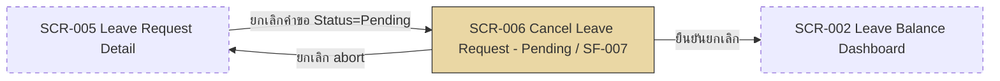

# SF-007 — Cancel Leave Request — Pending

## 1. Overview

| รายการ | รายละเอียด |
| --- | --- |
| Function ID | SF-007 |
| Function Name | Cancel Leave Request — Pending |
| Category | Screen |
| Screen Type | Detail View |
| Description | หน้าจอให้พนักงานยกเลิกคำขอลาที่ยังอยู่สถานะ Pending ได้ทันที โดยไม่ต้องผ่านการอนุมัติจากหัวหน้างาน |
| Actor / User Role | พนักงานประจำ (Employee), Outsource |
| Related Requirement IDs | SFR-007, VR-009, VR-010, SCR-006 |
| Source Reference | Screen SRS §2.7 (SF-007), SRS §4.1 SFR-007, BRD BR-014, BR-017 |
| Version | 1.0 |
| Created By | screen-design-agent (2026-07-12) |
| Updated By | — |

## 2. Business Purpose

ให้ความยืดหยุ่นแก่พนักงานในการยกเลิกคำขอลาของตนเองก่อนที่หัวหน้างานจะดำเนินการอนุมัติ/ปฏิเสธ เนื่องจากคำขอยังไม่ผ่านการอนุมัติจึงไม่มีผลกระทบต่อแผนงานของทีมหรือสิทธิ์วันลาที่ถูกใช้จริง (มีเพียง PendingDays ที่ถูกกันไว้ชั่วคราว) ระบบจึงอนุญาตให้ยกเลิกได้ทันทีโดยไม่ต้อง route ผ่าน Manager (Source: Screen SRS §2.7.1, BRD BR-014)

## 3. Screen Overview

| รายการ | รายละเอียด |
| --- | --- |
| Screen Name | Cancel Leave Request (SCR-006) — Pending flow |
| Menu Path | Main Menu > Leave Request Detail (SCR-005) > ปุ่ม "ยกเลิกคำขอ" |
| Navigation Inbound | SCR-005 Leave Request Detail (ปุ่ม "ยกเลิกคำขอ" — แสดงเมื่อ Status=Pending หรือ Approved ตาม SF-006 §2.6.5) |
| Navigation Outbound | SCR-002 Leave Balance Dashboard (หลังยกเลิกสำเร็จ), SCR-005 (กด "ยกเลิก (abort)" — กลับหน้าเดิมโดยไม่ดำเนินการ) |
| Preconditions | Login สำเร็จ (SF-001), เป็นเจ้าของคำขอ (RBAC), `LeaveRequests.Status = 1 (Pending)` |
| Postconditions | `LeaveRequests.Status` → 4 (Cancelled) ทันที, `LeaveBalances.PendingDays` ถูกคืน, ไม่มี Email แจ้งเตือน (SFR-007 ระบุ "no email required") |

### Related Screens

| Screen ID | Screen Name | Description |
| --- | --- | --- |
| SCR-005 | Leave Request Detail | หน้าจอต้นทาง — มีปุ่ม "ยกเลิกคำขอ" นำมายังหน้านี้เมื่อ Status=Pending |
| SCR-002 | Leave Balance Dashboard | ปลายทางหลังยกเลิกสำเร็จ — แสดง balance ที่คืนแล้ว |
| SCR-006 | Cancel Leave Request | Screen ID เดียวกับ SF-008 — แยกพฤติกรรมตาม Status ของ Leave Request ต้นทาง: Pending (หน้านี้) = ยกเลิกทันที ไม่กระทบ balance ที่ใช้จริง / Approved (SF-008) = สร้าง CancelRequest รอ Manager re-approve |

### Screen Flow

```text
Main Menu
  └── SCR-005 Leave Request Detail (Status=Pending)
        └── [ยกเลิกคำขอ] → SCR-006 Cancel Leave Request (SF-007 — Pending flow)
              ├── [ยืนยันยกเลิก] → SCR-002 Leave Balance Dashboard
              └── [ยกเลิก (abort)] → SCR-005 Leave Request Detail
```



## 4. Mockup / UI Layout

| รายการ | รายละเอียด |
| --- | --- |
| Mockup Reference | — (Screen SRS §2.7.3 ระบุ "ไม่มีข้อมูลที่มากเพียงพอ หรือ mockup อ้างอิง" — ASCII ด้านล่างเป็น Assumption จาก Fields/Commands ที่ระบุใน SRS §2.7) |
| Layout Description | หน้าจอเดียว (ไม่มี popup แยก): แสดงสรุปคำขอลาเดิมแบบ read-only, ข้อความยืนยัน (WRN-CAN-001), ปุ่ม "ยืนยันยกเลิก" และ "ยกเลิก (abort)" |

```text
+----------------------------------------------------------------------+
| [LOGO]  Leave Management System        User: [EMP_ID]  [EMP_NAME]   |
+----------------------------------------------------------------------+
| Menu >> Leave Request Detail >> Cancel Leave Request                 |
+----------------------------------------------------------------------+
| ยกเลิกคำขอลา (Cancel Leave Request)                                  |
|                                                                      |
| เลขคำขอ           LR-2026-00010                                      |
| ประเภทการลา        ลาพักผ่อนประจำปี                                   |
| วันที่ลา            15 Jul 2026 – 15 Jul 2026 (1 วัน)                 |
| เหตุผลเดิม          ลากิจธุระส่วนตัว                                   |
| สถานะปัจจุบัน       [ Pending ]                                        |
|                                                                      |
|  ⚠ คุณต้องการยกเลิกคำขอลานี้ใช่หรือไม่? การยกเลิกจะมีผลทันที          |
|    (WRN-CAN-001)                                                     |
|                                                                      |
|                    [ ยืนยันยกเลิก ]    [ ยกเลิก (abort) ]              |
+----------------------------------------------------------------------+
```

## 5. Fields Definition

### 5.1 Leave Request Summary (Display Only)

| No | Field Name | Label (TH/EN) | Type | Length | Required | Default | Validation | DB Mapping | Description |
| :---: | --- | --- | --- | --- | --- | --- | --- | --- | --- |
| 1 | leave_request_ref | เลขคำขอ / Request No. | Text (read-only) | 30 | Y | — | — | `LeaveRequests.LeaveRequestRef` (NVARCHAR(30)) | เลขอ้างอิงคำขอลาที่จะยกเลิก |
| 2 | leave_type | ประเภทการลา / Leave Type | Text (read-only) | — | Y | — | — | `LeaveTypes.TypeNameTh` / `TypeNameEn` (JOIN ผ่าน `LeaveRequests.LeaveTypeId`) | ประเภทการลาของคำขอเดิม |
| 3 | leave_dates | วันที่ลา / Leave Dates | Date range (read-only) | — | Y | — | — | `LeaveRequests.StartDate`, `LeaveRequests.EndDate` (DATE) | ช่วงวันที่ลาของคำขอเดิม |
| 4 | duration_days | จำนวนวัน / Duration | Number (read-only) | — | Y | — | — | `LeaveRequests.DurationDays` (DECIMAL(10,2)) | จำนวนวันลาของคำขอเดิม |
| 5 | reason | เหตุผลเดิม / Original Reason | Text (read-only) | — | N | — | — | `LeaveRequests.Reason` (NVARCHAR(MAX)) | เหตุผลที่ระบุตอนยื่นคำขอ |
| 6 | status | สถานะปัจจุบัน / Current Status | Badge (read-only) | — | Y | — | ต้อง = Pending (1) จึงเข้าหน้านี้ได้ (Precondition §3) | `LeaveRequests.Status` (TINYINT: 1=Pending) | แสดงยืนยันว่ายังเป็น Pending ก่อนยกเลิก |

## 6. Commands / Actions

| No | Command | Type | Default State | Trigger Condition | System Response |
| :---: | --- | --- | --- | --- | --- |
| 1 | ยืนยันยกเลิก | Button | Enable | คลิกปุ่ม (หลังเห็นข้อความยืนยัน WRN-CAN-001) | เรียก `ILeaveRequestService.CancelPendingLeaveRequestAsync()` → UPDATE Status=Cancelled + คืน PendingDays → แสดง SUC-CAN-001 → redirect SCR-002 |
| 2 | ยกเลิก (abort) | Button | Enable | คลิกปุ่ม "ไม่ยกเลิก" | ไม่ดำเนินการใด ๆ กลับไป SCR-005 โดย Status ยังเป็น Pending |

## 7. Screen Behavior

### 7.1 Initial Screen (onLoad)

- ดึงรายละเอียดคำขอลาเดิมผ่าน `ILeaveRequestService.GetLeaveRequestDetailAsync(leaveRequestId, employeeId)` (SFR-005/006) — RBAC: ต้องเป็นเจ้าของคำขอ
- ตรวจ `LeaveRequests.Status = Pending` ก่อนแสดงหน้านี้ — ถ้า Status ≠ Pending (เช่น ถูก Manager Approve/Reject ไปแล้วระหว่างที่ผู้ใช้เปิดหน้าค้างไว้) ให้แสดง error และไม่อนุญาตให้ยกเลิก (ดู §12)
- แสดงข้อความยืนยัน WRN-CAN-001 พร้อมสรุปคำขอลาเดิมแบบ read-only (ดู Assumption §13 — SRS จัดข้อความนี้เป็น "Confirm Dialog" แต่เอกสารนี้แสดงเป็น banner บนหน้าเดียวกัน ไม่ใช่ popup แยก)

### 7.2 Click "ยืนยันยกเลิก"

#### 7.2.1 Validation (ตามลำดับใน `CancelPendingLeaveRequestAsync` — Method Signature §4.4)

| ลำดับ | Validation | Requirement | Error Message |
| :---: | --- | --- | --- |
| 1 | `leaveRequestId` มีอยู่จริง | — | System error (`LeaveRequestNotFoundException`) |
| 2 | `employeeId` เป็นเจ้าของคำขอ (RBAC) | VR-009 (เจ้าของเท่านั้นดำเนินการได้) | ERR-SF007-001 (`UnauthorizedLeaveActionException`) |
| 3 | `Status` ต้องเป็น Pending เท่านั้น — ห้ามยกเลิกคำขอ Rejected | VR-009 | ERR-CAN-001 (`InvalidLeaveStatusTransitionException`) |

- Validation ไม่ผ่าน: ไม่บันทึก, แสดง error message ตามตาราง, ไม่ redirect

#### 7.2.2 Insert / Update (DB Transaction — NFR-010)

```text
BEGIN TRANSACTION
  UPDATE LeaveRequests
    SET Status = 4 (Cancelled), UpdatedAt = Current UTC Datetime, UpdatedBy = Session Login User ID
    WHERE LeaveRequestId = @LeaveRequestId
  UPDATE LeaveBalances
    SET PendingDays -= DurationDays
    WHERE EmployeeId = @EmployeeId AND LeaveTypeId = @LeaveTypeId AND LeaveYear = @Year
COMMIT

หมายเหตุ: ไม่มี AFTER COMMIT notification — SFR-007 ระบุชัดเจนว่า "no email required"
  สำหรับกรณียกเลิก Pending (Method Signature §4.4)
```

- สำเร็จ: แสดง SUC-CAN-001 แล้ว redirect ไป SCR-002 Leave Balance Dashboard

### 7.3 Click "ยกเลิก (abort)"

- ไม่มีการเปลี่ยนแปลง DB — กลับไป SCR-005 Leave Request Detail ทันที

## 8. Business Rules

| Rule ID | Business Rule | Impact | Source Reference |
| --- | --- | --- | --- |
| BR-SF007-001 | Pending → ยกเลิกเองได้ทันที ไม่ต้องผ่าน Manager | ไม่มีการ route ไป Approval flow, ไม่มีการสร้าง `CancelRequests` record | BRD BR-014, Screen SRS §2.7.6, R4 (QA v2) |
| BR-SF007-002 | ห้ามยกเลิกคำขอที่ Status=Rejected | ปุ่ม "ยกเลิกคำขอ" ต้องไม่แสดงบน SCR-005 เมื่อ Status=Rejected (บังคับที่ SF-006); ฝั่ง backend ยืนยันซ้ำด้วย `InvalidLeaveStatusTransitionException` | VR-009, Screen SRS §2.7.6 (อ้างเป็น BR-017 ในตาราง SRS — ดู Note §13) |
| BR-SF007-003 | ยกเลิก Pending ไม่ trigger Email notification | ต่างจาก SF-008 (Approved) ที่ต้องแจ้ง Manager+HR | Method Signature §4.4 (SFR-007 — "no email required") |
| BR-SF007-004 | ยกเลิก Pending ต้องคืน PendingDays ทันที ใน transaction เดียวกับการเปลี่ยน Status | NFR-010: ป้องกัน balance ไม่ sync กับ Status | NFR-010, Method Signature §4.4 |

## 9. Message List

### Error Messages

| Message ID | Trigger | Message (TH) | Message (EN) |
| --- | --- | --- | --- |
| ERR-CAN-001 | ยกเลิกคำขอที่ Status ≠ Pending (เช่น Rejected) — VR-009 | ไม่สามารถยกเลิกคำขอนี้ได้ เนื่องจากสถานะไม่ใช่ "รออนุมัติ" | This request cannot be cancelled because it is not in Pending status. |
| ERR-SF007-001 | ผู้ใช้ไม่ใช่เจ้าของคำขอ (`UnauthorizedLeaveActionException`) | คุณไม่มีสิทธิ์ยกเลิกคำขอลานี้ | You do not have permission to cancel this leave request. |

### Success / Info Messages

| Message ID | Trigger | Message (TH) | Message (EN) |
| --- | --- | --- | --- |
| WRN-CAN-001 | เข้าสู่หน้ายกเลิกคำขอ Pending | คุณต้องการยกเลิกคำขอลานี้ใช่หรือไม่? การยกเลิกจะมีผลทันที | Do you want to cancel this leave request? This action takes effect immediately. |
| SUC-CAN-001 | ยกเลิก Pending สำเร็จ | ยกเลิกคำขอลาสำเร็จ | Leave request has been cancelled. |

## 10. Popup / Sub-screen Definition

— ไม่มี (SRS §2.7.5 จัดประเภท WRN-CAN-001 เป็น "Confirm Dialog" แต่ SRS ไม่ได้ระบุ field หรือ popup layout แยกต่างหาก — เอกสารนี้ออกแบบให้ข้อความยืนยันและปุ่มทั้งสอง (§6) แสดงบนหน้าจอ SCR-006 เดียวกันโดยตรง ไม่ใช่ modal popup ซ้อนอีกชั้น ดู Assumption §13)

## 11. Database Tables Reference

| Table Name | Alias | Description |
| --- | --- | --- |
| LeaveRequests | — | SELECT รายละเอียดคำขอเดิม (onLoad) + UPDATE `Status=4 (Cancelled)` เมื่อยืนยันยกเลิก |
| LeaveBalances | — | UPDATE `PendingDays -= DurationDays` (transaction เดียวกับ UPDATE LeaveRequests) |
| LeaveTypes | — | JOIN แสดงชื่อประเภทการลา (read-only) |
| Employees | — | ตรวจ RBAC ว่า `employeeId` เป็นเจ้าของคำขอ |

## 12. Exception Handling

| Error Case | Trigger Condition | System Behavior | User Message | Recovery |
| --- | --- | --- | --- | --- |
| Validation error | Status ≠ Pending ขณะกดยืนยัน (เช่นถูก Manager ดำเนินการไปแล้วระหว่างเปิดหน้าค้างไว้) | ไม่บันทึก, แสดง error | ERR-CAN-001 | Refresh แล้วดูสถานะล่าสุดที่ SCR-005 |
| Authorization error | ผู้ใช้ไม่ใช่เจ้าของคำขอ (พยายามเรียก URL ตรง) | Block การทำรายการ | ERR-SF007-001 | กลับ SCR-002 |
| System error | Transaction ล้มเหลว (DB error ระหว่าง UPDATE) | Rollback ทั้ง Status และ PendingDays | "เกิดข้อผิดพลาด กรุณาลองใหม่" | ลองยืนยันยกเลิกใหม่ |

## 13. Notes / Assumptions

| ประเภท | รายละเอียด | ผลกระทบ |
| --- | --- | --- |
| Assumption (จาก SRS) | WRN-CAN-001 ถูกจัดเป็น "Confirm Dialog" ใน Message List (§2.7.5) แต่ SRS ไม่ได้ระบุ layout ของ dialog แยกจากหน้าหลัก — เอกสารนี้เลือกออกแบบเป็น banner บนหน้าเดียวกันแทน popup ซ้อน (ต่างจาก SF-003 ที่มี popup แยกชัดเจน) | ต้อง confirm กับ UX ว่าต้องการ modal popup จริง หรือ inline banner ตามที่ออกแบบไว้ |
| Assumption (เอกสารนี้) | ASCII mockup ใน §4 สร้างจาก Fields/Commands ใน SRS §2.7 — ยังไม่มี mockup ทางการ | ต้องให้ UX/Business review ก่อนถือเป็น final layout |
| Note | SRS §2.7.6 ใช้ Rule ID "BR-017" อ้างอิง Source "BRD VR-009" สำหรับกฎ "ห้ามยกเลิก Rejected" — แต่ BR-017 ในเอกสารเดียวกัน (ใช้กับ SF-008 §2.8.6) หมายถึง "ห้าม Edit คำขอที่ Approved" คนละเรื่องกัน ดูเหมือนเป็นความคลาดเคลื่อนของ Rule ID ใน SRS ต้นทาง — เอกสารนี้ยึด VR-009 (ห้ามยกเลิก Rejected) เป็นหลักสำหรับ BR-SF007-002 | ต้องให้ BA ยืนยัน/แก้ไข Rule ID ใน Screen SRS §2.7.6 |
| Note | Related Requirement IDs ของ SF-007 รวม VR-010 ไว้ด้วย (Screen SRS §4.1 mapping table) แต่เนื้อหา VR-010 จริง (System Requirement Specification Summary) ระบุขอบเขตเป็น SCR-003/SCR-005 (ซ่อนปุ่ม Edit เมื่อ Approved) ไม่ได้เกี่ยวกับหน้านี้โดยตรง — เอกสารนี้จึงไม่ได้นำ VR-010 มาเป็น Business Rule ของ SF-007 | ต้องให้ BA ยืนยันว่า VR-010 เกี่ยวข้องกับ SF-007 จริงหรือเป็นการ map requirement ผิดพลาดใน SRS |
| Note | Service method หลัก: `ILeaveRequestService.CancelPendingLeaveRequestAsync()` (Method Signature §4.4) — ใช้เป็น contract ระหว่าง UI กับ backend | — |

## Change Log

| Version | Date | Author | Change Type | Description | Remark |
| --- | --- | --- | --- | --- | --- |
| 1.0 | 2026-07-12 | screen-design-agent (Claude) | Created | สร้างเอกสารครั้งแรกจาก Screen SRS v1.0 (§2.7 SF-007), Data Architecture Design (LeaveRequests/LeaveBalances DDL), Method Signature §4.4 (`ILeaveRequestService.CancelPendingLeaveRequestAsync`) | Generated ตาม template screen-design-agent |

### สรุปการเปลี่ยนแปลงสำคัญ

| ช่วง Version | การเปลี่ยนแปลง | ผลกระทบ |
| --- | --- | --- |
| 1.0 | Baseline แรก | — |
