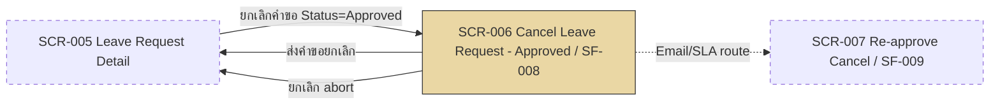

# SF-008 — Cancel Leave — Approved (Cancel Request Flow)

## 1. Overview

| รายการ | รายละเอียด |
| --- | --- |
| Function ID | SF-008 |
| Function Name | Cancel Leave — Approved (Cancel Request Flow) |
| Category | Screen |
| Screen Type | Detail View |
| Description | หน้าจอให้พนักงานส่ง Cancel Request สำหรับคำขอลาที่ Approved แล้ว — ระบบสร้างคำขอยกเลิกและ route ไปให้ Manager re-approve ภายใน SLA 1 วันทำการ แทนการยกเลิกทันที |
| Actor / User Role | พนักงานประจำ (Employee), Outsource |
| Related Requirement IDs | SFR-008, VR-009, NR-001, NR-002, SCR-006 |
| Source Reference | Screen SRS §2.8 (SF-008), SRS §4.1 SFR-008, BRD BR-015, R4 (QA v2) |
| Version | 1.0 |
| Created By | screen-design-agent (2026-07-12) |
| Updated By | — |

## 2. Business Purpose

คำขอที่ Approved แล้วมีผลต่อแผนงานของทีมและถูกนับเป็น `UsedDays` จริง การยกเลิกจึงต้องผ่านกระบวนการ re-approve จากหัวหน้างานเพื่อป้องกันความเสียหายต่อแผนงาน/กำลังคน แทนที่จะให้ยกเลิกได้เองทันทีเหมือนคำขอ Pending — ระบบบังคับ SLA 1 วันทำการเพื่อไม่ให้คำขอยกเลิกค้างนานเกินไป (Source: Screen SRS §2.8.1, BRD BR-015, R4 (QA v2))

## 3. Screen Overview

| รายการ | รายละเอียด |
| --- | --- |
| Screen Name | Cancel Leave Request (SCR-006) — Approved flow |
| Menu Path | Main Menu > Leave Request Detail (SCR-005) > ปุ่ม "ยกเลิกคำขอ" (เมื่อ Status=Approved) |
| Navigation Inbound | SCR-005 Leave Request Detail (ปุ่ม "ยกเลิกคำขอ" — แสดงเมื่อ Status=Approved ตาม SF-006 §2.6.5) |
| Navigation Outbound | SCR-005 Leave Request Detail (หลังส่งคำขอสำเร็จ — แสดงสถานะ CancelRequested ใหม่, ดู Assumption §13), SCR-005 (กด "ยกเลิก (abort)" — กลับหน้าเดิมโดยไม่ดำเนินการ) |
| Preconditions | Login สำเร็จ (SF-001), เป็นเจ้าของคำขอ (RBAC), `LeaveRequests.Status = 2 (Approved)`, ยังไม่มี active Cancel Request สำหรับคำขอนี้ |
| Postconditions | `LeaveRequests.Status` → 5 (CancelRequested), `CancelRequests` record ใหม่ถูกสร้าง (Status=1 Pending, `SlaDeadline` = now + 1 วันทำการ), Email แจ้ง Manager + HR ถูก publish, SLA timer เริ่มนับ (IF-005) |

### Related Screens

| Screen ID | Screen Name | Description |
| --- | --- | --- |
| SCR-005 | Leave Request Detail | หน้าจอต้นทาง/ปลายทาง — มีปุ่ม "ยกเลิกคำขอ" นำมายังหน้านี้เมื่อ Status=Approved |
| SCR-006 | Cancel Leave Request | Screen ID เดียวกับ SF-007 — แยกพฤติกรรมตาม Status ของ Leave Request ต้นทาง: Approved (หน้านี้) = สร้าง `CancelRequests` record รอ Manager re-approve และกระทบ `UsedDays` จริง / Pending (SF-007) = ยกเลิกทันที ไม่ต้องผ่าน Manager |
| SCR-007 | Re-approve Cancel (Manager) | ปลายทางเชิงกระบวนการ — Manager ดำเนินการ Approve/Reject คำขอยกเลิกที่สร้างจากหน้านี้ (SF-009) |

### Screen Flow

```text
Main Menu
  └── SCR-005 Leave Request Detail (Status=Approved)
        └── [ยกเลิกคำขอ] → SCR-006 Cancel Leave Request (SF-008 — Approved flow)
              ├── [ส่งคำขอยกเลิก] → SCR-005 Leave Request Detail (Status=CancelRequested)
              │                        → (async) SCR-007 Re-approve Cancel (Manager)
              └── [ยกเลิก (abort)] → SCR-005 Leave Request Detail
```



## 4. Mockup / UI Layout

| รายการ | รายละเอียด |
| --- | --- |
| Mockup Reference | — (Screen SRS §2.8.3 ระบุ "ไม่มีข้อมูลที่มากเพียงพอ หรือ mockup อ้างอิง" — ASCII ด้านล่างเป็น Assumption จาก Fields/Commands ที่ระบุใน SRS §2.8) |
| Layout Description | หน้าจอเดียว (ไม่มี popup แยก): แสดงสรุปคำขอลาเดิมแบบ read-only, ข้อความเตือน SLA (WRN-CAN-002), ช่องกรอกเหตุผลยกเลิก (ไม่บังคับ), ปุ่ม "ส่งคำขอยกเลิก" และ "ยกเลิก (abort)" |

```text
+----------------------------------------------------------------------+
| [LOGO]  Leave Management System        User: [EMP_ID]  [EMP_NAME]   |
+----------------------------------------------------------------------+
| Menu >> Leave Request Detail >> Cancel Leave Request                 |
+----------------------------------------------------------------------+
| ยกเลิกคำขอลา (Cancel Leave Request) — ต้องรอการอนุมัติ                |
|                                                                      |
| เลขคำขอ            LR-2026-00005                                     |
| ประเภทการลา         ลาป่วย                                            |
| วันที่ลา             01 Jul 2026 – 02 Jul 2026 (2 วัน)                 |
| สถานะปัจจุบัน        [ Approved ]                                      |
|                                                                      |
| เหตุผลการขอยกเลิก (ไม่บังคับ)                                          |
| [                                                              ]      |
|                                                                      |
|  ⚠ คำขอนี้ได้รับการอนุมัติแล้ว การยกเลิกต้องผ่านการอนุมัติจากหัวหน้างาน |
|    ภายใน 1 วันทำการ (WRN-CAN-002)                                     |
|                                                                      |
|                    [ ส่งคำขอยกเลิก ]    [ ยกเลิก (abort) ]             |
+----------------------------------------------------------------------+
```

## 5. Fields Definition

### 5.1 Leave Request Summary (Display Only)

| No | Field Name | Label (TH/EN) | Type | Length | Required | Default | Validation | DB Mapping | Description |
| :---: | --- | --- | --- | --- | --- | --- | --- | --- | --- |
| 1 | leave_request_ref | เลขคำขอ / Request No. | Text (read-only) | 30 | Y | — | — | `LeaveRequests.LeaveRequestRef` (NVARCHAR(30)) | เลขอ้างอิงคำขอลาที่จะยกเลิก |
| 2 | leave_type | ประเภทการลา / Leave Type | Text (read-only) | — | Y | — | — | `LeaveTypes.TypeNameTh` / `TypeNameEn` (JOIN ผ่าน `LeaveRequests.LeaveTypeId`) | ประเภทการลาของคำขอเดิม |
| 3 | leave_dates | วันที่ลา / Leave Dates | Date range (read-only) | — | Y | — | — | `LeaveRequests.StartDate`, `LeaveRequests.EndDate` (DATE) | ช่วงวันที่ลาของคำขอเดิม |
| 4 | duration_days | จำนวนวัน / Duration | Number (read-only) | — | Y | — | — | `LeaveRequests.DurationDays` (DECIMAL(10,2)) | จำนวนวันลาของคำขอเดิม — จำนวนวันที่จะถูกคืนหาก Manager approve การยกเลิก |
| 5 | status | สถานะปัจจุบัน / Current Status | Badge (read-only) | — | Y | — | ต้อง = Approved (2) จึงเข้าหน้านี้ได้ (Precondition §3) | `LeaveRequests.Status` (TINYINT: 2=Approved) | แสดงยืนยันว่ายังเป็น Approved ก่อนส่งคำขอยกเลิก |

### 5.2 Cancel Request Input (ดู Assumption §13)

| No | Field Name | Label (TH/EN) | Type | Length | Required | Default | Validation | DB Mapping | Description |
| :---: | --- | --- | --- | --- | --- | --- | --- | --- | --- |
| 1 | cancel_reason | เหตุผลการขอยกเลิก / Cancellation Reason | Textarea | 400 | N | — | — | `CancelRequests.Reason` (NVARCHAR(MAX)) | เหตุผลที่พนักงานระบุเมื่อขอยกเลิก — ส่งให้ Manager ดูใน SCR-007 (SF-009) |

## 6. Commands / Actions

| No | Command | Type | Default State | Trigger Condition | System Response |
| :---: | --- | --- | --- | --- | --- |
| 1 | ส่งคำขอยกเลิก | Button | Enable | คลิกปุ่ม (หลังเห็นข้อความเตือน WRN-CAN-002) | เรียก `ICancelRequestService.SubmitCancelRequestAsync()` → สร้าง `CancelRequests` (Status=Pending) + เปลี่ยน `LeaveRequests.Status`=CancelRequested → publish Email แจ้ง Manager+HR → แสดง SUC-CAN-002 → redirect SCR-005 |
| 2 | ยกเลิก (abort) | Button | Enable | คลิกปุ่ม "ไม่ยกเลิก" | ไม่ดำเนินการใด ๆ กลับไป SCR-005 โดย Status ยังเป็น Approved |

## 7. Screen Behavior

### 7.1 Initial Screen (onLoad)

- ดึงรายละเอียดคำขอลาเดิมผ่าน `ILeaveRequestService.GetLeaveRequestDetailAsync(leaveRequestId, employeeId)` (SFR-005/006) — RBAC: ต้องเป็นเจ้าของคำขอ
- ตรวจ `LeaveRequests.Status = Approved` ก่อนแสดงหน้านี้ — ถ้า Status ≠ Approved ให้แสดง error และไม่อนุญาตให้ส่งคำขอยกเลิก (ดู §12)
- แสดงข้อความเตือน WRN-CAN-002 พร้อมสรุปคำขอลาเดิมแบบ read-only และช่อง `cancel_reason` (ไม่บังคับ) — ดู Assumption §13 (SRS จัดข้อความนี้เป็น "Confirm Dialog" แต่เอกสารนี้แสดงเป็น banner บนหน้าเดียวกัน ไม่ใช่ popup แยก)

### 7.2 Click "ส่งคำขอยกเลิก"

#### 7.2.1 Validation (ตามลำดับใน `SubmitCancelRequestAsync` — Method Signature §4.6)

| ลำดับ | Validation | Requirement | Error Message |
| :---: | --- | --- | --- |
| 1 | `leaveRequestId` มีอยู่จริง + `Status` ต้องเป็น Approved | — / VR-009 | ERR-CAN-002 (`InvalidLeaveStatusTransitionException`) |
| 2 | `employeeId` เป็นเจ้าของคำขอ (RBAC) | VR-009 | ERR-SF008-001 (`UnauthorizedLeaveActionException`) |
| 3 | ไม่มี active `CancelRequest` อยู่แล้วสำหรับคำขอนี้ | Method Signature §4.6 (ตรวจ `GetActiveByLeaveRequestAsync`) | ERR-SF008-002 |

- Validation ไม่ผ่าน: ไม่บันทึก, แสดง error message ตามตาราง

#### 7.2.2 Insert / Update (DB Transaction — NFR-010)

```text
BEGIN TRANSACTION
  INSERT CancelRequests
    (CancelRequestRef = "CR-YYYY-NNNNN", LeaveRequestId, RequestedBy = @EmployeeId,
     Reason = @cancel_reason, Status = 1 (Pending),
     SlaDeadline = Current UTC Datetime + 1 วันทำการ (Assumption A4 — ดู §13),
     CreatedAt = Current UTC Datetime, CreatedBy = Session Login User ID)
  UPDATE LeaveRequests
    SET Status = 5 (CancelRequested), UpdatedAt = Current UTC Datetime, UpdatedBy = Session Login User ID
    WHERE LeaveRequestId = @LeaveRequestId
COMMIT

AFTER COMMIT: INotificationService.PublishCancelRequestedAsync(cancelRequestId)
  → CloudEvent "com.abccompany.leave.cancel.requested" → Email Manager + HR (NR-002)
  → เริ่มนับ SLA timer สำหรับ CancelRequest นี้ (IF-005 จะ pick up ใน background)
```

- สำเร็จ: แสดง SUC-CAN-002 แล้ว redirect ไป SCR-005 Leave Request Detail (แสดงสถานะ CancelRequested)

### 7.3 Click "ยกเลิก (abort)"

- ไม่มีการเปลี่ยนแปลง DB — กลับไป SCR-005 Leave Request Detail ทันที

## 8. Business Rules

| Rule ID | Business Rule | Impact | Source Reference |
| --- | --- | --- | --- |
| BR-SF008-001 | Approved → ต้อง re-approve ภายใน 1 วันทำการ (ไม่ยกเลิกทันทีเหมือน Pending) | สร้าง `CancelRequests` record + route ไป Manager แทนการ UPDATE Status ทันที | BRD BR-015, Screen SRS §2.8.6, R4 (QA v2) |
| BR-SF008-002 | ห้าม Edit คำขอที่ Status=Approved | หน้า SCR-005 ซ่อนปุ่ม Edit เมื่อ Status=Approved — แสดงเฉพาะปุ่ม "ยกเลิกคำขอ" (บังคับที่ SF-006) | BRD BR-017, VR-010, Screen SRS §2.8.6 |
| BR-SF008-003 | คำขอยกเลิกต้อง trigger Email แจ้ง Manager+HR ทันทีหลัง commit | `PublishCancelRequestedAsync` ส่ง CloudEvent → IF-002 | BRD NR-002, Method Signature §4.6 |
| BR-SF008-004 | ห้ามส่งคำขอยกเลิกซ้ำหากมี active CancelRequest อยู่แล้ว | ตรวจด้วย `GetActiveByLeaveRequestAsync` ก่อน INSERT | Method Signature §4.6 (validation ข้อ 3) |
| BR-SF008-005 | SlaDeadline ต้องคำนวณและบันทึกพร้อมกับการสร้าง CancelRequest ใน transaction เดียวกัน | ป้องกัน SLA timer เริ่มนับผิดเวลา | NFR-011, Data Architecture §6.3.5 (`CancelRequests.SlaDeadline`) |

## 9. Message List

### Error Messages

| Message ID | Trigger | Message (TH) | Message (EN) |
| --- | --- | --- | --- |
| ERR-CAN-002 | ส่งคำขอยกเลิกเมื่อ Status ≠ Approved (VR-009) | ไม่สามารถส่งคำขอยกเลิกได้ เนื่องจากสถานะไม่ใช่ "อนุมัติแล้ว" | This request cannot be cancelled because it is not in Approved status. |
| ERR-SF008-001 | ผู้ใช้ไม่ใช่เจ้าของคำขอ (`UnauthorizedLeaveActionException`) | คุณไม่มีสิทธิ์ยกเลิกคำขอลานี้ | You do not have permission to cancel this leave request. |
| ERR-SF008-002 | มี Cancel Request ที่ active อยู่แล้วสำหรับคำขอนี้ | มีคำขอยกเลิกที่รอดำเนินการอยู่แล้วสำหรับคำขอลานี้ | A cancellation request is already pending for this leave request. |

### Success / Info Messages

| Message ID | Trigger | Message (TH) | Message (EN) |
| --- | --- | --- | --- |
| WRN-CAN-002 | เข้าสู่หน้ายกเลิกคำขอ Approved | คำขอนี้ได้รับการอนุมัติแล้ว การยกเลิกต้องผ่านการอนุมัติจากหัวหน้างานภายใน 1 วันทำการ | This request is already approved. Cancellation requires manager re-approval within 1 working day. |
| SUC-CAN-002 | ส่ง Cancel Request สำเร็จ | ส่งคำขอยกเลิกแล้ว อยู่ระหว่างรอหัวหน้างานอนุมัติ (ภายใน 1 วันทำการ) | Cancellation request submitted. Awaiting manager approval within 1 working day. |

## 10. Popup / Sub-screen Definition

— ไม่มี (SRS §2.8.5 จัดประเภท WRN-CAN-002 เป็น "Confirm Dialog" แต่ SRS ไม่ได้ระบุ field หรือ popup layout แยกต่างหาก — เอกสารนี้ออกแบบให้ข้อความเตือนและช่องกรอกเหตุผล (§5.2, §6) แสดงบนหน้าจอ SCR-006 เดียวกันโดยตรง ไม่ใช่ modal popup ซ้อนอีกชั้น ดู Assumption §13)

## 11. Database Tables Reference

| Table Name | Alias | Description |
| --- | --- | --- |
| LeaveRequests | — | SELECT รายละเอียดคำขอเดิม (onLoad) + UPDATE `Status=5 (CancelRequested)` เมื่อส่งคำขอยกเลิกสำเร็จ |
| CancelRequests | — | INSERT record ใหม่ (Status=1 Pending, `SlaDeadline` คำนวณจากเวลาปัจจุบัน + 1 วันทำการ) |
| LeaveTypes | — | JOIN แสดงชื่อประเภทการลา (read-only) |
| Employees | — | ตรวจ RBAC ว่า `employeeId` เป็นเจ้าของคำขอ + ดึง `ManagerId` สำหรับ routing/notification |
| NotificationLogs | — | Immutable log ของ Email แจ้ง Manager/HR (เขียนโดย Notification service หลัง commit) |

## 12. Exception Handling

| Error Case | Trigger Condition | System Behavior | User Message | Recovery |
| --- | --- | --- | --- | --- |
| Validation error | Status ≠ Approved ขณะกดส่งคำขอ หรือมี active CancelRequest อยู่แล้ว | ไม่บันทึก, แสดง error | ERR-CAN-002 / ERR-SF008-002 | Refresh แล้วดูสถานะล่าสุดที่ SCR-005 |
| Authorization error | ผู้ใช้ไม่ใช่เจ้าของคำขอ (พยายามเรียก URL ตรง) | Block การทำรายการ | ERR-SF008-001 | กลับ SCR-005 |
| Integration error | Email แจ้ง Manager/HR ส่งไม่สำเร็จ | บันทึก CancelRequest สำเร็จแล้ว, queue retry Email อัตโนมัติ | INF-SF008-001 | ระบบ retry อัตโนมัติ — ผู้ใช้ไม่ต้องทำอะไร |
| System error | Transaction ล้มเหลว (DB error ระหว่าง INSERT/UPDATE) | Rollback ทั้ง INSERT CancelRequest และ UPDATE Status | "เกิดข้อผิดพลาด กรุณาลองใหม่" | ส่งคำขอยกเลิกใหม่ |

## 13. Notes / Assumptions

| ประเภท | รายละเอียด | ผลกระทบ |
| --- | --- | --- |
| Open Issue (จาก SRS) | SLA "1 วันทำการ" นับจากเวลาที่บันทึก Cancel Request — working hours definition ยังไม่ยืนยัน (Interface SRS §2.5.9 Open Issue) | กระทบการคำนวณ `SlaDeadline` ใน §7.2.2 — ต้อง confirm กับ HR ก่อน implement `IWorkingCalendarService` |
| Assumption (จาก SRS) | `SlaDeadline` = now + 1 วันทำการ ตาม Assumption A4 ใน Method Signature §4.6 — สูตรที่แน่นอน (นับเป็นชั่วโมงทำการหรือวันปฏิทิน) ยังไม่ระบุ | ต้องยืนยันสูตรกับ HR ก่อน implement |
| Assumption (เอกสารนี้) | ช่องกรอกเหตุผล `cancel_reason` (§5.2) ไม่มีระบุใน SRS Fields/Commands ของ SF-008 โดยตรง แต่มาจาก `SubmitCancelRequestDto(string? Reason)` ใน Method Signature §2.1 ซึ่งรองรับเหตุผลแบบไม่บังคับ — เอกสารนี้จึงเพิ่มเป็น input field เพื่อให้สอดคล้องกับ backend contract | ต้อง confirm กับ UX/Business ว่าต้องการแสดงช่องนี้บนหน้าจอจริงหรือไม่ |
| Assumption (เอกสารนี้) | Navigation Outbound หลังส่งคำขอสำเร็จ: กลับไป SCR-005 (แสดงสถานะ CancelRequested) — SRS §2.8.2 ระบุเฉพาะ Postconditions ไม่ได้ระบุ Navigation Outbound ชัดเจน | ต้อง confirm กับ UX ว่า flow ที่ถูกต้องคือกลับ SCR-005 หรือหน้าอื่น |
| Assumption (เอกสารนี้) | CancelRequestRef format "CR-YYYY-NNNNN" ตามตัวอย่างใน Data Architecture (`CancelRequests.CancelRequestRef` — CR-2026-00001) — วิธี run เลขยังไม่ระบุ | ต้องกำหนด sequence generation ตอน implement (เช่นเดียวกับ LeaveRequestRef ใน SF-003) |
| Note | Related Requirement IDs ของ SF-008 รวม VR-010 ไม่ได้ระบุใน Screen SRS mapping table (§4.1) แต่ Business Rule §2.8.6 อ้าง BR-017 (ห้าม Edit เมื่อ Approved) ซึ่งมีที่มาจาก VR-010 — เอกสารนี้จึงเพิ่ม VR-010 ใน BR-SF008-002 Source Reference เพื่อความครบถ้วนของ traceability | — |
| Note | Method Signature §4.7 (`INotificationService.PublishCancellationRejectedAsync`) ระบุ recipients = Employee + HR แต่ Screen SRS §2.9.5 (SF-009) ระบุ Reject แจ้งเฉพาะพนักงาน — ความไม่ตรงกันนี้ส่งผลต่อ SF-009 ไม่ใช่ SF-008 โดยตรง แต่บันทึกไว้ที่นี่เนื่องจากเป็นส่วนหนึ่งของ cancel flow เดียวกัน | ดู Notes/Assumptions ของ SF-009 |
| Note | Service method หลัก: `ICancelRequestService.SubmitCancelRequestAsync()` (Method Signature §4.6) — ใช้เป็น contract ระหว่าง UI กับ backend | — |

## Change Log

| Version | Date | Author | Change Type | Description | Remark |
| --- | --- | --- | --- | --- | --- |
| 1.0 | 2026-07-12 | screen-design-agent (Claude) | Created | สร้างเอกสารครั้งแรกจาก Screen SRS v1.0 (§2.8 SF-008), Data Architecture Design (CancelRequests/LeaveRequests DDL), Method Signature §4.6 (`ICancelRequestService.SubmitCancelRequestAsync`), Interface SRS §2.5 IF-005 | Generated ตาม template screen-design-agent |

### สรุปการเปลี่ยนแปลงสำคัญ

| ช่วง Version | การเปลี่ยนแปลง | ผลกระทบ |
| --- | --- | --- |
| 1.0 | Baseline แรก | — |
