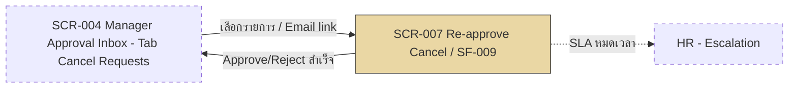

# SF-009 — Re-approve Cancel Request

## 1. Overview

| รายการ | รายละเอียด |
| --- | --- |
| Function ID | SF-009 |
| Function Name | Re-approve Cancel Request |
| Category | Screen |
| Screen Type | Detail View |
| Description | หัวหน้างาน (Line Manager) Approve หรือ Reject คำขอยกเลิก (Cancel Request) ของลูกน้องที่ส่งมาจาก SF-008 พร้อมแสดง SLA countdown 1 วันทำการ — เมื่อ Approve ระบบคืนวันลาให้พนักงานอัตโนมัติ, เมื่อ SLA หมดเวลาปุ่มถูก disable และคำขอถูก Escalate ไป HR |
| Actor / User Role | Line Manager |
| Related Requirement IDs | SFR-009, SFR-010, VR-012, NFR-010, NR-001, NR-002 |
| Source Reference | Screen SRS §2.9 (SF-009), SRS §4.1 SFR-009/010, BRD BR-015, BR-016, BR-018 |
| Version | 1.0 |
| Created By | screen-design-agent (2026-07-12) |
| Updated By | — |

## 2. Business Purpose

ควบคุมการยกเลิกคำขอลาที่ผ่านการอนุมัติมาแล้วให้ต้องผ่านการตัดสินใจของหัวหน้างานอีกครั้ง (re-approve) ก่อนที่จะมีผลจริง เพื่อป้องกันผลกระทบต่อแผนงานที่วางไว้แล้ว และรับประกันว่าเมื่อ Approve การยกเลิก วันลาจะถูกคืนให้พนักงานอย่างถูกต้องและอัตโนมัติ พร้อมบังคับ SLA 1 วันทำการเพื่อไม่ให้คำขอค้างโดยไม่มีการตอบสนอง — หากหัวหน้างานไม่ดำเนินการทันเวลา ระบบ Escalate ไปยัง HR โดยอัตโนมัติ (Source: Screen SRS §2.9.1, BRD BR-015, BR-016, BR-018)

## 3. Screen Overview

| รายการ | รายละเอียด |
| --- | --- |
| Screen Name | Re-approve Cancel (SCR-007) |
| Menu Path | Main Menu > Approval Inbox (SCR-004) > Tab "Cancel Requests" > เลือกรายการ |
| Navigation Inbound | SCR-004 Manager Approval Inbox (Tab: Cancel Requests), Email notification link (Cancel Request Submitted / SLA Reminder) |
| Navigation Outbound | SCR-004 Manager Approval Inbox (หลัง Approve/Reject สำเร็จ — ดู Assumption §13) |
| Preconditions | Login สำเร็จ (SF-001), เป็น Manager ของพนักงานเจ้าของคำขอ (RBAC), `CancelRequests.Status = 1 (Pending)`, อยู่ในเวลา SLA (`SlaDeadline` ยังไม่ผ่าน) |
| Postconditions | Approve: `CancelRequests.Status`→2 (Approved), `LeaveRequests.Status`→4 (Cancelled), `LeaveBalances.UsedDays` ถูกคืน, Email แจ้งพนักงาน+Manager+HR / Reject: `CancelRequests.Status`→3 (Rejected), `LeaveRequests.Status`→2 (Approved, คงเดิม), Email แจ้งพนักงาน / SLA หมด: `CancelRequests.Status`→4 (Escalated), ปุ่ม disabled, Email แจ้ง HR |

### Related Screens

| Screen ID | Screen Name | Description |
| --- | --- | --- |
| SCR-004 | Manager Approval Inbox | หน้าจอต้นทาง/ปลายทาง — Tab "Cancel Requests" แสดงรายการคำขอยกเลิกที่รอ Manager ดำเนินการ |
| SCR-006 | Cancel Leave Request | ต้นทางของ CancelRequest ที่ Manager กำลัง re-approve — สร้างจาก SF-008 |
| SCR-005 | Leave Request Detail | คำขอลาต้นทางที่จะถูก Cancelled/คงเดิมตามผลของหน้านี้ |

### Screen Flow

```text
Main Menu
  └── SCR-004 Manager Approval Inbox (Tab: Cancel Requests)
        └── [เลือกรายการ / Email link] → SCR-007 Re-approve Cancel (SF-009)
              ├── [Approve การยกเลิก] → SCR-004 (Status=Cancelled, balance คืนแล้ว)
              ├── [Reject การยกเลิก] → SCR-004 (Status=Approved คงเดิม)
              └── [SLA หมดเวลา] → Escalated ไปยัง HR (ปุ่ม disabled)
```



## 4. Mockup / UI Layout

| รายการ | รายละเอียด |
| --- | --- |
| Mockup Reference | — (Screen SRS §2.9.3 ระบุ "ไม่มีข้อมูลที่มากเพียงพอ หรือ mockup อ้างอิง" — ASCII ด้านล่างเป็น Assumption จาก Fields/Commands ที่ระบุใน SRS §2.9.4–2.9.5) |
| Layout Description | หน้าจอเดียว: แสดง SLA countdown timer เด่นด้านบน, รายละเอียดคำขอยกเลิก+คำขอลาเดิมแบบ read-only, ปุ่ม Approve/Reject (disable อัตโนมัติเมื่อ SLA หมด) |

```text
+----------------------------------------------------------------------+
| [LOGO]  Leave Management System        User: [MGR_ID] [MGR_NAME]    |
+----------------------------------------------------------------------+
| Menu >> Approval Inbox >> Cancel Requests >> Re-approve Cancel       |
+----------------------------------------------------------------------+
| อนุมัติการยกเลิกคำขอลา (Re-approve Cancel Request)                    |
|                                                                      |
| เวลาคงเหลือ SLA:  [ 18:32:00 ]  (นับถอยหลัง — WRN/INF ดู §9)          |
|                                                                      |
| เลขคำขอยกเลิก      CR-2026-00003     วันที่ขอยกเลิก   16 Jul 2026     |
| พนักงาน            EMP001 — สมชาย ใจดี                                |
| รายละเอียดคำขอเดิม  ลาพักผ่อนประจำปี 20–21 Jul 2026 (2 วัน)            |
| เหตุผลขอยกเลิก      ติดภารกิจด่วน                                     |
|                                                                      |
|                 [ Approve การยกเลิก ]   [ Reject การยกเลิก ]           |
+----------------------------------------------------------------------+
| (เมื่อ SLA หมด) สถานะ: Escalated ไปยัง HR — ปุ่มถูกปิดใช้งาน (INF-REAPPR-001) |
+----------------------------------------------------------------------+
```

## 5. Fields Definition

### 5.1 Cancel Request Detail (Display Only — จาก SRS §2.9.4)

| No | Field Name | Label (TH/EN) | Type | Length | Required | Default | Validation | DB Mapping | Description |
| :---: | --- | --- | --- | --- | --- | --- | --- | --- | --- |
| 1 | sla_countdown | เวลาคงเหลือ SLA / SLA Remaining | Countdown timer (HH:MM) | — | Y | — | เสมอเมื่อ Status=Cancel Requested — คำนวณจาก `CancelRequests.SlaDeadline` − เวลาปัจจุบัน (client-side, ดู Assumption §13) | `CancelRequests.SlaDeadline` (DATETIME2(0)) | นับถอยหลังจนถึง deadline SLA 1 วันทำการ |
| 2 | cancel_request_date | วันที่ขอยกเลิก / Cancel Request Date | Date (read-only) | — | Y | — | — | `CancelRequests.CreatedAt` (DATETIME2(0)) | วันที่พนักงานส่ง Cancel Request (SF-008) |
| 3 | original_leave_detail | รายละเอียดคำขอเดิม / Original Leave Detail | Text (read-only, composite) | — | Y | — | — | `LeaveTypes.TypeNameTh` (JOIN), `LeaveRequests.StartDate`, `LeaveRequests.EndDate`, `LeaveRequests.DurationDays` | ประเภทลา, ช่วงวันที่, จำนวนวันของคำขอลาต้นทาง |
| 4 | cancel_reason | เหตุผลขอยกเลิก / Cancellation Reason | Text (read-only) | — | N | — | — | `CancelRequests.Reason` (NVARCHAR(MAX)) | เหตุผลที่พนักงานระบุตอนส่งคำขอยกเลิก (SF-008 §5.2) |
| 5 | employee_name | พนักงาน / Employee | Text (read-only) | — | Y | — | — | `Employees.FullNameTh` / `FullNameEn` (JOIN ผ่าน `CancelRequests.RequestedBy`) | ชื่อพนักงานเจ้าของคำขอ (เพิ่มเติมนอกเหนือ SRS §2.9.4 — ดู Assumption §13) |

## 6. Commands / Actions

| No | Command | Type | Default State | Trigger Condition | System Response |
| :---: | --- | --- | --- | --- | --- |
| 1 | Approve การยกเลิก | Button | Enable (Disable เมื่อ SLA หมด) | SLA ยังไม่หมด | เรียก `ICancelRequestService.ApproveCancelRequestAsync()` → CancelRequest→Approved, LeaveRequest→Cancelled, คืน `UsedDays`, บันทึก ApprovalHistory → Email 3 ฝ่าย → SUC-REAPPR-001 |
| 2 | Reject การยกเลิก | Button | Enable (Disable เมื่อ SLA หมด) | SLA ยังไม่หมด — ต้องกรอกเหตุผล (ดู §10.1) | เรียก `ICancelRequestService.RejectCancelRequestAsync()` → CancelRequest→Rejected, LeaveRequest กลับเป็น Approved (คงเดิม) → Email แจ้งพนักงาน |

## 7. Screen Behavior

### 7.1 Initial Screen (onLoad)

- ดึงรายละเอียด Cancel Request (พร้อมข้อมูลคำขอลาต้นทาง) — RBAC: ต้องเป็น Manager ของพนักงานเจ้าของคำขอ (ดู Open Issue §13 — ไม่มี service method สำหรับดึงรายละเอียดนี้ระบุใน Method Signature)
- ตรวจ `CancelRequests.Status = Pending` และ `SlaDeadline` ยังไม่ผ่าน ก่อนเปิดใช้งานปุ่ม Approve/Reject
- แสดง `sla_countdown` เป็น timer นับถอยหลังแบบ real-time (client-side) จนถึง `SlaDeadline`

### 7.2 SLA หมดเวลา (Timer event — VR-012)

- ปุ่ม Approve/Reject เปลี่ยนเป็น Disable ทันที
- แสดงสถานะ "Escalated ไปยัง HR" แทน countdown พร้อม INF-REAPPR-001
- Background: IF-005 SLA Timer Event trigger `CancelRequests.Status`→4 (Escalated), `SlaEscalatedAt` ถูกบันทึก, `LeaveRequests.Status`→6 (Escalated), Email แจ้ง HR (SFR-010, Interface SRS §2.5)

### 7.3 Click "Approve การยกเลิก"

#### 7.3.1 Validation (ตามลำดับใน `ApproveCancelRequestAsync` — Method Signature §4.6)

| ลำดับ | Validation | Requirement | Error Message |
| :---: | --- | --- | --- |
| 1 | `cancelRequestId` มีอยู่จริง + `Status` ต้องเป็น Pending | — | System error (`CancelRequestNotFoundException`) |
| 2 | `SlaDeadline` ยังไม่หมด — ถ้าหมดแล้ว Status=Escalated | VR-012 | INF-REAPPR-001 (`SlaExpiredException`) |
| 3 | `managerId` ต้องเป็น Manager ของพนักงานเจ้าของ Leave Request | RBAC | ERR-SF009-001 (`UnauthorizedLeaveActionException`) |

#### 7.3.2 Insert / Update (DB Transaction — NFR-010, BR-016)

```text
BEGIN TRANSACTION
  UPDATE CancelRequests
    SET Status = 2 (Approved), ApprovedBy = @ManagerId, ApprovedAt = Current UTC Datetime
    WHERE CancelRequestId = @CancelRequestId
  UPDATE LeaveRequests
    SET Status = 4 (Cancelled), UpdatedAt = Current UTC Datetime, UpdatedBy = @ManagerId
    WHERE LeaveRequestId = @LeaveRequestId
  UPDATE LeaveBalances
    SET UsedDays -= DurationDays  -- คืนวันลา (BR-016, NR-001)
    WHERE EmployeeId = @EmployeeId AND LeaveTypeId = @LeaveTypeId AND LeaveYear = @Year
  INSERT ApprovalHistories
    (CancelRequestId, ApproverId = @ManagerId, Action = 1 (Approved), ActionAt = Current UTC Datetime)
COMMIT

AFTER COMMIT: INotificationService.PublishCancellationApprovedAsync(cancelRequestId)
  → CloudEvent "com.abccompany.leave.cancel.approved" → Email พนักงาน + Manager + HR (NR-002)
```

- สำเร็จ: แสดง SUC-REAPPR-001 แล้ว redirect ไป SCR-004 Manager Approval Inbox

### 7.4 Click "Reject การยกเลิก"

#### 7.4.1 Validation (ตามลำดับใน `RejectCancelRequestAsync` — Method Signature §4.6)

| ลำดับ | Validation | Requirement | Error Message |
| :---: | --- | --- | --- |
| 1 | `cancelRequestId` มีอยู่จริง + `Status` ต้องเป็น Pending | — | System error (`CancelRequestNotFoundException`) |
| 2 | `SlaDeadline` ยังไม่หมด | VR-012 | INF-REAPPR-001 (`SlaExpiredException`) |
| 3 | `managerId` เป็น Manager ของพนักงาน | RBAC | ERR-SF009-001 (`UnauthorizedLeaveActionException`) |
| 4 | `reason` ต้องไม่ว่าง | Method Signature §4.6 (validation ข้อ 4) | ERR-SF009-002 (`ArgumentException`) |

#### 7.4.2 Insert / Update (DB Transaction)

```text
BEGIN TRANSACTION
  UPDATE CancelRequests
    SET Status = 3 (Rejected), RejectedBy = @ManagerId, RejectedAt = Current UTC Datetime
    WHERE CancelRequestId = @CancelRequestId
  UPDATE LeaveRequests
    SET Status = 2 (Approved), UpdatedAt = Current UTC Datetime, UpdatedBy = @ManagerId  -- restore
    WHERE LeaveRequestId = @LeaveRequestId
  INSERT ApprovalHistories
    (CancelRequestId, ApproverId = @ManagerId, Action = 2 (Rejected), Reason = @reason, ActionAt = Current UTC Datetime)
COMMIT

AFTER COMMIT: INotificationService.PublishCancellationRejectedAsync(cancelRequestId, reason)
  → CloudEvent "com.abccompany.leave.cancel.rejected" → Email พนักงาน (ดู Note §13 — Method Signature ระบุ recipients = พนักงาน+HR)
```

- สำเร็จ: redirect ไป SCR-004 Manager Approval Inbox (ไม่มี Success Message ID ระบุใน SRS §2.9.7 สำหรับ Reject — ดู Assumption §13)

## 8. Business Rules

| Rule ID | Business Rule | Impact | Source Reference |
| --- | --- | --- | --- |
| BR-SF009-001 | Approve การยกเลิกต้องคืนวันลา (`UsedDays`) ให้พนักงานอัตโนมัติทันที | UPDATE `LeaveBalances.UsedDays` อยู่ใน transaction เดียวกับการเปลี่ยน Status | BRD BR-016, NR-001, NFR-010 |
| BR-SF009-002 | SLA 1 วันทำการ: Reminder 4 ชม.ก่อนหมด + Escalate ไป HR เมื่อหมด | Countdown แสดงบนหน้า, ปุ่ม Approve/Reject disabled อัตโนมัติเมื่อหมด SLA | BRD BR-018, Interface SRS §2.5, M3 (QA v3) |
| BR-SF009-003 | SLA หมด → ห้ามดำเนินการ Approve/Reject | ฝั่ง backend บังคับด้วย `SlaExpiredException` ซ้ำแม้ปุ่มถูก disable ที่ UI แล้ว (defense in depth) | VR-012 |
| BR-SF009-004 | Reject ต้องระบุเหตุผลเสมอ | ปุ่ม Reject ต้องมี field เหตุผลบังคับกรอกก่อน submit | Method Signature §4.6 (`RejectCancelRequestAsync` validation ข้อ 4) |
| BR-SF009-005 | Approve/Reject ต้องบันทึก ApprovalHistory ทุกครั้ง | INSERT `ApprovalHistories` พร้อม Action + Reason (ถ้ามี) ใน transaction เดียวกัน | Data Architecture §6.3.7, Method Signature §4.6 |
| BR-SF009-006 | Manager ต้องเป็นผู้บังคับบัญชาของพนักงานเจ้าของคำขอเท่านั้นจึงจะดำเนินการได้ | RBAC ตรวจผ่าน `Employees.ManagerId` | Method Signature §4.6, Data Architecture Assumption A3 |

```text
onLoad → ตรวจ SLA
│
├── SLA ยังไม่หมด
│   ├── Approve → คืน UsedDays + Status=Cancelled + Email 3 ฝ่าย → SUC-REAPPR-001
│   └── Reject (ต้องมีเหตุผล) → Status=Approved (คงเดิม) + Email พนักงาน
│
└── SLA หมดแล้ว
    └── ปุ่ม disabled + Status=Escalated + Email HR → INF-REAPPR-001
```

## 9. Message List

### Error Messages

| Message ID | Trigger | Message (TH) | Message (EN) |
| --- | --- | --- | --- |
| ERR-SF009-001 | ผู้ใช้ไม่ใช่ Manager ของพนักงานเจ้าของคำขอ (`UnauthorizedLeaveActionException`) | คุณไม่มีสิทธิ์ดำเนินการกับคำขอยกเลิกนี้ | You do not have permission to act on this cancellation request. |
| ERR-SF009-002 | Reject โดยไม่ระบุเหตุผล (`ArgumentException`) | กรุณาระบุเหตุผลในการปฏิเสธคำขอยกเลิก | Please provide a reason for rejecting this cancellation request. |

### Success / Info Messages

| Message ID | Trigger | Message (TH) | Message (EN) |
| --- | --- | --- | --- |
| SUC-REAPPR-001 | Re-approve (Approve) สำเร็จ | อนุมัติการยกเลิกสำเร็จ วันลาได้รับการคืนให้พนักงานแล้ว | Cancellation approved. Leave balance has been restored to the employee. |
| INF-REAPPR-001 | SLA หมดเวลา | หมดเวลาดำเนินการ คำขอถูกส่งต่อให้ HR แล้ว | Action time has expired. This request has been escalated to HR. |
| SUC-SF009-001 | Reject สำเร็จ (ดู Assumption §13 — SRS §2.9.7 ไม่ได้ระบุ Success Message สำหรับ Reject) | ปฏิเสธคำขอยกเลิกแล้ว คำขอลาเดิมยังคงมีผล | Cancellation rejected. The original leave request remains in effect. |

## 10. Popup / Sub-screen Definition

### 10.1 Reject Reason Dialog (ดู Assumption §13)

| No | Field Name | Label | Data Source | Description |
| :---: | --- | --- | --- | --- |
| 1 | reject_reason | เหตุผลการปฏิเสธ (บังคับกรอก) | Textarea, ผู้ใช้กรอก | ส่งเป็น parameter `reason` ให้ `RejectCancelRequestAsync()` — บันทึกลง `ApprovalHistories.Reason` |
| 2 | confirm_button | ยืนยัน Reject | — | Submit reject พร้อมเหตุผล — disable จนกว่าจะกรอกเหตุผล (ERR-SF009-002) |
| 3 | dismiss_button | ยกเลิก | — | ปิด dialog กลับหน้า SCR-007 โดยไม่ดำเนินการ |

## 11. Database Tables Reference

| Table Name | Alias | Description |
| --- | --- | --- |
| CancelRequests | — | SELECT รายละเอียด Cancel Request (onLoad) + UPDATE `Status`/`ApprovedBy`/`ApprovedAt`/`RejectedBy`/`RejectedAt` ตามผล Approve/Reject |
| LeaveRequests | — | UPDATE `Status` → Cancelled (Approve) หรือกลับเป็น Approved (Reject) |
| LeaveBalances | — | UPDATE `UsedDays -= DurationDays` เมื่อ Approve (คืนวันลา, BR-016) |
| LeaveTypes | — | JOIN แสดงชื่อประเภทลาของคำขอเดิม |
| Employees | — | ตรวจ RBAC ว่า `managerId` เป็น Manager ของพนักงานเจ้าของคำขอ (`Employees.ManagerId`) |
| ApprovalHistories | — | INSERT ประวัติ Approve/Reject (Immutable log) — `CancelRequestId` FK |
| NotificationLogs | — | Immutable log ของ Email แจ้งพนักงาน/Manager/HR (เขียนโดย Notification service หลัง commit) |

## 12. Exception Handling

| Error Case | Trigger Condition | System Behavior | User Message | Recovery |
| --- | --- | --- | --- | --- |
| Validation error | Reject โดยไม่ระบุเหตุผล | ไม่บันทึก, focus ที่ช่องเหตุผล | ERR-SF009-002 | กรอกเหตุผลแล้ว submit ใหม่ |
| Authorization error | ผู้ใช้ไม่ใช่ Manager ของพนักงานเจ้าของคำขอ | Block การทำรายการ | ERR-SF009-001 | กลับ SCR-004 |
| SLA expired error | Approve/Reject หลัง `SlaDeadline` ผ่านไปแล้ว (แม้ UI จะ disable ปุ่มแล้วก็ตาม — race condition) | Backend ปฏิเสธคำสั่งด้วย `SlaExpiredException`, แสดงสถานะ Escalated | INF-REAPPR-001 | ไม่มี recovery ที่หน้านี้ — คำขอถูกส่งต่อให้ HR แล้ว |
| System error | Transaction ล้มเหลว (DB error ระหว่าง UPDATE/INSERT) | Rollback ทั้งหมด (CancelRequest, LeaveRequest, LeaveBalance, ApprovalHistory) | "เกิดข้อผิดพลาด กรุณาลองใหม่" | ลอง Approve/Reject ใหม่ |

## 13. Notes / Assumptions

| ประเภท | รายละเอียด | ผลกระทบ |
| --- | --- | --- |
| Open Issue (จาก SRS) | SLA Escalate assignee ใน HR ยังไม่ระบุ (Interface SRS §2.5.9 Open Issue) | กระทบ recipient ของ Escalation Email — ต้อง confirm กับ HR |
| Open Issue (จาก SRS) | SLA "1 วันทำการ" — working hours definition ยังไม่ยืนยัน (Interface SRS §2.5.9, Method Signature Open Issue OI-002) | กระทบการคำนวณ `sla_countdown` และเวลาที่แสดงบนหน้าจอ — ต้อง confirm กับ HR |
| Assumption (เอกสารนี้) | ไม่มี service method ใน `ICancelRequestService`/`ICancelRequestRepository` สำหรับดึงรายละเอียด Cancel Request รายตัว (single-record detail สำหรับหน้านี้) — Method Signature §4.6 มีเฉพาะ Submit/Approve/Reject ไม่มี "GetCancelRequestDetailAsync" หรือเทียบเท่า มีเพียง `GetActiveByLeaveRequestAsync` (repository level, internal use) และ `GetPendingForSlaCheckAsync` (สำหรับ SLA scheduler เท่านั้น) | ต้องเพิ่ม service method ใหม่ (เช่น `ICancelRequestService.GetCancelRequestDetailAsync()`) ใน Method Signature ก่อน implement หน้านี้ — เป็นข้อค้นพบสำคัญที่ต้องแจ้ง Architect/BA |
| Assumption (เอกสารนี้) | ไม่มี service method สำหรับดึงรายการ Cancel Request ของ Manager (สำหรับ Tab "Cancel Requests" บน SCR-004) — คล้ายกรณีข้างต้น | กระทบการออกแบบ SCR-004 Tab — ควรเพิ่ม `GetPendingCancelRequestsForManagerAsync()` หรือเทียบเท่าใน Method Signature |
| Assumption (เอกสารนี้) | `sla_countdown` คำนวณแบบ client-side จาก `SlaDeadline` ที่โหลดมาตอน onLoad (ไม่มี real-time push จาก server ระบุใน SRS/Method Signature) | หากต้องการความแม่นยำสูง อาจต้องพิจารณา WebSocket/SignalR — ปัจจุบันเป็น client-side timer เท่านั้น |
| Assumption (เอกสารนี้) | field `employee_name` (§5.1) และ Popup "Reject Reason Dialog" (§10.1) ไม่ได้ระบุใน SRS §2.9.4/§2.9.5 โดยตรง — เพิ่มเพื่อให้ Manager เห็นบริบทและสอดคล้องกับ validation "reason ต้องไม่ว่าง" ใน `RejectCancelRequestAsync` (Method Signature §4.6) | ต้อง confirm กับ UX/Business ว่าต้องการแสดง field เหล่านี้จริงหรือไม่ |
| Assumption (เอกสารนี้) | Success Message สำหรับ Reject (SUC-SF009-001) เป็น Message ID ที่ตั้งใหม่ — SRS §2.9.7 ระบุเฉพาะ SUC-REAPPR-001 (Approve) และ INF-REAPPR-001 (SLA หมด) ไม่มี message สำหรับ Reject สำเร็จ | ต้องให้ BA review ข้อความและ ID |
| Note | Method Signature §4.7 (`INotificationService.PublishCancellationRejectedAsync`) ระบุ recipients = พนักงาน + HR แต่ Screen SRS §2.9.5 ระบุ Reject แจ้งเฉพาะ "พนักงาน" — เอกสารนี้ยึด Screen SRS เป็นหลักในข้อความ System Response (§6, §7.4.2) แต่ควร confirm กับ BA ว่า HR ต้องได้รับแจ้งด้วยหรือไม่ | กระทบ recipient list ของ Email Reject — ต้อง confirm กับ BA/Notification design |
| Note | Service method หลัก: `ICancelRequestService.ApproveCancelRequestAsync()`, `RejectCancelRequestAsync()` (Method Signature §4.6) — ใช้เป็น contract ระหว่าง UI กับ backend | — |

## Change Log

| Version | Date | Author | Change Type | Description | Remark |
| --- | --- | --- | --- | --- | --- |
| 1.0 | 2026-07-12 | screen-design-agent (Claude) | Created | สร้างเอกสารครั้งแรกจาก Screen SRS v1.0 (§2.9 SF-009), Data Architecture Design (CancelRequests/ApprovalHistories DDL), Method Signature §4.6 (`ICancelRequestService.ApproveCancelRequestAsync`/`RejectCancelRequestAsync`), Interface SRS §2.5 IF-005 SLA Timer | Generated ตาม template screen-design-agent |

### สรุปการเปลี่ยนแปลงสำคัญ

| ช่วง Version | การเปลี่ยนแปลง | ผลกระทบ |
| --- | --- | --- |
| 1.0 | Baseline แรก | — |
