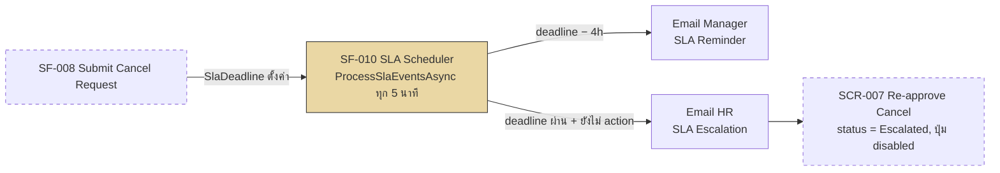

# SF-010 — SLA Reminder & Escalation

## 1. Overview

| รายการ | รายละเอียด |
| --- | --- |
| Function ID | SF-010 |
| Function Name | SLA Reminder & Escalation |
| Category | Screen |
| Screen Type | Background / System Process — ไม่มี UI หลัก (Scheduler ทำงานภายในระบบ ผลลัพธ์ปรากฏทางอ้อมบน SCR-007) |
| Description | Background scheduled job (`ISlaSchedulerService`) ตรวจ SLA ของ Cancel Request ทุก 5 นาที ส่ง Reminder Email ไปยัง Manager 4 ชั่วโมงก่อนหมด SLA และ Escalate Email ไปยัง HR เมื่อหมด SLA 1 วันทำการ พร้อมอัปเดตสถานะให้ปรากฏบน SCR-007 |
| Actor / User Role | System (ไม่มี user ใด trigger โดยตรง — ผลกระทบต่อ Line Manager ผู้ใช้ SCR-007 และ HR ผู้รับ Escalation Email) |
| Related Requirement IDs | SFR-010, SIR-004, IF-005, NFR-011, TR-004, VR-012, BR-018 |
| Source Reference | Screen SRS §2.10 (SF-010), Interface SRS §2.5 (IF-005 SLA Timer Event), SRS §4.1 SFR-010, BRD BR-018, M3 (QA v3) |
| Version | 1.0 |
| Created By | screen-design-agent (2026-07-12) |
| Updated By | — |

## 2. Business Purpose

Enforce SLA 1 วันทำการสำหรับการ re-approve Cancel Request โดยอัตโนมัติ — ลด risk ที่คำขอยกเลิกจะค้างโดยไม่มีการดำเนินการจาก Manager หากไม่ action ทันเวลา ระบบจะเตือนล่วงหน้า (Reminder) และส่งต่อให้ HR ดำเนินการแทน (Escalation) เพื่อไม่ให้พนักงานรอผลการยกเลิกนานเกินควร (Source: Screen SRS §2.10.1, Interface SRS §2.5.1, BRD BR-018)

## 3. Screen Overview

| รายการ | รายละเอียด |
| --- | --- |
| Screen Name | ไม่มีหน้าจอหลัก (Background Job) — ผลลัพธ์ปรากฏบน Re-approve Cancel (SCR-007, SF-009) |
| Menu Path | — ไม่มี (ไม่ปรากฏใน Main Menu — ทำงานเป็น `IHostedService` ภายใน Leave Web App) |
| Navigation Inbound | — ไม่มี (ไม่มีผู้ใช้ navigate เข้ามาที่ function นี้โดยตรง — เริ่มทำงานอัตโนมัติทันทีที่ Cancel Request ถูกสร้าง ผ่าน `ICancelRequestService.SubmitCancelRequestAsync()` ของ SF-008) |
| Navigation Outbound | — ไม่มี (ไม่ redirect ผู้ใช้ — ส่งผลเป็น Email + อัปเดตสถานะที่ SCR-007) |
| Preconditions | มี `CancelRequests` record ที่ `Status = Pending (1)` และ `SlaDeadline` ยังไม่ผ่าน หรือ ผ่านแล้ว |
| Postconditions | Reminder: `SlaReminderSentAt` ถูกบันทึก + Email ส่งถึง Manager / Escalation: `CancelRequests.Status = Escalated (4)`, `SlaEscalatedAt` ถูกบันทึก, `LeaveRequests.Status = Escalated (6)` (ดู Assumption §13), Email ส่งถึง HR, ปุ่ม Approve/Reject บน SCR-007 ถูก disable (VR-012) |

### Related Screens

| Screen ID | Screen Name | Description |
| --- | --- | --- |
| SCR-007 | Re-approve Cancel (Manager) | หน้าจอที่ได้รับผลกระทบทางอ้อม — countdown, status indicator "Escalated" และปุ่ม Approve/Reject disabled ถูกกำหนดโดย SF-010 (ดู SF-009 §2.9.6, VR-012) |

### Screen Flow

```text
SF-008 Submit Cancel Request
  └── CancelRequests สร้างใหม่ (Status=Pending, SlaDeadline=now+1 วันทำการ)
        └── ISlaSchedulerService เริ่ม monitor (ทุก 5 นาที, 24/7 — TR-004)
              ├── [SlaDeadline − 4 ชม.] → SLA Reminder → Email Manager (ไม่กระทบ SCR-007)
              ├── [Manager Approve/Reject ก่อนหมด SLA] → CancelRequests.Status เปลี่ยน → หลุดจาก monitoring queue
              └── [ถึง SlaDeadline ยังไม่ action] → SLA Escalation → Email HR + SCR-007 แสดง "Escalated" + ปุ่ม disabled
```



## 4. Mockup / UI Layout

— ไม่มี เหตุผล: SF-010 เป็น background scheduled job ไม่มีหน้าจอของตัวเอง (Screen SRS §2.10.2 "ไม่มีหน้าจอหลัก") ผลลัพธ์ที่ผู้ใช้เห็นได้ (countdown, "Escalated" indicator, ปุ่ม disabled) ถูก design ไว้ที่ SF-009 §2.9.3–2.9.4 (SCR-007) แล้ว เอกสารนี้จึงอธิบายเฉพาะ system behavior ที่ไปกระทบ SCR-007 ในหัวข้อ §7

## 5. Fields Definition

— ไม่มี เหตุผล: ไม่มี UI form/field ให้ผู้ใช้กรอกหรือเห็นโดยตรงจาก function นี้ ข้อมูลที่ scheduler ใช้เป็น internal event data ของ IF-005 (`cancel_request_id`, `leave_request_id`, `sla_deadline`, `event_type`, `manager_id`, `employee_id` — Interface SRS §2.5.4) ไม่ใช่ field บนหน้าจอ ฟิลด์ `sla_countdown` ที่ผู้ใช้เห็นจริงถูกกำหนดไว้ที่ SF-009 §2.9.4 (SCR-007)

## 6. Commands / Actions

— ไม่มี เหตุผล: ไม่มีปุ่ม/action ที่ผู้ใช้กดในหน้าจอนี้ — การทำงานทั้งหมดถูก trigger โดย scheduler (`ISlaSchedulerService.ProcessSlaEventsAsync()`) อัตโนมัติทุก 5 นาที ไม่ใช่ user command (Method Signature §4.10)

## 7. Screen Behavior

<!-- SF-010 เป็น background function — หัวข้อนี้อธิบาย System Behavior ของ scheduler แทน Screen Behavior ตาม UI -->

### 7.1 Scheduler Execution Cycle (System Trigger — แทน onLoad)

- `ISlaSchedulerService` เป็น `IHostedService`/`BackgroundService` ที่ทำงานต่อเนื่อง 24/7 รวมนอกเวลาทำการ (TR-004, Interface SRS §2.5.2) เรียก `ProcessSlaEventsAsync(checkTime)` ทุก 5 นาที — ภายใน delay tolerance ≤ 15 นาทีตาม NFR-011 (Method Signature §4.10)
- แต่ละรอบ query ผ่าน `ICancelRequestRepository.GetPendingForSlaCheckAsync(checkTime)`: `CancelRequests.Status = Pending (1)` AND (`SlaDeadline - 4h ≤ checkTime` [Reminder window] OR `SlaDeadline ≤ checkTime` [Escalation window]) — ใช้ index `IX_CancelRequests_Status_SlaDeadline` (Data Architecture §6.5)

### 7.2 SLA Reminder Event

- เงื่อนไข: `SlaDeadline - checkTime ≤ 4 ชั่วโมง` AND `SlaReminderSentAt IS NULL` (BR-018, IF-005 §2.5.5)
- Action: เรียก `INotificationService.PublishSlaReminderAsync(cancelRequestId)` → CloudEvent `com.abccompany.leave.sla.reminder` → ผ่าน IF-002 → Email ถึง Manager (Method Signature §4.9)
- อัปเดต `CancelRequests.SlaReminderSentAt = checkTime` เพื่อป้องกันส่งซ้ำในรอบถัดไป
- บันทึก `NotificationLogs` (`EventType = 'SLAReminder'`, `RecipientRole = 'Manager'`) + log `INF-IF005-001`
- ไม่มีผลกระทบต่อ UI บน SCR-007 — countdown ยังคงเดินต่อตามปกติ (SF-009 §2.9.4)

### 7.3 SLA Escalation Event

- เงื่อนไข: `SlaDeadline ≤ checkTime` AND `SlaEscalatedAt IS NULL` (BR-018, VR-012)
- Action: อัปเดต `CancelRequests.Status = Escalated (4)`, `SlaEscalatedAt = checkTime`; อัปเดต `LeaveRequests.Status = Escalated (6)` (ดู Assumption §13 — ทั้งสอง table มี state "Escalated" แยกกัน)
- เรียก `INotificationService.PublishSlaEscalatedAsync(cancelRequestId)` → CloudEvent `com.abccompany.leave.sla.escalated` → ผ่าน IF-002 → Email ถึง HR (recipient — ดู Open Issue §13)
- บันทึก `NotificationLogs` (`EventType = 'SLAEscalated'`, `RecipientRole = 'HR'`) + log `INF-IF005-002`
- **ผลที่ปรากฏบน SCR-007 (SF-009 §2.9.6):** countdown ถูกซ่อน, แสดงสถานะ "Escalated ไปยัง HR" (`INF-REAPPR-001`), ปุ่ม Approve/Reject ถูก disable ทันที (VR-012) — SF-010 คือ source ของการเปลี่ยน state นี้

### 7.4 Manager Action ก่อนหมด SLA (Timer Exclusion)

- เมื่อ Manager Approve/Reject ผ่าน SF-009 ก่อนถึง `SlaDeadline`: `ICancelRequestService.ApproveCancelRequestAsync()` / `RejectCancelRequestAsync()` เปลี่ยน `CancelRequests.Status` เป็น Approved(2)/Rejected(3) — request จะไม่ถูกดึงมาใน `GetPendingForSlaCheckAsync()` รอบถัดไปอีก (filter `Status = Pending` เท่านั้น) จึงไม่ trigger Reminder/Escalation ต่อ (IF-005 §2.5.5 "Manager Action ก่อนหมด SLA")

### 7.5 Scheduler Recovery หลัง Downtime

- เมื่อ scheduler restart (เช่น deploy ใหม่/ระบบล่มชั่วคราว): รอบแรกหลัง restart เรียก `ProcessSlaEventsAsync(DateTime.UtcNow)` ทันที — ตรวจพบ `CancelRequests` ที่ `SlaDeadline` ผ่านไปแล้วระหว่าง downtime และ `SlaEscalatedAt IS NULL` → trigger Escalation ทันที (Interface SRS §2.5.6 "Scheduler หยุดทำงานกะทันหัน")
- กรณี request ที่ทั้ง Reminder window และ Escalation window ผ่านไปพร้อมกัน (downtime ยาว): ระบบให้ priority กับ Escalation เท่านั้น ไม่ส่ง Reminder ย้อนหลัง (ดู Assumption §13)

### 7.6 Monitoring Scheduler Delay

- หาก scheduler ล่าช้าเกิน 15 นาที (NFR-011): log `WRN-IF005-001` สำหรับทีม admin ตรวจสอบ (Interface SRS §2.5.7)

## 8. Business Rules

| Rule ID | Business Rule | Impact | Source Reference |
| --- | --- | --- | --- |
| BR-SF010-001 | Reminder Email ส่งก่อนหมด SLA 4 ชั่วโมง | Trigger เมื่อ `SlaDeadline − checkTime ≤ 4h` AND ยังไม่เคยส่ง | BRD BR-018, IF-005 §2.5.5, M3 (QA v3) |
| BR-SF010-002 | Escalate ไป HR ทันทีเมื่อหมด SLA และ Manager ยังไม่ action | เปลี่ยน Status เป็น Escalated ทั้ง CancelRequests และ LeaveRequests + disable ปุ่มที่ SCR-007 | BRD BR-018, VR-012 |
| BR-SF010-003 | Scheduler ทำงาน 24/7 รวมนอกเวลาทำการ | ไม่หยุดทำงานช่วง non-business hours เพราะ SLA อาจ span ข้ามวัน | TR-004 |
| BR-SF010-004 | Scheduler delay tolerance ≤ 15 นาที | ต้อง run ทุก ≤ 15 นาที พร้อม monitoring/alert เมื่อเกิน | NFR-011 |
| BR-SF010-005 | Manager action ก่อน deadline ยกเลิก timer โดยปริยาย | ไม่มี Reminder/Escalation เพิ่มเติมหลัง Status เปลี่ยนจาก Pending | IF-005 §2.5.5 |
| BR-SF010-006 | Scheduler recovery ต้องตรวจ SLA ย้อนหลังหลัง downtime | ป้องกันคำขอที่ควร Escalate แต่ตกหล่นระหว่าง scheduler หยุดทำงาน | IF-005 §2.5.6 |

```text
ProcessSlaEventsAsync(checkTime) ทุก 5 นาที (24/7)
│
├── Query CancelRequests: Status=Pending AND (SlaDeadline-4h ≤ checkTime OR SlaDeadline ≤ checkTime)
│
├── SlaDeadline ≤ checkTime (หมดแล้ว) AND SlaEscalatedAt IS NULL
│   └── Escalate: Status=Escalated(4/6), Email HR, SCR-007 disable ปุ่ม (VR-012)
│
└── SlaDeadline − checkTime ≤ 4h AND SlaReminderSentAt IS NULL (ยังไม่หมด)
    └── Reminder: บันทึก SlaReminderSentAt, Email Manager (ไม่กระทบ SCR-007)
```

## 9. Message List

### Error Messages

— ไม่มี เหตุผล: ไม่มี user-facing validation error เนื่องจากเป็น background job ไม่มีผู้ใช้ interact โดยตรง (กรณี error ของระบบ ดู §12 Exception Handling)

### Success / Info Messages

| Message ID | Trigger | Message (TH) | Message (EN) |
| --- | --- | --- | --- |
| WRN-IF005-001 | Scheduler delay เกิน 15 นาที (monitor log — Interface SRS §2.5.7) | SLA Scheduler มีความล่าช้าผิดปกติ — กรุณาตรวจสอบระบบ | SLA Scheduler delay detected — please check system health. |
| INF-IF005-001 | SLA Reminder trigger สำเร็จ (log) | Reminder Email สำหรับ {cancel_request_id} ส่งแล้ว ({datetime}) | SLA Reminder for {cancel_request_id} triggered ({datetime}). |
| INF-IF005-002 | SLA Escalation trigger สำเร็จ (log) | Escalation Email สำหรับ {cancel_request_id} ส่งแล้ว ไปยัง HR ({datetime}) | SLA Escalation for {cancel_request_id} triggered to HR ({datetime}). |
| INF-REAPPR-001 | ปรากฏบน SCR-007 หลัง Escalation (source: SF-009 §2.9.7 — cross-reference) | หมดเวลาดำเนินการ คำขอถูกส่งต่อให้ HR แล้ว | Action time has expired. This request has been escalated to HR. |

## 10. Popup / Sub-screen Definition

— ไม่มี เหตุผล: ไม่มีหน้าจอหรือ popup ใด ๆ เกิดจาก function นี้โดยตรง

## 11. Database Tables Reference

| Table Name | Alias | Description |
| --- | --- | --- |
| CancelRequests | — | SELECT ผ่าน `GetPendingForSlaCheckAsync` (index `IX_CancelRequests_Status_SlaDeadline`) — UPDATE `SlaReminderSentAt` (Reminder) / `Status=4, SlaEscalatedAt` (Escalation) |
| LeaveRequests | — | UPDATE `Status = 6 (Escalated)` เมื่อ Escalation trigger (ดู Assumption §13) — เชื่อมผ่าน `CancelRequests.LeaveRequestId` |
| Employees | — | JOIN หา email/รหัส Manager (ผ่าน `LeaveRequests.EmployeeId → ManagerId`) และ HR recipient (ดู Open Issue §13) สำหรับส่ง Email |
| NotificationLogs | — | INSERT log ทุกครั้งที่ trigger Reminder/Escalation (`EventType = 'SLAReminder' / 'SLAEscalated'`, `CancelRequestId`) |

## 12. Exception Handling

| Error Case | Trigger Condition | System Behavior | User Message | Recovery |
| --- | --- | --- | --- | --- |
| Validation error | — ไม่มี (ไม่มี user input ให้ validate) | — | — | — |
| Integration error | Email Reminder/Escalation ส่งไม่สำเร็จ (IF-002 ล่ม) | บันทึก `NotificationLogs.DeliveryStatus = Failed(3)`, `RetryCount++` — scheduler รอบถัดไปไม่ retry ทันที (ดู Assumption §13) | — (ไม่มี UI แสดง — เป็น log ฝั่ง system) | Retry อัตโนมัติตาม Notification retry policy / admin ตรวจ log |
| System error | Scheduler delay เกิน 15 นาที (host ช้า/downtime) | Log `WRN-IF005-001`, alert admin | WRN-IF005-001 | ทีม admin ตรวจสอบ infrastructure |
| System error | Scheduler หยุดทำงานกะทันหัน (crash/restart) | รอบแรกหลัง restart ตรวจ SLA ย้อนหลังทั้งหมดและ trigger Escalation ที่ตกหล่น (§7.5) | INF-IF005-002 (สำหรับรายการที่ escalate) | ทำงานต่ออัตโนมัติ — ไม่ต้องมี manual intervention |

## 13. Notes / Assumptions

| ประเภท | รายละเอียด | ผลกระทบ |
| --- | --- | --- |
| Open Issue (จาก SRS) | SLA Escalate recipient ใน HR ยังไม่ระบุ (ตำแหน่ง/email) | กระทบ `PublishSlaEscalatedAsync` recipient — Interface SRS §2.5.9, Method Signature OI-003 — ต้อง HR ยืนยัน |
| Open Issue (จาก SRS) | Working hours definition ของ "1 วันทำการ" ยังไม่ชัดเจน (รวม/ไม่รวมวันหยุด, ชั่วโมงทำงาน) | กระทบการคำนวณ `SlaDeadline` ใน `SubmitCancelRequestAsync` — Interface SRS §2.5.9, Method Signature OI-002 — ต้อง HR ยืนยัน + กำหนด `IWorkingCalendarService` |
| Assumption (จาก SRS) | Scheduler เป็น internal component (`IHostedService`) ของ Leave Web App ไม่ใช่ third-party scheduler | Interface SRS §2.5.9 — กระทบ infrastructure design (ไม่ต้องมี external scheduler dependency) |
| Assumption (เอกสารนี้) | Escalation อัปเดตทั้ง `CancelRequests.Status = 4 (Escalated)` และ `LeaveRequests.Status = 6 (Escalated)` พร้อมกัน — SRS/Method Signature ไม่ได้ระบุ sync ระหว่าง 2 ตารางนี้อย่างชัดเจน แต่ทั้งคู่มี state "Escalated" แยกกันใน Data Architecture | ต้อง confirm กับทีม backend/BA ว่า sync 2 สถานะพร้อมกันในทรานแซกชันเดียวหรือไม่ |
| Assumption (เอกสารนี้) | Email failure ของ SLA Reminder/Escalation ใช้ retry pattern เดียวกับ `NotificationLogs.DeliveryStatus`/`RetryCount` (ตาม pattern SFR-003/SFR-013) — IF-005 ไม่ได้ระบุ retry logic โดยตรง | ต้อง confirm retry interval/max retry กับทีม infra |
| Assumption (เอกสารนี้) | กรณี Scheduler recovery หลัง downtime ยาว ที่ทั้ง Reminder window และ Escalation window ผ่านไปพร้อมกัน: ให้ priority Escalation เท่านั้น ไม่ส่ง Reminder ย้อนหลัง | SRS ไม่ได้ระบุกรณีนี้ชัดเจน — ต้อง confirm กับ BA |
| Note | Service หลักของ function นี้: `ISlaSchedulerService.ProcessSlaEventsAsync()` (Method Signature §4.10), `ICancelRequestRepository.GetPendingForSlaCheckAsync()` (§3.5), `INotificationService.PublishSlaReminderAsync()` / `PublishSlaEscalatedAsync()` (§4.9) | ใช้เป็น contract หลักสำหรับ implement background job นี้ |

## Change Log

| Version | Date | Author | Change Type | Description | Remark |
| --- | --- | --- | --- | --- | --- |
| 1.0 | 2026-07-12 | screen-design-agent (Claude) | Created | สร้างเอกสารครั้งแรกจาก Screen SRS v1.0 (§2.10 SF-010), Interface SRS §2.5 (IF-005 SLA Timer Event), SF-009 §2.9 (SCR-007 ผลกระทบ), Data Architecture Design (CancelRequests/LeaveRequests DDL), Method Signature §3.5 (`ICancelRequestRepository`), §4.9 (`INotificationService`), §4.10 (`ISlaSchedulerService`) | Generated ตาม template screen-design-agent |

### สรุปการเปลี่ยนแปลงสำคัญ

| ช่วง Version | การเปลี่ยนแปลง | ผลกระทบ |
| --- | --- | --- |
| 1.0 | Baseline แรก | — |
