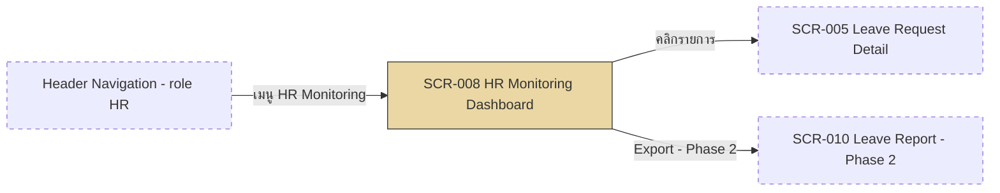

# SF-011 — HR Monitoring Dashboard

## 1. Overview

| รายการ | รายละเอียด |
| --- | --- |
| Function ID | SF-011 |
| Function Name | HR Monitoring Dashboard |
| Category | Screen |
| Screen Type | Search List (Tabs + Filter + Drill-down) |
| Description | แสดงรายการคำขอลาทั้งองค์กร แบ่งเป็น 3 tab (ทั้งหมด/รอดำเนินการ/Cancel Requested) กรองได้หลายเกณฑ์ (สถานะ, แผนก, ประเภทพนักงาน, ประเภทลา, ช่วงวันที่) ให้ HR ติดตามแบบ real-time พร้อม drill down ดูรายละเอียดและ export (Phase 2) |
| Actor / User Role | HR |
| Related Requirement IDs | SFR-011, SCR-008, RFR-001, NFR-005, BR-007 |
| Source Reference | Screen SRS §2.11 (SF-011), SRS §4.1 SFR-011, BRD §3.1 BR-007, BRD §4 Actor (HR) |
| Version | 1.0 |
| Created By | screen-design-agent (2026-07-12) |
| Updated By | — |

## 2. Business Purpose

แทนที่การควบคุมด้วย Excel — ให้ HR เห็นภาพรวมคำขอลาทั้งองค์กรรวมศูนย์อยู่ในระบบเดียว สามารถกรองและติดตามคำขอที่ต้องเฝ้าระวัง (Pending, Cancel Requested) ได้แบบ real-time โดยไม่ต้องขอข้อมูลจาก Manager แต่ละคน ลดความเสี่ยงจากข้อมูลกระจัดกระจายและไม่ทันเหตุการณ์ (Source: Screen SRS §2.11.1, BRD §3.1 BR-007)

## 3. Screen Overview

| รายการ | รายละเอียด |
| --- | --- |
| Screen Name | HR Monitoring Dashboard (SCR-008) |
| Menu Path | Main Menu > Header Navigation (แสดงเฉพาะ role = HR) > HR Monitoring Dashboard |
| Navigation Inbound | Header Navigation จากทุกหน้า (เฉพาะ role = HR — Screen SRS §2.11.2) |
| Navigation Outbound | SCR-005 Leave Request Detail (HR view — คลิก "ดูรายละเอียด"), SCR-010 Leave Report (Phase 2 — คลิก "Export", ดู Assumption §13) |
| Preconditions | Login เป็น HR (`Employees` role/policy = HR) |
| Postconditions | HR เห็นภาพรวมคำขอลาทั้งองค์กรตาม filter/tab ที่เลือก สามารถ drill down ไป detail ได้ — ไม่มีการเปลี่ยนแปลง DB state (read-only) |

### Related Screens

| Screen ID | Screen Name | Description |
| --- | --- | --- |
| SCR-005 | Leave Request Detail | ปลายทางเมื่อคลิก "ดูรายละเอียด" — HR เห็นรายละเอียดคำขอทุกคนในองค์กร (NFR-005) |
| SCR-010 | Leave Report (Phase 2) | ปลายทางเมื่อคลิก "Export" — ใช้ filter ปัจจุบันเป็น initial criteria (SF-014, Phase 2) |
| SCR-007 | Re-approve Cancel (Manager) | ข้อมูลสถานะ Cancel Requested / Escalated ที่แสดงใน tab "Cancel Requested" มาจากกระบวนการเดียวกับ SCR-007/SF-009/SF-010 |

### Screen Flow

```text
Header Navigation (role=HR)
  └── SF-011 HR Monitoring Dashboard (SCR-008)
        ├── [เลือก Tab] → Refresh list ตาม preset filter ของ tab
        ├── [Apply Filter] → Refresh list ตาม criteria
        ├── [คลิกรายการ] → SCR-005 Leave Request Detail (HR view)
        └── [Export] (Phase 2) → SCR-010 Leave Report
```



## 4. Mockup / UI Layout

| รายการ | รายละเอียด |
| --- | --- |
| Mockup Reference | Screen SRS §2.11.3 อ้างอิง style จาก `91-project-asses/ascii-mockup/report/leave-monitoring-report/` — ตรวจสอบแล้วไม่พบไฟล์จริงในโปรเจกต์ (ดู Open Issue §13) ASCII ด้านล่างสร้างจาก Tabs (§2.11.4) + Filter Fields (§2.11.5) + Commands (§2.11.6) ใน SRS เป็น Assumption |
| Layout Description | Tab bar ด้านบน (3 tabs), แถบ filter หลายเกณฑ์, ตาราง list ผลลัพธ์พร้อม pagination, ปุ่ม Export (Phase 2) มุมขวาบน |

```text
+----------------------------------------------------------------------------------+
| [LOGO]  Leave Management System                    User: [HR_ID]  [HR_NAME]     |
+----------------------------------------------------------------------------------+
| Menu >> HR Monitoring Dashboard                                                   |
+----------------------------------------------------------------------------------+
| [ ทั้งหมด (128) ] [ รอดำเนินการ (12) ] [ Cancel Requested (3) ]      [ Export ]   |
+----------------------------------------------------------------------------------+
| สถานะ [ทั้งหมด v]  แผนก [ทั้งหมด v]  ประเภทพนักงาน [ทั้งหมด v]                    |
| ประเภทลา [ทั้งหมด v]  ช่วงวันที่ [ 2026-07-01 ] – [ 2026-07-31 ]     [ ค้นหา ]     |
+----------------------------------------------------------------------------------+
| เลขคำขอ       | พนักงาน        | แผนก      | ประเภทลา  | วันที่          | จำนวน | สถานะ     |
| LR-2026-00120 | Somchai J.     | Sales     | ลาป่วย    | 10 Jul 2026    | 2     | [Pending] |
| LR-2026-00118 | Suda K.        | HR        | ลาพักผ่อน | 12–14 Jul 2026 | 3     | [Approved]|
| CR-2026-00005 | Anan P.        | IT        | ลาพักผ่อน | 05 Jul 2026    | 1     | [Escalated]|
+----------------------------------------------------------------------------------+
|                                                     [ < 1 2 3 ... 7 > ]           |
+----------------------------------------------------------------------------------+
```

## 5. Fields Definition

### 5.1 Filter Section (Screen SRS §2.11.5)

| No | Field Name | Label (TH/EN) | Type | Length | Required | Default | Validation | DB Mapping | Description |
| :---: | --- | --- | --- | --- | --- | --- | --- | --- | --- |
| 1 | filter_status | สถานะ / Status | Multi-select Dropdown | — | N | ทั้งหมด (null) | ค่าที่เลือกได้: Pending/Approved/Rejected/Cancelled/Cancel Requested (Screen SRS §2.11.5) | `LeaveRequests.Status` (TINYINT: 1=Pending, 2=Approved, 3=Rejected, 4=Cancelled, 5=CancelRequested, 6=Escalated) | กรองตามสถานะคำขอ — ส่งเป็นส่วนหนึ่งของ `HrLeaveFilterDto.Status` |
| 2 | filter_department | แผนก / Department | Dropdown | — | N | ทั้งหมด (null) | ค่าจาก distinct `Employees.Department` (ไม่มี master table แผนก — ดู Assumption §13) | `Employees.Department` (NVARCHAR(200)) | กรองตามแผนกของเจ้าของคำขอ — `HrLeaveFilterDto.Department` |
| 3 | filter_employee_type | ประเภทพนักงาน / Employee Type | Dropdown (ประจำ/Outsource/ทั้งหมด) | — | N | ทั้งหมด (null) | ค่า: 1=Regular, 2=Outsource | `Employees.EmployeeType` (TINYINT: 1=Regular, 2=Outsource) | กรองตามประเภทพนักงาน — `HrLeaveFilterDto.EmployeeType` |
| 4 | filter_leave_type | ประเภทการลา / Leave Type | Dropdown (7 ประเภท + ทั้งหมด) | — | N | ทั้งหมด (null) | ค่าจาก `LeaveTypes` master (7 ประเภท) | `LeaveTypes.LeaveTypeId` (TINYINT) → `LeaveRequests.LeaveTypeId` | กรองตามประเภทลา — `HrLeaveFilterDto.LeaveTypeId` |
| 5 | filter_date_range | ช่วงวันที่ / Date Range | Date Range Picker | — | N | ว่าง (ไม่กรอง) | Start ≤ End (ถ้าระบุทั้งคู่) | `LeaveRequests.StartDate`, `LeaveRequests.EndDate` (DATE) | กรองตามวันที่ยื่น/วันที่ลา — `HrLeaveFilterDto.StartDate/EndDate` (ดู Assumption §13 เรื่องขอบเขต "วันที่ยื่น" vs "วันที่ลา") |

### 5.2 Result Grid Columns (Assumption เอกสารนี้ — ดู Assumption §13)

| No | Field Name | Label (TH/EN) | Type | Length | Required | Default | Validation | DB Mapping | Description |
| :---: | --- | --- | --- | --- | --- | --- | --- | --- | --- |
| 1 | request_no | เลขคำขอ / Request No. | Text (read-only, link) | 30 | Y | — | — | `LeaveRequests.LeaveRequestRef` (NVARCHAR(30)) | คลิกเพื่อเปิด SCR-005 (HR view) |
| 2 | employee_name | พนักงาน / Employee | Text (read-only) | — | Y | — | — | `Employees.FullNameTh` (JOIN ผ่าน `LeaveRequests.EmployeeId`) | ชื่อเจ้าของคำขอ — field นี้ไม่มีใน `LeaveRequestSummaryDto` ปัจจุบัน (ดู Open Issue §13) |
| 3 | department | แผนก / Department | Text (read-only) | — | N | — | — | `Employees.Department` | แผนกของเจ้าของคำขอ |
| 4 | leave_type | ประเภท / Leave Type | Text (read-only) | — | Y | — | — | `LeaveTypes.TypeNameTh` (JOIN ผ่าน `LeaveRequests.LeaveTypeId`) | ประเภทการลา |
| 5 | leave_dates | วันที่ / Dates | Date range (read-only) | — | Y | — | — | `LeaveRequests.StartDate`, `LeaveRequests.EndDate` (DATE) | ช่วงวันที่ลา |
| 6 | duration_days | จำนวน / Days | Number (read-only) | — | Y | — | — | `LeaveRequests.DurationDays` (DECIMAL(10,2)) | จำนวนวันลา |
| 7 | status | สถานะ / Status | Badge (color-coded, read-only) | — | Y | — | — | `LeaveRequests.Status` (TINYINT 1–6) | สถานะคำขอ — Escalated (6) แสดง badge สีแดง |

### 5.3 Tab Summary Count (Assumption เอกสารนี้)

| No | Field Name | Label (TH/EN) | Type | Length | Required | Default | Validation | DB Mapping | Description |
| :---: | --- | --- | --- | --- | --- | --- | --- | --- | --- |
| 1 | tab_count | จำนวนรายการต่อ Tab | Badge (Number, read-only) | — | N | 0 | — | `COUNT(LeaveRequests.LeaveRequestId)` ตาม preset filter ของแต่ละ tab | ตอบสนอง SFR-011 output "summary counts" — SRS ไม่ระบุ UI ที่ชัดเจน ดู Assumption §13 |

## 6. Commands / Actions

| No | Command | Type | Default State | Trigger Condition | System Response |
| :---: | --- | --- | --- | --- | --- |
| 1 | ค้นหา / Filter | Button | Enable | กด Apply filter (Screen SRS §2.11.6) | เรียก `ILeaveRequestService.GetAllForHrAsync(HrLeaveFilterDto, PaginationDto)` → Refresh list ตาม filter ที่เลือก |
| 2 | ดูรายละเอียด | Link (row click) | Enable | คลิก row | Navigate ไป SCR-005 Leave Request Detail (HR view — เห็นได้ทุกคำขอ, NFR-005) |
| 3 | Export | Button | Enable (Phase 2) / Hidden หรือ Disabled (Phase 1 — ดู Assumption §13) | คลิก Export | ดาวน์โหลดไฟล์รายงานตาม filter ปัจจุบัน — เชื่อมโยงไป SF-014 Leave Report Export (SCR-010, RFR-001/RFR-002) |
| 4 | เลือก Tab | Tab | Enable | คลิก Tab | เปลี่ยน preset `filter.Status` ตาม tab แล้ว refresh list (§7.2) |

## 7. Screen Behavior

### 7.1 Initial Screen (onLoad)

- โหลด Tab-01 "ทั้งหมด / All Requests" เป็น default (Screen SRS §2.11.4) — เรียก `ILeaveRequestService.GetAllForHrAsync(filter = ค่าว่างทั้งหมด, pagination = PageNumber:1, PageSize:20, SortBy:"CreatedAt", SortDescending:true)` (Method Signature §4.4)
- RBAC enforce ที่ Backend: caller ต้องมี Role = HR (`[Authorize(Policy="HrOnly")]`) — เห็นข้อมูลทุก department/employee type ตาม NFR-005, BR-007
- คำนวณ summary count ของแต่ละ tab แสดงเป็น badge (§5.3)

### 7.2 เลือก Tab (onClick)

- TAB-01 ทั้งหมด/All Requests: `filter.Status = null` (ไม่กรองสถานะ)
- TAB-02 รอดำเนินการ/Pending: `filter.Status = Pending (1)`
- TAB-03 Cancel Requested: `filter.Status = CancelRequested (5)` (ดู Assumption §13 — Escalated (6) ไม่มี tab แยกตาม SRS §2.11.4 ระบุเพียง 3 tab)
- เปลี่ยน tab แล้ว reset pagination กลับหน้า 1 และ refresh list ตาม preset filter (คง filter อื่นที่ผู้ใช้เลือกไว้)

### 7.3 Click "ค้นหา / Filter"

#### 7.3.1 Validation (ตามลำดับใน service method)

| ลำดับ | Validation | Requirement | Error Message |
| :---: | --- | --- | --- |
| 1 | Caller Role = HR | NFR-005, BR-007 | ERR-SF011-002 (Unauthorized — ปกติถูก block ที่ระดับ routing/menu ก่อนถึงหน้านี้) |
| 2 | filter_date_range: Start ≤ End (ถ้าระบุ) | Screen SRS §2.11.5 (implicit) | ERR-SF011-003 |

- Validation ไม่ผ่าน: ไม่ refresh list, แสดง error message ตามตาราง

#### 7.3.2 Insert / Update (DB Transaction ถ้ามี)

```text
— ไม่มี DB Transaction (หน้าจอนี้อ่านอย่างเดียว — read-only monitoring dashboard)

SELECT (onLoad / onFilter / onTab):
  LeaveRequests JOIN Employees (ON EmployeeId) JOIN LeaveTypes (ON LeaveTypeId)
    WHERE IsDeleted = 0
      AND (@Status IS NULL OR Status = @Status)
      AND (@Department IS NULL OR Employees.Department = @Department)
      AND (@EmployeeType IS NULL OR Employees.EmployeeType = @EmployeeType)
      AND (@LeaveTypeId IS NULL OR LeaveTypeId = @LeaveTypeId)
      AND (@StartDate IS NULL OR StartDate >= @StartDate)
      AND (@EndDate IS NULL OR EndDate <= @EndDate)
    ORDER BY CreatedAt DESC
    (via ILeaveRequestService.GetAllForHrAsync → ILeaveRequestRepository.GetAllAsync(HrLeaveFilterDto, PaginationDto))
```

### 7.4 Click row "ดูรายละเอียด"

- Navigate ไป SCR-005 Leave Request Detail ของคำขอนั้น — HR เห็นได้ทุก field รวม ApprovalHistory (NFR-005, SF-006/SFR-006)

### 7.5 Click "Export" (Phase 2)

- Phase 1: ปุ่มนี้ hidden หรือ disabled พร้อม tooltip "จะเปิดใช้งานใน Phase 2" (ดู Assumption §13)
- Phase 2: ส่ง filter ปัจจุบันเป็น initial criteria ไปยัง SF-014 Leave Report Export (SCR-010) — ไม่ implement ใน scope เอกสารนี้

## 8. Business Rules

| Rule ID | Business Rule | Impact | Source Reference |
| --- | --- | --- | --- |
| BR-SF011-001 | HR เห็นข้อมูลคำขอลาทั้งองค์กร (ทุก department, ทุก employee type) | ไม่มีการ filter ตาม department ของ HR เอง — enforce RBAC เป็น "all org visibility" ที่ Backend | BRD §3.1 BR-007, NFR-005 |
| BR-SF011-002 | Enforce RBAC ที่ระดับ Backend เท่านั้น | `GetAllForHrAsync` ตรวจ Role=HR ผ่าน `[Authorize(Policy="HrOnly")]` — ไม่พึ่ง frontend ซ่อนเมนูอย่างเดียว | Method Signature §4.4 (validation), NFR-005 |
| BR-SF011-003 | Filter หลายเกณฑ์ทำงานแบบ AND ร่วมกัน (status, department, employee type, leave type, date range) | ทุก criteria ที่ระบุต้องตรงพร้อมกันจึงจะแสดงผล | Screen SRS §2.11.5 |
| BR-SF011-004 | filter_status รองรับ multi-select | ผู้ใช้เลือกได้มากกว่า 1 สถานะพร้อมกัน — ต่างจาก tab ที่ preset สถานะเดียว | Screen SRS §2.11.5 |
| BR-SF011-005 | Export เป็น Phase 2 — ไม่ implement ใน Phase 1 | ปุ่ม Export ไม่ทำงานจริงใน Phase 1 (ต้องรอ SF-014/RFR-001/RFR-002) | BRD §3.1 BR-010, Screen SRS §2.11.6 |

```text
onLoad → RBAC check (Role=HR)
│
├── ไม่ใช่ HR → block (ปกติถูกกันที่ routing/menu ก่อนเข้าหน้านี้)
│
└── เป็น HR → default Tab "ทั้งหมด" (filter.Status=null)
    ├── เลือก Tab → preset filter.Status ตาม tab (§7.2)
    ├── ปรับ filter เพิ่มเติม + กด "ค้นหา" → AND ร่วมกับ preset ของ tab
    └── คลิกรายการ → SCR-005 (HR view เห็นทุก field)
```

## 9. Message List

### Error Messages

| Message ID | Trigger | Message (TH) | Message (EN) |
| --- | --- | --- | --- |
| ERR-SF011-001 | โหลดรายการไม่สำเร็จ (Integration/System error) | ไม่สามารถโหลดข้อมูลคำขอลาได้ กรุณา refresh | Unable to load leave request data. Please refresh the page. |
| ERR-SF011-002 | Caller ไม่ใช่ role HR (`UnauthorizedLeaveActionException`) | ไม่มีสิทธิ์เข้าถึงหน้านี้ | You do not have permission to access this page. |
| ERR-SF011-003 | filter_date_range: Start > End | ช่วงวันที่ไม่ถูกต้อง (วันเริ่มต้นต้องไม่มากกว่าวันสิ้นสุด) | Invalid date range. Start date must not be later than end date. |

### Success / Info Messages

| Message ID | Trigger | Message (TH) | Message (EN) |
| --- | --- | --- | --- |
| INF-SF011-001 | ค้นหาแล้วไม่พบข้อมูลตามเงื่อนไข | ไม่พบข้อมูลตามเงื่อนไขที่เลือก | No records found matching the selected criteria. |

## 10. Popup / Sub-screen Definition

— ไม่มี เหตุผล: Screen SRS §2.11 ไม่ได้ระบุ popup หรือ sub-screen ใด ๆ — การดูรายละเอียดและ export เป็นการ navigate ไปหน้าอื่น (SCR-005 / SCR-010) ไม่ใช่ popup

## 11. Database Tables Reference

| Table Name | Alias | Description |
| --- | --- | --- |
| LeaveRequests | — | SELECT รายการคำขอลาทั้งองค์กรตาม filter/tab: `WHERE IsDeleted = 0` + เงื่อนไข filter (ไม่จำกัด EmployeeId ต่างจาก SF-002/SF-006 ที่จำกัดเฉพาะตนเอง) |
| Employees | — | JOIN หาชื่อพนักงาน (`FullNameTh`), แผนก (`Department`), ประเภทพนักงาน (`EmployeeType`) — ใช้ทั้งแสดงผลและกรอง |
| LeaveTypes | — | JOIN master ประเภทลา — ชื่อประเภท (`TypeNameTh`) สำหรับแสดงผลและ dropdown filter |
| CancelRequests | — | ใช้อ้างอิงเมื่อดูรายละเอียดของคำขอที่อยู่ใน tab "Cancel Requested" (Status=CancelRequested/Escalated) — SLA deadline/สถานะที่แท้จริงอยู่ในตารางนี้ (เชื่อมโยงกับ SF-009/SF-010) |

## 12. Exception Handling

| Error Case | Trigger Condition | System Behavior | User Message | Recovery |
| --- | --- | --- | --- | --- |
| Validation error | filter_date_range ไม่ถูกต้อง (Start > End) | ไม่ refresh list, highlight field ที่ผิด | ERR-SF011-003 | แก้ไขช่วงวันที่แล้วค้นหาใหม่ |
| Authorization error | Caller ไม่ใช่ role HR | Block การเข้าถึง (ปกติถูกกันที่ routing/menu ก่อน แต่ Backend ตรวจซ้ำเสมอ — NFR-005) | ERR-SF011-002 | ติดต่อ Admin เพื่อขอสิทธิ์ หรือกลับหน้าที่มีสิทธิ์ |
| Integration error | API ดึงรายการไม่สำเร็จ | แสดง error banner แทนตาราง — ไม่ crash ทั้งหน้า | ERR-SF011-001 | Refresh หน้า |
| System error | Backend API ล่ม (HTTP 5xx) | แสดง error banner ตาม global error handling | "เกิดข้อผิดพลาด กรุณาลองใหม่" | รอและ refresh |

## 13. Notes / Assumptions

| ประเภท | รายละเอียด | ผลกระทบ |
| --- | --- | --- |
| Open Issue (จาก SRS) | Mockup reference (`91-project-asses/ascii-mockup/report/leave-monitoring-report/`) ที่ Screen SRS §2.11.3 อ้างถึง ไม่พบไฟล์จริงในโปรเจกต์ (ตรวจสอบแล้ว) | ต้องขอไฟล์ mockup จริงจาก Business/UX ก่อนถือ ASCII ใน §4 เป็น final layout |
| Open Issue (จาก SRS) | Export format/columns ของรายงาน (Phase 2) ยังไม่ระบุ | กระทบ RFR-001/RFR-002, SF-014 — HR ต้องยืนยัน report format, columns, export file type |
| Assumption (เอกสารนี้) | `LeaveRequestSummaryDto` ปัจจุบัน (Method Signature §2.2) ไม่มี field ระบุตัวตนพนักงาน (EmployeeId, EmployeeName, Department) ซึ่งจำเป็นสำหรับ grid ของหน้านี้ — เอกสารนี้ assume ว่าต้องขยาย DTO หรือสร้าง DTO ใหม่เฉพาะ HR (เช่น `HrLeaveRequestSummaryDto`) เพิ่ม field เหล่านี้ก่อน implement จริง | ต้อง confirm กับทีม backend ว่าจะขยาย DTO เดิมหรือสร้างใหม่ — กระทบ `GetAllForHrAsync` return type |
| Assumption (เอกสารนี้) | Tab "Cancel Requested" (TAB-03) map เป็น `filter.Status = CancelRequested (5)` — Escalated (6) ไม่มี tab เฉพาะตาม Screen SRS §2.11.4 ที่ระบุเพียง 3 tab | ต้อง confirm กับ HR ว่าต้องการเห็นรายการ Escalated แยกเป็น tab ต่างหากหรือไม่ (ปัจจุบันเห็นได้ผ่าน tab "ทั้งหมด" หรือ filter_status เท่านั้น) |
| Assumption (เอกสารนี้) | Summary counts ตาม SFR-011 output ("รายการคำขอ, summary counts, export option") แสดงเป็นตัวเลข badge บนแต่ละ Tab (§5.3) — Screen SRS §2.11 ไม่ได้ระบุ UI ที่ชัดเจนสำหรับส่วนนี้ | ต้อง confirm รูปแบบการแสดงผล summary counts กับ UX/Business |
| Assumption (เอกสารนี้) | filter_department ใช้ distinct value จาก `Employees.Department` เนื่องจาก Data Architecture ไม่มี master table แผนกแยกต่างหาก | ต้อง confirm ว่าต้องการ master table แผนกเพื่อความถูกต้องของ dropdown หรือไม่ |
| Assumption (เอกสารนี้) | filter_date_range กรองด้วย `LeaveRequests.StartDate`/`EndDate` (วันที่ลา) — Screen SRS §2.11.5 ระบุ "กรองตามวันที่ยื่น/วันที่ลา" ซึ่งกำกวมว่าใช้ field ใด เอกสารนี้เลือกใช้วันที่ลาเป็นหลัก | ต้อง confirm กับ HR ว่าต้องการกรองด้วยวันที่ยื่น (`CreatedAt`) แทนหรือเพิ่มเติมหรือไม่ |
| Assumption (เอกสารนี้) | ASCII mockup ใน §4 และปุ่ม Export (Phase 1: hidden/disabled) เป็นการตีความจาก SRS — ยังไม่มี mockup ทางการยืนยัน | ต้องให้ UX/Business review ก่อนถือเป็น final layout |
| Note | Service method หลัก: `ILeaveRequestService.GetAllForHrAsync(HrLeaveFilterDto, PaginationDto)` (Method Signature §4.4) — ใช้เป็น contract ระหว่าง UI กับ backend | — |

## Change Log

| Version | Date | Author | Change Type | Description | Remark |
| --- | --- | --- | --- | --- | --- |
| 1.0 | 2026-07-12 | screen-design-agent (Claude) | Created | สร้างเอกสารครั้งแรกจาก Screen SRS v1.0 (§2.11 SF-011), Data Architecture Design (LeaveRequests/Employees/LeaveTypes/CancelRequests DDL), Method Signature §4.4 (`ILeaveRequestService.GetAllForHrAsync`), §2.1 (`HrLeaveFilterDto`) | Generated ตาม template screen-design-agent |

### สรุปการเปลี่ยนแปลงสำคัญ

| ช่วง Version | การเปลี่ยนแปลง | ผลกระทบ |
| --- | --- | --- |
| 1.0 | Baseline แรก | — |
