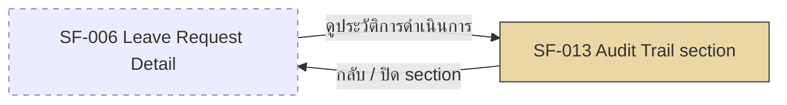

# SF-013 — Leave History & Audit Trail (Phase 2)

## 1. Overview

| รายการ | รายละเอียด |
| --- | --- |
| Function ID | SF-013 |
| Function Name | Leave History & Audit Trail |
| Category | Screen |
| Screen Type | Detail View (ส่วนเสริม/Tab บน SCR-005 — Phase 2) |
| Description | ส่วนเสริมบนหน้า SCR-005 Leave Request Detail (Phase 2) แสดงประวัติทุก action ของคำขอลา 1 รายการ (สร้าง, อนุมัติ, ปฏิเสธ, ยกเลิก) เรียงตามเวลา พร้อม timestamp และผู้กระทำ แบบ immutable log — ต่างจาก SF-006 ที่แสดงเฉพาะสถานะปัจจุบัน |
| Actor / User Role | พนักงานประจำ (Employee), Outsource (เจ้าของคำขอ), Line Manager (subordinate — read-only), HR (ทั้งองค์กร — read-only) |
| Related Requirement IDs | SFR-014, TR-009, SCR-005 |
| Source Reference | Screen SRS §2.13 (SF-013), SRS §4.1 SFR-014, TR-009, BRD §3.1 BR-009 (Phase 2), Data Architecture §6.3.7 (ApprovalHistories), Method Signature §3.7 (`IApprovalHistoryRepository`) |
| Version | 1.0 |
| Created By | screen-design-agent (2026-07-12) |
| Updated By | — |

## 2. Business Purpose

เก็บและแสดงประวัติทุก action ของคำขอลาแบบ immutable (สร้าง, อนุมัติ, ปฏิเสธ, ยกเลิก) เพื่อรองรับการตรวจสอบย้อนหลัง (audit/compliance) และแก้ปัญหาข้อโต้แย้งระหว่างพนักงาน/Manager/HR เกี่ยวกับลำดับเหตุการณ์ของคำขอ — เสริมจาก SF-006 ที่แสดงเฉพาะสถานะปัจจุบัน โดย SF-013 แสดง "ไทม์ไลน์" ของทุก action ที่เกิดขึ้นกับคำขอนั้นตั้งแต่สร้างจนถึงปัจจุบัน (Source: Screen SRS §2.13, SRS §4.1 SFR-014, BRD §3.1 BR-009, TR-009)

## 3. Screen Overview

| รายการ | รายละเอียด |
| --- | --- |
| Screen Name | Leave Request Detail — Audit Trail Section (SCR-005, Phase 2) |
| Menu Path | Main Menu > Leave Balance Dashboard (SCR-002) > คลิกรายการคำขอ (SF-006) > ลิงก์/แท็บ "ดูประวัติการดำเนินการ" |
| Navigation Inbound | SF-006 Leave Request Detail (คลิกลิงก์ "ดูประวัติการดำเนินการ" — เข้าหน้าเดียวกัน คนละ section/tab) |
| Navigation Outbound | — (แสดงภายในหน้าเดียวกับ SF-006 — ใช้ปุ่ม "กลับ" ของ SF-006 §6 ร่วมกัน ไม่มี navigation แยก) |
| Preconditions | Login สำเร็จ, มีสิทธิ์เข้าถึง Leave Request นี้ (RBAC เดียวกับ SF-006 §7.2.1), Phase 2 ถูก deploy แล้ว |
| Postconditions | ผู้ใช้เห็นประวัติทุก action ของคำขอนี้เรียงตามเวลา — ไม่มีการเปลี่ยนแปลง DB state (read-only, log เป็น immutable) |

### Related Screens

| Screen ID | Screen Name | Description |
| --- | --- | --- |
| SCR-005 (SF-006) | Leave Request Detail — Status Tracking | หน้าหลัก (baseline) ที่ section นี้ต่อขยาย — SF-006 แสดงสถานะปัจจุบัน, SF-013 แสดงประวัติแบบเต็ม (คนละขอบเขต ไม่ซ้ำเนื้อหากัน) |

### Screen Flow

```text
SF-006 Leave Request Detail (SCR-005)
  └── [คลิก "ดูประวัติการดำเนินการ"] → SF-013 Audit Trail section (หน้าเดียวกัน, Phase 2)
        └── [กลับ] → ใช้ปุ่ม "กลับ" ร่วมกับ SF-006 (SCR-002 / SCR-004 ตามจุดเข้า)
```



## 4. Mockup / UI Layout

| รายการ | รายละเอียด |
| --- | --- |
| Mockup Reference | — (Screen SRS §2.13 มีเฉพาะ Function Overview table — "รายละเอียดจะแตกเพิ่มเติมในรอบถัดไป" — ASCII ด้านล่างเป็น Assumption ทั้งหมดของเอกสารนี้) |
| Layout Description | Timeline/table แสดงประวัติ action เรียงจากเก่าไปใหม่ (ascending by timestamp) แต่ละแถวประกอบด้วย ประเภท action, ผู้กระทำ, วัน-เวลา, เหตุผล (ถ้ามี) |

```text
+----------------------------------------------------------------------+
| SF-006 Leave Request Detail — LR-2026-00012                [ Pending ]|
| ...(fields ตาม SF-006 §5)...                                          |
+----------------------------------------------------------------------+
| ประวัติการดำเนินการ (Audit Trail)                                     |
|                                                                      |
| ● สร้างคำขอ (Created)                                                 |
|   โดย สมชาย ใจดี — 28 Jun 2026 09:15                                  |
|                                                                      |
| ● อนุมัติ (Approved)                                                   |
|   โดย มานพ หัวหน้างาน — 28 Jun 2026 14:30                             |
|                                                                      |
| ● ส่งคำขอยกเลิก (Cancel Requested)                                     |
|   โดย สมชาย ใจดี — 01 Jul 2026 10:00   เหตุผล: "แผนงานเปลี่ยน"          |
|                                                                      |
| ● อนุมัติการยกเลิก (Cancellation Approved)                             |
|   โดย มานพ หัวหน้างาน — 01 Jul 2026 16:45                             |
|                                                                      |
|                              [ กลับ ] (ใช้ร่วมกับ SF-006)              |
+----------------------------------------------------------------------+
```

## 5. Fields Definition

### 5.1 Audit Trail Timeline (Display Only — เรียงตาม action_at จากเก่าไปใหม่)

| No | Field Name | Label (TH/EN) | Type | Length | Required | Default | Validation | DB Mapping | Description |
| :---: | --- | --- | --- | --- | --- | --- | --- | --- | --- |
| 1 | event_type | ประเภทเหตุการณ์ / Event Type | Badge / Text (read-only) | — | Y | — | ค่าที่เป็นไปได้: Created, Approved, Rejected, Cancel Requested, Cancellation Approved, Cancellation Rejected, Cancelled (ดู Assumption §13 เรื่องการ derive) | Derived: Created ← `LeaveRequests.CreatedAt`; Approved/Rejected ← `ApprovalHistories.Action` (1=Approved, 2=Rejected) ที่ `LeaveRequestId` ตรงกัน; Cancel Requested ← `CancelRequests.CreatedAt`; Cancellation Approved/Rejected ← `ApprovalHistories.Action` ที่ `CancelRequestId` ตรงกัน; Cancelled (Pending instant) ← `LeaveRequests.UpdatedAt` เมื่อ `Status=4` โดยไม่มี `CancelRequests` ที่เกี่ยวข้อง | ประเภทของ action ในไทม์ไลน์ — ไม่มีคอลัมน์ enum เดี่ยวในฐานข้อมูล ต้อง derive จากหลายตาราง (SFR-014) |
| 2 | actor_name | ผู้กระทำ / Actor | Text (read-only) | — | Y | — | — | Created: `LeaveRequests.CreatedBy` / Approved-Rejected: `ApprovalHistories.ApproverId` (JOIN `Employees`) / Cancel Requested: `CancelRequests.RequestedBy` (JOIN `Employees`) | ชื่อผู้ทำ action นั้น (`ApprovalHistorySummaryDto.ApproverName` สำหรับกรณี Approve/Reject) |
| 3 | action_at | วัน-เวลา / Timestamp | Datetime (read-only) | — | Y | — | — | Created: `LeaveRequests.CreatedAt` / Approved-Rejected: `ApprovalHistories.ActionAt` / Cancel Requested: `CancelRequests.CreatedAt` | วัน-เวลาที่เกิด action (UTC — แปลงเป็น local time ตอนแสดงผล) |
| 4 | reason | เหตุผล / Reason | Text (read-only) | — | Conditional | — | แสดงเฉพาะ event ที่มีเหตุผล (Rejected, Cancel Requested) | `ApprovalHistories.Reason` (NVARCHAR(MAX)) / `CancelRequests.Reason` (NVARCHAR(MAX)) | เหตุผลของ action นั้น (ถ้ามี) |

## 6. Commands / Actions

| No | Command | Type | Default State | Trigger Condition | System Response |
| :---: | --- | --- | --- | --- | --- |
| 1 | ดูประวัติการดำเนินการ | Link / Tab (trigger จาก SF-006 §6) | Enable | คลิกจากหน้า SF-006 | เรียก `IApprovalHistoryRepository.GetByLeaveRequestAsync(leaveRequestId)` + `GetByCancelRequestAsync(cancelRequestId)` (สำหรับ CancelRequests ที่เกี่ยวข้อง) รวมกับ `LeaveRequests`/`CancelRequests` audit column แล้วเรียงตาม action_at asc |
| 2 | กลับ | Button (ใช้ร่วมกับ SF-006 §6) | Enable | คลิกปุ่ม | ปิด section/tab กลับสู่มุมมอง SF-006 ปกติ — ไม่มี navigation ข้ามหน้า |

## 7. Screen Behavior

### 7.1 Initial Screen (onLoad ของ section — trigger จากคลิกลิงก์บน SF-006)

- เรียก `IApprovalHistoryRepository.GetByLeaveRequestAsync(leaveRequestId)` (Method Signature §3.7, SFR-014) — คืนรายการ Approve/Reject ของ LeaveRequest นี้ เรียงตาม `ActionAt` ascending
- เรียก `IApprovalHistoryRepository.GetByCancelRequestAsync(cancelRequestId)` เพิ่มเติมสำหรับ `CancelRequests` ที่มี `LeaveRequestId` ตรงกับคำขอนี้ (ถ้ามี) เพื่อรวม action ของ re-approve cancel flow เข้าไทม์ไลน์เดียวกัน (ดู Assumption §13)
- เพิ่ม event "Created" จาก `LeaveRequests.CreatedAt`/`CreatedBy` และ event "Cancel Requested" จาก `CancelRequests.CreatedAt`/`RequestedBy` (ถ้ามี) เข้าไทม์ไลน์ — ทั้งสอง event นี้ไม่มีอยู่ใน `ApprovalHistories` (ดู Assumption §13)
- Merge ทุก event แล้วเรียงตาม timestamp จากเก่าไปใหม่ (ascending) ตาม TR-009 "เก็บ log ในรูปแบบที่ query ได้"

#### 7.1.1 Validation (RBAC — ใช้ร่วมกับ SF-006)

| ลำดับ | Validation | Requirement | Error Message |
| :---: | --- | --- | --- |
| 1 | ใช้ RBAC เดียวกับ SF-006 §7.2.1 (`GetLeaveRequestDetailAsync`) — Employee เห็นเฉพาะของตัวเอง, Manager เฉพาะ subordinates, HR ทั้งหมด | NFR-005, SFR-014 | ERR-SF013-001 |

#### 7.1.2 Insert / Update (DB Transaction ถ้ามี)

```text
— ไม่มี DB Transaction (section นี้อ่านอย่างเดียว — immutable log, read-only)

SELECT (onClick "ดูประวัติการดำเนินการ"):
  ApprovalHistories WHERE LeaveRequestId = @LeaveRequestId
    ORDER BY ActionAt ASC   (via GetByLeaveRequestAsync)
  CancelRequests WHERE LeaveRequestId = @LeaveRequestId
    (หา CancelRequestId ที่เกี่ยวข้อง — ถ้ามี)
  ApprovalHistories WHERE CancelRequestId IN (@CancelRequestIds)
    ORDER BY ActionAt ASC   (via GetByCancelRequestAsync)
  -- ไม่มี Global Query Filter บน ApprovalHistories (Immutable — Method Signature §3.7)
```

### 7.2 แสดงผลไทม์ไลน์

- แสดงทุก event ที่ merge แล้วเรียงจากเก่าไปใหม่ — แต่ละแถวแสดง event_type, actor_name, action_at, reason (conditional)
- ไม่มีปุ่มแก้ไข/ลบ log ใด ๆ — สอดคล้องกับ `ApprovalHistories` เป็น immutable entity (ไม่มี Update/Delete method ใน `IApprovalHistoryRepository`)

## 8. Business Rules

| Rule ID | Business Rule | Impact | Source Reference |
| --- | --- | --- | --- |
| BR-SF013-001 | Audit log เป็น immutable — ห้ามแก้ไข/ลบ | ไม่มี Edit/Delete action บน section นี้ | TR-009, Data Architecture §6.3.7 (ApprovalHistories ไม่มี UpdatedAt/IsDeleted) |
| BR-SF013-002 | เรียงลำดับ event ตาม timestamp จากเก่าไปใหม่ | Sort ascending โดย action_at | TR-009 "query ได้" |
| BR-SF013-003 | RBAC เดียวกับ SF-006 — Employee เห็นเฉพาะของตัวเอง, Manager เฉพาะ subordinates, HR ทั้งหมด | Enforce ที่ Backend | NFR-005, SFR-014 |
| BR-SF013-004 | Event "Created" และ "Cancelled" (ยกเลิกทันทีตอน Pending) ไม่มีบันทึกใน `ApprovalHistories` — ต้อง derive จาก audit column ของ `LeaveRequests` | ความถูกต้องของไทม์ไลน์ขึ้นกับการ derive นี้ — ต้อง confirm กับ Dev | Assumption (เอกสารนี้) — Data Architecture §6.3.3/§6.3.7 |

```text
onClick "ดูประวัติการดำเนินการ" → RBAC check (เดียวกับ SF-006)
│
├── ไม่มีสิทธิ์ → ERR-SF013-001 (block)
│
└── มีสิทธิ์
    └── รวม event จาก:
        ├── LeaveRequests.CreatedAt/CreatedBy → "Created"
        ├── ApprovalHistories (LeaveRequestId) → "Approved" / "Rejected"
        ├── CancelRequests.CreatedAt/RequestedBy (ถ้ามี) → "Cancel Requested"
        ├── ApprovalHistories (CancelRequestId) → "Cancellation Approved" / "Cancellation Rejected"
        └── LeaveRequests.UpdatedAt (Status=4, ไม่มี CancelRequests) → "Cancelled" (Pending instant)
        แล้วเรียงตาม timestamp ascending
```

## 9. Message List

### Error Messages

| Message ID | Trigger | Message (TH) | Message (EN) |
| --- | --- | --- | --- |
| ERR-SF013-001 | ไม่มีสิทธิ์เข้าถึงประวัติของคำขอนี้ หรือโหลดไม่สำเร็จ — message ใหม่ที่เพิ่มในเอกสารนี้ | ไม่สามารถแสดงประวัติการดำเนินการได้ หรือคุณไม่มีสิทธิ์เข้าถึง | Unable to display the audit trail, or you do not have permission to view it. |

### Success / Info Messages

| Message ID | Trigger | Message (TH) | Message (EN) |
| --- | --- | --- | --- |
| — | Section นี้เป็น read-only ไม่มี action ที่สร้างผลสำเร็จ | — | — |

## 10. Popup / Sub-screen Definition

— ไม่มี (แสดงเป็น section/tab บนหน้า SCR-005 เดียวกับ SF-006 ไม่ใช่ popup หรือ sub-screen แยก)

## 11. Database Tables Reference

| Table Name | Alias | Description |
| --- | --- | --- |
| ApprovalHistories | — | SELECT ประวัติ Approve/Reject ของ LeaveRequest (`WHERE LeaveRequestId = @Id`) และของ CancelRequest ที่เกี่ยวข้อง (`WHERE CancelRequestId IN (...)`) เรียงตาม `ActionAt` — Immutable, ไม่มี INSERT/UPDATE จากหน้าจอนี้ (เขียนโดย `IApprovalService`/`ICancelRequestService` เท่านั้น) |
| LeaveRequests | — | SELECT `CreatedAt`/`CreatedBy` (event "Created") และ `UpdatedAt`/`UpdatedBy`/`Status` (event "Cancelled" กรณี Pending instant cancel — ดู Assumption §13) |
| CancelRequests | — | SELECT `CreatedAt`/`RequestedBy` (event "Cancel Requested") ที่ `LeaveRequestId` ตรงกับคำขอนี้ |
| Employees | — | JOIN แสดงชื่อผู้กระทำ action (CreatedBy, ApproverId, RequestedBy) |

## 12. Exception Handling

| Error Case | Trigger Condition | System Behavior | User Message | Recovery |
| --- | --- | --- | --- | --- |
| Validation error | ไม่มีสิทธิ์เข้าถึง (RBAC fail — เดียวกับ SF-006) | ไม่แสดง section, คงอยู่ที่มุมมอง SF-006 | ERR-SF013-001 | กลับไปหน้ารายการคำขอที่มีสิทธิ์ดู |
| Integration error | โหลดประวัติไม่สำเร็จ (API error) | แสดง error banner ใน section นี้ — ไม่กระทบ SF-006 ส่วนอื่น | ERR-SF013-001 | Refresh / ลองใหม่ |
| System error | Backend API ล่ม (HTTP 5xx) | แสดง error banner ตาม global error handling | "เกิดข้อผิดพลาด กรุณาลองใหม่" | รอและ refresh |

## 13. Notes / Assumptions

| ประเภท | รายละเอียด | ผลกระทบ |
| --- | --- | --- |
| Open Issue (จาก SRS) | Screen SRS §2.13 มีเฉพาะ Function Overview table พร้อมหมายเหตุ "Phase 2 — รายละเอียดจะแตกเพิ่มเติมในรอบถัดไป" — ไม่มี Fields/Commands/Behavior/Message กำหนดไว้ในต้นฉบับ | เอกสารนี้ออกแบบเนื้อหาทั้งหมด (§4–§9) เองจาก Data Architecture + Method Signature เป็น draft เพื่อเตรียมพร้อม Phase 2 — ต้องให้ BA/Business review และ confirm scope ก่อน implement จริง |
| Open Issue (จาก SRS) | TR-009 Audit Log Retention Period ยังไม่ระบุ (SRS §7 Open Issue) | กระทบการออกแบบ data retention/archiving ของ `ApprovalHistories` — ต้องยืนยันกับ HR/Legal |
| Assumption (เอกสารนี้) | Event "Created" (สร้างคำขอ) และ "Cancelled" (ยกเลิกทันทีตอน Pending, SF-007) ไม่มีคอลัมน์ audit เฉพาะใน `ApprovalHistories` (ตารางนี้เก็บเฉพาะ Action Approve/Reject) — เอกสารนี้ derive สอง event นี้จาก `LeaveRequests.CreatedAt`/`CreatedBy` และ `LeaveRequests.UpdatedAt`/`UpdatedBy` (เมื่อ Status=4 โดยไม่มี CancelRequests ที่เกี่ยวข้อง) ตามลำดับ | ต้อง confirm กับ Dev ว่าการ derive จาก audit column ทั่วไปเพียงพอ หรือควรเพิ่ม dedicated log entry ใหม่ให้ครอบคลุมทุก action ตาม SFR-014 |
| Assumption (เอกสารนี้) | ไทม์ไลน์รวม event จาก `CancelRequests` (Cancel Requested / Cancellation Approved / Cancellation Rejected) เข้ากับ `ApprovalHistories` ของ LeaveRequest เดิม โดย JOIN ผ่าน `CancelRequests.LeaveRequestId` — Method Signature §3.7 มีเฉพาะ `GetByLeaveRequestAsync` และ `GetByCancelRequestAsync` แยกกัน ไม่มี method รวมที่ระบุชัดเจน | ต้องเพิ่ม method รวม (เช่น `GetFullTimelineAsync`) หรือให้ Frontend/Service layer merge เองตามที่ระบุในเอกสารนี้ — ต้อง confirm กับ Dev |
| Assumption (เอกสารนี้) | Scope ของหน้านี้จำกัดที่ audit trail ของคำขอลา 1 รายการ (by leaveRequestId) ตาม Screen Mapping Table (SFR-014 map กับ SCR-005 เท่านั้น) — ไม่ครอบคลุม view แบบรวมทุกคำขอของพนักงาน (by employee_id) ที่ SFR-014 Input ระบุไว้เป็นทางเลือกที่สอง เนื่องจากไม่มี SCR อื่นรองรับ | หากต้องการ employee-level audit view (all requests) ต้องออกแบบ SCR ใหม่แยกต่างหากใน Phase 2 |
| Assumption (เอกสารนี้) | ASCII mockup ใน §4 และ Fields Definition ใน §5 เป็น assumption ทั้งหมดของเอกสารนี้ (SRS ไม่มีรายละเอียด Phase 2) | ต้องให้ UX/Business review ก่อนถือเป็น final design |
| Note | SF-013 กับ SF-006 ใช้ SCR-005 เดียวกัน — SF-006 (baseline) แสดงเฉพาะสถานะปัจจุบัน, SF-013 (Phase 2) แสดงประวัติทุก action แบบเต็ม ทั้งสองเอกสารอ้างอิงกันใน §3 Related Screens และไม่มีเนื้อหาซ้ำกัน | ทีม implement ต้องดูทั้งสองเอกสารประกอบกันเมื่อพัฒนา SCR-005 |

## Change Log

| Version | Date | Author | Change Type | Description | Remark |
| --- | --- | --- | --- | --- | --- |
| 1.0 | 2026-07-12 | screen-design-agent (Claude) | Created | สร้างเอกสารครั้งแรกจาก Screen SRS v1.0 (§2.13 SF-013, Phase 2), Data Architecture Design (ApprovalHistories/LeaveRequests/CancelRequests DDL §6.3.5/§6.3.7), Method Signature §3.7 (`IApprovalHistoryRepository`) | Generated ตาม template screen-design-agent — Phase 2 draft, ต้อง confirm scope ก่อน implement |

### สรุปการเปลี่ยนแปลงสำคัญ

| ช่วง Version | การเปลี่ยนแปลง | ผลกระทบ |
| --- | --- | --- |
| 1.0 | Baseline แรก (Phase 2 draft) | — |
