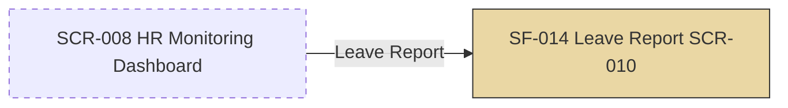

# SF-014 — Leave Report Export

## 1. Overview

| รายการ | รายละเอียด |
| --- | --- |
| Function ID | SF-014 |
| Function Name | Leave Report Export |
| Category | Screen |
| Screen Type | Search & Action Form (เลือก filter → Generate → Export) |
| Description | HR เลือกช่วงเวลา/แผนก/ประเภทพนักงาน/ประเภทลา แล้ว generate และ export รายงานการลาเป็นไฟล์ — หน้าจอนี้เป็น container ของ Leave Summary Report (RP-001) และ Leave Balance Report (RP-002) บน SCR-010 เดียวกัน (Phase 2) |
| Actor / User Role | HR |
| Related Requirement IDs | SFR-015, RFR-001, RFR-002, SCR-010 |
| Source Reference | Screen SRS §2.14 (SF-014), Report SRS §2.1 (RP-001) / §2.2 (RP-002), SRS §4.1 SFR-015, BRD BR-010 |
| Version | 1.0 |
| Created By | screen-design-agent (2026-07-12) |
| Updated By | — |

## 2. Business Purpose

ให้ HR ดึงรายงานการลาและรายงานสิทธิ์วันลาคงเหลือของทั้งองค์กรออกมาเป็นไฟล์ได้ด้วยตนเอง แทนการรวบรวมข้อมูลจาก Excel หลายฝ่ายด้วยมือ ใช้สนับสนุนการบริหารบุคลากรและติดตาม KPI ตาม BRD §5.3.1.C (Source: Report SRS §2.1.1, §2.2.1, BRD §3.1 BR-010)

**หมายเหตุ (Phase 2):** เอกสารนี้อธิบายเฉพาะโครงหน้าจอ (screen shell), navigation, filter fields และ commands ระดับหน้าจอ — รายละเอียด Column Definition, Sorting Logic, Summary Logic และ Query Logic ของรายงานแต่ละตัวอ้างอิงเอกสาร Report Design ที่มีอยู่แล้วโดยตรง ไม่ copy ซ้ำในเอกสารนี้ (ดู §13)

## 3. Screen Overview

| รายการ | รายละเอียด |
| --- | --- |
| Screen Name | Leave Report (SCR-010) |
| Menu Path | Main Menu > HR Monitoring Dashboard (SCR-008) > Leave Report (Assumption — ดู §13) |
| Navigation Inbound | Header Navigation (role = HR) — Assumption เนื่องจาก Screen SRS §2.14 (SF-014 stub) ไม่ได้ระบุ Navigation Inbound ไว้ชัดเจน (ดู §13) |
| Navigation Outbound | ไม่มี — ปุ่ม Export ดาวน์โหลดไฟล์โดยไม่เปลี่ยนหน้า |
| Preconditions | Login เป็น HR (SF-001) |
| Postconditions | หน้าจอ read-only (ไม่เปลี่ยน DB state) — Export เขียนไฟล์ให้ HR ดาวน์โหลด |

### Related Screens

| Screen ID | Screen Name | Description |
| --- | --- | --- |
| SCR-008 | HR Monitoring Dashboard | หน้าจอต้นทาง (Assumption) — จุดเข้าถึงเมนู HR |
| — (RP-001) | Leave Summary Report | Report Design แยก — ดู `20-system-design/b0-functional-design/20-report-design/rp-001-leave-summary.md` สำหรับ Column/Sorting/Summary/Query Logic ฉบับเต็ม |
| — (RP-002) | Leave Balance Report | ระบุใน Report SRS §2.2 เท่านั้น — ยังไม่มีเอกสาร Report Design แยก (ดู Assumption §13) |

### Screen Flow

```text
Header Navigation (role = HR)
  └── SCR-008 HR Monitoring Dashboard (Assumption)
        └── [Leave Report] → SF-014 Leave Report (SCR-010)
              ├── [เลือก Leave Summary Report] → แสดง filter/ผลลัพธ์ตาม RP-001
              ├── [เลือก Leave Balance Report] → แสดง filter/ผลลัพธ์ตาม RP-002 (Report SRS §2.2)
              └── [Export Excel/PDF] → ดาวน์โหลดไฟล์ (อยู่หน้าเดิม)
```



## 4. Mockup / UI Layout

| รายการ | รายละเอียด |
| --- | --- |
| Mockup Reference | อ้างอิง style เดียวกับ RP-001 (`91-project-asses/ascii-mockup/report/leave-summary-report/` — ไฟล์ mockup จริงไม่มีอยู่ใน repo ตาม RP-001 §5) — ASCII ด้านล่างเป็น Assumption แสดงเฉพาะ screen shell (report body เต็มดู RP-001 §5) |
| Layout Description | ส่วนบน: Report Type selector (เลือก Summary/Balance) + Filter ตามรายงานที่เลือก + ปุ่ม Generate/Export/Reset ส่วนล่าง: พื้นที่แสดงผลรายงาน (รายละเอียดดู RP-001 §4-§5 / Report SRS §2.2.4) |

```text
+----------------------------------------------------------------------+
| [LOGO]  Leave Management System        User: [HR_ID]  [HR_NAME]     |
+----------------------------------------------------------------------+
| Menu >> HR Monitoring >> Leave Report (SCR-010)                       |
+----------------------------------------------------------------------+
| รายงานการลา (Leave Report)                                            |
|                                                                      |
| ประเภทรายงาน  ( • ) รายงานสรุปการลา (RP-001)  ( ) รายงานสิทธิ์คงเหลือ (RP-002) |
|                                                                      |
| [ Filter fields ตามประเภทรายงานที่เลือก — ดู §5 ]                       |
|                                                                      |
| [ ดูรายงาน ]  [ Export Excel ]  [ Export PDF ]  [ Reset ]              |
+----------------------------------------------------------------------+
| [ พื้นที่แสดงผลรายงาน — รายละเอียด layout ดู RP-001 §5 (Summary) /       |
|   Report SRS §2.2.4 (Balance) ]                                      |
+----------------------------------------------------------------------+
```

## 5. Fields Definition

### 5.1 Report Type Selector (Assumption — เอกสารนี้ เพื่อรองรับทั้ง RFR-001 และ RFR-002 บน SCR-010 เดียวกัน)

| No | Field Name | Label (TH/EN) | Type | Length | Required | Default | Validation | DB Mapping | Description |
| :---: | --- | --- | --- | --- | --- | --- | --- | --- | --- |
| 1 | report_type | ประเภทรายงาน / Report Type | Radio / Tab | — | Y | "Leave Summary Report" | ค่า: Leave Summary Report (RP-001) / Leave Balance Report (RP-002) | — (UI state เท่านั้น ไม่ persist) | กำหนดชุด filter/ผลลัพธ์ที่แสดง — สลับแล้ว reset ผลลัพธ์เดิม |

### 5.2 Filter Section — Leave Summary Report (RP-001 — ดู RP-001 §3 ฉบับเต็ม)

| No | Field Name | Label (TH/EN) | Type | Length | Required | Default | Validation | DB Mapping | Description |
| :---: | --- | --- | --- | --- | --- | --- | --- | --- | --- |
| 1 | date_from | วันที่เริ่มต้น / Date From | Date Picker | — | Y | วันแรกของเดือนปัจจุบัน | ≤ date_to (ERR-RPT-001) | `LeaveRequests.StartDate` (DATE) | map เป็น `LeaveReportFilterDto.StartDate` |
| 2 | date_to | วันที่สิ้นสุด / Date To | Date Picker | — | Y | วันสุดท้ายของเดือนปัจจุบัน | ≥ date_from | `LeaveRequests.StartDate` (DATE) | map เป็น `LeaveReportFilterDto.EndDate` |
| 3 | department | แผนก / Department | Dropdown | — | N | ทั้งหมด (All) | ต้องเป็นค่าที่มีใน `Employees.Department` | `Employees.Department` (NVARCHAR(200)) | map เป็น `LeaveReportFilterDto.Department` |
| 4 | employee_type | ประเภทพนักงาน / Employee Type | Dropdown | — | N | ทั้งหมด (All) | All / Regular(1) / Outsource(2) | `Employees.EmployeeType` (TINYINT) | map เป็น `LeaveReportFilterDto.EmployeeType` |
| 5 | leave_type | ประเภทการลา / Leave Type | Dropdown | — | N | ทั้งหมด (All) | 1 ใน 7 ประเภทใน `LeaveTypes` | `LeaveRequests.LeaveTypeId` (TINYINT) | map เป็น `LeaveReportFilterDto.LeaveTypeId` |

### 5.3 Filter Section — Leave Balance Report (RP-002 — Report SRS §2.2.3, ยังไม่มีเอกสาร Report Design แยก)

| No | Field Name | Label (TH/EN) | Type | Length | Required | Default | Validation | DB Mapping | Description |
| :---: | --- | --- | --- | --- | --- | --- | --- | --- | --- |
| 1 | as_of_date | ดูข้อมูล ณ วันที่ / As-of Date | Date Picker | — | Y | วันนี้ (Today) | ≤ วันนี้ (ERR-RPT-004) | คำนวณจาก `LeaveBalances` ณ วันที่ระบุ | คำนวณ balance ณ as-of date (ไม่ใช่ real-time เสมอไป) |
| 2 | department | แผนก / Department | Dropdown | — | N | ทั้งหมด (All) | ต้องเป็นค่าที่มีใน `Employees.Department` | `Employees.Department` | กรองเฉพาะแผนก |
| 3 | employee_type | ประเภทพนักงาน / Employee Type | Dropdown | — | N | ทั้งหมด (All) | All / Regular / Outsource | `Employees.EmployeeType` | กรองประเภทพนักงาน |
| 4 | leave_type | ประเภทการลา / Leave Type | Dropdown | — | N | ทั้งหมด (All) | 1 ใน 7 ประเภท | `LeaveTypes.LeaveTypeId` | กรองประเภทลา |
| 5 | employee_id | รหัสพนักงาน / Employee ID | Text (search) | 20 | N | — | ค้นหาเฉพาะพนักงานคนเดียว | `Employees.EmployeeId` | ดูเฉพาะพนักงานคนเดียว (ถ้าระบุ) |

## 6. Commands / Actions

| No | Command | Type | Default State | Trigger Condition | System Response |
| :---: | --- | --- | --- | --- | --- |
| 1 | report_type (radio/tab) | Selector | Enable | คลิกเปลี่ยนประเภทรายงาน | เปลี่ยนชุด filter fields (§5.2 ↔ §5.3) และล้างผลลัพธ์เดิม |
| 2 | ดูรายงาน / Generate | Button | Enable | filter บังคับกรอกครบและ valid | แสดง INF-RPT-001 ระหว่างโหลด → query ตาม RP-001 §9 (Summary) หรือ Report SRS §2.2 (Balance) → แสดงผลลัพธ์ในพื้นที่ผลลัพธ์ — service method สำหรับแสดงผลบนจอยังไม่มีใน Method Signature (ดู Assumption §13 — สืบทอดจาก RP-001) |
| 3 | Export Excel | Button | Enable เมื่อ generate แล้ว | คลิก | `report_type = Summary`: เรียก `IReportService.ExportLeaveReportAsync(filter, Format=Excel)`; `report_type = Balance`: เรียก `IReportService.ExportLeaveBalanceReportAsync(filter, Format=Excel)` → download `.xlsx` → SUC-RPT-001 |
| 4 | Export PDF | Button | Enable เมื่อ generate แล้ว | คลิก | เช่นเดียวกับ Export Excel แต่ `Format=Pdf` → download `.pdf` → SUC-RPT-001 (รูปแบบไฟล์ยังเป็น Open Issue — ดู §13) |
| 5 | Reset Filter | Button | Enable | คลิก | คืนค่า filter ของ report_type ปัจจุบันเป็น default — ไม่ refresh ผลลัพธ์ |

## 7. Screen Behavior

### 7.1 Initial Screen (onLoad)

- default `report_type` = "Leave Summary Report" (RP-001) พร้อม filter default ตาม §5.2 (date_from/date_to = เดือนปัจจุบัน)
- ยังไม่ generate ผลลัพธ์อัตโนมัติ — รอ HR คลิก "ดูรายงาน/Generate" (RP-001 §6 Commands)

### 7.2 เปลี่ยน "ประเภทรายงาน" (onChange)

- สลับชุด filter (§5.2 ↔ §5.3), reset filter เป็น default ของรายงานนั้น, ล้างผลลัพธ์ที่แสดงอยู่ (ถ้ามี)

### 7.3 Click "ดูรายงาน / Generate"

#### 7.3.1 Validation

| ลำดับ | Validation | Requirement | Error Message |
| :---: | --- | --- | --- |
| 1 | (Summary) date_from ≤ date_to | RP-001 §11 | ERR-RPT-001 |
| 2 | (Balance) as_of_date ≤ วันนี้ | Report SRS §2.2.8 | ERR-RPT-004 |
| 3 | Query คืนผลลัพธ์อย่างน้อย 1 record | — | ERR-RPT-002 (Summary) / ERR-RPT-005 (Balance) |

- Query logic ฉบับเต็ม: ดู RP-001 §9 (Summary) และ Report SRS §2.2.4/§2.2.5 (Balance) — ไม่ copy ซ้ำในเอกสารนี้

#### 7.3.2 Insert / Update (DB Transaction)

```text
— ไม่มี DB Transaction (หน้าจอนี้อ่านอย่างเดียว — read-only reporting screen)

SELECT (onClick Generate): ดูรายละเอียด query ที่ RP-001 §9 (LeaveRequests JOIN Employees JOIN LeaveTypes)
  หรือ Report SRS §2.2.4 (LeaveBalances JOIN Employees JOIN LeaveTypes ณ as_of_date) ตาม report_type ที่เลือก
```

### 7.4 Click "Export Excel" / "Export PDF"

- เรียก service ตาม §6 ข้อ 3-4 → ถ้าสำเร็จ: download ไฟล์ + SUC-RPT-001; ถ้าล้มเหลว: ERR-RPT-003

### 7.5 Click "Reset Filter"

- คืนค่า filter เป็น default ของ report_type ปัจจุบัน — ไม่ trigger query ใหม่ (Report SRS §2.1.7/§2.2.7)

## 8. Business Rules

| Rule ID | Business Rule | Impact | Source Reference |
| --- | --- | --- | --- |
| BR-SF014-001 | เรียกได้เฉพาะ HR (RBAC) — HR เห็นข้อมูลทั้งองค์กร ไม่จำกัดตามแผนก | Endpoint enforce `[Authorize(Policy="HrOnly")]` ที่ Backend | BRD §3.1 BR-010, SRS NFR-005, RP-001 BR-RP001-001 |
| BR-SF014-002 | report_type selector เป็นการเพิ่มของเอกสารนี้เพื่อให้ SCR-010 เดียวรองรับทั้ง RFR-001 (Summary) และ RFR-002 (Balance) | ไม่มีระบุชัดเจนใน SRS ว่าเป็น 1 หน้าจอ 2 รายงาน หรือแยกหน้า | Cross-Function Traceability SF-014 (SFR-015, RFR-001, RFR-002) |
| BR-SF014-003 | Export format (Excel/PDF) ยังไม่ยืนยันว่าต้องมีทั้งคู่หรือเลือกใช้ตัวเดียว | เอกสารนี้ใส่ทั้ง 2 ปุ่มเป็น baseline ตาม `ReportFormat { Excel, Pdf }` | Method Signature §2.1, RP-001 §14 Open Issue |
| BR-SF014-004 | as_of_date ของ Balance Report ต้องไม่เกินวันนี้ (ไม่รองรับ future projection) | Validate ก่อน query — ERR-RPT-004 | Report SRS §2.2.10 Assumption |

## 9. Message List

### Error Messages

| Message ID | Trigger | Message (TH) | Message (EN) |
| --- | --- | --- | --- |
| ERR-RPT-001 | (Summary) date_from > date_to | วันที่เริ่มต้นต้องน้อยกว่าหรือเท่ากับวันที่สิ้นสุด | Start date must be less than or equal to end date. |
| ERR-RPT-002 | (Summary) ไม่พบข้อมูลตาม filter | ไม่พบข้อมูลที่ตรงกับเงื่อนไขที่เลือก | No data found matching the selected criteria. |
| ERR-RPT-003 | Export ล้มเหลว (ทั้ง 2 report type) | ไม่สามารถส่งออกไฟล์ได้ กรุณาลองใหม่ | Unable to export file. Please try again. |
| ERR-RPT-004 | (Balance) as_of_date อยู่ในอนาคต | ไม่สามารถดูข้อมูลในอนาคตได้ กรุณาเลือกวันที่ไม่เกินวันนี้ | Cannot view future data. Please select a date no later than today. |
| ERR-RPT-005 | (Balance) ไม่พบข้อมูลตาม filter | ไม่พบข้อมูลที่ตรงกับเงื่อนไขที่เลือก | No data found matching the selected criteria. |

### Success / Info Messages

| Message ID | Trigger | Message (TH) | Message (EN) |
| --- | --- | --- | --- |
| INF-RPT-001 | กำลัง generate รายงาน | กำลังดึงข้อมูล กรุณารอสักครู่... | Generating report, please wait... |
| INF-RPT-002 | (Balance) as_of_date เป็นวันที่ผ่านมา | ข้อมูลแสดง ณ วันที่ {as_of_date} — อาจแตกต่างจากปัจจุบัน | Data shown as of {as_of_date} — may differ from current balance. |
| SUC-RPT-001 | Export สำเร็จ (ทั้ง 2 report type) | ส่งออกไฟล์สำเร็จ | File exported successfully. |

## 10. Popup / Sub-screen Definition

— ไม่มี (การแสดงผลรายงานเป็นพื้นที่บนหน้าจอเดียวกัน ไม่ใช่ popup — รายละเอียดตารางผลลัพธ์ดู RP-001 §4-§5 / Report SRS §2.2.4)

## 11. Database Tables Reference

| Table Name | Alias | Description |
| --- | --- | --- |
| LeaveRequests | LR | (Summary — RP-001) SELECT aggregate: COUNT/SUM(DurationDays)/COUNT by Status — ดู RP-001 §9 |
| Employees | E | JOIN เพื่อ group ตาม Department, filter EmployeeType — ใช้ทั้ง Summary และ Balance report |
| LeaveTypes | LT | JOIN เพื่อแสดงชื่อประเภทลา, filter LeaveTypeId — ใช้ทั้ง 2 report |
| LeaveBalances | — | (Balance — RP-002) SELECT EntitledDays/UsedDays/CarriedForwardDays ณ as_of_date — ดู Report SRS §2.2.4-2.2.5 |

## 12. Exception Handling

| Error Case | Trigger Condition | System Behavior | User Message | Recovery |
| --- | --- | --- | --- | --- |
| Validation error | (Summary) date_from > date_to | ไม่ query — focus ที่ date_from | ERR-RPT-001 | แก้ไขช่วงวันที่ |
| Validation error | (Balance) as_of_date ในอนาคต | ไม่ query — focus ที่ as_of_date | ERR-RPT-004 | เลือกวันที่ไม่เกินวันนี้ |
| No data | Query คืน 0 record | แสดงข้อความแทนตาราง — ปุ่ม Export disabled | ERR-RPT-002 / ERR-RPT-005 | ปรับ filter ให้กว้างขึ้น |
| Export error | `ExportLeaveReportAsync` / `ExportLeaveBalanceReportAsync` throw หรือ stream ล้มเหลว | ไม่ download ไฟล์, log error พร้อม CorrelationId | ERR-RPT-003 | ลองใหม่; ถ้าซ้ำแจ้ง IT |
| System error | Backend ล่ม / query timeout (HTTP 5xx) | แสดง error ตาม global error handling ของ SPA | "ระบบขัดข้องชั่วคราว กรุณาลองใหม่" | รอและลองใหม่ |
| Authorization error | ผู้ใช้ที่ไม่ใช่ HR เรียก endpoint ตรง | HTTP 403 — Audit log Access Denied | — (Frontend ไม่แสดงเมนูนี้ให้ role อื่น) | — |

## 13. Notes / Assumptions

| ประเภท | รายละเอียด | ผลกระทบ |
| --- | --- | --- |
| Open Issue (จาก SRS) | Export file format (Excel/PDF) ยังไม่ยืนยัน — Screen SRS §2.14 หมายเหตุ "Phase 2 — Report template ยังไม่ยืนยัน" | ตัดปุ่ม Export ออกเมื่อ HR ยืนยัน format เดียว — กระทบ §6 คำสั่งที่ 3-4 |
| Open Issue (จาก SRS) | Report column/template ของทั้ง Summary และ Balance ยังไม่ยืนยัน (RP-001 §14, Report SRS §2.2.10) | รายละเอียด column definition ทั้งหมดอยู่ใน RP-001/Report SRS — ต้อง confirm ก่อน sprint Phase 2 |
| Assumption (เอกสารนี้) | SF-014 ถูกออกแบบเป็น "shell screen" ที่รวม RP-001 (Leave Summary) และ RP-002 (Leave Balance) ไว้บน SCR-010 เดียวกันผ่าน report_type selector (§5.1) — Screen SRS/Report SRS ไม่ได้ระบุชัดเจนว่าเป็น 1 หน้าจอ 2 รายงาน หรือแยกหน้าจอคนละ SCR | ต้อง confirm กับ UX ว่าควรแยกเป็น 2 หน้าจอ (SCR-010 / SCR-010b) หรือรวมแบบ tab ตามเอกสารนี้ |
| Assumption (เอกสารนี้) | RP-002 (Leave Balance Report) ยังไม่มีเอกสาร Report Design แยก (`rp-002-leave-balance.md`) — มีเฉพาะรายละเอียดใน Report SRS §2.2 — เอกสารนี้ดึง filter/business rule จาก Report SRS โดยตรง | ควรสร้าง RP-002 Report Design Document แยกในรอบถัดไปเพื่อความสมบูรณ์ของ traceability |
| Assumption (เอกสารนี้) | Method Signature §4.11 มีเฉพาะ `ExportLeaveReportAsync`/`ExportLeaveBalanceReportAsync` (export เท่านั้น) — ยังไม่มี method สำหรับแสดงผลบนจอก่อน export (สืบทอด gap เดียวกันกับ RP-001 §14 ที่เสนอ `GetLeaveSummaryAsync`) | ต้องเพิ่ม method แสดงผล (view-only) ใน Method Signature ก่อน implement §7.3.2 |
| Assumption (เอกสารนี้) | Menu Path / Navigation Inbound ("Header Navigation (role=HR)" ผ่าน SCR-008) เป็น Assumption เนื่องจาก Screen SRS §2.14 (SF-014 stub) ไม่ได้ระบุ Navigation Inbound/Outbound ไว้ (ให้เฉพาะ Function Overview) | ต้อง confirm menu structure จริงกับ UX ก่อน Phase 2 sprint |
| Constraint (จาก SRS) | SF-014 เป็น Phase 2 — Screen SRS §2.14 ระบุ "รายละเอียดจะแตกเพิ่มเติมในรอบถัดไป" | เอกสารนี้เป็น baseline สำหรับ Phase 2 planning — ต้อง revisit ทุก assumption ก่อน sprint |
| Note | รายละเอียด Column Definition, Sorting Logic, Summary Logic, Query Logic ของ Leave Summary Report ฉบับเต็ม ดูที่ `20-system-design/b0-functional-design/20-report-design/rp-001-leave-summary.md` (RP-001) — ไม่ copy ซ้ำในเอกสารนี้ | — |
| Note | รายละเอียดของ Leave Balance Report (RP-002) อ้างอิง Report SRS §2.2 (`leave-request-and-approval-report-srs.md`) โดยตรง จนกว่าจะมีเอกสาร Report Design แยก | — |

## Change Log

| Version | Date | Author | Change Type | Description | Remark |
| --- | --- | --- | --- | --- | --- |
| 1.0 | 2026-07-12 | screen-design-agent (Claude) | Created | สร้างเอกสารครั้งแรกจาก Screen SRS v1.1 (§2.14 SF-014), Report SRS §2.1 (RP-001)/§2.2 (RP-002), RP-001 Report Design Document (`rp-001-leave-summary.md`), Method Signature §4.11 (`IReportService`) | Generated ตาม template screen-design-agent — ไม่ copy รายละเอียด report ตาม RP-001 |

### สรุปการเปลี่ยนแปลงสำคัญ

| ช่วง Version | การเปลี่ยนแปลง | ผลกระทบ |
| --- | --- | --- |
| 1.0 | Baseline แรก | — |
