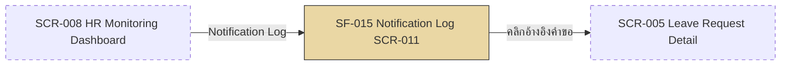

# SF-015 — Notification Log View

## 1. Overview

| รายการ | รายละเอียด |
| --- | --- |
| Function ID | SF-015 |
| Function Name | Notification Log View |
| Category | Screen |
| Screen Type | Search List |
| Description | HR ค้นหาและตรวจสอบ log การส่ง Email notification ทุกรายการของระบบ ดู delivery status, retry count และ failure reason พร้อม monitor KPI Email success rate ≥99% |
| Actor / User Role | HR |
| Related Requirement IDs | RFR-003, SFR-013, SCR-011, NFR-007, NFR-005 |
| Source Reference | Screen SRS §2.15 (SF-015), Report SRS §2.3 (RP-003), Interface SRS §2.2 (IF-002), SRS §4.2 RFR-003, BRD BR-019 |
| Version | 1.0 |
| Created By | screen-design-agent (2026-07-12) |
| Updated By | — |

## 2. Business Purpose

ให้ HR ตรวจสอบว่า Email notification ของทุก event (ยื่นลา/อนุมัติ/ปฏิเสธ/ยกเลิก/SLA Reminder/SLA Escalate) ส่งถึงผู้รับสำเร็จหรือไม่ โดยไม่ต้องพึ่ง IT ตรวจสอบ log โดยตรง ใช้ troubleshoot กรณี notification ไม่ถึงมือผู้รับ และ monitor KPI Email success rate ≥99% ตาม BRD §5.3.1.C (Source: Report SRS §2.3.1, BRD BR-019, SRS NFR-007)

## 3. Screen Overview

| รายการ | รายละเอียด |
| --- | --- |
| Screen Name | Notification Log (SCR-011) |
| Menu Path | Main Menu > HR Monitoring Dashboard (SCR-008) > Notification Log (Assumption — ดู §13) |
| Navigation Inbound | Header Navigation (role = HR) — Assumption เนื่องจาก Screen SRS §2.15 (SF-015 stub) ไม่ได้ระบุ Navigation Inbound ไว้ชัดเจน |
| Navigation Outbound | คลิกแถว "อ้างอิงคำขอ" (request_no) → SCR-005 Leave Request Detail (Assumption — ไม่ระบุใน SRS) |
| Preconditions | Login เป็น HR (SF-001) |
| Postconditions | หน้าจอ read-only (ไม่เปลี่ยน DB state) — NotificationLogs เป็น immutable log |

### Related Screens

| Screen ID | Screen Name | Description |
| --- | --- | --- |
| SCR-008 | HR Monitoring Dashboard | หน้าจอต้นทาง (Assumption) — จุดเข้าถึงเมนู HR |
| SCR-005 | Leave Request Detail | ปลายทางเมื่อคลิกอ้างอิงคำขอในแถว log (Assumption) |

### Screen Flow

```text
Header Navigation (role = HR)
  └── SCR-008 HR Monitoring Dashboard (Assumption)
        └── [Notification Log] → SF-015 Notification Log (SCR-011)
              └── [คลิกอ้างอิงคำขอ] → SCR-005 Leave Request Detail (Assumption)
```



## 4. Mockup / UI Layout

| รายการ | รายละเอียด |
| --- | --- |
| Mockup Reference | — (Report SRS §2.3.6 ระบุว่าไม่มี mockup อ้างอิงจริง — style reference ชี้ไปที่โฟลเดอร์ `leave-monitoring-report/` ที่ไม่มีไฟล์อยู่จริง — ASCII ด้านล่างเป็น Assumption ของเอกสารนี้) |
| Layout Description | ส่วนบน: Filter (ช่วงวันที่, event type, recipient email, delivery status) + ปุ่ม Generate/Refresh ส่วนกลาง: Summary Strip (ทั้งหมด/สำเร็จ/ล้มเหลว/Success Rate %) ส่วนล่าง: ตาราง log เรียงตาม timestamp descending |

```text
+----------------------------------------------------------------------+
| [LOGO]  Leave Management System        User: [HR_ID]  [HR_NAME]     |
+----------------------------------------------------------------------+
| Menu >> HR Monitoring >> Notification Log (SCR-011)                  |
+----------------------------------------------------------------------+
| Log การแจ้งเตือน (Notification Log)                                   |
|                                                                      |
| วันที่เริ่มต้น [2026-07-12 📅]  วันที่สิ้นสุด [2026-07-12 📅]              |
| Event Type [ทั้งหมด ▾]  Recipient [___________]  Status [ทั้งหมด ▾]     |
|                                       [ ดูรายงาน ]  [ Refresh ]        |
+----------------------------------------------------------------------+
| Summary: ทั้งหมด 128  สำเร็จ 126  ล้มเหลว 2  Success Rate 98.4% ⚠      |
+----------------------------------------------------------------------+
| วัน-เวลา         | Event          | อ้างอิง       | พนักงาน | ผู้รับ | สถานะ | Retry | เหตุผล |
| 2026-07-12 09:12 | Leave Submitted| LR-2026-00123 | สมชาย   | mgr@..| Success| 0    | —      |
| 2026-07-12 08:50 | SLA Escalated  | CR-2026-00004 | สมหญิง  | hr@...| Failed | 3    | Timeout|
+----------------------------------------------------------------------+
```

## 5. Fields Definition

### 5.1 Filter Section (Report SRS §2.3.3)

| No | Field Name | Label (TH/EN) | Type | Length | Required | Default | Validation | DB Mapping | Description |
| :---: | --- | --- | --- | --- | --- | --- | --- | --- | --- |
| 1 | date_from | วันที่เริ่มต้น / Date From | Date Picker | — | Y | วันนี้ (Today) | ≤ date_to — ผิด: ERR-SF015-001 (ดู Assumption §13) | `NotificationLogs.CreatedAt` (DATETIME2, ดู Assumption §13) | วันเริ่มต้นของช่วงที่ต้องการดู log |
| 2 | date_to | วันที่สิ้นสุด / Date To | Date Picker | — | Y | วันนี้ (Today) | ≥ date_from | `NotificationLogs.CreatedAt` (DATETIME2) | วันสิ้นสุดของช่วงที่ต้องการดู log |
| 3 | event_type | ประเภท Event / Event Type | Dropdown | 50 | N | ทั้งหมด (All) | ค่าตาม `EventType` ที่ระบบใช้จริง (เช่น LeaveSubmitted, LeaveApproved, LeaveRejected, CancelRequestSubmitted, CancelApproved, CancelRejected, SLAReminder, SLAEscalated) | `NotificationLogs.EventType` (NVARCHAR(50)) | กรองตามประเภท event |
| 4 | recipient_email | อีเมลผู้รับ / Recipient | Text | 200 | N | — | format email (ถ้ากรอก) | `NotificationLogs.RecipientEmail` (NVARCHAR(200)) | กรองตาม email ผู้รับ (partial match) |
| 5 | delivery_status | สถานะการส่ง / Status | Dropdown | — | N | ทั้งหมด (All) | ค่า: All / Success(2) / Failed(3) / Retry(1 — ดู Assumption §13) | `NotificationLogs.DeliveryStatus` (TINYINT: 1=Pending, 2=Success, 3=Failed) | กรองตามสถานะการส่ง |

### 5.2 Summary Strip (Display Only — คำนวณจากผลลัพธ์ query ปัจจุบัน)

| No | Field Name | Label (TH/EN) | Type | Length | Required | Default | Validation | DB Mapping | Description |
| :---: | --- | --- | --- | --- | --- | --- | --- | --- | --- |
| 1 | total_count | ทั้งหมด / Total | Number (read-only) | — | Y | — | — | คำนวณ: `COUNT(NotificationLogs.NotificationLogId)` | จำนวน log ทั้งหมดตาม filter |
| 2 | success_count | สำเร็จ / Success | Number (read-only) | — | Y | — | — | คำนวณ: `COUNT WHERE DeliveryStatus = 2` | จำนวนที่ส่งสำเร็จ |
| 3 | failed_count | ล้มเหลว / Failed | Number (read-only) | — | Y | — | — | คำนวณ: `COUNT WHERE DeliveryStatus = 3` | จำนวนที่ส่งล้มเหลว |
| 4 | success_rate_pct | Success Rate (%) | Decimal (read-only) | — | Y | — | < 99%: แสดง WRN-LOG-001 | คำนวณ: `success_count / total_count × 100` | ใช้ monitor KPI (NFR-007) |

### 5.3 Result List Section (Display Only — Report SRS §2.3.5)

| No | Field Name | Label (TH/EN) | Type | Length | Required | Default | Validation | DB Mapping | Description |
| :---: | --- | --- | --- | --- | --- | --- | --- | --- | --- |
| 1 | sent_at | วัน-เวลาที่ส่ง / Sent At | DateTime (read-only) | — | N | — | NULL เมื่อยังไม่ส่งสำเร็จ | `NotificationLogs.SentAt` (DATETIME2, nullable) | timestamp ที่ระบบส่ง Email สำเร็จ |
| 2 | event_type | ประเภท Event / Event Type | Text (read-only) | — | Y | — | — | `NotificationLogs.EventType` (NVARCHAR(50)) | ชื่อ event ที่ trigger notification |
| 3 | request_no | อ้างอิงคำขอ / Request No. | Text (read-only, link) | 30 | N | — | แสดง `LeaveRequestRef` หรือ `CancelRequestRef` แล้วแต่ FK ที่มีค่า (ดู Assumption §13) | `LeaveRequests.LeaveRequestRef` หรือ `CancelRequests.CancelRequestRef` (JOIN ผ่าน `NotificationLogs.LeaveRequestId`/`CancelRequestId`) | เลขอ้างอิงคำขอที่เกี่ยวข้อง — คลิกเพื่อเปิด SCR-005 |
| 4 | employee_name | ชื่อพนักงาน / Employee | Text (read-only) | — | N | — | — | `Employees.FullNameTh` (JOIN ผ่าน `LeaveRequests.EmployeeId` หรือ `CancelRequests.RequestedBy`) | ชื่อพนักงานเจ้าของคำขอที่เกี่ยวข้อง (ดู Assumption §13) |
| 5 | recipient_email | ผู้รับ / Recipient | Text (read-only) | 200 | Y | — | — | `NotificationLogs.RecipientEmail` (NVARCHAR(200)) | Email ผู้รับ |
| 6 | recipient_role | บทบาทผู้รับ / Recipient Role | Text (read-only) | 20 | Y | — | — | `NotificationLogs.RecipientRole` (NVARCHAR(20): Employee/Manager/HR) | บทบาทของผู้รับ |
| 7 | delivery_status | สถานะ / Status | Badge (color-coded, read-only) | — | Y | — | — | `NotificationLogs.DeliveryStatus` (TINYINT: 1=Pending, 2=Success, 3=Failed) | สถานะการส่ง — สีเขียว/แดง/เหลือง |
| 8 | retry_count | Retry / Retry Count | Number (read-only) | — | Y | 0 | — | `NotificationLogs.RetryCount` (TINYINT) | จำนวนครั้งที่ retry (0 = สำเร็จครั้งแรก) |
| 9 | failure_reason | สาเหตุล้มเหลว / Failure Reason | Text (read-only) | — | N | — | แสดงเฉพาะ `delivery_status = Failed` | `NotificationLogs.FailureReason` (NVARCHAR(MAX)) | Error message จาก Email gateway |

## 6. Commands / Actions

| No | Command | Type | Default State | Trigger Condition | System Response |
| :---: | --- | --- | --- | --- | --- |
| 1 | ดูรายงาน / Generate | Button | Enable | date_from/date_to กรอกครบและ valid | เรียก `IReportService.GetNotificationLogAsync(filter, pagination)` → แสดง Summary Strip + ตาราง log |
| 2 | Refresh | Button | Enable | คลิก | เรียกซ้ำด้วย filter ปัจจุบัน — ดึงข้อมูลล่าสุด |
| 3 | Export | Button | Disable/ซ่อน (Open Issue — ยังไม่ยืนยันความต้องการ) | — | — (ดู §13 Open Issue) |
| 4 | คลิกแถว (request_no) | Link (row click) | Enable เมื่อมีค่า request_no | คลิก | Navigate ไป SCR-005 Leave Request Detail ของคำขอนั้น (Assumption) |
| 5 | Pagination (Next/Prev) | Pager | Enable เมื่อผลลัพธ์มากกว่า 1 หน้า | คลิก | เรียก `GetNotificationLogAsync` ซ้ำด้วย `PaginationDto` หน้าถัดไป/ก่อนหน้า |

## 7. Screen Behavior

### 7.1 Initial Screen (onLoad)

- default `date_from = date_to = วันนี้` (Report SRS §2.3.3) — เอกสารนี้ assume auto-generate ทันทีด้วย default filter (ไม่ต้องรอกด Generate) เนื่องจากเป็น monitoring screen ที่ HR ควรเห็นข้อมูลล่าสุดทันที (Assumption — ดู §13)
- แสดง Summary Strip + ตาราง log เรียงตาม `SentAt` DESC (ตกลง fallback `CreatedAt` DESC เมื่อ `SentAt` เป็น NULL — Report SRS §2.3.2 "เรียงตาม timestamp descending")
- ถ้า success_rate < 99%: แสดง WRN-LOG-001; ถ้า ≥ 99%: แสดง INF-LOG-001

### 7.2 เปลี่ยน Filter (onChange)

- ไม่ query ทันที — รอผู้ใช้คลิก "ดูรายงาน/Generate" (ยกเว้น onLoad ตาม §7.1)

### 7.3 Click "ดูรายงาน / Generate"

#### 7.3.1 Validation (ตามลำดับใน service call)

| ลำดับ | Validation | Requirement | Error Message |
| :---: | --- | --- | --- |
| 1 | date_from ≤ date_to | ดู Assumption §13 (ไม่มี validation นี้ใน Report SRS RP-003 — ตั้งใหม่ตาม pattern เดียวกับ RP-001) | ERR-SF015-001 |
| 2 | Query คืนผลลัพธ์อย่างน้อย 1 record | Report SRS §2.3.8 | ERR-LOG-001 |

#### 7.3.2 Insert / Update (DB Transaction)

```text
— ไม่มี DB Transaction (หน้าจอนี้อ่านอย่างเดียว — NotificationLogs เป็น immutable log)

SELECT (via IReportService.GetNotificationLogAsync):
  NotificationLogs (NL)
  LEFT JOIN LeaveRequests (LR)   ON NL.LeaveRequestId  = LR.LeaveRequestId
  LEFT JOIN CancelRequests (CR)  ON NL.CancelRequestId = CR.CancelRequestId
  LEFT JOIN Employees (E)        ON E.EmployeeId = COALESCE(LR.EmployeeId, CR.RequestedBy)
  WHERE NL.CreatedAt BETWEEN @date_from AND @date_to
    AND (@event_type IS NULL OR NL.EventType = @event_type)
    AND (@recipient_email IS NULL OR NL.RecipientEmail LIKE @recipient_email)
    AND (@delivery_status IS NULL OR NL.DeliveryStatus = @delivery_status)
  ORDER BY NL.SentAt DESC, NL.CreatedAt DESC
  PAGINATED BY PaginationDto (PageNumber, PageSize)
```

- Query logic ข้างต้นเป็น Assumption ของเอกสารนี้ (ดู §13) — Method Signature §4.11 มีเฉพาะ signature ของ `GetNotificationLogAsync` ไม่มีนิยาม `NotificationLogFilterDto`/`NotificationLogDto` ที่ชัดเจน

### 7.4 Click "Refresh"

- เรียก `GetNotificationLogAsync` ซ้ำด้วย filter ปัจจุบัน — ไม่ reset filter

### 7.5 คลิกแถว (request_no link)

- Navigate ไป SCR-005 Leave Request Detail ของคำขอนั้น (Assumption — ไม่ระบุใน SRS)

## 8. Business Rules

| Rule ID | Business Rule | Impact | Source Reference |
| --- | --- | --- | --- |
| BR-SF015-001 | HR เห็น log ทุก event ทุกแผนก ไม่จำกัด scope (RBAC) | Endpoint enforce `[Authorize(Policy="HrOnly")]` ที่ Backend — query ไม่ filter ตามแผนกของผู้เรียก | BRD BR-019, SRS NFR-005, Report SRS §2.3.9 |
| BR-SF015-002 | Success Rate < 99% ต้องแจ้งเตือน HR | แสดง WRN-LOG-001 บน Summary Strip | SRS NFR-007, BRD §5.3.1.C KPI |
| BR-SF015-003 | Email retry อย่างน้อย 3 ครั้งก่อนถือว่า Failed | `retry_count` สะท้อนจำนวนครั้งจริงที่ retry | SRS SIR-002, NFR-007, Interface SRS §2.2.9 |
| BR-SF015-004 | NotificationLogs เป็น immutable log — หน้านี้ read-only ไม่มี edit/delete | ไม่มี command แก้ไข/ลบ log ในหน้าจอนี้ | Data Architecture §6.3.8 (NotificationLogs — Immutable) |

## 9. Message List

### Error Messages

| Message ID | Trigger | Message (TH) | Message (EN) |
| --- | --- | --- | --- |
| ERR-LOG-001 | ไม่พบ log ตาม filter (Report SRS §2.3.8) | ไม่พบรายการ log ที่ตรงกับเงื่อนไขที่เลือก | No notification log entries found for the selected criteria. |
| ERR-SF015-001 | date_from > date_to (ตั้งใหม่ — ดู Assumption §13) | วันที่เริ่มต้นต้องน้อยกว่าหรือเท่ากับวันที่สิ้นสุด | Start date must be less than or equal to end date. |

### Warning Messages

| Message ID | Trigger | Message (TH) | Message (EN) |
| --- | --- | --- | --- |
| WRN-LOG-001 | Success Rate < 99% ในช่วงเวลาที่ดู | อัตราการส่ง Email ต่ำกว่า 99% ({rate}%) — กรุณาตรวจสอบ | Email success rate is below 99% ({rate}%) — please investigate. |

### Success / Info Messages

| Message ID | Trigger | Message (TH) | Message (EN) |
| --- | --- | --- | --- |
| INF-LOG-001 | Success Rate ≥ 99% | อัตราการส่ง Email ในช่วงนี้อยู่ที่ {rate}% — เป็นไปตาม KPI | Email success rate is {rate}% — within KPI target. |

## 10. Popup / Sub-screen Definition

— ไม่มี (หน้าจอ search list แสดงผลอย่างเดียว — ไม่มี popup; การดูรายละเอียดคำขอเป็นการ navigate ไปหน้าอื่น — SCR-005)

## 11. Database Tables Reference

| Table Name | Alias | Description |
| --- | --- | --- |
| NotificationLogs | NL | SELECT log ทุกรายการตาม filter (main table) — immutable, ไม่มี INSERT/UPDATE/DELETE จากหน้าจอนี้ |
| LeaveRequests | LR | LEFT JOIN เพื่อดึง `LeaveRequestRef` (request_no) และ `EmployeeId` เมื่อ `NotificationLogs.LeaveRequestId` ไม่ null |
| CancelRequests | CR | LEFT JOIN เพื่อดึง `CancelRequestRef` (request_no) และ `RequestedBy` เมื่อ `NotificationLogs.CancelRequestId` ไม่ null |
| Employees | E | LEFT JOIN ผ่าน `LeaveRequests.EmployeeId` หรือ `CancelRequests.RequestedBy` เพื่อดึงชื่อพนักงาน (`FullNameTh`) |

## 12. Exception Handling

| Error Case | Trigger Condition | System Behavior | User Message | Recovery |
| --- | --- | --- | --- | --- |
| Validation error | date_from > date_to | ไม่ query — focus ที่ date_from | ERR-SF015-001 | แก้ไขช่วงวันที่ |
| No data | Query คืน 0 record | แสดงข้อความแทนตาราง — Summary Strip แสดง 0 ทุกช่อง | ERR-LOG-001 | ปรับ filter ให้กว้างขึ้น |
| KPI warning | Success Rate < 99% | แสดง banner เตือนเหนือตาราง (ไม่ block การดูข้อมูล) | WRN-LOG-001 | HR ตรวจสอบแถวที่ Failed |
| System error | Backend ล่ม / query timeout (HTTP 5xx) | แสดง error ตาม global error handling ของ SPA | "ระบบขัดข้องชั่วคราว กรุณาลองใหม่" | รอและลองใหม่ |
| Authorization error | ผู้ใช้ที่ไม่ใช่ HR เรียก endpoint ตรง | HTTP 403 — Audit log Access Denied | — (Frontend ไม่แสดงเมนูนี้ให้ role อื่น) | — |

## 13. Notes / Assumptions

| ประเภท | รายละเอียด | ผลกระทบ |
| --- | --- | --- |
| Open Issue (จาก SRS) | Export log เป็นไฟล์ (ต้องการหรือไม่) ยังไม่ยืนยัน (Report SRS §2.3.7, §2.3.10) | ปุ่ม Export ใน §6 disabled/ซ่อนไว้เป็น placeholder จนกว่าจะ confirm |
| Open Issue (จาก SRS) | Log retention period ยังไม่ยืนยัน | กระทบช่วงเวลาย้อนหลังที่ query ได้จริง — ต้อง confirm ก่อน Phase 2 sprint |
| Open Issue (จาก SRS) | SLA Escalate assignee ใน HR ยังไม่ระบุตำแหน่ง/email | กระทบค่า `recipient_email`/`recipient_role` ของ event SLAEscalated ในผลลัพธ์ |
| Assumption (จาก SRS) | Report SRS §2.3.3 ระบุ filter `delivery_status` มีตัวเลือก "Success / Failed / Retry" แต่ `NotificationLogs.DeliveryStatus` ใน DDL มีเพียง 1=Pending, 2=Success, 3=Failed (ไม่มีค่า "Retry" แยก) | เอกสารนี้ map ตัวเลือก UI "Retry" = `DeliveryStatus = 1` (Pending) — ต้องให้ BA ยืนยัน label ที่ถูกต้อง |
| Assumption (เอกสารนี้) | Filter `date_from`/`date_to` เทียบกับ `NotificationLogs.CreatedAt` (ไม่ใช่ `SentAt`) เพราะ `SentAt` เป็น NULL ได้เมื่อยังไม่ส่งสำเร็จ (Pending/กำลัง retry) | หากต้องการ filter ตามเวลาที่ "ส่งจริง" เท่านั้น ต้องเปลี่ยนเงื่อนไข WHERE — ต้อง confirm กับ BA |
| Assumption (เอกสารนี้) | `request_no`/`employee_name` ต้อง LEFT JOIN ทั้ง `LeaveRequests` และ `CancelRequests` เพราะ `NotificationLogs` มี FK ทั้งสองแบบ nullable (Data Architecture §6.3.8) | Query ซับซ้อนขึ้นเล็กน้อย — ต้องตรวจสอบ performance เมื่อ log มีจำนวนมาก |
| Assumption (เอกสารนี้) | ไม่มี error message สำหรับ "date_from > date_to" ใน Report SRS RP-003 — เอกสารนี้ตั้ง `ERR-SF015-001` ใหม่ (pattern เดียวกับ `ERR-RPT-001` ของ RP-001) | ต้องให้ BA ยืนยันข้อความก่อน implement |
| Assumption (เอกสารนี้) | onLoad auto-generate รายงานด้วย default filter (date_from=date_to=วันนี้) ทันที แทนที่จะรอกด Generate เพราะเป็น monitoring screen ที่ HR ควรเห็นข้อมูลทันที | ต้อง confirm กับ UX ว่าต้องการ auto-load หรือรอ manual trigger เหมือน RP-001/RP-002 |
| Assumption (เอกสารนี้) | คลิกแถว request_no navigate ไป SCR-005 Leave Request Detail — ไม่มีระบุใน SRS ชัดเจน (เฉพาะ CancelRequest ที่ไม่มีหน้าจอ detail แยกใน Cross-Function Traceability) | สำหรับ log ที่มาจาก CancelRequest อาจต้อง navigate ไปหน้าอื่นแทน (ยังไม่ระบุ) — ต้อง confirm |
| Note | Service method หลัก: `IReportService.GetNotificationLogAsync()` (Method Signature §4.11) — `NotificationLogFilterDto`/`NotificationLogDto` ยังไม่มี record definition ชัดเจนใน Method Signature (มีเฉพาะการอ้างถึงใน signature) — เอกสารนี้ตั้งสมมติฐาน field ตาม `NotificationLogs` DDL และ Report SRS §2.3.5 | ต้องเพิ่ม record definition ของทั้ง 2 DTO ใน Method Signature ก่อน implement |

## Change Log

| Version | Date | Author | Change Type | Description | Remark |
| --- | --- | --- | --- | --- | --- |
| 1.0 | 2026-07-12 | screen-design-agent (Claude) | Created | สร้างเอกสารครั้งแรกจาก Screen SRS v1.1 (§2.15 SF-015), Report SRS §2.3 (RP-003), Interface SRS §2.2 (IF-002), Data Architecture Design (NotificationLogs/LeaveRequests/CancelRequests/Employees DDL), Method Signature §4.11 (`IReportService.GetNotificationLogAsync`) | Generated ตาม template screen-design-agent |

### สรุปการเปลี่ยนแปลงสำคัญ

| ช่วง Version | การเปลี่ยนแปลง | ผลกระทบ |
| --- | --- | --- |
| 1.0 | Baseline แรก | — |
