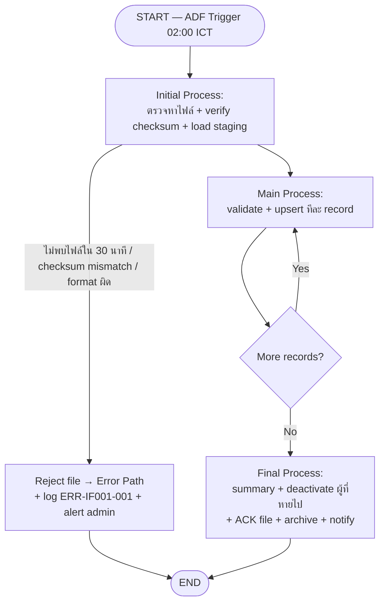

# IF-001 — Employee Master Sync

## 1. Overview

| รายการ | รายละเอียด |
| --- | --- |
| Function ID | IF-001 |
| Interface Name | Employee Master Sync |
| Category | Interface — Batch File Process |
| Direction | Inbound |
| Pattern | SFTP (Batch File Transfer — Pattern A Primary ตาม Integration Architecture §6; Sync REST API เป็น Fallback/Pattern B) |
| Description | ดึงข้อมูล Employee Master Data ของพนักงานประจำจาก HRIS เดิม มายังระบบ Leave Web App เพื่อใช้สร้าง account, ระบุ line manager และคำนวณ leave entitlement โดย HRIS export ไฟล์ CSV วางบน SFTP รายวัน แล้ว Leave App นำเข้าแบบ upsert ลงตาราง `Employees` |
| Source System | HRIS (Legacy) |
| Destination System | Leave Web App (SQL Server — ตาราง `Employees`) |
| Related Requirement IDs | SIR-001, SFR-001, SFR-002, TR-002, NFR-005 |
| Source Reference | Interface SRS §2.1 IF-001, SRS §4.3 SIR-001, §4.5 IF-001, BRD §3.4 HRIS Integration, QA-H6, Integration Architecture §6–§7.1 |

## 2. Business Purpose

ให้ข้อมูลพนักงานประจำในระบบ Leave App สอดคล้องกับ HRIS ซึ่งเป็น master source เพียงแหล่งเดียว — ไม่ duplicate ข้อมูลและไม่ต้อง manage master data ใหม่ (Interface SRS §2.1.1, BRD §3.4) พนักงานใหม่ใน HRIS จะถูกสร้าง account อัตโนมัติ พนักงานที่ลาออก/เกษียณจะถูกปรับเป็น Inactive และ login ไม่ได้ (SFR-001, SFR-002) ทั้งนี้ Leave App **อ่านข้อมูลจาก HRIS อย่างเดียว ห้าม write กลับ** (BRD §3.4, QA-H6)

## 3. Interface Description

| รายการ | รายละเอียด |
| --- | --- |
| Protocol | SFTP over SSH (Integration Architecture §11 — IF-001 Pattern A) |
| Authentication | SSH Key Pair RSA 4096-bit; ไฟล์เข้ารหัส PGP / AES-256 ก่อนส่ง (sensitive employee data) |
| Frequency | Daily Batch (รายวัน — Scheduled) |
| Schedule | ทุกวัน 02:00 ICT (นอกเวลาทำการ) — Azure Data Factory trigger (Integration Architecture §7.1.1; เวลายังไม่ยืนยันจาก SRS — ดู Notes) |
| Timeout | หากไม่พบไฟล์ภายใน 30 นาทีหลัง schedule → alert "ไม่พบ HRIS export file" (Integration Architecture §9.4) |
| Retry Policy | Batch retry 3 ครั้ง ห่างกัน 15 นาที → หากยัง fail alert admin (Integration Architecture §8.2) |

## 4. File Specification

### 4.1 File Format

| รายการ | รายละเอียด |
| --- | --- |
| File Format | CSV (Integration Architecture §10.3) |
| Encoding | UTF-8 with BOM |
| Delimiter | Comma (,) — string enclosure double-quote (") |
| Header Row | Yes (แถวแรก) |
| Max File Size | ยังไม่กำหนดใน SRS — Assumption: ≤ 50 MB (ดู Notes) |
| Max Records | ยังไม่กำหนดใน SRS — Assumption: ≤ 50,000 records ต่อไฟล์ (ดู Notes) |

### 4.2 File Naming Convention

| รายการ | รายละเอียด |
| --- | --- |
| Pattern | `HRIS_EMPLOYEES_YYYYMMDD_HHMMSS.csv` + checksum file `HRIS_EMPLOYEES_YYYYMMDD_HHMMSS.sha256` + ACK file `HRIS_EMPLOYEES_YYYYMMDD_HHMMSS.ack` (Leave App สร้างภายใน 1 ชั่วโมงหลัง import สำเร็จ) |
| Example | `HRIS_EMPLOYEES_20260617_020000.csv`, `HRIS_EMPLOYEES_20260617_020000.sha256` |

### 4.3 File Path

| รายการ | Path |
| --- | --- |
| Source Path | `/outbound/hris/` (บน SFTP server — HRIS วางไฟล์) |
| Destination Path | `/inbound/hris/` (Leave App อ่าน) |
| Archive Path | `/archive/hris/YYYYMMDD/` |
| Error Path | `/error/hris/YYYYMMDD/` |

> Path ยังไม่ระบุใน SRS/Architecture — ตั้งตาม pattern ใน knowledge base §6 (ดู Notes / Assumptions)

## 5. Data Mapping

| No | Source Field | Dest Field (Table.Column) | Data Type | Length | Required | Default | Transformation / Validation |
| :---: | --- | --- | --- | --- | --- | --- | --- |
| 1 | employee_id | Employees.EmployeeId | NVARCHAR | 20 | Y | — | Business key จาก HRIS — ใช้เป็น upsert key; ห้ามว่าง (Interface SRS §2.1.4) |
| 2 | employee_code | Employees.EmployeeCode | NVARCHAR | 20 | Y | ค่าเดียวกับ employee_id | Unique ในระบบ (UQ_Employees_EmployeeCode); field มาจาก Integration Architecture §10.3 |
| 3 | name_th | Employees.FullNameTh | NVARCHAR | 200 | Y | — | ห้ามว่าง |
| 4 | name_en | Employees.FullNameEn | NVARCHAR | 200 | Y | — | ห้ามว่าง |
| 5 | department | Employees.Department | NVARCHAR | 200 | N | NULL | — |
| 6 | position | Employees.Position | NVARCHAR | 200 | N | NULL | — |
| 7 | email | Employees.Email | NVARCHAR | 200 | Y | — | Format email valid; unique ในระบบ (UQ_Employees_Email) — ใช้ login และ notification |
| 8 | hire_date | Employees.HireDate | DATE | — | Y | — | Format `YYYY-MM-DD`; ใช้คำนวณ leave entitlement (BRD BR-008) |
| 9 | line_manager_id | Employees.ManagerId | NVARCHAR | 20 | Y | — | ต้องมีอยู่ในไฟล์เดียวกันหรือในตาราง `Employees` (FK self-reference) — ใช้ route approval (NFR-005) |
| 10 | employment_status | Employees.IsActive | BIT | — | Y | — | Map: `Active` → 1, `Inactive` → 0 |
| 11 | — (ระบบกำหนด) | Employees.EmployeeType | TINYINT | — | Y | 1 (Regular) | ทุก record จาก IF-001 = Regular เสมอ (BRD BR-011 — Outsource มาจาก IF-003) |
| 12 | — (ระบบกำหนด) | Employees.LastSyncedAt | DATETIME2(0) | — | Y | เวลา sync (UTC) | Stamp ทุกครั้งที่ upsert สำเร็จ |
| 13 | — (ระบบกำหนด) | Employees.CreatedBy / UpdatedBy | NVARCHAR | 100 | Y | `SYSTEM` | ตาม Data Architecture §6.3.2 (audit column) |

### Sample Data

```text
employee_id,employee_code,name_th,name_en,department,position,email,hire_date,line_manager_id,employment_status
"EMP001","EMP001","สมชาย ใจดี","Somchai Jaidee","Information Technology","Software Engineer","somchai@abc.com","2022-01-15","EMP050","Active"
"EMP050","EMP050","สมศักดิ์ บริหาร","Somsak Borihan","Information Technology","IT Manager","somsak@abc.com","2015-03-01","EMP010","Active"
```

## 6. Trigger / Timing

| Trigger | Description | Timing |
| --- | --- | --- |
| Scheduled | Azure Data Factory trigger ตรวจหาไฟล์บน SFTP แล้วเริ่ม import pipeline | ทุกวัน 02:00 ICT (Integration Architecture §7.1.1) |
| Manual | HR/Admin สั่ง sync ซ้ำเมื่อมีการเปลี่ยนแปลงโครงสร้างองค์กร หรือ re-run หลังแก้ไขไฟล์ | On-demand (Interface SRS §2.1.5 — รายละเอียดยังไม่ยืนยัน) |

## 7. Processing Logic

### Process Flow Diagram



### 7.1 Initial Process

จุดประสงค์: เตรียมความพร้อมก่อนประมวลผลข้อมูล — ถ้าขั้นนี้ fail ให้จบการทำงานทั้งไฟล์ (ไม่เข้า Main Process)

| Step | รายละเอียด | กรณี Fail |
| :---: | --- | --- |
| 1 | ตรวจสอบว่ามีไฟล์ `HRIS_EMPLOYEES_*.csv` ใน `/inbound/hris/` ภายใน 30 นาทีหลัง 02:00 ICT | Log + alert "ไม่พบ HRIS export file" (ERR-IF001-001) → END |
| 2 | ตรวจสอบ file naming convention `HRIS_EMPLOYEES_YYYYMMDD_HHMMSS.csv` | Reject file → Error Path + log → END |
| 3 | Verify SHA-256 checksum เทียบกับไฟล์ `.sha256` | Alert "File corrupted" → Reject file → Error Path + log → END (Integration Architecture §9.4) |
| 4 | ตรวจสอบ encoding (UTF-8 with BOM) และ header row ครบ 10 คอลัมน์ | Reject file → Error Path + log → END |
| 5 | ตรวจสอบไฟล์ซ้ำ (ชื่อไฟล์เคย process แล้ว — เทียบ processing log) | Reject file + log "duplicate file" → END |
| 6 | นับจำนวน record ทั้งหมด (Total Records) และบันทึกลง processing log (`ImportLogs`) | — |
| 7 | โหลดข้อมูลเข้า staging table `tmp_employee_sync` | Rollback + log → END |

### 7.2 Main Process

จุดประสงค์: ประมวลผลทีละ record — record ที่ fail ให้ skip + log แล้วทำ record ถัดไปต่อ (ไม่หยุดทั้งไฟล์)

| Step | รายละเอียด | กรณี Fail |
| :---: | --- | --- |
| 1 | อ่าน record จาก staging table `tmp_employee_sync` | — |
| 2 | Validate ระดับ record: required fields ครบ (employee_id, name_th, name_en, email, hire_date, line_manager_id, employment_status), email format, hire_date format `YYYY-MM-DD` | นับเป็น Failed Record → log ERR-IF001-002 พร้อม row number + เหตุผล → เก็บลง reject table `rej_employee_sync` → record ถัดไป |
| 3 | Validate ระดับ business rule: line_manager_id ต้อง resolve ได้ (BR-IF001-004), email ไม่ชนกับพนักงานคนอื่น (UQ_Employees_Email) | นับเป็น Failed Record → log + reject table → record ถัดไป |
| 4 | Upsert ลง `Employees` ผ่าน `IEmployeeRepository.UpsertAsync` — key = EmployeeId: ไม่พบ → Insert (สร้าง account ใหม่, EmployeeType=1, CreatedBy=`SYSTEM`); พบ → Update field ตาม mapping + UpdatedBy=`SYSTEM`; employment_status=Inactive → IsActive=0 | นับเป็น Failed Record → rollback record นั้น + log → record ถัดไป |
| 5 | Stamp `LastSyncedAt` = เวลา sync (UTC) แล้วนับเป็น Success Record | — |

**Validation Rules (ระดับ record):**

| No | Field | Rule | Error Message | Source |
| :---: | --- | --- | --- | --- |
| 1 | ทุก required field | ห้ามว่าง (ตาม Data Mapping ข้อ 5) | ERR-IF001-002 | Interface SRS §2.1.7 |
| 2 | email | Format valid + unique ในระบบ (ยกเว้น record ตัวเอง) | ERR-IF001-002 | Data Architecture UQ_Employees_Email |
| 3 | hire_date | Format `YYYY-MM-DD` และไม่เป็นวันอนาคต | ERR-IF001-002 | BRD BR-008 (hire_date กระทบ entitlement) |
| 4 | line_manager_id | ต้องมีในไฟล์เดียวกันหรือใน `Employees` (process record ของ manager ก่อน subordinate) | ERR-IF001-002 | SRS NFR-005 |
| 5 | employment_status | ต้องเป็น `Active` หรือ `Inactive` เท่านั้น | ERR-IF001-002 | Interface SRS §2.1.4 |

### 7.3 Final Process

จุดประสงค์: สรุปผลการทำงานและปิดรอบ — **ต้องสรุปจำนวน record เสมอ**

| Step | รายละเอียด |
| :---: | --- |
| 1 | สรุปผลการประมวลผล (Processing Summary — ดูตารางด้านล่าง) และบันทึกลง processing log (`ImportLogs`) — INF-IF001-001 |
| 2 | สร้าง error report สำหรับ record ที่ fail (row number + field + เหตุผล) จาก reject table |
| 3 | Deactivate: พนักงานประจำ (EmployeeType=1, IsActive=1) ที่**ไม่ปรากฏ**ในไฟล์รอบนี้ → set IsActive=0 (ถือว่าลาออก/เกษียณ — Interface SRS §2.1.6; full-file assumption ดู Notes) |
| 4 | สร้าง ACK file `HRIS_EMPLOYEES_YYYYMMDD_HHMMSS.ack` บน SFTP ภายใน 1 ชั่วโมง (Integration Architecture §7.1.1) |
| 5 | ย้ายไฟล์ไป Archive Path (สำเร็จ/partial) หรือ Error Path (fail ทั้งไฟล์) |
| 6 | ส่ง notification สรุปผลไปยัง System Admin / HR ตาม Monitoring & Alerting |
| 7 | เคลียร์ staging data (`tmp_employee_sync`) ตาม retention policy (Assumption: เก็บ 7 วัน) |

**Processing Summary (บังคับ):**

| รายการ | คำอธิบาย |
| --- | --- |
| Total Records | จำนวน record ทั้งหมดในไฟล์ |
| Success Records | จำนวน record ที่ upsert สำเร็จ |
| Failed Records | จำนวน record ที่ไม่สำเร็จ (Total = Success + Failed เสมอ) |
| Start Time / End Time / Duration | เวลาเริ่ม-จบ-รวม |
| Processing Status | Success / Partial Success / Failed |

## 8. Expected Result

| Scenario | เงื่อนไข | Expected Result |
| --- | --- | --- |
| Success | Failed Records = 0 | ข้อมูลพนักงานประจำใน Leave App ตรงกับ HRIS ทั้งหมด — พนักงานใหม่มี account, พนักงานลาออกเป็น Inactive, INF-IF001-001 log, ACK file สร้างแล้ว |
| Partial Success | Success > 0 และ Failed > 0 | Record ที่ valid ถูก upsert; record ที่ fail อยู่ใน error report (ERR-IF001-002 ต่อ record); alert admin "บาง record import ไม่ได้" |
| Failure | Initial Process fail หรือ Success = 0 | ไม่มีข้อมูลเปลี่ยนแปลง — Leave App ใช้ข้อมูลเดิม (cache) ต่อ, ERR-IF001-001 + alert admin, HR Dashboard แสดง WRN-IF001-001 หาก sync ล่าช้าเกินกำหนด |

## 9. Error Handling

| Error Case | Process ที่เกิด | System Behavior | Recovery |
| --- | --- | --- | --- |
| File not found (ภายใน 30 นาที) | Initial | Log ERR-IF001-001 + alert admin — retry ตรวจหาไฟล์ 3 ครั้ง ห่าง 15 นาที | HRIS ส่งไฟล์ใหม่ / ประสาน HRIS vendor |
| Checksum mismatch / file corrupted | Initial | Reject file → Error Path + alert "File corrupted" | HRIS export และส่งไฟล์ใหม่ |
| File format / naming / encoding ผิด | Initial | Reject file → Error Path + alert | แก้ไขไฟล์แล้วส่งใหม่ |
| Duplicate file | Initial | Reject + log — ไม่ process ซ้ำ (idempotent) | Admin ตรวจสอบว่าเป็นไฟล์รอบใหม่จริงหรือไม่ |
| Record validation fail | Main | Skip record + log ลง reject table (นับ Failed) — ERR-IF001-002 | HRIS แก้ข้อมูลต้นทาง → รอบ sync ถัดไป |
| DB error ระหว่าง upsert | Main | Rollback record นั้น + log → record ถัดไป | Admin ตรวจสอบ; re-run ได้เพราะ upsert idempotent |
| Sync ล่าช้าเกินกำหนด (ไม่มีรอบสำเร็จในวัน) | — | Leave App ใช้ cached Employee data; HR Dashboard แสดง WRN-IF001-001 (last sync: {datetime}) | Admin re-run manual trigger |
| Summary/ACK/archive fail | Final | Log + alert admin (ข้อมูล upsert แล้วไม่ rollback) | Admin สร้าง ACK / archive manual |

## 10. Business Rules

| Rule ID | Business Rule | Impact | Source |
| --- | --- | --- | --- |
| BR-IF001-001 | พนักงานประจำที่ active ทุกคนต้องมี account ใน Leave App — สร้างอัตโนมัติจาก sync | Insert record ใหม่เมื่อไม่พบ EmployeeId | BRD BR-001, SRS SFR-001 |
| BR-IF001-002 | hire_date กระทบการคำนวณ leave entitlement ทั้งหมด — ต้อง validate format เข้มงวด | Validation rule ข้อ 3; ค่าผิด = Failed Record | BRD BR-008 |
| BR-IF001-003 | HRIS integrate แต่ไม่ replace — Leave App อ่านอย่างเดียว ห้าม write กลับ HRIS | Interface เป็น Inbound ทางเดียว; ACK file เป็น delivery confirmation ไม่ใช่ data write-back | BRD §3.4, QA-H6 |
| BR-IF001-004 | line_manager_id ใช้ route approval (RBAC) — ต้อง resolve เป็นพนักงานที่มีอยู่จริง | Validation rule ข้อ 4; ค่าผิดกระทบ approval flow | SRS NFR-005 |
| BR-IF001-005 | ข้อมูลจาก IF-001 เป็นพนักงานประจำเท่านั้น — EmployeeType = Regular เสมอ; Outsource ห้ามปนมาทาง interface นี้ | ระบบ set EmployeeType=1 ทุก record; ห้าม mix data source | BRD BR-011, Interface SRS §2.1.3 Exclusion |

## 11. Monitoring & Alerting

| Event | Alert Channel | Recipient | เนื้อหา |
| --- | --- | --- | --- |
| Processing complete | Email + Azure Monitor Dashboard | System Admin | Processing Summary (Total/Success/Failed) — INF-IF001-001 |
| Processing failed (ทั้ง job) | Email / Teams (🔴 Critical — Batch import failure > 0 jobs) | System Admin / On-call | ERR-IF001-001 + error detail + log reference (Integration Architecture §12.3) |
| Partial failure (บาง record) | Email (⚠️ Warning — partial failure > 0 records) | System Admin / HR | Error report (row + field + เหตุผล) |
| File not received | Email | System Admin + HRIS vendor contact | ชื่อไฟล์ที่คาด + schedule 02:00 ICT |
| Sync ล่าช้า (data stale) | HR Dashboard | HR | WRN-IF001-001 — last sync: {datetime} |

## 12. Notes / Assumptions

| ประเภท | รายละเอียด | ผลกระทบ |
| --- | --- | --- |
| Open Issue (SRS) | Integration pattern ยังไม่ยืนยัน (Batch / API / DB link) — เอกสารนี้ใช้ **Pattern A: Batch SFTP เป็น baseline** ตาม Integration Architecture §6 (Primary); หาก HRIS ยืนยัน REST API ต้อง revise เป็น template API | กระทบ design ทั้งเอกสาร — รอ HRIS vendor ยืนยัน capability |
| Open Issue (SRS) | Frequency/เวลา sync ยังไม่ยืนยัน — baseline ใช้ 02:00 ICT ตาม Integration Architecture §7.1.1 | กระทบ data freshness และ WRN-IF001-001 threshold |
| Open Issue (SRS) | Manual Trigger โดย HR — SRS ระบุ "ข้อมูลไม่เพียงพอ" ยังไม่มีหน้าจอ/สิทธิ์รองรับ | รอ confirm scope; ระบุไว้ใน §6 เป็น on-demand |
| Assumption | ไฟล์เป็น **full file** (พนักงานประจำ active ทั้งหมดทุกรอบ ไม่ใช่ delta) — จึง deactivate ผู้ที่หายไปจากไฟล์ได้ (Final Process step 3) | หาก HRIS ส่ง delta file ต้องตัด logic deactivate ออก — ต้อง confirm กับ HRIS vendor |
| Assumption | Max file size ≤ 50 MB / ≤ 50,000 records — SRS ไม่ระบุ ตั้งตามขนาดองค์กรทั่วไป | ปรับได้เมื่อทราบจำนวนพนักงานจริง |
| Assumption | File path (`/inbound/hris/` ฯลฯ) ตั้งตาม pattern knowledge base §6 — ยังไม่ confirm กับ infra team | Config ตอน deploy |
| Assumption | Staging/reject table ชื่อ `tmp_employee_sync` / `rej_employee_sync` ตาม naming pattern knowledge base §8 — ยังไม่อยู่ใน Data Architecture / Class Diagram | ต้องเพิ่มใน Data Architecture ก่อน implement |
| Assumption | Staging data retention 7 วัน — ไม่ระบุใน SRS | ปรับตาม policy จริง |
| Assumption | employee_code ในไฟล์ = employee_id (ตาม sample Integration Architecture §10.3) — SRS §2.1.4 ไม่มี field นี้ | หาก HRIS มี code แยกต่างหาก mapping ข้อ 2 ยังรองรับ |
| Constraint | Outsource ไม่อยู่ใน HRIS — ใช้ IF-003 Excel Import แทน ห้าม mix data source | ตาม Interface SRS §2.1.9 |
| Constraint | HRIS เป็น master — Leave App ไม่แก้ไขข้อมูลพนักงานประจำในระบบเอง; หาก HRIS ผิด Leave App ผิดตาม | ตาม Interface SRS §2.1.9 |

## Change Log

| Version | Date | Author | Change Type | Description | Source |
|---------|------|--------|-------------|-------------|--------|
| 1.0 | 2026-07-09 | SA Team | Created | สร้างเอกสารครั้งแรก — generate จาก Interface SRS v1.0 (§2.1 IF-001), Integration Architecture Design v1.0, Data Architecture Design (Employees DDL), Method Signature (HrisEmployeeDto, IEmployeeRepository) | Interface SRS v1.0 |
