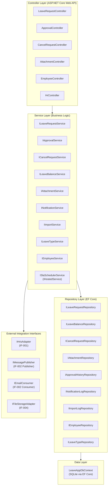

# Method Signature and Interface Definition
## ระบบบริหารการลาและการอนุมัติ — Leave Request and Approval

## Change Log

| Version | Date | Section | Change Type | Description | Source |
|---------|------|---------|-------------|-------------|--------|
| 1.0 | 2026-06-17 | All | Created | สร้างเอกสารครั้งแรก — Repository/Service/External interfaces ครอบคลุม SFR-001–SFR-015, IF-001–IF-005 | Class Diagram v1.0, Integration Architecture v1.0, SRS Summary v1.0 |

---

## 1. Application Architecture Overview



**Naming Convention:**
- Interface prefix: `I` (e.g. `ILeaveRequestService`)
- Async suffix: `Async` สำหรับทุก method ที่ติดต่อ DB หรือ external
- CancellationToken: ทุก async method รับ `CancellationToken ct = default` เป็น parameter สุดท้าย

---

## 2. Common Types — DTOs, Results, Exceptions

### 2.1 Input DTOs

```csharp
// SFR-003
public record CreateLeaveRequestDto(
    byte LeaveTypeId,
    DateOnly StartDate,
    DateOnly EndDate,
    bool IsHalfDay,
    string? HalfDayPeriod,     // "AM" | "PM"
    string? Reason,
    List<Guid> AttachmentIds   // ต้องแนบก่อน upload via IF-004
);

// SFR-005
public record ApproveRejectDto(
    string? Reason             // optional สำหรับ Approve, required สำหรับ Reject (VR validation)
);

// SFR-008
public record SubmitCancelRequestDto(
    string? Reason
);

// SFR-006, SFR-011
public record LeaveRequestFilterDto(
    DateOnly? StartDate = null,
    DateOnly? EndDate = null,
    LeaveStatus? Status = null,
    byte? LeaveTypeId = null
);

// SFR-011 (HR only)
public record HrLeaveFilterDto(
    DateOnly? StartDate = null,
    DateOnly? EndDate = null,
    LeaveStatus? Status = null,
    byte? LeaveTypeId = null,
    string? Department = null,
    EmployeeType? EmployeeType = null
);

public record PaginationDto(
    int PageNumber = 1,
    int PageSize = 20,
    string SortBy = "CreatedAt",
    bool SortDescending = true
);

// Phase 2 — RFR-001, RFR-002
public record LeaveReportFilterDto(
    DateOnly StartDate,
    DateOnly EndDate,
    string? Department = null,
    EmployeeType? EmployeeType = null,
    byte? LeaveTypeId = null,
    ReportFormat Format = ReportFormat.Excel
);

public enum ReportFormat { Excel, Pdf }
```

### 2.2 Output DTOs

```csharp
public record LeaveRequestResult(
    Guid LeaveRequestId,
    string LeaveRequestRef,
    LeaveStatus Status,
    string Message
);

public record LeaveRequestSummaryDto(
    Guid LeaveRequestId,
    string LeaveRequestRef,
    string LeaveTypeName,
    DateOnly StartDate,
    DateOnly EndDate,
    decimal DurationDays,
    LeaveStatus Status,
    DateTime CreatedAt
);

public record LeaveRequestDetailDto(
    Guid LeaveRequestId,
    string LeaveRequestRef,
    string EmployeeId,
    string EmployeeFullName,
    string LeaveTypeName,
    DateOnly StartDate,
    DateOnly EndDate,
    decimal DurationDays,
    bool IsHalfDay,
    string? Reason,
    LeaveStatus Status,
    string? ApprovedBy,
    DateTime? ApprovedAt,
    string? RejectedBy,
    DateTime? RejectedAt,
    string? RejectionReason,
    List<AttachmentSummaryDto> Attachments,
    List<ApprovalHistorySummaryDto> History
);

public record LeaveBalanceDashboardDto(
    string EmployeeId,
    int LeaveYear,
    List<LeaveBalanceItemDto> Balances
);

public record LeaveBalanceItemDto(
    byte LeaveTypeId,
    string TypeCode,
    string TypeNameTh,
    string TypeNameEn,
    decimal EntitledDays,
    decimal UsedDays,
    decimal PendingDays,
    decimal CarriedForwardDays,
    decimal RemainingDays           // = EntitledDays + CarriedForwardDays - UsedDays - PendingDays
);

public record CancelRequestResult(
    Guid CancelRequestId,
    string CancelRequestRef,
    CancelRequestStatus Status,
    DateTime SlaDeadline,
    string Message
);

public record UploadedFileDto(
    Guid AttachmentId,
    string FileName,
    string FileType,
    long FileSizeBytes
);

public record AttachmentSummaryDto(
    Guid AttachmentId,
    string FileName,
    string FileType,
    long FileSizeBytes,
    DateTime CreatedAt
);

public record ApprovalHistorySummaryDto(
    string ApproverId,
    string ApproverName,
    ApprovalAction Action,
    string? Reason,
    DateTime ActionAt
);

public record EmployeeProfileDto(
    string EmployeeId,
    string EmployeeCode,
    string FullNameTh,
    string FullNameEn,
    string? Department,
    string? Position,
    string Email,
    EmployeeType EmployeeType,
    string? ManagerId
);

public record ImportResultDto(
    Guid ImportLogId,
    int TotalRecords,
    int SuccessRecords,
    int FailedRecords,
    List<ImportErrorDto> Errors
);

public record ImportErrorDto(
    int RowNumber,
    string Field,
    string Message
);

// Paging wrapper
public record PagedResult<T>(
    List<T> Items,
    int TotalCount,
    int PageNumber,
    int PageSize,
    int TotalPages
);

// Azure Blob upload result
public record BlobUploadResult(
    string StoragePath,
    string BlobUrl,
    string ETag
);

// CloudEvents DTO
public record CloudEventDto(
    string SpecVersion,
    string Type,
    string Source,
    string Id,
    DateTime Time,
    string DataContentType,
    string CorrelationId,
    object Data
);

// HRIS DTO (IF-001)
public record HrisEmployeeDto(
    string EmployeeId,
    string EmployeeCode,
    string FullNameTh,
    string FullNameEn,
    string? Department,
    string? Position,
    string Email,
    DateOnly HireDate,
    string? ManagerId,
    bool IsActive
);
```

### 2.3 Custom Exceptions

```csharp
// ─── Domain Exceptions ───────────────────────────────────────────────────────
public class EmployeeNotFoundException(string employeeId)
    : Exception($"Employee '{employeeId}' not found or inactive.");

public class LeaveRequestNotFoundException(Guid leaveRequestId)
    : Exception($"LeaveRequest '{leaveRequestId}' not found.");

public class CancelRequestNotFoundException(Guid cancelRequestId)
    : Exception($"CancelRequest '{cancelRequestId}' not found.");

public class LeaveTypeNotFoundException(byte leaveTypeId)
    : Exception($"LeaveType '{leaveTypeId}' not found or inactive.");

// ─── Business Rule Exceptions ─────────────────────────────────────────────────
public class InvalidLeaveTypeForEmployeeException(string employeeType, string leaveTypeName)
    : Exception($"Employee type '{employeeType}' is not eligible for leave type '{leaveTypeName}'. (VR-001)");

public class InsufficientLeaveBalanceException(string leaveTypeName, decimal remaining, decimal requested)
    : Exception($"Insufficient balance for '{leaveTypeName}': remaining {remaining} days, requested {requested} days. (VR-002)");

public class ProbationPeriodException()
    : Exception("Employee is in probation period (<3 months). Annual leave is not permitted. (VR-003)");

public class AnnualLeaveInsufficientServiceException()
    : Exception("Employee service < 1 year. Annual leave is not permitted. (VR-004)");

public class LeaveAdvanceNoticeException(string leaveTypeName, int requiredDays)
    : Exception($"'{leaveTypeName}' requires advance notice of at least {requiredDays} working day(s). (VR-005/VR-006)");

public class MedicalCertificateRequiredException()
    : Exception("Medical certificate is required for sick leave >= 3 consecutive working days. (VR-007)");

public class DateConflictException(DateOnly startDate, DateOnly endDate)
    : Exception($"Leave period {startDate:yyyy-MM-dd} to {endDate:yyyy-MM-dd} conflicts with an existing approved/pending request.");

public class LeaveQuotaExceededException(string leaveTypeName, decimal maxDays)
    : Exception($"Annual quota for '{leaveTypeName}' ({maxDays} days/year) is fully used. (VR-011)");

// ─── Authorization Exceptions ─────────────────────────────────────────────────
public class UnauthorizedLeaveActionException(string reason)
    : Exception($"Unauthorized action: {reason}");

public class CannotCancelApprovedLeaveWithoutRequestException()
    : Exception("Approved leave must be cancelled via Cancel Request flow. (SFR-008)");

// ─── SLA / State Exceptions ───────────────────────────────────────────────────
public class SlaExpiredException(Guid cancelRequestId)
    : Exception($"SLA for CancelRequest '{cancelRequestId}' has expired. Status is Escalated. (VR-012)");

public class InvalidLeaveStatusTransitionException(LeaveStatus current, string action)
    : Exception($"Cannot perform '{action}' on a leave request with status '{current}'.");

// ─── File / Import Exceptions ─────────────────────────────────────────────────
public class InvalidFileTypeException(string actualType, IEnumerable<string> allowedTypes)
    : Exception($"File type '{actualType}' is not allowed. Allowed: {string.Join(", ", allowedTypes)}. (TR-005)");

public class FileSizeLimitExceededException(long actualBytes, long maxBytes)
    : Exception($"File size {actualBytes:N0} bytes exceeds limit of {maxBytes:N0} bytes. (TR-005)");

public class ExcelImportValidationException(List<ImportErrorDto> errors)
    : Exception($"Excel import failed with {errors.Count} validation error(s).")
{
    public List<ImportErrorDto> Errors { get; } = errors;
}

// ─── Integration Exceptions ───────────────────────────────────────────────────
public class HrisAdapterException(string message, Exception? inner = null)
    : Exception(message, inner);

public class MessagePublishException(string eventType, Exception? inner = null)
    : Exception($"Failed to publish event '{eventType}' to Service Bus.", inner);
```

---

## 3. Layer 1: Repository Interfaces

> **Pattern:** Repository Pattern — แยก data access logic ออกจาก business logic  
> **EF Core:** ทุก method ใช้ `DbContext` ภายใน implementation — ห้าม call DbContext โดยตรงจาก Service  
> **SQLite:** ไม่ใช้ SQL Server-specific syntax (ไม่ใช้ Raw SQL, ใช้ LINQ เท่านั้น)

### 3.1 ILeaveTypeRepository

```csharp
public interface ILeaveTypeRepository
{
    // SFR-002, SFR-003, VR-001
    Task<LeaveType?> GetByIdAsync(byte leaveTypeId, CancellationToken ct = default);
    // - EF Core: FindAsync(leaveTypeId) — Global Query Filter (IsDeleted=false) บังคับอัตโนมัติ
    // - Return: null ถ้าไม่พบหรือ IsDeleted=true

    Task<IEnumerable<LeaveType>> GetAllActiveAsync(CancellationToken ct = default);
    // - EF Core: Where(lt => !lt.IsDeleted).ToListAsync()
    // - ใช้สำหรับ dropdown / balance dashboard

    Task<IEnumerable<LeaveType>> GetAvailableForEmployeeTypeAsync(EmployeeType employeeType, CancellationToken ct = default);
    // - EF Core: Where(lt => !lt.IsDeleted && (employeeType == Regular || lt.IsAvailableForOutsource))
    // - SRS: VR-001 — Outsource ไม่มีสิทธิ์ลาบางประเภท
}
```

### 3.2 IEmployeeRepository

```csharp
public interface IEmployeeRepository
{
    // SFR-001 (post-login profile load)
    Task<Employee?> GetByIdAsync(string employeeId, CancellationToken ct = default);
    // - EF Core: Include(e => e.Manager) ถ้าต้องการ Manager info

    Task<Employee?> GetByEmailAsync(string email, CancellationToken ct = default);
    // - ใช้สำหรับ SSO callback — map email → EmployeeId

    // SFR-004 (Manager inbox ตรวจสอบ subordinates)
    Task<IEnumerable<Employee>> GetSubordinatesAsync(string managerId, CancellationToken ct = default);
    // - EF Core: Where(e => e.ManagerId == managerId && !e.IsDeleted && e.IsActive)

    // IF-001 / IF-003 Upsert
    Task UpsertAsync(Employee employee, CancellationToken ct = default);
    // - EF Core: ExecuteUpdateAsync หรือ Add/Update + SaveChangesAsync
    // - ใช้ตรวจ ExistsAsync ก่อน — ถ้ามีอยู่ Update, ถ้าไม่มี Insert

    Task<bool> ExistsAsync(string employeeId, CancellationToken ct = default);
    // - EF Core: AnyAsync(e => e.EmployeeId == employeeId && !e.IsDeleted)

    Task<bool> ExistsByEmailAsync(string email, CancellationToken ct = default);
    // - ตรวจ duplicate email ก่อน IF-003 import (VR-013)
}
```

### 3.3 ILeaveRequestRepository

```csharp
public interface ILeaveRequestRepository
{
    // SFR-005, SFR-007, SFR-008 (ดึง single record)
    Task<LeaveRequest?> GetByIdAsync(Guid leaveRequestId, CancellationToken ct = default);
    // - EF Core: Include(lr => lr.Attachments).Include(lr => lr.ApprovalHistories)
    //            .FirstOrDefaultAsync(lr => lr.LeaveRequestId == leaveRequestId)
    // - Global Query Filter (IsDeleted=false) บังคับอัตโนมัติ

    // SFR-006 (My Leave History)
    Task<PagedResult<LeaveRequest>> GetByEmployeeAsync(
        string employeeId,
        LeaveRequestFilterDto filter,
        PaginationDto pagination,
        CancellationToken ct = default);
    // - EF Core: Where(lr => lr.EmployeeId == employeeId)
    //            + dynamic filter (status, leaveTypeId, dateRange)
    //            + OrderByDescending + Skip/Take

    // SFR-004 (Manager Approval Inbox)
    Task<PagedResult<LeaveRequest>> GetPendingByManagerAsync(
        string managerId,
        PaginationDto pagination,
        CancellationToken ct = default);
    // - EF Core: Where(lr => lr.Employee.ManagerId == managerId && lr.Status == Pending)
    //            Include(lr => lr.Employee) Include(lr => lr.LeaveType)

    // SFR-011 (HR Dashboard)
    Task<PagedResult<LeaveRequest>> GetAllAsync(
        HrLeaveFilterDto filter,
        PaginationDto pagination,
        CancellationToken ct = default);
    // - EF Core: dynamic filter (department, employeeType, status, dateRange, leaveTypeId)

    // VR-004 / DateConflict check
    Task<IEnumerable<LeaveRequest>> GetOverlappingAsync(
        string employeeId,
        DateOnly startDate,
        DateOnly endDate,
        CancellationToken ct = default);
    // - EF Core: Where(lr => lr.EmployeeId == employeeId
    //            && lr.Status is Pending or Approved
    //            && lr.StartDate <= endDate && lr.EndDate >= startDate)

    Task AddAsync(LeaveRequest leaveRequest, CancellationToken ct = default);
    // - EF Core: AddAsync + SaveChangesAsync — ใช้ใน Transaction กับ LeaveBalance deduct

    Task UpdateAsync(LeaveRequest leaveRequest, CancellationToken ct = default);
    // - EF Core: Update + SaveChangesAsync
    // - Set UpdatedAt = DateTime.UtcNow, UpdatedBy = actorId
}
```

### 3.4 ILeaveBalanceRepository

```csharp
public interface ILeaveBalanceRepository
{
    // SFR-002 (Dashboard)
    Task<IEnumerable<LeaveBalance>> GetByEmployeeAndYearAsync(
        string employeeId,
        int year,
        CancellationToken ct = default);
    // - EF Core: Where(lb => lb.EmployeeId == employeeId && lb.LeaveYear == year && !lb.IsDeleted)
    //            Include(lb => lb.LeaveType)

    // VR-002 (Balance check ก่อน Submit)
    Task<LeaveBalance?> GetAsync(
        string employeeId,
        byte leaveTypeId,
        int year,
        CancellationToken ct = default);
    // - EF Core: FirstOrDefaultAsync — ใช้ Unique Index (EmployeeId, LeaveTypeId, LeaveYear)

    Task UpdateAsync(LeaveBalance leaveBalance, CancellationToken ct = default);
    // - EF Core: Update + SaveChangesAsync — MUST be inside transaction กับ LeaveRequest

    Task AddAsync(LeaveBalance leaveBalance, CancellationToken ct = default);
    // - สร้าง balance record ใหม่เมื่อ initialize balance ต้นปี
}
```

### 3.5 ICancelRequestRepository

```csharp
public interface ICancelRequestRepository
{
    // SFR-009, VR-012
    Task<CancelRequest?> GetByIdAsync(Guid cancelRequestId, CancellationToken ct = default);
    // - EF Core: Include(cr => cr.LeaveRequest)
    //            .FirstOrDefaultAsync(cr => cr.CancelRequestId == cancelRequestId && !cr.IsDeleted)

    // ตรวจว่ามี active Cancel Request อยู่แล้วหรือไม่ (SFR-008 guard)
    Task<CancelRequest?> GetActiveByLeaveRequestAsync(
        Guid leaveRequestId,
        CancellationToken ct = default);
    // - EF Core: Where(cr => cr.LeaveRequestId == leaveRequestId
    //            && cr.Status == Pending && !cr.IsDeleted)
    //            .FirstOrDefaultAsync()

    // IF-005 SLA Scheduler query
    Task<IEnumerable<CancelRequest>> GetPendingForSlaCheckAsync(
        DateTime checkTime,
        CancellationToken ct = default);
    // - EF Core: Where(cr => cr.Status == Pending && !cr.IsDeleted
    //            && (cr.SlaDeadline.AddHours(-4) <= checkTime   // Reminder window
    //               || cr.SlaDeadline <= checkTime))             // Escalation window
    //            Include(cr => cr.LeaveRequest)

    Task AddAsync(CancelRequest cancelRequest, CancellationToken ct = default);
    Task UpdateAsync(CancelRequest cancelRequest, CancellationToken ct = default);
}
```

### 3.6 IAttachmentRepository

```csharp
public interface IAttachmentRepository
{
    Task<Attachment?> GetByIdAsync(Guid attachmentId, CancellationToken ct = default);

    Task<IEnumerable<Attachment>> GetByLeaveRequestAsync(
        Guid leaveRequestId,
        CancellationToken ct = default);
    // - EF Core: Where(a => a.LeaveRequestId == leaveRequestId && !a.IsDeleted)

    Task AddAsync(Attachment attachment, CancellationToken ct = default);

    Task SoftDeleteAsync(Guid attachmentId, string deletedBy, CancellationToken ct = default);
    // - EF Core: ExecuteUpdateAsync(a => a.SetProperty(x => x.IsDeleted, true)
    //                                     .SetProperty(x => x.DeletedAt, DateTime.UtcNow)
    //                                     .SetProperty(x => x.DeletedBy, deletedBy))
}
```

### 3.7 IApprovalHistoryRepository

```csharp
public interface IApprovalHistoryRepository
{
    // SFR-014 (Phase 2 Audit Trail)
    Task<IEnumerable<ApprovalHistory>> GetByLeaveRequestAsync(
        Guid leaveRequestId,
        CancellationToken ct = default);
    // - EF Core: Where(ah => ah.LeaveRequestId == leaveRequestId)
    //            .OrderBy(ah => ah.ActionAt)
    // - หมายเหตุ: ไม่มี Global Query Filter (Immutable)

    Task<IEnumerable<ApprovalHistory>> GetByCancelRequestAsync(
        Guid cancelRequestId,
        CancellationToken ct = default);

    Task AddAsync(ApprovalHistory history, CancellationToken ct = default);
    // - Immutable: ไม่มี Update/Delete method
    // - EF Core: AddAsync + SaveChangesAsync
    // - Set CreatedAt = DateTime.UtcNow, CreatedBy = actorId
}
```

### 3.8 INotificationLogRepository

```csharp
public interface INotificationLogRepository
{
    Task<NotificationLog?> GetByIdAsync(Guid notificationLogId, CancellationToken ct = default);

    // IF-002 Idempotency check — EmailAdapter ตรวจก่อน process
    Task<bool> ExistsAsync(Guid notificationLogId, CancellationToken ct = default);
    // - EF Core: AnyAsync(nl => nl.NotificationLogId == notificationLogId)

    Task AddAsync(NotificationLog log, CancellationToken ct = default);
    // - Immutable: ไม่มี hard Delete

    // EmailAdapter อัปเดต delivery status หลังส่ง email
    Task UpdateDeliveryStatusAsync(
        Guid notificationLogId,
        DeliveryStatus status,
        int retryCount,
        DateTime? sentAt,
        string? failureReason,
        CancellationToken ct = default);
    // - EF Core: ExecuteUpdateAsync — อัปเดต field เฉพาะ (ไม่ load entity ทั้งก้อน)
    // - หมายเหตุ: NotificationLog เป็น Immutable entity แต่ DeliveryStatus update ได้
    //   เพราะ "immutable" ในที่นี้หมายถึง ไม่มี UpdatedAt/UpdatedBy audit fields
    //   แต่ status ยังอัปเดตได้ผ่าน ExecuteUpdateAsync ตรงๆ

    // RFR-003 (Phase 2)
    Task<PagedResult<NotificationLog>> GetAllAsync(
        NotificationLogFilterDto filter,
        PaginationDto pagination,
        CancellationToken ct = default);
}
```

### 3.9 IImportLogRepository

```csharp
public interface IImportLogRepository
{
    Task AddAsync(ImportLog log, CancellationToken ct = default);
    // - Immutable: ไม่มี Update/Delete

    // SFR-012 (HR ดู import history)
    Task<PagedResult<ImportLog>> GetAllAsync(
        PaginationDto pagination,
        CancellationToken ct = default);
    // - EF Core: OrderByDescending(il => il.CreatedAt).Skip/Take
}
```

---

## 4. Layer 2: Service Interfaces

> **Pattern:** Service Layer — Business Logic อยู่ที่นี่ทั้งหมด  
> **Transaction:** Service เปิด `IDbContextTransaction` เมื่อต้อง atomic operation (เช่น Submit Leave + Deduct Balance)  
> **Authorization:** ทุก method ที่มี `actorId` ต้อง validate role ก่อน — ห้าม Frontend กำหนด role เอง

### 4.1 ILeaveTypeService

```csharp
public interface ILeaveTypeService
{
    // SFR-002, SFR-003 (Dropdown)
    Task<IEnumerable<LeaveTypeDto>> GetAllActiveAsync(CancellationToken ct = default);

    // SFR-003 (ก่อน submit — filter ตาม employee type)
    Task<IEnumerable<LeaveTypeDto>> GetAvailableForEmployeeAsync(
        string employeeId,
        CancellationToken ct = default);
    // - Description: ดึงประเภทลาที่พนักงานมีสิทธิ์ (filter IsAvailableForOutsource ถ้า Outsource)
    // - Validation: employeeId ต้องมีอยู่ในระบบ
    // - Exception: EmployeeNotFoundException
    // - EF Core: ILeaveTypeRepository.GetAvailableForEmployeeTypeAsync() + IEmployeeRepository.GetByIdAsync()
    // - SRS Trace: VR-001, SFR-002, SFR-003
}
```

### 4.2 IEmployeeService

```csharp
public interface IEmployeeService
{
    // SFR-001 (load profile หลัง SSO login)
    Task<EmployeeProfileDto?> GetProfileAsync(
        string employeeId,
        CancellationToken ct = default);
    // - Description: ดึงข้อมูล profile ของพนักงานสำหรับ Frontend หลังจาก authenticate ผ่าน Entra ID
    // - Validation: employeeId ต้องมีอยู่และ IsActive = true
    // - Exception: EmployeeNotFoundException
    // - EF Core: IEmployeeRepository.GetByIdAsync() — ใช้ Global Query Filter
    // - SRS Trace: SFR-001, NFR-004, TR-008

    // HR monitoring — filter dropdown
    Task<IEnumerable<EmployeeProfileDto>> GetSubordinatesAsync(
        string managerId,
        CancellationToken ct = default);
    // - Description: ดึงรายชื่อ subordinates สำหรับ Manager ดู Approval Inbox
    // - SRS Trace: SFR-004, NFR-005

    // IF-001: trigger HRIS sync on-demand (Pattern B) หรือ Admin action
    Task<int> SyncFromHrisAsync(CancellationToken ct = default);
    // - Description: ดึงข้อมูลพนักงานจาก HRIS แล้ว upsert ลงฐานข้อมูล
    // - Return: จำนวน record ที่ sync สำเร็จ
    // - Exception: HrisAdapterException (ถ้า HRIS ไม่ตอบสนอง → Polly fallback)
    // - EF Core: IEmployeeRepository.UpsertAsync() ใน loop
    // - SRS Trace: SIR-001, IF-001, TR-002
}
```

### 4.3 ILeaveBalanceService

```csharp
public interface ILeaveBalanceService
{
    // SFR-002 (Balance Dashboard)
    Task<LeaveBalanceDashboardDto> GetDashboardAsync(
        string employeeId,
        int? year = null,
        CancellationToken ct = default);
    // - Description: แสดงสิทธิ์วันลาคงเหลือแยกตามประเภท สำหรับพนักงาน
    // - Validation: employeeId ต้องมีอยู่; year default = current year
    // - Return: LeaveBalanceDashboardDto — RemainingDays = EntitledDays + CarriedForwardDays - UsedDays - PendingDays
    //   VR-008: cap CarriedForwardDays at 30 วัน ใน calculation
    // - Exception: EmployeeNotFoundException
    // - EF Core: ILeaveBalanceRepository.GetByEmployeeAndYearAsync() ≤ 2s (NFR-002)
    // - SRS Trace: SFR-002, NFR-002, VR-008, BR-009

    // Internal: ดึง remaining days สำหรับ VR-002 check ก่อน Submit
    Task<decimal> GetRemainingDaysAsync(
        string employeeId,
        byte leaveTypeId,
        int year,
        CancellationToken ct = default);
    // - SRS Trace: VR-002

    // Internal: หักวันลา — เรียกจาก ILeaveRequestService.SubmitLeaveRequestAsync() ใน transaction
    Task DeductBalanceAsync(
        string employeeId,
        byte leaveTypeId,
        decimal days,
        string updatedBy,
        CancellationToken ct = default);
    // - Description: หัก UsedDays เมื่อ Approve Leave Request
    //   ลด PendingDays เมื่อ Submit (Status=Pending)
    // - MUST: เรียกภายใน DB Transaction เท่านั้น (NFR-010)
    // - Exception: InsufficientLeaveBalanceException (VR-002)
    // - EF Core: ILeaveBalanceRepository.UpdateAsync() — atomic กับ LeaveRequest status update
    // - SRS Trace: NFR-010, BR-002, VR-002

    // Internal: คืนวันลา — เรียกจาก ICancelRequestService.ApproveCancelRequestAsync() ใน transaction
    Task RestoreBalanceAsync(
        string employeeId,
        byte leaveTypeId,
        decimal days,
        string updatedBy,
        CancellationToken ct = default);
    // - Description: คืน UsedDays เมื่อ Cancel Approved สำเร็จ
    // - MUST: เรียกภายใน DB Transaction เท่านั้น (NFR-010)
    // - EF Core: ILeaveBalanceRepository.UpdateAsync()
    // - SRS Trace: NFR-010, BR-016, NR-001, SFR-009

    // เรียกเมื่อ first login ของพนักงานหรือ ต้นปี
    Task InitializeYearlyBalanceAsync(
        string employeeId,
        int year,
        string createdBy,
        CancellationToken ct = default);
    // - Description: สร้าง LeaveBalance record สำหรับพนักงานตาม leave type ที่มีสิทธิ์
    //   คำนวณ EntitledDays ตาม อายุงาน (BR-008 tiers) และ CarriedForwardDays จากปีที่แล้ว
    // - EF Core: ILeaveBalanceRepository.AddAsync() — ถ้ายังไม่มี record
    // - SRS Trace: BR-008, BR-009, VR-004
}
```

### 4.4 ILeaveRequestService

```csharp
public interface ILeaveRequestService
{
    // SFR-003: Submit Leave Request
    Task<LeaveRequestResult> SubmitLeaveRequestAsync(
        string employeeId,
        CreateLeaveRequestDto request,
        CancellationToken ct = default);
    // - Description: ยื่นคำขอลาใหม่ สร้าง LeaveRequest ด้วย Status=Pending และหัก PendingDays
    // - Validation (ลำดับ):
    //   1. employeeId มีอยู่ + IsActive = true
    //   2. leaveTypeId ถูกต้อง + ไม่ใช่ IsDeleted
    //   3. IsAvailableForOutsource (VR-001) — ถ้า Outsource
    //   4. Probation < 3 เดือน + Annual Leave → reject (VR-003)
    //   5. Service < 1 ปี + Annual Leave → reject (VR-004)
    //   6. Annual Leave ต้องแจ้งล่วงหน้า ≥ 1 วัน (VR-005)
    //   7. Business Leave ต้องแจ้งล่วงหน้า ≥ 3 วันทำการ (VR-006)
    //   8. Sick Leave ≥ 3 วันทำการ + RequiresMedicalCert → ตรวจ AttachmentIds (VR-007)
    //   9. Balance check: RemainingDays >= DurationDays (VR-002) — ยกเว้น Sick Leave
    //   10. Date conflict check — ไม่ overlap กับ Pending/Approved request อื่น
    // - Exception: InvalidLeaveTypeForEmployeeException, ProbationPeriodException,
    //              AnnualLeaveInsufficientServiceException, LeaveAdvanceNoticeException,
    //              MedicalCertificateRequiredException, InsufficientLeaveBalanceException,
    //              DateConflictException, EmployeeNotFoundException
    // - EF Core: ใช้ DbContextTransaction
    //   BEGIN TRANSACTION
    //     INSERT LeaveRequest (Status=Pending)
    //     UPDATE LeaveBalance: PendingDays += DurationDays
    //   COMMIT
    //   AFTER COMMIT: INotificationService.PublishLeaveSubmittedAsync()
    // - SRS Trace: SFR-003, VR-001–007, NFR-010, BR-003–007, BR-011

    // SFR-006: My Leave History
    Task<PagedResult<LeaveRequestSummaryDto>> GetMyLeaveRequestsAsync(
        string employeeId,
        LeaveRequestFilterDto filter,
        PaginationDto pagination,
        CancellationToken ct = default);
    // - Description: ดึงรายการคำขอลาของพนักงาน filter ตาม status, date range, leaveType
    // - Validation: employeeId ต้องเป็น requestor เอง (NFR-005 — พนักงานเห็นเฉพาะของตัวเอง)
    // - Exception: EmployeeNotFoundException
    // - EF Core: ILeaveRequestRepository.GetByEmployeeAsync()
    // - SRS Trace: SFR-006, NFR-005, BR-006

    // SFR-005 (Detail view for Leave, Manager, HR)
    Task<LeaveRequestDetailDto> GetLeaveRequestDetailAsync(
        Guid leaveRequestId,
        string requestingEmployeeId,
        CancellationToken ct = default);
    // - Description: ดูรายละเอียด Leave Request พร้อม Attachments และ ApprovalHistory
    // - Validation RBAC:
    //   - พนักงาน: เห็นเฉพาะ request ของตัวเอง (NFR-005)
    //   - Manager: เห็นเฉพาะ request ของ subordinates
    //   - HR: เห็นทั้งหมด
    // - Exception: LeaveRequestNotFoundException, UnauthorizedLeaveActionException
    // - EF Core: ILeaveRequestRepository.GetByIdAsync() (Include Attachments + ApprovalHistories)
    // - SRS Trace: SFR-005, SFR-006, NFR-005, SFR-014

    // SFR-004: Manager Approval Inbox
    Task<PagedResult<LeaveRequestSummaryDto>> GetPendingApprovalsForManagerAsync(
        string managerId,
        PaginationDto pagination,
        CancellationToken ct = default);
    // - Description: รายการ Leave Request Status=Pending ของ subordinates ทั้งหมด
    // - Validation: employeeId เป็น Manager จริง (มี subordinate อย่างน้อย 1 คน)
    // - Exception: EmployeeNotFoundException
    // - EF Core: ILeaveRequestRepository.GetPendingByManagerAsync() JOIN Employee via ManagerId
    // - SRS Trace: SFR-004, NFR-005, BR-012

    // SFR-011: HR Monitoring Dashboard
    Task<PagedResult<LeaveRequestSummaryDto>> GetAllForHrAsync(
        HrLeaveFilterDto filter,
        PaginationDto pagination,
        CancellationToken ct = default);
    // - Description: HR ดูรายการคำขอทั้งองค์กร กรองตาม status/dept/employeeType/date/leaveType
    // - Validation: caller ต้องมี Role = HR (enforce ใน Controller via [Authorize(Policy="HrOnly")])
    // - EF Core: ILeaveRequestRepository.GetAllAsync()
    // - SRS Trace: SFR-011, NFR-005, BR-007

    // SFR-007: Cancel Pending Leave
    Task CancelPendingLeaveRequestAsync(
        string employeeId,
        Guid leaveRequestId,
        CancellationToken ct = default);
    // - Description: ยกเลิกคำขอที่ Status=Pending ได้ทันที — Status → Cancelled, คืน PendingDays
    // - Validation:
    //   1. leaveRequestId ต้องมีอยู่
    //   2. employeeId ต้องเป็นเจ้าของ request (RBAC)
    //   3. Status ต้องเป็น Pending เท่านั้น — Rejected ห้ามยกเลิก (VR-009)
    // - Exception: LeaveRequestNotFoundException, UnauthorizedLeaveActionException,
    //              InvalidLeaveStatusTransitionException
    // - EF Core: DbContextTransaction
    //   BEGIN TRANSACTION
    //     UPDATE LeaveRequest: Status=Cancelled, UpdatedAt, UpdatedBy
    //     UPDATE LeaveBalance: PendingDays -= DurationDays
    //   COMMIT
    //   หมายเหตุ: ไม่ต้อง trigger notification (SFR-007 — "no email required")
    // - SRS Trace: SFR-007, VR-009, BR-014, NFR-010
}
```

### 4.5 IApprovalService

```csharp
public interface IApprovalService
{
    // SFR-005: Approve Leave Request
    Task<ApprovalResult> ApproveLeaveRequestAsync(
        string managerId,
        Guid leaveRequestId,
        string? reason = null,
        CancellationToken ct = default);
    // - Description: Manager อนุมัติ Leave Request — Status: Pending → Approved
    //   อัปเดต Balance: PendingDays -= DurationDays, UsedDays += DurationDays
    //   บันทึก ApprovalHistory (Action=Approved)
    // - Validation:
    //   1. leaveRequestId ต้องมีอยู่ + Status = Pending
    //   2. managerId ต้องเป็น Manager ของ Employee (RBAC)
    //   3. LeaveRequest ไม่อยู่ใน IsDeleted
    // - Exception: LeaveRequestNotFoundException, UnauthorizedLeaveActionException,
    //              InvalidLeaveStatusTransitionException
    // - EF Core: DbContextTransaction
    //   BEGIN TRANSACTION
    //     UPDATE LeaveRequest: Status=Approved, ApprovedBy=managerId, ApprovedAt=now
    //     UPDATE LeaveBalance: PendingDays -= DurationDays, UsedDays += DurationDays
    //     INSERT ApprovalHistory: (LeaveRequestId, ApproverId, Action=Approved, ActionAt=now)
    //   COMMIT
    //   AFTER COMMIT: INotificationService.PublishLeaveApprovedAsync(leaveRequestId)
    // - SRS Trace: SFR-005, NFR-010, BR-012, NR-001

    // SFR-005: Reject Leave Request
    Task<ApprovalResult> RejectLeaveRequestAsync(
        string managerId,
        Guid leaveRequestId,
        string reason,
        CancellationToken ct = default);
    // - Description: Manager ปฏิเสธ Leave Request — Status: Pending → Rejected
    //   คืน PendingDays ทั้งหมด (ไม่กระทบ UsedDays)
    //   บันทึก ApprovalHistory (Action=Rejected)
    // - Validation:
    //   1. leaveRequestId ต้องมีอยู่ + Status = Pending
    //   2. managerId ต้องเป็น Manager ของ Employee
    //   3. reason ต้องไม่ว่าง (BR-013)
    // - Exception: LeaveRequestNotFoundException, UnauthorizedLeaveActionException,
    //              InvalidLeaveStatusTransitionException, ArgumentException (reason empty)
    // - EF Core: DbContextTransaction
    //   BEGIN TRANSACTION
    //     UPDATE LeaveRequest: Status=Rejected, RejectedBy, RejectedAt, RejectionReason
    //     UPDATE LeaveBalance: PendingDays -= DurationDays (คืนกลับ)
    //     INSERT ApprovalHistory: (LeaveRequestId, ApproverId, Action=Rejected, Reason, ActionAt)
    //   COMMIT
    //   AFTER COMMIT: INotificationService.PublishLeaveRejectedAsync(leaveRequestId, reason)
    // - SRS Trace: SFR-005, BR-013, NFR-010

public record ApprovalResult(
    Guid LeaveRequestId,
    LeaveStatus NewStatus,
    string Message
);
```

### 4.6 ICancelRequestService

```csharp
public interface ICancelRequestService
{
    // SFR-008: Submit Cancel Request (สำหรับ Approved Leave)
    Task<CancelRequestResult> SubmitCancelRequestAsync(
        string employeeId,
        Guid leaveRequestId,
        string? reason = null,
        CancellationToken ct = default);
    // - Description: ส่ง Cancel Request สำหรับ Leave ที่ Approved แล้ว
    //   สร้าง CancelRequest (Status=Pending), เปลี่ยน LeaveRequest Status=CancelRequested
    //   คำนวณ SlaDeadline = now + 1 วันทำการ (Assumption A4)
    //   เริ่มนับ SLA timer (IF-005 จะ pick up ใน background)
    // - Validation:
    //   1. leaveRequestId ต้องมีอยู่ + Status = Approved
    //   2. employeeId ต้องเป็นเจ้าของ request (RBAC, VR-009)
    //   3. ไม่มี active CancelRequest อยู่แล้ว (ตรวจ GetActiveByLeaveRequestAsync)
    // - Exception: LeaveRequestNotFoundException, UnauthorizedLeaveActionException,
    //              InvalidLeaveStatusTransitionException
    // - EF Core: DbContextTransaction
    //   BEGIN TRANSACTION
    //     INSERT CancelRequest (Status=Pending, SlaDeadline=计算)
    //     UPDATE LeaveRequest: Status=CancelRequested
    //   COMMIT
    //   AFTER COMMIT: INotificationService.PublishCancelRequestedAsync(cancelRequestId)
    // - SRS Trace: SFR-008, VR-009, BR-015, NR-001, NFR-011

    // SFR-009: Manager Approve Cancel Request
    Task<CancelApprovalResult> ApproveCancelRequestAsync(
        string managerId,
        Guid cancelRequestId,
        CancellationToken ct = default);
    // - Description: Manager อนุมัติ Cancel Request — CancelRequest Status=Approved
    //   LeaveRequest Status=Cancelled
    //   คืน UsedDays ให้ Employee (NFR-010, BR-016)
    //   บันทึก ApprovalHistory (Action=Approved)
    // - Validation:
    //   1. cancelRequestId ต้องมีอยู่ + Status = Pending
    //   2. SlaDeadline ยังไม่หมด (VR-012) — ถ้าหมดแล้ว Status=Escalated → SlaExpiredException
    //   3. managerId ต้องเป็น Manager ของ Employee เจ้าของ Leave
    // - Exception: CancelRequestNotFoundException, UnauthorizedLeaveActionException,
    //              SlaExpiredException, InvalidLeaveStatusTransitionException
    // - EF Core: DbContextTransaction
    //   BEGIN TRANSACTION
    //     UPDATE CancelRequest: Status=Approved, ApprovedBy, ApprovedAt
    //     UPDATE LeaveRequest: Status=Cancelled
    //     UPDATE LeaveBalance: UsedDays -= DurationDays (คืนวันลา, BR-016)
    //     INSERT ApprovalHistory: (CancelRequestId, ApproverId, Action=Approved, ActionAt)
    //   COMMIT
    //   AFTER COMMIT: INotificationService.PublishCancellationApprovedAsync(cancelRequestId)
    // - SRS Trace: SFR-009, VR-012, BR-015, BR-016, NR-001, NR-002, NFR-010

    // SFR-009: Manager Reject Cancel Request
    Task<CancelApprovalResult> RejectCancelRequestAsync(
        string managerId,
        Guid cancelRequestId,
        string reason,
        CancellationToken ct = default);
    // - Description: Manager ปฏิเสธ Cancel Request — CancelRequest Status=Rejected
    //   LeaveRequest กลับเป็น Status=Approved (ลาต่อไป ไม่ถูกยกเลิก)
    // - Validation:
    //   1. cancelRequestId ต้องมีอยู่ + Status = Pending
    //   2. SlaDeadline ยังไม่หมด (VR-012)
    //   3. managerId เป็น Manager ของ Employee
    //   4. reason ต้องไม่ว่าง
    // - Exception: CancelRequestNotFoundException, UnauthorizedLeaveActionException,
    //              SlaExpiredException, ArgumentException
    // - EF Core: DbContextTransaction
    //   BEGIN TRANSACTION
    //     UPDATE CancelRequest: Status=Rejected, RejectedBy, RejectedAt
    //     UPDATE LeaveRequest: Status=Approved (restore)
    //     INSERT ApprovalHistory: (CancelRequestId, ApproverId, Action=Rejected, Reason)
    //   COMMIT
    //   AFTER COMMIT: INotificationService.PublishCancellationRejectedAsync(cancelRequestId, reason)
    // - SRS Trace: SFR-009, VR-012, BR-015

public record CancelApprovalResult(
    Guid CancelRequestId,
    CancelRequestStatus NewStatus,
    Guid LeaveRequestId,
    LeaveStatus LeaveNewStatus,
    string Message
);
```

### 4.7 IAttachmentService

```csharp
public interface IAttachmentService
{
    // IF-004: Upload Medical Certificate
    Task<UploadedFileDto> UploadMedicalCertificateAsync(
        string employeeId,
        Guid leaveRequestId,
        Stream fileStream,
        string fileName,
        string contentType,
        long fileSizeBytes,
        CancellationToken ct = default);
    // - Description: Validate + upload ไฟล์ใบรับรองแพทย์ไปยัง Azure Blob Storage
    //   บันทึก Attachment metadata ใน DB — Return attachmentId สำหรับ reference ใน CreateLeaveRequestDto
    // - Validation:
    //   1. contentType ต้องเป็น application/pdf, image/jpeg, image/png เท่านั้น (TR-005)
    //   2. fileSizeBytes ≤ max allowed size (TR-005, Open Issue — TBD)
    //   3. Magic bytes check (Security — ป้องกัน MIME spoofing)
    //   4. leaveRequestId อาจเป็น empty Guid ถ้า upload ก่อน submit (Attachment = pre-upload)
    // - Exception: InvalidFileTypeException, FileSizeLimitExceededException
    // - Flow:
    //   1. IFileStorageAdapter.UploadAsync(stream, blobPath, contentType) — Azure Blob
    //   2. IAttachmentRepository.AddAsync(attachment metadata)
    // - SRS Trace: IF-004, SIR-005, VR-007, TR-005

    // SFR-005 (Download for Manager/HR review)
    Task<(Stream fileStream, string contentType, string fileName)> DownloadAttachmentAsync(
        Guid attachmentId,
        string requestingEmployeeId,
        CancellationToken ct = default);
    // - Description: ดาวน์โหลดใบรับรองแพทย์ผ่าน Signed URL (ไม่ expose Blob URL โดยตรง)
    // - Validation RBAC:
    //   - Employee เจ้าของเท่านั้น, หรือ Manager ของ Employee, หรือ HR
    // - Exception: UnauthorizedLeaveActionException, AttachmentNotFoundException
    // - Flow: IFileStorageAdapter.GenerateSignedUrlAsync() หรือ Stream proxy
    // - SRS Trace: NFR-005, NFR-006, SIR-005
}
```

### 4.8 INotificationService

```csharp
public interface INotificationService
{
    // SFR-013 + IF-002: Publish events to Azure Service Bus
    // หมายเหตุ: แต่ละ method ดึง recipient list จาก DB ก่อน publish

    Task PublishLeaveSubmittedAsync(Guid leaveRequestId, CancellationToken ct = default);
    // - CloudEvent type: com.abccompany.leave.request.submitted
    // - Recipients: Manager ของ Employee + HR
    // - SRS Trace: SFR-003, SFR-013, BR-019

    Task PublishLeaveApprovedAsync(Guid leaveRequestId, CancellationToken ct = default);
    // - CloudEvent type: com.abccompany.leave.request.approved
    // - Recipients: Employee + HR
    // - SRS Trace: SFR-005, SFR-013, BR-005

    Task PublishLeaveRejectedAsync(
        Guid leaveRequestId,
        string rejectionReason,
        CancellationToken ct = default);
    // - CloudEvent type: com.abccompany.leave.request.rejected
    // - Recipients: Employee + HR
    // - data.rejectionReason ต้องรวมใน payload (BR-013)
    // - SRS Trace: SFR-005, SFR-013, BR-013

    Task PublishCancelRequestedAsync(Guid cancelRequestId, CancellationToken ct = default);
    // - CloudEvent type: com.abccompany.leave.cancel.requested
    // - Recipients: Manager + HR
    // - SRS Trace: SFR-008, SFR-013, NR-001

    Task PublishCancellationApprovedAsync(Guid cancelRequestId, CancellationToken ct = default);
    // - CloudEvent type: com.abccompany.leave.cancel.approved
    // - Recipients: Employee + Manager + HR
    // - SRS Trace: SFR-009, SFR-013, NR-002

    Task PublishCancellationRejectedAsync(
        Guid cancelRequestId,
        string rejectionReason,
        CancellationToken ct = default);
    // - CloudEvent type: com.abccompany.leave.cancel.rejected
    // - Recipients: Employee + HR
    // - SRS Trace: SFR-009, SFR-013

    Task PublishSlaReminderAsync(Guid cancelRequestId, CancellationToken ct = default);
    // - CloudEvent type: com.abccompany.leave.sla.reminder
    // - Recipients: Manager (4 ชั่วโมงก่อนหมด SLA)
    // - เรียกโดย ISlaSchedulerService เท่านั้น
    // - SRS Trace: SFR-010, IF-005, BR-018

    Task PublishSlaEscalatedAsync(Guid cancelRequestId, CancellationToken ct = default);
    // - CloudEvent type: com.abccompany.leave.sla.escalated
    // - Recipients: HR (SLA Escalate Assignee — Open Issue)
    // - เรียกโดย ISlaSchedulerService เท่านั้น
    // - SRS Trace: SFR-010, IF-005, BR-018, M3 (QA v3)

    // Internal: build + publish CloudEvent (ใช้โดย method ด้านบน)
    Task PublishEventAsync(CloudEventDto cloudEvent, CancellationToken ct = default);
    // - IMessagePublisher.PublishAsync() → Azure Service Bus Topic "leave-events"
    // - INSERT NotificationLog (Status=Pending) ก่อน publish
    // - SRS Trace: IF-002, NFR-007
}
```

### 4.9 IImportService

```csharp
public interface IImportService
{
    // IF-003: Excel Import Outsource Employees
    Task<ImportResultDto> ImportOutsourceEmployeesAsync(
        string hrEmployeeId,
        Stream excelStream,
        string fileName,
        CancellationToken ct = default);
    // - Description: HR upload Excel file → validate 7 required fields → import valid records
    //   Return: success/failed counts + error list ทันที (Sync — VR-013)
    // - Validation per row (VR-013):
    //   1. 7 required fields ครบ: employee_id, name_th, name_en, department, email, hire_date, line_manager_id
    //   2. email format valid (regex)
    //   3. email unique ในระบบ (IEmployeeRepository.ExistsByEmailAsync)
    //   4. employee_id unique ในระบบ (IEmployeeRepository.ExistsAsync)
    //   5. line_manager_id ต้องมีในระบบ (IEmployeeRepository.ExistsAsync)
    //   6. abc_start_date ≤ today (ถ้ามี)
    // - File Validation:
    //   - extension = .xlsx เท่านั้น (TR-006)
    //   - Content-Type = application/vnd.openxmlformats-officedocument.spreadsheetml.sheet
    // - Flow:
    //   1. Parse Excel (ClosedXML หรือ EPPlus)
    //   2. Validate each row → collect errors
    //   3. INSERT valid records เป็น Employee (EmployeeType=Outsource)
    //   4. INSERT ImportLog (totalRecords, success, failed, errorDetails JSON)
    //   5. Return ImportResultDto ทันที
    // - Exception: InvalidFileTypeException, ExcelImportValidationException (all rows fail)
    // - EF Core: IEmployeeRepository.UpsertAsync() สำหรับ valid rows
    //            IImportLogRepository.AddAsync() เสมอ (ไม่ว่า success หรือ fail)
    // - SRS Trace: IF-003, SFR-012, SIR-003, VR-013, TR-006, BR-020
}
```

### 4.10 ISlaSchedulerService

```csharp
// IF-005: SLA Timer Engine — Internal IHostedService
// รันทุก 5 นาที 24/7 — delay tolerance ≤ 15 นาที (NFR-011)
public interface ISlaSchedulerService
{
    // เรียกโดย BackgroundService.ExecuteAsync() ทุก 5 นาที
    Task ProcessSlaEventsAsync(DateTime checkTime, CancellationToken ct = default);
    // - Description: ตรวจ CancelRequests ที่ Status=Pending และ SlaDeadline ใกล้/หมด
    //   ส่ง Reminder ถ้า SlaDeadline - checkTime ≤ 4 ชั่วโมง AND SlaReminderSentAt IS NULL
    //   Escalate ถ้า SlaDeadline ≤ checkTime AND SlaEscalatedAt IS NULL
    // - EF Core: ICancelRequestRepository.GetPendingForSlaCheckAsync(checkTime)
    // - SRS Trace: IF-005, SFR-010, SIR-004, NFR-011, BR-018, M3 (QA v3)
}

// Implementation inherits BackgroundService:
// public class SlaSchedulerService : BackgroundService, ISlaSchedulerService
// {
//     protected override async Task ExecuteAsync(CancellationToken stoppingToken)
//     {
//         while (!stoppingToken.IsCancellationRequested)
//         {
//             await ProcessSlaEventsAsync(DateTime.UtcNow, stoppingToken);
//             await Task.Delay(TimeSpan.FromMinutes(5), stoppingToken);
//         }
//     }
// }
```

### 4.11 IReportService (Phase 2)

```csharp
public interface IReportService
{
    // RFR-001, SFR-015 (Phase 2)
    Task<Stream> ExportLeaveReportAsync(
        LeaveReportFilterDto filter,
        CancellationToken ct = default);
    // - Description: Export Leave Summary Report เป็น Excel หรือ PDF
    // - Validation: caller ต้องมี Role = HR
    // - SRS Trace: RFR-001, SFR-015, BR-010

    // RFR-002 (Phase 2)
    Task<Stream> ExportLeaveBalanceReportAsync(
        LeaveReportFilterDto filter,
        CancellationToken ct = default);
    // - SRS Trace: RFR-002, BR-010

    // RFR-003 (Phase 2)
    Task<PagedResult<NotificationLogDto>> GetNotificationLogAsync(
        NotificationLogFilterDto filter,
        PaginationDto pagination,
        CancellationToken ct = default);
    // - Description: HR ดู log notification ทั้งหมด ตรวจสอบ Email success rate KPI (NFR-007)
    // - SRS Trace: RFR-003, NFR-007, BR-019
}
```

---

## 5. Layer 3: External Integration Interfaces

### 5.1 IHrisAdapter (IF-001: Employee Master Sync)

```csharp
public interface IHrisAdapter
{
    // IF-001 Pattern B: REST API pull (Fallback / On-demand)
    Task<IEnumerable<HrisEmployeeDto>> GetAllEmployeesAsync(
        CancellationToken ct = default);
    // - Description: ดึง Employee data จาก HRIS REST API ทั้งหมด
    // - Resilience: Polly — Retry 3x (2s/4s/8s), CircuitBreaker (5 fail → 30s open),
    //               Timeout (Connection 5s, Read 10s), Bulkhead (max 25 concurrent)
    // - Auth: Bearer Token (OAuth 2.0 Client Credentials) หรือ API Key (ตาม HRIS vendor)
    // - Fallback: ถ้า Circuit Breaker open → throw HrisAdapterException (caller ใช้ cached data)
    // - Exception: HrisAdapterException
    // - SRS Trace: IF-001 Pattern B, SIR-001, TR-002

    // IF-001 Pattern A: Parse CSV batch file (Primary)
    Task<IEnumerable<HrisEmployeeDto>> ParseBatchFileAsync(
        Stream csvStream,
        CancellationToken ct = default);
    // - Description: Parse CSV file ที่ได้จาก SFTP → map เป็น HrisEmployeeDto[]
    // - Format: UTF-8 with BOM, comma delimiter, header row required (knowledge.md §2.4)
    // - Exception: FormatException (ถ้า CSV ผิด format), HrisAdapterException
    // - SRS Trace: IF-001 Pattern A, SIR-001
}
```

### 5.2 IMessagePublisher (IF-002: Azure Service Bus Publisher)

```csharp
public interface IMessagePublisher
{
    // Publish CloudEvent to Azure Service Bus Topic "leave-events"
    Task PublishAsync(CloudEventDto cloudEvent, CancellationToken ct = default);
    // - Description: Serialize CloudEvent เป็น JSON → publish ไปยัง Topic "leave-events"
    // - Resilience: Polly Retry 3x (exponential backoff) — Azure SDK built-in retry + Polly wrapper
    // - Message Properties: correlationId ใน Application Properties สำหรับ distributed tracing
    // - Exception: MessagePublishException (throw หลัง retry exhausted)
    // - SRS Trace: IF-002, knowledge.md §2.3 (Topic+Subscription)

    Task PublishWithConfirmationAsync(
        CloudEventDto cloudEvent,
        CancellationToken ct = default);
    // - เหมือน PublishAsync แต่รอ confirmation จาก Service Bus broker
    // - ใช้สำหรับ critical events ที่ต้องการ guaranteed publish
}
```

### 5.3 IEmailConsumer (IF-002: Email Notification Consumer)

```csharp
public interface IEmailConsumer
{
    // Azure Service Bus Subscription "email-notify" Consumer
    Task ConsumeAsync(
        string messageBody,
        string messageId,
        CancellationToken ct = default);
    // - Description: รับ CloudEvent message จาก Service Bus → Deserialize → ส่ง Email
    // - Idempotency: ตรวจ INotificationLogRepository.ExistsAsync(notificationLogId) ก่อน process
    //   ถ้ามีอยู่แล้ว (Delivered) → ACK message และ skip (ป้องกัน duplicate send)
    // - Flow:
    //   1. Deserialize CloudEventDto จาก messageBody
    //   2. Extract notificationLogId จาก data
    //   3. INotificationLogRepository.ExistsAsync() → skip ถ้า Success แล้ว
    //   4. ส่ง Email ผ่าน SMTP/Cloud Gateway (TLS 1.2+)
    //   5. UpdateDeliveryStatusAsync: Success → ACK; Fail → retry (max 3 ครั้ง)
    //   6. หลัง retry 3 ครั้ง → DLQ (Service Bus auto-move หลัง MaxDeliveryCount=10)
    // - Exception: ไม่ throw exception ออกนอก — log และ Abandon message แทน (ให้ SB retry)
    // - SRS Trace: IF-002, NFR-007, knowledge.md §2.3 (Idempotent Consumer)

    Task SendEmailAsync(
        string recipientEmail,
        string subject,
        string htmlBody,
        CancellationToken ct = default);
    // - Internal: ส่ง Email จริงผ่าน Email Gateway (SMTP หรือ Cloud)
    // - TLS 1.2+ บังคับ (TR-007)
    // - SRS Trace: SIR-002, TR-003
}
```

### 5.4 IFileStorageAdapter (IF-004: Azure Blob Storage)

```csharp
public interface IFileStorageAdapter
{
    // Upload Medical Certificate to Azure Blob Storage
    Task<BlobUploadResult> UploadAsync(
        Stream fileStream,
        string blobPath,             // pattern: medical-certs/{year}/{employeeId}/{uuid}.{ext}
        string contentType,
        CancellationToken ct = default);
    // - Description: Upload file ไปยัง Azure Blob container "leave-attachments"
    // - Security: Server-Side Encryption (AES-256) by Azure automatically (NFR-006)
    // - Exception: IOException, Azure.RequestFailedException
    // - SRS Trace: IF-004, SIR-005, TR-005

    // Download attachment (stream proxy — ไม่ expose Blob URL โดยตรง)
    Task<Stream> DownloadAsync(
        string blobPath,
        CancellationToken ct = default);
    // - Description: Download จาก Blob → return Stream สำหรับ HTTP response
    // - RBAC ต้อง enforce ก่อนเรียก (ใน IAttachmentService)
    // - SRS Trace: SIR-005, NFR-005, NFR-006

    // Generate time-limited Signed URL (SAS Token) สำหรับ secure download
    Task<string> GenerateSignedUrlAsync(
        string blobPath,
        TimeSpan expiry,
        CancellationToken ct = default);
    // - expiry: แนะนำ 5-15 นาที สำหรับ Medical Certificate
    // - SRS Trace: NFR-006 (ข้อมูล Restricted — ห้าม public URL)

    Task DeleteAsync(
        string blobPath,
        CancellationToken ct = default);
    // - ใช้สำหรับ soft delete + cleanup เมื่อ attachment ถูกลบจาก DB
}
```

---

## 6. Method-SFR Cross Reference

| SFR / RFR / SIR | Method | Interface | Layer | Phase |
|-----------------|--------|-----------|-------|-------|
| SFR-001 (Login) | `GetProfileAsync()` | `IEmployeeService` | Service | 1 |
| SFR-002 (Balance Dashboard) | `GetDashboardAsync()` | `ILeaveBalanceService` | Service | 1 |
| SFR-003 (Submit Leave) | `SubmitLeaveRequestAsync()` | `ILeaveRequestService` | Service | 1 |
| SFR-004 (Manager Inbox) | `GetPendingApprovalsForManagerAsync()` | `ILeaveRequestService` | Service | 1 |
| SFR-005 (Approve) | `ApproveLeaveRequestAsync()` | `IApprovalService` | Service | 1 |
| SFR-005 (Reject) | `RejectLeaveRequestAsync()` | `IApprovalService` | Service | 1 |
| SFR-006 (Status Track) | `GetMyLeaveRequestsAsync()` | `ILeaveRequestService` | Service | 1 |
| SFR-006 (Detail) | `GetLeaveRequestDetailAsync()` | `ILeaveRequestService` | Service | 1 |
| SFR-007 (Cancel Pending) | `CancelPendingLeaveRequestAsync()` | `ILeaveRequestService` | Service | 1 |
| SFR-008 (Cancel Approved) | `SubmitCancelRequestAsync()` | `ICancelRequestService` | Service | 1 |
| SFR-009 (Re-approve Cancel) | `ApproveCancelRequestAsync()` | `ICancelRequestService` | Service | 1 |
| SFR-009 (Re-reject Cancel) | `RejectCancelRequestAsync()` | `ICancelRequestService` | Service | 1 |
| SFR-010 (SLA Timer) | `ProcessSlaEventsAsync()` | `ISlaSchedulerService` | Background | 1 |
| SFR-011 (HR Dashboard) | `GetAllForHrAsync()` | `ILeaveRequestService` | Service | 1 |
| SFR-012 (Excel Import) | `ImportOutsourceEmployeesAsync()` | `IImportService` | Service | 1 |
| SFR-013 (Notification) | `Publish*Async()` (8 methods) | `INotificationService` | Service | 1 |
| SFR-014 (Audit Trail) | `GetByLeaveRequestAsync()` | `IApprovalHistoryRepository` | Repository | 2 |
| SFR-015 (Report Export) | `ExportLeaveReportAsync()` | `IReportService` | Service | 2 |
| RFR-001 (Leave Summary) | `ExportLeaveReportAsync()` | `IReportService` | Service | 2 |
| RFR-002 (Balance Report) | `ExportLeaveBalanceReportAsync()` | `IReportService` | Service | 2 |
| RFR-003 (Notification Log) | `GetNotificationLogAsync()` | `IReportService` | Service | 2 |
| SIR-001 (HRIS Sync) | `SyncFromHrisAsync()` + `IHrisAdapter` | `IEmployeeService` + Adapter | Both | 1 |
| SIR-002 (Email) | `INotificationService` + `IEmailConsumer` | Both | Both | 1 |
| SIR-003 (Excel Import) | `ImportOutsourceEmployeesAsync()` | `IImportService` | Service | 1 |
| SIR-004 (SLA Scheduler) | `ISlaSchedulerService` | Background | Background | 1 |
| SIR-005 (File Upload) | `UploadMedicalCertificateAsync()` + `IFileStorageAdapter` | `IAttachmentService` + Adapter | Both | 1 |

---

## 7. EF Core Transaction & Atomicity Rules

| Operation | Transaction Scope | Tables affected | SRS Trace |
|-----------|------------------|-----------------|----------|
| Submit Leave Request | BEGIN..COMMIT | LeaveRequests (INSERT), LeaveBalances (UPDATE PendingDays) | NFR-010, SFR-003 |
| Approve Leave | BEGIN..COMMIT | LeaveRequests (UPDATE), LeaveBalances (UPDATE PendingDays→UsedDays), ApprovalHistories (INSERT) | NFR-010, SFR-005 |
| Reject Leave | BEGIN..COMMIT | LeaveRequests (UPDATE), LeaveBalances (UPDATE PendingDays−), ApprovalHistories (INSERT) | NFR-010, SFR-005 |
| Cancel Pending Leave | BEGIN..COMMIT | LeaveRequests (UPDATE), LeaveBalances (UPDATE PendingDays−) | NFR-010, SFR-007 |
| Submit Cancel Request | BEGIN..COMMIT | CancelRequests (INSERT), LeaveRequests (UPDATE Status) | SFR-008 |
| Approve Cancel | BEGIN..COMMIT | CancelRequests (UPDATE), LeaveRequests (UPDATE), LeaveBalances (UPDATE UsedDays−), ApprovalHistories (INSERT) | NFR-010, SFR-009, BR-016 |
| Reject Cancel | BEGIN..COMMIT | CancelRequests (UPDATE), LeaveRequests (UPDATE restore), ApprovalHistories (INSERT) | SFR-009 |

**EF Core Transaction Pattern (SQLite):**
```csharp
// Service implementation pattern
await using var transaction = await _dbContext.Database.BeginTransactionAsync(ct);
try
{
    // ... operations ...
    await _dbContext.SaveChangesAsync(ct);
    await transaction.CommitAsync(ct);
    // AFTER commit: fire-and-forget notification (ไม่ใส่ใน transaction)
    _ = _notificationService.PublishLeaveSubmittedAsync(leaveRequestId);
}
catch
{
    await transaction.RollbackAsync(ct);
    throw;
}
```

**SQLite Concurrency Note:** SQLite ใช้ file-level locking — concurrent write จาก multiple requests อาจเกิด `SqliteException: database is locked`
- แนะนำ: Retry policy บน write operations (Polly Retry 3x, 100ms delay)
- Production: ตรวจสอบว่า App Service config มีเพียง 1 instance ในช่วง MVP หรือใช้ WAL mode (`PRAGMA journal_mode=WAL;`)

---

## 8. Validation Rule to Method Mapping

| VR ID | Validation Rule | Method ที่ Enforce | Exception |
|-------|----------------|-------------------|---------|
| VR-001 | Outsource ไม่มีสิทธิ์ลาบางประเภท | `SubmitLeaveRequestAsync` | `InvalidLeaveTypeForEmployeeException` |
| VR-002 | Balance ต้อง ≥ จำนวนวันที่ขอ | `SubmitLeaveRequestAsync` | `InsufficientLeaveBalanceException` |
| VR-003 | Probation < 3 เดือน — ห้ามลาพักผ่อน | `SubmitLeaveRequestAsync` | `ProbationPeriodException` |
| VR-004 | อายุงาน < 1 ปี — ห้ามลาพักผ่อน | `SubmitLeaveRequestAsync` | `AnnualLeaveInsufficientServiceException` |
| VR-005 | ลาพักผ่อน ต้องแจ้งล่วงหน้า ≥ 1 วัน | `SubmitLeaveRequestAsync` | `LeaveAdvanceNoticeException` |
| VR-006 | ลากิจ ต้องแจ้งล่วงหน้า ≥ 3 วันทำการ | `SubmitLeaveRequestAsync` | `LeaveAdvanceNoticeException` |
| VR-007 | ลาป่วย ≥ 3 วัน ต้องแนบใบรับรองแพทย์ | `SubmitLeaveRequestAsync` | `MedicalCertificateRequiredException` |
| VR-008 | Balance cap สะสม 30 วัน (แสดงผล) | `GetDashboardAsync` | — (calculation cap เท่านั้น) |
| VR-009 | ห้ามยกเลิก Status=Rejected | `CancelPendingLeaveRequestAsync` | `InvalidLeaveStatusTransitionException` |
| VR-010 | ห้าม Edit Status=Approved | Controller layer (ห้าม expose endpoint) | — (ไม่มี EditLeaveRequest method) |
| VR-011 | Annual quota ใช้ครบแล้ว | `SubmitLeaveRequestAsync` → Balance check | `LeaveQuotaExceededException` |
| VR-012 | SLA หมดแล้ว — ปุ่ม disabled | `ApproveCancelRequestAsync`, `RejectCancelRequestAsync` | `SlaExpiredException` |
| VR-013 | Excel 7 required fields + format | `ImportOutsourceEmployeesAsync` | `ExcelImportValidationException` |

---

## 9. Open Issues

| OI ID | ประเด็น | กระทบ Method | สิ่งที่ต้องทำ |
|-------|---------|-------------|------------|
| **OI-001** | **Max file size ใบรับรองแพทย์** ยังไม่กำหนด | `UploadMedicalCertificateAsync` — ไม่สามารถ implement VR | HR + IT ยืนยัน max size (MB) |
| **OI-002** | **SLA Working Hours definition** — "1 วันทำการ" = กี่ชั่วโมง, รวม/ไม่รวมวันหยุด | `SubmitCancelRequestAsync` — `SlaDeadline` calculation ไม่ถูกต้อง | HR ยืนยัน + กำหนด `IWorkingCalendarService` |
| **OI-003** | **SLA Escalate Recipient** — ตำแหน่ง/email HR ที่รับ Escalation ไม่ระบุ | `PublishSlaEscalatedAsync` — recipient จะเป็น hardcode หรือ config | HR ยืนยัน recipient email/role |
| **OI-004** | **Email Gateway provider** ยังไม่ยืนยัน | `IEmailConsumer.SendEmailAsync` — implementation แตกต่าง (SMTP vs Cloud SDK) | IT ยืนยัน SMTP/SendGrid/SES |
| **OI-005** | **HRIS Integration Pattern** (Batch vs REST) ยังไม่ยืนยัน | `IHrisAdapter` — implementation แตกต่างกัน | IT + HRIS vendor ยืนยัน |
| **OI-006** | **SQLite Concurrency** — concurrent writes อาจ deadlock ใน production | ทุก write method (Submit, Approve, Cancel) | ยืนยัน WAL mode + single-writer config |
| **OI-007** | **Carry-forward Formula** — คำนวณ CarriedForwardDays อย่างไร | `InitializeYearlyBalanceAsync` — formula ยังไม่ชัด | HR ยืนยัน formula (full vs pro-rata) |
| **OI-008** | **Excel Library** — ClosedXML หรือ EPPlus สำหรับ IF-003 | `ImportOutsourceEmployeesAsync` — ต้องเลือก NuGet package | Team เลือก library (ข้อเสีย EPPlus มี license) |
| **OI-009** | **NotificationLog immutability** — Update DeliveryStatus อาจขัด "immutable log" concept | `INotificationLogRepository.UpdateDeliveryStatusAsync` | ยืนยัน design: immutable หมายถึงไม่ลบ ไม่ใช่ห้าม update status |
| **OI-010** | **LeaveYear Timezone** — ปีงบประมาณเป็น ค.ศ./พ.ศ. และ timezone สำหรับ balance reset | `InitializeYearlyBalanceAsync`, `GetDashboardAsync` | HR ยืนยัน leave year definition |

---

## 10. Traceability Matrix

| SRS Requirement | Interface / Method | Design Decision |
|-----------------|-------------------|-----------------|
| SFR-001 + NFR-004 | `IEmployeeService.GetProfileAsync()` | SSO ผ่าน Entra ID — map email → Employee |
| SFR-002 + NFR-002 | `ILeaveBalanceService.GetDashboardAsync()` | ≤2s via indexed query (UQ_LeaveBalances) |
| SFR-003 + VR-001–007 + NFR-010 | `ILeaveRequestService.SubmitLeaveRequestAsync()` | Atomic transaction (LeaveRequest + Balance) |
| SFR-004 + NFR-005 | `ILeaveRequestService.GetPendingApprovalsForManagerAsync()` | RBAC: query by ManagerId (self-ref Employee) |
| SFR-005 + NFR-010 + BR-012 | `IApprovalService.Approve/RejectLeaveRequestAsync()` | Transaction + ApprovalHistory + Notification |
| SFR-006 + NFR-005 | `ILeaveRequestService.GetMyLeaveRequestsAsync()` | Employee sees own requests only |
| SFR-007 + VR-009 + BR-014 | `ILeaveRequestService.CancelPendingLeaveRequestAsync()` | No email required (SFR-007 spec) |
| SFR-008 + BR-015 + NFR-011 | `ICancelRequestService.SubmitCancelRequestAsync()` | SlaDeadline = now + 1 วันทำการ (A4) |
| SFR-009 + BR-016 + NR-001 | `ICancelRequestService.ApproveCancelRequestAsync()` | Transaction: restore UsedDays atomically |
| SFR-010 + NFR-011 + BR-018 | `ISlaSchedulerService.ProcessSlaEventsAsync()` | IHostedService 5-min interval, 24/7 |
| SFR-011 + BR-007 | `ILeaveRequestService.GetAllForHrAsync()` | HR Role = all org visibility |
| SFR-012 + VR-013 + BR-020 | `IImportService.ImportOutsourceEmployeesAsync()` | Sync upload → immediate validation feedback |
| SFR-013 + NFR-007 + BR-019 | `INotificationService.Publish*Async()` (8 methods) | Async via Service Bus + Idempotent consumer |
| IF-001 + SIR-001 | `IHrisAdapter` | Batch CSV (Primary) / REST (Fallback) + Polly |
| IF-002 + SIR-002 | `IMessagePublisher` + `IEmailConsumer` | CloudEvents 1.0 + Service Bus Topic + DLQ |
| IF-003 + SIR-003 | `IImportService` | Sync: parse → validate → import → report |
| IF-004 + SIR-005 | `IAttachmentService` + `IFileStorageAdapter` | Azure Blob + Signed URL + SSE AES-256 |
| IF-005 + SIR-004 | `ISlaSchedulerService` | Internal IHostedService — no external dependency |
| NFR-007 (retry ≥3) | `IEmailConsumer.ConsumeAsync()` | Service Bus MaxDeliveryCount=10, DLQ after |
| NFR-010 (atomic balance) | All Service write methods | DbContextTransaction wrapping Balance + Request |
| TR-005 (file type) | `IAttachmentService.UploadMedicalCertificateAsync()` | MIME + Magic bytes validation |
| TR-006 (Excel .xlsx) | `IImportService.ImportOutsourceEmployeesAsync()` | Extension + Content-Type check |
| TR-007 (TLS 1.2+) | `IEmailConsumer`, `IHrisAdapter`, `IFileStorageAdapter` | Enforced at HttpClient/SDK config level |

---

## 11. Source Reference

- `20-system-design/a0-architecture-design/02-data-architecture/leave-request-and-approval-class-diagram.md`
- `20-system-design/a0-architecture-design/03-integration-architecture/leave-request-and-approval-integration-architecture-design.md`
- `10-requirement-definition/b0-system-requriement/leave-request-and-approval-system-requirement-specification-summary.md`
- `80-knowledge-base/SDLC/ai-std-sdlc.md` §3 (Integration Pattern), §5 (Security)
- CloudEvents Specification v1.0
- Microsoft EF Core 8 SQLite Documentation
- Polly v8 .NET Resilience Library

---

*เอกสารนี้ครอบคลุม 9 Repository interfaces, 10 Service interfaces, 4 External Integration interfaces, 30+ method signatures พร้อม Validation, Exception, EF Core notes, และ Traceability กลับสู่ SRS ทุกข้อ*
