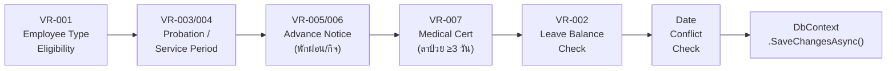
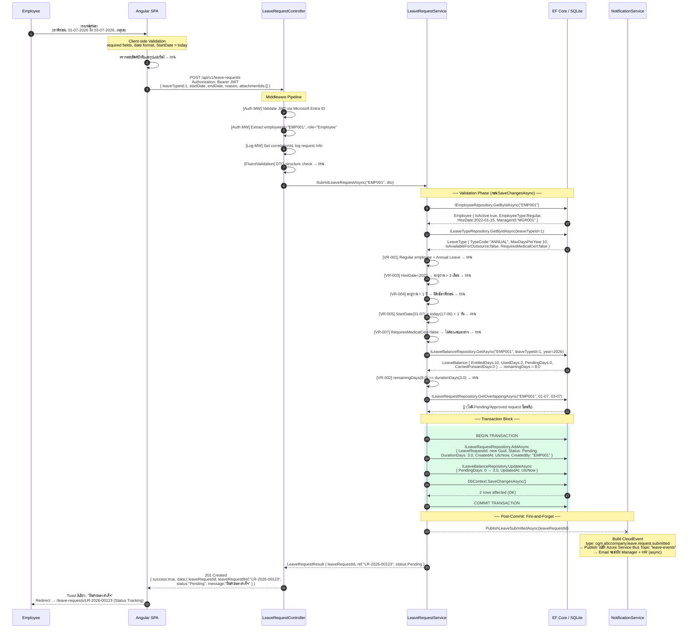
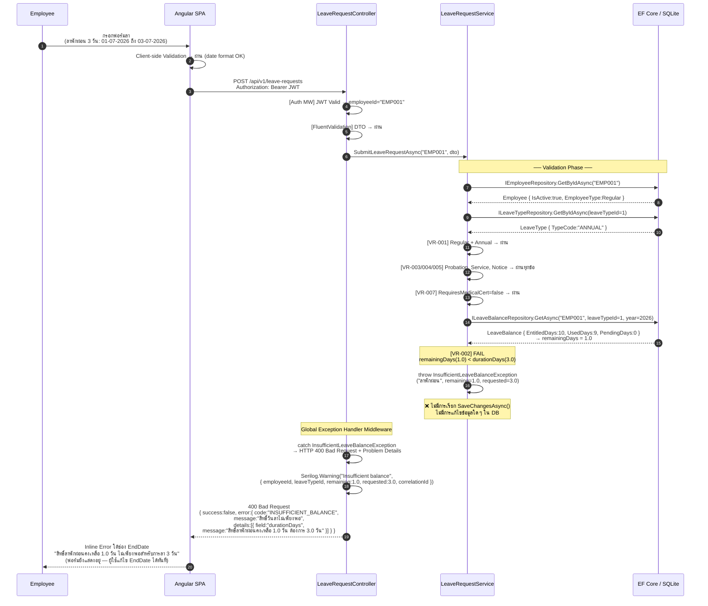
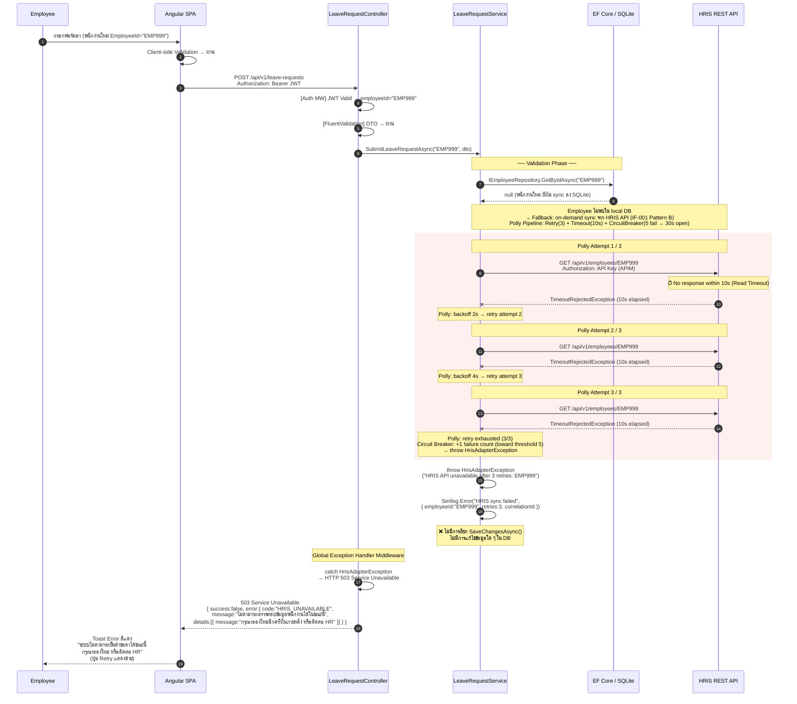
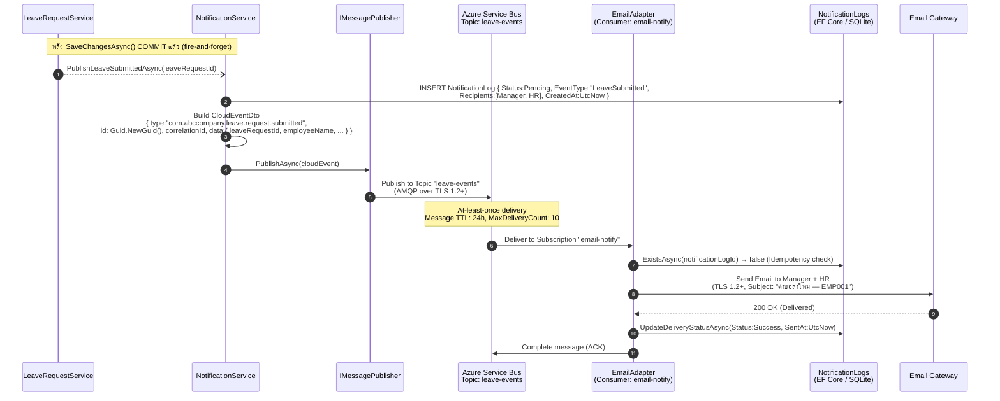

# Sequence Diagram: ยื่นคำร้องขอลา (Submit Leave Request)

## Change Log

| Version | Date | Section | Change Type | Description | Source |
|---------|------|---------|-------------|-------------|--------|
| 1.0 | 2026-06-17 | All | Created | สร้าง Sequence Diagram ครั้งแรก — 3 Scenarios: Happy Path, Balance Insufficient, HRIS API Timeout | Application Architecture v1.0, Method Signature v1.0, SRS Summary v1.0 |

---

## 1. Overview

| รายการ | รายละเอียด |
|--------|-----------|
| **Use Case** | SFR-003: ยื่นคำร้องขอลา (Submit Leave Request) |
| **Actor** | Employee (ประจำ หรือ Outsource) |
| **SRS Trace** | SFR-003, VR-001–007, VR-011, NFR-010, BR-003–007, BR-011 |
| **Scenarios** | Happy Path, Error: วันลาไม่พอ, Error: HRIS API Timeout |
| **Architecture Layer** | Angular SPA → ASP.NET Core API → EF Core (SQLite) → HRIS API (IF-001) |

### Component Legend

| Participant | ชื่อในไดอะแกรม | ชั้น | บทบาท |
|------------|--------------|-----|------|
| `EMP` | Employee | Actor | ผู้ใช้งานระบบ |
| `SPA` | Angular SPA | Frontend | UI, Form validation (client-side), Bearer Token |
| `CTRL` | LeaveRequestController | .NET API — Controller Layer | HTTP Request/Response, JWT check (via Middleware), FluentValidation |
| `SVC` | LeaveRequestService | .NET API — Application Layer | Business Logic, Transaction coordination, Validation orchestration |
| `DB` | EF Core / SQLite | Data Layer | Repository queries, DbContext.SaveChangesAsync() |
| `HRIS` | HRIS REST API | External (IF-001) | Employee Master Data — Pattern B (on-demand) + Polly resilience |
| `MQ` | NotificationService | .NET API / Azure Service Bus | Publish CloudEvent หลัง commit |

### Validation Sequence ก่อน SaveChangesAsync()



> **กฎสำคัญ:** `SaveChangesAsync()` เรียกได้ก็ต่อเมื่อผ่าน validation ทั้งหมดแล้วเท่านั้น — ห้าม commit ก่อน validate

---

## 2. Scenario 1: Happy Path — ยื่นลาสำเร็จ

**เงื่อนไข:** พนักงานประจำ (EmployeeType=Regular) ยื่นลาพักผ่อน 3 วัน, สิทธิ์คงเหลือ 8 วัน, ไม่มี date conflict



---

## 3. Scenario 2: Error — วันลาไม่พอ (InsufficientLeaveBalanceException)

**เงื่อนไข:** พนักงานขอลาพักผ่อน 3 วัน แต่สิทธิ์คงเหลือเพียง 1 วัน — VR-002 fail



---

## 4. Scenario 3: Error — HRIS API Timeout (HrisAdapterException)

**เงื่อนไข:** พนักงานใหม่ที่ยังไม่ได้ sync ข้อมูลเข้า SQLite → ระบบ fallback ไป HRIS REST API (IF-001 Pattern B) → HRIS API ไม่ตอบสนอง → Polly retry 3 ครั้ง → Circuit Breaker OPEN → 503



---

## 5. Error Handling Summary

| Scenario | Exception | HTTP Status | Error Code | ผลต่อ DB | SRS Trace |
|----------|-----------|------------|-----------|---------|----------|
| Happy Path | — | 201 Created | — | INSERT LeaveRequest + UPDATE LeaveBalance (commit) | SFR-003, NFR-010 |
| DTO validation ไม่ผ่าน | `ValidationException` (FluentValidation) | 400 | `VALIDATION_ERROR` | ไม่มีการเปลี่ยนแปลง | VR-001–013 |
| Employee type ไม่มีสิทธิ์ | `InvalidLeaveTypeForEmployeeException` | 400 | `INVALID_LEAVE_TYPE` | ไม่มีการเปลี่ยนแปลง | VR-001 |
| อยู่ในช่วงทดลองงาน | `ProbationPeriodException` | 400 | `PROBATION_PERIOD` | ไม่มีการเปลี่ยนแปลง | VR-003 |
| วันลาไม่พอ | `InsufficientLeaveBalanceException` | 400 | `INSUFFICIENT_BALANCE` | ไม่มีการเปลี่ยนแปลง | VR-002 |
| วันซ้อนทับ | `DateConflictException` | 400 | `DATE_CONFLICT` | ไม่มีการเปลี่ยนแปลง | SFR-003 |
| ต้องแนบใบรับรองแพทย์ | `MedicalCertificateRequiredException` | 400 | `MEDICAL_CERT_REQUIRED` | ไม่มีการเปลี่ยนแปลง | VR-007 |
| HRIS API Timeout | `HrisAdapterException` | 503 | `HRIS_UNAVAILABLE` | ไม่มีการเปลี่ยนแปลง | IF-001, SIR-001 |
| Database error | `DbUpdateException` | 500 | `INTERNAL_ERROR` | Rollback transaction | NFR-010 |

**กฎสำคัญ: ห้าม SaveChangesAsync() ก่อนผ่าน validation ทุกข้อ**
- ทุก exception ที่เกิดในขั้น validation → ไม่มีข้อมูลใน DB เปลี่ยนแปลง
- Transaction Begin เฉพาะหลังผ่าน validation Phase ทั้งหมดเท่านั้น
- `SaveChangesAsync()` อยู่ใน transaction block — ถ้า fail → Rollback อัตโนมัติ

---

## 6. Polly Resilience Configuration (IF-001)

```csharp
// IHrisAdapter — Polly Pipeline Configuration
services.AddHttpClient<IHrisAdapter, HrisAdapter>()
    .AddResiliencePipeline(options =>
    {
        // Timeout per attempt
        options.AddTimeout(TimeSpan.FromSeconds(10));

        // Retry: 3 attempts, exponential backoff
        options.AddRetry(new RetryStrategyOptions
        {
            MaxRetryAttempts = 3,
            Delay = TimeSpan.FromSeconds(2),
            BackoffType = DelayBackoffType.Exponential,   // 2s → 4s → 8s
            ShouldHandle = new PredicateBuilder()
                .Handle<TimeoutRejectedException>()
                .Handle<HttpRequestException>()
        });

        // Circuit Breaker: open after 5 failures, reset after 30s
        options.AddCircuitBreaker(new CircuitBreakerStrategyOptions
        {
            FailureRatio = 0.5,
            MinimumThroughput = 5,
            BreakDuration = TimeSpan.FromSeconds(30)
        });
    });
// อ้างอิง: Integration Architecture v1.0 §9.1 Resilience Pattern per Interface
```

---

## 7. Notification Flow (Post-Commit — Scenario 1)



---

## 8. Component Responsibility Summary

| Component | Layer | ความรับผิดชอบใน Submit Leave Flow |
|-----------|-------|----------------------------------|
| **Angular SPA** | Frontend | Form rendering, client-side format validation, Bearer Token attach, error display (inline/toast) |
| **Middleware Pipeline** | .NET API | JWT validation, CorrelationId inject, Serilog request logging |
| **FluentValidation** | .NET API | DTO structure validation (required fields, type correctness) ก่อนเข้า Service |
| **LeaveRequestController** | .NET API | HTTP routing, call Service, map Exception → HTTP Status Code |
| **LeaveRequestService** | .NET API — Application | Business validation (VR-001–007, VR-011), Transaction scope, Post-commit notification |
| **LeaveBalanceService** | .NET API — Application | GetRemainingDays calculation (VR-002) |
| **EF Core / SQLite** | Infrastructure | Repository queries, DbContext.SaveChangesAsync(), Transaction BEGIN/COMMIT/ROLLBACK |
| **HRIS API** | External (IF-001) | Employee Master Data source — fallback เมื่อไม่พบใน local DB |
| **IHrisAdapter** | Infrastructure | Wrap HRIS HTTP call ด้วย Polly (Retry 3x + Timeout 10s + CircuitBreaker) |
| **NotificationService** | Application | Build CloudEvent, INSERT NotificationLog, call IMessagePublisher |
| **Azure Service Bus** | External (IF-002) | Async delivery ของ Email Notification Event |

---

## 9. Traceability

| Element ใน Diagram | SRS Requirement | Design Document Reference |
|-------------------|----------------|--------------------------|
| POST /api/v1/leave-requests | SFR-003, SCR-003 | Application Architecture §8.2 |
| JWT Validation (Middleware) | NFR-004, TR-008 | Application Architecture §9.1 |
| FluentValidation DTO | VR-001–013 | Method Signature §4.4, Application Architecture §9.3 |
| VR-001 Employee Type check | VR-001, BR-011 | Method Signature §8 |
| VR-002 Balance check | VR-002, BR-002 | Method Signature §4.3 |
| VR-003/004 Probation/Service | VR-003/004, BR-007/008 | Method Signature §4.4 |
| VR-005/006 Advance Notice | VR-005/006, BR-003/004 | Method Signature §4.4 |
| VR-007 Medical Certificate | VR-007, BR-006 | Method Signature §4.4 |
| GetOverlappingAsync() | SFR-003 (Date conflict) | Method Signature §3.3 |
| BEGIN TRANSACTION | NFR-010, BR-016 | Method Signature §7 |
| SaveChangesAsync() | NFR-010 | Method Signature §7 |
| POST-COMMIT Notification | SFR-013, NFR-007, BR-019 | Integration Architecture §7.2 |
| CloudEvent type: leave.request.submitted | IF-002 §2.2.5 | Integration Architecture §10.1 |
| Polly Retry 3x (2s/4s/8s) | knowledge.md §5.1, TR-002 | Integration Architecture §9.1 |
| Circuit Breaker (5 fail → 30s) | knowledge.md §5.1 | Integration Architecture §9.1 |
| 503 HRIS_UNAVAILABLE | SIR-001 (IF-001 Open Issue A1) | Integration Architecture §14.1 |
| InsufficientLeaveBalanceException → 400 | VR-002 | Method Signature §2.3 |
| Serilog.Warning / Error | ai-std-sdlc.md §6.2 | Application Architecture §9.2 |

---

## 10. Open Issues

| OI ID | ประเด็น | ผลกระทบต่อ Sequence | สิ่งที่ต้องทำ |
|-------|---------|---------------------|------------|
| **OI-001** | **HRIS API Pattern** ยังไม่ยืนยัน (Batch vs REST) — Scenario 3 สมมติว่าใช้ REST (Pattern B) | ถ้าใช้ Batch (Pattern A) → HRIS API ไม่ได้ถูกเรียกระหว่าง Submit Leave — flow จะแตกต่าง | IT + HRIS vendor ยืนยัน IF-001 pattern |
| **OI-002** | **Employee ใหม่ยัง sync ไม่เสร็จ** — ปัจจุบัน Scenario 3 fallback ไป HRIS API แต่อาจออกแบบเป็น "รอ batch sync วันถัดไป" แทน | กำหนด behavior เมื่อพนักงานใหม่ login ก่อน HRIS batch sync | HR + IT ยืนยัน onboarding process |
| **OI-003** | **DurationDays calculation** — วิธีคำนวณ 3 วันทำการ (ไม่รวมวันหยุด?) ยังไม่ระบุ | VR-002 และ VR-007 ใช้ durationDays — ถ้า logic ต่างกัน balance check อาจผิด | HR ยืนยัน working days calculation |
| **OI-004** | **Notification fire-and-forget** — ถ้า `PublishLeaveSubmittedAsync()` fail หลัง commit → Leave Request บันทึกแล้วแต่ Email ไม่ออก | NotificationLog อยู่ใน Status=Pending ตลอดไป — ไม่มี retry mechanism สำหรับ publish phase | พิจารณา Outbox Pattern สำหรับ guaranteed notification delivery |
| **OI-005** | **HalfDay leave duration** — `IsHalfDay=true` คิดเป็น 0.5 วัน แต่ logic คำนวณ DurationDays ยังไม่ระบุในทุก step | กระทบ VR-002 balance check และ LeaveBalance.PendingDays update | Business ยืนยัน half-day calculation |

---

## 11. Source Reference

- `20-system-design/a0-architecture-design/01-application-architecture/leave-request-and-approval-application-architecture-design.md` §7, §9, §11.3
- `20-system-design/b0-functional-design/leave-request-and-approval-method-signature.md` §4.4 (ILeaveRequestService), §5.1 (IHrisAdapter)
- `10-requirement-definition/b0-system-requriement/leave-request-and-approval-system-requirement-specification-summary.md` §4.1 SFR-003, §4.6 VR-001–013
- `20-system-design/a0-architecture-design/03-integration-architecture/leave-request-and-approval-integration-architecture-design.md` §9.1 Polly, §7.2 IF-002
- `80-knowledge-base/SDLC/ai-std-sdlc.md` §3.2 (Resilience), §6.2 (Logging)

---

*Sequence Diagram นี้ครอบคลุม 3 scenarios หลัก — ทุก validation step ระบุ VR reference ชัดเจน, `SaveChangesAsync()` เรียกได้ก็ต่อเมื่อผ่าน validation ทั้งหมดแล้วเท่านั้น, HRIS API timeout ใช้ Polly Retry 3x + CircuitBreaker ตามมาตรฐานองค์กร*
