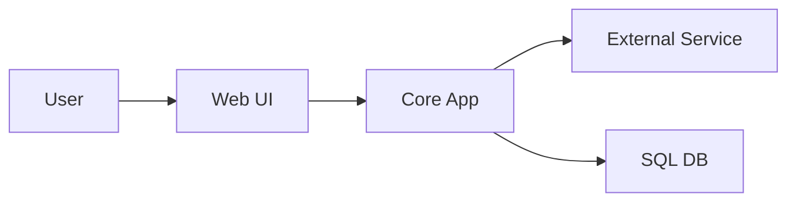
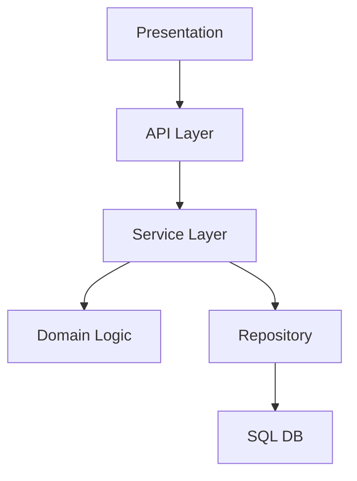
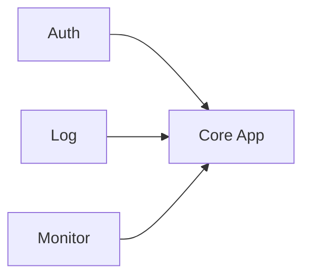

# Sample Output: Application Architecture Design

## 1. วัตถุประสงค์และขอบเขต
เอกสารตัวอย่างนี้แสดงวิธีสรุป Application Architecture ให้ BA/SA ตรวจสอบเชิงภาพได้ง่าย โดยเน้น context, layer, component boundary และ cross-cutting concerns

## 2. Source Reference
- Microsoft Learn: ASP.NET Core Architecture Guidance
- Azure Architecture Center: Application Architecture Patterns
- REST API Best Practice
- OWASP ASVS
- องค์ความรู้มาตรฐานองค์กร

## 3. Architecture Drivers
- รองรับ user หลายบทบาทผ่าน web application
- แยก UI, business logic และ data access ออกจากกัน
- รองรับ integration และ traceability ในอนาคต

## 4. Visual Context

## 5. Selected Application Pattern
เลือก `Layered Architecture` ร่วมกับ `service-oriented backend` เพราะอ่านง่าย แยกความรับผิดชอบชัด และเหมาะกับระบบ workflow ภายในองค์กร

## 6. Application Component View

## 7. Cross-Cutting Concerns
- Authentication ผ่าน enterprise identity provider
- Authorization แบบ RBAC
- Logging, monitoring, error handling ถูกวางเป็น cross-cutting service

## 8. Traceability to SRS
| Design Topic | Related SRS | Source Type | Notes |
|---|---|---|---|
| UI and workflow boundary | SFR-001, SFR-003 | Screen Requirement | user journey |
| Service decomposition | SFR-006, SFR-007 | Functional Requirement | approval flow |
| Auth and access control | TR-006 | Technical Requirement | role-based access |

## 9. Assumptions / Open Issues
- frontend framework ยังเลือกได้ตามมาตรฐานองค์กร
- API versioning strategy ยังต้องยืนยันตอน detailed design
