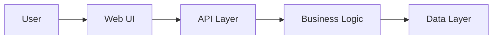
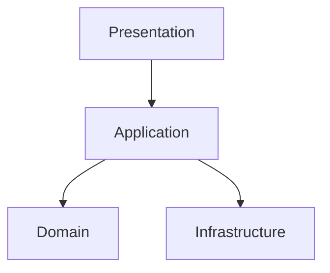

# Application Architecture Design Output Template

## 1. วัตถุประสงค์และขอบเขต
- วัตถุประสงค์ของเอกสาร
- ขอบเขตของระบบ/solution
- in-scope / out-of-scope

## 2. Source Reference
- Microsoft Learn: ASP.NET Core Architecture Guidance
- Azure Architecture Center: Application Architecture Patterns
- REST API Best Practice
- OWASP ASVS / OWASP Top 10
- องค์ความรู้มาตรฐานองค์กรที่เกี่ยวข้อง

## 3. Architecture Drivers
- business drivers
- quality attributes
- technical constraints

## 4. Visual Context

คำอธิบาย:
- อธิบายขอบเขตระบบและ actor หลัก
- อธิบายระบบภายนอกที่มีผลต่อ application architecture

## 5. Selected Application Pattern
- pattern ที่เลือก
- เหตุผลในการเลือก
- ทางเลือกที่ไม่เลือกและเหตุผล

## 6. Frontend Architecture
- presentation structure
- UI framework / design system
- navigation / component strategy

## 7. Backend Architecture
- service/layer structure
- business logic placement
- API style และ boundary

## 8. Cross-Cutting Concerns
- authentication / authorization touchpoints
- logging / monitoring hooks
- error handling strategy
- state management strategy

## 9. Key Diagrams
- Context Diagram
- Application Component Diagram
- API Interaction Diagram

## 10. Traceability to SRS
| Design Topic | Related SRS | Source Type | Notes |
|---|---|---|---|
| {topic} | {id} | {source_type} | {note} |

## 11. Assumptions / Open Issues
- assumptions
- open issues
- next validation items
