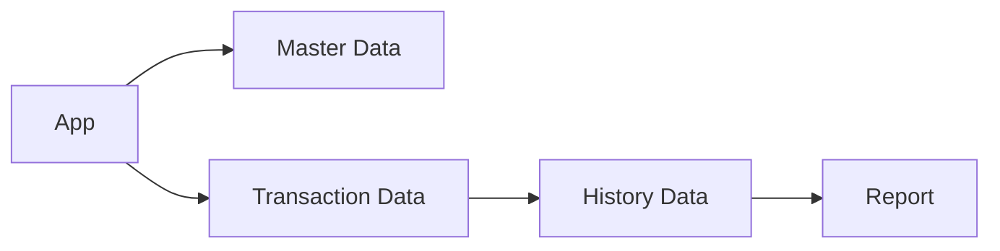
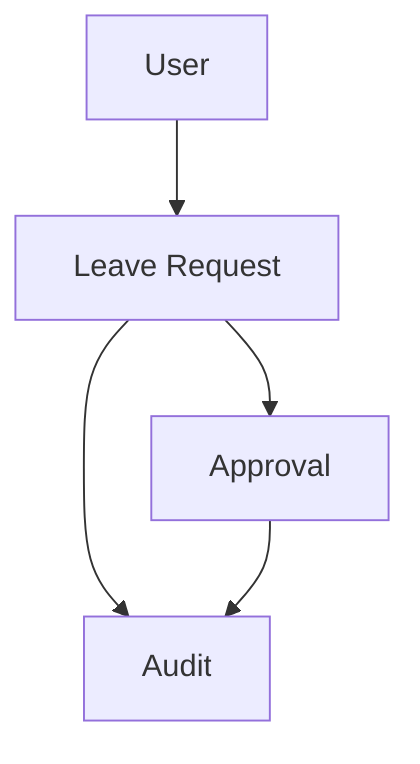

# Sample Output: Data Architecture Design

## 1. วัตถุประสงค์และขอบเขต
เอกสารตัวอย่างนี้แสดงการทำ Data Architecture แบบ visualized เพื่อให้ BA/SA เห็น data grouping, data flow และ retention concept ได้เร็ว

## 2. Source Reference
- Microsoft Learn: SQL Server / Azure SQL Best Practice
- Data Modeling Best Practice
- ISO 27001 Data Classification Guidance
- Backup and Recovery Best Practice
- องค์ความรู้มาตรฐานองค์กร

## 3. Data Architecture Drivers
- ต้องรองรับข้อมูลคำขอลา ข้อมูลอนุมัติ และข้อมูล audit
- ต้องรองรับ reporting โดยไม่กระทบ transaction flow
- ต้องกำหนด retention ตาม policy

## 4. Visual Data Landscape

## 5. Logical Data Grouping
- Master Data: user, role, leave type
- Transaction Data: leave request, leave detail, approval action
- History Data: audit trail, notification log, integration log

## 6. Data Access and Lifecycle
- transactional access ผ่าน ORM
- report access ผ่าน optimized read path
- archive flow แยกจาก operational query

## 7. Retention Concept

## 8. Traceability to SRS
| Design Topic | Related SRS | Source Type | Notes |
|---|---|---|---|
| Transaction entity grouping | SFR-003, SFR-008 | Functional Requirement | leave lifecycle |
| Reporting data set | RFR-001, RFR-002 | Report Requirement | read model |
| Retention and audit | NFR-002, TR-006 | Non-Functional / Technical | governance |

## 9. Assumptions / Open Issues
- physical storage for attachment ต้องยืนยันกับ infrastructure design
- detailed table specification ควรแตกต่อใน detailed data design
