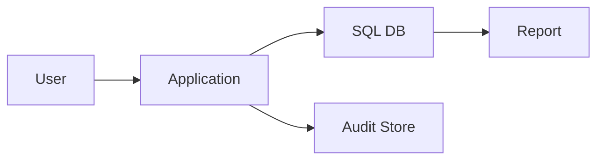
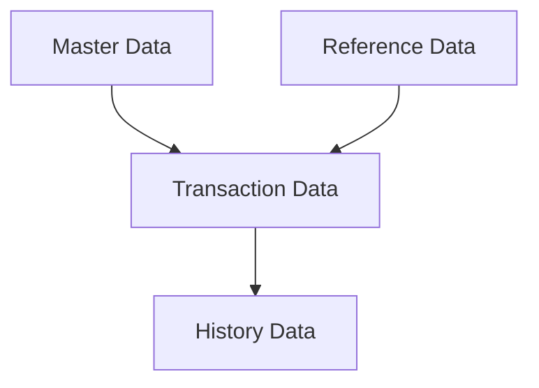

# Data Architecture Design Output Template

## 1. วัตถุประสงค์และขอบเขต
- วัตถุประสงค์ของเอกสาร
- ขอบเขตข้อมูลหลัก
- in-scope / out-of-scope

## 2. Source Reference
- Microsoft Learn: SQL Server / Azure SQL Best Practice
- Data Modeling Best Practice
- ISO 27001 Data Classification Guidance
- Backup and Recovery Best Practice
- องค์ความรู้มาตรฐานองค์กรที่เกี่ยวข้อง

## 3. Data Architecture Drivers
- transaction drivers
- reporting drivers
- governance / retention drivers

## 4. Visual Data Landscape

คำอธิบาย:
- อธิบายภาพรวมของข้อมูลธุรกรรม ข้อมูลรายงาน และข้อมูล audit

## 5. Database Platform & Standards
- database platform
- naming convention
- audit columns / standards

## 6. Logical Data Model / Entity Grouping
- business entities
- schema or domain grouping
- master / transaction / history data

## 7. Data Access Pattern
- ORM / micro ORM strategy
- write/read pattern
- reporting access pattern

## 8. Migration / Versioning Strategy
- schema migration approach
- seed data approach
- release/version control

## 9. Backup / Recovery / Retention
- backup approach
- RPO / RTO
- retention and archival

## 10. Traceability to SRS
| Design Topic | Related SRS | Source Type | Notes |
|---|---|---|---|
| {topic} | {id} | {source_type} | {note} |

## 11. Assumptions / Open Issues
- assumptions
- open issues
- next validation items
