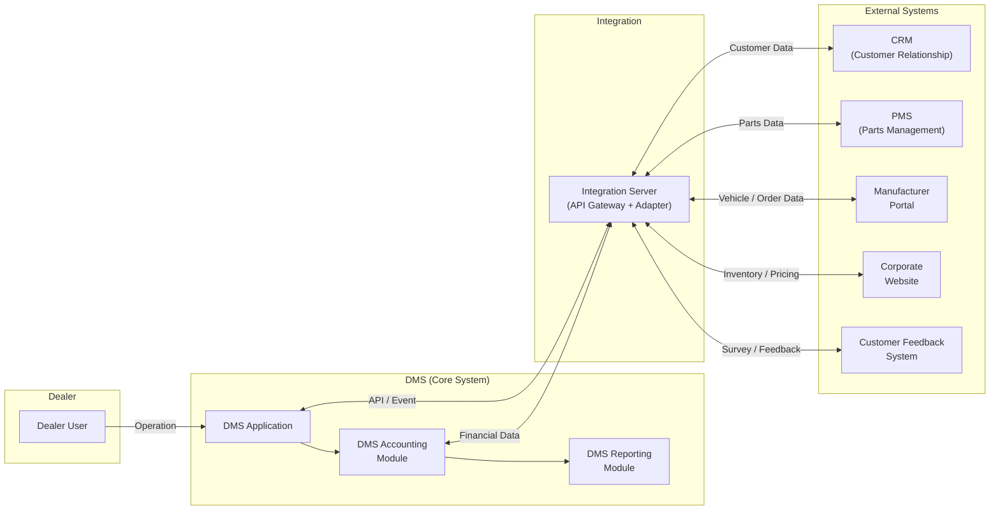
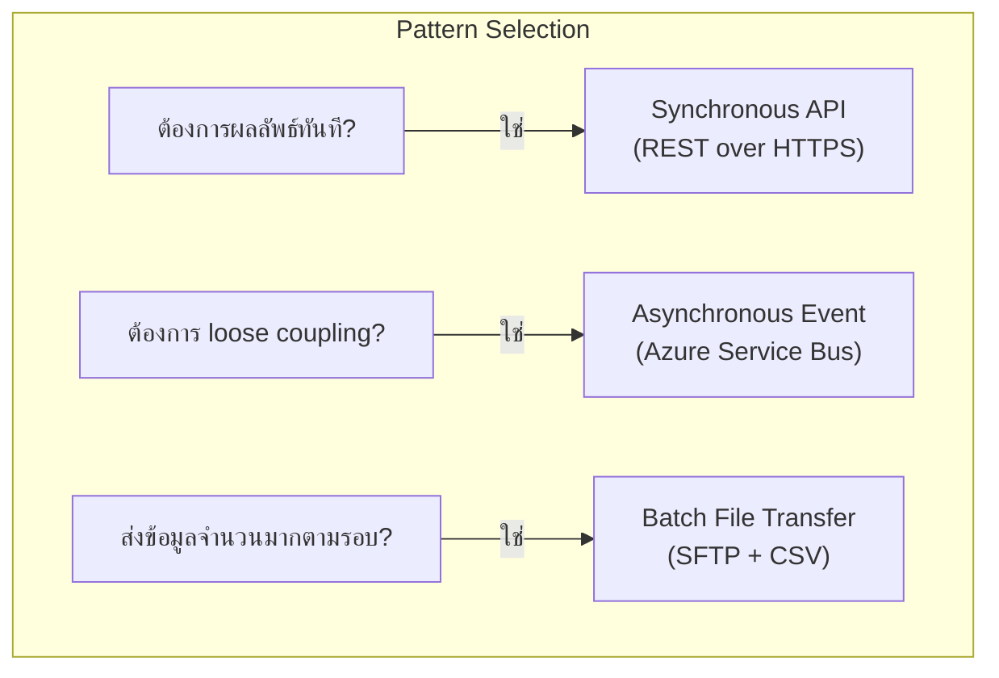
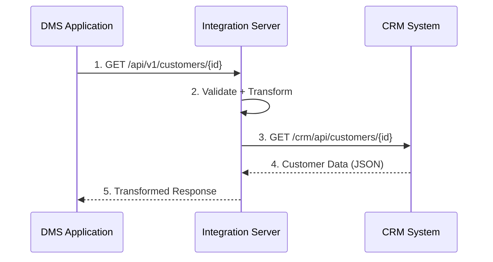
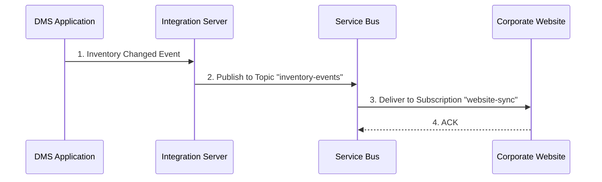
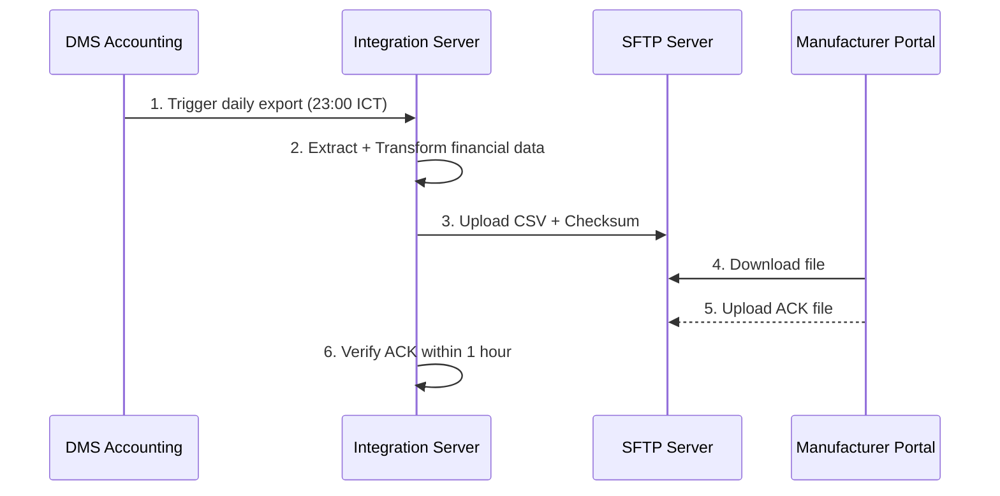
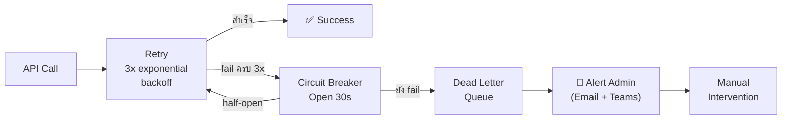

# Sample Output: Integration Architecture Design — HASTH DMS

## 1. วัตถุประสงค์และขอบเขต

| รายการ | รายละเอียด |
| --- | --- |
| วัตถุประสงค์ | ออกแบบ Integration Architecture สำหรับระบบ HASTH DMS (Dealer Management System) ที่เชื่อมต่อกับระบบภายนอกหลายระบบผ่าน Integration Server |
| ขอบเขต In-Scope | DMS Core, DMS Accounting Module, DMS Reporting Module, Integration Server, CRM, Parts Management System (PMS), Manufacturer Portal, Corporate Website, Customer Feedback System |
| ขอบเขต Out-of-Scope | Internal network infrastructure, End-user device management |

## 2. Source Reference

| # | เอกสารอ้างอิง | บทบาท |
|---|-------------|-------|
| 1 | HASTH DMS System Requirement Specification | baseline ของ integration requirement |
| 2 | HASTH DMS Business Requirement Document | ต้นทาง requirement เชิงธุรกิจ |
| 3 | Architecture Design Knowledge Base | มาตรฐานองค์กร (03-integration-architecture/knowledge.md) |

## 3. Integration Drivers

| Driver | คำอธิบาย | ผลต่อการออกแบบ |
|--------|---------|---------------|
| Multi-system landscape | DMS ต้องเชื่อมต่อกับ 5+ ระบบภายนอก | ใช้ Integration Server เป็น hub กลาง ไม่เชื่อมต่อ point-to-point |
| Realtime + Batch mixed | บาง interface ต้อง realtime (CRM lookup) บางอันเป็น batch (Parts sync) | ใช้ทั้ง Sync API และ Batch File Transfer |
| Accounting integration | DMS Accounting Module ต้องส่งข้อมูลทางการเงินไปยังระบบภายนอก | ใช้ Integration Server เป็นตัวกลาง ไม่ให้ Accounting เชื่อมตรง |
| Data consistency | ข้อมูลระหว่างระบบต้องสอดคล้องกัน | ใช้ reconciliation report ตรวจสอบทุกวัน |
| Security | ข้อมูลลูกค้าและข้อมูลทางการเงินต้องเข้ารหัส | TLS 1.2+ ทุก connection, API Key / OAuth authentication |

## 4. System Context Diagram



**คำอธิบาย:**

| Subgroup | คำอธิบาย |
|----------|---------|
| **Dealer** | ผู้ใช้งานฝั่ง Dealer ที่ใช้ DMS ในการทำงานประจำวัน (Sales, Service, Parts, Accounting) |
| **DMS (Core System)** | ระบบหลักประกอบด้วย DMS Application, Accounting Module, และ Reporting Module |
| **Integration Server** | ตัวกลางในการเชื่อมต่อ ทำหน้าที่เป็น API Gateway + Adapter — ทุกการเชื่อมต่อกับระบบภายนอกต้องผ่านที่นี่ |
| **External Systems** | ระบบภายนอก 5 ระบบที่ DMS ต้องแลกเปลี่ยนข้อมูลด้วย |

**กฎสำคัญ:**
- DMS เป็น core system สำหรับ dealer operations — ห้ามฝัง external system logic ใน DMS
- ทุกการเชื่อมต่อกับระบบภายนอกต้องผ่าน Integration Server เท่านั้น (ห้าม point-to-point)
- DMS Accounting Module เชื่อมต่อกับ Integration Server แยกจาก DMS Application เพื่อแยก financial data flow

## 5. Interface Landscape

| Interface ID | Interface Name | Source | Destination | Direction | Pattern | Frequency | Protocol |
|-------------|---------------|--------|-------------|-----------|---------|-----------|----------|
| IF-DMS-001 | Customer Data Sync | CRM | DMS (via IS) | Bidirectional | Sync API | Realtime | REST HTTPS |
| IF-DMS-002 | Parts Catalog Sync | PMS | DMS (via IS) | Bidirectional | Batch + Sync | Daily batch + Realtime lookup | SFTP (batch) + REST (lookup) |
| IF-DMS-003 | Vehicle Order Sync | Manufacturer Portal | DMS (via IS) | Bidirectional | Sync API | Realtime | REST HTTPS |
| IF-DMS-004 | Inventory & Pricing Publish | DMS (via IS) | Corporate Website | Outbound | Async Event | Event-driven | Service Bus |
| IF-DMS-005 | Customer Feedback Inbound | Customer Feedback System | DMS (via IS) | Inbound | Async Event | Event-driven | Service Bus |
| IF-DMS-006 | Financial Posting Export | DMS Accounting (via IS) | Manufacturer Portal | Outbound | Batch | Daily batch | SFTP |
| IF-DMS-007 | Accounting Reconciliation | DMS Accounting (via IS) | PMS | Bidirectional | Batch | Daily batch | SFTP |

## 6. Pattern Selection



| Interface ID | Pattern ที่เลือก | เหตุผล |
|-------------|----------------|--------|
| IF-DMS-001 | Sync API | ต้องการข้อมูลลูกค้า realtime เมื่อ dealer ทำรายการ |
| IF-DMS-002 | Batch + Sync | Catalog sync เป็น batch ทุกคืน, Parts lookup เป็น realtime |
| IF-DMS-003 | Sync API | Vehicle order ต้อง confirm realtime กับ manufacturer |
| IF-DMS-004 | Async Event | Website ไม่ต้องรู้ทันที ส่ง event เมื่อ inventory เปลี่ยน |
| IF-DMS-005 | Async Event | Feedback เข้ามาเป็น event ไม่ต้อง process ทันที |
| IF-DMS-006 | Batch | Financial data ส่งเป็น daily batch ตอนปิดบัญชี |
| IF-DMS-007 | Batch | Reconciliation ทำเป็น daily batch เปรียบเทียบข้อมูล |

## 7. Integration Flow Diagram

### 7.1 Sync API Flow (IF-DMS-001: Customer Data)



### 7.2 Async Event Flow (IF-DMS-004: Inventory Publish)



### 7.3 Batch Flow (IF-DMS-006: Financial Posting)



### 7.4 Overall Data Flow (ASCII)

```text
┌──────────────────────────────────────────────────────────────────────┐
│                    HASTH DMS Integration Landscape                   │
├──────────────────────────────────────────────────────────────────────┤
│                                                                      │
│  ┌──────────┐                                                        │
│  │  Dealer  │──── Operation ────┐                                    │
│  │  User    │                   │                                    │
│  └──────────┘                   ▼                                    │
│                          ┌─────────────┐                             │
│                          │    DMS      │                             │
│                          │  Application│                             │
│                          └──┬──────┬───┘                             │
│                             │      │                                 │
│                    ┌────────▼┐  ┌──▼────────┐                        │
│                    │  DMS    │  │  DMS      │                        │
│                    │Accounting│  │ Reporting │                        │
│                    └────┬────┘  └───────────┘                        │
│                         │                                            │
│         ┌───────────────┴───────────────┐                            │
│         │                               │                            │
│    ┌────▼────┐                    ┌─────▼─────┐                      │
│    │   DMS   │◄── API / Event ──▶│Integration │                      │
│    │   App   │                    │  Server    │                      │
│    └─────────┘                    └─────┬─────┘                      │
│                                         │                            │
│              ┌──────────┬───────────┬───┴────┬──────────┐            │
│              │          │           │        │          │            │
│         ┌────▼───┐ ┌───▼────┐ ┌────▼──┐ ┌──▼─────┐ ┌──▼──────┐    │
│         │  CRM   │ │  PMS   │ │ Mfr   │ │ Corp   │ │Customer │    │
│         │        │ │ (Parts)│ │Portal  │ │Website │ │Feedback │    │
│         └────────┘ └────────┘ └───────┘ └────────┘ └─────────┘    │
│                                                                      │
│  Legend:                                                             │
│  ──▶  Sync API (REST HTTPS)                                        │
│  ◄──▶ Bidirectional                                                 │
│  ···▶ Async Event (Service Bus)                                     │
│  ═══▶ Batch File (SFTP)                                            │
└──────────────────────────────────────────────────────────────────────┘
```

## 8. API / Event / Batch Design Rules

### 8.1 API Design Rules (Sync Interfaces)

| กฎ | รายละเอียด |
|----|-----------|
| Specification | OpenAPI 3.0 (Swagger) |
| Versioning | URL path: `/api/v1/` |
| Authentication | OAuth 2.0 (client credentials) สำหรับ system-to-system |
| Rate Limit | 200 req/min per external system |
| Gateway | Azure API Management — ทุก external API ต้องผ่าน APIM |
| Response Format | JSON (camelCase) พร้อม standard envelope (success, data, error) |

### 8.2 Event Design Rules (Async Interfaces)

| กฎ | รายละเอียด |
|----|-----------|
| Format | CloudEvents 1.0 specification |
| Broker | Azure Service Bus (Topic + Subscription) |
| Delivery | At-least-once — consumer ต้อง idempotent |
| Dead Letter | เปิด DLQ, max delivery 10 ครั้ง |
| Message TTL | 24 ชั่วโมง |
| Correlation | ทุก event ต้องมี `correlationId` สำหรับ tracing |

### 8.3 Batch Design Rules (File Transfer Interfaces)

| กฎ | รายละเอียด |
|----|-----------|
| Protocol | SFTP (SSH File Transfer Protocol) |
| Format | CSV (UTF-8 with BOM), comma-delimited, double-quote enclosed |
| Authentication | SSH Key Pair (RSA 4096-bit) |
| Integrity | SHA-256 checksum file แนบคู่กับ data file |
| Naming | `{SYSTEM}_{ENTITY}_{YYYYMMDD}_{HHMMSS}.csv` |
| Acknowledgment | Receiver สร้าง ACK file ภายใน 1 ชั่วโมง |
| Encryption | PGP encryption สำหรับ financial data |

## 9. Resilience & Error Handling

| Pattern | Configuration | ใช้กับ Interface |
|---------|--------------|-----------------|
| Retry | 3 ครั้ง, exponential backoff (2s/4s/8s) | IF-DMS-001, 002 (lookup), 003 |
| Circuit Breaker | Open หลัง fail 5 ครั้ง, half-open หลัง 30 วินาที | IF-DMS-001, 003 |
| Timeout | Connection 5s, Read 10s | IF-DMS-001, 002 (lookup), 003 |
| Dead Letter Queue | Max 10 delivery attempts | IF-DMS-004, 005 |
| Batch Retry | 3 ครั้ง ห่าง 15 นาที แล้วแจ้ง admin | IF-DMS-002 (batch), 006, 007 |
| Reconciliation | Daily report เปรียบเทียบ record count | IF-DMS-002, 006, 007 |

### Error Handling Flow



## 10. Monitoring & Observability

| Metric | Threshold | Alert Level | เครื่องมือ |
|--------|-----------|-------------|-----------|
| API response time (P95) | > 5 วินาที | Warning | Azure Application Insights |
| API error rate | > 5% | Critical | Azure Monitor Alert |
| Service Bus DLQ count | > 0 | Warning | Azure Service Bus Metrics |
| Service Bus queue depth | > 1,000 | Warning | Azure Service Bus Metrics |
| Batch job failure | > 0 | Critical | Azure Data Factory Monitor |
| Batch duration exceeded | > max duration | Warning | Custom alert |
| Circuit breaker open | > 0 | Critical | Application Insights |
| Reconciliation mismatch | > 0 records | Warning | Custom reconciliation report |

## 11. Traceability to SRS

| Design Topic | Related SRS ID | Source Type | Notes |
|-------------|---------------|-------------|-------|
| Customer data sync | IF-DMS-001 | Interface Requirement | Bidirectional sync กับ CRM |
| Parts catalog sync | IF-DMS-002 | Interface Requirement | Batch + Realtime lookup |
| Vehicle order sync | IF-DMS-003 | Interface Requirement | Realtime กับ Manufacturer Portal |
| Inventory publish | IF-DMS-004 | Interface Requirement | Async event ไปยัง Website |
| Customer feedback | IF-DMS-005 | Interface Requirement | Async event จาก Feedback System |
| Financial posting | IF-DMS-006 | Interface Requirement | Daily batch ไปยัง Manufacturer |
| Accounting reconciliation | IF-DMS-007 | Interface Requirement | Daily batch กับ PMS |
| Resilience pattern | NFR-xxx | Non-Functional Requirement | Retry, Circuit Breaker, Timeout |
| Security (TLS, OAuth) | TR-xxx | Technical Requirement | Encryption, Authentication |

## 12. Assumptions / Open Issues

| ประเภท | รายละเอียด | ผลกระทบ | สถานะ |
|--------|-----------|---------|-------|
| Assumption | Integration Server เป็น hub กลาง ทุก external connection ต้องผ่าน IS | ห้าม point-to-point ระหว่าง DMS กับ external system | Confirmed |
| Assumption | DMS Accounting Module มี integration path แยกจาก DMS Application | Financial data flow แยกจาก operational data flow | Confirmed |
| Open Issue | API contract ของ CRM ยังต้องยืนยัน field mapping | กระทบ IF-DMS-001 | Pending |
| Open Issue | PGP key exchange กับ Manufacturer Portal ยังไม่เสร็จ | กระทบ IF-DMS-006 | Pending |
| Open Issue | Customer Feedback System event schema ยังไม่ finalize | กระทบ IF-DMS-005 | Pending |
