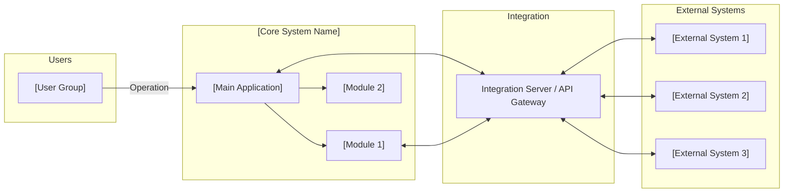
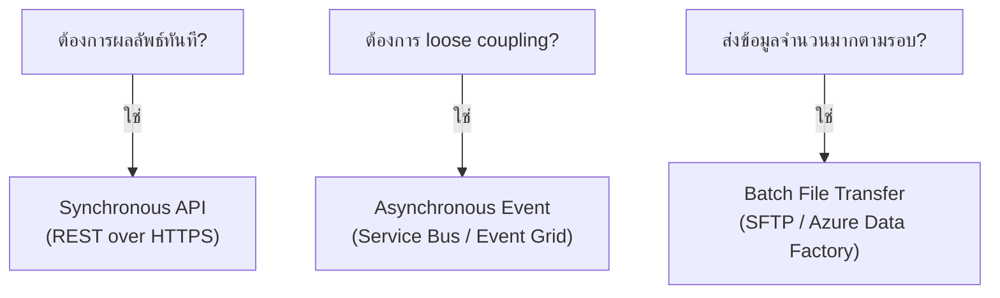
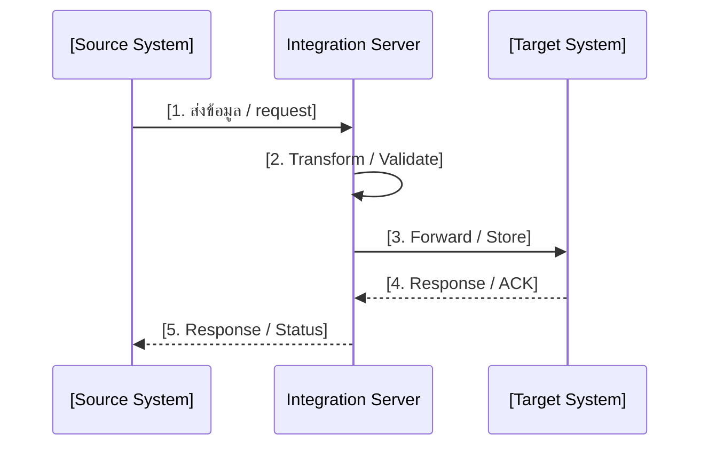
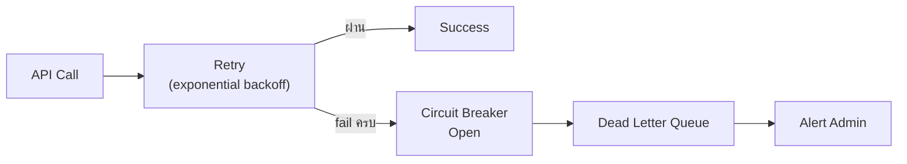

# Integration Architecture Design — Output Template

> ใช้ template นี้สำหรับสร้างเอกสาร Integration Architecture Design ของแต่ละโปรเจค
> Copy ทั้งหมดไปสร้างไฟล์ใหม่ แล้วกรอกข้อมูลตาม section

---

## 1. วัตถุประสงค์และขอบเขต

| รายการ | รายละเอียด |
| --- | --- |
| วัตถุประสงค์ | [อธิบายว่าเอกสารนี้ออกแบบ integration ของระบบอะไร] |
| ขอบเขต In-Scope | [ระบบที่อยู่ในขอบเขตการเชื่อมต่อ] |
| ขอบเขต Out-of-Scope | [ระบบที่ไม่อยู่ในขอบเขต] |

## 2. Source Reference

| # | เอกสารอ้างอิง | บทบาท |
|---|-------------|-------|
| 1 | [SRS Summary / Interface SRS] | baseline ของ integration requirement |
| 2 | [BRD] | ต้นทาง requirement เชิงธุรกิจ |
| 3 | [Architecture Knowledge Base] | มาตรฐานองค์กร |

## 3. Integration Drivers

| Driver | คำอธิบาย | ผลต่อการออกแบบ |
|--------|---------|---------------|
| [Business Driver] | [ทำไมต้องเชื่อมต่อ] | [เลือก pattern อะไร] |
| [Timing / Latency] | [ต้องการ realtime หรือ batch] | [sync vs async vs batch] |
| [Reliability] | [ต้องการ guaranteed delivery หรือไม่] | [retry, DLQ, reconciliation] |
| [Security] | [ข้อจำกัดด้าน security] | [authentication, encryption, zoning] |

## 4. System Context Diagram

> แสดงภาพรวมระบบทั้งหมดที่เชื่อมต่อกัน

**คำอธิบาย:**
- [อธิบายแต่ละ subgroup และทิศทางการเชื่อมต่อ]

## 5. Interface Landscape

| Interface ID | Interface Name | Source | Destination | Direction | Pattern | Frequency | Protocol |
|-------------|---------------|--------|-------------|-----------|---------|-----------|----------|
| IF-001 | [ชื่อ] | [ระบบต้นทาง] | [ระบบปลายทาง] | [In/Out/Bi] | [Sync/Async/Batch] | [Realtime/Daily/Event] | [REST/SFTP/ServiceBus] |

## 6. Pattern Selection

| Interface ID | Pattern ที่เลือก | เหตุผล |
|-------------|----------------|--------|
| IF-001 | [Sync/Async/Batch] | [ทำไมเลือก pattern นี้] |

## 7. Integration Flow Diagram (per interface)

> วาด flow diagram สำหรับแต่ละ interface ที่สำคัญ

## 8. API / Event / Batch Design Rules

### 8.1 API Design Rules

| กฎ | รายละเอียด |
|----|-----------|
| Specification | [OpenAPI 3.0] |
| Versioning | [URL path: /api/v1/] |
| Authentication | [API Key / OAuth / Certificate] |
| Rate Limit | [xxx req/min] |
| Gateway | [Azure API Management] |

### 8.2 Event Design Rules

| กฎ | รายละเอียด |
|----|-----------|
| Format | [CloudEvents 1.0] |
| Broker | [Azure Service Bus] |
| Delivery | [At-least-once] |
| Dead Letter | [เปิด DLQ] |
| Idempotency | [Consumer ต้อง idempotent] |

### 8.3 Batch Design Rules

| กฎ | รายละเอียด |
|----|-----------|
| Protocol | [SFTP] |
| Format | [CSV UTF-8 / JSON Lines] |
| Authentication | [SSH Key RSA 4096-bit] |
| Integrity | [SHA-256 checksum] |
| Acknowledgment | [ACK file ภายใน x ชั่วโมง] |

## 9. Resilience & Error Handling

| Pattern | Configuration | ใช้กับ Interface |
|---------|--------------|-----------------|
| Retry | [จำนวนครั้ง, backoff strategy] | [IF-xxx] |
| Circuit Breaker | [threshold, recovery time] | [IF-xxx] |
| Timeout | [connection timeout, read timeout] | [IF-xxx] |
| Dead Letter Queue | [max retry before DLQ] | [IF-xxx] |
| Fallback | [behavior เมื่อ fail ทั้งหมด] | [IF-xxx] |

### Error Handling Flow

## 10. Monitoring & Observability

| Metric | Threshold | Alert Level |
|--------|-----------|-------------|
| API response time (P95) | > [x] วินาที | Warning |
| API error rate | > [x]% | Critical |
| Service Bus DLQ count | > 0 | Warning |
| Batch job failure | > 0 | Critical |

## 11. Traceability to SRS

| Design Topic | Related SRS ID | Source Type | Notes |
|-------------|---------------|-------------|-------|
| [หัวข้อ] | [IF-xxx, SIR-xxx] | [Interface / Technical Requirement] | [หมายเหตุ] |

## 12. Assumptions / Open Issues

| ประเภท | รายละเอียด | ผลกระทบ | สถานะ |
|--------|-----------|---------|-------|
| Assumption | [ข้อสมมติ] | [ผลกระทบ] | — |
| Open Issue | [ประเด็นที่ต้องยืนยัน] | [ผลกระทบ] | Pending |
