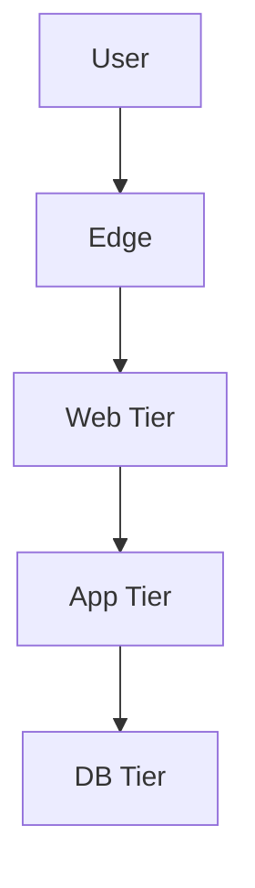
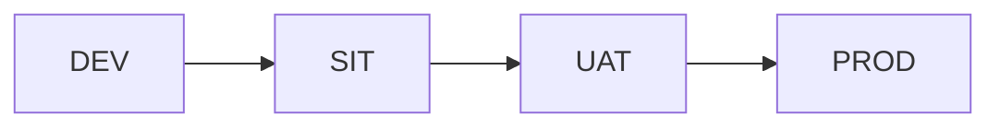
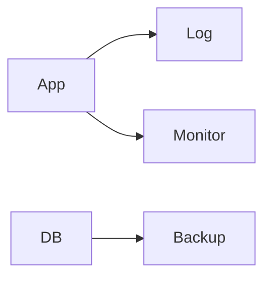

# Sample Output: Infrastructure Architecture Design

## 1. วัตถุประสงค์และขอบเขต
เอกสารตัวอย่างนี้แสดง Infrastructure Architecture แบบ visualized เพื่อให้ BA/SA เข้าใจ deployment model, environment flow และ operational baseline ได้ง่าย

## 2. Source Reference
- Azure Architecture Center: Infrastructure Best Practice
- Windows Server / Network Segmentation Best Practice
- CI/CD Pipeline Best Practice
- Monitoring and Backup Best Practice
- องค์ความรู้มาตรฐานองค์กร

## 3. Infrastructure Drivers
- ต้องมี environment แยกชัด
- ต้องมี monitoring และ backup ที่เป็นมาตรฐาน
- topology ต้องอ่านง่ายและตรวจสอบได้

## 4. Deployment Topology

## 5. Environment Flow

## 6. Operations Baseline
- deploy ผ่าน pipeline มาตรฐาน
- log และ monitor แยกจาก application runtime
- backup และ restore test ตามรอบที่กำหนด

## 7. Traceability to SRS
| Design Topic | Related SRS | Source Type | Notes |
|---|---|---|---|
| Availability baseline | NFR-001 | Non-Functional Requirement | uptime concept |
| Backup baseline | NFR-002 | Non-Functional Requirement | recovery concept |
| Environment separation | TR-001, TR-002 | Technical Requirement | deployment constraint |

## 8. Assumptions / Open Issues
- final sizing ต้องอ้าง workload estimation
- DR scope ต้องยืนยันกับ infra owner
