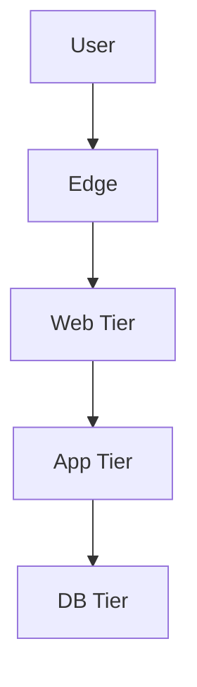
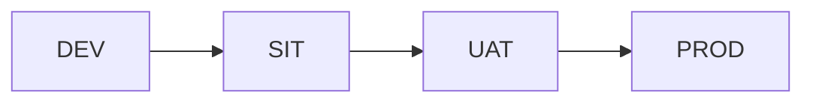

# Infrastructure Architecture Design Output Template

## 1. วัตถุประสงค์และขอบเขต
- วัตถุประสงค์ของเอกสาร
- deployment scope
- in-scope / out-of-scope

## 2. Source Reference
- Azure Architecture Center: Infrastructure Best Practice
- Windows Server / Network Segmentation Best Practice
- CI/CD Pipeline Best Practice
- Monitoring and Backup Best Practice
- องค์ความรู้มาตรฐานองค์กรที่เกี่ยวข้อง

## 3. Infrastructure Drivers
- availability / performance drivers
- deployment constraints
- operational constraints

## 4. Deployment Model Decision
- on-premise / cloud / hybrid
- เหตุผลในการเลือก
- key constraints

## 5. Environment / Network / Topology
- environment landscape
- network zones
- runtime topology

## 6. Compute / Server Design
- server or compute roles
- sizing guideline
- storage and backup touchpoints

## 7. CI/CD / Monitoring / Backup
- pipeline approach
- monitoring stack
- backup and recovery baseline

## 8. Key Diagrams
- Deployment Topology Diagram
- Environment Flow Diagram
- Monitoring / Backup Flow Diagram

## 9. Traceability to SRS
| Design Topic | Related SRS | Source Type | Notes |
|---|---|---|---|
| {topic} | {id} | {source_type} | {note} |

## 10. Assumptions / Open Issues
- assumptions
- open issues
- next validation items
