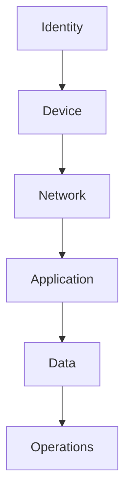
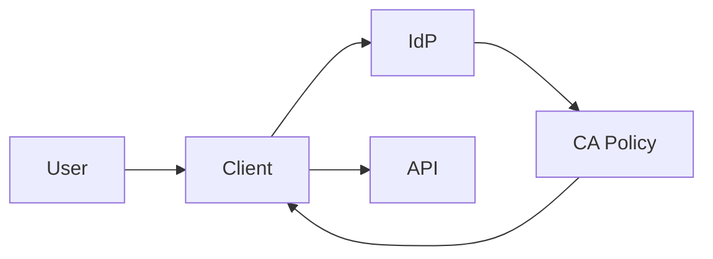
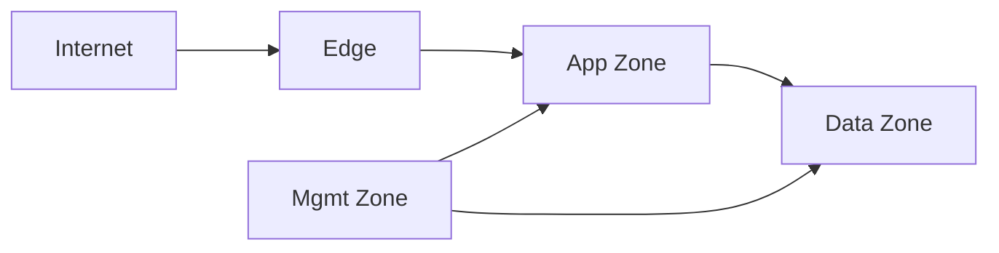

# Security Architecture Knowledge Base

## 1. Overview

Security Architecture คือแนวทางการออกแบบระบบให้มีการควบคุมความปลอดภัยครอบคลุมทุกชั้น ตั้งแต่ identity, access, network, application, data, logging ไปจนถึง operations

เอกสารนี้ใช้เป็น knowledge base กลางสำหรับ:
- วิเคราะห์ control ที่ควรมีในระบบ business application
- แปลง requirement เชิง security ให้เป็น architecture decision
- ใช้เป็น baseline สำหรับเอกสาร Security Architecture Design

แนวทางนี้ยึดหลัก:
- `Defense in Depth`
- `Least Privilege`
- `Secure by Default`
- `Deny by Default`
- `Traceability to Requirement and Control Objective`

## 2. Reference Baseline

| Source | Purpose | How to use in architecture |
|---|---|---|
| ISO/IEC 27001:2022 | กรอบ ISMS และ governance | ใช้กำหนด control objective และ compliance baseline |
| ISO/IEC 27002:2022 | แนวทาง control implementation | ใช้เลือกแนวทาง access, logging, cryptography, secure operations |
| Microsoft Entra / Conditional Access guidance | identity and access best practice | ใช้กำหนด auth, MFA, policy, privileged access |
| Microsoft Key Vault / Managed Identity guidance | secret and machine identity best practice | ใช้กำหนด secret management และ workload identity |
| OWASP ASVS | application security verification standard | ใช้กำหนด security verification baseline ของ application |
| OWASP Cheat Sheets / OWASP Top 10 | secure coding and web protection guidance | ใช้กำหนด application controls ระดับ implementation |

## 3. Security Design Principles

### 3.1 Core Principles

- `Least Privilege`: ให้สิทธิ์เฉพาะเท่าที่จำเป็น
- `Separation of Duties`: แยกบทบาทผู้ใช้งาน ผู้ดูแลระบบ และผู้ตรวจสอบ
- `Defense in Depth`: วาง control หลายชั้น ไม่พึ่งกลไกเดียว
- `Secure by Default`: ค่าเริ่มต้นต้องปลอดภัย ไม่เปิดสิทธิ์เกินจำเป็น
- `Assume Breach`: ออกแบบโดยถือว่ามีโอกาสเกิด compromise ได้
- `Traceability`: ทุก control สำคัญควร trace กลับไปยัง requirement หรือ control objective ได้

### 3.2 Recommended Architecture Mindset

- แยก `identity`, `application`, `data`, และ `operations` ออกจากกันอย่างชัดเจน
- ออกแบบให้ `human identity` และ `workload identity` ใช้คนละแนวทางควบคุม
- ใช้ centralized identity และ centralized logging เมื่อเป็นไปได้
- หลีกเลี่ยง hard-coded secret และ local account ที่ควบคุมยาก

## 4. Defense in Depth Model

คำอธิบาย:
- `Identity`: ผู้ใช้ บริการ และสิทธิ์
- `Device`: ความเชื่อถือของอุปกรณ์และ endpoint posture
- `Network`: segmentation, ingress, egress, private path
- `Application`: secure coding, session, API, validation
- `Data`: encryption, masking, retention, audit
- `Operations`: monitoring, alerting, incident response, privileged operations

## 5. Identity and Access Management

### 5.1 Identity Platform Baseline

แนวทาง recommended สำหรับ enterprise application:
- ใช้ centralized identity provider เช่น `Microsoft Entra ID`
- ใช้ `OAuth 2.0` และ `OpenID Connect` สำหรับ web/API based application
- ใช้ `JWT` หรือ token-based access model ที่ตรวจสอบ claims ได้
- ใช้ `SSO` เมื่อสอดคล้องกับบริบทองค์กร

### 5.2 MFA and Conditional Access Baseline

จาก Microsoft guidance:
- ใช้ `Conditional Access` เพื่อ enforce MFA แทน legacy per-user MFA
- ให้ทุก app หรือ all resources มีอย่างน้อยหนึ่ง Conditional Access policy
- ใช้ policy baseline แบบ `All users + All resources + Require MFA` เป็นจุดเริ่มต้น แล้ว rollout แบบ `Report-only` ก่อน
- ยกเว้น `emergency access / break-glass accounts` เพื่อป้องกัน lockout
- ผูก policy กับ `groups` มากกว่ารายบุคคล
- ปิดหรือจำกัด `legacy authentication`
- ใช้ `named locations`, `risk-based access`, และ `device/app conditions` เมื่อเหมาะสม

### 5.3 Authentication Strength Guidance

แนวทางทั่วไป:
- ผู้ใช้ทั่วไป: MFA baseline
- privileged user / admin: phishing-resistant MFA เมื่อ feasible
- service-to-service: ใช้ workload identity หรือ managed identity แทน shared secret

### 5.4 Privileged Access

- ใช้ `PIM / JIT` สำหรับ highly privileged role เมื่อ platform รองรับ
- แยก admin account ออกจาก normal user account
- log privileged action ทุกครั้ง
- review exception และ privileged assignment เป็นประจำ

### 5.5 RBAC Baseline

| Role Type | Typical Scope | Design Guidance |
|---|---|---|
| End User | own data or assigned scope | จำกัดตาม business ownership |
| Approver / Supervisor | subordinate or workflow scope | จำกัดตาม org scope และ approval boundary |
| Business Admin | functional administration | จำกัดตาม module และ audit action |
| System Admin | platform configuration | ควรใช้ privileged workflow |
| Auditor / Compliance | read-only audit scope | ห้ามใช้สิทธิ์ operational write |
| Workload Identity | machine-to-machine access | ใช้ least privilege และ secretless access ถ้าเป็นไปได้ |

### 5.6 Recommended Authentication Flow

## 6. Network Security

### 6.1 Segmentation Baseline

- แยก zone อย่างน้อยเป็น `edge`, `app`, `data`, `management`
- ห้ามให้ data service รับ inbound จาก internet โดยตรง
- จำกัด east-west traffic ให้เท่าที่จำเป็น
- บังคับ ingress ผ่าน controlled entry point เช่น reverse proxy หรือ WAF

### 6.2 Network Protection Guidance

- ใช้ `WAF` สำหรับ public web endpoint
- ใช้ `private endpoint` หรือ private path สำหรับ data service และ secret store
- ควบคุม outbound egress สำหรับ integration ที่สำคัญ
- บันทึกและ monitor security-relevant network event
- แยก management path ออกจาก user traffic path

### 6.3 Example Security Zoning

## 7. Application Security

### 7.1 Verification Baseline

ใช้ `OWASP ASVS` เป็น baseline verification standard

แนวทางแนะนำ:
- `ASVS Level 2` เป็น baseline สำหรับ business application ส่วนใหญ่ โดยเฉพาะระบบที่มีข้อมูลอ่อนไหว
- `ASVS Level 3` สำหรับระบบ critical สูง หรือมีผลกระทบสูงมาก

หมวดสำคัญที่ควร map ใน architecture:
- V1 Architecture / Design / Threat Modeling
- V2 Authentication
- V3 Session Management
- V4 Access Control
- V5 Validation / Sanitization / Encoding
- V6 Stored Cryptography
- V7 Error Handling / Logging
- V8 Data Protection
- V9 Communication
- V13 API / Web Service
- V14 Configuration

### 7.2 Secure Design Practices

- ทำ `threat modeling` กับ flow สำคัญ
- แยก trust boundary ระหว่าง UI, API, integration, admin function
- ใช้ `allowlist validation`
- ทำ authorization check ที่ backend เสมอ
- ไม่เปิดเผย stack trace หรือ internal detail ให้ผู้ใช้
- ใช้ secure session handling และ token lifetime ที่เหมาะสม

### 7.3 API and Web Controls

- ใช้ `HTTPS only`
- ใช้ secure HTTP headers เช่น HSTS, CSP, nosniff, frame protection
- ใช้ request size / upload limit ที่เหมาะสม
- สำหรับ file upload: validate type, extension, size, scan malware
- ใช้ rate limiting / throttling สำหรับ sensitive endpoint เมื่อเหมาะสม

### 7.4 Software Supply Chain and Pipeline

- เปิด dependency scanning / SCA
- ทำ SAST, secret scanning, และ pipeline policy
- จำกัดสิทธิ์ของ pipeline identity
- ปกป้อง artifact integrity และ deployment approval flow

## 8. Data and Secret Security

### 8.1 Data Protection Baseline

- classify data ตาม sensitivity
- เก็บเฉพาะข้อมูลเท่าที่จำเป็น
- เข้ารหัส `in transit` และ `at rest`
- แยก protection สำหรับ PII, attachment, audit log, and credential material

### 8.2 Encryption Guidance

| Data Type | Minimum Guidance |
|---|---|
| Data in transit | TLS 1.2+ |
| Database at rest | platform encryption / TDE / equivalent |
| File or object storage | encryption at rest |
| Sensitive application secret | vault-based secret management |
| Password | strong password hashing, not reversible encryption |

### 8.3 Secret Management

จาก Microsoft guidance:
- ใช้ `Key Vault` หรือ enterprise vault สำหรับ secret, key, certificate
- ใช้ `managed identity` เมื่อ platform รองรับ เพื่อหลีกเลี่ยง hard-coded credential
- ใช้ `RBAC` แทน legacy access model เมื่อ platform guidance แนะนำ
- แยก vault ตาม application / environment / isolation boundary ที่เหมาะสม
- ห้ามใช้ secret store เป็น data store

### 8.4 Logging and Data Exposure

- log เฉพาะข้อมูลที่จำเป็นต่อ security/operations
- หลีกเลี่ยงการ log secret, token เต็ม, password, หรือ sensitive payload โดยตรง
- ใช้ masking / redaction ใน log และ telemetry

## 9. Audit, Monitoring, and Incident Readiness

### 9.1 Audit Logging Baseline

ควรบันทึกอย่างน้อย:
- login success / failure
- privilege change
- access denial
- data create/update/delete สำหรับ sensitive transaction
- configuration change
- integration security event
- key admin action

### 9.2 Monitoring Baseline

- centralized security logging
- correlation ID across request / integration
- alert สำหรับ auth failure spike, admin anomaly, integration failure spike, policy change
- review security dashboard และ exception เป็นประจำ

### 9.3 Incident Readiness

- มี runbook สำหรับ account compromise, secret exposure, suspicious admin action, integration compromise
- แยก incident severity และ escalation path
- ทดสอบ restore / recovery / emergency access เป็นระยะ

## 10. Compliance Mapping Guidance

| Control Theme | Typical Mapping |
|---|---|
| Access control | ISO 27001 / 27002 access management, OWASP ASVS V2-V4 |
| Cryptography | ISO cryptography guidance, OWASP ASVS V6 |
| Logging and monitoring | ISO logging / monitoring guidance, OWASP ASVS V7 |
| Secure development | OWASP ASVS V1, V5, V13, V14 |
| Data protection | ISO data handling guidance, OWASP ASVS V8-V9 |
| Privileged operations | identity governance, JIT / PIM, auditability |

แนวคิดสำคัญ:
- architecture document ไม่จำเป็นต้องใส่ control ระดับ implementation ทุกตัว
- แต่ควรชี้ว่า control objective ใดถูกตอบด้วย architecture decision ใด

## 11. Security Architecture Review Checklist

- [ ] มี defense in depth ครบ identity, network, app, data, operations
- [ ] MFA ใช้ policy-based enforcement ไม่พึ่ง legacy per-user setting
- [ ] มี emergency access strategy เพื่อกัน lockout
- [ ] ใช้ RBAC / least privilege และ privileged access แยกจาก normal access
- [ ] data service และ secret store ไม่เปิด public path โดยไม่จำเป็น
- [ ] มี secure API / web control baseline
- [ ] ใช้ ASVS baseline ที่เหมาะกับ criticality ของระบบ
- [ ] ใช้ secretless or managed identity approach เมื่อ platform รองรับ
- [ ] มี audit / alert / incident readiness ครบสำหรับเหตุการณ์สำคัญ
- [ ] มี traceability จาก security control ไปยัง requirement หรือ compliance objective
