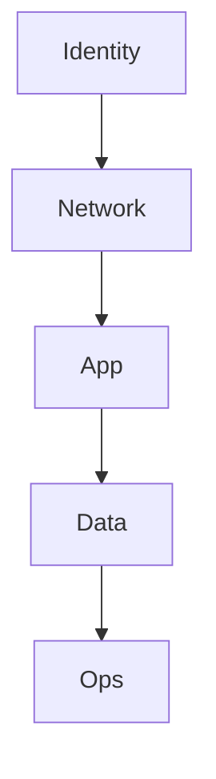
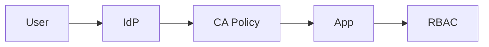
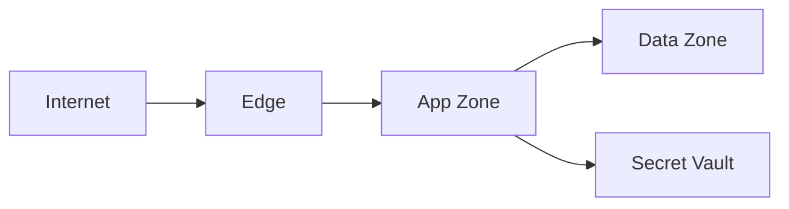
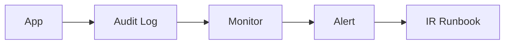

# Sample Output: Security Architecture Design

## 1. วัตถุประสงค์และขอบเขต
เอกสารตัวอย่างนี้แสดงวิธีสรุป Security Architecture สำหรับ business application ที่มีข้อมูลอ่อนไหวระดับองค์กร โดยให้ BA/SA มองเห็น control หลักเป็นภาพรวมก่อนลงลึกใน detailed design

## 2. Source Reference
- ISO/IEC 27001:2022
- ISO/IEC 27002:2022
- OWASP ASVS Level 2
- Microsoft Entra Conditional Access Best Practice
- Microsoft Key Vault / Managed Identity Best Practice
- องค์ความรู้มาตรฐานองค์กร

## 3. Security Drivers
- ปกป้องข้อมูลพนักงานและข้อมูล workflow
- ควบคุมสิทธิ์ตาม role และ scope
- รองรับ audit trail และ compliance review

## 4. Defense in Depth

แนวคิด:
- `Identity`: centralized identity, MFA, privileged access
- `Network`: segmented path, controlled ingress, protected data plane
- `App`: secure coding, session, access control, validation
- `Data`: encryption, retention, masking, secret protection
- `Ops`: logging, alerting, incident response, emergency access

## 5. IAM / Conditional Access / RBAC

- ใช้ centralized identity provider
- enforce MFA ผ่าน Conditional Access
- ใช้ group-based assignment
- มี break-glass accounts สำหรับ emergency
- admin role ใช้ privileged workflow และ review เป็นระยะ

## 6. Network / Application / Data / Secret Security

- ingress ผ่าน controlled edge only
- app tier แยกจาก data tier
- backend enforce authorization และ validate request
- data in transit ใช้ TLS 1.2+
- secrets เก็บใน managed vault และ workload ใช้ managed identity เมื่อรองรับ

## 7. Audit / Monitoring / Incident Readiness

- บันทึก login, deny, privileged change, sensitive transaction, configuration change
- centralize security log และใช้ correlation ID
- ตั้ง alert สำหรับ abnormal sign-in และ privileged action

## 8. Compliance Mapping
| Control Theme | Standard / Baseline | Design Intent |
|---|---|---|
| Access control | ISO / ASVS V2-V4 | least privilege and scope control |
| Cryptography | ISO / ASVS V6 | encrypt data and secrets |
| Logging | ISO / ASVS V7 | auditable security event trail |
| Data protection | ISO / ASVS V8-V9 | protect sensitive business data |

## 9. Traceability to SRS
| Design Topic | Related SRS | Source Type | Notes |
|---|---|---|---|
| Access control model | TR-006 | Technical Requirement | role and scope control |
| Data protection baseline | NFR-002 | Non-Functional Requirement | encryption and handling |
| Secure integration path | IF-001, IF-002 | Interface Requirement | protected system exchange |

## 10. Assumptions / Open Issues
- phishing-resistant MFA อาจใช้เฉพาะ privileged role ก่อนใน phase แรก
- detailed incident runbook และ log retention period ต้องยืนยันกับ security operations owner
