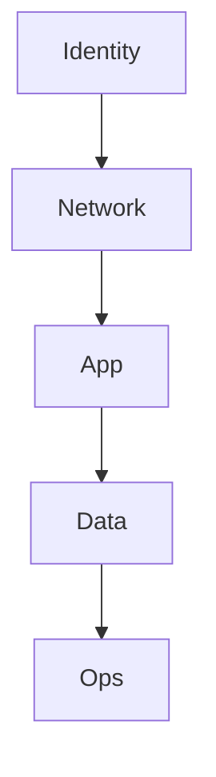
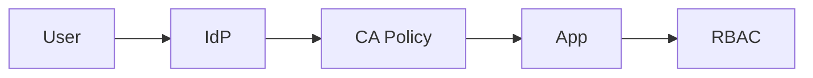

# Security Architecture Design Output Template

## 1. วัตถุประสงค์และขอบเขต
- วัตถุประสงค์ของเอกสาร
- security scope
- in-scope / out-of-scope

## 2. Source Reference
- ISO/IEC 27001:2022
- ISO/IEC 27002:2022
- OWASP ASVS Level 2 or Level 3
- Microsoft Entra Conditional Access Best Practice
- Microsoft Key Vault / Managed Identity Best Practice
- องค์ความรู้มาตรฐานองค์กรที่เกี่ยวข้อง

## 3. Security Drivers
- confidentiality / integrity / availability needs
- compliance needs
- identity / access / audit constraints

## 4. Defense in Depth Model
- security layers
- key controls per layer

## 5. IAM / Conditional Access / RBAC
- identity provider
- MFA / authentication strength baseline
- conditional access policy approach
- emergency access strategy
- authorization / role model

## 6. Network / Application / Data / Secret Security
- network zoning and ingress/egress protection
- application security baseline
- encryption and data protection
- secret and workload identity management

## 7. Audit / Monitoring / Incident Readiness
- audit logging baseline
- security monitoring baseline
- incident readiness / privileged action review

## 8. Compliance Mapping
- ISO 27001 / 27002 mapping
- OWASP ASVS mapping
- organization policy mapping

## 9. Key Diagrams
- Security Zone Diagram
- Authentication / Authorization Flow Diagram
- Security Logging / Monitoring Flow Diagram

## 10. Traceability to SRS
| Design Topic | Related SRS | Source Type | Notes |
|---|---|---|---|
| {topic} | {id} | {source_type} | {note} |

## 11. Assumptions / Open Issues
- assumptions
- open issues
- next validation items
