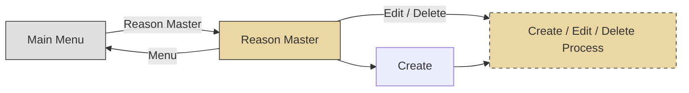

# Functional Specification Document — Sample: Master Data Screen

## Document Information

| Field | Value |
|---|---|
| Doc No | HASTH-PRJ-FNC-001 |
| Project Name | Enterprise Application |
| System Name | Application System |
| Team Name | Development Team |
| Phase | Design |
| Function Name | Reason Master |
| Screen Name | Reason Master |
| Created By | BA Team |
| Created Date | 20-Apr-2026 |
| Updated By | BA Team |
| Updated Date | 21-Apr-2026 |
| Version | 0.5 |

---

## Screen Outline

### Navigation Flow

```text
Main Menu
  ├── [Reason Master] → Search Reason Screen
  │     ├── [Create] → Create New Reason Popup Screen
  │     ├── [Edit]   → Edit Reason Popup Screen
  │     └── [Delete] → Delete Reason Popup Screen
  └── [Menu] → Return to Main Menu
```
Diagram:



### Screen Paths

| Path | Screen Name | Description |
|------|------------|-------------|
| PATH1 | Search Reason Screen | หน้าจอหลักสำหรับค้นหาและแสดงรายการ Reason |
| PATH2 | Create New Reason Popup | Popup สำหรับสร้าง Reason ใหม่ |
| PATH3 | Edit Reason Popup | Popup สำหรับแก้ไข Reason |
| PATH4 | Delete Reason Popup | Popup สำหรับยืนยันการลบ Reason |

### Screen Layour

#### PATH1 - Search Reason Screen

+------------------------------------------------------------------------------------------------------------------------------------------------------+
| [HASTH]  Master Data Management System                                           Dealer Name: SAMPLE DEALER CO.    Branch Name: MAIN BRANCH              |
|                                                                                  User ID : 00001   Name : Sample User                    Logout |
+------------------------------------------------------------------------------------------------------------------------------------------------------+
|  Menu >> Reason Master                                                                                                                               |
+------------------------------------------------------------------------------------------------------------------------------------------------------+

+-----------------------------------------------------------------------------------------------------------------------------------------+   [X]
|  REASON MASTER                                                                                                                          |       
+-----------------------------------------------------------------------------------------------------------------------------------------+
|                                                                                                                                         |
|      Class ID : [ 001: Edit Request for Dealer                                                      v ]                                 |
|                                                                                                                                         |
|      Reason Code : [ 00001                    ]     Reason Description : [ บันทึกข้อมูลผิดพลาด                          ]              |
|                                                                                                                                         |
|                                                    [ Search ]   [ Clear ]                                                               |
|                                                                                                                                         |
+-----------------------------------------------------------------------------------------------------------------------------------------+

[ Create ]


Show [10 v] Records per page


+----+---------------+-------------------------------------------+-------------+----------------------------------+------------------+------------------------+------------------+------------------------+
| No | Action        | Class                                     | Reason Code | Reason Desc                      | Created Date     | Created By             | Updated Date     | Updated By             |
+----+---------------+-------------------------------------------+-------------+----------------------------------+------------------+------------------------+------------------+------------------------+
| 1  | Edit / Delete | 001: Edit Request for Dealer              | 00001       | บันทึกข้อมูลผิดพลาด               | 16/04/2026 10:30 | Sample User            | 16/04/2026 10:30 | Sample User            |
| 2  | Edit / Delete | 001: Edit Request for Dealer              | 00002       | ลูกค้าขอแก้ไข                    | 16/04/2026 10:30 | Sample User            | 16/04/2026 10:30 | Sample User            |
| 3  | Edit / Delete | 001: Edit Request for Dealer              | 00003       | ลูกค้าให้ข้อมูลผิดพลาด            | 16/04/2026 10:30 | Sample User            | 16/04/2026 10:30 | Sample User            |
| 4  | Edit / Delete | 002: Edit Request for Call Center         | 00001       | ลูกค้าขอแก้ไข                    | 16/04/2026 10:30 | Sample User            | 16/04/2026 10:30 | Sample User            |
| 5  | Edit / Delete | 003: Reject Request for Approver          | 00001       | ข้อมูลต้องแก้ไข                  | 16/04/2026 10:30 | Sample User            | 16/04/2026 10:30 | Sample User            |
| 6  | Edit / Delete | 003: Reject Request for Approver          | 00002       | ข้อมูลไม่ถูกต้อง ตรวจสอบใหม่      | 16/04/2026 10:30 | Sample User            | 16/04/2026 10:30 | Sample User            |
+----+---------------+-------------------------------------------+-------------+----------------------------------+------------------+------------------------+------------------+------------------------+

Showing 1 to 6 of 6 entries                                                                                         Previous   [1]   2   3   4   Next


+------------------------------------------------------------------------------------------------------------------------------------------------------+
|  16-Apr-2026  17:14:00                                                                                                                                |
+------------------------------------------------------------------------------------------------------------------------------------------------------+

#### PATH2 - Create New Reason Popup

+------------------------------------------------------------------------------------------------------------------+  [X]
|  Create New Reason                                                                                                |
+------------------------------------------------------------------------------------------------------------------+
|                                                                                                                  |
|      Class ID : [                                   v ]                                                          |
|                                                                                                                  |
|      Reason Description : [                                      ]                                               |
|                                                                                                                  |
|                                 [   Save   ]   [   Clear   ]                                                     |
|                                                                                                                  |
+------------------------------------------------------------------------------------------------------------------+

#### PATH3 - Edit Reason Popup 

+------------------------------------------------------------------------------------------------------------------+  [X]
|  Edit Reason                                                                                                     |
+------------------------------------------------------------------------------------------------------------------+
|                                                                                                                  |
|      Class ID : 001: Edit Request for Dealer                                                             |
|                                                                                                                  |
|      Reason Code : 00001                                                                                         |
|                                                                                                                  |
|      Reason Description : [ บันทึกข้อมูลผิดพลาด                          ]                                     |
|                                                                                                                  |
|                                 [   Save   ]   [   Clear   ]                                                     |
|                                                                                                                  |
+------------------------------------------------------------------------------------------------------------------+

#### PATH3 - Delete Reason Popup

+------------------------------------------------------------------------------------------------------------------+  [X]
|  Confirm Delete                                                                                                  |
+------------------------------------------------------------------------------------------------------------------+
|                                                                                                                  |
|      Class ID : 001: Edit Request for Dealer                                                             |
|                                                                                                                  |
|      Reason Code : 00001                                                                                         |
|                                                                                                                  |
|      Reason Description : บันทึกข้อมูลผิดพลาด                                                                     |
|                                                                                                                  |
|                                 [  Delete  ]   [  Cancel  ]                                                      |
|                                                                                                                  |
+------------------------------------------------------------------------------------------------------------------+

---

## Item Description

### PATH1: Search Reason Screen

| No | Item | Type | Length | Data Source (Table) | Data Source (Field) | Mandatory | Description |
|---|---|---|---|---|---|---|---|
| 1-1 | Dealer Name | Label | - | Session | DealerName | - | Read-only, แสดงชื่อ Dealer จาก session |
| 1-2 | Branch Name | Label | - | Session | BranchName | - | Read-only, แสดงชื่อ Branch จาก session |
| 2-1 | User ID | Label | - | Session | LoginID | - | Read-only, แสดงรหัสผู้ใช้ |
| 2-2 | Name | Label | - | Session | LoginName | - | Read-only, แสดงชื่อผู้ใช้ |
| 3 | Menu Name | Link Label | - | - | - | - | Enable, กลับไปเมนูหลัก |
| 4 | Logout | Link Label | - | - | - | - | Enable, ออกจากระบบ |
| 5 | Reason Master | Label | - | - | - | - | Read-only, ชื่อหน้าจอ |
| 6 | Class ID | Dropdown | - | APP_Reason_MS + APP_Lookup_MS | CLASS_ID + VALUE2 | - | Enable, เลือกประเภท Reason |
| 7 | Reason Code | Textbox | - | - | - | - | Enable, กรอกรหัส Reason |
| 8 | Reason Description | Textbox | - | - | - | - | Enable, กรอกคำอธิบาย Reason |
| 9 | Search | Button | - | - | - | - | Enable, ค้นหาข้อมูล |
| 10 | Clear | Button | - | - | - | - | Enable, ล้างเงื่อนไขค้นหา |
| 11 | Create | Button | - | - | - | - | Enable, เปิด popup สร้างใหม่ |
| 12 | Show records per page | Dropdown | - | - | - | - | Enable, ค่า: 10 (Default), 50, 100, 200 |
| 13 | No. | Label | - | - | - | - | Read-only, running number |
| 14 | Action-Edit | Link Label | - | - | - | - | Enable, เปิด popup แก้ไข |
| 15 | Action-Delete | Link Label | - | - | - | - | Enable, เปิด popup ลบ |
| 16 | Class ID | Label | - | APP_Reason_MS + APP_Lookup_MS | CLASS_ID + VALUE2 | - | Read-only, แสดงในตาราง |
| 17 | Reason Code | Label | - | APP_Reason_MS | REASON_CODE_STRING | - | Read-only, แสดงในตาราง |
| 18 | Reason Desc | Label | - | APP_Reason_MS | REASON_DESC | - | Read-only, แสดงในตาราง |
| 19 | Created Date | Label | - | APP_Reason_MS | CREATED_DATE | - | Read-only |
| 20 | Created By | Label | - | APP_User_MS | FIRST_NAME + LAST_NAME | - | Read-only |
| 21 | Updated Date | Label | - | APP_Reason_MS | LASTUPD_DATE | - | Read-only |
| 22 | Updated By | Label | - | APP_User_MS | FIRST_NAME + LAST_NAME | - | Read-only |
| 23 | Showing entries | Label | - | - | - | - | Read-only, "Showing x to y of z entries" |
| 24 | Page Navigator | Link Label | - | - | - | - | Enable, Previous / Next / Page Number |
| 25 | Footer Datetime | Label | - | - | Current Datetime | - | Read-only, Format "dd-MMM-yyyy HH:MM:SS" |

### PATH2: Create New Reason Popup Screen

| No | Item | Type | Length | Data Source (Table) | Data Source (Field) | Mandatory | Description |
|---|---|---|---|---|---|---|---|
| 26 | Popup Header | Label | - | - | "Create New Reason" | - | Read-only |
| 27 | Close [X] | Button | - | - | - | - | Enable, ปิด popup |
| 28 | Class ID | Dropdown | - | APP_Lookup_MS (KEY='06') | VALUE1 + ":" + VALUE2 | - | Enable, เลือกประเภท |
| 29 | Reason Description | Textbox | 50 | APP_Reason_MS | REASON_DESC | Y | Enable, กรอกคำอธิบาย |
| 30 | Save | Button | - | - | - | - | Enable, บันทึกข้อมูล |
| 31 | Clear | Button | - | - | - | - | Enable, ล้างข้อมูลในฟอร์ม |

### PATH3: Edit Reason Popup Screen

| No | Item | Type | Length | Data Source (Table) | Data Source (Field) | Mandatory | Description |
|---|---|---|---|---|---|---|---|
| 32 | Popup Header | Label | - | - | "Edit Reason" | - | Read-only |
| 33 | Close [X] | Button | - | - | - | - | Enable, ปิด popup |
| 34 | Class ID | Label | - | APP_Reason_MS + APP_Lookup_MS | CLASS_ID + VALUE2 | - | Read-only |
| 35 | Reason Code | Label | - | APP_Reason_MS | REASON_CODE_STRING | - | Read-only |
| 36 | Reason Description | Textbox | 50 | APP_Reason_MS | REASON_DESC | Y | Enable, แก้ไขคำอธิบาย |
| 37 | Save | Button | - | - | - | - | Enable, บันทึกการแก้ไข |
| 38 | Clear | Button | - | - | - | - | Enable, คืนค่าเดิม |

### PATH4: Delete Reason Popup Screen

| No | Item | Type | Length | Data Source (Table) | Data Source (Field) | Mandatory | Description |
|---|---|---|---|---|---|---|---|
| 39 | Popup Header | Label | - | - | "Delete Reason" | - | Read-only |
| 40 | Close [X] | Button | - | - | - | - | Enable, ปิด popup |
| 41 | Class ID | Label | - | APP_Reason_MS + APP_Lookup_MS | CLASS_ID + VALUE2 | - | Read-only |
| 42 | Reason Code | Label | - | APP_Reason_MS | REASON_CODE_STRING | - | Read-only |
| 43 | Reason Description | Label | - | APP_Reason_MS | REASON_DESC | - | Read-only |
| 44 | Confirm Delete | Button | - | - | - | - | Enable, ยืนยันการลบ |
| 45 | Cancel | Button | - | - | - | - | Enable, ยกเลิกและปิด popup |

---

## Process Description

### 1. Initial Screen (onLoad)

1. แสดงหน้าจอพร้อมข้อมูลเริ่มต้น:
   - Search fields ทั้งหมด (Class ID, Reason Code, Reason Description) ว่าง
   - Data grid ว่าง
2. โหลดค่า "Show Records per page" (Item 12) และเลือกค่าเดิมจาก session ก่อนหน้า

### 2. Click "Menu"

- Redirect ไปยัง Main Menu

### 3. Click "Logout"

- ล้าง login session และ redirect ไปยังหน้า Login

### 4. Click "Search"

**Query:**

| Table | APP_Reason_MS JOIN APP_Lookup_MS |
|-------|--------------------------------|
| **Condition** | |
| APP_Lookup_MS.KEY | = '06' |
| APP_Reason_MS.CLASS_ID | = Class ID (Item 6) — ถ้ากรอก |
| APP_Reason_MS.REASON_CODE_STRING | = Reason Code (Item 7) — ถ้ากรอก |
| APP_Reason_MS.REASON_DESC | LIKE '%' + Reason Description (Item 8) + '%' — ถ้ากรอก |
| APP_Reason_MS.DELETE_FLAG | = 0 |
| **Order By** | Reason_Class ASC, Reason_Code ASC |

**กรณีไม่พบข้อมูล:**

1. ดึง error message จากตาราง APP_Lookup_MS:
   - Condition: KEY = '09' AND VALUE2 = 'ERR0021'
   - แสดง VALUE3 เป็นข้อความ error บนหน้าจอ
2. แสดง message: "ไม่พบข้อมูลตามเงื่อนไขที่ระบุ"

**กรณีพบข้อมูล:**

แสดงข้อมูลในตาราง:

| Column | Data Source | Field |
|--------|-----------|-------|
| No. | — | Running number |
| Action | Fix | "Edit / Delete" |
| Class ID | APP_Reason_MS + APP_Lookup_MS | CLASS_ID + VALUE2 |
| Reason Code | APP_Reason_MS | REASON_CODE_STRING |
| Reason Desc | APP_Reason_MS | REASON_DESC |
| Created Date | APP_Reason_MS | CREATED_DATE |
| Created By | APP_User_MS | FIRST_NAME + LAST_NAME |
| Updated Date | APP_Reason_MS | LASTUPD_DATE |
| Updated By | APP_User_MS | FIRST_NAME + LAST_NAME |

พร้อมอัปเดต:
- "Showing entries" (Item 23): `"Showing {first} to {last} of {total} entries"`
- Page Navigator (Item 24): ตาม records per page ที่เลือก

### 5. Click "Clear" (Item 10)

- ล้าง Item 6-8 แล้ว reload ข้อมูลใหม่

### 6. Click "Create" (Item 11)

1. เปิด popup PATH2: Create New Reason
2. onLoad popup แสดงค่า:

| Item | Data Source | Default |
|------|-----------|---------|
| Class ID (Item 28) | APP_Lookup_MS (KEY='06') | ว่าง (ให้เลือก) |
| Reason Description (Item 29) | — | ว่าง |

### 7. Click "Show Records per page" (Item 12)

- Reload หน้าจอแสดงจำนวน record ตามที่เลือก

### 8. Click "Action-Edit" (Item 14)

1. เปิด popup PATH3: Edit Reason
2. onLoad popup แสดงค่าจากแถวที่เลือก:

| Item | Source | Mode |
|------|--------|------|
| Class ID (Item 34) | Item 16 จากแถวที่เลือก | Read-only |
| Reason Code (Item 35) | Item 17 จากแถวที่เลือก | Read-only |
| Reason Description (Item 36) | Item 18 จากแถวที่เลือก | Editable |

### 9. Click "Action-Delete" (Item 15)

1. เปิด popup PATH4: Delete Reason
2. onLoad popup แสดงค่าจากแถวที่เลือก:

| Item | Source | Mode |
|------|--------|------|
| Class ID (Item 41) | Item 16 จากแถวที่เลือก | Read-only |
| Reason Code (Item 42) | Item 17 จากแถวที่เลือก | Read-only |
| Reason Description (Item 43) | Item 18 จากแถวที่เลือก | Read-only |

### 10. Click "Page Navigator" (Item 24)

| Action | Behavior |
|--------|---------|
| Previous | แสดงข้อมูลหน้าก่อนหน้า |
| Next | แสดงข้อมูลหน้าถัดไป |
| Page Number | แสดงข้อมูลของหน้าที่เลือก |

### 11. Click Close [X] (Item 27/33/40)

- ปิด popup และกลับไปหน้าจอหลัก

### 12. Click "Save" (Item 30) — Create New Reason

#### 12.1 Validation

**กรณี Reason Description ว่าง:**
- ดึง error message จาก APP_Lookup_MS (KEY='09', VALUE2='ERR0037')
- แสดง confirmation dialog: **"กรุณากรอกข้อมูลที่จำเป็น"**
- กดปุ่ม OK เพื่อกลับไปแก้ไข

**กรณีผ่าน validation:**
- ดำเนินการ Insert (ขั้นตอน 12.2)

#### 12.2 Insert ข้อมูลลงตาราง APP_Reason_MS

| Field | Value | หมายเหตุ |
|-------|-------|---------|
| CLASS_ID | Class ID (Item 28) | จาก dropdown |
| REASON_CODE_STRING | CLASS_ID + Max sequence 5 หลัก + 1 | เช่น 00100001 |
| REASON_DESC | Reason Description (Item 29) | จาก textbox |
| DELETE_FLAG | 0 | ค่าเริ่มต้น |
| CREATED_DATE | Current Datetime | ระบบสร้างอัตโนมัติ |
| CREATED_BY | Session Login User ID | ระบบสร้างอัตโนมัติ |
| LASTUPD_DATE | Current Datetime | ระบบสร้างอัตโนมัติ |
| LASTUPD_BY | Session Login User ID | ระบบสร้างอัตโนมัติ |

หลัง insert สำเร็จ: ปิด popup, refresh ตารางหน้าจอหลัก

### 13. Click "Clear" (Item 31) — Create Popup

- ล้าง Item 28-29 กลับเป็นค่าเริ่มต้น

### 14. Click "Save" (Item 37) — Edit Reason

#### 14.1 Validation

- เหมือนขั้นตอน 12.1 (ตรวจสอบ Reason Description ว่างหรือไม่)

#### 14.2 Update ข้อมูลในตาราง APP_Reason_MS

**Condition:**

| Field | Value |
|-------|-------|
| CLASS_ID | = Class ID (Item 34) |
| REASON_CODE_STRING | = Reason Code (Item 35) |

**Update Fields:**

| Field | Value | หมายเหตุ |
|-------|-------|---------|
| REASON_DESC | Reason Description (Item 36) | จาก textbox |
| LASTUPD_DATE | Current Datetime | ระบบอัปเดตอัตโนมัติ |
| LASTUPD_BY | Session Login User ID | ระบบอัปเดตอัตโนมัติ |

หลัง update สำเร็จ: ปิด popup, refresh ตารางหน้าจอหลัก

### 15. Click "Clear" (Item 38) — Edit Popup

- คืนค่า Item 34-36 กลับเป็นค่าเริ่มต้น (ก่อนแก้ไข)

### 16. Click "Confirm Delete" (Item 44) — Delete Reason

**Soft Delete** — อัปเดต DELETE_FLAG ในตาราง APP_Reason_MS:

**Condition:**

| Field | Value |
|-------|-------|
| CLASS_ID | = Class ID (Item 41) |
| REASON_CODE_STRING | = Reason Code (Item 42) |

**Update Fields:**

| Field | Value | หมายเหตุ |
|-------|-------|---------|
| DELETE_FLAG | 1 | Soft delete |
| LASTUPD_DATE | Current Datetime | ระบบอัปเดตอัตโนมัติ |
| LASTUPD_BY | Session Login User ID | ระบบอัปเดตอัตโนมัติ |

หลัง delete สำเร็จ: ปิด popup, refresh ตารางหน้าจอหลัก

### 17. Click "Cancel" (Item 45) — Delete Popup

- ปิด popup และกลับไปหน้าจอหลัก (ไม่ลบข้อมูล)

---

## Revision History

| Version | Date | Author | Description |
|---------|------|--------|-------------|
| 0.1 | 20-Apr-2026 | BA Team | สร้างเอกสารครั้งแรก |
| 0.2 | 21-Apr-2026 | BA Team | เพิ่ม WHERE condition สำหรับ Save (Edit/Delete) |
| 0.3 | 13-Jun-2026 | BA Team | แก้ไข logic การดึง REASON_CODE |
| 0.4 | 15-Jun-2026 | BA Team | เพิ่ม error message logic และ validation (max length, required check) |
| 0.5 | 15-Jun-2026 | BA Team | เปลี่ยน field REASON_CODE เป็น REASON_CODE_STRING ทุกจุดที่ใช้ |

### สรุปการเปลี่ยนแปลงสำคัญ

| Version | การเปลี่ยนแปลง | ผลกระทบ |
|---------|---------------|---------|
| 0.1 → 0.2 | เพิ่ม WHERE condition สำหรับ Edit/Delete Save | ป้องกันการ update/delete ผิด record |
| 0.2 → 0.3 | แก้ไข logic ดึง REASON_CODE | เปลี่ยนวิธี generate reason code |
| 0.3 → 0.4 | เพิ่ม validation + error message | เพิ่ม required check ก่อน insert/update |
| 0.4 → 0.5 | **Breaking change** — เปลี่ยน REASON_CODE เป็น REASON_CODE_STRING | กระทบ: Search condition, Edit/Delete condition, Data grid display, Edit/Delete popup display |
