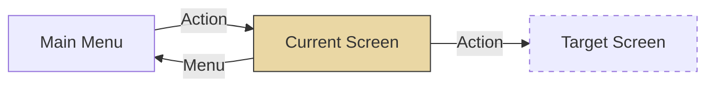

# Screen Functions — Output Template

> Copy template ด้านล่างไปสร้างไฟล์ใหม่ เช่น `scr-001-create-request.md`

---

```markdown
---
function_id: "SCR-[NNN]"
function_name: "[Function Name]"
category: "Screen"
screen_type: "[Create Form / Edit Form / CRUD Master Data / Search & Action Form / Approval Worklist / Search List / Detail View / Dashboard]"
version: "1.0"
status: "Draft"
author: ""
last_updated: ""
---

# SCR-[NNN] — [Function Name]

## 1. Overview

| รายการ | รายละเอียด |
| --- | --- |
| Function ID | SCR-[NNN] |
| Function Name | [ชื่อ function] |
| Category | Screen |
| Screen Type | [Create Form / Edit Form / CRUD Master Data / Search & Action Form / Approval Worklist / Search List / Detail View / Dashboard] |
| Description | [อธิบายสิ่งที่หน้าจอทำ] |
| Actor / User Role | [ผู้ใช้งาน] |
| Related Requirement IDs | [SFR-xxx, VR-xxx, SCR-xxx] |
| Source Reference | [SRS / BRD section] |
| Version | [x.x] |
| Created By | [ผู้สร้าง (วันที่)] |
| Updated By | [ผู้แก้ไข (วันที่)] |

## 2. Business Purpose

[อธิบายว่าทำไมหน้าจอนี้ถึงมีอยู่ — เหตุผลทางธุรกิจ]

## 3. Screen Overview

| รายการ | รายละเอียด |
| --- | --- |
| Screen Name | [ชื่อหน้าจอ] |
| Menu Path | [เมนู > เมนูย่อย > หน้าจอนี้] |
| Navigation Inbound | [เข้ามาจากไหน] |
| Navigation Outbound | [ออกไปไหน] |
| Preconditions | [เงื่อนไขก่อนใช้งาน] |
| Postconditions | [ผลลัพธ์หลังใช้งาน] |

### Related Screens

<!-- ถ้ามีหน้าจอที่เกี่ยวข้อง -->

| Screen ID | Screen Name | Description |
| --- | --- | --- |
| | | |

### Screen Paths

<!-- สำหรับหน้าจอ multi-path เช่น CRUD Master Data -->

| Path | Screen Name | Description |
| --- | --- | --- |
| PATH1 | [หน้าจอหลัก] | [คำอธิบาย] |
| PATH2 | [Popup/Sub-screen] | [คำอธิบาย] |

### Screen Flow

```text
[วาด text-based navigation tree]
Main Menu
  └── [Screen Name]
        ├── [Action 1] → [Target Screen]
        └── [Action 2] → [Target Screen]
```



## 4. Mockup / UI Layout

| รายการ | รายละเอียด |
| --- | --- |
| Mockup Reference | [path ไปยัง mockup file หรือ —] |
| Layout Description | [อธิบาย layout เช่น "4 ส่วน: Header, Search, Actions, Result Table"] |

```text
[วาง ASCII mockup inline]
+----------------------------------------------------------------------+
| [LOGO]  System Name                    Org: [ORG]  Branch: [BRANCH]  |
|                                        User: [ID]  Name: [NAME]     |
+----------------------------------------------------------------------+
| Menu >> [Screen Name]                                                |
+----------------------------------------------------------------------+
| ...                                                                  |
+----------------------------------------------------------------------+
```

## 5. Fields Definition

<!-- แบ่ง sub-section ตาม screen area หรือ path -->

### 5.1 Header Section (Read-only Session Data)

| No | Field Name | Label | Type | Description |
| :---: | --- | --- | --- | --- |
| 1 | org_name | ชื่อองค์กร | Label | Read-only, แสดงชื่อองค์กรจาก session |
| 2 | branch_name | ชื่อสาขา | Label | Read-only, แสดงชื่อสาขาจาก session |
| 3 | navigator | เมนูนำทาง | Link | หน้าจอปัจจุบัน = Unlink, หน้าจออื่น = Link |
| 4 | user_id | รหัสผู้ใช้ | Label | Read-only, แสดงรหัสผู้ใช้จาก session |
| 5 | user_name | ชื่อผู้ใช้ | Label | Read-only, แสดงชื่อผู้ใช้จาก session |
| 6 | logout | ออกจากระบบ | Link | ออกจากระบบ |

### 5.2 Search Criteria / Input Section

| No | Field Name | Label (TH/EN) | Type | Length | Required | Default | Validation | Description |
| :---: | --- | --- | --- | --- | --- | --- | --- | --- |
| | | | | | | | | |

### 5.3 Result Table / Data Grid

| No | Field Name | Label | Type | Data Source | Format / Description |
| :---: | --- | --- | --- | --- | --- |
| | | | | | |

### 5.4 PATH2: [Popup/Sub-screen Name]

<!-- เพิ่ม sub-section สำหรับแต่ละ path/popup -->

| No | Field Name | Label | Type | Length | Data Source | Mandatory | Description |
| :---: | --- | --- | --- | --- | --- | --- | --- |
| | | | | | | | |

## 6. Commands / Actions

| No | Command | Type | Default State | Trigger Condition | System Response |
| :---: | --- | --- | --- | --- | --- |
| | Search | Button | Enable | กดปุ่ม | ค้นหาข้อมูลตามเงื่อนไข |
| | Clear | Button | Enable | กดปุ่ม | ล้างเงื่อนไขค้นหาทั้งหมด |
| | Create | Button | Enable | กดปุ่ม | เปิด popup สร้างใหม่ |
| | Export | Button | **Disable** | พบข้อมูลจากการค้นหา | เปิดใช้งานเมื่อพบข้อมูล |
| | Save | Button | Enable | กดปุ่มใน popup | Validate → Insert/Update |
| | Delete | Button | Enable | กดปุ่มใน popup | Soft delete |
| | Cancel | Button | Enable | กดปุ่มใน popup | ปิด popup ไม่ทำอะไร |

## 7. Screen Behavior

### 7.1 Initial Screen (onLoad)

- แสดงหน้าจอพร้อม Session data
- [ระบุ default state ของแต่ละ component]

### 7.2 Click "Menu"

- Redirect ไปยัง Main Menu

### 7.3 Click "Logout"

- ล้าง login session และ redirect ไปยังหน้า Login

### 7.4 Click "Search"

#### 7.4.1 Validation

<!-- ระบุ validation ทั้งหมดก่อน query -->

- [Validation rule 1]
  - Error source: Lookup Master (KEY='09', VALUE2='ERR_CODE')
- [Validation rule 2]

#### 7.4.2 Query

```text
Table: [Main Table]
  JOIN [Related Table] (Alias) ON [Join Condition]

WHERE [Base Conditions]
```

#### Optional Search Filters

| Item | Field | Operator | Value |
| --- | --- | --- | --- |
| | | | |

#### Sort Order

1. [Field] — **DESC/ASC**

#### 7.4.3 กรณีไม่พบข้อมูล

- แสดง Error: "[error message]"
  - Error source: Lookup Master (KEY='09', VALUE2='ERR_CODE')

#### 7.4.4 กรณีพบข้อมูล

- แสดงข้อมูลในตารางตาม Fields Definition
- [ระบุ component ที่เปลี่ยนสถานะ เช่น Export button: Enable]

### 7.5 Click "Clear"

- ล้างเงื่อนไขค้นหาทั้งหมด แล้ว refresh หน้าจอกลับสู่ Initial state

### 7.6 Click "Create" (เปิด Popup)

- เปิด popup [PATH2]
- onLoad popup: [ระบุค่าเริ่มต้น]

### 7.7 Click "Save" — Create Popup

#### 7.7.1 Validation

- [Required check, format check, etc.]
  - Error source: Lookup Master (KEY='09', VALUE2='ERR_CODE')

#### 7.7.2 Insert

| Field | Value | หมายเหตุ |
| --- | --- | --- |
| [FIELD_NAME] | [Value] | [หมายเหตุ] |
| CREATED_DATE | Current Datetime | ระบบสร้างอัตโนมัติ |
| CREATED_BY | Session Login User ID | ระบบสร้างอัตโนมัติ |
| LASTUPD_DATE | Current Datetime | ระบบสร้างอัตโนมัติ |
| LASTUPD_BY | Session Login User ID | ระบบสร้างอัตโนมัติ |

หลัง insert สำเร็จ: ปิด popup, refresh ตารางหน้าจอหลัก

### 7.8 Click "Edit" (เปิด Popup)

- เปิด popup [PATH3]
- onLoad popup: [ระบุ field ที่ read-only vs editable]

### 7.9 Click "Save" — Edit Popup

#### 7.9.1 Validation

- [เหมือน Create validation]

#### 7.9.2 Update

**Condition:**

| Field | Value |
| --- | --- |
| [PRIMARY_KEY] | = [Selected value] |

**Update Fields:**

| Field | Value | หมายเหตุ |
| --- | --- | --- |
| [FIELD_NAME] | [Value] | [หมายเหตุ] |
| LASTUPD_DATE | Current Datetime | ระบบอัปเดตอัตโนมัติ |
| LASTUPD_BY | Session Login User ID | ระบบอัปเดตอัตโนมัติ |

หลัง update สำเร็จ: ปิด popup, refresh ตารางหน้าจอหลัก

### 7.10 Click "Delete" (เปิด Popup)

- เปิด popup [PATH4]
- onLoad popup: [ทุก field read-only]

### 7.11 Click "Confirm Delete"

**Soft Delete:**

**Condition:**

| Field | Value |
| --- | --- |
| [PRIMARY_KEY] | = [Selected value] |

**Update Fields:**

| Field | Value | หมายเหตุ |
| --- | --- | --- |
| DELETE_FLAG | 1 | Soft delete |
| LASTUPD_DATE | Current Datetime | ระบบอัปเดตอัตโนมัติ |
| LASTUPD_BY | Session Login User ID | ระบบอัปเดตอัตโนมัติ |

หลัง delete สำเร็จ: ปิด popup, refresh ตารางหน้าจอหลัก

### 7.12 Pagination (ถ้ามี)

| Action | Behavior |
| --- | --- |
| Show records per page | Reload หน้าจอแสดงจำนวน record ตามที่เลือก |
| Previous | แสดงข้อมูลหน้าก่อนหน้า |
| Next | แสดงข้อมูลหน้าถัดไป |
| Page Number | แสดงข้อมูลของหน้าที่เลือก |

## 8. Business Rules

<!-- ใช้ตารางสำหรับ rule ที่ตรงไปตรงมา -->

| Rule ID | Business Rule | Impact | Source Reference |
| --- | --- | --- | --- |
| BR-SCR[NNN]-001 | [อธิบาย rule] | [ผลกระทบ] | [VR-xxx, SFR-xxx] |

<!-- ใช้ decision tree สำหรับ logic ที่ซับซ้อน -->

```text
ตรวจสอบเงื่อนไข
│
├── กรณี A
│   └── แสดง "Action A" → Link ไปหน้า X
│
└── กรณี B
    ├── เงื่อนไขย่อย B1
    │   └── แสดง "Action B1" (ข้อความเท่านั้น ไม่มี link)
    └── เงื่อนไขย่อย B2
        └── แสดง "Action B2" → Link ไปหน้า Y
```

## 9. Message List

### Error Messages

| Message ID | Trigger | Message (TH) | Message (EN) |
| --- | --- | --- | --- |
| ERR-SCR[NNN]-001 | [เงื่อนไขที่ trigger] | [ข้อความภาษาไทย] | [English message] |

### Success Messages

| Message ID | Trigger | Message (TH) | Message (EN) |
| --- | --- | --- | --- |
| SUC-SCR[NNN]-001 | [เงื่อนไขที่ trigger] | [ข้อความภาษาไทย] | [English message] |

## 10. Popup / Sub-screen Definition

<!-- เพิ่ม section นี้สำหรับแต่ละ popup ที่มี -->

### 10.1 [Popup Name]

#### Popup Items

| No | Field Name | Label | Data Source | Description |
| :---: | --- | --- | --- | --- |
| | | | | |

#### Popup Query (ถ้ามี)

```text
WHERE [Conditions]
ORDER BY [Sort Fields]
```

## 11. Database Tables Reference

| Table Name | Alias | Description |
| --- | --- | --- |
| [Table Name] | — | [คำอธิบาย] |
| [Table Name] | (A) | [คำอธิบาย + เงื่อนไข alias] |

## 12. Exception Handling

| Error Case | Trigger Condition | System Behavior | User Message | Recovery |
| --- | --- | --- | --- | --- |
| | | | | |

## 13. Notes / Assumptions

| ประเภท | รายละเอียด | ผลกระทบ |
| --- | --- | --- |
| Assumption | [สมมติฐาน] | [ผลกระทบ] |
| Note | [ข้อสังเกต] | [ผลกระทบ] |

## Change Log

| Version | Date | Author | Change Type | Description | Remark |
| --- | --- | --- | --- | --- | --- |
| 0.1 | | | Created | สร้างเอกสารครั้งแรก | — |

### สรุปการเปลี่ยนแปลงสำคัญ

| ช่วง Version | การเปลี่ยนแปลง | ผลกระทบ |
| --- | --- | --- |
| | | |
```
