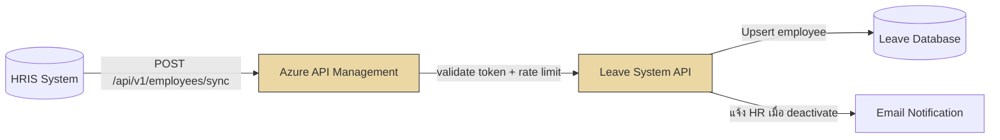

# Interface Functions — Output Sample (API Endpoint)

# INT-001 — HRIS Employee Data Sync (Inbound API)

**Doc No:** LRA-FNC-INT-001

| Project Name | System Name | Team Name | Phase |
|---|---|---|---|
| Leave Request and Approval | Leave Management System | Development Team | Design |

---

## 1. Overview

| รายการ | รายละเอียด |
|--------|-----------|
| Function ID | INT-001 |
| Function Name | HRIS Employee Data Sync |
| Category | Interface |
| Interface Type | Inbound API (REST) |
| Description | รับข้อมูลพนักงานจาก HRIS เพื่ออัปเดต master data ในระบบลา |
| Direction | HRIS → Leave System |
| Trigger | HRIS เรียก API เมื่อข้อมูลพนักงานเปลี่ยนแปลง (Real-time) |
| Related Requirement IDs | SIR-001, IF-001 |
| Source Reference | Interface SRS v1.0 — IF-001 |

---

## 2. Business Purpose

ให้ระบบลามีข้อมูลพนักงานที่ถูกต้องและเป็นปัจจุบันจาก HRIS เสมอ เพื่อใช้ในการ validate สิทธิ์การลาและกำหนด approval flow

---

## 3. Process Flow



---

## 4. API Specification

| รายการ | รายละเอียด |
|--------|-----------|
| Endpoint | `POST /api/v1/employees/sync` |
| Protocol | HTTPS (TLS 1.2+) |
| Authentication | OAuth 2.0 (Microsoft Entra ID) — Client Credentials Flow |
| Content-Type | `application/json; charset=utf-8` |
| Timeout | 10 วินาที |

### Request Body

```json
{
  "employeeId": "EMP001",
  "employeeCode": "ABC-001",
  "fullNameTh": "สมชาย ใจดี",
  "fullNameEn": "Somchai Jaidee",
  "departmentCode": "IT",
  "positionCode": "DEV",
  "managerId": "EMP050",
  "employmentType": "FULLTIME",
  "status": "ACTIVE",
  "startDate": "2024-01-15",
  "email": "somchai.j@company.com"
}
```

### Response

```json
{
  "success": true,
  "data": { "employeeId": "EMP001", "action": "UPDATED" },
  "error": null
}
```

---

## 5. Validation Rules

| Field | กฎ | Error Code |
|-------|----|-----------|
| employeeId | Required, ต้องไม่ว่าง | ERR-001 |
| status | ต้องเป็น ACTIVE / INACTIVE / TERMINATED | ERR-002 |
| managerId | ต้องมีอยู่ในระบบ | ERR-003 |

---

## 6. Error Handling

| Scenario | HTTP Status | Error Code | การจัดการ |
|----------|------------|-----------|---------|
| Token invalid | 401 | AUTH_ERROR | HRIS ต้อง re-authenticate |
| Validation fail | 400 | VALIDATION_ERROR | ส่ง field detail กลับ |
| Employee not found (update) | 404 | NOT_FOUND | สร้างใหม่อัตโนมัติ |
| System error | 500 | SYSTEM_ERROR | HRIS retry ตาม exponential backoff |
