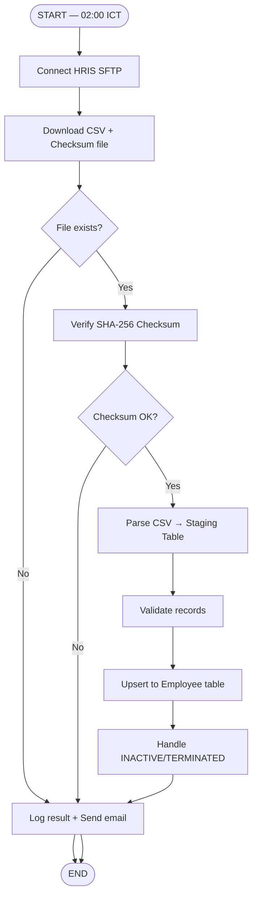

# Interface Functions — Output Sample (File Inbound)

# INT-IB-001 — HRIS Employee Master File Import (Batch)

**Doc No:** LRA-FNC-INT-IB-001

| Project Name | System Name | Team Name | Phase |
|---|---|---|---|
| Leave Request and Approval | Leave Management System | Development Team | Design |

---

## 1. Overview

| รายการ | รายละเอียด |
|--------|-----------|
| Function ID | INT-IB-001 |
| Function Name | HRIS Employee Master File Import |
| Category | Interface |
| Interface Type | File Inbound (SFTP) |
| Description | รับไฟล์ CSV ข้อมูลพนักงานจาก HRIS ผ่าน SFTP เพื่อ sync master data ทุกคืน |
| Direction | HRIS SFTP → Leave System |
| Trigger | Scheduler ทุกวัน 02:00 ICT |
| Related Requirement IDs | SIR-001, IF-001 |
| Source Reference | Interface SRS v1.0 — IF-001 |

---

## 2. Business Purpose

ให้ระบบลามีข้อมูลพนักงานครบถ้วนจาก HRIS ทุกวัน โดยเฉพาะพนักงานใหม่, การโอนย้าย, และการลาออก เพื่อให้ approval flow และสิทธิ์วันลาถูกต้องเสมอ

---

## 3. Process Flow

---

## 4. Input File Specification

| รายการ | รายละเอียด |
|--------|-----------|
| Source | HRIS SFTP Server |
| File Pattern | `HRIS_EMP_MASTER_YYYYMMDD.csv` |
| Encoding | UTF-8 BOM |
| Delimiter | Comma (,) |
| Checksum | `HRIS_EMP_MASTER_YYYYMMDD.sha256` |

### File Layout

| Column | Field Name | Data Type | Required | Description |
|--------|-----------|-----------|----------|-------------|
| 1 | EMPLOYEE_ID | VARCHAR(20) | Y | รหัสพนักงาน |
| 2 | EMPLOYEE_CODE | VARCHAR(20) | Y | รหัสพนักงานภายใน |
| 3 | FULL_NAME_TH | NVARCHAR(200) | Y | ชื่อ-สกุล (ไทย) |
| 4 | FULL_NAME_EN | VARCHAR(200) | N | ชื่อ-สกุล (อังกฤษ) |
| 5 | DEPARTMENT_CODE | VARCHAR(20) | Y | รหัสแผนก |
| 6 | MANAGER_ID | VARCHAR(20) | N | รหัสผู้จัดการ |
| 7 | EMPLOYMENT_TYPE | VARCHAR(20) | Y | FULLTIME / OUTSOURCE |
| 8 | STATUS | VARCHAR(20) | Y | ACTIVE / INACTIVE / TERMINATED |
| 9 | START_DATE | DATE (YYYY-MM-DD) | Y | วันเริ่มงาน |
| 10 | EMAIL | VARCHAR(200) | Y | อีเมลองค์กร |

---

## 5. Error Handling

| Scenario | การจัดการ |
|----------|---------|
| ไม่พบไฟล์ใน SFTP | Log warning แล้วจบ job (ไม่ error) |
| Checksum ไม่ตรง | Reject file ทั้งหมด แจ้ง admin ทาง email |
| Record format ผิด | Skip record นั้น บันทึกใน error log |
| Manager ID ไม่มีในระบบ | บันทึก record โดยไม่ set manager รอ sync รอบถัดไป |
| พนักงาน TERMINATED | Cancel คำขอลาที่ Pending อัตโนมัติ แจ้ง HR |
