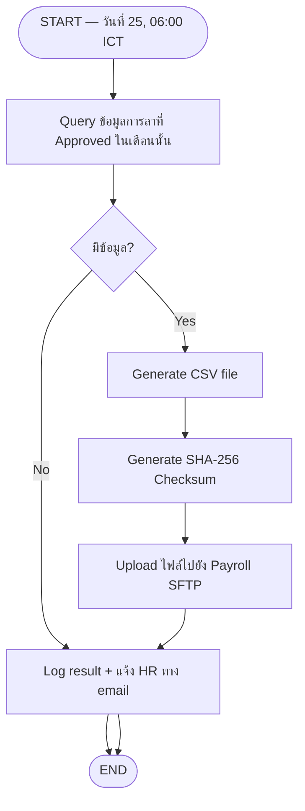

# Interface Functions — Output Sample (File Outbound)

# INT-OB-001 — Leave Data Export to Payroll System (Batch)

**Doc No:** LRA-FNC-INT-OB-001

| Project Name | System Name | Team Name | Phase |
|---|---|---|---|
| Leave Request and Approval | Leave Management System | Development Team | Design |

---

## 1. Overview

| รายการ | รายละเอียด |
|--------|-----------|
| Function ID | INT-OB-001 |
| Function Name | Leave Data Export to Payroll System |
| Category | Interface |
| Interface Type | File Outbound (SFTP) |
| Description | ส่งข้อมูลการลาที่อนุมัติแล้วไปยังระบบ Payroll ผ่าน SFTP เพื่อคำนวณเงินเดือน |
| Direction | Leave System → Payroll SFTP |
| Trigger | ทุกวันที่ 25 ของเดือน เวลา 06:00 ICT |
| Related Requirement IDs | SIR-002 |
| Source Reference | Interface SRS v1.0 — IF-002 |

---

## 2. Business Purpose

ให้ระบบ Payroll มีข้อมูลการลาที่ถูกต้องครบถ้วนเพื่อหักค่าจ้างหรือคำนวณเงินเดือนได้แม่นยำ

---

## 3. Process Flow

---

## 4. Output File Specification

| รายการ | รายละเอียด |
|--------|-----------|
| Destination | Payroll SFTP Server |
| File Pattern | `LEAVE_EXPORT_YYYYMM.csv` |
| Encoding | UTF-8 BOM |
| Delimiter | Comma (,) |
| Checksum | `LEAVE_EXPORT_YYYYMM.sha256` |

### File Layout

| Column | Field Name | Data Type | Description |
|--------|-----------|-----------|-------------|
| 1 | EMPLOYEE_ID | VARCHAR(20) | รหัสพนักงาน |
| 2 | EMPLOYEE_CODE | VARCHAR(20) | รหัสพนักงานภายใน |
| 3 | LEAVE_TYPE | VARCHAR(50) | ประเภทการลา |
| 4 | START_DATE | DATE (YYYY-MM-DD) | วันที่เริ่มลา |
| 5 | END_DATE | DATE (YYYY-MM-DD) | วันที่สิ้นสุด |
| 6 | TOTAL_DAYS | DECIMAL(5,1) | จำนวนวันลา |
| 7 | APPROVED_DATE | DATETIME | วันที่อนุมัติ |
| 8 | APPROVED_BY | VARCHAR(20) | รหัสผู้อนุมัติ |

---

## 5. Error Handling

| Scenario | การจัดการ |
|----------|---------|
| ไม่สามารถเชื่อมต่อ Payroll SFTP | Retry 3 ครั้ง ห่าง 30 นาที แล้วแจ้ง admin |
| Upload ไม่สำเร็จ | แจ้ง HR และ Payroll team ทาง email พร้อม error detail |
| ไม่มีข้อมูลการลา | Log และส่ง email แจ้ง Payroll team ว่าไม่มีข้อมูล |
