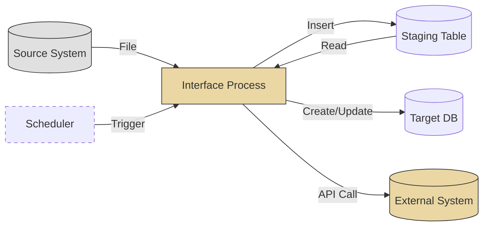
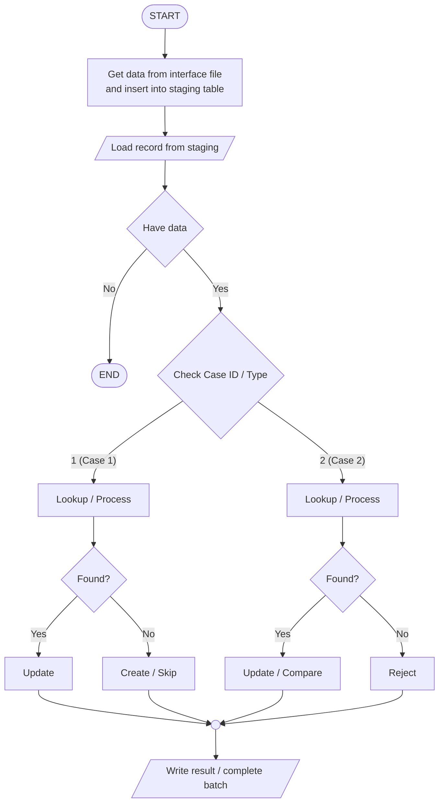

# Interface Functions — Output Template (Interface File)

> เลือกรูปแบบที่เหมาะสม:
> - **รูปแบบ A (ย่อ)** — สำหรับ interface ที่ไม่ซับซ้อน (single entity, SFTP sync)
> - **รูปแบบ B (เต็ม)** — สำหรับ interface ที่ซับซ้อน (multi-entity, API integration, branching logic)

---

## รูปแบบ A — Simple Interface File

```markdown
---
function_id: "IFF-[NNN]"
function_name: "[Interface File Name]"
category: "Interface File"
direction: "[Inbound / Outbound]"
version: "1.0"
status: "Draft"
author: ""
last_updated: ""
---

# IFF-[NNN] — [Interface File Name]

## 1. Overview

| รายการ | รายละเอียด |
| --- | --- |
| Function ID | IFF-[NNN] |
| Interface Name | [ชื่อ interface] |
| Category | Interface File |
| Direction | [Inbound / Outbound / Bidirectional] |
| Pattern | [SFTP / FTP / Blob Storage / Shared Folder / Local Folder] |
| Description | [อธิบาย interface] |
| Source System | [ระบบต้นทาง] |
| Destination System | [ระบบปลายทาง] |
| Related Requirement IDs | [SIR-xxx, IF-xxx] |

## 2. Business Purpose

[ทำไม interface นี้ถึงมีอยู่]

## 3. Interface Description

| รายการ | รายละเอียด |
| --- | --- |
| Protocol | [SFTP / FTP / Azure Blob / AWS S3 / Shared Folder / Local Folder] |
| Authentication | [SSH Key / Username-Password / Access Key / Certificate] |
| Frequency | [Daily Batch / Hourly / Weekly / Event-driven] |
| Schedule | [เวลาที่ทำงาน เช่น ทุกวัน 02:00 ICT] |
| Timeout | [ต้องเสร็จภายในเวลา] |
| Retry Policy | [จำนวนครั้ง, interval, escalation] |

## 4. File Specification

### 4.1 File Format

| รายการ | รายละเอียด |
| --- | --- |
| File Format | [CSV / TSV / Fixed-width / XML / JSON / Excel / DAT] |
| Encoding | [UTF-8 / TIS-620 / Windows-874] |
| Delimiter | [Comma / Tab / Pipe / Fixed-width] |
| Header Row | [Yes / No] |
| Line Ending | [CRLF / LF] |
| Max File Size | [ขนาดไฟล์สูงสุด] |

### 4.2 File Naming Convention

| รายการ | รายละเอียด |
| --- | --- |
| Pattern | [PREFIX_YYYYMMDD_HHMMSS.ext] |
| Example | [DATA_20260417_020000.csv] |
| Checksum File | [Yes / No — ถ้า Yes ระบุ pattern เช่น .md5, .sha256] |

### 4.3 File Path

| รายการ | Path |
| --- | --- |
| Source Path | [/outbound/[system]/] |
| Destination Path | [/inbound/[system]/] |
| Archive Path | [/archive/[system]/YYYYMMDD/] |
| Error Path | [/error/[system]/YYYYMMDD/] |

## 5. Data Mapping

### Inbound / Outbound Data

| No | Source Field | Dest Field | Data Type | Length | Required | Default | Transformation |
| :---: | --- | --- | --- | --- | --- | --- | --- |
| 1 | | | | | | | |

### Sample Data

```text
[ตัวอย่างข้อมูลในไฟล์ 2-3 แถว]
```

## 6. Trigger / Timing

| Trigger | Description | Timing |
| --- | --- | --- |
| [Scheduled / Event / Manual] | [คำอธิบาย] | [เวลา/เงื่อนไข] |

## 7. Processing Logic

### 7.1 Pre-processing

- [ตรวจสอบ checksum]
- [ตรวจสอบ file format / encoding]
- [ตรวจสอบ file naming convention]

### 7.2 Data Processing

- [Validate แต่ละ record]
- [Insert / Update / Upsert logic]
- [Duplicate handling]

### 7.3 Post-processing

- [ย้ายไฟล์ไป archive]
- [สร้าง processing log / summary]
- [แจ้ง notification]

## 8. Expected Result

| Scenario | Expected Result |
| --- | --- |
| Success | [ผลลัพธ์เมื่อสำเร็จ] |
| Partial Success | [ผลลัพธ์เมื่อบาง record ผิดพลาด] |
| Failure | [ผลลัพธ์เมื่อล้มเหลวทั้งหมด] |

## 9. Error Handling

| Error Case | System Behavior | Recovery |
| --- | --- | --- |
| Connection fail | [Retry + alert] | [Admin ตรวจสอบ] |
| File not found | [Log + alert] | [Source system ส่งไฟล์ใหม่] |
| File format invalid | [Reject file + alert] | [Source system แก้ไขแล้วส่งใหม่] |
| Checksum mismatch | [Reject file + alert] | [Source system ส่งไฟล์ใหม่] |
| Record validation fail | [Skip record + log] | [แก้ไข record แล้ว reprocess] |

## 10. Business Rules

| Rule ID | Business Rule | Impact | Source |
| --- | --- | --- | --- |
| BR-IFF[NNN]-001 | [อธิบาย rule] | [ผลกระทบ] | [Reference] |

## 11. Monitoring & Alerting

| Event | Alert Channel | Recipient |
| --- | --- | --- |
| Processing complete | [Email / SMS / Dashboard] | [Admin / Support Team] |
| Processing failed | [Email / SMS / PagerDuty] | [Admin / On-call] |
| File not received | [Email] | [Source system contact] |

## 12. Notes / Assumptions

| ประเภท | รายละเอียด | ผลกระทบ |
| --- | --- | --- |
| | | |

## Change Log

| Version | Date | Author | Change Type | Description |
|---------|------|--------|-------------|-------------|
| 1.0 | | | Created | สร้างเอกสารครั้งแรก |
```

---

## รูปแบบ B — Complex Interface File (Multi-entity, API Integration, Branching)

```markdown
# IFF-[IB/OB]-[NNN] — [Interface File Name]

**Doc No:** PRJ-FNC-IFF-[IB/OB]-[NNN]

| Project Name | System Name | Team Name | Phase | Screen Outline |
|---|---|---|---|---|
| [Project] | [System] | [Team] | Design | — |

---

## 1. Outline

**Function Name:** [ชื่อ function]
**Input/Output file:** [ประเภทไฟล์ เช่น Text file (DAT format)]

### Solution

- **Solution Name:** [ชื่อ solution]
- **Package Name:** [ชื่อ package]

### Process Flow Diagram (System Overview)



### Process Flow Diagram (Outline Process)



---

## 2. Item Description (Interface File Layout — Summary)

Function Name: *[ชื่อ function]*

| No. | Item | Type | Length | Data Source (Table) | Data Source (Field) | Mandatory |
|---:|---|---|---|---|---|---|
| 1 | [Field 1] | Label | - | - | - | - |
| 2 | [Field 2] | Label | - | - | - | - |

---

## 3. Process Description

### 1. Get data from interface file and insert into staging table

#### 1.1 Check inbound/outbound folder for file

- **Path:** `[file path]`
- **File Name:** `[PREFIX_YYYYMMDDHHMMSS_KEY.ext]`

##### 1.1.1 Not exist folder / No file
- Do nothing.

##### 1.1.2 Exist folder / File found

**1) Read data from file**

| No. | Field | Data Source | Remark |
|---|---|---|---|
| 1 | [Field] | File from Process 1.1 | |

**2) Insert data into staging table**

Entity: **[staging_table_name]**

| No. | Field | Data Source | Value | Remark |
|---|---|---|---|---|
| 1 | Record_No | - | Auto generate | |
| 2 | File_Name | File name from process 1.1 | | |
| 3 | [Field] | Receive value from 1.1.2-1) | | |

- **Case failed:** Do not insert any record. → End
- **Case success:** Go to process 2.

---

### 2. Read record from staging table

#### 2.1 Read record by file name

Entity: **[staging_table_name]**

**Condition:**
```sql
[SQL condition to filter by file name + date]
```

#### 2.2 Check result
- **Have data:** Go to process 3.
- **Have no data:** End.

---

### 3. Check Case ID / Process Type

#### 3.1 If Case ID = 1 ([Case Name])

[Describe lookup → found/not found branching → entity CRUD]

**a) Lookup [entity]**

| No. | Field | Data Source | Value | Remark |
|---|---|---|---|---|
| 1 | [Field] | [Source] | [Value] | |

- Case success: go to next step
- Case failed: keep error in log file and read next record

**b) Create/Update [entity]**

Entity: **[Entity Name]**

| No. | Field | Data Source | Value |
|---|---|---|---|
| 1 | [Field] | [Source] | [Value] |

**c) Call External API (ถ้ามี)**

**c.1) Register session (API0010 pattern)**

| No. | Item | Data Source | Value |
|---|---|---|---|
| 1 | appID | Fix | `"[application_key]"` |

**c.2) Receive return value**

| No. | Item | Data Source | Value | Remark |
|---|---|---|---|---|
| 1 | success | Return value from API | True/False | |
| 2 | Error_Flag | Return value from API | Error_Flag | Blank/1/2 |

- **success = True:** Continue
- **success = False, Error_Flag = 1:** Log to history + reject → Next record
- **success = False, Error_Flag = 2:** Log to history + reject → Next record

**c.3) Send data to API**

| No. | Item | Data Source | Value | Remark |
|---|---|---|---|---|
| 1 | [Param] | [Source] | [Value] | |

**c.4) Log API result to history table**

| No. | Parameter Name | Data Source | Value |
|---|---|---|---|
| 1 | ID | - | Running number |
| 2 | [Request params] | Request Parameter from API | |
| 3 | success | Return Parameter from API | |
| 4 | message | Return Parameter from API | |
| 5 | Created_date | - | System datetime |

---

#### 3.2 If Case ID = 2 ([Case Name])

[Same pattern as 3.1 — lookup → branch → CRUD → API → log]

---

#### 3.3 If Case ID = 3 ([Case Name])

[Same pattern]

---

### 4. Read the next record

Loop back to step 2 until all records are processed.

---

## 4. Outline Process — Flow Summary

1. **START** → [Step 1 description]
2. **[Step 2]** → Have data? (Y/N — if N, END)
3. **Check Case ID** — branches:

### Case ID = 1 ([Name])
- [Decision tree description]

### Case ID = 2 ([Name])
- [Decision tree description]

### Case ID = 3 ([Name])
- [Decision tree description]

4. **Read next record** → loop. **END** after all processed.

---

## 5. Screen Display (ถ้ามี)

| No. | Item | Data Source | Value |
|---|---|---|---|
| 1 | [Field] | [Entity] | [Field Name] |

---

## 6. Database Tables Reference

### Staging Table: `[tmp_table_name]`

- **Primary Key:** `Record_No`

| No. | Item | Field Name | Type | Byte | Allow Null | Default | Remarks |
|---|---|---|---|---|---|---|---|
| 1 | Record_No | Record_No | NUMBER | 7 | No | | Auto generate |
| 2 | File_Name | File_Name | VARCHAR | 250 | Yes | | |
| 3 | [Field] | [Field_Name] | [Type] | [Size] | [Null] | | [Remarks] |

### Reject Table: `[rej_table_name]`

- **Primary Key:** `Record_No`

| No. | Item | Field Name | Type | Byte | Allow Null | Default | Remarks |
|---|---|---|---|---|---|---|---|
| 1 | Record_No | Record_No | NUMBER | 7 | No | | Auto generate |
| 2 | [Mirror staging fields] | | | | | | |
| N-2 | STG_RECORD_NO | STG_RECORD_NO | int | | Yes | | Staging Record number |
| N-1 | STG_SQL_STAGE | STG_SQL_STAGE | int | | Yes | | Reject reason |
| N | STG_INSERT_BY_PGM | STG_INSERT_BY_PGM | int | | Yes | | Reject step |

---

## 7. Revision History

| Revision | Revised Date | Revised By | Description | Remark |
|---|---|---|---|---|
| 1.0 | | | Create all sheet | |

### Key Updates

- **v1.0:** [Summary of initial version]
```

---

## Outbound-specific Sections

สำหรับ outbound interface ที่ต้องดึงข้อมูลจาก DB + เรียก API + สร้างไฟล์:

```markdown
### Source Data Query

**Tables:**
- [Table 1]
- [Table 2]

**Conditions:**
```sql
[SQL query with WHERE conditions]
```

### Create interface file (Without enriched data)

| No. | Item | Data Source | Value |
|---:|---|---|---|
| 1 | [field] | [Table] | [Field] |
| 2 | [consent_field] | Fix | `""` |

### Create interface file (With enriched data)

| No. | Item | Data Source | Value |
|---:|---|---|---|
| 1 | [field] | [Table] | [Field] |
| 2 | [consent_field] | Return value from API | If [Value] = 1 Then 'Y'; Else If [Value] = '-1' Then 'N'; Else blank |

### Exception error
- Not write interface file
- End process
```
