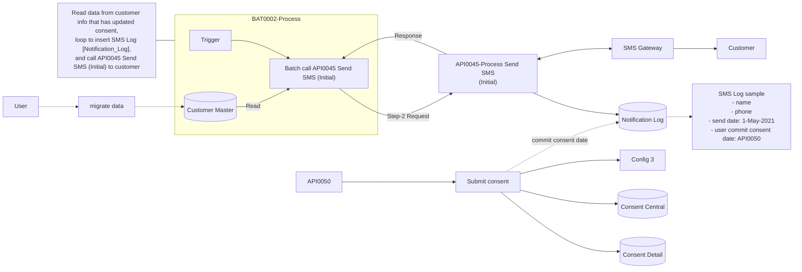
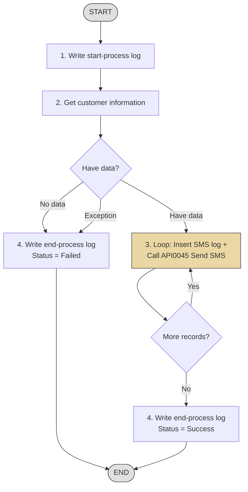

# Batch Functions — Output Sample

# BAT-001 — Nightly Employee Sync

## 1. Overview

| รายการ | รายละเอียด |
| --- | --- |
| Function ID | BAT-001 |
| Batch Name | Nightly Employee Sync |
| Category | Batch |
| Batch Type | Data Sync |
| Description | Sync ข้อมูลพนักงานจาก HRIS เข้าสู่ระบบทุกคืน |
| Schedule | ทุกวัน 02:00 ICT (รวมวันหยุด) |
| Max Duration | 1 ชั่วโมง (ต้องเสร็จก่อน 03:00 ICT) |
| Related Requirement IDs | SIR-001, IF-001, INT-001 |

## 2. Business Purpose

ให้ระบบมีข้อมูลพนักงานที่เป็นปัจจุบันจาก HRIS ทุกวัน โดยไม่ต้องบันทึกซ้ำ

## 3. Process Flow

| Step | Action | Description | Error Handling |
| --- | --- | --- | --- |
| 1 | Connect SFTP | เชื่อมต่อ HRIS SFTP server ด้วย SSH key | Retry 3 ครั้ง ห่าง 15 นาที แล้วแจ้ง admin |
| 2 | Download File | ดึงไฟล์ CSV จาก SFTP | ถ้าไม่พบไฟล์ → log warning แล้วจบ |
| 3 | Verify Checksum | ตรวจสอบ SHA-256 checksum | ถ้าไม่ตรง → reject file แล้วแจ้ง admin |
| 4 | Parse CSV | อ่านไฟล์ CSV เข้า staging table | ถ้า format ผิด → log error record แล้วข้ามไป |
| 5 | Validate Data | ตรวจสอบ required fields, data type | Record ที่ fail → เก็บใน error table |
| 6 | Merge to Production | Upsert จาก staging เข้า production table | ใช้ transaction — rollback ถ้า fail |
| 7 | Handle Inactive | Deactivate account สำหรับ status = INACTIVE/TERMINATED | Cancel คำขอ Pending อัตโนมัติ |
| 8 | Log Result | บันทึก job result | — |

## 4. Input / Output

### Input

| Source | Data | Format | Description |
| --- | --- | --- | --- |
| HRIS SFTP | Employee master | CSV (UTF-8 BOM) | ไฟล์ HRIS_EMP_MASTER_YYYYMMDD_HHMMSS.csv |
| HRIS SFTP | Checksum | Text | ไฟล์ .sha256 คู่กับ data file |

### Output

| Destination | Data | Format | Description |
| --- | --- | --- | --- |
| Database | Employee table | SQL Upsert | อัปเดตข้อมูลพนักงาน |
| Database | Batch Log table | SQL Insert | บันทึก job result |
| Email | Admin notification | Email | แจ้งเมื่อ fail |

## 5. Business Rules

| Rule ID | Business Rule | Impact | Source |
| --- | --- | --- | --- |
| BR-BAT001-001 | HRIS เป็น single source of truth | ห้ามสร้างพนักงานในระบบโดยตรง | SIR-001 |
| BR-BAT001-002 | Inactive → deactivate + cancel pending | คำขอ Draft ถูกลบ, Pending ถูก cancel | MISS-014 |
| BR-BAT001-003 | Full sync ทุกรอบ | ส่งข้อมูล active ทั้งหมดทุกครั้ง | MISS-012 |

## 6. Error Handling & Retry

| Error Case | Behavior | Retry | Alert |
| --- | --- | --- | --- |
| SFTP connection fail | Log error | 3 ครั้ง ห่าง 15 นาที | Email admin |
| File not found | Log warning, จบ job | ไม่ retry | ไม่แจ้ง (อาจยังไม่วางไฟล์) |
| Checksum mismatch | Reject file | ไม่ retry | Email admin + HRIS team |
| Parse error (record) | Skip record, log error | ไม่ retry | รวมใน job summary |
| Database error | Rollback transaction | 1 ครั้ง | Email admin |

## 7. Monitoring

| Metric | Description | Threshold |
| --- | --- | --- |
| Duration | ระยะเวลาทำงาน | > 30 นาที = Warning, > 60 นาที = Critical |
| Failed Records | จำนวน record ที่ fail | > 0 = Warning, > 10 = Critical |
| Job Status | สถานะ batch | Failed = Critical |
| Records Processed | จำนวน record ที่ประมวลผล | 0 = Warning (อาจไม่มีไฟล์) |

## 8. Notes / Assumptions

| ประเภท | รายละเอียด | ผลกระทบ |
| --- | --- | --- |
| Assumption | HRIS วางไฟล์ก่อน 01:30 ICT ทุกวัน | ถ้าวางช้า batch จะไม่พบไฟล์ |
| Constraint | ต้องเสร็จก่อน 03:00 ICT | ไม่ให้ชนกับ backup window (03:00-04:00) |

## Change Log

| Version | Date | Author | Change Type | Description |
|---------|------|--------|-------------|-------------|
| 1.0 | 2026-04-16 | SA Team | Created | สร้างเอกสารครั้งแรก |

---
---

# BAT-002 — Batch Send SMS to Customer

**Doc No:** PRJ-FNC-BAT-0002

| Project Name | System Name | Team Name | Phase |
|---|---|---|---|
| Data Privacy Management | Consent Management System | Development Team | Design |

| Field | Value |
|---|---|
| Function ID | BAT0002 |
| Function Name | Batch Insert Consent Detail from Central |
| Version | 0.2 |
| Created By | BA Team — 2021-04-28 |
| Updated By | BA Team — 2021-04-28 |

---

## 1. Overview

| รายการ | รายละเอียด |
| --- | --- |
| Function ID | BAT-002 |
| Batch Name | Batch Send SMS to Customer |
| Category | Batch |
| Batch Type | Notification (API Caller) |
| Description | อ่านข้อมูลลูกค้าที่ consent ถูกอัปเดต แล้วส่ง SMS ผ่าน API ทีละ record |
| Schedule | Scheduled batch (configurable) |
| Max Duration | Configurable |
| Related Requirement IDs | — |

### System Overview Diagram

## 2. Business Purpose

ส่ง SMS แจ้งลูกค้าที่มีการอัปเดต consent โดยอัตโนมัติ รวมถึงลูกค้าที่ยังไม่ตอบกลับภายในระยะเวลาที่กำหนด

## 3. Process Outline

### Process Steps Summary

1. **Initial Process** — Write start-process log to Process Log
2. **Get Customer Information** — Query customers with updated consent from Customer Master + Consent Detail + Notification Log
3. **Loop Records & Call API** — For each customer: insert SMS log → call API0045 Send SMS → handle response
4. **Write End-Process Log** — Log success or failure

---

## 4. Process Description

### 4.1 Initial Process

Write a start-process log into **Process Log**:

| Field | Value |
|---|---|
| Program ID | BAT0002 |
| Date/Time | System datetime |
| Title | Start process |
| Status | Successed |
| Src_01, Src_02, Ref_ID | blank |

### 4.2 Get Customer Information

**Source tables:**
- **Customer Master** — main customer data
- **Consent Detail** — consent status per customer
- **Config Master** (KEY = '62') — additional filter conditions (VALUE2 = field name, VALUE3 = condition value)
- **Notification Log** — SMS send history

**Query logic:**

| Condition | Description |
|---|---|
| Customer exists in Customer Master but NOT in Consent Detail | ลูกค้าที่ยังไม่มี consent detail |
| Customer exists in Notification Log with no response AND expiry period passed | ลูกค้าที่ส่ง SMS แล้วแต่ยังไม่ตอบกลับภายในระยะเวลาที่กำหนด |

**Notification Log filter conditions:**

| Field | Condition |
|---|---|
| METHOD_TYPE | = "2" (SMS) |
| PROCESS_TYPE | = "1" (Insert) |
| UPDATE_BY_PGM | = "" (no response) |
| CUSTOMER_ID | = matching customer |

**Expiry control:** Config Master KEY = "64" (configured by hour)

**Customer fields retrieved:**

`CUSTOMER_ID`, `Revision`, `SOURCE_01`, `SOURCE_02`, `SOURCE_03`, `PERSONID_01`, `PERSONID_02`, `F_NAME`, `L_NAME`, `PHONE_NO`, `CARD_ID`, `EMAIL_ADDR`, `LINE_ID`, `EFFECTIVE_DATE`, `EXPIRATION_DATE`, `STATUS`, `ALLOW_EDIT`, `CUSTOMER_TYPE`, `REGISTER_DATE`, `REGISTER_BY_PGM`, `REGISTER_BY`

#### 4.2.1 Exception Handling

| Case | Action |
|---|---|
| Exception error | Write failure log (Title: "System exception error", Message: system error message) → Write end-process log → End |
| No data | Write failure log for "Get data from Customer Master" using Config Master (KEY='09', VALUE2='ERR0077') → Write end-process log → End |
| Have data | Continue to process 4.3 |

### 4.3 Loop Records and Call API0045

- **API ID:** API0045
- **API Name:** Send SMS/Email to Customer (Initial)
- **API Description:** For send SMS/Email to customer (Initial)

#### 4.3.1 Sending Parameters

| No. | Parameter | Data Source | Value / Remark |
|---:|---|---|---|
| 1 | appKey | Fix | Application key (defined in config) |
| 2 | sessKey | Fix | blank |
| 3 | F_Request_Type | Fix | `2` (SMS) |
| 4 | F_Phone_No | Customer Master | PHONE_NO |
| 5 | F_Email | Customer Master | EMAIL_ADDR |
| 6 | F_Sms | Customer Master | PHONE_NO — formatted as country code + mobile prefix + 8 digits (e.g. 0857489334 → 66857489334) |
| 7 | F_Page | Fix | blank |
| 8 | F_Process_Type | Fix | `1` (Insert) |
| 9 | F_REGIS_BY_PGM | Fix | BAT0002 |
| 10 | F_REGIS_BY | Config Master | KEY='62', VALUE2='REGISTER_BY' |
| 11 | F_Customer_Info | Object Array | Contains: F_Customer_ID, F_Cus_Revision, F_Reason_Code, F_Remark |
| 12 | F_Consent_HD_ID | Fix | blank |
| 13 | F_Consent_HD_REVISION | Fix | blank |

#### 4.3.2 API Return Handling

| Field | Description |
|---|---|
| success | `true` / `false` |
| message | Error code + message |
| Error_Flag | blank = no error, `1` = validation error, `2` = system error |

| Case | Action |
|---|---|
| Exception error | Log failed system exception → Write end-process log → End |
| success = False | Log failed API call: `[Error_Flag] + " - " + [message]` → Continue to end-of-record check |
| success = True | Log successful API call: `[message]` → Continue to end-of-record check |

#### 4.3.3 End-of-Record Logic

| Condition | Action |
|---|---|
| Records remain | Go to next customer record (loop back to 4.3) |
| No records remain | Write end-process log → End |

### 4.4 Write Log End Process

| Case | Title | Status | Message |
|---|---|---|---|
| Failed | End process | Failed | Error message of each case |
| Success | End process | Successed | Config Master KEY='09', VALUE2='INF0004' → "INF0004 - Process successfully" |

---

## 5. Input / Output

### Input

| Source | Data | Description |
| --- | --- | --- |
| Customer Master | Customer records with updated consent | ลูกค้าที่ consent ถูกอัปเดต |
| Consent Detail | Consent status per customer | สถานะ consent |
| Config Master | Filter conditions + expiry config | เงื่อนไขการกรอง + ระยะเวลาหมดอายุ |
| Notification Log | SMS send history | ประวัติการส่ง SMS |

### Output

| Destination | Data | Description |
| --- | --- | --- |
| Notification Log | SMS log record | บันทึกการส่ง SMS |
| Process Log | Start/End process log | บันทึก batch execution |
| External API (API0045) | SMS request | ส่ง SMS ไปยังลูกค้า |

## 6. Error Handling & Retry

| Error Case | Behavior | Retry | Alert |
| --- | --- | --- | --- |
| System exception | Log error, end process | No | Via process log |
| No customer data | Log info, end process | No | Via process log |
| API call failed (validation) | Log error, continue next record | No | Via process log |
| API call failed (system) | Log error, end process | No | Via process log |

## 7. Sample / Reference Data

| Customer | Phone | Send Date | API | Config |
|---|---|---|---|---|
| Customer A | xxxx | 1-May-2021 | API0050 | 3 |
| Customer B | bbbb | 1-May-2021 | API0050 | — |

## 8. Notes / Assumptions

| ประเภท | รายละเอียด | ผลกระทบ |
| --- | --- | --- |
| Assumption | Phone number ต้อง format เป็น country code + number | ตัด +66 prefix, เก็บเป็น 09XXXXXXX |
| Assumption | Expiry period กำหนดใน Config Master (KEY=64) เป็นชั่วโมง | ส่ง SMS ซ้ำเมื่อหมดอายุ |
| Note | Item Description section ยังไม่มีรายละเอียด | ต้องเพิ่มเมื่อ finalize |

## Change Log

| Version | Date | Author | Change Type | Description |
|---------|------|--------|-------------|-------------|
| 0.1 | 2020-04-28 | BA Team | Created | สร้างเอกสารครั้งแรก |
| 0.2 | 2021-05-10 | BA Team | Updated | เพิ่ม where-condition logic: include records ที่อยู่ใน Customer Master แต่ไม่อยู่ใน Notification Log หรือ records ที่ไม่มี response ภายในระยะเวลาที่กำหนด |
