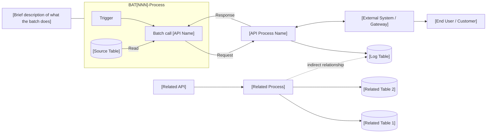
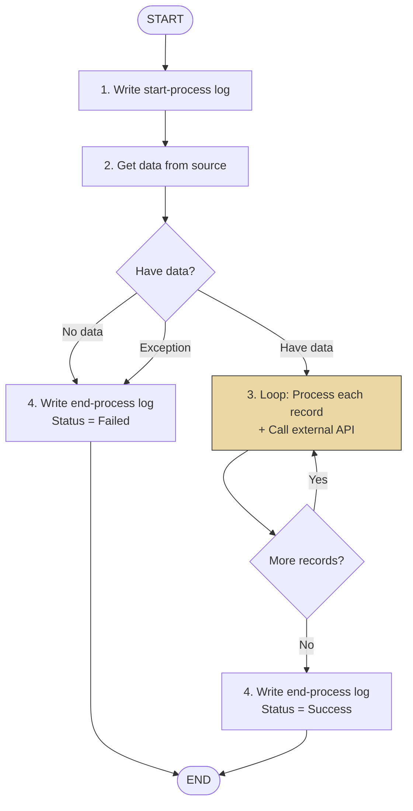

# Batch Functions — Output Template

> เลือกรูปแบบที่เหมาะสม:
> - **รูปแบบ A (ย่อ)** — สำหรับ batch ที่ไม่ซับซ้อน (file sync, simple calculation)
> - **รูปแบบ B (เต็ม)** — สำหรับ batch ที่ซับซ้อน (API caller, multi-table query, config-driven logic)

---

## รูปแบบ A — Simple Batch

```markdown
---
function_id: "BAT-[NNN]"
function_name: "[Batch Name]"
category: "Batch"
version: "1.0"
status: "Draft"
author: ""
last_updated: ""
---

# BAT-[NNN] — [Batch Name]

## 1. Overview

| รายการ | รายละเอียด |
| --- | --- |
| Function ID | BAT-[NNN] |
| Batch Name | [ชื่อ batch job] |
| Category | Batch |
| Batch Type | [Data Sync / Calculation / Export / Cleanup / Notification] |
| Description | [อธิบาย batch job] |
| Schedule | [เวลาที่ทำงาน เช่น ทุกวัน 02:00 ICT] |
| Max Duration | [ระยะเวลาสูงสุดที่ยอมรับได้] |
| Related Requirement IDs | [SIR-xxx, BAT-xxx] |

## 2. Business Purpose

[ทำไม batch job นี้ถึงมีอยู่]

## 3. Process Flow

| Step | Action | Description | Error Handling |
| --- | --- | --- | --- |
| 1 | [Extract / Read] | [อ่านข้อมูลจากไหน] | [ถ้า fail ทำอย่างไร] |
| 2 | [Transform / Process] | [ประมวลผลอย่างไร] | [ถ้า fail ทำอย่างไร] |
| 3 | [Load / Write] | [เขียนข้อมูลไปไหน] | [ถ้า fail ทำอย่างไร] |

## 4. Input / Output

### Input

| Source | Data | Format | Description |
| --- | --- | --- | --- |
| | | | |

### Output

| Destination | Data | Format | Description |
| --- | --- | --- | --- |
| | | | |

## 5. Business Rules

| Rule ID | Business Rule | Impact | Source |
| --- | --- | --- | --- |
| | | | |

## 6. Error Handling & Retry

| Error Case | Behavior | Retry | Alert |
| --- | --- | --- | --- |
| | | | |

## 7. Monitoring

| Metric | Description | Threshold |
| --- | --- | --- |
| Duration | ระยะเวลาทำงาน | > [x] นาที = Warning |
| Failed Records | จำนวน record ที่ fail | > 0 = Warning |
| Job Status | สถานะ batch | Failed = Critical |

## 8. Notes / Assumptions

| ประเภท | รายละเอียด | ผลกระทบ |
| --- | --- | --- |
| | | |

## Change Log

| Version | Date | Author | Change Type | Description |
|---------|------|--------|-------------|-------------|
| 1.0 | | | Created | สร้างเอกสารครั้งแรก |
```

---

## รูปแบบ B — Complex Batch (API Caller / Config-driven / Multi-table)

```markdown
# BAT-[NNN] — [Batch Name]

**Doc No:** PRJ-FNC-BAT-[NNN]

| Project Name | System Name | Team Name | Phase |
|---|---|---|---|
| [Project] | [System] | [Team] | Design |

| Field | Value |
|---|---|
| Function ID | BAT[NNN] |
| Function Name | [ชื่อ function] |
| Version | [x.x] |
| Created By | [ผู้สร้าง — วันที่] |
| Updated By | [ผู้แก้ไข — วันที่] |

---

## 1. Overview

| รายการ | รายละเอียด |
| --- | --- |
| Function ID | BAT-[NNN] |
| Batch Name | [ชื่อ batch job] |
| Category | Batch |
| Batch Type | [Data Sync / Calculation / Export / Cleanup / Notification / API Caller] |
| Description | [อธิบาย batch job] |
| Schedule | [เวลาที่ทำงาน] |
| Max Duration | [ระยะเวลาสูงสุด] |
| Related Requirement IDs | [References] |

### System Overview Diagram



## 2. Business Purpose

[ทำไม batch job นี้ถึงมีอยู่]

## 3. Process Outline



### Process Steps Summary

1. **Initial Process** — Write start-process log
2. **Get Data** — Query source data with config-driven conditions
3. **Loop Records** — Process each record (insert log + call API + handle response)
4. **Write End-Process Log** — Log success or failure

---

## 4. Process Description

### 4.1 Initial Process

Write a start-process log into **Process Log**:

| Field | Value |
|---|---|
| Program ID | BAT[NNN] |
| Date/Time | System datetime |
| Title | Start process |
| Status | Successed |
| Src_01, Src_02, Ref_ID | blank |

### 4.2 Get Data from Source

**Source tables:**
- **[Main Table]** — [description]
- **[Related Table]** — [description]
- **Config Master** (KEY = '[xx]') — additional filter conditions
- **[Log Table]** — [history/status data]

**Query logic:**

| Condition | Description |
|---|---|
| [Condition 1] | [description] |
| [Condition 2] | [description] |

**[Log Table] filter conditions (ถ้ามี):**

| Field | Condition |
|---|---|
| [Field 1] | = "[value]" |
| [Field 2] | = "[value]" |

**Expiry control (ถ้ามี):** Config Master KEY = "[xx]" (configured by [unit])

**Fields retrieved:**

`[field_1]`, `[field_2]`, `[field_3]`, ...

#### 4.2.1 Exception Handling

| Case | Action |
|---|---|
| Exception error | Write failure log → Write end-process log → End |
| No data | Write failure log using Config Master (KEY='09', VALUE2='[ERR_CODE]') → Write end-process log → End |
| Have data | Continue to process 4.3 |

### 4.3 Loop Records and Call API

- **API ID:** [API_ID]
- **API Name:** [API Name]
- **API Description:** [Description]

#### 4.3.1 Pre-API Processing (ถ้ามี)

[Insert log record / prepare data before API call]

| No. | Field | Data Source | Value | Remark |
|---:|---|---|---|---|
| 1 | [Field] | [Source] | [Value] | |

#### 4.3.2 Sending Parameters

| No. | Parameter | Data Source | Value / Remark |
|---:|---|---|---|
| 1 | appKey | Fix | Application key |
| 2 | sessKey | Fix | blank (or from session API) |
| 3 | [Param] | [Source] | [Value] |

#### 4.3.3 API Return Handling

| Field | Description |
|---|---|
| success | `true` / `false` |
| message | Error code + message |
| Error_Flag | blank = no error, `1` = validation error, `2` = system error |

| Case | Action |
|---|---|
| Exception error | Log failed → Write end-process log → End |
| success = False | Log failed: `[Error_Flag] + " - " + [message]` → Continue to end-of-record check |
| success = True | Log success: `[message]` → Continue to end-of-record check |

#### 4.3.4 End-of-Record Logic

| Condition | Action |
|---|---|
| Records remain | Go to next record (loop back to 4.3) |
| No records remain | Write end-process log → End |

### 4.4 Write Log End Process

| Case | Title | Status | Message |
|---|---|---|---|
| Failed | End process | Failed | Error message of each case |
| Success | End process | Successed | Config Master KEY='09', VALUE2='[INF_CODE]' → "[INF_CODE] - [message]" |

---

## 5. Input / Output

### Input

| Source | Data | Description |
| --- | --- | --- |
| [Main Table] | [Data description] | [Details] |
| Config Master | Filter conditions + config | [Details] |

### Output

| Destination | Data | Description |
| --- | --- | --- |
| [Log Table] | [Log record] | [Details] |
| Process Log | Start/End process log | Batch execution log |
| External API | [API request] | [Details] |

## 6. Error Handling & Retry

| Error Case | Behavior | Retry | Alert |
| --- | --- | --- | --- |
| System exception | Log error, end process | No | Via process log |
| No source data | Log info, end process | No | Via process log |
| API call failed (validation) | Log error, continue next record | No | Via process log |
| API call failed (system) | Log error, end process | No | Via process log |

## 7. Sample / Reference Data (ถ้ามี)

| [Column 1] | [Column 2] | [Column 3] |
|---|---|---|
| [Sample row 1] | | |
| [Sample row 2] | | |

## 8. Monitoring

| Metric | Description | Threshold |
| --- | --- | --- |
| Duration | ระยะเวลาทำงาน | > [x] นาที = Warning |
| Failed Records | จำนวน record ที่ fail | > 0 = Warning |
| Job Status | สถานะ batch | Failed = Critical |
| Records Processed | จำนวน record ที่ประมวลผล | 0 = Warning |

## 9. Notes / Assumptions

| ประเภท | รายละเอียด | ผลกระทบ |
| --- | --- | --- |
| | | |

## Change Log

| Version | Date | Author | Change Type | Description |
|---------|------|--------|-------------|-------------|
| 0.1 | | | Created | สร้างเอกสารครั้งแรก |
```
